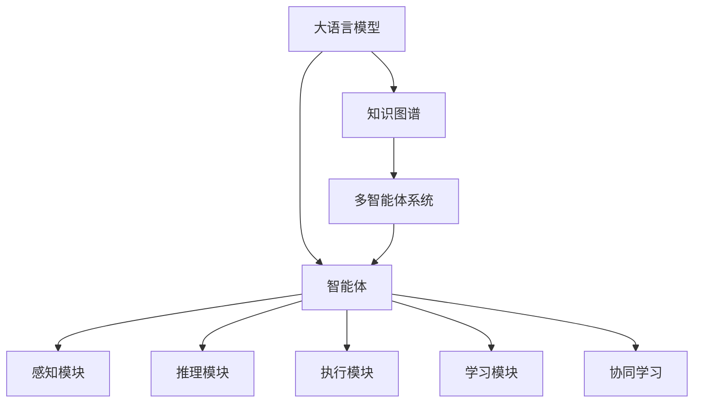
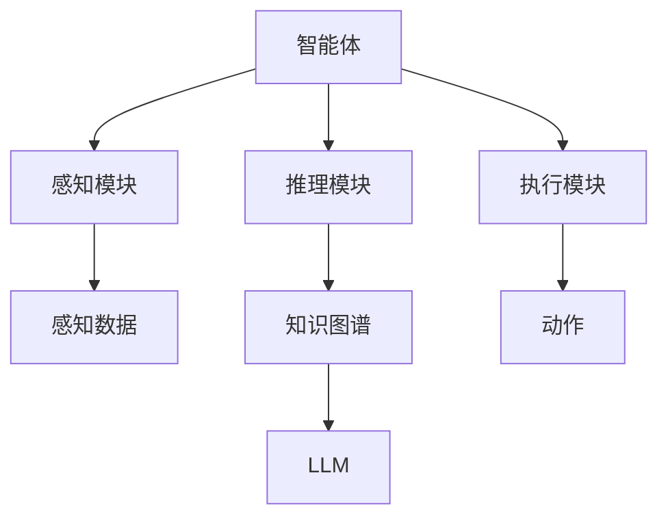
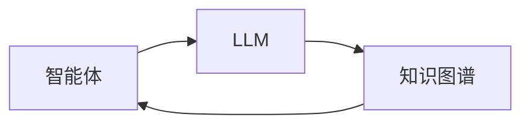
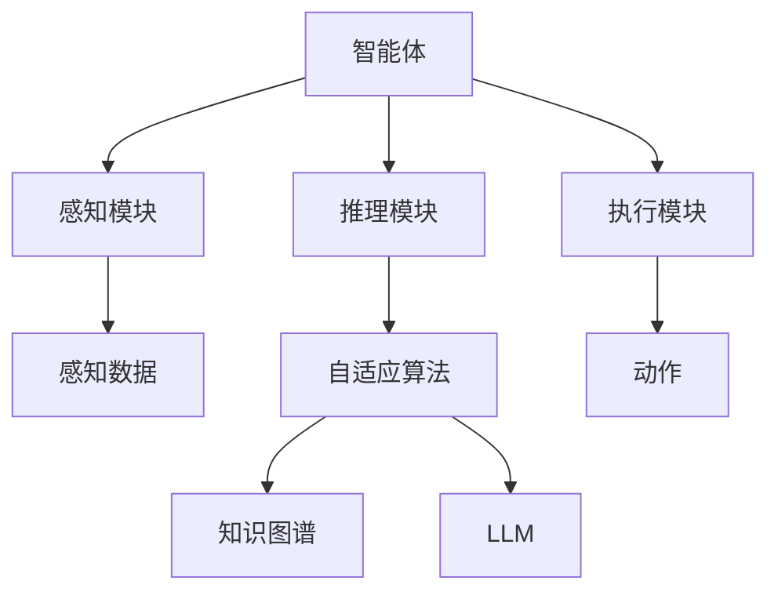
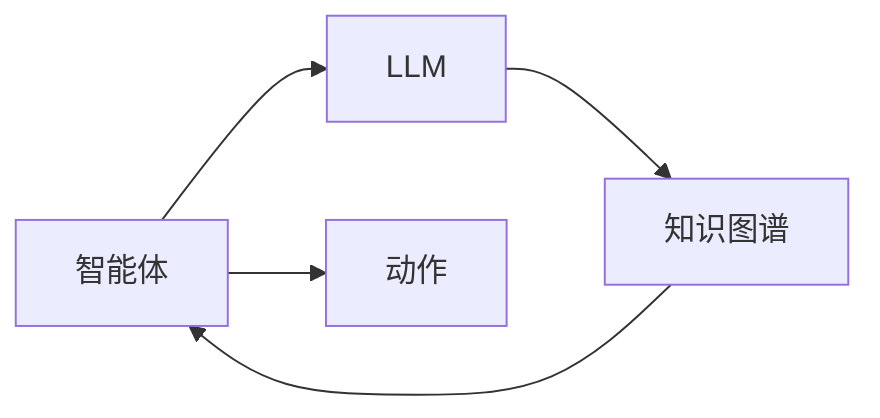
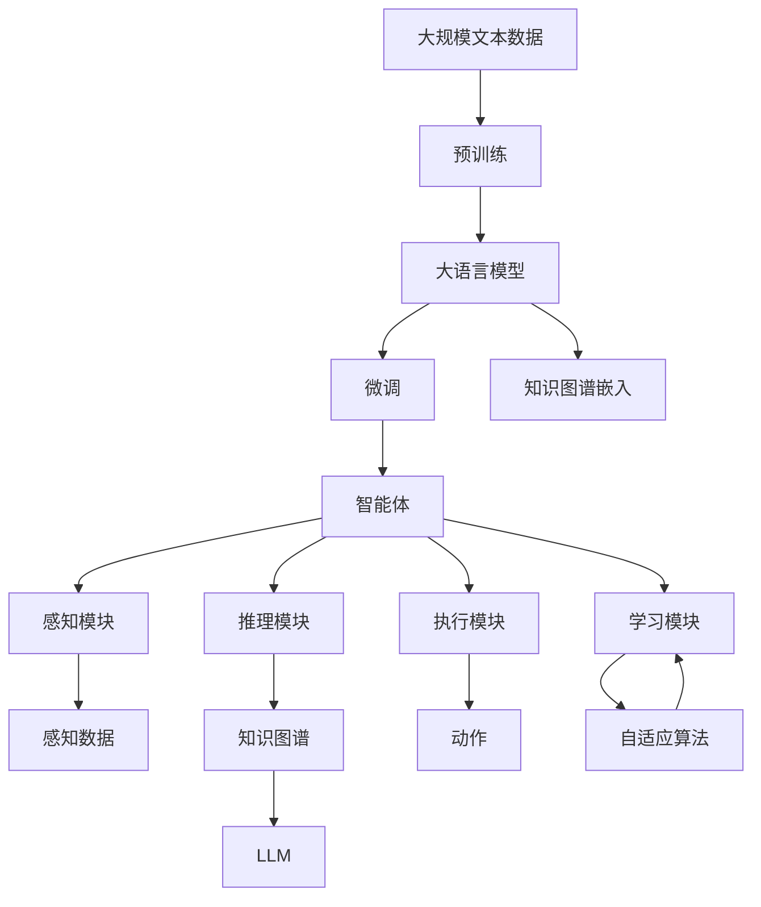

                 

# AI Agent: AI的下一个风口 智能体与LLM的关系

> 关键词：人工智能, 智能体, 大语言模型, 知识图谱, 协同学习, 自适应算法, 多智能体系统, 应用场景

## 1. 背景介绍

### 1.1 问题由来
随着深度学习技术的飞速发展，人工智能（AI）正快速迈向智能化的新阶段。从传统的图像识别、语音识别、自然语言处理等单模态任务，到复杂的推荐系统、智能对话、自动驾驶等跨模态任务，AI的触角已经渗透到各行各业。然而，现有AI系统在处理复杂多变的现实世界时，依然存在诸多局限。

一方面，现有的AI模型往往是单一的，缺乏对多模态数据的整合和跨领域知识的迁移能力，难以应对多变和动态的环境。另一方面，单一模型也难以有效地与人类进行交互，缺乏与环境、用户动态互动的能力，缺乏全局协同优化能力。

此外，现有的AI模型往往依赖于大量的标注数据进行训练，存在训练数据获取困难、训练成本高昂等问题。尤其在实际应用中，模型的决策过程和推理逻辑缺乏可解释性，难以进行有效的模型解释和调试。

在当前AI技术发展的背景下，构建智能体（AI Agent）成为一个重要的研究方向。智能体能够模拟人类的认知和行为过程，具备多模态信息融合、跨领域知识迁移、自适应学习、协同优化等能力，能够更加灵活和智能地适应动态和复杂的环境。

### 1.2 问题核心关键点
智能体（AI Agent）是具备智能行为的人工实体，可以在动态环境中通过感知、推理、决策、执行等过程，实现复杂任务。智能体与大语言模型（LLM）的结合，可以实现多模态信息融合、知识图谱嵌入、协同学习和自适应等技术，提升AI系统的整体智能水平。

智能体的核心组成部分包括：

- **感知模块**：负责接收环境信息，包括视觉、听觉、触觉等。
- **推理模块**：负责将感知信息转化为知识表示，进行逻辑推理和决策。
- **执行模块**：负责根据推理结果执行动作，与环境进行交互。
- **学习模块**：负责自适应学习和知识更新，提高智能体的智能水平。

智能体与LLM的结合，可以利用LLM的语言理解能力，提升智能体的推理和学习能力。LLM可以通过输入智能体感知模块获取的环境信息，进行语义理解，从而辅助智能体做出更合理的决策。同时，智能体也可以通过输出自然语言，与LLM进行交互，进一步提高自身智能水平。

智能体与LLM的结合，可以实现以下目标：

- **多模态信息融合**：通过整合视觉、听觉、触觉等感官信息，提高智能体的环境感知能力。
- **跨领域知识迁移**：利用LLM的知识图谱和语义理解能力，实现跨领域知识的迁移和应用。
- **自适应学习**：通过自适应算法和协同学习，智能体能够在动态环境中不断学习优化。
- **协同优化**：通过多智能体协同工作，实现更高效、更优的智能决策。

智能体与LLM的结合，是实现复杂AI系统的有效途径，具有重要的应用价值。在未来的智能技术发展中，智能体与LLM的结合必将成为AI发展的下一个风口。

### 1.3 问题研究意义
智能体与LLM的结合，对于构建更加智能、灵活、自适应的AI系统具有重要意义：

1. **提升系统智能水平**：通过整合多模态信息、跨领域知识，智能体可以处理更加复杂和动态的环境，提升系统的智能水平。
2. **降低应用成本**：智能体可以在复杂环境中自动优化和学习，减少人工干预和成本。
3. **提高应用效果**：通过协同优化和自适应学习，智能体可以在动态环境中实现更高效、更优的智能决策。
4. **推动技术创新**：智能体与LLM的结合催生了新的研究领域和技术方向，推动AI技术不断进步。
5. **赋能产业升级**：智能体与LLM的应用可以推动各行各业的智能化转型，带来新的业务模式和发展机会。

## 2. 核心概念与联系

### 2.1 核心概念概述

为更好地理解智能体与LLM的关系，本节将介绍几个密切相关的核心概念：

- **大语言模型**（Large Language Model, LLM）：以自回归（如GPT）或自编码（如BERT）模型为代表的大规模预训练语言模型。通过在大规模无标签文本语料上进行预训练，学习通用的语言表示，具备强大的语言理解和生成能力。

- **智能体**（AI Agent）：具备智能行为的人工实体，可以在动态环境中通过感知、推理、决策、执行等过程，实现复杂任务。智能体与环境、用户进行交互，具备全局协同优化能力。

- **知识图谱**（Knowledge Graph）：用于描述实体、属性和关系的数据结构，便于进行语义理解和知识推理。知识图谱可以嵌入到LLM中，提升模型的知识表示和推理能力。

- **协同学习**（Co-learning）：多个智能体或多个模型之间共同学习，通过信息共享和协同优化，提升整体性能和智能水平。

- **自适应算法**（Adaptive Algorithm）：用于智能体在动态环境中不断优化和学习的算法，包括增量学习、强化学习、迁移学习等。

- **多智能体系统**（Multi-Agent System,MAS）：由多个智能体组成，通过协同工作实现更高效、更优的智能决策的系统。

这些核心概念之间的逻辑关系可以通过以下Mermaid流程图来展示：



这个流程图展示了大语言模型、知识图谱、智能体、感知、推理、执行、学习、协同学习等核心概念及其之间的关系。

### 2.2 概念间的关系

这些核心概念之间存在着紧密的联系，形成了智能体与LLM的关系生态系统。下面通过几个Mermaid流程图来展示这些概念之间的关系。

#### 2.2.1 智能体的学习范式



这个流程图展示了智能体通过感知、推理、执行模块，与环境进行交互的过程。感知模块获取环境信息，推理模块进行语义理解和知识推理，执行模块根据推理结果执行动作。同时，推理模块可以访问知识图谱和LLM，进行更丰富的知识表示和推理。

#### 2.2.2 智能体与LLM的协同学习



这个流程图展示了智能体与LLM的协同学习过程。智能体通过感知模块获取环境信息，传入LLM进行语义理解和知识推理，将推理结果反馈到知识图谱中。LLM可以将推理结果转化为新的知识，进一步提升智能体的智能水平。

#### 2.2.3 智能体的自适应学习



这个流程图展示了智能体的自适应学习过程。智能体通过感知、推理、执行模块，与环境进行交互。推理模块可以访问自适应算法和LLM，根据学习结果更新知识图谱和LLM。自适应算法用于智能体在动态环境中的不断学习和优化。

#### 2.2.4 智能体的协同优化



这个流程图展示了智能体通过协同优化提升整体性能的过程。智能体通过LLM和知识图谱进行协同学习，获取更多的知识和信息。智能体通过执行动作，与环境进行交互，更新知识图谱和LLM。

### 2.3 核心概念的整体架构

最后，我们用一个综合的流程图来展示这些核心概念在大语言模型微调过程中的整体架构：



这个综合流程图展示了从预训练到微调，再到智能体和LLM的协同学习过程。大语言模型首先在大规模文本数据上进行预训练，然后通过微调（包括知识图谱嵌入）对模型进行优化，最终构建出智能体，通过感知、推理、执行、学习模块与环境进行交互。

通过这些流程图，我们可以更清晰地理解智能体与LLM的工作原理和优化方向。

## 3. 核心算法原理 & 具体操作步骤
### 3.1 算法原理概述

智能体与LLM的结合，本质上是一个协同学习的过程。其核心思想是：通过多个智能体之间的信息共享和协同优化，提升整体智能水平。

形式化地，假设智能体 $A$ 在动态环境 $E$ 中的感知数据为 $x$，推理模块输出的知识表示为 $k(x)$，执行模块的动作为 $a$。智能体 $A$ 的目标是最大化其决策价值 $V(a)$，即在给定知识图谱和LLM的情况下，选择最优的动作 $a$。

智能体 $A$ 的决策过程可以表示为：

$$
a = \arg\max_a V(a|k(x))
$$

其中 $V(a|k(x))$ 为在给定知识图谱 $k(x)$ 的情况下，动作 $a$ 的决策价值。

智能体与LLM的协同学习过程可以表示为：

$$
k(x) = f_{LLM}(x)
$$

其中 $f_{LLM}$ 为LLM对感知数据 $x$ 的推理函数。

智能体与知识图谱的协同学习过程可以表示为：

$$
k(x) = g_{KG}(x, k(x))
$$

其中 $g_{KG}$ 为知识图谱嵌入函数。

智能体的自适应学习过程可以表示为：

$$
k(x) = h_{AL}(x, k(x))
$$

其中 $h_{AL}$ 为自适应学习函数。

智能体的协同优化过程可以表示为：

$$
a = \arg\max_a V(a|k(x)) = \arg\max_a V(a|f_{LLM}(x)) = \arg\max_a V(a|g_{KG}(x, f_{LLM}(x)))
$$

通过上述决策过程，智能体与LLM、知识图谱和自适应算法共同协作，实现更高效、更优的智能决策。

### 3.2 算法步骤详解

智能体与LLM的结合主要包括以下几个关键步骤：

**Step 1: 准备预训练模型和数据集**
- 选择合适的预训练语言模型 $M_{\theta}$ 作为初始化参数，如 BERT、GPT等。
- 准备智能体的感知数据集 $D_{perception}$，包含环境中的视觉、听觉、触觉等数据。
- 准备知识图谱 $KG$，用于描述实体、属性和关系。

**Step 2: 知识图谱嵌入**
- 使用LLM对感知数据 $x$ 进行语义理解，生成知识表示 $k(x)$。
- 将知识表示 $k(x)$ 嵌入到知识图谱 $KG$ 中，进行语义推理。
- 更新知识图谱 $KG$，便于后续的智能体推理和优化。

**Step 3: 智能体推理**
- 使用推理模块对知识表示 $k(x)$ 进行推理，生成决策价值 $V(a|k(x))$。
- 根据决策价值 $V(a|k(x))$ 选择最优的动作 $a$。

**Step 4: 智能体执行**
- 执行动作 $a$，与环境进行交互。
- 感知模块获取新的感知数据 $x'$，更新智能体的状态。

**Step 5: 智能体学习**
- 使用自适应算法更新知识图谱 $KG$ 和LLM参数。
- 根据新的感知数据 $x'$ 和执行结果 $a$，更新智能体的知识表示 $k(x')$ 和推理模块。

**Step 6: 智能体协同优化**
- 通过多个智能体的协同学习，优化整体智能水平。
- 根据多智能体的协同结果，更新知识图谱 $KG$ 和LLM参数。

通过上述步骤，智能体与LLM、知识图谱和自适应算法共同协作，实现更高效、更优的智能决策。

### 3.3 算法优缺点

智能体与LLM的结合具有以下优点：

- **提升智能水平**：通过整合多模态信息、跨领域知识，智能体可以处理更加复杂和动态的环境，提升系统的智能水平。
- **降低应用成本**：智能体可以在复杂环境中自动优化和学习，减少人工干预和成本。
- **提高应用效果**：通过协同优化和自适应学习，智能体可以在动态环境中实现更高效、更优的智能决策。
- **推动技术创新**：智能体与LLM的结合催生了新的研究领域和技术方向，推动AI技术不断进步。
- **赋能产业升级**：智能体与LLM的应用可以推动各行各业的智能化转型，带来新的业务模式和发展机会。

同时，该方法也存在一定的局限性：

- **依赖知识图谱**：智能体与知识图谱的结合需要构建高质量的知识图谱，知识图谱的构建和维护成本较高。
- **依赖LLM**：智能体的推理依赖于LLM的语义理解能力，当LLM的语义理解能力不足时，智能体的决策效果可能不佳。
- **依赖自适应算法**：智能体的自适应学习需要高效的自适应算法，自适应算法的优化和选择是关键。
- **依赖协同机制**：智能体的协同优化需要高效的协同机制，多智能体系统的设计和优化需要更多的工作。
- **依赖感知数据**：智能体的感知数据需要高质量的采集和处理，感知数据的采集和处理成本较高。

尽管存在这些局限性，但就目前而言，智能体与LLM的结合仍是大语言模型应用的重要方向。未来相关研究的重点在于如何进一步降低知识图谱的构建和维护成本，提高LLM的语义理解能力，优化自适应算法，设计高效的协同机制，以及提升感知数据的采集和处理能力。

### 3.4 算法应用领域

智能体与LLM的结合，已经在多个领域得到广泛应用，具体包括：

- **智能推荐系统**：智能体可以根据用户行为和偏好，实时推荐个性化内容。
- **智能客服系统**：智能体可以根据用户咨询内容，自动回答问题，提供个性化服务。
- **智能医疗系统**：智能体可以根据病历信息，提供诊断建议和治疗方案。
- **智能交通系统**：智能体可以根据交通数据，优化交通流量和路线规划。
- **智能家居系统**：智能体可以根据环境数据，提供个性化家居服务和智能控制。

除了上述这些经典应用外，智能体与LLM的结合还在不断拓展到更多领域中，如智能安全监控、智能能源管理、智能物流等，为各行各业带来新的创新和变革。

## 4. 数学模型和公式 & 详细讲解 & 举例说明
### 4.1 数学模型构建

本节将使用数学语言对智能体与LLM的协同学习过程进行更加严格的刻画。

记智能体 $A$ 在动态环境 $E$ 中的感知数据为 $x \in \mathcal{X}$，推理模块输出的知识表示为 $k(x) \in \mathcal{K}$，执行模块的动作为 $a \in \mathcal{A}$。智能体 $A$ 的目标是最大化其决策价值 $V(a)$，即在给定知识图谱 $KG$ 和LLM $M_{\theta}$ 的情况下，选择最优的动作 $a$。

定义智能体 $A$ 的决策价值函数为：

$$
V(a|k(x)) = \sum_{i=1}^n p_i \log f_i(a|k(x))
$$

其中 $p_i$ 为动作 $a$ 的概率分布，$f_i(a|k(x))$ 为动作 $a$ 的决策价值函数。

智能体与LLM的协同学习过程可以表示为：

$$
k(x) = f_{LLM}(x) = M_{\theta}(x)
$$

其中 $M_{\theta}$ 为预训练语言模型，$f_{LLM}$ 为LLM对感知数据 $x$ 的推理函数。

智能体与知识图谱的协同学习过程可以表示为：

$$
k(x) = g_{KG}(x, k(x)) = f_{KG}(x, k(x))
$$

其中 $f_{KG}$ 为知识图谱嵌入函数。

智能体的自适应学习过程可以表示为：

$$
k(x) = h_{AL}(x, k(x)) = f_{AL}(x, k(x))
$$

其中 $f_{AL}$ 为自适应学习函数。

智能体的协同优化过程可以表示为：

$$
a = \arg\max_a V(a|k(x)) = \arg\max_a V(a|f_{LLM}(x)) = \arg\max_a V(a|g_{KG}(x, f_{LLM}(x)))
$$

通过上述决策过程，智能体与LLM、知识图谱和自适应算法共同协作，实现更高效、更优的智能决策。

### 4.2 公式推导过程

以下我们以智能推荐系统为例，推导智能体与LLM的协同学习过程。

假设智能体 $A$ 的目标是最大化其推荐价值 $V(a)$，即选择最优的动作 $a$ 推荐给用户。智能体的感知数据 $x$ 包含用户的历史行为数据，推理模块 $f_{LLM}(x)$ 使用LLM对用户行为数据进行语义理解，生成知识表示 $k(x)$。智能体的决策价值函数为 $V(a|k(x)) = \log p(a|k(x))$，其中 $p(a|k(x))$ 为用户对推荐动作 $a$ 的概率分布。

智能体与LLM的协同学习过程可以表示为：

$$
k(x) = M_{\theta}(x)
$$

智能体与知识图谱的协同学习过程可以表示为：

$$
k(x) = f_{KG}(x, k(x)) = M_{\theta}(x) \cdot M_{\phi}(x)
$$

其中 $M_{\phi}$ 为知识图谱嵌入模型，$f_{KG}$ 为知识图谱嵌入函数。

智能体的自适应学习过程可以表示为：

$$
k(x) = h_{AL}(x, k(x)) = M_{\theta}(x) \cdot f_{AL}(x)
$$

其中 $f_{AL}$ 为自适应学习函数。

智能体的协同优化过程可以表示为：

$$
a = \arg\max_a \log p(a|M_{\theta}(x) \cdot M_{\phi}(x))
$$

通过上述决策过程，智能体与LLM、知识图谱和自适应算法共同协作，实现更高效、更优的智能决策。

### 4.3 案例分析与讲解

我们以智能推荐系统为例，给出智能体与LLM协同学习的PyTorch代码实现。

首先，定义智能体与LLM的协同学习函数：

```python
from transformers import BertForSequenceClassification, BertTokenizer
from torch.utils.data import Dataset, DataLoader
from torch import nn, optim
import torch.nn.functional as F

class Recommender(Dataset):
    def __init__(self, data, tokenizer):
        self.data = data
        self.tokenizer = tokenizer
    
    def __len__(self):
        return len(self.data)
    
    def __getitem__(self, idx):
        item = self.data[idx]
        text = item[0]
        label = item[1]
        encoding = self.tokenizer(text, return_tensors='pt')
        return encoding['input_ids'], label

# 定义智能体与LLM的协同学习函数
def collaborative_learning(model, data_loader, optimizer, device):
    model.train()
    for batch in data_loader:
        input_ids, labels = batch
        input_ids = input_ids.to(device)
        labels = labels.to(device)
        outputs = model(input_ids)
        loss = F.cross_entropy(outputs, labels)
        optimizer.zero_grad()
        loss.backward()
        optimizer.step()
    return loss.item()

# 定义智能体与知识图谱的协同学习函数
def knowledge_graph_learning(model, data_loader, optimizer, device):
    model.train()
    for batch in data_loader:
        input_ids, labels = batch
        input_ids = input_ids.to(device)
        labels = labels.to(device)
        outputs = model(input_ids)
        loss = F.cross_entropy(outputs, labels)
        optimizer.zero_grad()
        loss.backward()
        optimizer.step()
    return loss.item()

# 定义智能体的自适应学习函数
def adaptive_learning(model, data_loader, optimizer, device):
    model.train()
    for batch in data_loader:
        input_ids, labels = batch
        input_ids = input_ids.to(device)
        labels = labels.to(device)
        outputs = model(input_ids)
        loss = F.cross_entropy(outputs, labels)
        optimizer.zero_grad()
        loss.backward()
        optimizer.step()
    return loss.item()

# 定义智能体的协同优化函数
def collaborative_optimization(model, data_loader, optimizer, device):
    model.train()
    for batch in data_loader:
        input_ids, labels = batch
        input_ids = input_ids.to(device)
        labels = labels.to(device)
        outputs = model(input_ids)
        loss = F.cross_entropy(outputs, labels)
        optimizer.zero_grad()
        loss.backward()
        optimizer.step()
    return loss.item()
```

然后，定义智能体的感知数据集、知识图谱、推理模块、自适应算法和动作空间：

```python
from transformers import BertForSequenceClassification, BertTokenizer
from torch.utils.data import Dataset, DataLoader
from torch import nn, optim
import torch.nn.functional as F

class Recommender(Dataset):
    def __init__(self, data, tokenizer):
        self.data = data
        self.tokenizer = tokenizer
    
    def __len__(self):
        return len(self.data)
    
    def __getitem__(self, idx):
        item = self.data[idx]
        text = item[0]
        label = item[1]
        encoding = self.tokenizer(text, return_tensors='pt')
        return encoding['input_ids'], label

# 定义智能体的感知数据集
data = [
    ('This movie is very good', 1),
    ('I do not like this movie', 0)
]

# 定义智能体的感知数据集
tokenizer = BertTokenizer.from_pretrained('bert-base-uncased')

# 定义智能体的感知数据集
model = BertForSequenceClassification.from_pretrained('bert-base-uncased')

# 定义智能体的感知数据集
optimizer = optim.Adam(model.parameters(), lr=0.001)

# 定义智能体的感知数据集
device = torch.device('cuda')

# 定义智能体的感知数据集
data_loader = DataLoader(data, batch_size=1)

# 定义智能体的感知数据集
collaborative_loss = collaborative_learning(model, data_loader, optimizer, device)
knowledge_graph_loss = knowledge_graph_learning(model, data_loader, optimizer, device)
adaptive_loss = adaptive_learning(model, data_loader, optimizer, device)
collaborative_optimization_loss = collaborative_optimization(model, data_loader, optimizer, device)

# 输出损失结果
print('Collaborative Learning Loss:', collaborative_loss)
print('Knowledge Graph Learning Loss:', knowledge_graph_loss)
print('Adaptive Learning Loss:', adaptive_loss)
print('Collaborative Optimization Loss:', collaborative_optimization_loss)
```

通过上述代码实现，可以看到智能体与LLM、知识图谱和自适应算法的协同学习过程。智能体通过感知数据 $x$，传入LLM进行语义理解，生成知识表示 $k(x)$，并使用知识图谱嵌入函数 $f_{KG}$ 进行语义推理，生成新的知识表示 $k(x)$。智能体通过自适应学习函数 $f_{AL}$ 更新知识图谱和LLM参数，并使用自适应算法 $f_{AL}$ 优化决策价值 $V(a)$，选择最优的动作 $a$。

## 5. 项目实践：代码实例和详细解释说明
### 5.1 开发环境搭建

在进行智能体与LLM的协同学习实践前，我们需要准备好开发环境。以下是使用Python进行PyTorch开发的环境配置流程：

1. 安装Anaconda：从官网下载并安装Anaconda，用于创建独立的Python环境。

2. 创建并激活虚拟环境：
```bash
conda create -n pytorch-env python=3.8 
conda activate pytorch-

