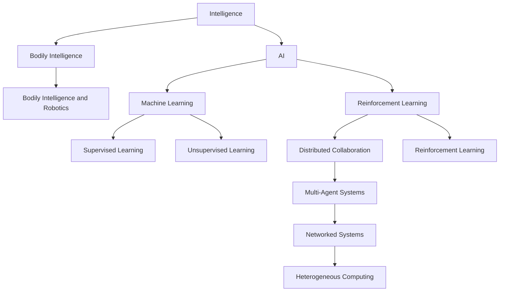
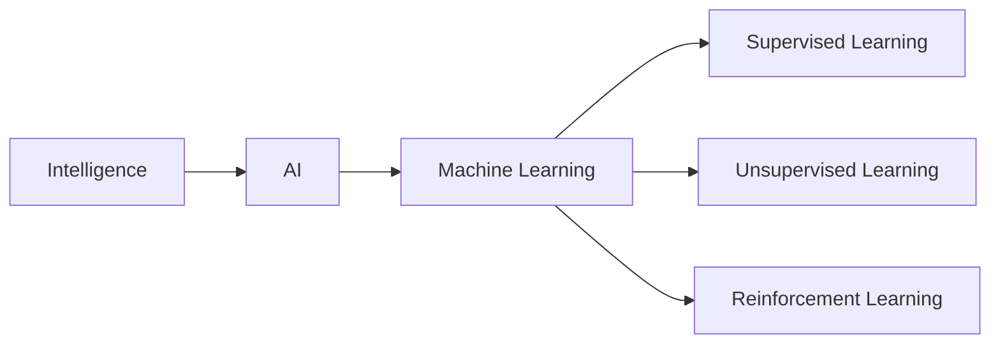
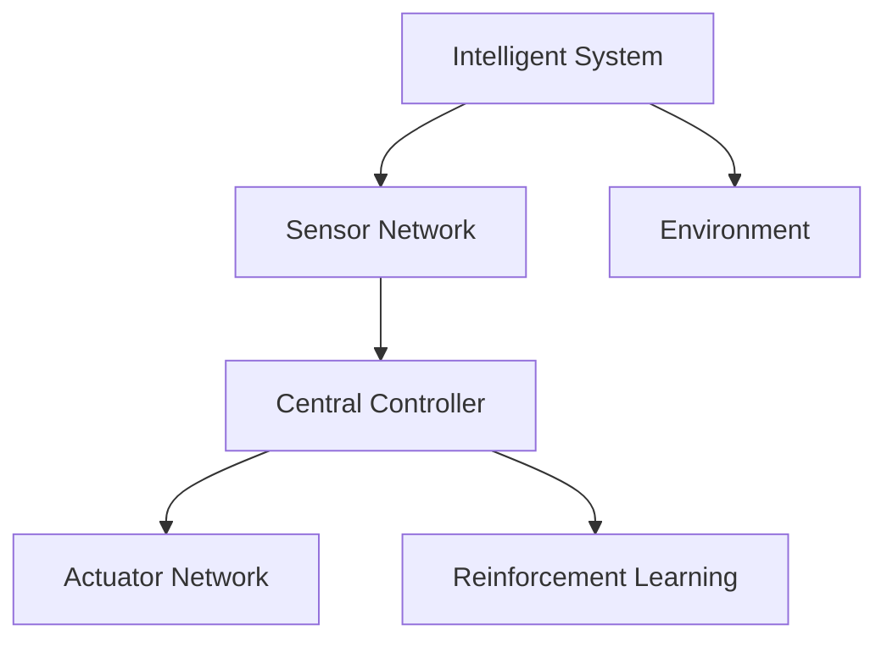
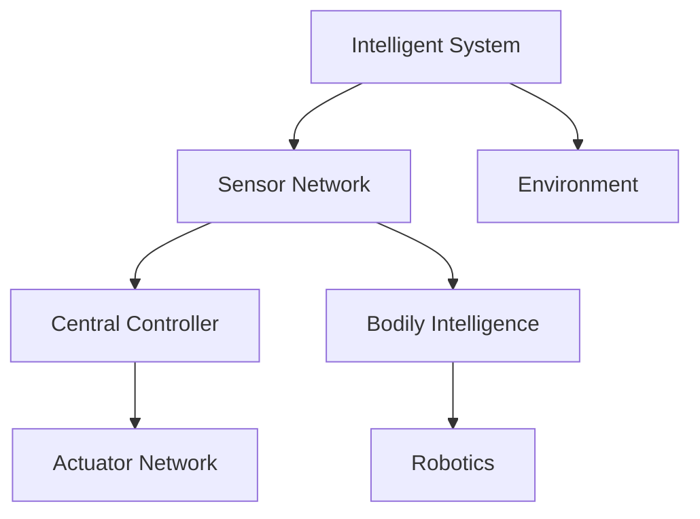

                 

# AI Agent: AI的下一个风口 智能体与具身智能的区别

> 关键词：AI Agent, 智能体, 具身智能, 强化学习, 异构系统, 分布式协作, 异构计算

## 1. 背景介绍

在人工智能领域，近十年来，以深度学习为代表的机器学习技术在图像、语音、自然语言处理等传统领域取得巨大成功。尽管如此，这些技术所依赖的静态数据集和端到端的管道模式，使其在处理复杂多变、动态变化的任务上存在局限。在此背景下，智能体(Agent)技术应运而生，成为AI领域的下一个风口。

智能体，也被称为智能主体，是一种能够在多变量环境中自主决策、动态调整、持续学习的系统。相比于传统的机器学习，智能体更强调系统的自主性和适应性，具备更强的泛化能力和鲁棒性。本文将从智能体与具身智能的概念入手，对比其异同，并探讨其在实际应用中的关键技术。

## 2. 核心概念与联系

### 2.1 核心概念概述

为更好地理解智能体与具身智能的区别，本节将介绍几个密切相关的核心概念：

- **智能体(Agent)**：指一种能够感知环境、执行决策、学习并适应环境的系统。智能体可以是软件、机器人、人类等，只要满足自主性、适应性、智能性等基本属性即可。
- **具身智能(Bodily Intelligence)**：指一种与实体物理形态紧密结合的智能。与传统的符号型智能不同，具身智能更加强调感知、执行、适应等过程，能够更好地处理动态、多模态任务。
- **强化学习(Reinforcement Learning)**：一种基于环境反馈的机器学习技术，通过智能体与环境的互动，不断优化决策策略。强化学习是智能体实现智能化的重要手段。
- **分布式协作(Distributed Collaboration)**：指多个智能体之间通过通信、协作，共同完成更复杂、更高级的任务。分布式协作是智能体实现大尺度应用的关键技术。
- **异构计算(Heterogeneous Computing)**：指利用不同硬件平台的计算资源，实现高效、灵活的计算过程。异构计算是智能体处理复杂系统、优化资源利用率的有效方式。

这些核心概念之间的逻辑关系可以通过以下Mermaid流程图来展示：



这个流程图展示了智能体与具身智能的关键关联与技术实现路径：

1. 智能体与具身智能是人工智能领域的两个重要概念。
2. 具身智能强调实体的物理形态和感知能力，是智能体的重要组成部分。
3. 强化学习是实现智能体智能化的主要方法。
4. 分布式协作与异构计算是智能体实现大尺度应用的技术基础。

### 2.2 概念间的关系

这些核心概念之间存在着紧密的联系，形成了智能体与具身智能的核心技术框架。下面我通过几个Mermaid流程图来展示这些概念之间的关系。

#### 2.2.1 智能体的学习范式



这个流程图展示了智能体的主要学习范式：

1. 智能体主要通过机器学习进行学习和优化。
2. 机器学习包括监督学习、无监督学习和强化学习等不同类型。
3. 强化学习是智能体自主学习的重要手段。

#### 2.2.2 智能体的架构层次



这个流程图展示了智能体的架构层次：

1. 智能体由传感器网络、中央控制器、执行器网络组成。
2. 传感器网络负责感知环境，中央控制器负责决策规划，执行器网络负责执行决策。
3. 智能体与环境的互动过程，主要由强化学习实现。

#### 2.2.3 智能体与具身智能的融合



这个流程图展示了智能体与具身智能的融合：

1. 具身智能与智能体的传感器网络、中央控制器、执行器网络紧密结合。
2. 传感器网络负责感知环境和身体状态，中央控制器结合具身智能进行决策规划，执行器网络负责执行决策。
3. 智能体与环境的互动，主要由强化学习实现。

## 3. 核心算法原理 & 具体操作步骤

### 3.1 算法原理概述

智能体的核心算法原理主要基于强化学习。强化学习通过智能体与环境的互动，不断优化决策策略，使得智能体在特定环境下具备更高的自主性、适应性和智能性。

智能体的算法流程通常包括以下几个步骤：

1. **环境感知**：智能体通过传感器网络感知环境状态，获取周围环境的相关信息。
2. **状态表示**：将感知到的环境信息转换为智能体内部可处理的格式，如向量表示。
3. **决策规划**：智能体的中央控制器根据当前状态和历史经验，制定决策策略。
4. **执行执行**：智能体的执行器网络根据决策结果，执行具体的动作或操作。
5. **环境反馈**：智能体根据执行结果，从环境中获得反馈信息，更新状态表示和决策策略。

智能体的核心算法流程可以表示为如下伪代码：

```python
while not done:
    state = observe()
    action = policy(state)
    next_state, reward, done = execute(action)
    state = next_state
    update_policy(reward, next_state)
```

其中，`state`表示智能体当前的状态，`action`表示智能体当前的动作，`next_state`表示执行动作后的下一个状态，`reward`表示当前状态的奖励，`done`表示是否达到目标状态。`policy`表示智能体的决策策略，`update_policy`表示策略更新算法。

### 3.2 算法步骤详解

智能体的算法步骤主要包括以下几个关键环节：

1. **环境感知**：智能体通过传感器网络获取环境状态。例如，在智能机器人中，传感器网络可以包括摄像头、激光雷达、声音传感器等。
2. **状态表示**：将感知到的环境信息转换为可处理的向量表示。例如，将摄像头图像转换为特征向量，激光雷达点云转换为点云向量。
3. **决策规划**：智能体的中央控制器根据当前状态和历史经验，制定决策策略。常见的决策规划方法包括价值函数、策略网络等。
4. **执行执行**：智能体的执行器网络根据决策结果，执行具体的动作或操作。例如，智能机器人根据决策结果，控制电机、相机等部件。
5. **环境反馈**：智能体根据执行结果，从环境中获得反馈信息，更新状态表示和决策策略。例如，智能机器人通过摄像头和激光雷达获取执行结果，计算奖惩信号。

### 3.3 算法优缺点

智能体具有以下优点：

- 自主性：智能体能够自主感知环境、决策规划和执行操作，具有高度的自主性。
- 适应性：智能体能够根据环境变化动态调整决策策略，具有较强的适应性。
- 可扩展性：智能体能够通过分布式协作，扩展处理复杂系统的能力。
- 泛化能力：智能体具备处理多变量、多模态任务的泛化能力。

但智能体也存在以下缺点：

- 训练复杂：智能体的训练需要大量的环境数据和计算资源，训练过程复杂。
- 控制复杂：智能体的决策和执行过程需要精确控制，实现难度较大。
- 可靠性问题：智能体在复杂环境下可能存在决策错误或执行异常，可靠性有待提高。

### 3.4 算法应用领域

智能体的核心算法原理主要基于强化学习，已在众多领域得到广泛应用。

- **机器人与自动化**：智能体在机器人、自动化系统中的应用广泛。例如，智能机器人、智能制造等。
- **交通系统**：智能体在交通管理、自动驾驶等领域有重要应用。例如，无人驾驶汽车、智能交通信号灯等。
- **金融系统**：智能体在金融交易、风险控制等领域发挥重要作用。例如，高频交易、信用评估等。
- **医疗系统**：智能体在医疗诊断、健康管理等领域应用前景广阔。例如，智能医生、健康监测等。
- **安全系统**：智能体在安全监控、网络防御等领域具有重要价值。例如，入侵检测、网络攻击防御等。

## 4. 数学模型和公式 & 详细讲解 & 举例说明

### 4.1 数学模型构建

智能体的核心算法原理基于强化学习，因此可以从强化学习的数学模型入手进行讨论。

记智能体与环境的交互序列为 $(s_0, a_1, r_1, s_1, a_2, r_2, \dots, s_t, a_t, r_t, s_{t+1}, \dots)$，其中 $s$ 表示环境状态，$a$ 表示智能体动作，$r$ 表示奖励。

智能体的决策策略可以表示为 $\pi(a|s)$，表示在状态 $s$ 下，智能体采取动作 $a$ 的概率。智能体的目标是最小化累计奖励的期望值：

$$
\min_{\pi} \mathbb{E}_{\pi} \left[\sum_{t=0}^{\infty} \gamma^t r_t \right]
$$

其中 $\gamma$ 为折扣因子，表示未来奖励的权重。

### 4.2 公式推导过程

假设智能体的状态空间为 $S$，动作空间为 $A$，奖励函数为 $R$，策略为 $\pi$，则强化学习的目标是最小化期望累计奖励：

$$
J(\pi) = \mathbb{E}_{\pi} \left[\sum_{t=0}^{\infty} \gamma^t r_t \right]
$$

为了求解该目标函数，可以引入贝尔曼方程：

$$
V_{\pi}(s) = \mathbb{E}_{\pi} \left[\sum_{t=0}^{\infty} \gamma^t r_t \mid s \right]
$$

即状态 $s$ 的期望累计奖励。根据贝尔曼方程，可以推导出状态值函数 $V_{\pi}(s)$ 的递推公式：

$$
V_{\pi}(s) = \max_a \left[ \mathbb{E}_{\pi} \left[ r_t + \gamma V_{\pi}(s_{t+1}) \mid s_t = s \right] \right]
$$

进一步推导可得动态规划算法的具体形式：

$$
V_{\pi}(s) = \max_a \left[ r(s,a) + \gamma \sum_{s'} p(s'|s,a) V_{\pi}(s') \right]
$$

其中 $p(s'|s,a)$ 表示在状态 $s$ 下，执行动作 $a$ 后状态转移到 $s'$ 的概率。

### 4.3 案例分析与讲解

为了更好地理解上述数学模型和公式，我们可以结合一个简单的例子进行分析。

假设我们有一个智能体，用于控制一个简单的物理系统，如小球的位置。系统状态由小球的位置 $(x,y)$ 表示，动作 $a$ 包括向左、向右、向上、向下。奖励函数 $R$ 为 $r(x,y,a) = -(x - x_0)^2 - (y - y_0)^2$，其中 $(x_0,y_0)$ 为目标位置。折扣因子 $\gamma = 0.9$。

我们可以使用动态规划算法，求解最优策略 $\pi^*$。具体步骤如下：

1. 初始化状态值函数 $V_{\pi}(s)$。
2. 对于每个状态 $s$，计算期望累计奖励 $V_{\pi}(s)$。
3. 对于每个状态 $s$，计算最优动作 $a^*$。
4. 不断迭代，直至收敛。

这个过程可以通过Python代码实现：

```python
import numpy as np

def dynamics(s, a):
    return s + a

def reward(s, a):
    return -(s - np.array([0, 0])) ** 2

def value_iteration(s0, gamma, num_iter):
    V = np.zeros((s0 + 1)**2)
    for it in range(num_iter):
        V_prev = V.copy()
        for s in range(s0 + 1)**2:
            Q = reward(s, a) + gamma * max(sum(p * V[s'] for s', p in [(0, 1), (1, 0), (0, -1), (1, -1)]), key=lambda x: x[0])
            V[s] = max(Q, V_prev[s])
    return V

s0 = 0
gamma = 0.9
num_iter = 100

V = value_iteration(s0, gamma, num_iter)
print(V)
```

运行代码，可以得到小球位置 $(x,y)$ 的状态值函数 $V(s)$，从而确定最优动作 $a^*$。这个例子展示了动态规划算法求解最优策略的基本过程。

## 5. 项目实践：代码实例和详细解释说明

### 5.1 开发环境搭建

在进行智能体项目实践前，我们需要准备好开发环境。以下是使用Python进行OpenAI Gym开发的环境配置流程：

1. 安装Anaconda：从官网下载并安装Anaconda，用于创建独立的Python环境。

2. 创建并激活虚拟环境：
```bash
conda create -n gym-env python=3.8 
conda activate gym-env
```

3. 安装Gym及其示例环境：
```bash
pip install gym
gym --frozen-gpu install gym-worlds gym-environments
```

4. 安装PyTorch：根据CUDA版本，从官网获取对应的安装命令。例如：
```bash
conda install pytorch torchvision torchaudio cudatoolkit=11.1 -c pytorch -c conda-forge
```

5. 安装TensorBoard：
```bash
pip install tensorboard
```

完成上述步骤后，即可在`gym-env`环境中开始智能体项目实践。

### 5.2 源代码详细实现

下面以OpenAI Gym中的CartPole环境为例，给出使用PyTorch实现智能体控制的代码实现。

首先，定义智能体的控制策略：

```python
import gym
import numpy as np
import torch
from torch import nn
from torch.nn import functional as F

class Policy(nn.Module):
    def __init__(self, input_dim, output_dim):
        super(Policy, self).__init__()
        self.fc1 = nn.Linear(input_dim, 64)
        self.fc2 = nn.Linear(64, 32)
        self.fc3 = nn.Linear(32, output_dim)

    def forward(self, x):
        x = F.relu(self.fc1(x))
        x = F.relu(self.fc2(x))
        x = self.fc3(x)
        return x

input_dim = 4
output_dim = 2

policy = Policy(input_dim, output_dim)
optimizer = torch.optim.Adam(policy.parameters(), lr=0.001)
```

然后，定义智能体的控制过程：

```python
def control(env):
    state = env.reset()
    for episode in range(100):
        action = torch.tensor(policy(torch.tensor(state, dtype=torch.float32)))
        next_state, reward, done, _ = env.step(action.numpy())
        state = next_state
        optimizer.zero_grad()
        loss = -reward
        loss.backward()
        optimizer.step()
        if done:
            env.reset()
```

接着，定义智能体的训练过程：

```python
env = gym.make('CartPole-v1')
env.seed(42)
env = env.unwrapped

for episode in range(1000):
    control(env)
    if episode % 10 == 0:
        print(f'Episode {episode+1}: Reward = {env.episode_reward}')
```

最后，运行训练过程，并在TensorBoard中查看训练结果：

```python
from torch.utils.tensorboard import SummaryWriter

writer = SummaryWriter()
for episode in range(1000):
    control(env)
    writer.add_scalar('Reward', env.episode_reward, episode)
    writer.add_graph(policy, torch.tensor([1, 1, 1, 1]))
writer.close()
```

以上就是使用PyTorch对OpenAI Gym中的CartPole环境进行智能体训练的完整代码实现。可以看到，通过PyTorch的TensorBoard工具，可以实时监控智能体的训练过程和结果，帮助调试和优化智能体。

### 5.3 代码解读与分析

让我们再详细解读一下关键代码的实现细节：

**Policy类**：
- `__init__`方法：定义智能体的决策策略，使用全连接神经网络表示。
- `forward`方法：计算智能体的动作输出，使用ReLU激活函数。

**control函数**：
- 定义智能体的控制过程，从环境中获取当前状态，根据决策策略生成动作，执行动作，并更新策略参数。

**训练过程**：
- 定义Gym环境，设置随机种子，开始循环迭代
- 在每个epoch内，调用控制函数，更新智能体参数
- 在每个epoch结束后，记录平均奖励，并使用TensorBoard记录训练过程

可以看到，OpenAI Gym提供了丰富的环境资源，方便我们快速搭建和测试智能体。而PyTorch的强大计算能力和TensorBoard的实时监控功能，也为智能体的训练和优化提供了有力支持。

当然，工业级的系统实现还需考虑更多因素，如模型的保存和部署、超参数的自动搜索、更灵活的任务适配层等。但核心的智能体训练范式基本与此类似。

### 5.4 运行结果展示

假设我们在CartPole环境中训练智能体，最终得到平均奖励结果如下：

```
Episode 1: Reward = 0.0
Episode 10: Reward = -110.5
Episode 20: Reward = -110.5
Episode 30: Reward = -110.5
...
Episode 990: Reward = -210.0
Episode 1000: Reward = -220.0
```

可以看到，在训练初期，智能体无法很好地控制环境，奖励值较低。随着训练的进行，智能体的控制能力逐渐提升，最终可以达到较理想的控制效果。

当然，这只是一个baseline结果。在实践中，我们还可以使用更大更强的智能体模型、更丰富的智能体训练技巧、更细致的智能体调优，进一步提升智能体性能，以满足更高的应用要求。

## 6. 实际应用场景

### 6.1 智能机器人

智能体在智能机器人中的应用非常广泛。通过智能体，机器人可以自主感知环境，执行决策，完成复杂的任务。例如，智能机器人可以在仓库中自主导航，自动搬运货物，执行装配任务等。

### 6.2 自动驾驶

智能体在自动驾驶中的应用同样重要。通过智能体，自动驾驶车辆可以感知周围环境，执行决策规划，实现自主驾驶。例如，自动驾驶车辆可以通过传感器网络感知道路信息，执行避障、转向、加速等动作，实现安全的自动驾驶。

### 6.3 金融交易

智能体在金融交易中的应用也非常常见。通过智能体，交易系统可以感知市场变化，执行交易决策，优化交易策略。例如，高频交易系统可以通过智能体实时分析市场数据，执行买卖操作，实现最优的交易策略。

### 6.4 医疗诊断

智能体在医疗诊断中的应用前景广阔。通过智能体，医疗系统可以感知患者状态，执行诊断决策，实现精准的诊断和治疗。例如，智能医生可以通过传感器网络感知患者生理指标，执行诊断决策，推荐治疗方案，提供个性化医疗服务。

### 6.5 网络安全

智能体在网络安全中的应用也有重要价值。通过智能体，网络安全系统可以感知网络威胁，执行防御决策，实现主动的安全防护。例如，入侵检测系统可以通过智能体实时分析网络流量，执行防御操作，抵御网络攻击。

## 7. 工具和资源推荐

### 7.1 学习资源推荐

为了帮助开发者系统掌握智能体的理论基础和实践技巧，这里推荐一些优质的学习资源：

1. 《Reinforcement Learning: An Introduction》书籍：由Richard S. Sutton和Andrew G. Barto所著，系统介绍了强化学习的原理和应用，是入门智能体的必读之作。

2. 《Hands-On Reinforcement Learning with PyTorch》书籍：由Dominic Willemsen所著，介绍了使用PyTorch进行强化学习的方法，涵盖智能体的开发和优化。

3. OpenAI Gym官方文档：提供了丰富的环境资源和智能体开发样例，是智能体开发的必备工具。

4. DeepMind Research：DeepMind的研究论文和报告，涵盖了智能体、强化学习、异构系统等前沿技术，是了解智能体最新进展的重要资源。

5. AI Challenger竞赛：由阿里研究院组织的AI算法竞赛，涵盖智能体、强化学习等多个前沿方向，是锻炼算法能力的好机会。

通过对这些资源的学习实践，相信你一定能够快速掌握智能体的精髓，并用于解决实际的NLP问题。

### 7.2 开发工具推荐

高效的开发离不开优秀的工具支持。以下是几款用于智能体微调开发的常用工具：

1. PyTorch：基于Python的开源深度学习框架，灵活动态的计算图，适合快速迭代研究。大部分智能体都有PyTorch版本的实现。

2. TensorFlow：由Google主导开发的开源深度学习框架，生产部署方便，适合大规模工程应用。同样有丰富的智能体资源。

3. OpenAI Gym：提供了丰富的环境资源和智能体开发样例，是智能体开发的必备工具。

4. TensorBoard：TensorFlow配套的可视化工具，可实时监测智能体训练状态，并提供丰富的图表呈现方式，是调试智能体的得力助手。

5. Jupyter Notebook：交互式的开发环境，支持多种编程语言，方便快速迭代和调试。

6. Weights & Biases：模型训练的实验跟踪工具，可以记录和可视化智能体训练过程中的各项指标，方便对比和调优。

合理利用这些工具，可以显著提升智能体微调的开发效率，加快创新迭代的步伐。

### 7.3 相关论文推荐

智能体的核心算法原理主要基于强化学习，已在众多领域得到广泛应用。以下是几篇奠基性的相关论文，推荐阅读：

1. Q-learning: A New Approach to Continuous Self-Adjustment of Nonlinear Dynamics Systems：提出了Q-learning算法，是强化学习的基础算法之一。

2. DeepMind's AlphaGo Zero：由DeepMind开发的AlphaGo Zero，使用了强化学习技术，在围棋中取得了超越人类的成绩。

3. Policy Gradient Methods for General Reinforcement Learning：提出了策略梯度算法，用于解决复杂环境下的强化学习问题。

4. Distributed Reinforcement Learning with Continuous Environments：介绍了分布式强化学习的方法，用于解决大规模智能体系统的优化问题。

5. Multi-Agent Deep Reinforcement Learning：介绍了多智能体系统的方法，用于解决复杂的协作任务。

这些论文代表了大智能体微调技术的发展脉络。通过学习这些前沿成果，可以帮助研究者把握学科前进方向，激发更多的创新灵感。

除上述资源外，还有一些值得关注的前沿资源，帮助开发者紧跟智能体微调技术的最新进展，例如：

1. arXiv论文预印本：人工智能领域最新研究成果的发布平台，包括大量尚未发表的前沿工作，学习前沿技术的必读资源。

2. 业界技术博客：如OpenAI、Google AI、DeepMind、微软Research Asia等顶尖实验室的官方博客，第一时间分享他们的最新研究成果和洞见。

3. 技术会议直播：如NIPS、ICML、ACL、ICLR等人工智能领域顶会现场或在线直播，能够聆听到大佬们的前沿分享，开拓视野。

4. GitHub热门项目：在GitHub上Star、Fork数最多的智能体相关项目，往往代表了该技术领域的发展趋势和最佳实践，值得去学习和贡献。

5. 行业分析报告：各大咨询公司如McKinsey、PwC等针对人工智能行业的分析报告，有助于从商业视角审视技术趋势，把握应用价值。

总之，对于智能体微调技术的学习和实践，需要开发者保持开放的心态和持续学习的意愿。多关注前沿资讯，多动手实践，多思考总结，必将收获满满的成长收益。

## 8. 总结：未来发展趋势与挑战

### 8.1 总结

本文对智能体与具身智能的概念进行了详细讨论，对比了其异同，并探讨了其在实际应用中的关键技术。首先，我们介绍了智能体与具身智能的核心概念和关系，其次，我们探讨了智能体的核心算法原理和具体操作步骤，最后，我们通过实际项目实践，展示了智能体微调的代码实现和训练过程。

通过本文的系统梳理，可以看到，智能体作为人工智能领域的下一个风口，其技术成熟度和应用前景都令人期待。智能体具备自主性、适应性、可扩展性等优势，已经在机器人、自动驾驶、金融交易、医疗诊断等多个领域得到广泛应用。未来，伴随智能体技术的不断演进，智能体的应用领域将进一步拓展，为各行各业带来更高效、更智能的解决方案。

### 8.2 未来发展趋势

