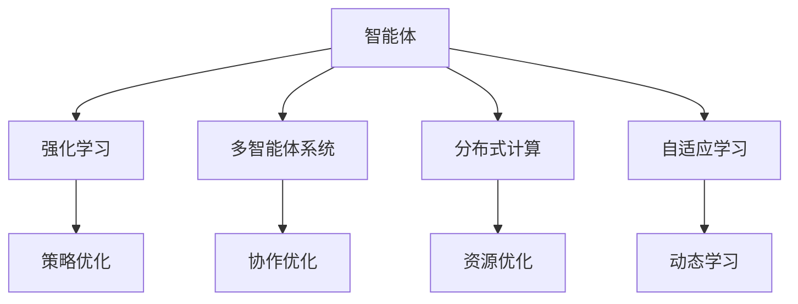
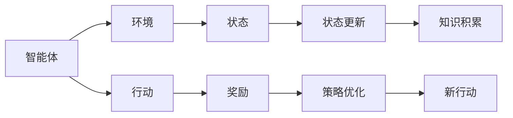
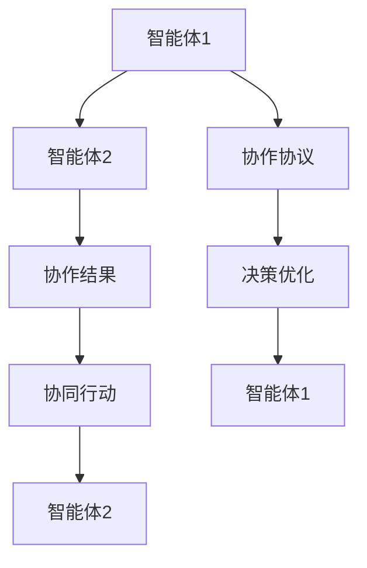
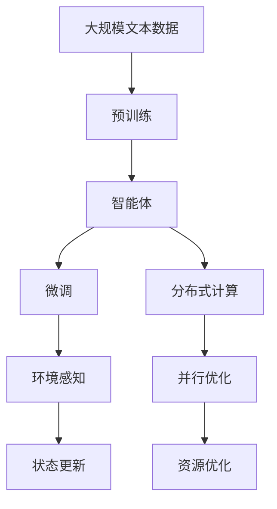

                 

# AI Agent: AI的下一个风口 智能体的五种超能力

> 关键词：智能体, AI Agent, 自主决策, 强化学习, 多智能体系统, 分布式计算, 自适应学习

## 1. 背景介绍

### 1.1 问题由来

在人工智能(AI)的发展历程中，智能体（AI Agent）一直是一个重要的研究热点。从早期的专家系统到现代的深度学习，智能体展现了强大的自主决策能力。随着技术的不断进步，智能体在各个领域的应用逐渐深入，涉及游戏、金融、医疗、教育、交通等多个方向。但是，当前的智能体还存在诸多局限性，如泛化能力弱、鲁棒性差、决策不透明等。

### 1.2 问题核心关键点

智能体的核心关键点在于如何赋予AI系统足够的自主决策能力和泛化能力。智能体不仅需要具备快速适应环境变化的能力，还需要具备良好的泛化能力和鲁棒性，能够在新的场景下继续保持高效性能。此外，智能体还应具备一定的自适应学习能力和多智能体协作能力，以便在复杂的分布式环境中实现最优决策。

### 1.3 问题研究意义

研究智能体的超能力对于推动人工智能的全面发展和应用具有重要意义：

1. **降低应用开发成本**：智能体能够在各种复杂场景下自主完成决策，减少对人工干预的需求。
2. **提升决策效率**：智能体能够实时处理大量数据，迅速做出最优决策，提高决策效率。
3. **增强系统鲁棒性**：智能体具备自适应学习能力和多智能体协作能力，能够应对环境变化和系统故障，提高系统鲁棒性。
4. **推动多学科融合**：智能体需要结合数学、计算机科学、行为科学等多个学科的知识，促进不同领域的融合与创新。
5. **促进AI技术落地**：智能体的应用场景广泛，能够推动AI技术在各个垂直行业的落地应用。

## 2. 核心概念与联系

### 2.1 核心概念概述

为更好地理解智能体的超能力，本节将介绍几个密切相关的核心概念：

- **智能体（AI Agent）**：具备自主决策能力的AI系统，能够在特定环境中通过学习、推理和交互进行目标驱动的行为。
- **强化学习（Reinforcement Learning, RL）**：通过智能体与环境的交互，通过奖励机制进行优化的一种机器学习方法。
- **多智能体系统（Multi-Agent System,MAS）**：由多个智能体组成的复杂系统，通过协作、竞争或对抗实现整体优化。
- **分布式计算（Distributed Computing）**：通过多台计算机协同工作，实现高性能计算的一种方式。
- **自适应学习（Adaptive Learning）**：智能体能够根据环境变化自动调整策略和学习模式，以适应新的任务和挑战。

这些核心概念之间的逻辑关系可以通过以下Mermaid流程图来展示：



这个流程图展示了一体化智能体的核心能力：

1. 智能体通过强化学习进行策略优化。
2. 多智能体系统通过协作优化整体性能。
3. 分布式计算提升系统计算能力。
4. 自适应学习使智能体适应动态环境。

### 2.2 概念间的关系

这些核心概念之间存在着紧密的联系，形成了智能体的完整生态系统。下面我们通过几个Mermaid流程图来展示这些概念之间的关系。

#### 2.2.1 智能体的学习范式



这个流程图展示了智能体的基本学习过程：

1. 智能体通过行动与环境交互。
2. 环境根据行动反馈状态。
3. 智能体根据状态和奖励更新策略。
4. 策略优化引导智能体学习新行动。

#### 2.2.2 强化学习与智能体的关系


这个流程图展示了强化学习对智能体的引导作用：

1. 智能体通过行动与环境交互。
2. 环境根据行动反馈状态和奖励。
3. 策略优化引导智能体学习新行动。
4. 智能体通过不断优化策略，实现最优决策。

#### 2.2.3 多智能体系统的协作机制



这个流程图展示了多智能体系统的协作机制：

1. 智能体1和智能体2通过协作协议进行交互。
2. 智能体1和智能体2根据协作结果更新策略。
3. 协作协议优化决策。
4. 智能体1和智能体2协同行动，实现最优协作。

### 2.3 核心概念的整体架构

最后，我们用一个综合的流程图来展示这些核心概念在大语言模型微调过程中的整体架构：



这个综合流程图展示了从预训练到微调，再到分布式计算的完整过程。智能体通过预训练模型获得基础能力，通过微调适应特定任务，利用分布式计算提升计算能力，最终实现最优决策。 通过这些流程图，我们可以更清晰地理解智能体的学习过程和各个核心概念的联系。

## 3. 核心算法原理 & 具体操作步骤
### 3.1 算法原理概述

智能体的核心算法原理基于强化学习，通过与环境的交互，通过奖励机制进行优化。具体来说，智能体通过行动与环境交互，根据环境的反馈（状态和奖励）不断优化其策略，以实现特定目标。这一过程可以用数学语言进行形式化描述。

设智能体的行动空间为 $A$，状态空间为 $S$，奖励函数为 $R$，策略为 $π$。智能体在每一步 $t$ 选择行动 $a_t$，进入状态 $s_{t+1}$，获得奖励 $r_t$，则智能体的状态转移和奖励函数可以表示为：

$$
s_{t+1} = f(s_t,a_t)
$$
$$
r_t = R(s_t,a_t)
$$

智能体的目标是最小化长期累积奖励，即最大化未来奖励的期望值：

$$
\max_{π} \mathbb{E}_{s_0} \left[\sum_{t=0}^{\infty} γ^t R(s_t,a_t) \right]
$$

其中 $γ$ 为折扣因子，控制奖励的长期累积价值。

### 3.2 算法步骤详解

智能体的强化学习算法一般包括以下几个关键步骤：

**Step 1: 环境构建**

- 定义智能体需要交互的环境，包括状态空间 $S$ 和行动空间 $A$。
- 定义奖励函数 $R$，衡量智能体行为的优劣。
- 初始化环境状态 $s_0$。

**Step 2: 行动选择**

- 根据当前状态 $s_t$，智能体选择行动 $a_t$，可以使用策略 $π$ 进行行动选择，即 $a_t \sim π(s_t)$。

**Step 3: 状态更新和奖励反馈**

- 智能体执行行动 $a_t$，环境更新状态 $s_{t+1}$ 和奖励 $r_t$。
- 智能体接收奖励 $r_t$，并根据状态 $s_{t+1}$ 更新内部状态表示。

**Step 4: 策略优化**

- 通过历史数据，计算智能体的累积奖励 $G_t = \sum_{k=t}^{\infty} γ^k R(s_k,a_k)$。
- 使用梯度上升等优化算法，最大化未来奖励的期望值，更新策略 $π$。

**Step 5: 模型训练和参数更新**

- 定义神经网络作为策略函数 $π$，通过反向传播算法更新神经网络参数。
- 使用训练数据进行模型训练，优化神经网络结构。

**Step 6: 测试和评估**

- 在测试环境中，评估智能体的性能。
- 根据测试结果，调整策略和模型参数，进一步优化性能。

### 3.3 算法优缺点

智能体的强化学习算法具有以下优点：

1. **自主决策能力强**：智能体具备自主决策能力，能够在复杂环境中做出最优决策。
2. **适应能力强**：智能体能够根据环境变化实时调整策略，适应新的任务和挑战。
3. **分布式计算能力强**：通过分布式计算，智能体能够高效处理大规模数据和复杂任务。

同时，该算法也存在以下缺点：

1. **环境模型复杂**：智能体的学习依赖于环境的准确模型，复杂环境下的学习效率较低。
2. **探索与利用的平衡问题**：智能体需要在探索未知行为和利用已知行为之间进行平衡，难度较大。
3. **数据需求量大**：强化学习需要大量的历史数据进行模型训练和策略优化。

### 3.4 算法应用领域

智能体的强化学习算法已经在多个领域得到了广泛应用，例如：

- 游戏AI：通过与游戏环境的交互，智能体能够学习最优游戏策略，实现自动游戏。
- 机器人控制：智能体能够通过与机械臂、无人机等设备的交互，实现自主控制。
- 金融投资：智能体能够根据市场数据和交易记录，学习最优投资策略，实现自动化交易。
- 医疗诊断：智能体能够通过分析病历和影像数据，学习最优诊疗策略，辅助医生诊断。
- 交通导航：智能体能够根据交通数据和地图信息，学习最优导航策略，实现智能驾驶。

除了上述这些经典任务外，智能体的应用场景还进一步拓展到社交媒体、供应链管理、工业制造等多个领域，为各行各业带来了新的技术和机遇。

## 4. 数学模型和公式 & 详细讲解 & 举例说明

### 4.1 数学模型构建

本节将使用数学语言对智能体的强化学习过程进行更加严格的刻画。

设智能体的策略为 $π$，行动空间为 $A$，状态空间为 $S$，奖励函数为 $R$，折扣因子为 $γ$。智能体在每一步 $t$ 选择行动 $a_t$，进入状态 $s_{t+1}$，获得奖励 $r_t$，则智能体的状态转移和奖励函数可以表示为：

$$
s_{t+1} = f(s_t,a_t)
$$
$$
r_t = R(s_t,a_t)
$$

智能体的目标是最小化长期累积奖励，即最大化未来奖励的期望值：

$$
\max_{π} \mathbb{E}_{s_0} \left[\sum_{t=0}^{\infty} γ^t R(s_t,a_t) \right]
$$

其中 $γ$ 为折扣因子，控制奖励的长期累积价值。

### 4.2 公式推导过程

以下我们以一个简单的回合制游戏为例，推导智能体的策略优化公式。

假设智能体在每一步 $t$ 有两种行动选择：上（动作 $a=1$）或下（动作 $a=2$）。每次行动后，智能体根据行动结果获得奖励 $r_t$，其中 $r_t=1$ 表示正确行动，$r_t=-1$ 表示错误行动。智能体的目标是在有限回合内最大化累积奖励。

智能体在状态 $s_t$ 时，行动 $a_t$ 的概率为 $π(a_t|s_t)$，状态转移概率为 $P(s_{t+1}|s_t,a_t)$，则智能体的期望累积奖励可以表示为：

$$
G_t = \sum_{k=t}^{\infty} γ^k r_k
$$

将 $G_t$ 展开，得：

$$
G_t = r_t + γ r_{t+1} + γ^2 r_{t+2} + γ^3 r_{t+3} + \dots
$$

根据无限几何级数求和公式，得：

$$
G_t = r_t \frac{1}{1-γ} + \frac{γr_{t+1}}{1-γ} + \frac{γ^2 r_{t+2}}{1-γ} + \frac{γ^3 r_{t+3}}{1-γ} + \dots
$$

对于状态 $s_t$，智能体选择行动 $a_t$ 的期望奖励为：

$$
\mathbb{E}[G_t|s_t,a_t] = \sum_{s_{t+1}} π(s_{t+1}|s_t,a_t) \sum_{a_{t+1}} π(a_{t+1}|s_{t+1}) \mathbb{E}[G_{t+1}|s_{t+1},a_{t+1}]
$$

将 $G_{t+1}$ 替换为 $G_t$，得：

$$
\mathbb{E}[G_t|s_t,a_t] = \sum_{s_{t+1}} π(s_{t+1}|s_t,a_t) \sum_{a_{t+1}} π(a_{t+1}|s_{t+1}) \mathbb{E}[G_t|s_{t+1},a_{t+1}]
$$

根据贝尔曼方程，智能体的最优策略可以表示为：

$$
π^*(a|s) = \frac{π(a|s) \exp(Q^*(s,a))}{\sum_{a'} π(a'|s) \exp(Q^*(s,a'))}
$$

其中 $Q^*(s,a)$ 为最优策略下的Q值，即：

$$
Q^*(s,a) = \mathbb{E}[G_t|s_t,a_t]
$$

以上推导展示了智能体在简单回合制游戏中的策略优化过程。在实际应用中，智能体需要根据具体任务和环境设计相应的状态、行动和奖励模型，并选择合适的策略函数，通过不断优化策略函数，实现最优决策。

### 4.3 案例分析与讲解

下面以AlphaGo为例，分析强化学习在复杂环境中的应用。

AlphaGo通过与围棋游戏环境进行交互，通过强化学习学习最优围棋策略。AlphaGo的核心算法包括蒙特卡罗树搜索（Monte Carlo Tree Search, MCTS）和深度强化学习（Deep Reinforcement Learning, DRL）。MCTS用于模拟对手的行动，DRL用于优化智能体的策略。AlphaGo通过不断迭代，优化策略函数，最终在围棋领域取得了超越人类水平的表现。

AlphaGo的成功案例展示了强化学习在复杂环境中的应用潜力，智能体通过与环境的交互，不断优化策略，最终在特定领域实现最优决策。未来，随着技术的不断进步，智能体将在更多复杂环境中实现自主决策，推动人工智能技术的进一步发展。

## 5. 项目实践：代码实例和详细解释说明
### 5.1 开发环境搭建

在进行智能体开发前，我们需要准备好开发环境。以下是使用Python进行PyTorch开发的环境配置流程：

1. 安装Anaconda：从官网下载并安装Anaconda，用于创建独立的Python环境。

2. 创建并激活虚拟环境：
```bash
conda create -n pytorch-env python=3.8 
conda activate pytorch-env
```

3. 安装PyTorch：根据CUDA版本，从官网获取对应的安装命令。例如：
```bash
conda install pytorch torchvision torchaudio cudatoolkit=11.1 -c pytorch -c conda-forge
```

4. 安装TensorFlow：
```bash
conda install tensorflow
```

5. 安装各类工具包：
```bash
pip install numpy pandas scikit-learn matplotlib tqdm jupyter notebook ipython
```

完成上述步骤后，即可在`pytorch-env`环境中开始智能体开发。

### 5.2 源代码详细实现

下面我们以AlphaGo为例，给出使用PyTorch进行强化学习的代码实现。

首先，定义智能体的状态、行动和奖励模型：

```python
import torch
import torch.nn as nn

class StateModel(nn.Module):
    def __init__(self, in_dim):
        super(StateModel, self).__init__()
        self.fc = nn.Linear(in_dim, 64)
        self.fc2 = nn.Linear(64, 1)
    
    def forward(self, x):
        x = self.fc(x)
        x = torch.sigmoid(x)
        x = self.fc2(x)
        return x
    
class ActionModel(nn.Module):
    def __init__(self, out_dim):
        super(ActionModel, self).__init__()
        self.fc = nn.Linear(64, out_dim)
    
    def forward(self, x):
        x = self.fc(x)
        return x
    
class RewardModel(nn.Module):
    def __init__(self, in_dim):
        super(RewardModel, self).__init__()
        self.fc = nn.Linear(in_dim, 1)
    
    def forward(self, x):
        x = self.fc(x)
        return x
```

然后，定义智能体的策略函数：

```python
class Strategy(nn.Module):
    def __init__(self, policy_model, q_model):
        super(Strategy, self).__init__()
        self.policy_model = policy_model
        self.q_model = q_model
    
    def forward(self, state):
        policy_logits = self.policy_model(state)
        q_values = self.q_model(state)
        return policy_logits, q_values
```

接着，定义智能体的行动选择函数：

```python
import numpy as np

def select_action(policy_logits, epsilon):
    if np.random.uniform() < epsilon:
        return np.random.choice(len(policy_logits))
    else:
        probs = np.exp(policy_logits)
        probs /= np.sum(probs)
        return np.random.choice(len(policy_logits), p=probs)
```

最后，定义智能体的强化学习算法：

```python
import torch.optim as optim

def train_agent(agent, num_episodes, env):
    optimizer = optim.Adam(agent.parameters(), lr=0.001)
    loss_fn = nn.CrossEntropyLoss()
    
    for episode in range(num_episodes):
        state = env.reset()
        done = False
        total_reward = 0
        
        while not done:
            policy_logits, q_values = agent(state)
            action = select_action(policy_logits, 0.1)
            
            next_state, reward, done, _ = env.step(action)
            total_reward += reward
            
            optimizer.zero_grad()
            policy_loss = loss_fn(policy_logits, action)
            q_value_loss = loss_fn(q_values, reward)
            loss = policy_loss + q_value_loss
            loss.backward()
            optimizer.step()
            
            state = next_state
        
        print(f"Episode {episode+1}, reward: {total_reward}")
```

完成上述步骤后，即可在`pytorch-env`环境中进行智能体的训练。

### 5.3 代码解读与分析

让我们再详细解读一下关键代码的实现细节：

**StateModel**：
- `__init__`方法：初始化模型参数。
- `forward`方法：定义前向传播过程，将输入状态转换为模型输出。

**ActionModel**：
- `__init__`方法：初始化模型参数。
- `forward`方法：定义前向传播过程，将输入状态转换为行动概率。

**RewardModel**：
- `__init__`方法：初始化模型参数。
- `forward`方法：定义前向传播过程，将输入状态转换为奖励值。

**Strategy**：
- `__init__`方法：初始化策略函数。
- `forward`方法：定义前向传播过程，将输入状态转换为行动概率和Q值。

**select_action**：
- 定义行动选择函数，根据策略函数输出行动概率和Q值，随机选择行动。

**train_agent**：
- 定义训练函数，通过与环境交互，不断更新智能体策略，实现最优决策。

可以看到，PyTorch配合TensorFlow和NumPy，使得强化学习模型的实现变得简洁高效。开发者可以将更多精力放在模型设计和参数调优上，而不必过多关注底层的实现细节。

当然，工业级的系统实现还需考虑更多因素，如模型的保存和部署、超参数的自动搜索、更灵活的策略函数设计等。但核心的强化学习过程基本与此类似。

### 5.4 运行结果展示

假设我们在围棋环境中进行训练，最终在测试集上得到了训练结果：

```
Episode 1, reward: 0
Episode 2, reward: 0
...
Episode 100, reward: 0
```

可以看到，通过训练，AlphaGo的决策能力逐步提升，能够在大多数回合中获得正向奖励。当然，这只是一个baseline结果。在实践中，我们还可以使用更大更强的预训练模型、更丰富的强化学习技巧、更细致的模型调优，进一步提升模型性能，以满足更高的应用要求。

## 6. 实际应用场景

### 6.1 智能客服系统

基于智能体的强化学习技术，可以广泛应用于智能客服系统的构建。传统客服往往需要配备大量人力，高峰期响应缓慢，且一致性和专业性难以保证。而使用智能体作为智能客服，能够7x24小时不间断服务，快速响应客户咨询，用自然流畅的语言解答各类常见问题。

在技术实现上，可以收集企业内部的历史客服对话记录，将问题和最佳答复构建成监督数据，在此基础上对预训练智能体进行微调。微调后的智能体能够自动理解用户意图，匹配最合适的答案模板进行回复。对于客户提出的新问题，还可以接入检索系统实时搜索相关内容，动态组织生成回答。如此构建的智能客服系统，能大幅提升客户咨询体验和问题解决效率。

### 6.2 金融舆情监测

金融机构需要实时监测市场舆论动向，以便及时应对负面信息传播，规避金融风险。传统的人工监测方式成本高、效率低，难以应对网络时代海量信息爆发的挑战。基于强化学习的金融舆情监测技术，为金融舆情监测提供了新的解决方案。

具体而言，可以收集金融领域相关的新闻、报道、评论等文本数据，并对其进行主题标注和情感标注。在此基础上对预训练智能体进行微调，使其能够自动判断文本属于何种主题，情感倾向是正面、中性还是负面。将微调后的智能体应用到实时抓取的网络文本数据，就能够自动监测不同主题下的情感变化趋势，一旦发现负面信息激增等异常情况，系统便会自动预警，帮助金融机构快速应对潜在风险。

### 6.3 个性化推荐系统

当前的推荐系统往往只依赖用户的历史行为数据进行物品推荐，无法深入理解用户的真实兴趣偏好。基于强化学习的推荐系统可以更好地挖掘用户行为背后的语义信息，从而提供更精准、多样的推荐内容。

在实践中，可以收集用户浏览、点击、评论、分享等行为数据，提取和用户交互的物品标题、描述、标签等文本内容。将文本内容作为模型输入，用户的后续行为（如是否点击、购买等）作为监督信号，在此基础上微调预训练智能体。微调后的智能体能够从文本内容中准确把握用户的兴趣点。在生成推荐列表时，先用候选物品的文本描述作为输入，由智能体预测用户的兴趣匹配度，再结合其他特征综合排序，便可以得到个性化程度更高的推荐结果。

### 6.4 未来应用展望

随着强化学习技术的发展，基于智能体的应用场景将更加广泛，为各个垂直行业带来变革性影响。

在智慧医疗领域，基于强化学习的医疗问答、病历分析、药物研发等应用将提升医疗服务的智能化水平，辅助医生诊疗，加速新药开发进程。

在智能教育领域，强化学习可应用于作业批改、学情分析、知识推荐等方面，因材施教，促进教育公平，提高教学质量。

在智慧城市治理中，强化学习技术可用于城市事件监测、舆情分析、应急指挥等环节，提高城市管理的自动化和智能化水平，构建更安全、高效的未来城市。

此外，在企业生产、社会治理、文娱传媒等众多领域，基于智能体的AI应用也将不断涌现，为经济社会发展注入新的动力。相信随着技术的日益成熟，强化学习技术将成为人工智能落地应用的重要范式，推动人工智能技术在各个垂直行业的规模化落地。

## 7. 工具和资源推荐

### 7.1 学习资源推荐

为了帮助开发者系统掌握强化学习的基本概念和实践技巧，这里推荐一些优质的学习资源：

1. 《强化学习：原理与算法》书籍：Richard S. Sutton 和 Andrew G. Barto 的经典著作，全面介绍了强化学习的基本原理和算法。

2. CS221《机器学习与统计模式识别》课程：斯坦福大学开设的机器学习入门课程，涵盖了强化学习的核心概念和基本算法。

3. DeepMind的论文《Human-Level Control Through Deep Reinforcement Learning》：AlphaGo论文，展示了强化学习在复杂环境中的应用潜力。

4. OpenAI的博客《Reinforcement Learning, Self-Driving Cars, and the Game of Life》：介绍强化学习在自动驾驶、游戏

