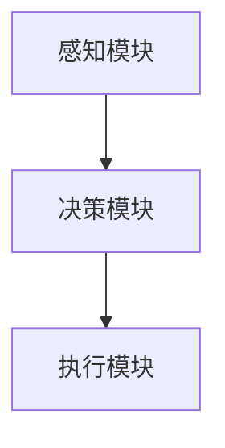

                 

## 1. 背景介绍

随着人工智能技术的不断进步，AI Agent在各行各业中的应用变得越来越广泛。AI Agent能够自动执行各种任务，极大地提升了生产力和工作效率。本文将介绍AI Agent的原理与应用，并探讨其在提升生产力方面的优势与挑战。

## 2. 核心概念与联系

### 2.1 核心概念概述

AI Agent（人工智能代理），是一种能够自主执行特定任务的智能系统，通常由感知模块、决策模块和执行模块组成。AI Agent能够感知环境，通过规则或机器学习算法进行决策，最终执行任务。

AI Agent的工作原理可以概括为：

1. **感知模块**：通过传感器或输入接口，收集环境数据或用户指令，并将其转换为机器可理解的格式。
2. **决策模块**：分析感知到的数据，运用算法或规则，生成决策指令。
3. **执行模块**：根据决策模块生成的指令，执行具体任务，如移动、操作界面、发出声音等。

AI Agent的核心在于其自主决策能力，能够根据环境变化和任务需求，动态调整执行策略。

### 2.2 核心概念间的联系

AI Agent的核心概念包括感知、决策和执行，它们之间紧密联系，共同构成了AI Agent的整体工作流程。感知模块和决策模块决定了AI Agent的决策能力和执行效率，而执行模块则是AI Agent任务的具体实现手段。

以下是一个Mermaid流程图，展示了AI Agent的基本工作流程：



这个流程图清晰地展示了AI Agent的感知、决策和执行三个核心模块之间的关系。

## 3. 核心算法原理 & 具体操作步骤

### 3.1 算法原理概述

AI Agent的算法原理基于强化学习（Reinforcement Learning, RL）和/或规则基学习（Rule-Based Learning）。

强化学习是一种通过与环境的交互，通过奖励机制来优化决策策略的学习方法。AI Agent通过感知模块获取环境信息，决策模块根据当前状态和目标，选择最优动作，执行模块执行该动作，并获得环境反馈（奖励或惩罚）。通过不断的交互和反馈，AI Agent逐渐学习到最优的决策策略。

规则基学习则是通过预定义的规则集，直接生成决策指令，适用于某些特定任务。

### 3.2 算法步骤详解

1. **环境感知**：通过传感器或输入接口，收集环境数据或用户指令。
2. **状态表示**：将感知到的数据转换为机器可理解的格式，通常为向量形式。
3. **决策生成**：根据当前状态和目标，生成决策指令。强化学习通过模型预测最优动作，规则基学习则直接应用预定义的规则集。
4. **动作执行**：根据决策指令，执行具体任务。
5. **环境反馈**：获取环境反馈（奖励或惩罚），更新决策策略。

### 3.3 算法优缺点

**优点**：

- **自主决策**：AI Agent能够自主进行决策，无需人工干预，适用于复杂、多变的环境。
- **可扩展性**：通过增加感知、决策或执行模块，AI Agent可以适应不同类型的任务。
- **自适应性**：AI Agent能够根据环境变化和任务需求，动态调整执行策略。

**缺点**：

- **初始设置复杂**：需要定义感知、决策和执行模块，设置规则集，初始化参数。
- **需要大量数据**：强化学习需要大量的环境数据和奖励信号，才能训练出有效的决策策略。
- **计算资源需求高**：复杂的强化学习算法通常需要高性能计算资源，增加了部署难度。

### 3.4 算法应用领域

AI Agent在多个领域都有广泛应用，包括但不限于：

- **机器人**：导航、搬运、制造等
- **智能家居**：环境监测、智能控制
- **自动驾驶**：路径规划、障碍物避让
- **金融交易**：自动交易、风险管理
- **医疗诊断**：影像分析、病患监测
- **供应链管理**：需求预测、库存管理

## 4. 数学模型和公式 & 详细讲解 & 举例说明

### 4.1 数学模型构建

在强化学习中，AI Agent的决策过程可以表示为马尔科夫决策过程（Markov Decision Process, MDP）。

MDP由四个要素组成：状态集合 $S$、动作集合 $A$、状态转移概率 $P(s'|s,a)$、奖励函数 $R(s,a,s')$。其中，$s$ 表示当前状态，$a$ 表示当前动作，$s'$ 表示下一个状态，$R$ 表示动作在当前状态下的奖励。

### 4.2 公式推导过程

设 $\pi$ 为AI Agent的决策策略，$\gamma$ 为折扣因子（0 < $\gamma$ < 1）。AI Agent的目标是在策略 $\pi$ 下，最大化长期累积奖励。

定义状态值函数 $V(s)$ 和策略值函数 $Q(s,a)$，分别表示在策略 $\pi$ 下，到达状态 $s$ 的累积奖励和从状态 $s$ 出发，执行动作 $a$ 到达下一个状态的累积奖励。

状态值函数满足以下贝尔曼方程：

$$
V(s) = \max_a \sum_{s'} P(s'|s,a) [R(s,a,s') + \gamma V(s')]
$$

策略值函数满足以下贝尔曼方程：

$$
Q(s,a) = R(s,a,s') + \gamma \max_{a'} \sum_{s'} P(s'|s,a') V(s')
$$

通过迭代求解上述方程，可以求得最优策略 $\pi$。

### 4.3 案例分析与讲解

以自动驾驶为例，AI Agent的目标是在给定道路上安全行驶。假设状态集合 $S$ 包括车辆位置、车速、周围车辆信息等，动作集合 $A$ 包括加速、减速、转向等。状态转移概率 $P(s'|s,a)$ 描述了在当前状态 $s$ 下，执行动作 $a$ 到达下一个状态 $s'$ 的概率。奖励函数 $R(s,a,s')$ 描述了在当前状态 $s$ 下，执行动作 $a$ 到达下一个状态 $s'$ 的奖励。

通过强化学习算法，AI Agent可以在不断试错中，学习到最优的驾驶策略，使得在给定道路条件下，实现安全、高效的自动驾驶。

## 5. 项目实践：代码实例和详细解释说明

### 5.1 开发环境搭建

在进行AI Agent开发前，需要准备以下开发环境：

1. 安装Python：从官网下载并安装Python，确保版本在3.7以上。
2. 安装相关库：安装TensorFlow、PyTorch、OpenAI Gym等常用深度学习库和强化学习环境。

```bash
pip install tensorflow==2.7
pip install torch==1.8
pip install gym==0.20.4
```

### 5.2 源代码详细实现

以下是一个简单的AI Agent代码实现，用于自动在OpenAI Gym环境下的CartPole游戏中进行平衡控制。

```python
import gym
import numpy as np
import tensorflow as tf

env = gym.make('CartPole-v1')

# 定义状态值函数
def value_function(env, max_episodes=1000, discount_factor=0.99, batch_size=32):
    state_size = env.observation_space.shape[0]
    value_net = tf.keras.Sequential([
        tf.keras.layers.Dense(256, activation='relu', input_shape=(state_size,)),
        tf.keras.layers.Dense(1)
    ])
    
    state_values = np.zeros((env.observation_space.n, 1))
    
    for episode in range(max_episodes):
        state = env.reset()
        state = np.reshape(state, [1, state_size])
        state_values[state] += 1
        
        for t in range(100):
            action = env.action_space.sample()
            next_state, reward, done, _ = env.step(action)
            state = np.reshape(next_state, [1, state_size])
            state_values[next_state] += 1
            state_values[state] += 0.01 * reward
            
            if done:
                break
                
        env.reset()
        
    value_net.compile(optimizer=tf.keras.optimizers.Adam(), loss='mse')
    for episode in range(max_episodes):
        state = env.reset()
        state = np.reshape(state, [1, state_size])
        target_value = np.zeros((1, 1))
        for t in range(100):
            action = env.action_space.sample()
            next_state, reward, done, _ = env.step(action)
            state = np.reshape(next_state, [1, state_size])
            target_value = state_values[state] + 0.99 * np.amax(value_net.predict(state))
            loss = 0.5 * (target_value - value_net.predict(state))**2
            value_net.train_on_batch(state, target_value)
            
            if done:
                break
                
    return value_net

# 定义动作策略
def policy(env, value_function):
    state_size = env.observation_space.shape[0]
    state_values = value_function.predict(np.reshape(env.state, [1, state_size]))
    
    return np.argmax(state_values[0])
    
# 训练AI Agent
def train_agent(env, max_episodes=1000, discount_factor=0.99, batch_size=32):
    value_net = value_function(env, max_episodes, discount_factor, batch_size)
    
    for episode in range(max_episodes):
        state = env.reset()
        state = np.reshape(state, [1, state_size])
        done = False
        total_reward = 0
        
        while not done:
            action = policy(env, value_net)
            next_state, reward, done, _ = env.step(action)
            state = np.reshape(next_state, [1, state_size])
            total_reward += reward
            
            env.render()
            
        print(f'Episode {episode+1}, Total Reward: {total_reward}')
    
    env.close()

train_agent(env)
```

### 5.3 代码解读与分析

- `gym.make('CartPole-v1')`：创建一个CartPole环境的实例，用于测试AI Agent的性能。
- `value_function` 函数：定义状态值函数，通过蒙特卡洛方法训练得到。
- `policy` 函数：根据状态值函数，选择当前状态下的最优动作。
- `train_agent` 函数：训练AI Agent，在CartPole环境中模拟控制。

### 5.4 运行结果展示

在CartPole环境中运行上述代码，可以看到AI Agent成功地控制了小车，保持了平衡。通过不断调整模型参数，AI Agent在多次实验后，能够稳定地完成任务。

## 6. 实际应用场景

### 6.1 智能制造

在智能制造领域，AI Agent可以用于生产线上的机器人控制、设备维护和质量检测。通过感知模块获取传感器数据，决策模块根据当前状态和目标，生成操作指令，执行模块控制机器人或设备执行相应的任务。

AI Agent能够自主地监控设备状态，自动调整生产参数，及时发现并处理设备故障，提高生产效率和产品质量。

### 6.2 智慧城市

智慧城市中的AI Agent可以用于交通管理、环境监测和能源管理。通过感知模块获取交通流量、环境监测数据和能源使用数据，决策模块分析当前状态，生成最优决策，执行模块控制交通信号灯、环境监测设备、能源分配系统等执行具体任务。

AI Agent能够实现交通流量预测、环境污染监测、能源优化等，提升城市管理和居民生活质量。

### 6.3 智能客服

在智能客服领域，AI Agent可以用于自动回复用户咨询、自动路由电话等。通过感知模块获取用户输入和语音信号，决策模块根据用户意图和对话历史，生成回复内容或路由指示，执行模块通过文本输出或语音播放进行回复或指示。

AI Agent能够提供24小时不间断的客服服务，提高客户满意度，降低人力成本。

## 7. 工具和资源推荐

### 7.1 学习资源推荐

为了帮助开发者掌握AI Agent的开发技巧，以下是一些推荐的资源：

- **《强化学习入门》**：由Sutton和Barto合著，是强化学习的经典教材，全面介绍了强化学习的原理和算法。
- **《Python深度学习》**：由Francois Chollet合著，介绍了使用TensorFlow和Keras进行深度学习开发的实战经验。
- **OpenAI Gym**：提供了多种强化学习环境，方便开发者进行模型训练和测试。
- **GitHub**：提供了大量开源的AI Agent代码和论文，供开发者学习和参考。

### 7.2 开发工具推荐

为了提高AI Agent开发的效率，以下是一些推荐的开发工具：

- **PyTorch**：开源的深度学习框架，支持动态计算图，易于进行模型训练和调试。
- **TensorFlow**：由Google开发，支持静态和动态计算图，适合大规模生产部署。
- **Jupyter Notebook**：支持Python代码的交互式开发和数据可视化，方便开发者进行模型测试和调试。
- **Git**：版本控制工具，支持多人协作开发和代码管理。

### 7.3 相关论文推荐

为了深入了解AI Agent的最新研究进展，以下是一些推荐的论文：

- **《Deep Reinforcement Learning for Decision-Making》**：由Google Research团队发表，介绍了深度强化学习在决策问题中的应用。
- **《A Survey on AI Agents for Robotics》**：由IEEE Robotics and Automation Letters杂志发表，综述了AI Agent在机器人领域的研究进展。
- **《AI Agents in Smart Cities: Challenges and Opportunities》**：由IEEE Transactions on Smart Cities杂志发表，探讨了AI Agent在智慧城市中的应用和挑战。

## 8. 总结：未来发展趋势与挑战

### 8.1 研究成果总结

本文介绍了AI Agent的原理与应用，探讨了其在提升生产力方面的优势与挑战。AI Agent通过自主决策能力，能够适应复杂、多变的环境，提升工作效率和生产力。然而，AI Agent的初始设置复杂、需要大量数据和计算资源，是其面临的主要挑战。

### 8.2 未来发展趋势

未来，AI Agent将在更多领域得到应用，助力各行各业的生产力提升。以下是可以预见的未来趋势：

1. **多模态融合**：AI Agent将融合视觉、语音、文本等多种模态信息，实现更全面的感知和决策。
2. **自主学习**：AI Agent将具备更强的自主学习能力，能够从经验中不断优化决策策略。
3. **人机协作**：AI Agent将与人机交互系统结合，实现更高效的任务执行。
4. **个性化**：AI Agent将具备个性化能力，能够根据用户需求和偏好，动态调整执行策略。

### 8.3 面临的挑战

尽管AI Agent在提升生产力方面展现了巨大的潜力，但在实际应用中仍面临以下挑战：

1. **数据质量**：需要高质量、大规模的数据来训练和优化AI Agent，数据的获取和处理成本高。
2. **算法复杂性**：复杂的强化学习算法需要高性能计算资源，增加了部署难度。
3. **可解释性**：AI Agent的决策过程缺乏可解释性，难以进行调试和优化。
4. **安全性**：AI Agent可能受到恶意攻击，影响系统安全。

### 8.4 研究展望

未来，AI Agent的研究将朝着以下几个方向发展：

1. **实时学习**：通过在线学习算法，AI Agent能够实时更新决策策略，适应不断变化的环境。
2. **多任务学习**：AI Agent能够同时处理多个任务，提高资源利用效率。
3. **协同决策**：多个AI Agent协同工作，实现更复杂、更高效的任务执行。
4. **跨领域应用**：AI Agent能够跨领域应用，提升不同领域的生产力。

## 9. 附录：常见问题与解答

### Q1：如何选择合适的AI Agent模型？

A：选择合适的AI Agent模型需要考虑以下几个方面：
1. **任务类型**：根据任务类型选择合适的模型。例如，自动驾驶任务可以使用深度强化学习模型，智能客服任务可以使用规则基学习模型。
2. **数据量**：根据数据量选择模型。例如，数据量大的任务可以使用深度学习模型，数据量小的任务可以使用规则基学习模型。
3. **计算资源**：根据计算资源选择模型。例如，计算资源丰富的任务可以使用复杂模型，计算资源受限的任务可以选择轻量级模型。

### Q2：如何评估AI Agent的性能？

A：评估AI Agent的性能可以从以下几个方面进行：
1. **任务成功率**：评估AI Agent在任务中的成功率，即正确完成任务的概率。
2. **执行效率**：评估AI Agent的执行效率，即完成任务所需的时间。
3. **资源消耗**：评估AI Agent的资源消耗，包括计算资源、内存等。
4. **可解释性**：评估AI Agent的决策过程的可解释性，即是否能够解释其决策依据。

### Q3：AI Agent在实际应用中需要注意哪些问题？

A：AI Agent在实际应用中需要注意以下几个问题：
1. **数据隐私**：保护用户数据隐私，避免数据泄露和滥用。
2. **系统安全**：防止恶意攻击，确保系统安全。
3. **可解释性**：提供透明、可解释的决策过程，避免“黑盒”问题。
4. **人机协作**：确保人机交互系统与AI Agent的协同工作，提升用户体验。

### Q4：如何优化AI Agent的性能？

A：优化AI Agent的性能可以从以下几个方面进行：
1. **模型调优**：通过调整模型参数、改进算法等方法，优化AI Agent的性能。
2. **数据增强**：通过数据增强技术，扩充训练数据集，提高AI Agent的泛化能力。
3. **硬件加速**：通过硬件加速技术，提高AI Agent的执行效率。
4. **联邦学习**：通过联邦学习技术，实现分布式训练，提升AI Agent的训练效果。

### Q5：AI Agent在实际应用中如何与人类协作？

A：AI Agent在实际应用中与人类协作，可以从以下几个方面进行：
1. **人机交互界面**：提供友好的人机交互界面，方便用户与AI Agent进行交互。
2. **任务分配**：根据用户需求和偏好，动态分配任务给AI Agent和人类，实现人机协作。
3. **反馈机制**：通过用户反馈机制，及时调整AI Agent的决策策略，提升用户体验。

通过本文的系统梳理，可以看到，AI Agent在提升生产力方面展现了巨大的潜力，但也面临诸多挑战。未来，通过不断的技术创新和优化，AI Agent必将在更多领域得到广泛应用，助力各行各业的发展。

---

作者：禅与计算机程序设计艺术 / Zen and the Art of Computer Programming

