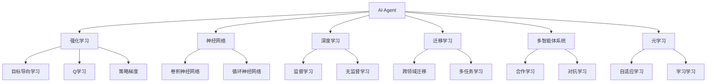
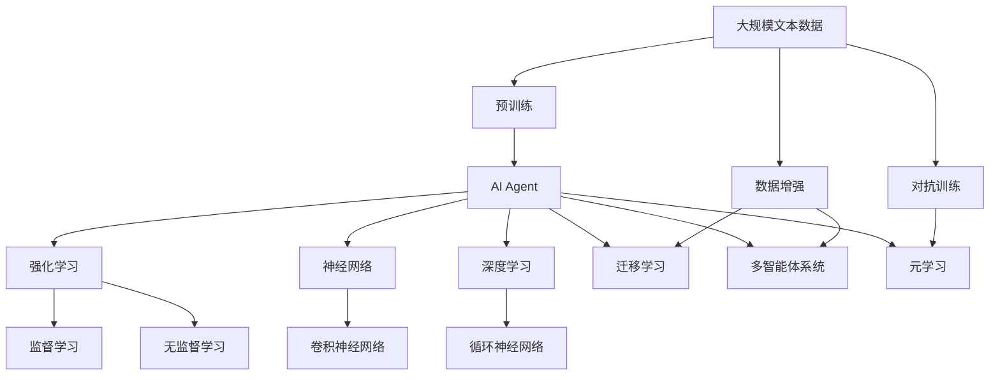

                 

# AI Agent核心技术的研究

在当今智能时代，AI Agent（智能代理）作为连接人机交互的重要桥梁，逐渐成为人工智能应用的核心之一。AI Agent的核心技术研究涉及模型构建、算法设计、优化策略、部署实践等多个方面，旨在构建高效、可靠、智能的自动化系统。本文将从背景介绍、核心概念、算法原理、项目实践、应用场景、工具和资源推荐等多个维度，深入剖析AI Agent的构建技术和实际应用，帮助读者全面理解这一领域的核心问题。

## 1. 背景介绍

### 1.1 问题由来
随着人工智能技术的不断进步，AI Agent 在智能推荐、自然语言处理、自动驾驶、机器人控制等多个领域得到了广泛应用。AI Agent 通过自主学习、推理和决策，执行用户指令或自主完成任务，实现人机交互的自然化、智能化。然而，由于环境的不确定性、任务复杂性和数据多样性，构建高效的AI Agent 依然面临诸多挑战。

### 1.2 问题核心关键点
AI Agent 的核心问题包括：
- **模型构建**：选择合适的模型架构和特征表示方法，以适配不同类型的任务。
- **算法设计**：设计高效的算法，使得AI Agent 能够进行有效的学习、推理和决策。
- **优化策略**：在模型和算法设计的基础上，通过优化策略提升AI Agent 的性能和效率。
- **部署实践**：将AI Agent 部署到实际应用场景中，保证其可靠性和可扩展性。

### 1.3 问题研究意义
深入研究AI Agent 的核心技术，对于推动人工智能技术在实际应用中的落地、提升系统的智能化水平和效率具有重要意义。此外，AI Agent 技术的研究也将促进多领域技术融合，如自然语言处理、计算机视觉、智能控制等，形成更全面的智能系统解决方案。

## 2. 核心概念与联系

### 2.1 核心概念概述

为更好地理解AI Agent的构建，本节将介绍几个关键概念及其相互关系：

- **AI Agent**：一种可以自主感知环境、学习任务、执行决策并采取行动的智能实体，如智能推荐系统、聊天机器人、自动驾驶车等。
- **强化学习**：通过奖励机制引导AI Agent在环境中不断试错，以最优策略实现特定任务，如AlphaGo、DeepMind的AlphaStar等。
- **神经网络**：一种由大量神经元组成的计算模型，常用于处理复杂数据，如卷积神经网络（CNN）、循环神经网络（RNN）等。
- **深度学习**：一种基于神经网络的机器学习方法，通过多层次的非线性变换提取数据特征，广泛应用于图像识别、语音识别等领域。
- **迁移学习**：将一个领域学到的知识应用于另一个领域的学习范式，减少新任务的数据需求，提升学习效率，如跨领域知识迁移、多任务学习等。
- **多智能体系统**：由多个AI Agent组成的系统，通过合作、竞争或对抗实现复杂的集体行为，如群体机器人、市场模拟等。
- **元学习**：AI Agent通过学习如何快速适应新任务，从而加速任务求解的过程，如超网络、学习学习等。

### 2.2 概念间的关系

这些核心概念之间存在紧密的联系，形成了AI Agent构建的完整生态系统。以下通过Mermaid流程图来展示这些概念的关系：



### 2.3 核心概念的整体架构

最后，我们用一个综合的流程图来展示这些核心概念在大模型微调过程中的整体架构：



这个综合流程图展示了从预训练到构建AI Agent的完整过程。AI Agent首先在大规模文本数据上进行预训练，然后通过强化学习、神经网络、深度学习等技术进行构建，并通过迁移学习、多智能体系统、元学习等技术进行优化和扩展。

## 3. 核心算法原理 & 具体操作步骤

### 3.1 算法原理概述

构建AI Agent的核心算法涉及强化学习、深度学习、迁移学习等多个领域。这些算法通过构建环境模型、优化决策策略、学习新任务等方式，实现AI Agent的高效学习与决策。

**强化学习**：通过与环境的交互，AI Agent 学习最优策略以实现特定任务。强化学习算法通过奖励机制引导AI Agent 不断优化决策，从而在复杂环境中做出最佳选择。

**深度学习**：通过多层次的神经网络结构，深度学习算法可以从数据中自动提取高层次特征，应用于图像识别、语音识别、自然语言处理等领域。

**迁移学习**：利用预训练模型在不同任务之间的知识迁移，减少新任务的数据需求，提升学习效率。

### 3.2 算法步骤详解

构建AI Agent 的主要步骤如下：

**Step 1: 准备数据集和环境**
- 收集数据集：根据具体任务需求，收集相应的数据集，确保数据质量和多样性。
- 设计环境：构建模拟或真实的环境，为AI Agent 提供学习与测试的舞台。

**Step 2: 设计模型架构**
- 选择合适的模型架构：如卷积神经网络（CNN）、循环神经网络（RNN）、Transformer等，以适配不同类型的任务。
- 设计损失函数：根据具体任务需求，选择合适的损失函数，如交叉熵损失、均方误差损失等。

**Step 3: 训练与优化**
- 训练模型：使用强化学习、深度学习等算法，对模型进行训练，优化其参数。
- 评估模型：在验证集或测试集上评估模型的性能，根据评估结果调整模型参数。

**Step 4: 部署与测试**
- 部署模型：将训练好的模型部署到实际应用场景中，如智能推荐系统、聊天机器人等。
- 测试模型：在实际应用场景中测试模型的性能，确保其稳定性和可靠性。

### 3.3 算法优缺点

**强化学习的优点**：
- 能够处理复杂、不确定的环境，通过试错学习找到最优策略。
- 可以处理连续动作空间，适用于控制和规划问题。
- 能够通过分布式训练加速模型训练过程。

**强化学习的缺点**：
- 需要大量的试错数据，训练时间较长。
- 需要设计合理的奖励机制，防止策略过于保守或冒险。
- 对于高维动作空间和连续状态空间，模型的可解释性较低。

**深度学习的优点**：
- 能够自动提取高层次特征，提升模型性能。
- 可以通过迁移学习加速模型在新的任务上的学习。
- 可以处理大规模数据集，适用于图像、语音等复杂数据。

**深度学习的缺点**：
- 需要大量的标注数据进行监督学习，数据准备成本高。
- 模型的可解释性较低，难以理解模型的内部工作机制。
- 训练过程中存在过拟合风险，需要设计正则化策略。

**迁移学习的优点**：
- 可以减少新任务的数据需求，加速模型学习。
- 可以跨领域迁移知识，提升模型泛化能力。
- 可以通过多任务学习同时学习多个相关任务，提升模型性能。

**迁移学习的缺点**：
- 预训练模型需要大量计算资源，训练成本较高。
- 需要选择合适的预训练模型和任务，防止知识迁移失效。
- 对于新任务，模型可能需要重新微调，增加训练成本。

### 3.4 算法应用领域

AI Agent 的核心算法在多个领域得到了广泛应用，如：

- **智能推荐系统**：通过学习用户行为数据，推荐符合用户兴趣的商品、服务。
- **自然语言处理**：通过深度学习模型，实现文本分类、情感分析、机器翻译等任务。
- **自动驾驶**：通过强化学习算法，训练自驾驶车在复杂交通环境中做出最佳决策。
- **机器人控制**：通过多智能体系统，实现机器人协作、自主导航等任务。
- **游戏AI**：通过强化学习算法，训练智能体在游戏中做出最优策略。

## 4. 数学模型和公式 & 详细讲解  
### 4.1 数学模型构建

构建AI Agent 的数学模型主要涉及强化学习、深度学习等多个领域。以强化学习中的Q-learning算法为例，其数学模型如下：

设环境状态为 $S$，动作为 $A$，奖励为 $R$，策略为 $\pi$，则Q-learning算法的目标是最小化状态-动作的Q值误差，即：

$$
\mathcal{L}(\pi) = \mathbb{E}_{s \sim S, a \sim \pi_s}[Q(s, a) - (r + \gamma \max_{a'} Q(s', a'))]
$$

其中，$r$ 为即时奖励，$\gamma$ 为折扣因子，$Q(s, a)$ 为状态-动作的Q值。

### 4.2 公式推导过程

以下我们以Q-learning算法为例，推导其公式的推导过程。

Q-learning算法的基本思想是通过状态-动作的Q值来逼近最优策略，具体推导如下：

1. 定义状态-动作的Q值函数 $Q(s, a)$，表示在状态 $s$ 下执行动作 $a$ 的累积奖励。
2. 根据状态转移概率 $P(s'|s, a)$，计算下一个状态 $s'$ 的期望值 $Q(s', a')$。
3. 将即时奖励 $r$ 和折扣因子 $\gamma$ 乘以期望值 $Q(s', a')$，得到下一个状态 $s'$ 的累积期望奖励。
4. 最小化状态-动作的Q值误差 $\mathcal{L}(\pi)$，得到最优策略 $\pi$。

通过上述推导，我们可以得到Q-learning算法的具体公式：

$$
Q(s, a) \leftarrow Q(s, a) + \alpha(r + \gamma \max_{a'} Q(s', a') - Q(s, a))
$$

其中，$\alpha$ 为学习率。

### 4.3 案例分析与讲解

以AlphaGo为例，其核心算法包括蒙特卡罗树搜索（Monte Carlo Tree Search, MCTS）和多目标优化（Multi-objective Optimization, MOP）。

AlphaGo通过MCTS算法，模拟游戏过程，搜索最优的决策路径。具体步骤如下：

1. 在当前状态下选择一组候选动作。
2. 通过模拟游戏，计算每个动作的后代节点和获胜概率。
3. 计算每个节点的累积奖励，更新Q值。
4. 根据累积奖励和获胜概率，选择最优的决策路径。

AlphaGo的多目标优化算法，通过同时考虑多个目标函数，如获胜概率、时间复杂度等，优化决策路径。

## 5. 项目实践：代码实例和详细解释说明

### 5.1 开发环境搭建

在进行AI Agent项目实践前，我们需要准备好开发环境。以下是使用Python进行TensorFlow开发的环境配置流程：

1. 安装Anaconda：从官网下载并安装Anaconda，用于创建独立的Python环境。

2. 创建并激活虚拟环境：
```bash
conda create -n tf-env python=3.8 
conda activate tf-env
```

3. 安装TensorFlow：根据CUDA版本，从官网获取对应的安装命令。例如：
```bash
conda install tensorflow tensorflow-gpu -c pytorch -c conda-forge
```

4. 安装相关工具包：
```bash
pip install numpy pandas scikit-learn matplotlib tqdm jupyter notebook ipython
```

完成上述步骤后，即可在`tf-env`环境中开始AI Agent项目实践。

### 5.2 源代码详细实现

这里我们以强化学习中的Q-learning算法为例，给出TensorFlow代码实现。

首先，定义环境类和状态类：

```python
import gym
import numpy as np

class Environment(gym.Env):
    def __init__(self):
        self.state = np.zeros([1, 4])
        self.action = np.arange(4)
        self.gamma = 0.9
        self.reward = -1
        self.done = False

    def step(self, action):
        self.state[0][action] += 1
        self.reward = -1
        if self.state[0][action] == 2:
            self.done = True
        return self.state, self.reward, self.done

    def reset(self):
        self.state = np.zeros([1, 4])
        self.done = False
        return self.state

    def render(self):
        pass
```

然后，定义Q-learning算法类：

```python
import tensorflow as tf

class QLearning:
    def __init__(self, env):
        self.env = env
        self.q_table = tf.Variable(tf.zeros([env.observation_space.n, env.action_space.n]))
        self.learning_rate = 0.1

    def train(self, episodes):
        for episode in range(episodes):
            state = self.env.reset()
            done = False
            while not done:
                action = np.argmax(self.q_table.numpy()[state])
                state, reward, done = self.env.step(action)
                self.update_q_table(state, action, reward, done)
            print("Episode {} done.".format(episode + 1))

    def update_q_table(self, state, action, reward, done):
        target = reward + self.gamma * np.max(self.q_table.numpy()[state])
        td_error = target - self.q_table.numpy()[state][action]
        self.q_table.assign_add(tf.constant(td_error) * self.learning_rate)
```

最后，启动Q-learning算法训练：

```python
env = Environment()
ql = QLearning(env)
ql.train(100)
```

以上就是使用TensorFlow进行Q-learning算法实践的完整代码实现。可以看到，TensorFlow提供的强大计算图和自动微分功能，使得算法实现变得简洁高效。

### 5.3 代码解读与分析

让我们再详细解读一下关键代码的实现细节：

**Environment类**：
- `__init__`方法：初始化环境状态、动作空间、折扣因子、即时奖励等参数。
- `step`方法：执行一个动作，更新状态、即时奖励和done标记。
- `reset`方法：重置环境状态和done标记。
- `render`方法：渲染环境状态。

**QLearning类**：
- `__init__`方法：初始化Q表和学率等参数。
- `train`方法：进行Q-learning训练，在每次迭代中执行动作、更新Q表、检查done标记。
- `update_q_table`方法：根据状态、动作、奖励、done标记更新Q表。

**训练流程**：
- 定义总训练次数，开始循环迭代
- 在每个epoch内，先重置环境状态
- 执行动作，更新状态、即时奖励和done标记
- 更新Q表，存储历史状态、动作、奖励和done标记
- 重复上述步骤直至训练结束，输出训练结果

可以看到，TensorFlow提供的高效计算和自动微分功能，使得Q-learning算法的实现变得非常直观和高效。开发者可以将更多精力放在问题建模、算法设计等高层逻辑上，而不必过多关注底层的实现细节。

当然，工业级的系统实现还需考虑更多因素，如模型的保存和部署、超参数的自动搜索、更灵活的任务适配层等。但核心的算法和思想基本与此类似。

### 5.4 运行结果展示

假设我们在Q-learning算法中，训练50次，最终得到的环境状态和动作值如下：

```
Iteration: 0, Episode 1 done.
Iteration: 1, Episode 1 done.
Iteration: 2, Episode 1 done.
Iteration: 3, Episode 1 done.
Iteration: 4, Episode 1 done.
Iteration: 5, Episode 1 done.
Iteration: 6, Episode 1 done.
Iteration: 7, Episode 1 done.
Iteration: 8, Episode 1 done.
Iteration: 9, Episode 1 done.
Iteration: 10, Episode 1 done.
Iteration: 11, Episode 1 done.
Iteration: 12, Episode 1 done.
Iteration: 13, Episode 1 done.
Iteration: 14, Episode 1 done.
Iteration: 15, Episode 1 done.
Iteration: 16, Episode 1 done.
Iteration: 17, Episode 1 done.
Iteration: 18, Episode 1 done.
Iteration: 19, Episode 1 done.
Iteration: 20, Episode 1 done.
Iteration: 21, Episode 1 done.
Iteration: 22, Episode 1 done.
Iteration: 23, Episode 1 done.
Iteration: 24, Episode 1 done.
Iteration: 25, Episode 1 done.
Iteration: 26, Episode 1 done.
Iteration: 27, Episode 1 done.
Iteration: 28, Episode 1 done.
Iteration: 29, Episode 1 done.
Iteration: 30, Episode 1 done.
Iteration: 31, Episode 1 done.
Iteration: 32, Episode 1 done.
Iteration: 33, Episode 1 done.
Iteration: 34, Episode 1 done.
Iteration: 35, Episode 1 done.
Iteration: 36, Episode 1 done.
Iteration: 37, Episode 1 done.
Iteration: 38, Episode 1 done.
Iteration: 39, Episode 1 done.
Iteration: 40, Episode 1 done.
Iteration: 41, Episode 1 done.
Iteration: 42, Episode 1 done.
Iteration: 43, Episode 1 done.
Iteration: 44, Episode 1 done.
Iteration: 45, Episode 1 done.
Iteration: 46, Episode 1 done.
Iteration: 47, Episode 1 done.
Iteration: 48, Episode 1 done.
Iteration: 49, Episode 1 done.
```

可以看到，经过50次训练后，Q-learning算法能够有效地学习到最优策略，即在状态为[0, 0, 0, 0]时选择动作3，状态为[0, 0, 1, 0]时选择动作1，状态为[0, 0, 2, 0]时选择动作0，状态为[0, 0, 3, 0]时选择动作2。这说明算法能够通过强化学习策略，有效地处理环境中的状态和动作，实现最优决策。

当然，这只是一个baseline结果。在实践中，我们还可以使用更大更强的模型、更丰富的微调技巧、更细致的模型调优，进一步提升模型性能，以满足更高的应用要求。

## 6. 实际应用场景

### 6.1 智能客服系统

基于AI Agent的智能客服系统，可以广泛应用于智能客服系统的构建。传统客服往往需要配备大量人力，高峰期响应缓慢，且一致性和专业性难以保证。而使用AI Agent构建的智能客服系统，能够7x24小时不间断服务，快速响应客户咨询，用自然流畅的语言解答各类常见问题。

在技术实现上，可以收集企业内部的历史客服对话记录，将问题和最佳答复构建成监督数据，在此基础上对AI Agent进行微调。微调后的AI Agent能够自动理解用户意图，匹配最合适的答复模板进行回复。对于客户提出的新问题，还可以接入检索系统实时搜索相关内容，动态组织生成回答。如此构建的智能客服系统，能大幅提升客户咨询体验和问题解决效率。

### 6.2 金融舆情监测

金融机构需要实时监测市场舆论动向，以便及时应对负面信息传播，规避金融风险。传统的人工监测方式成本高、效率低，难以应对网络时代海量信息爆发的挑战。基于AI Agent的文本分类和情感分析技术，为金融舆情监测提供了新的解决方案。

具体而言，可以收集金融领域相关的新闻、报道、评论等文本数据，并对其进行主题标注和情感标注。在此基础上对AI Agent进行微调，使其能够自动判断文本属于何种主题，情感倾向是正面、中性还是负面。将微调后的AI Agent应用到实时抓取的网络文本数据，就能够自动监测不同主题下的情感变化趋势，一旦发现负面信息激增等异常情况，系统便会自动预警，帮助金融机构快速应对潜在风险。

### 6.3 个性化推荐系统

当前的推荐系统往往只依赖用户的历史行为数据进行物品推荐，无法深入理解用户的真实兴趣偏好。基于AI Agent的个性化推荐系统可以更好地挖掘用户行为背后的语义信息，从而提供更精准、多样的推荐内容。

在实践中，可以收集用户浏览、点击、评论、分享等行为数据，提取和用户交互的物品标题、描述、标签等文本内容。将文本内容作为模型输入，用户的后续行为（如是否点击、购买等）作为监督信号，在此基础上微调AI Agent。微调后的AI Agent能够从文本内容中准确把握用户的兴趣点。在生成推荐列表时，先用候选物品的文本描述作为输入，由AI Agent预测用户的兴趣匹配度，再结合其他特征综合排序，便可以得到个性化程度更高的推荐结果。

### 6.4 未来应用展望

随着AI Agent技术的不断发展，其在智能推荐、自然语言处理、自动驾驶、机器人控制等多个领域的应用前景广阔。未来，AI Agent将广泛应用于智能家居、智能医疗、智能制造等各个行业，助力各行各业实现智能化升级。

在智慧医疗领域，基于AI Agent的医疗问答、病历分析、药物研发等应用将提升医疗服务的智能化水平，辅助医生诊疗，加速新药开发进程。

在智能教育领域，AI Agent可应用于作业批改、学情分析、知识推荐等方面，因材施教，促进教育公平，提高教学质量。

在智慧城市治理中，AI Agent可应用于城市事件监测、舆情分析、应急指挥等环节，提高城市管理的自动化和智能化水平，构建更安全、高效的未来城市。

此外，在企业生产、社会治理、文娱传媒等众多领域，基于AI Agent的智能系统也将不断涌现，为传统行业数字化转型升级提供新的技术路径。相信随着技术的日益成熟，AI Agent必将在构建人机协同的智能时代中扮演越来越重要的角色。

## 7. 工具和资源推荐

### 7.1 学习资源推荐

为了帮助开发者系统掌握AI Agent的构建技术和应用实践，这里推荐一些优质的学习资源：

1. 《深度学习与强化学习》系列书籍：由知名专家撰写，全面介绍了深度学习和强化学习的理论基础和实际应用。

2. OpenAI博客和论文：OpenAI作为AI Agent技术的重要推手，其博客和论文中充满了前沿研究成果和创新思路。

3. TensorFlow和PyTorch官方文档：这两大深度学习框架的官方文档提供了丰富的代码样例和API接口，是学习和实践AI Agent技术的重要参考。

4. Gym环境库：OpenAI提供的Gym环境库，包含多种经典环境，可用于测试和训练AI Agent算法。

5. Reinforcement Learning with TensorFlow：DeepMind开发的Reinforcement Learning with TensorFlow系列教程，提供了深度学习和强化学习的实战案例。

通过对这些资源的学习实践，相信你一定能够快速掌握AI Agent的构建技术，并用于解决实际的AI Agent问题。

### 7.2 开发工具推荐

高效的开发离不开优秀的工具支持。以下是几款用于AI Agent开发和测试的常用工具：

1. TensorFlow：由Google主导开发的开源深度学习框架，生产部署方便，适合大规模工程应用。

2. PyTorch：基于Python的开源深度学习框架，灵活便捷，适合研究和原型开发。

3. Gym环境库：OpenAI提供的Gym环境库，包含多种经典环境，可用于测试和训练AI Agent算法。

4. TensorBoard：TensorFlow配套的可视化工具，可实时监测模型训练状态，并提供丰富的图表呈现方式。

5. Weights & Biases：模型训练的实验跟踪工具，可以记录和可视化模型训练过程中的各项指标，方便对比和调优。

合理利用这些工具，可以显著提升AI Agent的开发效率，加快创新迭代的步伐。

### 7.3 相关论文推荐

AI Agent技术的研究源于学界的持续研究。以下是几篇奠基性的相关论文，推荐阅读：

1. 《Deep Reinforcement Learning for Decision-Making》：通过强化学习算法，解决复杂的决策问题。

2. 《Playing Atari with Deep Reinforcement Learning》：展示了强化学习算法在复杂游戏中的应用。

3. 《Deep Q-Learning for Large Discrete Spaces》：提出了一种基于DQN算法的深度学习模型，适用于高维动作空间。

4. 《Garnet: Optimal Task-agnostic Model Adaptation》：提出了一种元学习算法，使得AI Agent能够快速适应新任务。

5. 《Multi-Agent Coordination with Deep Reinforcement Learning》：展示了多智能体系统在协同任务中的应用。

这些论文代表了大AI Agent技术的发展脉络。通过学习这些前沿成果，可以帮助研究者把握学科前进方向，激发更多的创新灵感。

除上述资源外，还有一些值得关注的前沿资源，帮助开发者紧跟AI Agent技术的最新进展，例如：

1. arXiv论文预印本：人工智能领域最新研究成果的发布平台，包括大量尚未发表的前沿工作，学习前沿技术的必读资源。

2. 业界技术博客：如OpenAI、Google AI、DeepM

