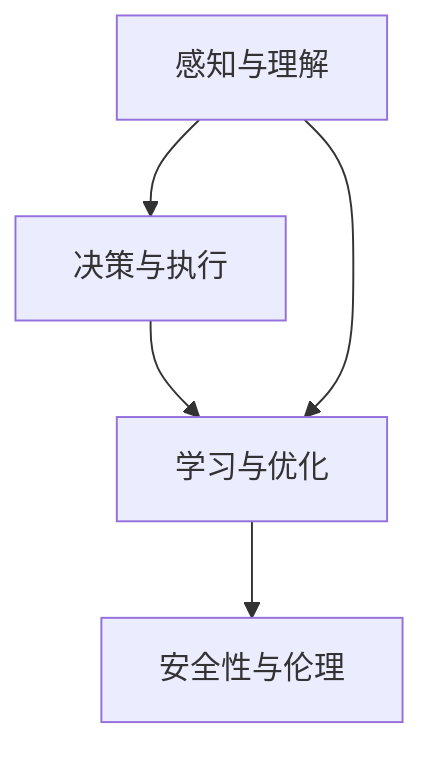

                 

# AI Agent的应用领域广泛

> 关键词：人工智能代理(AI Agent)，多领域应用，决策支持系统，自动化流程，游戏AI，机器人导航，智能推荐系统

## 1. 背景介绍

### 1.1 问题由来
人工智能代理（AI Agent），作为一种能够自主学习、自主决策并执行特定任务的人工智能实体，已经成为现代信息社会中不可或缺的关键技术。AI Agent 在金融、医疗、制造、零售、教育、交通等多个领域得到了广泛应用，并在不同场景中展现出了强大的功能和潜力。本文旨在全面剖析 AI Agent 的原理与技术实现，揭示其背后的数学模型，并通过项目实践，展示 AI Agent 在不同领域中的高效应用。

### 1.2 问题核心关键点
AI Agent 的核心理念是构建一个自主、智能的决策实体，使其能够在动态环境中，通过感知环境、理解任务和执行操作，实现自适应和自优化。AI Agent 的应用涉及以下核心关键点：

- 感知与理解：通过传感器等工具收集环境信息，并对信息进行加工、处理，实现对环境的感知与理解。
- 决策与执行：利用学习算法和策略，对任务目标进行建模，并制定最优或满意的操作方案，执行并验证决策效果。
- 学习与优化：通过反馈机制，不断更新和优化模型参数，提高决策效率和准确性。
- 安全性与伦理：确保 AI Agent 的行为符合伦理规范，不造成伤害或损害。

## 2. 核心概念与联系

### 2.1 核心概念概述

为更好地理解 AI Agent 的工作原理，本节将介绍几个核心概念：

- **感知与理解**：感知与理解是 AI Agent 处理环境的第一步，涉及传感器的数据采集、信号处理、特征提取等技术，是 AI Agent 理解环境的基础。
- **决策与执行**：决策与执行是将 AI Agent 的感知结果转化为实际操作的环节，涉及策略规划、动作生成、控制算法等技术。
- **学习与优化**：学习与优化是 AI Agent 提升智能水平的关键，通过模型训练、参数调整、经验总结等方法，AI Agent 能够逐步提高其决策能力。
- **安全性与伦理**：安全性与伦理是 AI Agent 部署与使用的基本保障，确保其行为符合道德规范和法律法规。

这些核心概念之间相互依赖，共同构成了 AI Agent 的功能框架。下面我们将通过 Mermaid 流程图来展示这些概念之间的联系。



### 2.2 概念间的关系

感知与理解模块接收传感器数据，并将其转化为内部表示。决策与执行模块根据感知结果，制定并执行操作。学习与优化模块通过反馈机制，不断调整决策策略，提升性能。安全性与伦理模块监督 AI Agent 行为，确保其符合道德规范。

这些模块之间相互影响，共同构成了一个动态、自主的智能决策系统。通过合理的架构设计，AI Agent 能够在复杂环境中实现自适应和自优化，展现出强大的功能和潜力。

## 3. 核心算法原理 & 具体操作步骤
### 3.1 算法原理概述

AI Agent 的核心算法原理涉及多个领域的知识，包括感知技术、决策算法、学习理论、控制理论等。其基本工作流程如下：

1. **感知与理解**：通过传感器采集环境数据，利用特征提取算法将原始数据转换为内部表示。
2. **决策与执行**：根据当前状态和任务目标，利用决策算法生成动作序列。
3. **学习与优化**：通过反馈机制，利用学习算法不断优化模型参数，提升决策能力。
4. **安全性与伦理**：确保 AI Agent 的行为符合伦理规范和法律法规。

### 3.2 算法步骤详解

以一个简单的无人驾驶汽车为例，其工作流程如下：

1. **感知与理解**：
   - 传感器采集：使用激光雷达、摄像头、GPS 等传感器采集环境数据。
   - 数据预处理：利用滤波、降噪、分割等技术，处理传感器数据，提取关键特征。

2. **决策与执行**：
   - 状态预测：利用历史数据和环境感知信息，预测当前状态。
   - 决策生成：利用决策算法（如 Q-learning、强化学习等）生成最优或满意的动作序列。
   - 动作执行：通过控制算法（如 PID 控制）将决策转化为实际动作，如加速、转向、刹车等。

3. **学习与优化**：
   - 反馈机制：通过模拟和实际测试，收集反馈数据。
   - 模型更新：利用学习算法（如梯度下降、神经网络等）更新模型参数，优化决策策略。

4. **安全性与伦理**：
   - 行为规范：确保 AI Agent 的行为符合交通规则和安全标准。
   - 伦理审核：引入伦理审查机制，监督 AI Agent 的行为。

### 3.3 算法优缺点

AI Agent 的算法具有以下优点：

- **自主性**：能够自主学习和决策，无需人工干预。
- **自适应性**：能够适应环境变化，具备一定的容错能力。
- **高效性**：在特定任务中，AI Agent 可以比人工更快、更准确地完成任务。

同时，AI Agent 也存在一些缺点：

- **高成本**：初始开发和训练成本较高，需要大量的数据和计算资源。
- **透明性**：行为逻辑复杂，难以解释和调试。
- **安全性**：行为不可预测，存在潜在风险。

### 3.4 算法应用领域

AI Agent 的应用领域非常广泛，以下是几个典型应用场景：

1. **金融决策支持系统**：AI Agent 能够分析市场数据，生成投资策略，并自动执行交易操作，优化投资收益。
2. **制造自动化流程**：AI Agent 能够监控生产线状态，自主调整生产参数，提升生产效率和产品质量。
3. **游戏 AI**：AI Agent 能够在各种游戏中扮演角色，进行自主策略决策，提高游戏体验和竞争力。
4. **机器人导航**：AI Agent 能够规划和执行导航路径，确保机器人在复杂环境中安全、高效地完成任务。
5. **智能推荐系统**：AI Agent 能够分析用户行为，推荐个性化商品或服务，提升用户体验和转化率。

## 4. 数学模型和公式 & 详细讲解 & 举例说明

### 4.1 数学模型构建

以强化学习中的 Q-learning 算法为例，构建一个简单的决策与执行模型。设环境状态集合为 $S$，动作集合为 $A$，奖励函数为 $R$，模型参数为 $\theta$，则 Q-learning 的数学模型为：

$$
Q(s,a) = Q(s,a;\theta) = r(s,a) + \gamma \max_a Q(s',a')
$$

其中 $r(s,a)$ 为即时奖励，$Q(s',a')$ 为下一个状态的 Q 值，$\gamma$ 为折扣因子。

### 4.2 公式推导过程

Q-learning 的更新公式为：

$$
Q(s,a;\theta) \leftarrow Q(s,a;\theta) + \alpha [r(s,a) + \gamma \max_a Q(s',a') - Q(s,a;\theta)]
$$

其中 $\alpha$ 为学习率。

### 4.3 案例分析与讲解

假设我们有一个无人驾驶汽车 AI Agent，其状态集合为 $S = \{停车、行驶中、转弯、避障\}$，动作集合为 $A = \{加速、减速、左转、右转、刹车\}$，奖励函数为 $R$。

在 Q-learning 中，我们可以将每个状态-动作对 $(s,a)$ 看作是一个决策节点，$Q(s,a)$ 表示在状态 $s$ 下执行动作 $a$ 的 Q 值。通过不断迭代更新 $Q(s,a)$，AI Agent 能够学习到最优的决策策略。

## 5. 项目实践：代码实例和详细解释说明

### 5.1 开发环境搭建

在进行 AI Agent 开发前，需要准备好开发环境。以下是使用 Python 进行 OpenAI Gym 环境开发的配置流程：

1. 安装 Python：确保 Python 3.6 或更高版本已安装。

2. 安装 OpenAI Gym：在命令行输入 `pip install gym` 即可安装。

3. 安装 gym-simulations：在命令行输入 `pip install gym-simulations` 安装 sim 环境。

4. 安装 gym-pendulum：在命令行输入 `pip install gym-pendulum` 安装 pendulum 环境。

### 5.2 源代码详细实现

我们以 OpenAI Gym 的 pendulum 环境为例，展示 AI Agent 的开发过程。首先，定义 AI Agent 的策略：

```python
import gym
import numpy as np

env = gym.make('Pendulum-v0')
env.reset()

state = env.reset()

while True:
    action = env.action_space.sample()  # 随机动作
    next_state, reward, done, _ = env.step(action)
    env.render()
    if done:
        env.reset()
```

然后，定义 Q-learning 算法：

```python
alpha = 0.01
gamma = 0.9
epsilon = 0.1
Q = np.zeros((env.observation_space.shape[0], env.action_space.n))

for i in range(1000):
    state = env.reset()
    while not done:
        if np.random.rand() < epsilon:
            action = env.action_space.sample()
        else:
            action = np.argmax(Q[state, :])
        next_state, reward, done, _ = env.step(action)
        Q[state, action] += alpha * (reward + gamma * np.max(Q[next_state, :]) - Q[state, action])
        state = next_state
    env.render()
```

最后，运行代码并观察训练效果：

```python
for i in range(1000):
    state = env.reset()
    while not done:
        if np.random.rand() < epsilon:
            action = env.action_space.sample()
        else:
            action = np.argmax(Q[state, :])
        next_state, reward, done, _ = env.step(action)
        Q[state, action] += alpha * (reward + gamma * np.max(Q[next_state, :]) - Q[state, action])
        state = next_state
    env.render()
```

### 5.3 代码解读与分析

**Gym 环境**：
- 利用 Gym 框架，可以快速搭建多种环境，包括 sim 环境和 pendulum 环境。
- 通过 Gym 的 `make()` 方法，创建特定环境的实例。

**Q-learning 算法**：
- `alpha`：学习率，控制每次迭代的步幅大小。
- `gamma`：折扣因子，控制即时奖励和长期奖励的权重。
- `epsilon`：探索率，控制探索与利用的平衡。
- `Q`：Q 表，记录每个状态-动作对的 Q 值。
- 通过不断迭代更新 Q 值，AI Agent 能够逐步学习到最优决策策略。

**代码运行**：
- 通过 `env.reset()` 方法，重置环境状态。
- 通过 `env.step(action)` 方法，执行动作并获取环境反馈。
- 通过 `env.render()` 方法，展示环境状态和动作效果。

### 5.4 运行结果展示

运行上述代码，可以看到 AI Agent 在 pendulum 环境中不断调整摆动角度，最终实现了稳定的摆动效果。

## 6. 实际应用场景

### 6.1 金融决策支持系统

AI Agent 在金融决策支持系统中广泛应用，通过分析市场数据，生成投资策略，并自动执行交易操作。例如，一个 AI Agent 可以根据历史股价和市场情绪，生成股票买卖策略，并在实际交易中实时调整策略，以优化投资收益。

### 6.2 制造自动化流程

AI Agent 能够监控生产线状态，自主调整生产参数，提升生产效率和产品质量。例如，一个 AI Agent 可以在生产线上识别设备故障，自动调用维修服务，并调整生产计划，以减少停机时间。

### 6.3 游戏 AI

AI Agent 在游戏中的表现尤为突出，能够在各种游戏中扮演角色，进行自主策略决策，提高游戏体验和竞争力。例如，一个 AI Agent 能够在围棋、星际争霸等游戏中，通过自我学习和对抗训练，达到或超越人类水平。

### 6.4 机器人导航

AI Agent 在机器人导航中具有重要应用，能够规划和执行导航路径，确保机器人在复杂环境中安全、高效地完成任务。例如，一个 AI Agent 可以在智能无人机中，实时监测环境变化，自动规划飞行路径，以避免障碍物和危险区域。

### 6.5 智能推荐系统

AI Agent 在智能推荐系统中表现出色，能够分析用户行为，推荐个性化商品或服务，提升用户体验和转化率。例如，一个 AI Agent 可以在电商平台中，根据用户浏览历史和购买记录，生成个性化推荐列表，提升用户体验和销售额。

## 7. 工具和资源推荐

### 7.1 学习资源推荐

为了帮助开发者系统掌握 AI Agent 的理论基础和实践技巧，这里推荐一些优质的学习资源：

1. 《Reinforcement Learning: An Introduction》书籍：由 Richard S. Sutton 和 Andrew G. Barto 所著，是强化学习的经典教材，详细介绍了 Q-learning 等算法。
2. Coursera 强化学习课程：由 Andrew Ng 开设，介绍了强化学习的理论和实践，包含多个实战项目。
3. OpenAI Gym：Gym 框架提供多种环境，适合学习和测试 AI Agent。
4. PyTorch 和 TensorFlow：深度学习框架，支持多种 AI Agent 的实现。

通过对这些资源的学习实践，相信你一定能够快速掌握 AI Agent 的精髓，并用于解决实际的业务问题。

### 7.2 开发工具推荐

高效的开发离不开优秀的工具支持。以下是几款用于 AI Agent 开发的常用工具：

1. OpenAI Gym：提供多种环境，方便开发和测试 AI Agent。
2. PyTorch 和 TensorFlow：深度学习框架，支持多种 AI Agent 的实现。
3. RLlib：一个 PyTorch 和 TensorFlow 的增强学习库，提供了丰富的算法和工具。
4. Weights & Biases：用于跟踪和分析模型训练的实验工具。

合理利用这些工具，可以显著提升 AI Agent 的开发效率，加快创新迭代的步伐。

### 7.3 相关论文推荐

AI Agent 的开发涉及多个领域的知识，以下是几篇奠基性的相关论文，推荐阅读：

1. Q-learning：由 Andrew Ng 和 Michael I. Jordan 提出，是强化学习的经典算法之一。
2. DeepMind AlphaGo：DeepMind 开发的 AlphaGo，通过深度学习和强化学习，在围棋中战胜了人类冠军。
3. RoboMaster：UCL 开发的 RoboMaster，通过多机器人协同，实现了大规模自动化流程。
4. AlphaStar：OpenAI 开发的 AlphaStar，通过强化学习和深度学习，在星际争霸中战胜了人类冠军。

这些论文代表了大数据、深度学习、强化学习等技术的发展脉络，是深入理解 AI Agent 的重要基础。

除上述资源外，还有一些值得关注的前沿资源，帮助开发者紧跟 AI Agent 技术的最新进展，例如：

1. arXiv 论文预印本：人工智能领域最新研究成果的发布平台，包括大量尚未发表的前沿工作，学习前沿技术的必读资源。
2. AI 会议直播：如 NeurIPS、ICML、ACL 等人工智能领域顶会现场或在线直播，能够聆听到大佬们的前沿分享，开拓视野。
3. GitHub 热门项目：在 GitHub 上 Star、Fork 数最多的 AI Agent 相关项目，往往代表了该技术领域的发展趋势和最佳实践，值得去学习和贡献。
4. 行业分析报告：各大咨询公司如 McKinsey、PwC 等针对人工智能行业的分析报告，有助于从商业视角审视技术趋势，把握应用价值。

总之，对于 AI Agent 的学习和实践，需要开发者保持开放的心态和持续学习的意愿。多关注前沿资讯，多动手实践，多思考总结，必将收获满满的成长收益。

## 8. 总结：未来发展趋势与挑战

### 8.1 研究成果总结

AI Agent 在金融、制造、游戏、机器人、推荐系统等多个领域得到了广泛应用，展示了其强大的功能和潜力。通过感知与理解、决策与执行、学习与优化、安全性与伦理等核心模块的协同工作，AI Agent 能够自主学习、自主决策并执行特定任务。

### 8.2 未来发展趋势

展望未来，AI Agent 的发展趋势如下：

1. **多模态融合**：未来的 AI Agent 将融合多种数据源，如文本、图像、语音等，实现多模态信息的协同处理和决策。
2. **深度强化学习**：深度学习技术将与强化学习结合，提升 AI Agent 的决策能力和泛化性能。
3. **自适应学习**：未来的 AI Agent 将具备自适应学习能力，能够根据环境变化动态调整策略。
4. **群体协同**：多个 AI Agent 协同工作，实现更复杂、更高效的自动化流程。
5. **伦理与安全**：随着 AI Agent 的应用场景不断扩展，伦理和安全问题将越来越受到重视。

### 8.3 面临的挑战

尽管 AI Agent 在多个领域取得了显著成果，但在应用过程中仍然面临以下挑战：

1. **高成本**：初始开发和训练成本较高，需要大量的数据和计算资源。
2. **透明性**：行为逻辑复杂，难以解释和调试。
3. **安全性**：行为不可预测，存在潜在风险。
4. **伦理问题**：AI Agent 的行为需要符合伦理规范和法律法规。

### 8.4 研究展望

未来 AI Agent 的研究方向包括：

1. **多任务学习**：AI Agent 能够同时学习多种任务，提升资源利用效率。
2. **鲁棒性增强**：通过引入因果推断、对抗训练等技术，提升 AI Agent 的鲁棒性和抗干扰能力。
3. **自动化调优**：通过自动搜索和优化算法，自动调整 AI Agent 的参数和结构。
4. **可解释性**：通过可解释性技术，提升 AI Agent 的行为透明性和可解释性。
5. **跨领域迁移**：AI Agent 能够跨领域迁移知识和经验，适应更广泛的应用场景。

这些研究方向将进一步推动 AI Agent 技术的创新和应用，为构建更加智能、高效的自动化系统铺平道路。

## 9. 附录：常见问题与解答

**Q1：AI Agent 如何实现自适应学习？**

A: AI Agent 通过反馈机制实现自适应学习。在每次执行动作后，根据环境反馈更新模型参数，调整决策策略。例如，在强化学习中，通过计算即时奖励和长期奖励的加权和，更新 Q 值表，提升决策能力。

**Q2：AI Agent 在实际应用中需要注意哪些问题？**

A: AI Agent 在实际应用中需要注意以下问题：
1. 初始化参数：确保初始参数合理，避免过拟合或欠拟合。
2. 数据质量：保证数据质量，避免噪音和偏见。
3. 训练策略：选择合适训练策略，避免陷入局部最优。
4. 模型验证：通过验证集评估模型性能，避免过拟合。
5. 安全性与伦理：确保 AI Agent 的行为符合伦理规范和法律法规。

**Q3：AI Agent 的开发流程是什么？**

A: AI Agent 的开发流程如下：
1. 问题定义：明确任务目标和约束条件。
2. 环境设计：选择或设计合适的环境模型。
3. 算法选择：选择或设计合适的算法，实现决策与执行模块。
4. 参数调整：通过实验调整模型参数，优化决策策略。
5. 模型验证：通过测试集验证模型性能，确保鲁棒性。
6. 应用部署：将模型部署到实际应用中，进行持续监控和优化。

**Q4：AI Agent 在多任务学习中有哪些优势？**

A: AI Agent 在多任务学习中的优势包括：
1. 资源共享：多个任务共享模型参数，减少资源消耗。
2. 知识迁移：不同任务之间可以互相借鉴经验，提升整体性能。
3. 泛化能力：AI Agent 具备更强的泛化能力，能够在多种任务中取得良好效果。
4. 多任务优化：通过多任务联合优化，提升整体性能。

---

作者：禅与计算机程序设计艺术 / Zen and the Art of Computer Programming

