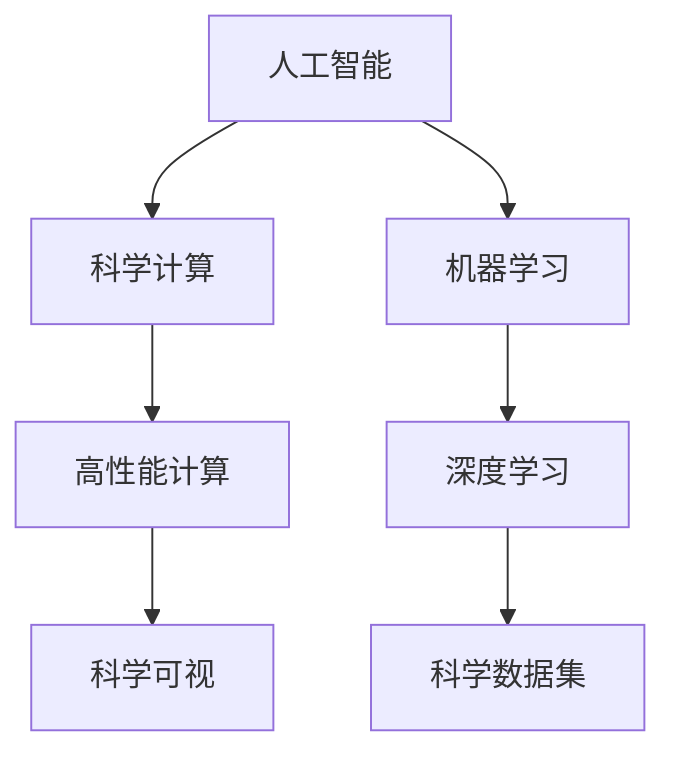

                 

# AI for Science的综合视角

## 1. 背景介绍

### 1.1 问题由来
随着人工智能(AI)技术的迅猛发展，其在科学研究和探索中的应用越来越广泛。从天文学、生物学到化学、地球科学等领域，AI为科学家提供了强大的计算工具和分析手段，极大地提升了科研效率和精度。其中，深度学习等机器学习方法，通过处理海量数据和复杂模型，为科学研究注入了新的动力。

然而，AI在科学中的应用仍然面临许多挑战。数据质量、模型复杂性、计算资源等都是制约AI在科学中发挥更大作用的瓶颈。此外，AI技术的应用往往依赖于特定的算法和数据，缺乏通用的科学原理和理论支持。

本文旨在从多角度综合探讨AI在科学中的应用，探讨如何更好地利用AI技术提升科研能力，同时克服其局限性，推动科学研究的持续进步。

## 2. 核心概念与联系

### 2.1 核心概念概述
- **人工智能(AI)**：一种利用计算机模拟人类智能的技术，包括机器学习、深度学习、自然语言处理、计算机视觉等多个分支。
- **科学计算(Scientific Computing)**：利用计算机进行科学研究和工程模拟的计算方法，包括数值计算、模拟计算、可视化等。
- **机器学习(Machine Learning)**：一种通过数据训练模型，实现对新数据预测和分类的技术。
- **深度学习(Deep Learning)**：一种利用多层神经网络进行复杂数据分析和模式识别的技术，是机器学习的一种高级形式。
- **科学数据集(Scientific Dataset)**：用于机器学习和深度学习训练和测试的数据集，通常包含科学实验或模拟产生的数据。
- **高性能计算(High-Performance Computing, HPC)**：利用大规模计算机集群进行高性能计算，以加速科学模拟和数据分析。
- **科学可视(Scientific Visualization)**：将科学数据和计算结果转化为图形化的展示方式，帮助科学家更好地理解数据和结果。

这些核心概念构成了AI在科学研究中的应用基础，相互联系、相互促进，共同推动科学研究的进步。

### 2.2 概念间的关系
这些核心概念之间的关系可以通过以下Mermaid流程图来展示：



这个流程图展示了人工智能与科学计算、机器学习、深度学习等分支的关系。其中，科学数据集是这些技术的基础，高性能计算和科学可视则是提升科研效率和结果展示的关键手段。

## 3. 核心算法原理 & 具体操作步骤

### 3.1 算法原理概述
AI在科学研究中的应用，主要体现在以下几个方面：

- **数据处理与分析**：利用机器学习和深度学习算法，对科学数据进行预处理、特征提取和模型训练，以识别数据中的模式和规律。
- **模拟与建模**：使用深度学习模型对复杂系统进行模拟和建模，帮助科学家理解自然界和科学现象的机制。
- **科学发现**：通过数据分析和模式识别，发现科学实验和模拟中的新现象和规律，推动科学研究的深入。
- **自动化实验**：利用机器学习算法对实验过程进行自动化控制，提高实验效率和准确性。

### 3.2 算法步骤详解

**Step 1: 数据收集与预处理**

- **数据收集**：从科学研究中收集数据，包括实验数据、模拟数据、观测数据等。
- **数据清洗**：处理缺失数据、异常值、噪声等，保证数据的质量和一致性。
- **特征提取**：从原始数据中提取有意义的特征，供模型训练使用。

**Step 2: 模型训练与评估**

- **模型选择**：根据数据类型和问题需求，选择合适的机器学习或深度学习模型。
- **模型训练**：使用数据集对模型进行训练，优化模型参数。
- **模型评估**：在测试集上评估模型性能，选择最优模型。

**Step 3: 科学模拟与分析**

- **模型应用**：将训练好的模型应用于新数据，进行科学模拟和数据分析。
- **结果分析**：利用科学可视等手段，展示和分析模型结果，发现科学规律和现象。

**Step 4: 自动化实验与优化**

- **实验设计**：根据科学研究需求，设计自动化实验流程。
- **实验控制**：使用机器学习算法对实验过程进行控制和优化，提升实验效率。

### 3.3 算法优缺点

**优点**：

- **高效性**：机器学习和深度学习算法能够处理大规模数据，快速识别出数据中的模式和规律。
- **普适性**：算法可以应用于多种科学问题，具有较强的泛化能力。
- **自动化**：自动化实验和数据分析能够提高科研效率，减少人工错误。

**缺点**：

- **数据依赖**：算法性能高度依赖数据质量，数据噪声和缺失值可能导致模型失效。
- **复杂性**：深度学习模型的复杂度较高，需要大量的计算资源和时间进行训练和调优。
- **可解释性**：部分深度学习模型的决策过程难以解释，缺乏科学依据。

### 3.4 算法应用领域

AI在科学中的应用涉及多个领域，包括：

- **天文学**：利用机器学习对天文图像进行处理和分析，识别天体特征和运动规律。
- **生物信息学**：使用深度学习算法对生物序列和图像进行分类和预测，发现基因功能和药物靶点。
- **地球科学**：通过模拟和数据分析，预测气候变化、地质灾害等环境问题。
- **化学**：利用机器学习进行分子模拟和反应预测，加速新药和材料设计。
- **物理**：使用深度学习模型进行量子计算和物质模拟，探索新物理规律。

## 4. 数学模型和公式 & 详细讲解 & 举例说明

### 4.1 数学模型构建

在科学研究中，常见的数学模型包括回归模型、分类模型、聚类模型等。以线性回归模型为例，其基本形式为：

$$
y = \theta_0 + \theta_1 x_1 + \theta_2 x_2 + \cdots + \theta_n x_n + \epsilon
$$

其中 $y$ 为输出变量，$\theta$ 为模型参数，$x$ 为输入变量，$\epsilon$ 为误差项。

### 4.2 公式推导过程

以线性回归模型为例，其最小二乘法的参数估计公式为：

$$
\hat{\theta} = (X^T X)^{-1} X^T y
$$

其中 $\hat{\theta}$ 为模型参数估计值，$X$ 为设计矩阵，$y$ 为输出向量。

### 4.3 案例分析与讲解

以生物信息学中的基因功能预测为例，假设已知一组基因表达数据 $x_i$，对应标签 $y_i \in \{1, -1\}$。使用逻辑回归模型进行分类，构建损失函数：

$$
\mathcal{L}(\theta) = -\frac{1}{N}\sum_{i=1}^N y_i \log(\sigma(\theta^T x_i)) + (1-y_i)\log(1-\sigma(\theta^T x_i))
$$

其中 $\sigma(\cdot)$ 为sigmoid函数，$\theta$ 为模型参数。最小化损失函数，使用梯度下降法更新参数。

## 5. 项目实践：代码实例和详细解释说明

### 5.1 开发环境搭建

在进行AI科学计算的项目开发中，我们需要准备相应的开发环境。以下是Python环境搭建的详细步骤：

1. 安装Anaconda：从官网下载并安装Anaconda，用于创建独立的Python环境。
2. 创建并激活虚拟环境：
```bash
conda create -n sci-env python=3.8 
conda activate sci-env
```
3. 安装Scikit-learn、TensorFlow、PyTorch等科学计算库：
```bash
pip install scikit-learn tensorflow pytorch
```
4. 安装其他必要的科学计算工具和库：
```bash
pip install matplotlib seaborn pandas jupyter notebook ipython
```

### 5.2 源代码详细实现

以下以线性回归模型为例，给出科学计算的代码实现。

```python
import numpy as np
import pandas as pd
from sklearn.linear_model import LinearRegression

# 读取数据集
data = pd.read_csv('data.csv')

# 分割数据集为训练集和测试集
train_data = data[:int(0.8*len(data))]
test_data = data[int(0.8*len(data)):]

# 定义模型
model = LinearRegression()

# 训练模型
model.fit(train_data[['x1', 'x2']], train_data['y'])

# 预测测试集
y_pred = model.predict(test_data[['x1', 'x2']])

# 输出结果
print('R^2:', model.score(test_data[['x1', 'x2']], test_data['y']))
```

### 5.3 代码解读与分析

上述代码实现了线性回归模型的训练和预测过程。具体步骤如下：

1. 读取数据集，并分割为训练集和测试集。
2. 定义线性回归模型。
3. 使用训练集数据拟合模型参数。
4. 使用测试集数据预测结果，并计算模型精度。

## 6. 实际应用场景

### 6.1 天文学

天文学中，深度学习算法被广泛应用于图像处理和数据挖掘。例如，使用卷积神经网络(CNN)对天文图像进行分类，识别不同类型的天体和星系。此外，基于深度学习的天体运动轨迹预测、星象事件预测等应用也逐渐兴起。

### 6.2 生物信息学

生物信息学中的基因组数据分析、蛋白质序列预测等任务，都可以通过深度学习算法实现。例如，使用卷积神经网络对蛋白质序列进行分类，预测其功能；使用循环神经网络(RNN)对基因序列进行序列分类和预测。

### 6.3 地球科学

地球科学领域，深度学习算法被应用于气候变化预测、地质灾害预警等任务。例如，使用卷积神经网络对遥感图像进行分类，识别不同类型的地貌和环境特征；使用循环神经网络对地震数据进行预测，提前预警地质灾害。

### 6.4 未来应用展望

未来，AI在科学研究中的应用将进一步深化和扩展。随着算力资源的提升和计算技术的进步，AI将在更大规模、更复杂的问题上发挥作用。例如，量子计算、分子模拟、宇宙大尺度结构预测等前沿研究领域，都将受益于AI技术。

## 7. 工具和资源推荐

### 7.1 学习资源推荐

1. 《Python for Data Science》书籍：介绍了Python在数据科学中的应用，包括Numpy、Pandas、Matplotlib等库的使用。
2. 《Deep Learning》书籍：深度学习领域的经典教材，涵盖了深度学习算法的基本原理和应用。
3. Coursera《Machine Learning》课程：由斯坦福大学Andrew Ng教授主讲的机器学习课程，系统讲解了机器学习的基本概念和算法。
4. Kaggle竞赛平台：提供了大量公开的科学数据集和竞赛任务，有助于实践和创新。
5. GitHub开源项目：如TensorFlow、Scikit-learn等项目，提供了丰富的科学计算工具和算法实现。

### 7.2 开发工具推荐

1. Jupyter Notebook：交互式编程环境，便于代码调试和数据展示。
2. Anaconda：Python环境管理工具，方便快速搭建和管理Python环境。
3. Git：版本控制系统，用于代码管理和协作开发。
4. GitHub：代码托管平台，便于代码共享和版本控制。
5. Docker：容器化技术，方便代码部署和环境复现。

### 7.3 相关论文推荐

1. DeepMind的AlphaFold论文：利用深度学习算法预测蛋白质结构，开启了蛋白质折叠领域的革命。
2. Google的BERT论文：提出基于Transformer的预训练语言模型，广泛应用于自然语言处理任务。
3. MIT的SimNet论文：利用深度学习模型进行基因模拟和网络结构预测，展示了AI在生命科学中的潜力。
4. Microsoft的SuperScale论文：利用深度学习进行大规模科学计算，展示了AI在高性能计算中的应用。

## 8. 总结：未来发展趋势与挑战

### 8.1 总结

本文从多角度综合探讨了AI在科学研究中的应用，阐述了其在数据处理、科学模拟、自动化实验等方面的作用和效果。AI为科学家提供了强大的计算工具和分析手段，极大地提升了科研效率和精度，推动了科学研究的深入发展。然而，AI在科学中的应用也面临诸多挑战，如数据质量、模型复杂性、计算资源等。未来的研究需要在这些方面进行深入探索，以充分发挥AI在科学中的潜力。

### 8.2 未来发展趋势

未来，AI在科学研究中的应用将进一步深化和扩展。主要趋势包括：

1. **自动化实验**：利用AI技术进行实验设计和控制，提高实验效率和准确性。
2. **跨领域融合**：AI技术与不同学科领域的深度融合，推动多学科交叉研究。
3. **模型解释性**：提高AI模型的可解释性，增强科学研究的透明度和可信度。
4. **数据增强与合成**：利用生成对抗网络(GAN)等技术，生成更多高质量科学数据，扩大数据集规模。
5. **模型优化与融合**：利用强化学习等技术，优化AI模型的参数和结构，提高性能和鲁棒性。
6. **多模态数据融合**：利用多模态数据融合技术，提升AI模型对复杂科学问题的理解能力。

### 8.3 面临的挑战

尽管AI在科学研究中的应用取得了显著成果，但仍面临诸多挑战：

1. **数据质量与获取**：科学数据的质量和获取难度较高，高质量数据集往往难以获取。
2. **模型复杂性与可解释性**：深度学习模型复杂度较高，缺乏足够的可解释性，难以满足科学研究的透明性和可信度需求。
3. **计算资源与成本**：大规模科学计算需要高算力和高成本，计算资源有限。
4. **跨学科融合**：AI技术在不同学科领域的融合应用面临技术和知识壁垒。
5. **伦理与安全**：AI技术的应用需要考虑伦理和安全问题，避免滥用和误用。

### 8.4 研究展望

未来的研究需要在以下几个方面进行深入探索：

1. **数据增强与合成**：利用生成对抗网络(GAN)等技术，生成更多高质量科学数据，扩大数据集规模。
2. **模型优化与融合**：利用强化学习等技术，优化AI模型的参数和结构，提高性能和鲁棒性。
3. **多模态数据融合**：利用多模态数据融合技术，提升AI模型对复杂科学问题的理解能力。
4. **模型解释性**：提高AI模型的可解释性，增强科学研究的透明度和可信度。
5. **跨学科融合**：促进AI技术与不同学科领域的深度融合，推动多学科交叉研究。
6. **伦理与安全**：建立AI技术的伦理和安全监管机制，避免滥用和误用。

总之，AI在科学研究中的应用前景广阔，但需要在数据、模型、计算资源等方面进行深入探索和优化，以充分发挥其潜力，推动科学研究的持续进步。

## 9. 附录：常见问题与解答

**Q1: 如何使用AI进行科学计算？**

A: 使用AI进行科学计算，一般需要以下步骤：
1. 数据收集与预处理：从科学实验或模拟中收集数据，并进行清洗和特征提取。
2. 模型训练与评估：选择合适的机器学习或深度学习模型，使用数据集进行训练和评估，选择最优模型。
3. 科学模拟与分析：将训练好的模型应用于新数据，进行科学模拟和数据分析，发现科学规律和现象。

**Q2: 如何提高AI模型的可解释性？**

A: 提高AI模型的可解释性，可以从以下几个方面入手：
1. 使用可解释性更高的模型，如决策树、线性回归等。
2. 利用模型解释性工具，如LIME、SHAP等，解释模型的决策过程。
3. 结合领域知识，构建更合理的特征提取和模型设计。

**Q3: 如何优化AI模型的计算效率？**

A: 优化AI模型的计算效率，可以从以下几个方面入手：
1. 使用高效的计算框架，如TensorFlow、PyTorch等。
2. 利用分布式计算技术，提升计算效率。
3. 使用模型压缩和稀疏化技术，减小模型尺寸。

**Q4: 如何避免AI模型的过拟合？**

A: 避免AI模型的过拟合，可以从以下几个方面入手：
1. 数据增强：通过数据扩充和增强，提高模型泛化能力。
2. 正则化技术：使用L2正则、Dropout等技术，防止模型过拟合。
3. 模型集成：使用多个模型的集成方法，提高模型的鲁棒性和泛化能力。

**Q5: 如何选择合适的AI算法？**

A: 选择合适的AI算法，一般需要考虑以下几个因素：
1. 数据类型和特征：根据数据类型和特征，选择合适的算法。
2. 任务类型和需求：根据任务类型和需求，选择合适的算法。
3. 计算资源和效率：根据计算资源和效率需求，选择合适的算法。

总之，AI在科学研究中的应用前景广阔，但需要在数据、模型、计算资源等方面进行深入探索和优化，以充分发挥其潜力，推动科学研究的持续进步。

---

作者：禅与计算机程序设计艺术 / Zen and the Art of Computer Programming

