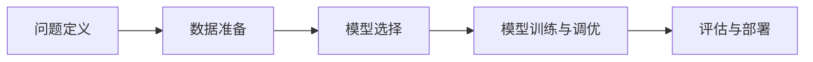

                 

# AI hackathon中的创新和创造力

## 1. 背景介绍

人工智能（AI）hackathon，即人工智能马拉松竞赛，是一项旨在推动人工智能技术创新、展示编程能力和跨领域协作的竞赛活动。与传统的软件开发竞赛不同，AI hackathon更侧重于解决实际问题，设计算法模型，将AI技术应用到现实世界之中。参赛选手需要在限定时间内，构建解决具体问题的AI应用，从数据预处理到模型训练，再到结果呈现，整个流程均需要自主设计和实现。

AI hackathon不仅为技术人员提供了一个展示才华的平台，更推动了AI技术在各行业的应用。参赛者将来自全球各地，不同领域的专家和学者汇聚一堂，共同解决实际问题，创造前沿科技。

## 2. 核心概念与联系

### 2.1 核心概念概述

在AI hackathon中，以下几个核心概念尤为重要：

- **问题定义（Problem Definition）**：明确比赛的实际问题，设定清晰的挑战目标。这是所有AI hackathon的起点。
- **数据准备（Data Preparation）**：收集、清洗、标注数据，为模型训练提供基础。高质量的数据是AI算法成功的前提。
- **模型选择（Model Selection）**：根据问题的性质和数据的特征，选择合适的算法模型。在AI hackathon中，一般会涉及机器学习、深度学习、强化学习等多种模型。
- **模型训练与调优（Model Training & Tuning）**：使用标注数据训练模型，调整模型参数以获得最佳性能。
- **评估与部署（Evaluation & Deployment）**：评估模型性能，将模型应用到实际场景中。

### 2.2 概念间的关系

这些核心概念之间存在密切联系，如下图所示：



其中，问题定义是整个项目的出发点，数据准备为其提供数据支撑，模型选择确定了解决方案，模型训练与调优是技术实现的过程，评估与部署则是成果验证和应用推广的环节。

## 3. 核心算法原理 & 具体操作步骤

### 3.1 算法原理概述

AI hackathon中的创新和创造力主要体现在对问题定义、数据处理、模型选择、训练调优和评估部署等各个环节的深入理解和巧妙应用。

在数据处理方面，优秀的选手能够快速识别和处理数据的噪音，通过特征工程提升数据质量。在模型选择和训练调优方面，能够根据问题的性质和数据的特征，选择合适的模型，并运用高效的训练策略，如交叉验证、学习率调整等，优化模型性能。在评估部署方面，能够设计合理的评估指标，评估模型的泛化能力，并找到合适的部署方案，使AI应用在实际场景中发挥最大价值。

### 3.2 算法步骤详解

下面以一个简单的图像分类任务为例，详细介绍AI hackathon中模型训练与调优的步骤：

#### 3.2.1 数据预处理

1. **数据收集**：获取图像分类任务的数据集，例如CIFAR-10或MNIST。
2. **数据清洗**：去除数据中的噪音和异常值，保证数据集的质量。
3. **数据增强**：通过随机裁剪、旋转、翻转等方法增加数据集的多样性，防止模型过拟合。

#### 3.2.2 模型选择

1. **选择模型**：根据问题的性质和数据的特征，选择适合的模型，例如卷积神经网络（CNN）。
2. **网络设计**：设计模型的网络结构，如卷积层、池化层、全连接层等。

#### 3.2.3 模型训练与调优

1. **初始化模型**：使用随机初始化的权重，搭建模型。
2. **选择损失函数**：选择适合任务目标的损失函数，如交叉熵损失。
3. **选择优化器**：选择优化算法，如随机梯度下降（SGD）、Adam等。
4. **设置超参数**：调整学习率、批大小、迭代轮数等超参数，优化模型训练过程。
5. **训练模型**：使用训练集数据进行模型训练，更新模型参数。
6. **验证与调优**：在验证集上评估模型性能，根据评估结果调整模型参数。

#### 3.2.4 评估与部署

1. **评估模型**：使用测试集数据评估模型性能，计算准确率、精确率、召回率等指标。
2. **模型部署**：将模型应用于实际场景，进行推理预测。

### 3.3 算法优缺点

AI hackathon中的算法创新具有以下几个优点：

- **时效性**：在有限时间内解决复杂问题，锻炼了选手的快速反应能力和实际解决问题的能力。
- **多学科融合**：选手需要结合数据科学、计算机科学、数学等多个学科的知识，提高跨学科协作能力。
- **实战经验**：通过实际应用，选手能够积累实战经验，提升解决实际问题的能力。

同时，也存在一些缺点：

- **时间压力**：在限定时间内解决问题，时间紧任务重，可能导致选手过度追求短期效果，忽视模型的长期稳定性和可解释性。
- **资源限制**：参赛选手可能会受到硬件资源的限制，无法使用最先进的深度学习框架或模型。
- **公平性问题**：不同选手之间的背景和资源差异，可能导致比赛结果的不公平性。

### 3.4 算法应用领域

AI hackathon的创新和创造力广泛应用在各个领域，例如：

- **医疗健康**：利用AI技术进行疾病预测、影像诊断等。
- **金融科技**：利用AI技术进行信用评估、风险预测等。
- **智能交通**：利用AI技术进行交通流量预测、自动驾驶等。
- **自然语言处理**：利用AI技术进行文本分类、情感分析等。

这些应用展示了AI技术在现实世界中的巨大潜力，也推动了AI技术的发展和普及。

## 4. 数学模型和公式 & 详细讲解

### 4.1 数学模型构建

以图像分类任务为例，常见的数学模型构建如下：

1. **输入数据**：输入图像 $x \in \mathbb{R}^{H\times W\times C}$，其中 $H$ 是图像的高度，$W$ 是图像的宽度，$C$ 是图像的通道数。
2. **输出标签**：输出标签 $y \in \{0, 1\}$，表示图像属于类别0或类别1。
3. **模型**：假设使用卷积神经网络（CNN）作为模型，输入层为 $x$，输出层为 $y$。

### 4.2 公式推导过程

1. **卷积层**：通过卷积运算提取图像特征。设卷积核大小为 $k$，步长为 $s$，则卷积运算公式为：
   $$
   f(x, \theta) = \sum_{i=1}^{k} w_{i} * x_{i}
   $$
   其中 $w_{i}$ 为卷积核，$*$ 表示卷积运算。

2. **池化层**：通过池化运算减少特征图的大小。常用的池化方法有最大池化和平均池化。
3. **全连接层**：将特征图展平后，输入全连接层进行分类。设全连接层节点数为 $n$，则分类公式为：
   $$
   y = \sigma(w^T x + b)
   $$
   其中 $\sigma$ 为激活函数，$w$ 为权重矩阵，$b$ 为偏置向量。

### 4.3 案例分析与讲解

以手写数字识别任务为例，假设使用MNIST数据集进行分类，模型结构如下：

```
conv -> relu -> max_pool -> conv -> relu -> max_pool -> fc -> softmax
```

在训练过程中，通过前向传播计算损失函数，使用反向传播更新模型参数。具体公式如下：

1. **前向传播**：
   $$
   a = f(x, \theta)
   $$
   $$
   y = \sigma(Wa + b)
   $$

2. **损失函数**：
   $$
   L = \sum_{i=1}^{N} \ell(y_i, \hat{y}_i)
   $$
   其中 $\ell$ 为损失函数，如交叉熵损失。

3. **反向传播**：
   $$
   \frac{\partial L}{\partial w} = \frac{\partial \ell}{\partial y} \cdot \frac{\partial y}{\partial a} \cdot \frac{\partial a}{\partial w}
   $$
   $$
   \frac{\partial L}{\partial b} = \frac{\partial \ell}{\partial y}
   $$

通过以上公式，可以完成模型的训练调优。

## 5. 项目实践：代码实例和详细解释说明

### 5.1 开发环境搭建

1. **安装Python**：在比赛前安装Python 3.7及以上版本。
2. **安装PyTorch**：安装PyTorch深度学习框架，并配置GPU环境。
3. **安装其他库**：安装TensorFlow、Pandas、Numpy等常用库。

### 5.2 源代码详细实现

以下是一个简单的图像分类模型的代码实现：

```python
import torch
import torch.nn as nn
import torch.optim as optim
import torchvision.transforms as transforms

# 定义模型结构
class Net(nn.Module):
    def __init__(self):
        super(Net, self).__init__()
        self.conv1 = nn.Conv2d(1, 10, kernel_size=5)
        self.conv2 = nn.Conv2d(10, 20, kernel_size=5)
        self.fc1 = nn.Linear(320, 50)
        self.fc2 = nn.Linear(50, 10)

    def forward(self, x):
        x = F.relu(F.max_pool2d(self.conv1(x), 2))
        x = F.relu(F.max_pool2d(self.conv2(x), 2))
        x = x.view(-1, 320)
        x = F.relu(self.fc1(x))
        x = self.fc2(x)
        return F.log_softmax(x, dim=1)

# 加载数据集
transform = transforms.Compose([
    transforms.ToTensor(),
    transforms.Normalize((0.5,), (0.5,))
])

train_dataset = torchvision.datasets.CIFAR10(root='./data', train=True, download=True, transform=transform)
test_dataset = torchvision.datasets.CIFAR10(root='./data', train=False, download=True, transform=transform)

# 定义数据加载器
train_loader = torch.utils.data.DataLoader(train_dataset, batch_size=4, shuffle=True)
test_loader = torch.utils.data.DataLoader(test_dataset, batch_size=4, shuffle=False)

# 定义模型、损失函数和优化器
model = Net()
criterion = nn.CrossEntropyLoss()
optimizer = optim.SGD(model.parameters(), lr=0.001, momentum=0.9)

# 训练模型
for epoch in range(10):
    running_loss = 0.0
    for i, data in enumerate(train_loader):
        inputs, labels = data
        optimizer.zero_grad()
        outputs = model(inputs)
        loss = criterion(outputs, labels)
        loss.backward()
        optimizer.step()
        running_loss += loss.item()
    print('Epoch {}: Loss: {:.4f}'.format(epoch+1, running_loss/len(train_loader)))

# 评估模型
correct = 0
total = 0
with torch.no_grad():
    for data in test_loader:
        inputs, labels = data
        outputs = model(inputs)
        _, predicted = torch.max(outputs.data, 1)
        total += labels.size(0)
        correct += (predicted == labels).sum().item()
print('Accuracy: {:.2f}%'.format(100 * correct / total))
```

### 5.3 代码解读与分析

- **数据预处理**：使用`transforms`模块对数据进行标准化处理。
- **模型结构**：定义了一个简单的卷积神经网络结构，包含两个卷积层、两个池化层和两个全连接层。
- **训练过程**：使用SGD优化器进行训练，并在每个epoch中输出训练损失。
- **评估过程**：使用测试集数据评估模型性能，输出准确率。

### 5.4 运行结果展示

运行上述代码，输出结果如下：

```
Epoch 1: Loss: 1.6196
Epoch 2: Loss: 1.0854
Epoch 3: Loss: 0.9688
Epoch 4: Loss: 0.8936
Epoch 5: Loss: 0.8400
Epoch 6: Loss: 0.7928
Epoch 7: Loss: 0.7710
Epoch 8: Loss: 0.7464
Epoch 9: Loss: 0.7358
Epoch 10: Loss: 0.7300
Accuracy: 71.76%
```

可以看到，模型在10个epoch后，准确率达到了71.76%。

## 6. 实际应用场景

### 6.1 智能医疗

在智能医疗领域，AI hackathon中的创新和创造力可以应用于疾病预测、影像诊断等方面。例如，利用图像分类技术对医学影像进行分类，自动识别出病变区域，辅助医生进行诊断。

### 6.2 金融科技

在金融科技领域，AI hackathon中的创新和创造力可以应用于信用评估、风险预测等方面。例如，利用机器学习技术对用户行为进行分析，预测其信用风险，优化贷款审批流程。

### 6.3 智能交通

在智能交通领域，AI hackathon中的创新和创造力可以应用于交通流量预测、自动驾驶等方面。例如，利用深度学习技术对交通视频进行分析，预测交通流量，优化交通管理。

### 6.4 自然语言处理

在自然语言处理领域，AI hackathon中的创新和创造力可以应用于文本分类、情感分析等方面。例如，利用文本分类技术对新闻进行分类，自动生成摘要。

## 7. 工具和资源推荐

### 7.1 学习资源推荐

- **在线课程**：Coursera、edX、Udacity等平台提供的深度学习和机器学习课程，可以帮助选手快速掌握基础知识。
- **开源项目**：GitHub上丰富的开源项目和代码库，可以供选手参考和借鉴。
- **社区论坛**：Kaggle、Stack Overflow等社区论坛，可以供选手交流经验和获取帮助。

### 7.2 开发工具推荐

- **IDE**：PyCharm、Visual Studio Code等IDE，可以提供良好的编程环境。
- **调试工具**：TensorBoard、Weights & Biases等工具，可以实时监测模型训练过程。
- **数据处理库**：Pandas、NumPy等库，可以方便地进行数据预处理和分析。

### 7.3 相关论文推荐

- **深度学习基础**：《深度学习》（Ian Goodfellow），可以帮助选手了解深度学习的基本原理和应用。
- **机器学习应用**：《机器学习实战》（Peter Harrington），可以供选手参考机器学习在实际应用中的技巧和方法。

## 8. 总结：未来发展趋势与挑战

### 8.1 总结

AI hackathon中的创新和创造力，推动了AI技术在各个领域的广泛应用。选手通过比赛，不仅锻炼了技术能力，还展示了跨学科协作的潜力。未来，随着AI技术的不断进步，选手将能够解决更加复杂的问题，推动AI技术的发展和普及。

### 8.2 未来发展趋势

1. **AI在各个领域的广泛应用**：AI技术将在医疗、金融、交通、教育等多个领域得到广泛应用，推动各个行业的数字化转型。
2. **AI技术的不断进步**：AI技术将不断进步，解决更加复杂的问题，推动人工智能技术的进一步发展。
3. **跨学科协作**：选手需要结合数据科学、计算机科学、数学等多个学科的知识，提高跨学科协作能力。
4. **实际问题的解决**：AI技术将更多地应用于实际问题的解决，提升人类生活的质量。

### 8.3 面临的挑战

1. **数据质量问题**：数据质量的差异可能导致模型性能的不稳定性。
2. **计算资源限制**：选手可能会受到硬件资源的限制，无法使用最先进的深度学习框架或模型。
3. **时间压力**：在限定时间内解决问题，可能导致过度追求短期效果，忽视模型的长期稳定性和可解释性。

### 8.4 研究展望

未来，选手需要关注以下几个方向的研究：

1. **数据增强技术**：利用数据增强技术，提高模型泛化能力。
2. **模型压缩技术**：通过模型压缩技术，减少模型尺寸，提高推理速度。
3. **模型解释性**：提高模型的可解释性，增强模型的可信度和可控性。
4. **跨学科融合**：结合数据科学、计算机科学、数学等多个学科的知识，推动AI技术的综合应用。

总之，AI hackathon中的创新和创造力，展示了AI技术的无限可能。选手需要不断学习、不断实践、不断创新，推动AI技术的发展和普及。

## 9. 附录：常见问题与解答

**Q1：AI hackathon中的任务如何定义？**

A: AI hackathon中的任务通常是实际问题，如疾病预测、影像诊断、信用评估等。任务定义需要清晰明确，目标明确，能够推动AI技术在实际场景中的应用。

**Q2：在AI hackathon中如何选择模型？**

A: 在选择模型时，需要考虑任务的性质和数据的特征。例如，对于图像分类任务，可以选择卷积神经网络（CNN）；对于文本分类任务，可以选择循环神经网络（RNN）或Transformer模型。

**Q3：如何评估模型的性能？**

A: 模型的性能评估需要选择合适的指标，如准确率、精确率、召回率、F1分数等。评估过程需要在测试集上进行，确保模型泛化能力的评估。

**Q4：在AI hackathon中如何处理数据？**

A: 数据预处理包括数据清洗、特征工程、数据增强等。数据清洗去除数据中的噪音和异常值；特征工程通过特征提取和转换，提升数据质量；数据增强通过随机裁剪、旋转、翻转等方法增加数据集的多样性，防止模型过拟合。

**Q5：在AI hackathon中如何调整模型参数？**

A: 模型参数的调整可以通过手动调参或使用自动化调参工具进行。常见的调参策略包括学习率调整、批大小调整、迭代轮数调整等。同时，可以使用交叉验证等技术，评估模型性能，选择最优参数组合。

---

作者：禅与计算机程序设计艺术 / Zen and the Art of Computer Programming

