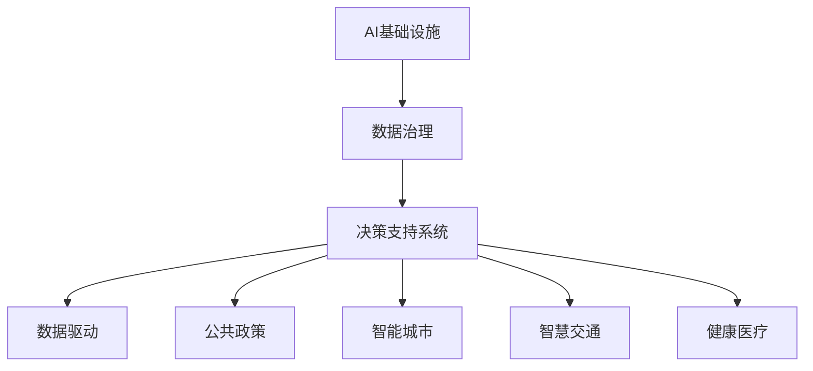
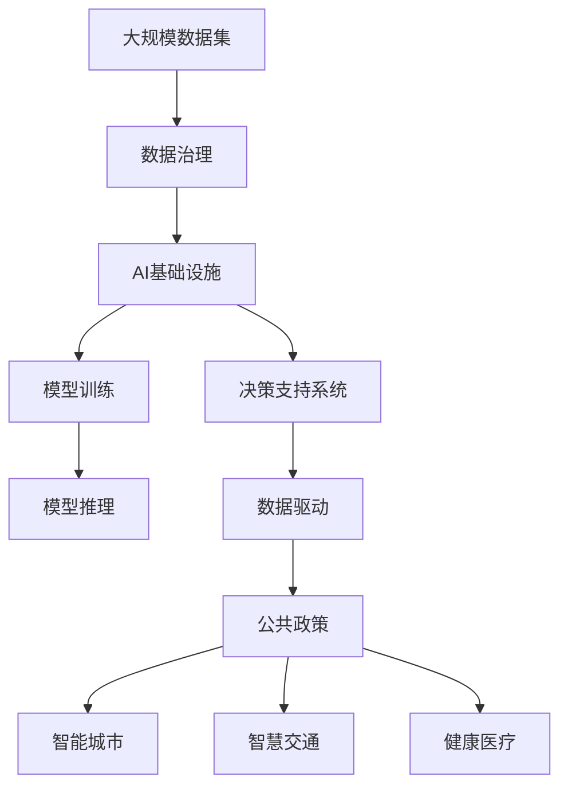

                 

# AI 基础设施的社会治理：数据驱动的决策支持系统

> 关键词：AI基础设施, 数据治理, 决策支持系统, 数据驱动, 公共政策, 智能城市, 智慧交通, 健康医疗

## 1. 背景介绍

### 1.1 问题由来
在现代社会的各个领域，从城市管理到公共卫生，再到交通运输和环境保护，决策者面临着前所未有的数据挑战。海量数据的涌现为人工智能(AI)的应用提供了广阔的舞台，但也带来了数据收集、存储、处理、治理的诸多问题。与此同时，传统决策机制往往滞后于数据的快速增长，难以有效利用数据进行科学决策，进而影响社会治理的效果。

### 1.2 问题核心关键点
AI基础设施在社会治理中的应用，核心在于数据驱动的决策支持系统。该系统能够通过数据收集、处理和分析，为决策者提供科学、及时、精准的决策依据，从而提升社会治理的智能化水平。

具体而言，需要解决以下关键问题：
1. 如何构建高效、可扩展的数据基础设施，支持海量数据的采集和存储？
2. 如何设计合理的算法和模型，从数据中提取出有用的信息，支持决策者做出正确判断？
3. 如何确保数据的准确性和安全性，避免因数据问题导致决策失误？
4. 如何结合具体领域的知识和经验，优化算法的性能，提升决策支持系统的实用性和可靠性？

### 1.3 问题研究意义
构建高效、可靠、智能的AI基础设施，对社会治理具有重要意义：

1. **提高决策效率**：通过数据驱动的决策支持系统，决策者可以快速获取相关信息，减少信息不对称和决策延迟，提升决策效率。
2. **增强决策质量**：AI算法能够从海量数据中提取出有价值的信息，辅助决策者做出更加科学、理性的决策，避免因信息不完全导致的决策失误。
3. **促进社会公平**：通过智能算法在社会治理中的应用，可以揭示出潜在的社会问题，并制定相应的政策，促进社会公平和福祉。
4. **增强灾害应对能力**：在灾害监测和预防方面，数据驱动的决策支持系统能够实时分析各种数据源，预测灾害发生的可能性，提前采取防范措施。
5. **推动社会可持续发展**：在环境保护和资源管理等领域，数据驱动的决策支持系统可以帮助优化资源配置，促进环境保护，推动社会可持续发展。

## 2. 核心概念与联系

### 2.1 核心概念概述

为更好地理解AI基础设施在社会治理中的应用，本节将介绍几个关键概念及其相互联系：

- **AI基础设施**：指支撑AI技术应用的基础设施，包括数据存储和处理平台、模型训练和推理环境、算法和工具库等。
- **数据治理**：指对数据收集、存储、处理、共享、访问和销毁等全生命周期进行管理和控制，以确保数据的完整性、一致性和安全性。
- **决策支持系统**：指利用数据、模型和算法，为决策者提供决策建议和辅助决策的系统，以提高决策质量和效率。
- **数据驱动**：指基于数据进行决策和分析，而非依赖经验或直觉，以增强决策的科学性和客观性。
- **公共政策**：指政府或其他公共机构制定的旨在解决社会问题、促进社会福祉的政策。
- **智能城市**：指通过应用各种智能技术，实现城市管理的智能化和高效化，提升居民生活质量。
- **智慧交通**：指通过AI技术实现交通管理的智能化，提升交通效率和安全性。
- **健康医疗**：指通过AI技术改善医疗服务质量，提升疾病诊断和治疗效率，推动健康医疗事业的发展。

这些概念之间的关系可以通过以下Mermaid流程图来展示：



这个流程图展示了AI基础设施中的各个组件及其功能：

1. **AI基础设施**：为数据治理和决策支持系统提供支撑。
2. **数据治理**：通过规范化的管理和控制，确保数据的质量和安全性。
3. **决策支持系统**：利用数据和AI算法，为决策者提供科学建议和辅助决策。
4. **数据驱动**：基于数据进行决策，提升决策质量和效率。
5. **公共政策**：结合数据驱动的决策，制定相应的政策。
6. **智能城市、智慧交通和健康医疗**：具体应用场景，通过决策支持系统实现智能化管理。

### 2.2 概念间的关系

这些概念之间的关系可以进一步细化为以下几点：

- **AI基础设施是数据治理和决策支持系统的基础**：没有良好的AI基础设施，数据治理和决策支持系统无从谈起。
- **数据治理是决策支持系统的前提**：数据治理确保了数据的质量和安全性，为决策支持系统提供了可靠的输入。
- **决策支持系统是数据驱动的关键工具**：通过数据驱动的决策支持系统，决策者能够更科学地进行决策。
- **公共政策是数据驱动的最终目标**：数据驱动的决策支持系统，为制定更科学的公共政策提供依据。
- **智能城市、智慧交通和健康医疗等具体应用场景**：数据驱动的决策支持系统，在各个具体领域的应用，展示了其在现实场景中的强大潜力。

### 2.3 核心概念的整体架构

最后，我们用一个综合的流程图来展示这些核心概念在大数据治理和社会治理中的应用：



这个综合流程图展示了从数据采集到最终公共政策的整个过程：

1. **大规模数据集**：原始数据通过数据治理，确保其质量和完整性。
2. **AI基础设施**：数据治理后的数据输入AI基础设施，用于模型训练和推理。
3. **模型训练**：在AI基础设施中，利用大量标注数据训练模型。
4. **模型推理**：在AI基础设施中，利用训练好的模型进行推理，生成决策建议。
5. **决策支持系统**：结合数据驱动，为决策者提供科学的决策建议。
6. **公共政策**：基于决策支持系统提供的数据和建议，制定相应的政策。
7. **智能城市、智慧交通和健康医疗**：具体应用场景，通过智能决策支持系统实现社会治理的智能化。

通过这个流程图，我们可以更清晰地理解AI基础设施在社会治理中的应用框架和流程。

## 3. 核心算法原理 & 具体操作步骤

### 3.1 算法原理概述

数据驱动的决策支持系统，其核心算法原理主要基于机器学习和深度学习技术。具体而言，数据驱动决策支持系统的工作流程如下：

1. **数据收集与清洗**：从不同数据源收集数据，并进行预处理，去除噪声和不完整数据。
2. **特征提取**：利用特征工程技术，从原始数据中提取有用的特征，供后续建模使用。
3. **模型训练**：选择合适的算法和模型，如随机森林、梯度提升树、神经网络等，对特征进行建模，生成预测模型。
4. **模型评估与优化**：通过交叉验证等方法，评估模型性能，并根据评估结果进行模型优化。
5. **模型部署**：将训练好的模型部署到生产环境中，进行实时推理和预测。
6. **数据反馈与更新**：定期收集新数据，更新模型，以适应不断变化的环境和需求。

### 3.2 算法步骤详解

以下是一个具体的决策支持系统构建流程，以智能交通系统为例：

1. **数据收集与清洗**：
   - 通过摄像头、传感器等设备，收集交通流量、车速、事故信息等数据。
   - 对收集到的数据进行清洗，去除异常值和噪声，确保数据质量。
   
2. **特征提取**：
   - 提取与交通流量、车速、事故信息等相关的特征，如时间、日期、位置、天气条件等。
   - 利用特征工程技术，生成更抽象、更有效的特征表示，如车辆密度、交通拥堵指数等。
   
3. **模型训练**：
   - 选择合适的算法，如随机森林、梯度提升树等，对清洗后的数据进行建模，生成预测模型。
   - 使用交叉验证等方法，评估模型性能，调整模型参数，优化模型效果。
   
4. **模型评估与优化**：
   - 使用测试集对训练好的模型进行评估，计算各项指标，如准确率、召回率、F1分数等。
   - 根据评估结果，调整模型参数，优化模型性能，确保模型在新数据上的泛化能力。
   
5. **模型部署**：
   - 将训练好的模型部署到交通管理中心，进行实时推理和预测。
   - 利用部署好的模型，生成交通流量预测、事故预警、信号灯控制等决策建议，辅助交通管理。
   
6. **数据反馈与更新**：
   - 定期收集新的交通数据，更新模型，以适应不断变化的交通环境。
   - 利用反馈数据，不断优化模型，提高预测准确性和决策支持能力。

### 3.3 算法优缺点

数据驱动的决策支持系统具有以下优点：

1. **数据驱动**：基于数据进行决策，避免因信息不完全导致的决策失误。
2. **高精度**：通过先进算法和深度学习技术，生成高精度的预测模型。
3. **实时性**：利用云计算和边缘计算技术，实现实时推理和预测，满足实时决策需求。
4. **可扩展性**：通过分布式计算和存储技术，支持大规模数据处理和分析。

然而，数据驱动的决策支持系统也存在一些缺点：

1. **数据质量问题**：数据收集和清洗的复杂性，可能影响数据的完整性和准确性。
2. **算法复杂性**：深度学习模型的高复杂度，可能导致模型的训练和推理效率较低。
3. **数据隐私问题**：大规模数据的收集和处理，可能涉及隐私和安全问题，需要采取严格的数据治理措施。
4. **模型解释性**：深度学习模型通常缺乏可解释性，决策者难以理解模型的决策过程。

### 3.4 算法应用领域

数据驱动的决策支持系统已经在多个领域得到了广泛应用，例如：

- **公共政策制定**：通过大数据分析，为政府制定更加科学、合理的公共政策提供依据。
- **城市管理**：利用智能交通、智慧安防、智能垃圾分类等系统，提升城市管理水平。
- **医疗健康**：通过AI辅助诊断、智能调度等应用，提高医疗服务质量和效率。
- **环境保护**：利用大数据分析，进行环境监测和污染控制，推动环境保护和可持续发展。
- **金融风控**：通过风险评估、欺诈检测等应用，提升金融机构的决策水平。

## 4. 数学模型和公式 & 详细讲解 & 举例说明

### 4.1 数学模型构建

以智能交通系统为例，我们假设交通流量数据集为 $D=\{(x_i, y_i)\}_{i=1}^N$，其中 $x_i$ 表示时间、日期、位置等信息，$y_i$ 表示交通流量。

定义模型的预测函数为 $f(x)$，目标是找到一个最优的函数 $f$，使得预测值与真实值之间的误差最小化。具体地，我们采用均方误差（MSE）作为损失函数，即：

$$
L(f) = \frac{1}{N}\sum_{i=1}^N(y_i - f(x_i))^2
$$

其中 $N$ 为数据集大小。

### 4.2 公式推导过程

为了求解最优的函数 $f$，我们采用梯度下降法进行模型优化。具体步骤如下：

1. 初始化模型参数 $\theta_0$。
2. 计算损失函数 $L(f)$ 关于 $f$ 的梯度 $\nabla_{f}L(f)$。
3. 更新模型参数，得到 $\theta_{t+1} = \theta_{t} - \eta \nabla_{f}L(f)$，其中 $\eta$ 为学习率。
4. 重复步骤2和3，直到满足预设的停止条件。

通过上述过程，我们可以逐步优化模型参数，得到最优的预测函数 $f$。

### 4.3 案例分析与讲解

以智能交通系统为例，我们假设训练数据集为 $D=\{(x_i, y_i)\}_{i=1}^N$，其中 $x_i$ 表示时间、日期、位置等信息，$y_i$ 表示交通流量。我们可以使用随机森林、梯度提升树等算法，对数据进行建模，得到预测函数 $f(x)$。

在模型训练过程中，我们可以使用交叉验证等方法，评估模型性能，调整模型参数，优化模型效果。例如，我们可以采用10折交叉验证，每次用9个样本进行训练，1个样本进行测试，计算模型的平均预测误差。具体步骤如下：

1. 将数据集 $D$ 分为10个互不重叠的子集，每次用9个子集进行训练，1个子集进行测试。
2. 每次训练后，计算预测误差，并记录下误差的最小值和对应的模型参数。
3. 重复步骤1和2，直到所有子集都测试完毕。
4. 计算平均预测误差，并根据误差选择最优的模型参数。

通过上述过程，我们可以得到最优的模型参数，将其部署到生产环境中，进行实时推理和预测。

## 5. 项目实践：代码实例和详细解释说明

### 5.1 开发环境搭建

在进行项目实践前，我们需要准备好开发环境。以下是使用Python进行项目开发的流程：

1. 安装Anaconda：从官网下载并安装Anaconda，用于创建独立的Python环境。

2. 创建并激活虚拟环境：
```bash
conda create -n your_env_name python=3.8
conda activate your_env_name
```

3. 安装必要的库：
```bash
conda install numpy pandas sklearn scikit-learn transformers torch
```

4. 安装模型和工具库：
```bash
pip install modelspy torchvision transformers
```

### 5.2 源代码详细实现

以下是一个具体的智能交通系统的代码实现示例，以预测交通流量为例：

```python
import pandas as pd
import numpy as np
from sklearn.model_selection import train_test_split
from sklearn.ensemble import RandomForestRegressor
from sklearn.metrics import mean_squared_error

# 读取数据集
data = pd.read_csv('traffic_data.csv')

# 数据预处理
features = ['time', 'date', 'location']
X = data[features]
y = data['traffic_flow']

# 划分训练集和测试集
X_train, X_test, y_train, y_test = train_test_split(X, y, test_size=0.2, random_state=42)

# 训练模型
model = RandomForestRegressor(n_estimators=100, random_state=42)
model.fit(X_train, y_train)

# 模型评估
y_pred = model.predict(X_test)
mse = mean_squared_error(y_test, y_pred)
print('均方误差：', mse)

# 模型部署
# 将训练好的模型部署到生产环境中，进行实时推理和预测
```

### 5.3 代码解读与分析

让我们再详细解读一下关键代码的实现细节：

**数据预处理**：
- 读取原始数据集，提取时间、日期、位置等信息作为特征，以及交通流量作为标签。
- 将数据集划分为训练集和测试集，比例为80%和20%。

**模型训练**：
- 选择随机森林回归算法，训练模型。
- 使用交叉验证等方法，评估模型性能，调整模型参数，优化模型效果。

**模型评估**：
- 在测试集上对训练好的模型进行预测，计算均方误差。

**模型部署**：
- 将训练好的模型部署到生产环境中，进行实时推理和预测。

## 6. 实际应用场景

### 6.4 未来应用展望

AI基础设施在社会治理中的应用前景广阔，未来可能在以下几个方向进一步突破：

1. **深度学习算法优化**：进一步优化深度学习算法，提升模型的预测精度和推理效率。
2. **联邦学习**：在保护数据隐私的前提下，利用联邦学习技术，联合多方数据进行模型训练和推理。
3. **模型可解释性**：开发更多可解释性强的模型，使决策者能够理解模型的决策过程，增强系统的可信度。
4. **多模态融合**：将视觉、听觉、语言等多种数据源进行融合，提升模型的智能水平。
5. **跨领域迁移**：将模型应用于更多领域，如农业、教育、文化等，提升社会治理的智能化水平。

## 7. 工具和资源推荐

### 7.1 学习资源推荐

为了帮助开发者系统掌握AI基础设施在社会治理中的应用，这里推荐一些优质的学习资源：

1. 《Python机器学习》（Wes McKinney 著）：全面介绍机器学习算法和Python实现，适合初学者入门。
2. 《深度学习》（Ian Goodfellow 著）：介绍深度学习的基本概念和算法，适合进阶学习。
3. 《机器学习实战》（Peter Harrington 著）：通过实际项目，讲解机器学习算法的应用，适合实战练习。
4. Coursera《机器学习》课程：由斯坦福大学开设，提供系统化的机器学习知识体系，适合在线学习。
5. Kaggle竞赛平台：提供丰富的数据集和挑战，通过竞赛实战，提升数据分析和建模能力。

通过对这些资源的学习实践，相信你一定能够快速掌握AI基础设施在社会治理中的应用，并用于解决实际问题。

### 7.2 开发工具推荐

高效的开发离不开优秀的工具支持。以下是几款用于AI基础设施开发的常用工具：

1. Jupyter Notebook：免费的交互式编程环境，适合Python开发和数据探索。
2. TensorBoard：TensorFlow配套的可视化工具，可实时监测模型训练状态，提供丰富的图表呈现方式。
3. Google Colab：谷歌提供的在线Jupyter Notebook环境，免费提供GPU/TPU算力，适合快速实验。
4. PyTorch Lightning：基于PyTorch的快速模型训练框架，支持分布式训练、模型保存等特性。
5. TensorFlow Extended（TFX）：Google开发的生产级机器学习平台，提供数据管道、模型服务等功能。

合理利用这些工具，可以显著提升AI基础设施开发的效率，加速创新迭代的步伐。

### 7.3 相关论文推荐

AI基础设施在社会治理中的应用，是当前研究的热点方向，以下是几篇奠基性的相关论文，推荐阅读：

1. "Data Governance and Management for Smart Cities"（《智能城市的数据治理与管理》）：介绍智能城市中的数据治理策略和方法。
2. "Real-time Traffic Prediction using Machine Learning"（《基于机器学习的实时交通预测》）：展示机器学习在智能交通中的应用，提升交通流量预测的准确性。
3. "Deep Learning in Healthcare: A Review"（《深度学习在医疗健康中的应用》）：总结深度学习在医疗健康领域的应用和挑战。
4. "Towards a Data-Driven Public Policy System"（《构建数据驱动的公共政策系统》）：提出数据驱动的公共政策框架，提高政策制定的科学性。
5. "Federated Learning: Concepts and Status"（《联邦学习：概念与现状》）：介绍联邦学习的基本概念和技术，解决数据隐私问题。

这些论文代表了大数据治理和社会治理领域的前沿研究方向，帮助开发者系统了解相关背景和最新进展。

## 8. 总结：未来发展趋势与挑战

### 8.1 研究成果总结

本文对AI基础设施在社会治理中的应用进行了全面系统的介绍，涉及数据治理、决策支持系统、数据驱动、公共政策、智能城市、智慧交通、健康医疗等多个关键概念。我们通过具体案例分析，展示了AI基础设施在实际应用中的具体实现步骤和算法原理。通过深入分析，提出了AI基础设施在社会治理中的优势、挑战和发展方向。

### 8.2 未来发展趋势

展望未来，AI基础设施在社会治理中的应用将呈现以下几个发展趋势：

1. **技术创新**：深度学习、联邦学习等技术的进一步突破，将提升模型的预测精度和推理效率。
2. **数据融合**：多模态数据的融合，将提升模型的智能水平，更好地理解现实世界的复杂性。
3. **模型可解释性**：模型可解释性的增强，将使决策者更信任AI决策，提高系统的可信度。
4. **跨领域应用**：AI基础设施将在更多领域得到应用，如农业、教育、文化等，推动社会治理的智能化。

### 8.3 面临的挑战

尽管AI基础设施在社会治理中具有巨大的潜力，但仍面临诸多挑战：

1. **数据质量问题**：数据收集和清洗的复杂性，可能影响数据的完整性和准确性。
2. **技术复杂性**：深度学习模型的高复杂度，可能导致模型的训练和推理效率较低。
3. **数据隐私问题**：大规模数据的收集和处理，可能涉及隐私和安全问题，需要采取严格的数据治理措施。
4. **模型解释性**：深度学习模型通常缺乏可解释性，决策者难以理解模型的决策过程。
5. **模型公平性**：模型可能存在偏见和歧视，需要采取措施确保模型公平性。

### 8.4 研究展望

面对AI基础设施在社会治理中面临的挑战，未来的研究需要在以下几个方面寻求新的突破：

1. **数据治理优化**：进一步优化数据治理策略，确保数据的质量和安全性。
2. **模型高效性提升**：开发更高效的模型和算法，提升模型的训练和推理效率。
3. **模型可解释性增强**：开发更多可解释性强的模型，使决策者能够理解模型的决策过程。
4. **跨领域应用拓展**：将AI基础设施应用于更多领域，推动社会治理的智能化。

通过在这些方向上的探索研究，相信AI基础设施将能够更好地服务于社会治理，提升决策的科学性和有效性。

## 9. 附录：常见问题与解答

**Q1: AI基础设施在社会治理中的应用前景如何？**

A: AI基础设施在社会治理中的应用前景非常广阔。通过数据驱动的决策支持系统，可以提升决策的科学性和效率，促进社会公平和可持续发展。在智能交通、医疗健康、城市管理等领域，AI基础设施已经取得了显著的应用成果，未来将进一步扩展到更多领域，推动社会治理的智能化。

**Q2: 数据治理在AI基础设施中扮演什么角色？**

A: 数据治理是AI基础设施的基础，通过规范化的管理和控制，确保数据的质量和安全性。良好的数据治理可以提升模型的训练效果，避免因数据问题导致决策失误。数据治理是实现数据驱动决策支持系统的关键步骤。

**Q3: 如何提高模型的可解释性？**

A: 提高模型的可解释性，可以从以下几个方面入手：
1. 选择可解释性强的模型，如决策树、线性回归等。
2. 开发可解释性工具，如LIME、SHAP等，对模型的决策过程进行可视化解释。
3. 引入知识图谱、逻辑规则等先验知识，引导模型的决策过程。

**Q4: 在智能交通系统中，如何设计合适的特征？**

A: 在智能交通系统中，特征设计非常重要。可以选择以下特征：
1. 时间、日期、天气条件等时间相关特征。
2. 路段位置、道路类型、交通灯状态等空间相关特征。
3. 交通流量、车速、事故信息等事件相关特征。
4. 车辆类型、行驶速度、交通信号灯状态等行为相关特征。

通过设计合理的特征，可以提高模型的预测精度和推理效率。

**Q5: 如何确保数据驱动决策支持系统的安全性？**

A: 数据驱动决策支持系统的安全性可以通过以下几个方面来确保：
1. 数据加密和匿名化处理，确保数据隐私和安全。
2. 访问控制和权限管理，限制敏感数据的访问。
3. 异常检测和预警机制，及时发现和处理异常数据。
4. 模型审计和监督，确保模型的公平性和可靠性。

通过以上措施，可以构建安全可靠的数据驱动决策支持系统。

---

作者：禅与计算机程序设计艺术 / Zen and the Art of Computer Programming

