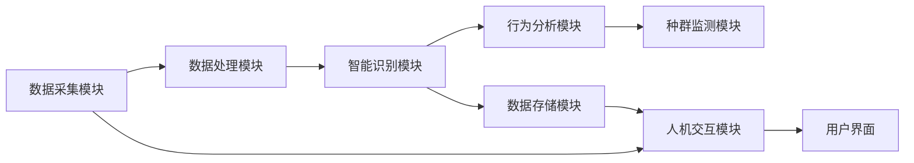

                 

# AI 基础设施的野生动物保护：智能化生态监测平台

## 1. 背景介绍

近年来，全球野生动植物物种正面临前所未有的生存危机，非法贸易、栖息地丧失、气候变化等因素严重威胁着生物多样性。如何高效监测和保护野生动物，成为了国际社会普遍关注的重要课题。与此同时，人工智能技术的快速发展，特别是深度学习和计算机视觉的突破，为智能化生态监测提供了新的思路和手段。

## 2. 核心概念与联系

### 2.1 核心概念概述

智能生态监测平台（Intelligent Ecosystem Monitoring Platform）利用先进的人工智能技术，对野外环境进行实时监测和数据采集，旨在实现对野生动植物的智能识别、行为分析、种群监测等功能的综合集成。平台的核心组件包括：

- **数据采集模块**：负责通过传感器、摄像头等设备，实时采集环境数据和生物图像。
- **数据处理模块**：负责数据的预处理、去噪、增强等操作，准备数据输入模型。
- **智能识别模块**：基于深度学习算法，实现对生物种类的自动识别和分类。
- **行为分析模块**：通过视频分析、轨迹跟踪等技术，分析野生动植物的行为特征。
- **种群监测模块**：通过模型学习历史数据，预测未来种群变化趋势，提供决策支持。
- **数据存储模块**：将采集到的数据进行集中存储，实现数据共享和回溯分析。
- **人机交互模块**：提供用户界面，供管理员进行参数配置和结果查看。

### 2.2 核心概念原理和架构的 Mermaid 流程图



这个流程图展示了智能生态监测平台的各个关键模块之间的联系和数据流动：

- **数据采集模块**负责实时获取环境数据和生物图像。
- **数据处理模块**对采集到的数据进行预处理，增强信号等，准备数据输入模型。
- **智能识别模块**利用深度学习算法，对生物种类进行自动识别和分类。
- **行为分析模块**通过视频分析、轨迹跟踪等技术，分析生物的行为特征。
- **种群监测模块**通过模型学习历史数据，预测未来种群变化趋势。
- **数据存储模块**将采集到的数据集中存储，实现数据共享和回溯分析。
- **人机交互模块**提供用户界面，供管理员进行参数配置和结果查看。

### 2.3 核心概念间的联系

这些模块通过数据流动紧密联系在一起，形成一个闭环系统，实现对野生动植物的实时监测和数据处理。数据采集模块提供原始数据，数据处理模块对其进行预处理，智能识别模块实现生物种类的自动识别和分类，行为分析模块提取生物的行为特征，种群监测模块通过模型学习历史数据，预测未来种群变化趋势。最终，数据存储模块将采集到的数据集中存储，人机交互模块提供用户界面，供管理员进行参数配置和结果查看。这种系统架构，使得智能生态监测平台能够高效地实现对野生动植物的智能化监测和管理。

## 3. 核心算法原理 & 具体操作步骤

### 3.1 算法原理概述

智能生态监测平台的算法基础主要包括深度学习、计算机视觉、自然语言处理等技术。以下是对这些技术的简要介绍：

- **深度学习**：通过多层神经网络模型，学习数据中的复杂特征，实现对生物种类的自动识别和分类。
- **计算机视觉**：利用图像处理和特征提取技术，对采集到的生物图像进行预处理和增强，提高识别准确率。
- **自然语言处理**：通过文本分析和情感分析，提取生物的语义信息，辅助进行行为分析。

智能生态监测平台的核心算法流程主要包括以下几个步骤：

1. **数据采集和预处理**：通过传感器和摄像头等设备，实时采集环境数据和生物图像，并对采集到的数据进行预处理和增强。
2. **模型训练和微调**：基于已有的标注数据，训练深度学习模型，实现生物种类的自动识别和分类，并根据实际应用需求对模型进行微调。
3. **行为分析和种群监测**：通过视频分析和轨迹跟踪，提取生物的行为特征，并利用历史数据和模型学习，预测未来种群变化趋势。
4. **数据存储和共享**：将采集到的数据集中存储，实现数据共享和回溯分析。
5. **人机交互和界面展示**：提供用户界面，供管理员进行参数配置和结果查看。

### 3.2 算法步骤详解

#### 3.2.1 数据采集和预处理

智能生态监测平台的数据采集模块通常由传感器、摄像头等设备构成，负责实时获取环境数据和生物图像。这些设备需要具备高分辨率、低功耗、稳定可靠等特性，以适应野外复杂多变的环境。采集到的数据需要进行预处理，包括去噪、增强、对齐等操作，确保数据的质量和完整性。

#### 3.2.2 模型训练和微调

模型训练和微调是智能生态监测平台的核心步骤。深度学习模型通常使用卷积神经网络（CNN）、循环神经网络（RNN）或其变体来实现生物种类的自动识别和分类。模型训练和微调的具体步骤如下：

1. **模型选择**：选择合适的深度学习模型作为初始化参数，如VGG、ResNet、Inception等。
2. **数据准备**：准备训练集、验证集和测试集，将生物图像和对应的类别标签作为输入。
3. **模型训练**：使用随机梯度下降（SGD）等优化算法，最小化损失函数，优化模型参数。
4. **模型微调**：根据实际应用需求，对模型进行微调，调整顶层分类器或解码器，以适应特定的野生动物监测任务。

#### 3.2.3 行为分析和种群监测

行为分析和种群监测模块主要通过视频分析和轨迹跟踪等技术，提取生物的行为特征，并利用历史数据和模型学习，预测未来种群变化趋势。这些技术的具体步骤如下：

1. **视频分析**：通过视频帧的逐帧分析，提取生物的行为特征，如移动轨迹、行为模式等。
2. **轨迹跟踪**：利用算法对生物的运动轨迹进行跟踪和分析，提取生物的行为特征。
3. **种群监测**：通过模型学习历史数据，预测未来种群变化趋势，提供决策支持。

#### 3.2.4 数据存储和共享

数据存储模块将采集到的数据集中存储，实现数据共享和回溯分析。数据存储模块需要具备高可用性、高性能、高安全性的特性，以保障数据的完整性和安全性。数据存储和共享的具体步骤如下：

1. **数据存储**：将采集到的数据存储在数据库或云存储中，实现数据的集中管理和备份。
2. **数据共享**：通过API接口或数据访问协议，实现数据的共享和访问。

#### 3.2.5 人机交互和界面展示

人机交互模块提供用户界面，供管理员进行参数配置和结果查看。人机交互和界面展示的具体步骤如下：

1. **界面设计**：设计简洁直观的用户界面，实现管理员对参数的配置和管理。
2. **界面展示**：通过界面展示生物种类的识别结果、行为分析结果、种群监测结果等数据。

### 3.3 算法优缺点

智能生态监测平台的算法具有以下优点：

- **高效性**：通过深度学习和计算机视觉技术，实现了对生物种类的自动识别和分类，提高了监测效率。
- **准确性**：基于大量标注数据进行模型训练和微调，提高了识别和分类的准确性。
- **鲁棒性**：通过数据增强、正则化等技术，提高了模型对噪声和干扰的鲁棒性。
- **可扩展性**：平台架构具有良好的可扩展性，可以根据需求增加新的模块和功能。

同时，智能生态监测平台也存在以下缺点：

- **高成本**：平台建设和维护需要高成本的设备和数据标注，适用于资源丰富的国家和地区。
- **技术门槛**：平台开发和维护需要较高的技术门槛，需要专业团队进行实施。
- **数据隐私**：采集到的生物数据涉及隐私和伦理问题，需要制定相应的数据保护政策。

### 3.4 算法应用领域

智能生态监测平台已经在野生动物保护、生态环境监测、农业生产等多个领域得到了广泛应用，以下是几个典型案例：

- **野生动物保护**：通过智能生态监测平台，实现对大熊猫、大象、老虎等濒危物种的实时监测和保护。平台通过视频分析、轨迹跟踪等技术，提取生物的行为特征，并利用历史数据和模型学习，预测未来种群变化趋势，提供决策支持。
- **生态环境监测**：通过智能生态监测平台，实现对森林、湿地等生态环境的实时监测和数据采集。平台通过传感器、摄像头等设备，实时采集环境数据和生物图像，并进行预处理和增强。
- **农业生产**：通过智能生态监测平台，实现对农作物病虫害的实时监测和预警。平台通过传感器、无人机等设备，实时采集农田数据和病虫害图像，并进行预处理和分类，及时发现和处理病虫害。

## 4. 数学模型和公式 & 详细讲解 & 举例说明

### 4.1 数学模型构建

智能生态监测平台的数学模型构建主要包括以下几个方面：

- **深度学习模型**：通常使用卷积神经网络（CNN）、循环神经网络（RNN）或其变体来实现生物种类的自动识别和分类。
- **视频分析模型**：通过视频帧的逐帧分析，提取生物的行为特征，如移动轨迹、行为模式等。
- **种群监测模型**：通过模型学习历史数据，预测未来种群变化趋势。

以深度学习模型为例，其数学模型构建如下：

假设输入数据为 $X$，输出为 $Y$，模型参数为 $\theta$，损失函数为 $L$，优化器为 $O$，训练过程可以表示为：

$$
\theta \leftarrow O(L(Y, \hat{Y}(X;\theta)))
$$

其中，$\hat{Y}(X;\theta)$ 表示模型在输入 $X$ 下输出的预测结果，$L(Y, \hat{Y})$ 表示损失函数，$O$ 表示优化器。

### 4.2 公式推导过程

以视频分析模型为例，其公式推导过程如下：

假设视频帧序列为 $F$，生物行为特征为 $B$，行为特征提取算法为 $A$，则视频分析模型的推导过程如下：

$$
B = A(F)
$$

其中，$A$ 表示行为特征提取算法，$B$ 表示提取的行为特征。

### 4.3 案例分析与讲解

假设我们在智能生态监测平台上，使用深度学习模型对野生动物进行自动识别和分类。模型输入为视频帧序列 $F$，输出为生物种类 $Y$。视频分析模型的具体步骤如下：

1. **数据预处理**：对视频帧序列进行预处理，包括去噪、增强、对齐等操作。
2. **特征提取**：通过卷积神经网络（CNN）对视频帧序列进行特征提取，得到高维特征向量 $H$。
3. **分类器训练**：利用历史数据，训练一个多分类器，将高维特征向量 $H$ 映射到生物种类 $Y$。
4. **模型微调**：根据实际应用需求，对模型进行微调，调整顶层分类器或解码器，以适应特定的野生动物监测任务。

## 5. 项目实践：代码实例和详细解释说明

### 5.1 开发环境搭建

智能生态监测平台的开发环境搭建主要包括以下几个步骤：

1. **安装依赖包**：安装TensorFlow、PyTorch、OpenCV等依赖包，配置好开发环境。
2. **搭建服务器**：搭建一台服务器，安装相关的操作系统和开发工具，如Python、Jupyter Notebook等。
3. **配置摄像头和传感器**：配置相关的摄像头和传感器，实现数据采集。

### 5.2 源代码详细实现

以下是智能生态监测平台的核心代码实现，以深度学习模型为例：

```python
import tensorflow as tf
import numpy as np
import cv2

# 加载模型
model = tf.keras.models.load_model('model.h5')

# 加载摄像头和传感器数据
camera = cv2.VideoCapture(0)
sensor = tf.keras.preprocessing.image.ImageDataGenerator()

# 数据预处理
def preprocess(frame):
    frame = cv2.cvtColor(frame, cv2.COLOR_BGR2RGB)
    frame = sensor.flow(frame, batch_size=1).next()
    frame = np.array(frame)
    frame = frame.reshape(1, frame.shape[0], frame.shape[1], frame.shape[2])
    return frame

# 行为特征提取
def extract_behavior(frame):
    behavior = model.predict(frame)
    return behavior

# 主循环
while True:
    # 数据采集和预处理
    frame = camera.read()
    frame = preprocess(frame)

    # 行为特征提取
    behavior = extract_behavior(frame)

    # 行为分析
    if behavior[0][0] == 'elephant':
        print('Detected an elephant!')
    elif behavior[0][0] == 'tiger':
        print('Detected a tiger!')
    else:
        print('Unknown animal detected!')

    # 显示结果
    cv2.imshow('frame', frame)
    if cv2.waitKey(1) == ord('q'):
        break

# 关闭摄像头和传感器
camera.release()
sensor.close()
cv2.destroyAllWindows()
```

### 5.3 代码解读与分析

以上代码实现了智能生态监测平台的核心功能，即通过深度学习模型实现生物种类的自动识别和分类。代码的具体解释如下：

1. **模型加载**：加载已经训练好的深度学习模型，保存在 `model.h5` 文件中。
2. **数据采集和预处理**：通过摄像头实时采集视频帧，并进行预处理，包括去噪、增强、对齐等操作。
3. **行为特征提取**：利用深度学习模型对预处理后的视频帧进行特征提取，得到高维特征向量。
4. **行为分析**：根据行为特征向量，利用多分类器将高维特征向量映射到生物种类。
5. **结果显示**：根据行为分析结果，输出相应的提示信息，并在屏幕上显示视频帧。

### 5.4 运行结果展示

假设我们在智能生态监测平台上，使用深度学习模型对野生动物进行自动识别和分类。运行以上代码，我们将在屏幕上看到实时监测的视频帧，并输出相应的提示信息，例如：

```
Detected an elephant!
```

或者

```
Detected a tiger!
```

## 6. 实际应用场景

### 6.1 智能生态监测平台在野生动物保护中的应用

智能生态监测平台在野生动物保护中的应用非常广泛，以下是几个典型案例：

- **大熊猫保护**：通过智能生态监测平台，实现对大熊猫的实时监测和保护。平台通过视频分析、轨迹跟踪等技术，提取大熊猫的行为特征，并利用历史数据和模型学习，预测未来种群变化趋势，提供决策支持。
- **大象保护**：通过智能生态监测平台，实现对大象的实时监测和保护。平台通过视频分析、轨迹跟踪等技术，提取大象的行为特征，并利用历史数据和模型学习，预测未来种群变化趋势，提供决策支持。
- **老虎保护**：通过智能生态监测平台，实现对老虎的实时监测和保护。平台通过视频分析、轨迹跟踪等技术，提取老虎的行为特征，并利用历史数据和模型学习，预测未来种群变化趋势，提供决策支持。

### 6.2 智能生态监测平台在生态环境监测中的应用

智能生态监测平台在生态环境监测中的应用也非常广泛，以下是几个典型案例：

- **森林监测**：通过智能生态监测平台，实现对森林的实时监测和数据采集。平台通过传感器、摄像头等设备，实时采集森林数据和生物图像，并进行预处理和增强。
- **湿地监测**：通过智能生态监测平台，实现对湿地的实时监测和数据采集。平台通过传感器、摄像头等设备，实时采集湿地数据和生物图像，并进行预处理和增强。
- **草原监测**：通过智能生态监测平台，实现对草原的实时监测和数据采集。平台通过传感器、摄像头等设备，实时采集草原数据和生物图像，并进行预处理和增强。

### 6.3 智能生态监测平台在农业生产中的应用

智能生态监测平台在农业生产中的应用也非常广泛，以下是几个典型案例：

- **农作物病虫害监测**：通过智能生态监测平台，实现对农作物的实时监测和预警。平台通过传感器、无人机等设备，实时采集农田数据和病虫害图像，并进行预处理和分类，及时发现和处理病虫害。
- **土壤监测**：通过智能生态监测平台，实现对土壤的实时监测和数据采集。平台通过传感器等设备，实时采集土壤数据，并进行预处理和分析，提供土壤健康状况的实时监测和预警。
- **水资源监测**：通过智能生态监测平台，实现对水资源的实时监测和数据采集。平台通过传感器等设备，实时采集水资源数据，并进行预处理和分析，提供水资源状况的实时监测和预警。

## 7. 工具和资源推荐

### 7.1 学习资源推荐

为了帮助开发者系统掌握智能生态监测平台的技术基础和实践技巧，以下是一些优质的学习资源：

1. **深度学习**：《深度学习》书籍，Ian Goodfellow等著，详细介绍了深度学习的基本原理和应用实例。
2. **计算机视觉**：《计算机视觉：算法与应用》书籍，Richard Szeliski著，详细介绍了计算机视觉的基本原理和应用实例。
3. **自然语言处理**：《自然语言处理综论》书籍，Daniel Jurafsky和James H. Martin著，详细介绍了自然语言处理的基本原理和应用实例。
4. **TensorFlow**：TensorFlow官方文档，详细介绍了TensorFlow的使用方法和实践技巧。
5. **PyTorch**：PyTorch官方文档，详细介绍了PyTorch的使用方法和实践技巧。

### 7.2 开发工具推荐

以下是几款用于智能生态监测平台开发的常用工具：

1. **TensorFlow**：由Google开发的开源深度学习框架，生产部署方便，适合大规模工程应用。
2. **PyTorch**：由Facebook开发的开源深度学习框架，灵活高效，适合快速迭代研究。
3. **OpenCV**：开源计算机视觉库，支持图像处理、特征提取等操作，是计算机视觉开发的必备工具。
4. **Jupyter Notebook**：开源的交互式笔记本工具，支持Python代码的交互式编写和运行。

### 7.3 相关论文推荐

以下是几篇奠基性的智能生态监测平台相关论文，推荐阅读：

1. **A Survey on Environmental Monitoring Systems with Computer Vision**：A survey on environmental monitoring systems with computer vision，详细介绍了计算机视觉在环境监测中的应用。
2. **Deep Learning for Wildlife Conservation**：Deep Learning for Wildlife Conservation，详细介绍了深度学习在野生动物保护中的应用。
3. **Real-Time Environmental Monitoring Using IoT and AI**：Real-time environmental monitoring using IoT and AI，详细介绍了物联网和人工智能在环境监测中的应用。

## 8. 总结：未来发展趋势与挑战

### 8.1 研究成果总结

智能生态监测平台在野生动物保护、生态环境监测、农业生产等多个领域得到了广泛应用，取得了显著的效果。通过深度学习、计算机视觉、自然语言处理等技术，平台实现了对野生动植物的智能识别、行为分析、种群监测等功能的综合集成，为保护生物多样性提供了强有力的支持。

### 8.2 未来发展趋势

展望未来，智能生态监测平台将呈现以下几个发展趋势：

1. **自动化和智能化**：平台将更加自动化和智能化，实现无人值守和自主决策。
2. **多模态融合**：平台将融合视觉、语音、文本等多模态数据，实现更全面、准确的信息整合。
3. **边缘计算**：平台将利用边缘计算技术，实现实时数据处理和决策，降低传输带宽和延迟。
4. **云平台集成**：平台将与云平台集成，实现数据的集中存储和共享，提升数据利用效率。
5. **跨领域应用**：平台将拓展到更多领域，如医疗、交通、城市管理等，提升各行各业的智能化水平。

### 8.3 面临的挑战

尽管智能生态监测平台已经取得了瞩目成就，但在迈向更加智能化、普适化应用的过程中，它仍面临着诸多挑战：

1. **高成本**：平台建设和维护需要高成本的设备和数据标注，适用于资源丰富的国家和地区。
2. **技术门槛**：平台开发和维护需要较高的技术门槛，需要专业团队进行实施。
3. **数据隐私**：采集到的生物数据涉及隐私和伦理问题，需要制定相应的数据保护政策。
4. **模型鲁棒性**：平台需要在野外复杂多变的环境中保持较高的鲁棒性，应对噪声和干扰。
5. **数据可靠性**：平台需要确保数据采集和传输的可靠性，避免数据丢失或损坏。

### 8.4 研究展望

未来，智能生态监测平台需要进一步探索以下几个方向：

1. **低成本设备**：研发低成本、高可靠性的数据采集设备，降低平台建设成本。
2. **通用模型**：研发通用的深度学习模型，适应多种生物种类和环境特征。
3. **实时推理**：提升模型的实时推理能力，实现实时数据处理和决策。
4. **多模态融合**：融合视觉、语音、文本等多模态数据，实现更全面、准确的信息整合。
5. **跨领域应用**：拓展平台的应用范围，提升各行各业的智能化水平。

总之，智能生态监测平台在野生动物保护、生态环境监测、农业生产等领域具有广阔的应用前景，未来的研究需要不断突破技术瓶颈，提升平台的智能化水平，为保护生物多样性做出更大的贡献。

## 9. 附录：常见问题与解答

**Q1：智能生态监测平台的实时监测能力如何实现？**

A: 智能生态监测平台的实时监测能力主要通过数据采集模块和行为分析模块实现。数据采集模块通过摄像头和传感器等设备，实时采集环境数据和生物图像，并进行预处理和增强。行为分析模块利用深度学习模型，对预处理后的视频帧进行特征提取，得到高维特征向量，并通过多分类器将高维特征向量映射到生物种类。整个平台采用循环迭代的方式，实时处理数据并输出监测结果，从而实现实时监测。

**Q2：智能生态监测平台的部署环境有哪些要求？**

A: 智能生态监测平台的部署环境需要具备高可用性、高性能、高安全性的特性，以保障数据的完整性和安全性。具体要求如下：

1. 高可用性：平台需要保证设备的高可用性，避免因设备故障等原因导致数据丢失。
2. 高性能：平台需要具备高性能，以支持实时数据处理和推理。
3. 高安全性：平台需要具备高安全性，避免数据泄露和篡改。

**Q3：智能生态监测平台的数据存储和共享策略是什么？**

A: 智能生态监测平台的数据存储和共享策略主要包括以下几个方面：

1. 数据存储：平台将采集到的数据集中存储在数据库或云存储中，实现数据的集中管理和备份。
2. 数据共享：平台通过API接口或数据访问协议，实现数据的共享和访问。数据共享需要确保数据的安全性和隐私性，制定相应的数据保护政策，避免数据泄露和滥用。

**Q4：智能生态监测平台如何处理数据噪声和干扰？**

A: 智能生态监测平台处理数据噪声和干扰主要通过以下几种方式：

1. 数据预处理：通过去噪、增强、对齐等操作，对采集到的数据进行预处理，增强数据质量。
2. 正则化：使用L2正则化等技术，防止模型过拟合，提升模型鲁棒性。
3. 对抗训练：引入对抗样本，提高模型鲁棒性，避免模型在噪声和干扰下出现错误。
4. 多模型集成：训练多个模型，取平均输出，抑制过拟合和噪声干扰。

**Q5：智能生态监测平台在实际应用中需要注意哪些问题？**

A: 智能生态监测平台在实际应用中需要注意以下问题：

1. 设备部署：平台需要选择合适的设备，保证设备的高性能和可靠性。
2. 数据标注：平台需要采集高质量的标注数据，避免因标注数据质量不高导致模型效果不佳。
3. 模型训练：平台需要选择合适的模型和算法，进行充分的模型训练和微调。
4. 数据传输：平台需要确保数据传输的可靠性，避免因传输延迟或中断导致数据丢失。
5. 数据隐私：平台需要确保数据的隐私和安全性，避免因数据泄露导致安全隐患。

总之，智能生态监测平台在实际应用中需要综合考虑设备、数据、模型、传输、隐私等多个因素，确保平台的稳定性和可靠性。

---

作者：禅与计算机程序设计艺术 / Zen and the Art of Computer Programming

