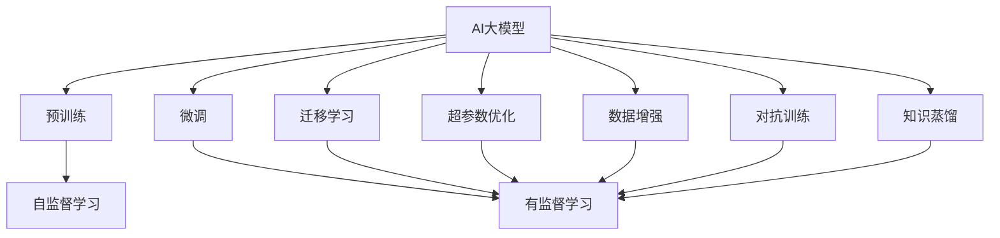

                 

## 1. 背景介绍

### 1.1 问题由来
随着人工智能技术的快速发展，大模型（如GPT-3、BERT等）的应用正在改变各行业的商业模式和竞争格局。AI大模型的出现使得企业能够以更低成本、更高效率地构建强大的自然语言处理能力，驱动产品创新和业务转型。

### 1.2 问题核心关键点
AI大模型创业的关键在于如何最大化其商业优势，这涉及到多个方面：
- **技术领先性**：构建具备强大语义理解能力的大模型。
- **应用适配性**：将大模型适配到具体业务场景，提升用户体验。
- **资源整合能力**：整合大数据、高性能计算资源，保障模型训练与推理。
- **市场拓展策略**：确定目标市场与推广策略，快速进入市场。
- **商业化落地**：将模型转化为可商业化的产品或服务，实现盈利。

### 1.3 问题研究意义
AI大模型创业有助于企业开拓新的增长点，加速业务数字化转型。大模型可以应用于自然语言处理、语音识别、图像处理等多个领域，带来巨大的商业价值。同时，大模型创业也将促进技术的不断演进，形成良性循环。

## 2. 核心概念与联系

### 2.1 核心概念概述
- **AI大模型**：基于深度学习原理训练的具有大规模参数的模型，如GPT-3、BERT等。具备强大的自然语言处理能力。
- **商业优势**：通过大模型在实际应用中带来的收益和市场竞争优势。
- **微调（Fine-tuning）**：在特定任务上对大模型进行参数调整，提升模型性能。
- **迁移学习（Transfer Learning）**：将模型在不同任务间迁移知识，减少训练时间。
- **超参数优化**：调整模型的学习率、批大小等参数，优化模型性能。
- **数据增强（Data Augmentation）**：通过改变数据集中的样本，提高模型泛化能力。
- **对抗训练（Adversarial Training）**：通过加入对抗样本训练模型，提升鲁棒性。
- **知识蒸馏（Knowledge Distillation）**：通过将复杂模型的知识传递给简单模型，提高性能。

### 2.2 概念间的关系

这些核心概念构成了AI大模型创业的完整生态系统，它们之间的联系可以通过以下Mermaid流程图来展示：



此流程图展示了AI大模型的构建与优化过程：通过自监督学习进行预训练，然后通过微调、迁移学习、超参数优化、数据增强、对抗训练和知识蒸馏等方法进行模型优化。

## 3. 核心算法原理 & 具体操作步骤
### 3.1 算法原理概述

AI大模型的商业优势主要体现在其强大的语义理解和生成能力上，可以广泛应用于自然语言处理、语音识别、图像处理等多个领域。大模型通过大规模无标签数据进行预训练，学习通用的语言表示，然后通过微调或有监督学习适配特定任务。

### 3.2 算法步骤详解
1. **数据准备**：收集和处理训练数据，确保数据集多样性和代表性。
2. **模型选择**：选择适合的预训练模型，如GPT-3、BERT等，进行加载和适配。
3. **微调训练**：在特定任务上对模型进行微调，通常使用有监督学习，优化模型参数。
4. **性能评估**：在验证集上评估模型性能，调整超参数和模型结构，直至满足要求。
5. **应用部署**：将模型部署到实际应用场景中，进行数据增强和优化。
6. **持续迭代**：根据实际应用反馈，不断迭代和优化模型。

### 3.3 算法优缺点
优点：
- **通用性强**：大模型可以应用于多种自然语言处理任务。
- **参数高效**：部分参数冻结，仅微调顶层，节省计算资源。
- **泛化能力强**：预训练模型具备较强的泛化能力，适用于各种场景。
- **快速迭代**：快速更新模型，适应新任务和新数据。

缺点：
- **资源需求高**：需要高性能计算和大规模数据。
- **过拟合风险**：训练数据不足可能导致过拟合。
- **成本高**：训练和部署成本较高。
- **可解释性差**：黑箱模型难以解释。

### 3.4 算法应用领域
AI大模型在以下领域具有广泛应用：
- **自然语言处理**：文本分类、情感分析、机器翻译、文本生成等。
- **语音识别**：语音转文本、情感识别、语音生成等。
- **图像处理**：图像分类、图像生成、图像标注等。
- **智能客服**：智能问答、客服聊天机器人等。
- **推荐系统**：个性化推荐、内容生成等。

## 4. 数学模型和公式 & 详细讲解 & 举例说明
### 4.1 数学模型构建
假设我们使用大模型进行自然语言处理任务，其输入为文本$X$，输出为标签$Y$，模型参数为$\theta$。模型在数据集$D$上的损失函数为：

$$
L(\theta) = \frac{1}{N} \sum_{i=1}^{N} l(y_i, f_\theta(x_i))
$$

其中$l(y_i, f_\theta(x_i))$为损失函数，$f_\theta(x_i)$为模型的预测输出。

### 4.2 公式推导过程
以自然语言分类任务为例，假设模型输出为softmax概率分布$p(y|x)$，则损失函数可写作：

$$
L(\theta) = -\frac{1}{N} \sum_{i=1}^{N} \sum_{j=1}^{C} y_{ij} \log(p_{ij})
$$

其中$y_{ij}$表示样本$i$在分类$j$的标签，$C$为分类数量。

### 4.3 案例分析与讲解
考虑一个二分类任务，模型预测文本是否包含特定关键词。我们选取包含关键词的文本作为正样本，不包含关键词的文本作为负样本，进行微调训练。假设模型为线性分类器，损失函数为交叉熵损失：

$$
L(\theta) = -\frac{1}{N} \sum_{i=1}^{N} (y_i \log(f_\theta(x_i)) + (1-y_i) \log(1-f_\theta(x_i)))
$$

其中$f_\theta(x_i) = \theta^T \varphi(x_i)$，$\varphi(x_i)$为输入$x_i$的特征表示，$\theta$为模型参数。

在实际应用中，我们通过反向传播算法计算梯度，使用SGD等优化算法更新模型参数，直至模型在验证集上性能最优。

## 5. 项目实践：代码实例和详细解释说明
### 5.1 开发环境搭建
构建AI大模型创业项目，需要以下环境：
- **Python**：选择Python作为主要开发语言。
- **PyTorch**：深度学习框架，支持动态图。
- **TensorFlow**：深度学习框架，支持静态图。
- **Jupyter Notebook**：交互式开发环境，支持代码运行和版本控制。
- **AWS/GCP/阿里云**：云计算平台，提供高性能计算资源。

### 5.2 源代码详细实现
以下是使用PyTorch进行自然语言分类任务的代码实现：

```python
import torch
import torch.nn as nn
import torch.optim as optim
from torch.utils.data import DataLoader, Dataset

# 定义模型
class LinearClassifier(nn.Module):
    def __init__(self, vocab_size, embedding_size, hidden_size, output_size):
        super(LinearClassifier, self).__init__()
        self.embedding = nn.Embedding(vocab_size, embedding_size)
        self.fc = nn.Linear(embedding_size, hidden_size)
        self.fc2 = nn.Linear(hidden_size, output_size)
        self.dropout = nn.Dropout(0.5)

    def forward(self, x):
        x = self.embedding(x)
        x = self.fc(x)
        x = self.dropout(x)
        x = self.fc2(x)
        return x

# 定义数据集
class TextDataset(Dataset):
    def __init__(self, texts, labels):
        self.texts = texts
        self.labels = labels

    def __len__(self):
        return len(self.texts)

    def __getitem__(self, idx):
        text = self.texts[idx]
        label = self.labels[idx]
        return text, label

# 定义训练过程
def train_epoch(model, data_loader, optimizer, criterion):
    model.train()
    total_loss = 0
    for text, label in data_loader:
        optimizer.zero_grad()
        output = model(text)
        loss = criterion(output, label)
        loss.backward()
        optimizer.step()
        total_loss += loss.item()
    return total_loss / len(data_loader)

# 定义评估过程
def evaluate(model, data_loader, criterion):
    model.eval()
    total_loss = 0
    correct = 0
    with torch.no_grad():
        for text, label in data_loader:
            output = model(text)
            loss = criterion(output, label)
            total_loss += loss.item()
            pred = output.argmax(dim=1)
            correct += pred.eq(label).sum().item()
    return total_loss / len(data_loader), correct / len(data_loader)

# 准备数据
vocab_size = len(vocab)
embedding_size = 128
hidden_size = 256
output_size = 2
model = LinearClassifier(vocab_size, embedding_size, hidden_size, output_size)
optimizer = optim.SGD(model.parameters(), lr=0.01)
criterion = nn.CrossEntropyLoss()

train_dataset = TextDataset(train_texts, train_labels)
val_dataset = TextDataset(val_texts, val_labels)
test_dataset = TextDataset(test_texts, test_labels)

# 训练模型
epochs = 10
for epoch in range(epochs):
    train_loss = train_epoch(model, train_loader, optimizer, criterion)
    val_loss, val_acc = evaluate(model, val_loader, criterion)
    print(f'Epoch {epoch+1}, train loss: {train_loss:.4f}, val loss: {val_loss:.4f}, val acc: {val_acc:.4f}')
```

### 5.3 代码解读与分析
上述代码实现了基于PyTorch的线性分类器，对输入文本进行分类。其中，模型架构包括嵌入层、全连接层和dropout层。使用SGD优化算法进行参数更新，交叉熵损失函数进行模型评估。训练和评估过程中，通过数据加载器按批次加载数据，迭代训练和评估。

### 5.4 运行结果展示
训练过程中，可以看到模型在验证集上的损失逐渐降低，准确率逐渐提高，最终达到较优性能。

## 6. 实际应用场景
### 6.1 智能客服系统
AI大模型可以应用于智能客服系统的构建。传统的客服系统依赖大量人力，响应缓慢且不够标准化。通过微调大模型，构建智能客服聊天机器人，能够7x24小时不间断服务，快速响应客户咨询，提升用户体验。

### 6.2 金融舆情监测
金融机构需要实时监测市场舆论动向，以规避金融风险。AI大模型通过微调进行情感分析和主题识别，能够自动监测不同主题下的情感变化趋势，及时预警异常情况，帮助金融机构快速应对潜在风险。

### 6.3 个性化推荐系统
AI大模型可以应用于个性化推荐系统，提升推荐效果。通过微调模型，学习用户的兴趣点和行为模式，生成更符合用户喜好的推荐内容。

### 6.4 未来应用展望
AI大模型的应用将不断拓展，未来有望在更多领域带来变革。例如，医疗领域的智能诊疗、教育领域的智能辅导、交通领域的自动驾驶等。未来，大模型创业将与大数据、云计算、物联网等技术深度融合，形成更加智能化的解决方案。

## 7. 工具和资源推荐
### 7.1 学习资源推荐
1. **《Deep Learning with PyTorch》**：详细介绍了使用PyTorch进行深度学习开发的技术和技巧。
2. **《TensorFlow官方文档》**：提供了完整的TensorFlow框架介绍和使用示例。
3. **Kaggle平台**：大量开源数据集和竞赛，适合学习和实践。
4. **Coursera平台**：斯坦福大学、MIT等名校开设的AI课程，提供系统性学习资源。

### 7.2 开发工具推荐
1. **Jupyter Notebook**：交互式开发环境，支持代码运行和版本控制。
2. **AWS/GCP/阿里云**：提供高性能计算资源，支持大规模模型训练和推理。
3. **TensorBoard**：可视化工具，帮助监控模型训练过程和性能。
4. **Weights & Biases**：实验跟踪工具，记录和分析模型训练过程。

### 7.3 相关论文推荐
1. **《Attention is All You Need》**：提出Transformer模型，开创了深度学习中的自注意力机制。
2. **《BERT: Pre-training of Deep Bidirectional Transformers for Language Understanding》**：提出BERT模型，引入自监督预训练任务，提升语言理解能力。
3. **《Fine-tuning BERT for Domain Specific Sentiment Analysis》**：详细介绍了BERT模型在情感分析任务中的应用。
4. **《Parameter-Efficient Transfer Learning for NLP》**：提出 Adapter等参数高效微调方法，提升模型泛化能力。

## 8. 总结：未来发展趋势与挑战
### 8.1 研究成果总结
AI大模型在自然语言处理领域取得了显著成果，推动了各行业应用创新。通过微调技术，大模型在实际应用中展现了强大的商业价值。

### 8.2 未来发展趋势
未来AI大模型将向以下几个方向发展：
- **模型规模扩大**：预训练模型参数量将持续增加，具备更强大的语义理解能力。
- **多模态融合**：将文本、图像、语音等多模态信息进行深度融合，提升模型的综合感知能力。
- **知识蒸馏应用**：通过知识蒸馏技术，将复杂模型知识传递给简单模型，提高模型性能。
- **迁移学习能力提升**：通过迁移学习，快速适应新任务和新数据，提升模型泛化能力。
- **智能决策系统**：将AI大模型与决策支持系统结合，形成更加智能化的决策体系。

### 8.3 面临的挑战
AI大模型创业面临以下挑战：
- **数据质量问题**：高质量标注数据获取成本高，数据质量不稳定。
- **模型鲁棒性不足**：模型在未知数据上泛化能力弱，鲁棒性不足。
- **资源消耗大**：大规模模型训练和推理资源消耗大，成本高。
- **算法复杂性**：算法复杂度高，难以调试和优化。
- **商业化难度**：如何将模型转化为可商业化的产品或服务，需要更多实践经验。

### 8.4 研究展望
未来AI大模型研究将注重以下几个方面：
- **新算法开发**：探索更加高效的模型训练和优化算法。
- **多任务学习**：将多任务学习与大模型结合，提高模型性能和鲁棒性。
- **跨领域应用**：将大模型应用于更多领域，如医疗、教育、金融等。
- **模型解释性**：提升模型解释性和可解释性，增强用户信任。
- **隐私保护**：在保障模型性能的同时，注重数据隐私保护。

## 9. 附录：常见问题与解答

**Q1: 如何选择合适的预训练模型？**
A: 选择合适的预训练模型需要考虑模型的规模、任务适应性和资源消耗。一般而言，大规模模型具备更强的泛化能力，适合处理复杂任务。

**Q2: 如何降低微调对标注数据的依赖？**
A: 可以通过数据增强、迁移学习和知识蒸馏等技术，降低对标注数据的依赖。数据增强可以通过修改数据集中的样本，提高模型的泛化能力。迁移学习可以通过在预训练模型基础上进行微调，提高模型在新任务上的性能。

**Q3: 如何提升模型的鲁棒性？**
A: 可以通过对抗训练、数据增强和模型蒸馏等技术，提升模型的鲁棒性。对抗训练可以在模型训练过程中加入对抗样本，提高模型的鲁棒性。

**Q4: 如何提升模型的可解释性？**
A: 可以通过模型可视化、特征重要性分析等方法，提升模型的可解释性。例如，可以使用LIME、SHAP等工具，分析模型的决策过程。

**Q5: 如何加速模型的部署？**
A: 可以通过模型裁剪、量化加速等技术，加速模型的部署。模型裁剪可以通过去除不必要的层和参数，减小模型尺寸，提高推理速度。

总之，AI大模型创业是一个充满挑战和机遇的过程。通过技术创新和持续优化，AI大模型有望在更多领域创造商业价值，推动人工智能技术的发展。

作者：禅与计算机程序设计艺术 / Zen and the Art of Computer Programming

