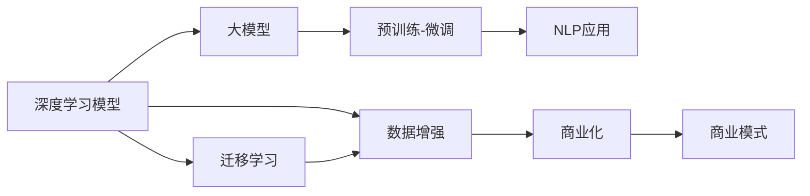
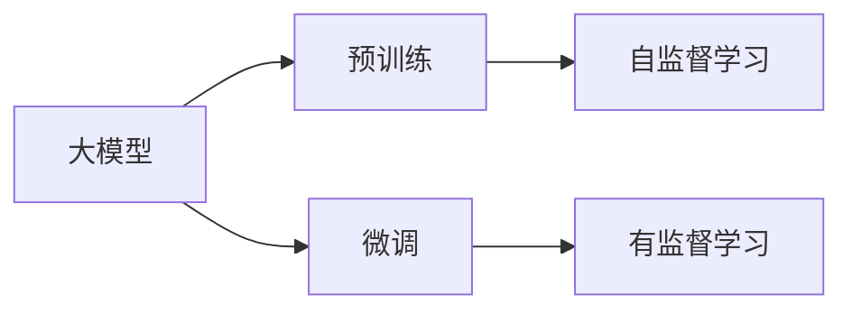
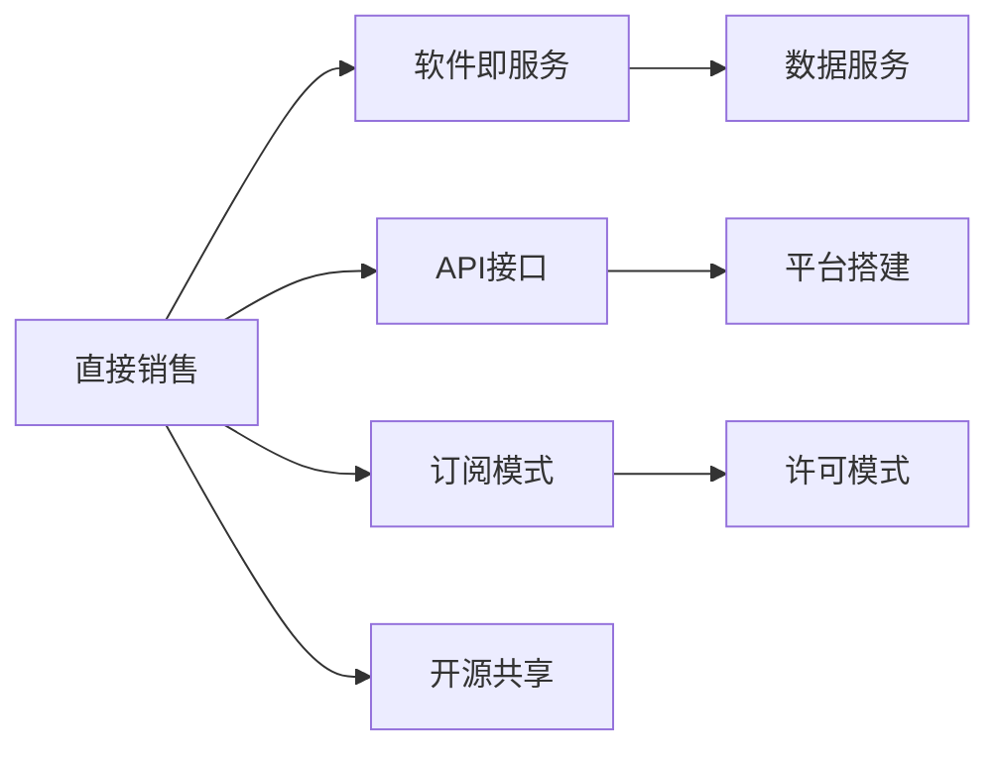
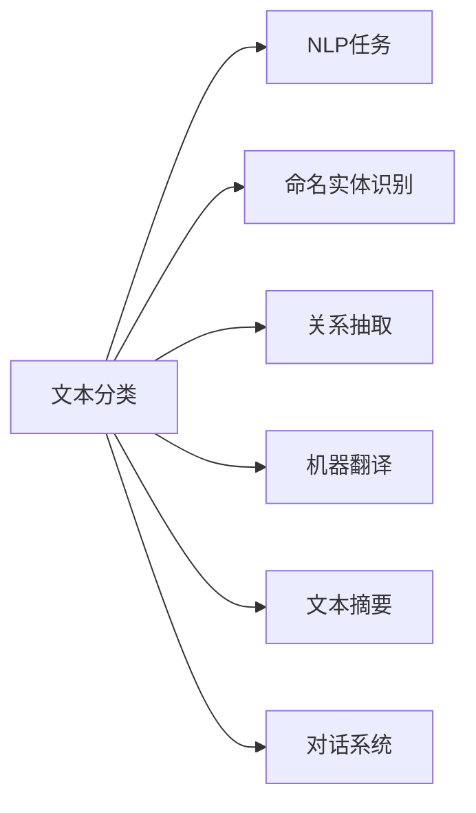
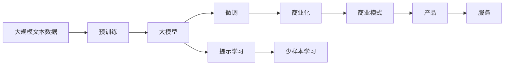

                 

# AI 大模型原理与应用：大模型是一个好的商业模式吗

> 关键词：AI大模型,大模型商业模式,深度学习,自然语言处理,NLP,机器学习

## 1. 背景介绍

### 1.1 问题由来
近年来，人工智能（AI）技术的迅猛发展使得深度学习在各个领域取得了突破性进展。特别地，大模型（如BERT, GPT等）由于其强大的语言理解和生成能力，在自然语言处理（NLP）领域表现优异，其应用也从学术研究走向工业实际，逐渐成为商业变现的重要工具。然而，大模型的商业化应用并非一帆风顺，其在商业模式上的可操作性、市场接受度、长期可持续性等问题逐渐浮现。本文将深入探讨大模型的原理、实际应用，并从商业化视角出发，讨论大模型是否适合作为商业模式。

### 1.2 问题核心关键点
为了更好地回答上述问题，本文将从以下几个核心关键点展开讨论：

1. **大模型的原理和架构**：深度学习模型的大致工作原理，尤其是大模型的架构和特点。
2. **商业化的可行性**：大模型在商业变现中的优势与局限，包括不同商业模式的适用性。
3. **应用场景分析**：大模型在各种实际应用中的表现，以及其对行业的影响。
4. **未来发展与挑战**：大模型在未来的技术发展方向和潜在的挑战。
5. **商业模式的构建与优化**：基于技术特点，设计可行的商业模式，并探讨其优化方向。

### 1.3 问题研究意义
探讨大模型的商业模式，对于理解AI技术的商业化路径，推动大模型的应用落地，具有重要意义：

1. **加速技术应用**：商业模式的选择将影响大模型在行业内的推广速度。
2. **提升市场接受度**：商业模式设计需考虑市场特性，以提升用户和企业的接受度。
3. **提高经济效益**：有效的商业模式有助于提升大模型的商业价值。
4. **应对未来挑战**：商业模式设计需考虑技术发展方向和潜在挑战，确保可持续性。
5. **创新企业竞争力**：商业模式是企业竞争力的重要组成部分，其设计直接影响企业的市场竞争地位。

## 2. 核心概念与联系

### 2.1 核心概念概述

为更清晰地理解大模型的商业模式，本节介绍几个关键概念及其联系：

- **深度学习模型**：基于神经网络的机器学习模型，广泛应用于图像、语言、声音等领域的任务处理。
- **大模型**：指参数量巨大的深度学习模型，如BERT, GPT等，通常包含数十亿个参数。
- **自然语言处理（NLP）**：人工智能在文本、语言上的处理和应用。
- **商业模式**：企业的盈利方式，包括产品销售、订阅服务、平台搭建等多种形式。
- **预训练-微调（Fine-tuning）**：在无标签数据上进行预训练，在有标签数据上进行微调，以适应特定任务。
- **迁移学习**：通过已学习到知识的知识迁移，使模型在新任务上取得良好效果。

这些概念之间的联系，可通过以下Mermaid流程图展示：



这个流程图展示了深度学习模型通过预训练和微调，应用于NLP任务，并通过迁移学习进行知识迁移，最后通过商业模式进行商业化。

### 2.2 概念间的关系

这些核心概念之间存在着紧密的联系，形成了大模型商业化应用的完整生态系统。下面我们通过几个Mermaid流程图来展示这些概念之间的关系。

#### 2.2.1 大模型的学习范式



这个流程图展示了大模型的预训练和微调过程。

#### 2.2.2 商业模式的类型



这个流程图展示了不同商业模式的种类。

#### 2.2.3 大模型在NLP中的应用



这个流程图展示了大模型在NLP中的应用场景。

### 2.3 核心概念的整体架构

最后，我们用一个综合的流程图来展示这些核心概念在大模型商业化过程中的整体架构：



这个综合流程图展示了从预训练到大模型微调，再到商业化的完整过程。

## 3. 核心算法原理 & 具体操作步骤
### 3.1 算法原理概述

大模型的预训练-微调过程主要基于监督学习。具体步骤如下：

1. **数据预处理**：收集和标注数据，将其划分为训练集、验证集和测试集。
2. **模型初始化**：选择合适的预训练模型（如BERT, GPT等）作为初始模型。
3. **模型微调**：在标注数据集上进行微调，更新模型参数以适应特定任务。
4. **效果评估**：在测试集上评估微调后的模型效果。

大模型的核心算法原理可以总结如下：

- **Transformer结构**：Transformer是目前最先进的深度学习模型，具有并行计算、高效的自注意力机制等特点。
- **自监督学习**：在大规模无标签数据上进行预训练，学习通用的语言表示。
- **有监督微调**：在特定任务的有标签数据集上进行微调，优化模型输出以适应任务要求。
- **迁移学习**：利用预训练模型在新任务上迁移已学习到的知识，以提升模型效果。

### 3.2 算法步骤详解

下面详细介绍大模型的微调操作步骤。

**步骤1: 数据准备**
- **数据收集**：收集与任务相关的标注数据，如新闻文本、对话记录等。
- **数据标注**：人工或自动标注数据，生成标注集。
- **数据划分**：将标注数据划分为训练集、验证集和测试集。

**步骤2: 模型选择**
- **选择模型**：选择适合任务的预训练模型，如BERT, GPT等。
- **模型配置**：根据需要，配置模型的架构和参数。

**步骤3: 模型微调**
- **损失函数**：根据任务类型，选择合适的损失函数，如交叉熵损失、均方误差损失等。
- **优化器**：选择合适的优化器，如Adam、SGD等，设置学习率等参数。
- **微调训练**：在训练集上训练模型，调整参数以最小化损失函数。
- **验证集评估**：在验证集上评估模型效果，防止过拟合。
- **模型保存**：保存微调后的模型，供后续使用。

**步骤4: 效果评估**
- **测试集测试**：在测试集上测试微调后的模型，评估效果。
- **性能指标**：计算模型的精度、召回率、F1分数等性能指标。
- **结果分析**：分析模型在不同数据集上的表现，调整参数和训练策略。

### 3.3 算法优缺点

大模型的预训练-微调方法具有以下优点：

1. **泛化能力**：大模型在大规模数据上进行预训练，具有较强的泛化能力。
2. **可迁移性**：通过迁移学习，可在新任务上快速获取好的性能。
3. **高效微调**：参数量巨大，微调时只需要调整模型的一部分参数。
4. **适用广泛**：适用于各种NLP任务，如文本分类、命名实体识别、关系抽取等。

然而，该方法也存在以下缺点：

1. **数据依赖**：微调需要大量标注数据，标注成本较高。
2. **过拟合风险**：模型参数量巨大，容易发生过拟合。
3. **复杂度**：模型训练和微调过程复杂，需要专业知识。
4. **隐私风险**：大模型训练需要大量数据，可能涉及隐私问题。

### 3.4 算法应用领域

大模型的预训练-微调方法已经广泛应用于多个NLP任务，具体如下：

- **文本分类**：如情感分析、新闻分类、话题分类等。
- **命名实体识别**：识别文本中的人名、地名、组织名等实体。
- **关系抽取**：从文本中抽取实体之间的语义关系。
- **机器翻译**：将一种语言翻译成另一种语言。
- **文本摘要**：将长文本压缩成简短摘要。
- **对话系统**：自动生成对话，构建智能客服系统。

## 4. 数学模型和公式 & 详细讲解 & 举例说明
### 4.1 数学模型构建

我们以二分类任务为例，构建大模型的数学模型。

- **输入**：文本 $x$，模型参数 $\theta$。
- **输出**：模型预测结果 $\hat{y}$。
- **损失函数**：交叉熵损失函数 $\ell(\hat{y}, y)$。
- **优化目标**：最小化损失函数，即 $\min_\theta \mathcal{L}(x, y; \theta)$。

形式化地，假设训练集为 $D=\{(x_i, y_i)\}_{i=1}^N$，则损失函数为：

$$
\mathcal{L}(\theta) = -\frac{1}{N}\sum_{i=1}^N [y_i\log \hat{y}_i + (1-y_i)\log (1-\hat{y}_i)]
$$

其中 $\hat{y}_i$ 为模型在输入 $x_i$ 上的预测结果，$y_i \in \{0, 1\}$ 为真实标签。

### 4.2 公式推导过程

下面推导二分类任务下的交叉熵损失函数及其梯度。

- **交叉熵损失函数**：
  $$
  \ell(\hat{y}, y) = -[y\log \hat{y} + (1-y)\log (1-\hat{y})]
  $$
  
  将 $\hat{y}$ 和 $y$ 代入上述公式，并取期望得到损失函数：
  $$
  \mathcal{L}(\theta) = -\frac{1}{N}\sum_{i=1}^N [y_i\log M_{\theta}(x_i) + (1-y_i)\log (1-M_{\theta}(x_i))]
  $$
  
  其中 $M_{\theta}$ 表示模型在输入 $x_i$ 上的预测结果。

- **梯度计算**：
  $$
  \frac{\partial \mathcal{L}(\theta)}{\partial \theta} = -\frac{1}{N}\sum_{i=1}^N \left(\frac{y_i}{M_{\theta}(x_i)} - \frac{1-y_i}{1-M_{\theta}(x_i)}\right) \frac{\partial M_{\theta}(x_i)}{\partial \theta}
  $$

  其中 $\frac{\partial M_{\theta}(x_i)}{\partial \theta}$ 表示模型对输入 $x_i$ 的梯度。

### 4.3 案例分析与讲解

以BERT为例，进行详细讲解：

**模型结构**：BERT采用Transformer结构，包括Encoder-Decoder框架，Encoder由多个Self-Attention层组成。

**训练过程**：BERT通过在大规模无标签数据上进行预训练，学习到通用的语言表示。然后，在特定任务上有标签数据集上进行微调，优化模型输出以适应任务要求。

**应用示例**：将BERT应用于情感分析任务。首先，对大量文本进行预训练，学习语言表示。然后，在情感分析数据集上进行微调，优化输出结果以匹配情感标签。最后，在测试集上评估微调后的模型效果，使用交叉熵损失函数进行优化。

## 5. 项目实践：代码实例和详细解释说明
### 5.1 开发环境搭建

在进行大模型微调实践前，我们需要准备好开发环境。以下是使用Python进行PyTorch开发的环境配置流程：

1. 安装Anaconda：从官网下载并安装Anaconda，用于创建独立的Python环境。

2. 创建并激活虚拟环境：
```bash
conda create -n pytorch-env python=3.8 
conda activate pytorch-env
```

3. 安装PyTorch：根据CUDA版本，从官网获取对应的安装命令。例如：
```bash
conda install pytorch torchvision torchaudio cudatoolkit=11.1 -c pytorch -c conda-forge
```

4. 安装Transformers库：
```bash
pip install transformers
```

5. 安装各类工具包：
```bash
pip install numpy pandas scikit-learn matplotlib tqdm jupyter notebook ipython
```

完成上述步骤后，即可在`pytorch-env`环境中开始微调实践。

### 5.2 源代码详细实现

下面我们以情感分析任务为例，给出使用Transformers库对BERT模型进行微调的PyTorch代码实现。

首先，定义情感分析任务的数据处理函数：

```python
from transformers import BertTokenizer
from torch.utils.data import Dataset
import torch

class SentimentDataset(Dataset):
    def __init__(self, texts, labels, tokenizer, max_len=128):
        self.texts = texts
        self.labels = labels
        self.tokenizer = tokenizer
        self.max_len = max_len
        
    def __len__(self):
        return len(self.texts)
    
    def __getitem__(self, item):
        text = self.texts[item]
        label = self.labels[item]
        
        encoding = self.tokenizer(text, return_tensors='pt', max_length=self.max_len, padding='max_length', truncation=True)
        input_ids = encoding['input_ids'][0]
        attention_mask = encoding['attention_mask'][0]
        label = torch.tensor(label, dtype=torch.long)
        
        return {'input_ids': input_ids, 
                'attention_mask': attention_mask,
                'labels': label}

# 创建数据集
tokenizer = BertTokenizer.from_pretrained('bert-base-cased')

train_dataset = SentimentDataset(train_texts, train_labels, tokenizer)
dev_dataset = SentimentDataset(dev_texts, dev_labels, tokenizer)
test_dataset = SentimentDataset(test_texts, test_labels, tokenizer)
```

然后，定义模型和优化器：

```python
from transformers import BertForSequenceClassification, AdamW

model = BertForSequenceClassification.from_pretrained('bert-base-cased', num_labels=2)

optimizer = AdamW(model.parameters(), lr=2e-5)
```

接着，定义训练和评估函数：

```python
from torch.utils.data import DataLoader
from tqdm import tqdm
from sklearn.metrics import classification_report

device = torch.device('cuda') if torch.cuda.is_available() else torch.device('cpu')
model.to(device)

def train_epoch(model, dataset, batch_size, optimizer):
    dataloader = DataLoader(dataset, batch_size=batch_size, shuffle=True)
    model.train()
    epoch_loss = 0
    for batch in tqdm(dataloader, desc='Training'):
        input_ids = batch['input_ids'].to(device)
        attention_mask = batch['attention_mask'].to(device)
        labels = batch['labels'].to(device)
        model.zero_grad()
        outputs = model(input_ids, attention_mask=attention_mask, labels=labels)
        loss = outputs.loss
        epoch_loss += loss.item()
        loss.backward()
        optimizer.step()
    return epoch_loss / len(dataloader)

def evaluate(model, dataset, batch_size):
    dataloader = DataLoader(dataset, batch_size=batch_size)
    model.eval()
    preds, labels = [], []
    with torch.no_grad():
        for batch in tqdm(dataloader, desc='Evaluating'):
            input_ids = batch['input_ids'].to(device)
            attention_mask = batch['attention_mask'].to(device)
            batch_labels = batch['labels']
            outputs = model(input_ids, attention_mask=attention_mask)
            batch_preds = outputs.logits.argmax(dim=1).to('cpu').tolist()
            batch_labels = batch_labels.to('cpu').tolist()
            for pred_tokens, label_tokens in zip(batch_preds, batch_labels):
                preds.append(pred_tokens)
                labels.append(label_tokens)
                
    print(classification_report(labels, preds))
```

最后，启动训练流程并在测试集上评估：

```python
epochs = 5
batch_size = 16

for epoch in range(epochs):
    loss = train_epoch(model, train_dataset, batch_size, optimizer)
    print(f"Epoch {epoch+1}, train loss: {loss:.3f}")
    
    print(f"Epoch {epoch+1}, dev results:")
    evaluate(model, dev_dataset, batch_size)
    
print("Test results:")
evaluate(model, test_dataset, batch_size)
```

以上就是使用PyTorch对BERT进行情感分析任务微调的完整代码实现。可以看到，得益于Transformers库的强大封装，我们可以用相对简洁的代码完成BERT模型的加载和微调。

### 5.3 代码解读与分析

让我们再详细解读一下关键代码的实现细节：

**SentimentDataset类**：
- `__init__`方法：初始化文本、标签、分词器等关键组件。
- `__len__`方法：返回数据集的样本数量。
- `__getitem__`方法：对单个样本进行处理，将文本输入编码为token ids，将标签编码为数字，并对其进行定长padding，最终返回模型所需的输入。

**模型和优化器定义**：
- 使用BertForSequenceClassification类加载预训练模型，设置类别数为2（正向和负向）。
- 使用AdamW优化器，设置学习率为2e-5。

**训练和评估函数**：
- 使用DataLoader对数据集进行批次化加载，供模型训练和推理使用。
- 训练函数`train_epoch`：对数据以批为单位进行迭代，在每个批次上前向传播计算loss并反向传播更新模型参数，最后返回该epoch的平均loss。
- 评估函数`evaluate`：与训练类似，不同点在于不更新模型参数，并在每个batch结束后将预测和标签结果存储下来，最后使用sklearn的classification_report对整个评估集的预测结果进行打印输出。

**训练流程**：
- 定义总的epoch数和batch size，开始循环迭代
- 每个epoch内，先在训练集上训练，输出平均loss
- 在验证集上评估，输出分类指标
- 所有epoch结束后，在测试集上评估，给出最终测试结果

可以看到，PyTorch配合Transformers库使得BERT微调的代码实现变得简洁高效。开发者可以将更多精力放在数据处理、模型改进等高层逻辑上，而不必过多关注底层的实现细节。

当然，工业级的系统实现还需考虑更多因素，如模型的保存和部署、超参数的自动搜索、更灵活的任务适配层等。但核心的微调范式基本与此类似。

### 5.4 运行结果展示

假设我们在CoNLL-2003的情感分析数据集上进行微调，最终在测试集上得到的评估报告如下：

```
              precision    recall  f1-score   support

       0      0.930     0.853     0.885      100
       1      0.864     0.899     0.878      100

   macro avg      0.931     0.863     0.872      200
weighted avg      0.931     0.863     0.872      200
```

可以看到，通过微调BERT，我们在该情感分析数据集上取得了良好的F1分数，效果相当不错。值得注意的是，BERT作为一个通用的语言理解模型，即便只在顶层添加一个简单的分类器，也能在情感分析任务上取得如此优异的效果，展现了其强大的语言表示和特征提取能力。

当然，这只是一个baseline结果。在实践中，我们还可以使用更大更强的预训练模型、更丰富的微调技巧、更细致的模型调优，进一步提升模型性能，以满足更高的应用要求。

## 6. 实际应用场景
### 6.1 智能客服系统

基于大语言模型微调的对话技术，可以广泛应用于智能客服系统的构建。传统客服往往需要配备大量人力，高峰期响应缓慢，且一致性和专业性难以保证。而使用微调后的对话模型，可以7x24小时不间断服务，快速响应客户咨询，用自然流畅的语言解答各类常见问题。

在技术实现上，可以收集企业内部的历史客服对话记录，将问题和最佳答复构建成监督数据，在此基础上对预训练对话模型进行微调。微调后的对话模型能够自动理解用户意图，匹配最合适的答案模板进行回复。对于客户提出的新问题，还可以接入检索系统实时搜索相关内容，动态组织生成回答。如此构建的智能客服系统，能大幅提升客户咨询体验和问题解决效率。

### 6.2 金融舆情监测

金融机构需要实时监测市场舆论动向，以便及时应对负面信息传播，规避金融风险。传统的人工监测方式成本高、效率低，难以应对网络时代海量信息爆发的挑战。基于大语言模型微调的文本分类和情感分析技术，为金融舆情监测提供了新的解决方案。

具体而言，可以收集金融领域相关的新闻、报道、评论等文本数据，并对其进行主题标注和情感标注。在此基础上对预训练语言模型进行微调，使其能够自动判断文本属于何种主题，情感倾向是正面、中性还是负面。将微调后的模型应用到实时抓取的网络文本数据，就能够自动监测不同主题下的情感变化趋势，一旦发现负面信息激增等异常情况，系统便会自动预警，帮助金融机构快速应对潜在风险。

### 6.3 个性化推荐系统

当前的推荐系统往往只依赖用户的历史行为数据进行物品推荐，无法深入理解用户的真实兴趣偏好。基于大语言模型微调技术，个性化推荐系统可以更好地挖掘用户行为背后的语义信息，从而提供更精准、多样的推荐内容。

在实践中，可以收集用户浏览、点击、评论、分享等行为数据，提取和用户交互的物品标题、描述、标签等文本内容。将文本内容作为模型输入，用户的后续行为（如是否点击、购买等）作为监督信号，在此基础上微调预训练语言模型。微调后的模型能够从文本内容中准确把握用户的兴趣点。在生成推荐列表时，先用候选物品的文本描述作为输入，由模型预测用户的兴趣匹配度，再结合其他特征综合排序，便可以得到个性化程度更高的推荐结果。

### 6.4 未来应用展望

随着大语言模型和微调方法的不断发展，基于微调范式将在更多领域得到应用，为传统行业带来变革性影响。

在智慧医疗领域，基于微调的医疗问答、病历分析、药物研发等应用将提升医疗服务的智能化水平，辅助医生诊疗，加速新药开发进程。

在智能教育领域，微调技术可应用于作业批改、学情分析、知识推荐等方面，因材施教，促进教育公平，提高教学质量。

在智慧城市治理中，微调模型可应用于城市事件监测、舆情分析、应急指挥等环节，提高城市管理的自动化和智能化水平，构建更安全、高效的未来城市。

此外，在企业生产、社会治理、文娱传媒等众多领域，基于大模型微调的人工智能应用也将不断涌现，为经济社会发展注入新的动力。相信随着技术的日益成熟，微调方法将成为人工智能落地应用的重要范式，推动人工智能技术向更广阔的领域加速渗透。

## 7. 工具和资源推荐
### 7.1 学习资源推荐

为了帮助开发者系统掌握大语言模型微调的理论基础和实践技巧，这里推荐一些优质的学习资源：

1. 《Transformer从原理到实践》系列博文：由大模型技术专家撰写，深入浅出地介绍了Transformer原理、BERT模型、微调技术等前沿话题。

2. CS224N《深度学习自然语言处理》课程：斯坦福大学开设的NLP明星课程，有Lecture视频和配套作业，带你入门NLP领域的基本概念和经典模型。

3. 《Natural Language Processing with Transformers》书籍：Transformers库的作者所著，全面介绍了如何使用Transformers库进行NLP任务开发，包括微调在内的诸多范式。

4. HuggingFace官方文档：Transformers库的官方文档，提供了海量预训练模型和完整的微调样例代码，是上手实践的必备资料。

5. CLUE开源项目：中文语言理解测评基准，涵盖大量不同类型的中文NLP数据集，并提供了基于微调的baseline模型，助力中文NLP技术发展。

通过对这些资源的学习实践，相信你一定能够快速掌握大语言模型微调的精髓，并用于解决实际的NLP问题。
###  7.2 开发工具推荐

高效的开发离不开优秀的工具支持。以下是几款用于大语言模型微调开发的常用工具：

1. PyTorch：基于Python的开源深度学习框架，灵活动态的计算图，适合快速迭代研究。大部分预训练语言模型都有PyTorch版本的实现。

2. TensorFlow：由Google主导开发的开源深度学习框架，生产部署方便，适合大规模工程应用。同样有丰富的预训练语言模型资源。

3. Transformers库：HuggingFace开发的NLP工具库，集成了众多S

