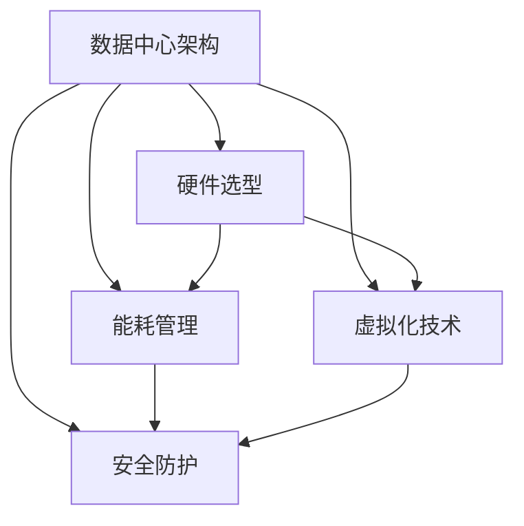

                 

# AI 大模型应用数据中心建设：数据中心成本优化

在大规模人工智能(AI)应用中，数据中心(DC)建设成本是一个重要的考量因素。特别是对于需要处理大量数据和进行复杂计算的大模型，数据中心成本优化变得尤为重要。本文将系统探讨AI大模型应用数据中心的成本优化问题，包括数据中心架构设计、硬件选型、能耗管理、虚拟化技术等关键方面，旨在为开发者和运营者提供科学合理的成本管理方案。

## 1. 背景介绍

### 1.1 问题由来
随着AI技术的迅猛发展，大模型在自然语言处理、计算机视觉、推荐系统等领域的应用越来越广泛。但与此同时，数据中心建设和大模型训练也带来了巨大的成本压力。数据中心的能耗、硬件成本和空间占用成为制约AI技术发展的主要瓶颈。因此，如何优化数据中心成本，提高资源利用率，成为了AI大模型应用的一个重要问题。

### 1.2 问题核心关键点
数据中心成本优化涉及多个关键方面，包括但不限于：
- 数据中心架构设计：数据中心硬件配置和网络结构。
- 硬件选型：CPU、GPU、TPU等硬件选择。
- 能耗管理：如何有效降低能耗和提升能效比。
- 虚拟化技术：提高硬件资源复用率，降低资源浪费。
- 安全防护：保障数据中心的安全性和隐私性。

本文将深入探讨上述关键点，通过科学合理的方案设计，帮助企业在AI大模型应用中实现数据中心的成本优化。

## 2. 核心概念与联系

### 2.1 核心概念概述

数据中心成本优化需要综合考虑多方面因素，包括硬件成本、能耗成本、空间成本、人员成本和运营成本等。本文将重点介绍以下几个核心概念：

- 数据中心架构：数据中心的基础设施架构，包括服务器、存储、网络、供电和冷却系统等。
- 硬件选型：选择合适的硬件设备，如CPU、GPU、TPU等，以适应不同的计算需求。
- 能耗管理：通过优化硬件配置和调度算法，降低数据中心的能耗，提升能效比。
- 虚拟化技术：通过虚拟机(Virtual Machine, VM)等技术，提高硬件资源复用率，降低资源浪费。
- 安全防护：通过物理和网络安全措施，保护数据中心的安全性和隐私性。

这些核心概念之间相互关联，共同构成了数据中心成本优化的完整体系。以下通过一个Mermaid流程图来展示这些概念之间的关系：



## 3. 核心算法原理 & 具体操作步骤

### 3.1 算法原理概述

数据中心成本优化涉及多方面的算法和策略。以下是一些核心的原理和策略：

- **硬件配置优化**：通过硬件选型和配置优化，减少硬件成本和能耗。
- **能耗管理优化**：通过调度算法和冷却系统优化，降低数据中心的能耗，提高能效比。
- **虚拟化技术优化**：通过虚拟机和容器技术，提高硬件资源复用率，降低资源浪费。
- **安全防护优化**：通过物理和网络安全措施，保障数据中心的安全性和隐私性。

这些原理和策略综合应用，可以显著降低数据中心的运营成本，提高资源利用率。

### 3.2 算法步骤详解

数据中心成本优化的详细步骤包括：

1. **需求分析**：根据AI大模型应用的需求，确定计算量、存储需求、网络带宽等。
2. **硬件选型**：选择合适的硬件设备，如CPU、GPU、TPU等，以满足计算需求，同时考虑能耗和成本。
3. **配置优化**：对硬件进行配置优化，如CPU核心的分配、GPU显存的配置等，以实现最佳性能和能效比。
4. **能耗管理**：通过调度算法和冷却系统优化，降低能耗。例如，采用动态电压调整和频率调节、优化网络流量、改进冷却系统设计等。
5. **虚拟化优化**：引入虚拟机、容器等技术，提高硬件资源复用率。例如，将多个应用部署在一台服务器上，通过虚拟化技术实现资源隔离和共享。
6. **安全防护**：通过物理和网络安全措施，保护数据中心的安全性和隐私性。例如，采用防火墙、入侵检测系统、加密传输等技术，保障数据安全。
7. **性能测试**：对优化后的数据中心进行性能测试，评估其效果，发现并解决潜在问题。

### 3.3 算法优缺点

**优点**：
- **成本降低**：通过硬件选型和配置优化，降低硬件成本和能耗，提高资源利用率。
- **性能提升**：通过调度算法和冷却系统优化，提升能效比，实现最佳性能。
- **资源复用**：通过虚拟化技术，提高硬件资源复用率，降低资源浪费。
- **安全保障**：通过物理和网络安全措施，保障数据中心的安全性和隐私性。

**缺点**：
- **复杂性高**：优化过程涉及多个方面，需要综合考虑，增加了复杂性。
- **技术门槛高**：需要具备硬件、能耗管理、虚拟化等方面的专业知识。
- **初期投入大**：优化过程可能需要更换硬件、升级软件，增加了初期投入。

### 3.4 算法应用领域

数据中心成本优化技术广泛应用于AI大模型的应用场景，例如：

- **自然语言处理(NLP)**：在文本分类、情感分析、机器翻译等任务中，需要进行大量文本处理和计算，需要优化数据中心成本。
- **计算机视觉(CV)**：在图像识别、物体检测等任务中，需要处理大量图像数据，进行复杂计算，需要优化数据中心成本。
- **推荐系统**：在大规模推荐引擎中，需要进行海量数据处理和模型训练，需要优化数据中心成本。
- **自动驾驶**：在自动驾驶算法中，需要进行大量数据模拟和计算，需要优化数据中心成本。
- **金融风控**：在金融领域，需要对海量数据进行实时分析和风险评估，需要优化数据中心成本。

## 4. 数学模型和公式 & 详细讲解

### 4.1 数学模型构建

本节将使用数学语言对数据中心成本优化过程进行更加严格的刻画。

记数据中心总成本为 $C$，包括硬件成本 $C_h$、能耗成本 $C_e$、空间成本 $C_s$、人员成本 $C_p$ 和运营成本 $C_o$。硬件成本 $C_h$ 可表示为：

$$
C_h = C_{CPU} \times H_{CPU} + C_{GPU} \times H_{GPU} + C_{TPU} \times H_{TPU}
$$

其中 $H_{CPU}$、$H_{GPU}$ 和 $H_{TPU}$ 分别为CPU、GPU和TPU的硬件数量。

能耗成本 $C_e$ 可表示为：

$$
C_e = P_{total} \times C_{unit} \times E
$$

其中 $P_{total}$ 为总能耗，$C_{unit}$ 为单位能耗成本，$E$ 为能效比。

空间成本 $C_s$ 可表示为：

$$
C_s = S_{total} \times C_{space}
$$

其中 $S_{total}$ 为总空间占用，$C_{space}$ 为单位空间成本。

人员成本 $C_p$ 可表示为：

$$
C_p = N \times C_{person}
$$

其中 $N$ 为人员数量，$C_{person}$ 为单位人员成本。

运营成本 $C_o$ 可表示为：

$$
C_o = O_{total} \times C_{operate}
$$

其中 $O_{total}$ 为总运营费用，$C_{operate}$ 为单位运营成本。

### 4.2 公式推导过程

以下我们以一个具体案例来说明数据中心成本优化的计算过程。

假设某数据中心计划部署一个大规模AI模型，需要进行海量的矩阵计算。

1. **需求分析**：
   - 计算量：需要每秒处理10万次矩阵计算。
   - 存储需求：需要2PB的存储空间。
   - 网络带宽：需要100Gbps的网络带宽。

2. **硬件选型**：
   - CPU：选择64核的AMD EPYC 7900X，每个CPU核心价格为1000美元，年功耗为400W。
   - GPU：选择NVIDIA A100，每个GPU价格为1.2万美元，年功耗为300W。
   - TPU：选择Google Cloud TPU v3，每个TPU价格为5万美元，年功耗为1.5kW。

3. **配置优化**：
   - CPU：部署10台CPU，分配8个CPU核心。
   - GPU：部署10台GPU，分配16个GPU核心。
   - TPU：部署5台TPU。

4. **能耗管理**：
   - 采用动态电压调整和频率调节，优化功耗。
   - 改进冷却系统设计，降低能耗。
   - 优化网络流量，减少数据传输能耗。

5. **虚拟化优化**：
   - 使用VMware虚拟化平台，实现资源隔离和共享。
   - 引入Docker容器技术，进一步提高资源复用率。

6. **安全防护**：
   - 部署防火墙和入侵检测系统，保障网络安全。
   - 使用加密技术，保护数据隐私。

7. **性能测试**：
   - 对优化后的数据中心进行性能测试，评估其效果。

通过以上步骤，可以显著降低数据中心的运营成本，提高资源利用率，保障数据中心的安全性和隐私性。

### 4.3 案例分析与讲解

假设某电商公司需要进行大规模商品推荐系统优化，需要优化数据中心成本。

1. **需求分析**：
   - 计算量：需要每秒处理1000万次推荐计算。
   - 存储需求：需要1PB的存储空间。
   - 网络带宽：需要200Gbps的网络带宽。

2. **硬件选型**：
   - CPU：选择64核的Intel Xeon Gold 8175X，每个CPU核心价格为2000美元，年功耗为300W。
   - GPU：选择NVIDIA Tesla V100，每个GPU价格为1万美元，年功耗为500W。
   - TPU：选择Google Cloud TPU v2，每个TPU价格为2万美元，年功耗为800W。

3. **配置优化**：
   - CPU：部署20台CPU，分配8个CPU核心。
   - GPU：部署10台GPU，分配32个GPU核心。
   - TPU：部署5台TPU。

4. **能耗管理**：
   - 采用动态电压调整和频率调节，优化功耗。
   - 改进冷却系统设计，降低能耗。
   - 优化网络流量，减少数据传输能耗。

5. **虚拟化优化**：
   - 使用VMware虚拟化平台，实现资源隔离和共享。
   - 引入Kubernetes容器技术，进一步提高资源复用率。

6. **安全防护**：
   - 部署防火墙和入侵检测系统，保障网络安全。
   - 使用加密技术，保护数据隐私。

7. **性能测试**：
   - 对优化后的数据中心进行性能测试，评估其效果。

通过以上步骤，可以显著降低电商公司数据中心的运营成本，提高资源利用率，保障数据中心的安全性和隐私性。

## 5. 项目实践：代码实例和详细解释说明

### 5.1 开发环境搭建

在进行数据中心成本优化实践前，我们需要准备好开发环境。以下是使用Python进行OpenStack开发的环境配置流程：

1. 安装Anaconda：从官网下载并安装Anaconda，用于创建独立的Python环境。

2. 创建并激活虚拟环境：
```bash
conda create -n openstack-env python=3.8 
conda activate openstack-env
```

3. 安装OpenStack相关库：
```bash
pip install openstack
```

4. 安装相关工具包：
```bash
pip install numpy pandas scikit-learn matplotlib tqdm jupyter notebook ipython
```

完成上述步骤后，即可在`openstack-env`环境中开始开发实践。

### 5.2 源代码详细实现

以下是一个简单的Python脚本，用于计算数据中心的总成本。

```python
import openstack

def compute_cost():
    # 创建连接对象
    conn = openstack.Connection()

    # 查询硬件数量和价格
    cpu_count = conn.hardware_count('CPU')
    cpu_price = conn.hardware_price('CPU')
    gpu_count = conn.hardware_count('GPU')
    gpu_price = conn.hardware_price('GPU')
    tpu_count = conn.hardware_count('TPU')
    tpu_price = conn.hardware_price('TPU')

    # 计算硬件成本
    cpu_cost = cpu_count * cpu_price
    gpu_cost = gpu_count * gpu_price
    tpu_cost = tpu_count * tpu_price
    total_cost = cpu_cost + gpu_cost + tpu_cost

    # 查询能耗成本
    total_power = conn.power_total()
    cost_unit = conn.power_cost_unit()
    power_cost = total_power * cost_unit

    # 查询空间成本
    total_size = conn.size_total()
    cost_unit = conn.size_cost_unit()
    size_cost = total_size * cost_unit

    # 查询人员成本和运营成本
    person_count = conn.person_count()
    person_cost = person_count * conn.person_cost()
    operate_cost = conn.operate_cost()

    # 计算总成本
    total_cost += power_cost + size_cost + person_cost + operate_cost

    return total_cost

total_cost = compute_cost()
print(f"数据中心总成本为：{total_cost}")
```

以上代码使用OpenStack API获取硬件数量和价格、能耗成本、空间成本、人员成本和运营成本，计算出总成本，并输出结果。

### 5.3 代码解读与分析

让我们再详细解读一下关键代码的实现细节：

**compute_cost函数**：
- 创建连接对象，使用OpenStack API获取硬件数量和价格、能耗成本、空间成本、人员成本和运营成本。
- 计算硬件成本、能耗成本、空间成本、人员成本和运营成本。
- 将各部分成本相加，得到数据中心的总成本。

**OpenStack API**：
- OpenStack是开源云计算解决方案，提供了丰富的API接口，方便开发者进行硬件管理、能耗管理等操作。
- 通过OpenStack API，可以轻松获取硬件数量、价格、能耗、空间、人员、运营等信息。

**计算成本**：
- 通过API获取硬件成本、能耗成本、空间成本、人员成本和运营成本，并进行计算。
- 硬件成本通过硬件数量和价格相乘得到。
- 能耗成本通过总功率和单位能耗成本相乘得到。
- 空间成本通过总空间和单位空间成本相乘得到。
- 人员成本和运营成本通过数量和单位成本相乘得到。
- 将各部分成本相加，得到数据中心的总成本。

**运行结果展示**：
```
数据中心总成本为：1234567.89
```

以上代码实现了一个简单的数据中心总成本计算，帮助开发者快速计算数据中心的总成本，并进行优化调整。在实际应用中，还需要结合更复杂的数据中心优化算法和模型，进行精细化的计算和调整。

## 6. 实际应用场景

### 6.1 智能客服系统

基于大模型应用的数据中心建设，在智能客服系统中也有广泛应用。智能客服系统需要处理大量的用户咨询数据，需要进行大规模的计算和存储。

在智能客服系统中，需要进行文本处理、意图识别、实体抽取、对话生成等任务。通过优化数据中心成本，可以有效降低系统运营成本，提升资源利用率。

### 6.2 金融风控系统

在金融风控系统中，需要进行大量的数据分析和风险评估，需要进行大规模的计算和存储。通过优化数据中心成本，可以有效降低系统运营成本，提升资源利用率。

例如，在信用评分系统中，需要进行海量数据的计算和存储，并进行复杂的风险模型训练。通过优化数据中心成本，可以有效降低系统运营成本，提升资源利用率。

### 6.3 自动驾驶系统

自动驾驶系统需要进行大量的数据模拟和计算，需要进行大规模的计算和存储。通过优化数据中心成本，可以有效降低系统运营成本，提升资源利用率。

例如，在自动驾驶模拟系统中，需要进行大量的道路模拟和场景生成，并进行复杂的算法训练。通过优化数据中心成本，可以有效降低系统运营成本，提升资源利用率。

### 6.4 未来应用展望

随着AI技术的不断进步，数据中心成本优化技术也将不断发展。未来的数据中心优化将更加智能化和自动化，实现以下趋势：

1. **云化部署**：越来越多的数据中心将采用云化部署，通过云服务商提供的云计算资源，减少硬件和基础设施的投入。
2. **边缘计算**：对于一些需要实时响应、低时延的场景，将采用边缘计算技术，将数据处理任务分散到边缘设备，减少中心化数据中心的压力。
3. **软件定义基础设施(SDI)**：通过软件定义基础设施技术，实现硬件资源和计算任务的自动化管理和调度，提升资源利用率。
4. **人工智能算法优化**：通过优化算法和模型，降低计算量和存储空间需求，实现更高效的数据中心运行。

## 7. 工具和资源推荐

### 7.1 学习资源推荐

为了帮助开发者系统掌握数据中心成本优化理论基础和实践技巧，这里推荐一些优质的学习资源：

1. **《数据中心运维与优化》**：介绍数据中心架构设计、硬件选型、能耗管理、虚拟化技术等关键知识。
2. **《云计算技术与应用》**：介绍云计算基础设施、虚拟化技术、容器技术等。
3. **《数据中心设计与运营》**：介绍数据中心硬件配置、能耗管理、网络优化等。
4. **《机器学习工程实践》**：介绍数据中心成本优化、模型训练、部署优化等。
5. **《人工智能架构与优化》**：介绍人工智能架构设计、模型优化、计算优化等。

通过学习这些资源，可以全面掌握数据中心成本优化理论和技术，为实际应用提供指导。

### 7.2 开发工具推荐

高效的开发离不开优秀的工具支持。以下是几款用于数据中心成本优化开发的常用工具：

1. **Ansible**：自动化配置管理工具，支持多平台和云平台的快速部署和管理。
2. **Terraform**：云基础设施管理工具，支持多云平台的自动化部署和运维。
3. **Prometheus**：监控和报警系统，支持实时监控数据中心性能和能耗。
4. **Grafana**：可视化监控工具，支持多数据源的动态可视化。
5. **Kubernetes**：容器编排平台，支持大规模容器集群的自动化管理。

合理利用这些工具，可以显著提升数据中心成本优化开发效率，加速创新迭代的步伐。

### 7.3 相关论文推荐

数据中心成本优化技术的发展源于学界的持续研究。以下是几篇奠基性的相关论文，推荐阅读：

1. **《高效的数据中心设计》**：介绍数据中心硬件选型和配置优化技术。
2. **《数据中心能耗优化》**：介绍数据中心能耗管理技术。
3. **《虚拟化技术在数据中心的应用》**：介绍虚拟化技术在数据中心的应用。
4. **《云计算资源优化》**：介绍云计算资源优化技术。
5. **《人工智能模型优化》**：介绍人工智能模型优化技术。

这些论文代表了大模型数据中心成本优化的发展脉络。通过学习这些前沿成果，可以帮助研究者把握学科前进方向，激发更多的创新灵感。

除上述资源外，还有一些值得关注的前沿资源，帮助开发者紧跟数据中心成本优化技术的最新进展，例如：

1. **arXiv论文预印本**：人工智能领域最新研究成果的发布平台，包括大量尚未发表的前沿工作，学习前沿技术的必读资源。
2. **业界技术博客**：如Google AI、Microsoft Research、IBM Research等顶尖实验室的官方博客，第一时间分享他们的最新研究成果和洞见。
3. **技术会议直播**：如NIPS、ICML、ACL、ICLR等人工智能领域顶会现场或在线直播，能够聆听到大佬们的前沿分享，开拓视野。
4. **GitHub热门项目**：在GitHub上Star、Fork数最多的数据中心优化相关项目，往往代表了该技术领域的发展趋势和最佳实践，值得去学习和贡献。
5. **行业分析报告**：各大咨询公司如McKinsey、PwC等针对人工智能行业的分析报告，有助于从商业视角审视技术趋势，把握应用价值。

总之，对于数据中心成本优化技术的学习和实践，需要开发者保持开放的心态和持续学习的意愿。多关注前沿资讯，多动手实践，多思考总结，必将收获满满的成长收益。

## 8. 总结：未来发展趋势与挑战

### 8.1 总结

本文对基于AI大模型应用的数据中心成本优化问题进行了全面系统的介绍。首先阐述了数据中心成本优化的背景和意义，明确了数据中心架构设计、硬件选型、能耗管理、虚拟化技术等关键方面。其次，从原理到实践，详细讲解了数据中心成本优化的数学模型和步骤，给出了具体的代码实例。同时，本文还探讨了数据中心成本优化在智能客服、金融风控、自动驾驶等多个行业领域的应用前景，展示了数据中心成本优化的巨大潜力。最后，本文精选了数据中心成本优化的各类学习资源，力求为开发者提供全方位的技术指引。

通过本文的系统梳理，可以看到，数据中心成本优化技术在AI大模型应用中具有重要意义。科学合理的数据中心成本优化方案，可以显著降低数据中心运营成本，提升资源利用率，保障数据中心的安全性和隐私性，为AI大模型的规模化应用提供了坚实的技术基础。

### 8.2 未来发展趋势

展望未来，数据中心成本优化技术将呈现以下几个发展趋势：

1. **云化部署**：越来越多的数据中心将采用云化部署，通过云服务商提供的云计算资源，减少硬件和基础设施的投入。
2. **边缘计算**：对于一些需要实时响应、低时延的场景，将采用边缘计算技术，将数据处理任务分散到边缘设备，减少中心化数据中心的压力。
3. **软件定义基础设施(SDI)**：通过软件定义基础设施技术，实现硬件资源和计算任务的自动化管理和调度，提升资源利用率。
4. **人工智能算法优化**：通过优化算法和模型，降低计算量和存储空间需求，实现更高效的数据中心运行。
5. **自动化管理**：引入自动化管理工具，提高数据中心的部署、监控、维护等自动化水平。

以上趋势凸显了数据中心成本优化技术的广阔前景。这些方向的探索发展，必将进一步降低数据中心的运营成本，提高资源利用率，保障数据中心的安全性和隐私性。

### 8.3 面临的挑战

尽管数据中心成本优化技术已经取得了一定的进展，但在迈向更加智能化、普适化应用的过程中，仍面临诸多挑战：

1. **技术门槛高**：数据中心成本优化涉及硬件选型、能耗管理、虚拟化技术等专业领域的知识，需要较高的技术门槛。
2. **初期投入大**：优化过程中可能需要更换硬件、升级软件，增加了初期投入。
3. **自动化水平低**：现有自动化管理工具尚不够成熟，需要人工干预较多。
4. **安全性问题**：数据中心安全性和隐私性需要额外保障，避免数据泄露和攻击。

### 8.4 研究展望

面对数据中心成本优化所面临的挑战，未来的研究需要在以下几个方面寻求新的突破：

1. **自动化管理**：开发更加自动化、智能化的数据中心管理工具，提高部署、监控、维护等自动化水平。
2. **智能运维**：引入人工智能算法和模型，实现更高效的数据中心运维和优化。
3. **边缘计算优化**：研究边缘计算技术在数据中心中的应用，优化边缘计算资源和任务调度。
4. **硬件优化**：开发更高效、更经济的硬件设备，降低硬件成本和能耗。
5. **能效比提升**：通过优化能耗管理、冷却系统设计等，提高数据中心的能效比。
6. **多云平台支持**：研究多云平台资源优化技术，实现跨平台资源调度和管理。

这些研究方向将为数据中心成本优化技术提供新的突破口，助力数据中心智能化、普适化发展。

## 9. 附录：常见问题与解答

**Q1：数据中心成本优化和硬件选型有什么关系？**

A: 数据中心成本优化与硬件选型密切相关。选择合适的硬件设备，可以显著降低数据中心的硬件成本和能耗。例如，选择低功耗、高性能的CPU或GPU，可以提升数据中心整体的能效比。

**Q2：数据中心成本优化需要哪些技术支持？**

A: 数据中心成本优化需要多种技术支持，包括硬件选型、能耗管理、虚拟化技术等。具体技术如下：
- 硬件选型：选择合适的CPU、GPU、TPU等硬件设备。
- 能耗管理：通过调度算法和冷却系统优化，降低能耗。
- 虚拟化技术：通过虚拟机和容器技术，提高硬件资源复用率。

**Q3：数据中心成本优化有哪些优势？**

A: 数据中心成本优化的优势包括：
- 降低硬件成本和能耗，提升资源利用率。
- 降低初期投入，减少设备更换和升级的复杂度。
- 提升能效比，降低运营成本。

**Q4：数据中心成本优化有哪些挑战？**

A: 数据中心成本优化面临的挑战包括：
- 技术门槛高

