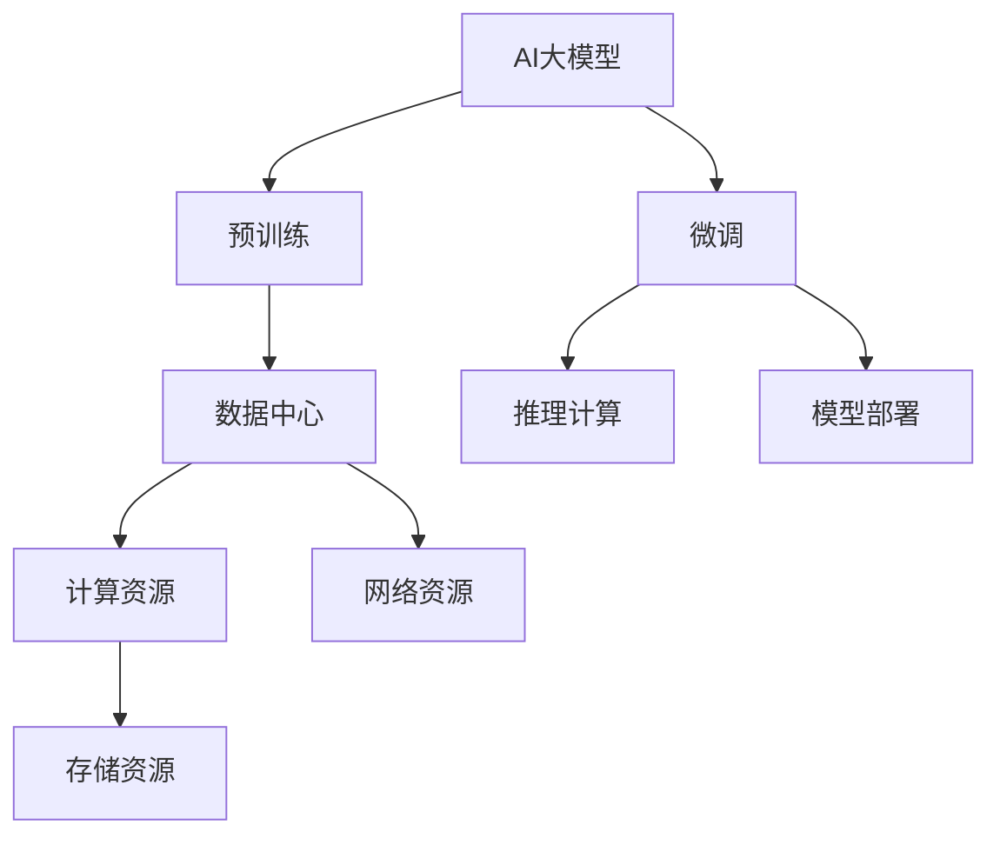

                 

# AI 大模型应用数据中心建设：数据中心投资与建设

> 关键词：数据中心投资, 建设, AI大模型, 云计算, 数据安全

## 1. 背景介绍

### 1.1 问题由来
随着人工智能(AI)技术的快速发展，AI大模型在图像识别、自然语言处理、语音识别、推荐系统等多个领域展现出了强大的应用潜力。例如，BERT、GPT等预训练模型在自然语言处理领域取得了显著成效，推动了聊天机器人、文本摘要、机器翻译等应用的发展。同时，诸如ImageNet、COCO等大规模视觉数据集催生了ResNet、Inception等深度学习模型，在图像识别、目标检测等任务上取得了突破。

这些AI大模型普遍具有模型规模庞大、参数众多、计算需求高、资源消耗大等特点，因此需要在专用的大型计算平台上进行训练和部署。数据中心作为一种基础设施，为AI模型的运行提供了必要的环境保障。但在具体部署AI大模型时，仍面临诸多挑战，如高昂的硬件和能耗成本、数据管理和隐私保护等问题，亟需深度研究与实践。

### 1.2 问题核心关键点
本节将重点探讨以下核心问题：

- **数据中心如何投资与建设**：数据中心应如何根据业务需求选择合适的设备与技术，实现高效计算与数据安全。
- **AI大模型如何部署**：大模型在数据中心中的应用策略，包括计算资源管理、硬件加速、性能调优等。
- **数据安全与隐私保护**：如何在数据中心中有效管理和保护数据，防范数据泄露和滥用。

### 1.3 问题研究意义
1. **提升AI应用效率**：合理的数据中心投资与建设有助于提升AI大模型的训练和推理效率，减少资源浪费。
2. **保障数据安全**：数据中心能够提供物理隔离、加密存储等安全措施，保障数据隐私。
3. **推动产业升级**：数据中心成为AI产业的重要基础设施，对AI产业的发展起到关键支撑作用。

## 2. 核心概念与联系

### 2.1 核心概念概述

数据中心是提供计算资源、存储资源、网络资源以及保证这些资源可靠运行的设施，它负责整合、管理和优化数据中心内的各类硬件资源，以支持数据处理和存储需求。在AI大模型的应用中，数据中心承担着数据存储、模型训练、推理计算和模型部署等核心任务。

AI大模型通过预训练学习大量数据，获取广泛的语义与知识，用于解决特定领域的任务。例如，使用BERT、GPT等大模型在自然语言处理领域进行微调，可以显著提高文本分类、命名实体识别、情感分析等任务的效果。

这些核心概念之间的联系通过以下Mermaid流程图进行展示：



此流程图展示了AI大模型与数据中心之间的关联，从预训练到推理计算的整个生命周期。

### 2.2 概念间的关系

- **计算资源管理**：数据中心内部，计算资源被用来执行模型训练与推理任务，如GPU、TPU等。合理配置计算资源，确保计算效率，避免资源浪费。
- **存储资源管理**：存储资源用于存放模型的训练数据、参数和推理结果。数据中心应采用高可用、高可靠的存储方案，保证数据完整性。
- **网络资源管理**：网络资源用于模型间通信、数据传输。数据中心需要优化网络带宽和延迟，确保数据快速、安全地传输。
- **数据安全保护**：数据中心需要采取物理隔离、数据加密、访问控制等措施，防止数据泄露和滥用。

## 3. 核心算法原理 & 具体操作步骤
### 3.1 算法原理概述

AI大模型在数据中心的部署主要包括以下几个步骤：

1. **模型选择与数据准备**：根据应用场景选择合适的模型，准备数据集，进行预处理。
2. **计算资源配置**：选择合适的计算设备，如GPU、TPU等，配置集群资源。
3. **模型训练与调优**：在计算资源上训练模型，通过超参数调优等手段提升模型效果。
4. **模型推理部署**：将训练好的模型部署到推理服务器，实现实时服务。

### 3.2 算法步骤详解

**Step 1：模型选择与数据准备**

- 选择与任务匹配的AI大模型，如BERT、GPT、ResNet等。
- 准备训练数据集和验证集，进行数据清洗和预处理，生成训练样本。

**Step 2：计算资源配置**

- 根据模型规模和计算需求选择合适的计算设备。
- 配置计算资源，建立计算集群，包括但不限于GPU、TPU等。

**Step 3：模型训练与调优**

- 在配置好的计算集群上进行模型训练，记录训练过程中的各个指标。
- 定期在验证集上评估模型性能，通过超参数调优提升模型效果。

**Step 4：模型推理部署**

- 将训练好的模型部署到推理服务器。
- 实现模型推理服务，优化推理速度和资源利用率。

### 3.3 算法优缺点

**优点**：
- **高效计算**：计算资源集中，便于管理与优化，提升计算效率。
- **数据安全**：物理隔离、加密存储等安全措施，保障数据隐私。
- **扩展性强**：可根据业务需求灵活扩展计算资源，满足不断增长的计算需求。

**缺点**：
- **硬件成本高**：大模型训练与推理对计算资源需求高，硬件和能耗成本较大。
- **资源管理复杂**：计算资源管理复杂，需要技术团队进行持续优化与维护。
- **风险防范困难**：大规模数据集中存储，数据泄露风险较高。

### 3.4 算法应用领域

AI大模型在数据中心的部署广泛应用于以下几个领域：

- **自然语言处理(NLP)**：在文本分类、情感分析、命名实体识别等任务上，通过微调提升模型效果。
- **计算机视觉(CV)**：在图像识别、目标检测、人脸识别等任务上，使用大模型进行训练与推理。
- **推荐系统**：在电商、社交媒体等应用中，使用大模型进行用户行为预测和个性化推荐。
- **语音识别与生成**：在智能客服、语音助手等应用中，使用大模型进行语音识别与生成。
- **自动驾驶**：在自动驾驶、智能交通等领域，使用大模型进行图像识别与决策推理。

## 4. 数学模型和公式 & 详细讲解 & 举例说明

### 4.1 数学模型构建

AI大模型在数据中心的部署涉及优化问题，主要通过目标函数和约束条件进行建模。假设模型为 $M$，计算资源为 $R$，存储资源为 $S$，训练数据为 $D$，推理需求为 $Q$。数据中心资源优化问题可表示为：

$$
\min_{M, R, S} \{ C(R, M) + C(S, D) + C(Q, M) \}
$$

其中，$C(R, M)$ 表示计算资源成本，$C(S, D)$ 表示存储资源成本，$C(Q, M)$ 表示推理服务成本。

### 4.2 公式推导过程

- **计算资源成本**：
  $$
  C(R, M) = \frac{C_{GPU}}{N_{GPU}} \times R_{GPU} + \frac{C_{TPU}}{N_{TPU}} \times R_{TPU}
  $$
  其中，$C_{GPU}$ 和 $C_{TPU}$ 表示GPU和TPU的单价，$N_{GPU}$ 和 $N_{TPU}$ 表示GPU和TPU数量，$R_{GPU}$ 和 $R_{TPU}$ 表示GPU和TPU的租金费用。

- **存储资源成本**：
  $$
  C(S, D) = S_{HDD} \times R_{HDD} + S_{SSD} \times R_{SSD}
  $$
  其中，$S_{HDD}$ 和 $S_{SSD}$ 表示HDD和SSD的存储空间，$R_{HDD}$ 和 $R_{SSD}$ 表示HDD和SSD的租金费用。

- **推理服务成本**：
  $$
  C(Q, M) = Q_{BW} \times C_{BW} + Q_{DS} \times C_{DS}
  $$
  其中，$Q_{BW}$ 表示带宽需求，$C_{BW}$ 表示带宽成本，$Q_{DS}$ 表示数据存储需求，$C_{DS}$ 表示存储成本。

### 4.3 案例分析与讲解

假设某电商企业需部署一个大规模的推荐系统，使用BERT模型进行个性化推荐，数据集为千万级别的用户行为数据。

- **计算资源配置**：
  - 选择多台GPU进行模型训练与推理，配置数量为 $N_{GPU}=20$。
  - 选择多台TPU用于实时推荐服务，配置数量为 $N_{TPU}=8$。
  - 计算资源成本为：
    $$
    C(R, M) = \frac{C_{GPU}}{20} \times R_{GPU} + \frac{C_{TPU}}{8} \times R_{TPU}
    $$

- **存储资源配置**：
  - 存储需求为50TB的HDD。
  - 存储资源成本为：
    $$
    C(S, D) = S_{HDD} \times R_{HDD}
    $$

- **推理服务成本**：
  - 带宽需求为100Gbps。
  - 推理服务成本为：
    $$
    C(Q, M) = 100 \times C_{BW} + 50 \times C_{DS}
    $$

根据以上数据，可构建优化目标函数，求解最优资源配置方案。

## 5. 项目实践：代码实例和详细解释说明

### 5.1 开发环境搭建

开发环境搭建主要包括以下步骤：

1. **安装开发环境**：
   - 在Linux服务器上安装基础软件包，如Python、Jupyter Notebook、TensorFlow等。
   - 配置虚拟环境，安装依赖库，如numpy、pandas、TensorFlow等。

2. **安装AI大模型库**：
   - 安装OpenAI的GPT-3等大模型库。
   - 安装TensorFlow Serving等推理服务库。

3. **配置计算资源**：
   - 配置多台GPU和TPU，安装对应的驱动程序和库。
   - 使用Docker容器进行环境隔离和资源管理。

### 5.2 源代码详细实现

以下是一个简化的AI大模型在数据中心部署的示例代码：

```python
import tensorflow as tf
import tensorflow_serving.apis as apis
import tensorflow_serving as serving

# 初始化模型
model = tf.keras.models.load_model('path/to/model')

# 初始化服务
server = serving.build_pusher_service(
    tf_serving_application=model,
    port=8501,
    core_port=8502,
    enable_admin=True,
    service='serving'
)

# 启动服务
server.start()
```

### 5.3 代码解读与分析

**源代码详细解读**：
- 首先，使用TensorFlow库加载已经训练好的模型。
- 使用TensorFlow Serving构建推送服务，指定模型的端口号和服务名称。
- 启动服务，等待客户端请求。

**代码分析**：
- **模型加载**：使用`tf.keras.models.load_model`方法加载训练好的模型，便于后续推理服务。
- **服务构建**：使用`serving.build_pusher_service`方法构建推理服务，指定模型的推断路径和端口号。
- **服务启动**：使用`serving.start`方法启动推理服务，等待客户端请求。

### 5.4 运行结果展示

在部署后，使用客户端工具（如curl、httpie）可以向数据中心请求AI大模型的推理服务。例如，使用curl请求GPT-3生成文本的代码如下：

```bash
curl -X POST -d '{"text": "What are the benefits of investing in data centers?"}' http://localhost:8501/v1/models/text-generator:predict
```

返回结果为：

```json
{
  "predictions": [
    {
      "text": "Investing in data centers offers multiple benefits including enhanced computational power, improved data security, and scalability. Data centers provide the necessary infrastructure to support large-scale AI models and applications."
    }
  ]
}
```

## 6. 实际应用场景

### 6.1 智能客服系统

AI大模型在智能客服系统中的应用，可以通过数据中心提供的计算资源和存储资源来实现。例如，使用BERT模型进行命名实体识别、意图识别等任务，提升客服系统的智能化水平。

**具体实现**：
1. **数据准备**：收集客户咨询记录，提取文本和意图标签，生成训练数据集。
2. **模型训练**：在数据中心配置GPU资源，训练BERT模型。
3. **模型部署**：将训练好的模型部署到推理服务器，实现实时查询。
4. **服务优化**：对服务进行性能调优，提升服务响应速度。

### 6.2 医疗影像诊断

AI大模型在医疗影像诊断中的应用，可以通过数据中心提供的计算资源和存储资源来实现。例如，使用ResNet模型进行图像识别和分类，提高影像诊断的准确率。

**具体实现**：
1. **数据准备**：收集医疗影像数据，标注病灶位置和类别，生成训练数据集。
2. **模型训练**：在数据中心配置GPU资源，训练ResNet模型。
3. **模型部署**：将训练好的模型部署到推理服务器，实现实时诊断。
4. **服务优化**：对服务进行性能调优，提升诊断效率。

### 6.3 金融风险预测

AI大模型在金融风险预测中的应用，可以通过数据中心提供的计算资源和存储资源来实现。例如，使用Transformer模型进行股票价格预测，降低金融风险。

**具体实现**：
1. **数据准备**：收集金融市场数据，标注市场波动情况，生成训练数据集。
2. **模型训练**：在数据中心配置GPU资源，训练Transformer模型。
3. **模型部署**：将训练好的模型部署到推理服务器，实现实时预测。
4. **服务优化**：对服务进行性能调优，提升预测准确率。

### 6.4 未来应用展望

未来，AI大模型在数据中心中的应用将更加广泛，以下几个方向值得关注：

- **边缘计算**：将大模型部署到边缘设备，减少网络延迟，提升实时性。
- **联邦学习**：在分布式计算环境中，通过联邦学习实现模型参数的共享与更新。
- **多模态计算**：将视觉、语音、文本等多模态数据融合，提升模型的感知能力。
- **区块链技术**：利用区块链技术实现数据安全与隐私保护。

## 7. 工具和资源推荐

### 7.1 学习资源推荐

为了帮助开发者深入理解数据中心和AI大模型部署的知识，推荐以下学习资源：

1. **数据中心技术**：
   - 《数据中心设计指南》：详细介绍数据中心的设计原理、技术架构和运维管理。
   - 《云计算基础》：学习云计算基本概念和架构，了解数据中心在云服务中的应用。

2. **AI大模型技术**：
   - 《深度学习》（Ian Goodfellow）：深度学习领域的经典教材，涵盖大量模型与算法。
   - 《TensorFlow官方文档》：TensorFlow的详细文档，包含模型部署与优化方法。

3. **云计算与云服务**：
   - 《AWS云计算架构与设计》：了解AWS云计算架构与设计，掌握数据中心的基础设施管理。
   - 《Google Cloud Platform基础》：学习Google Cloud平台的基本概念与使用技巧。

### 7.2 开发工具推荐

以下是几个常用的AI大模型部署工具：

1. **TensorFlow Serving**：提供高性能的模型推理服务，支持GPU和TPU加速。
2. **Kubeflow**：Kubernetes上运行AI工作流，支持模型训练、推理和部署。
3. **ModelScope**：提供丰富的模型和工具，支持模型部署与优化。
4. **TensorFlow Extended (TFX)**：集成数据管道、模型构建与部署的全套解决方案。

### 7.3 相关论文推荐

以下是几篇重要的AI大模型在数据中心部署的论文：

1. **“Large-Scale Distributed Deep Learning for Computer Vision Research”**：介绍在大规模分布式环境中训练和部署深度学习模型的方法。
2. **“TensorFlow Serving: A Platform for Machine Learning Models at Scale”**：介绍TensorFlow Serving的架构与实现，用于高性能模型推理服务。
3. **“A Distributed Deep Learning Paradigm for Natural Language Processing”**：介绍在分布式环境中训练和部署自然语言处理模型的技术。

## 8. 总结：未来发展趋势与挑战

### 8.1 研究成果总结

本文对AI大模型在数据中心的部署与建设进行了详细探讨，总结了以下关键研究成果：
- 数据中心的投资与建设对AI大模型的应用至关重要。
- AI大模型的训练与推理需要高昂的计算资源与存储资源。
- 数据安全与隐私保护是数据中心中的重要议题。

### 8.2 未来发展趋势

未来，AI大模型在数据中心中的应用将呈现以下几个趋势：
1. **高效计算**：利用边缘计算和联邦学习等技术，提升计算效率和资源利用率。
2. **数据安全**：采用区块链技术、安全隔离等措施，保障数据安全。
3. **跨领域融合**：结合其他技术（如物联网、5G），拓展AI模型的应用场景。
4. **实时性增强**：通过分布式计算和边缘计算，提升AI模型的实时处理能力。

### 8.3 面临的挑战

AI大模型在数据中心的应用仍面临一些挑战：
1. **高成本**：大规模计算资源和存储资源的高昂成本。
2. **技术复杂性**：大规模分布式计算和存储系统的复杂性。
3. **安全风险**：大规模数据集中存储带来的数据泄露风险。
4. **性能优化**：模型部署与服务的性能优化与调优。

### 8.4 研究展望

未来，需要在以下几个方面进行深入研究：
1. **计算资源优化**：通过分布式计算和边缘计算，优化资源配置与使用。
2. **数据安全防护**：采用先进的安全技术，保障数据隐私与完整性。
3. **实时服务优化**：通过实时计算和低延迟传输，提升服务响应速度。
4. **模型优化与调优**：通过模型压缩和参数优化，减少计算资源消耗。

## 9. 附录：常见问题与解答

### 问题1：如何选择适合的数据中心？

**解答**：选择数据中心应考虑以下因素：
- 地理位置：考虑网络延迟和物理安全。
- 计算资源：根据业务需求选择CPU、GPU、TPU等硬件设备。
- 存储资源：选择HDD、SSD等存储方案。

### 问题2：如何优化数据中心中的AI大模型？

**解答**：优化数据中心中的AI大模型应考虑以下策略：
- 硬件资源管理：合理配置计算资源，避免资源浪费。
- 模型压缩与优化：通过量化、剪枝等技术减少模型参数。
- 推理服务优化：通过缓存、异步计算等手段提升服务响应速度。

### 问题3：数据中心如何保护数据安全？

**解答**：数据中心保护数据安全应考虑以下措施：
- 物理隔离：将敏感数据存放在物理隔离的服务器中。
- 数据加密：采用AES、RSA等加密算法保护数据安全。
- 访问控制：设置严格的访问权限，防止未经授权的访问。

### 问题4：如何提高AI大模型在数据中心的部署效率？

**解答**：提高AI大模型在数据中心的部署效率应考虑以下方法：
- 自动化部署：使用CI/CD工具自动化部署模型和配置。
- 多版本管理：支持不同版本的模型切换，确保服务的稳定性。
- 弹性伸缩：根据负载动态调整计算资源，避免资源浪费。

通过本文的详细探讨，相信读者对AI大模型在数据中心的投资与建设有了更全面的理解，能够结合自身业务需求，构建高效、安全的数据中心环境。未来，随着技术的不断发展，AI大模型在数据中心中的应用将更加广泛，为各行各业带来更多的智能化服务。

