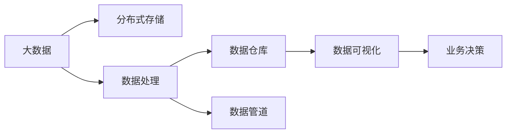

                 

# AI 大模型应用数据中心的数据分析架构

> 关键词：大数据,分布式存储,数据处理,数据仓库,数据管道,机器学习,数据可视化

## 1. 背景介绍

### 1.1 问题由来
随着人工智能(AI)技术的快速发展，特别是深度学习和机器学习在各行各业的应用，数据中心的数据量呈爆炸式增长。据统计，全球数据中心存储的数据量已达数百万TB，其中大部分数据与AI相关。因此，如何有效管理和分析这些海量数据，成为了数据中心面临的一个重大挑战。

### 1.2 问题核心关键点
为了应对这一挑战，数据中心需要构建一套完整的数据分析架构，以支持AI大模型的训练和应用。该架构需要具备以下几个关键点：

- 大规模数据存储和管理：高效、可靠的存储和管理海量数据。
- 高性能数据处理：实时、高效地处理和分析数据。
- 分布式计算能力：支持大规模并行计算，适应大数据处理需求。
- 数据仓库构建：通过数据仓库构建数据中心的知识库，支持数据分析和数据挖掘。
- 数据管道和数据可视化：构建高效的数据管道，支持数据的实时流传输和可视化展示。

### 1.3 问题研究意义
构建高效、可靠、灵活的数据分析架构，对于数据中心实现AI大模型的训练和应用具有重要意义：

1. 提高AI模型训练效率：通过高效的数据处理和分布式计算能力，显著提升AI模型的训练速度。
2. 优化资源利用：通过数据仓库和数据管道，优化资源利用，降低数据处理成本。
3. 增强数据可视化：通过数据可视化工具，实现数据的直观展示，帮助用户更好地理解数据分析结果。
4. 支持业务决策：基于数据分析结果，支持企业决策，提升业务竞争力。

## 2. 核心概念与联系

### 2.1 核心概念概述

为了更好地理解数据中心的数据分析架构，本节将介绍几个密切相关的核心概念：

- 大数据(Big Data)：指数据量、数据类型、数据速度都远超传统数据库处理能力的数据集合。
- 分布式存储(Distributed Storage)：指将数据分散存储在多台计算机上，以提高数据处理能力和可用性。
- 数据处理(Data Processing)：指对大规模数据进行清洗、转换、分析等操作，提取有价值的信息。
- 数据仓库(Data Warehouse)：指通过ETL（提取、转换、加载）技术构建的集中式数据存储，用于支持数据分析和数据挖掘。
- 数据管道(Data Pipeline)：指通过自动化工具和脚本，实现数据的实时流传输和处理。
- 数据可视化(Data Visualization)：指将数据分析结果以图形、图表等形式展示，便于用户理解和使用。

这些核心概念之间的逻辑关系可以通过以下Mermaid流程图来展示：



这个流程图展示了大数据从存储、处理、仓库构建、管道传输到可视化的完整流程，以及其最终支持业务决策的功能。

### 2.2 概念间的关系

这些核心概念之间存在着紧密的联系，形成了数据中心数据分析架构的基础。下面是一些关键的概念关系：

- 大数据与分布式存储：大数据需要高效的分布式存储来支撑，分布式存储技术提供了高可扩展性和高可用性，适应大数据的存储需求。
- 数据处理与数据仓库：数据处理是对大数据进行清洗、转换、分析的过程，数据仓库则是将处理后的数据集中存储，支持更高效的数据分析。
- 数据管道与数据处理：数据管道是实现数据实时流传输的核心，通过自动化工具实现数据的持续处理和传输。
- 数据可视化与业务决策：数据可视化是数据分析的最终呈现形式，通过直观的图表展示，帮助业务决策者更好地理解和利用数据分析结果。

## 3. 核心算法原理 & 具体操作步骤

### 3.1 算法原理概述

数据中心的数据分析架构，主要基于分布式计算和大数据处理技术。其核心思想是：将大数据分散存储在多个计算节点上，通过分布式计算技术高效地处理和分析数据，并将处理结果存入数据仓库中，通过数据管道进行实时传输和可视化展示，最终支持业务决策。

具体而言，数据中心的数据分析架构包括以下几个关键步骤：

1. 数据采集与预处理：通过数据管道和ETL技术，从不同数据源采集数据，并进行预处理，确保数据质量和一致性。
2. 数据存储与分布式处理：使用分布式存储技术，将大数据分散存储在多个计算节点上，使用分布式计算技术对数据进行高效处理。
3. 数据仓库构建：将处理后的数据存入数据仓库中，构建知识库，支持数据分析和数据挖掘。
4. 数据管道与实时传输：使用数据管道技术，实现数据的实时流传输，确保数据的一致性和实时性。
5. 数据可视化与分析：通过数据可视化工具，将数据分析结果直观展示，帮助用户理解数据分析结果。

### 3.2 算法步骤详解

下面是数据中心数据分析架构的详细操作步骤：

#### 3.2.1 数据采集与预处理

数据采集与预处理是数据分析的第一步，其目标是确保数据的质量和一致性。具体步骤如下：

1. 数据采集：使用数据管道技术，从不同数据源（如数据库、云存储、API接口等）采集数据。
2. 数据清洗：对采集的数据进行清洗，去除重复、无效、异常数据，确保数据的准确性和完整性。
3. 数据转换：将清洗后的数据进行格式转换，确保数据的一致性。
4. 数据加载：将转换后的数据加载到分布式存储系统中。

#### 3.2.2 数据存储与分布式处理

数据存储与分布式处理是数据分析的核心步骤，其目标是高效地处理和存储大规模数据。具体步骤如下：

1. 分布式存储：使用分布式存储技术，如Hadoop Distributed File System (HDFS)、Apache Cassandra等，将数据分散存储在多个计算节点上。
2. 分布式计算：使用分布式计算技术，如Apache Spark、Apache Flink等，对数据进行高效处理。
3. 数据分区：将数据按照一定规则进行分区，提高数据处理的并行性和效率。

#### 3.2.3 数据仓库构建

数据仓库构建是将处理后的数据集中存储，构建知识库，支持数据分析和数据挖掘。具体步骤如下：

1. 数据抽取：从分布式存储系统中抽取数据，存入数据仓库中。
2. 数据转换：对抽取的数据进行转换，确保数据的一致性和完整性。
3. 数据加载：将转换后的数据加载到数据仓库中。

#### 3.2.4 数据管道与实时传输

数据管道与实时传输是保证数据实时性和一致性的关键步骤。具体步骤如下：

1. 数据管道：使用数据管道技术，如Apache Kafka、Apache Beam等，实现数据的实时流传输。
2. 数据缓存：使用数据缓存技术，如Redis、Apache Kafka等，确保数据的一致性和实时性。

#### 3.2.5 数据可视化与分析

数据可视化与分析是数据分析的最终步骤，其目标是帮助用户理解数据分析结果。具体步骤如下：

1. 数据可视化：使用数据可视化工具，如Tableau、Power BI等，将数据分析结果直观展示。
2. 数据分析：使用数据分析工具，如Python、R等，对数据分析结果进行深入分析，提取有价值的信息。

### 3.3 算法优缺点

数据中心数据分析架构具有以下几个优点：

1. 高效处理大规模数据：通过分布式存储和分布式计算技术，可以高效地处理和分析大规模数据，提高数据处理速度。
2. 灵活扩展：使用分布式存储和分布式计算技术，可以根据数据量和计算需求灵活扩展系统，适应不同的业务场景。
3. 高可用性和容错性：分布式存储和计算技术具有高可用性和容错性，系统故障时数据和计算任务可以自动转移，保障系统的稳定性和可靠性。

同时，该架构也存在一些缺点：

1. 系统复杂度较高：分布式存储和计算技术系统复杂度较高，管理和维护成本较大。
2. 数据一致性问题：分布式存储和计算技术存在数据一致性问题，需要在系统设计和实现中考虑如何保证数据的一致性和实时性。
3. 成本较高：分布式存储和计算技术需要大量的硬件和软件资源，建设成本较高。

### 3.4 算法应用领域

数据中心数据分析架构在多个领域都有广泛的应用，例如：

- 金融：金融行业的大数据量、高实时性需求，使得数据中心的数据分析架构成为支撑金融业务的重要工具。通过大数据分析和数据可视化，金融机构可以更好地理解市场动态，制定更科学的风险控制策略。
- 医疗：医疗行业的数据量巨大、多样性高，数据中心的数据分析架构可以处理和分析大量的医疗数据，支持医疗决策和治疗方案优化。
- 电商：电商行业需要实时处理和分析大量的用户行为数据，数据中心的数据分析架构可以支持电商业务的数据分析和个性化推荐。
- 智慧城市：智慧城市需要处理和分析大量的城市数据，数据中心的数据分析架构可以支持城市管理和公共服务的优化。

## 4. 数学模型和公式 & 详细讲解 & 举例说明

### 4.1 数学模型构建

数据中心数据分析架构涉及多个步骤，包括数据采集与预处理、数据存储与分布式处理、数据仓库构建、数据管道与实时传输、数据可视化与分析。为了更好地描述这些步骤，下面构建一个数学模型。

设数据中心处理的数据量为 $D$，处理时间为 $T$，计算节点数量为 $N$，数据处理速度为 $V$，数据存储容量为 $C$。则数据中心的数据分析架构可以表示为：

$$
D = V \times T \times N
$$

其中 $V$ 表示数据处理速度，$T$ 表示数据处理时间，$N$ 表示计算节点数量。

### 4.2 公式推导过程

下面推导数据中心数据分析架构的数学模型：

1. 数据采集与预处理：设数据采集和预处理时间为 $T_1$，数据采集和预处理速度为 $V_1$，则数据采集和预处理的时间可以表示为 $T_1 = V_1^{-1} \times D$。

2. 数据存储与分布式处理：设数据存储容量为 $C$，数据处理速度为 $V$，则数据存储和分布式处理的时间可以表示为 $T_2 = V^{-1} \times D$。

3. 数据仓库构建：设数据抽取时间为 $T_3$，数据转换时间为 $T_4$，数据加载时间为 $T_5$，则数据仓库构建的时间可以表示为 $T_3 + T_4 + T_5$。

4. 数据管道与实时传输：设数据管道传输时间为 $T_6$，则数据管道与实时传输的时间可以表示为 $T_6 \times D$。

5. 数据可视化与分析：设数据可视化时间为 $T_7$，数据分析时间为 $T_8$，则数据可视化与分析的时间可以表示为 $T_7 + T_8$。

### 4.3 案例分析与讲解

以下是一个具体的案例分析：

假设一个数据中心每天需要处理1TB的数据，数据处理速度为1GB/s，计算节点数量为100，数据存储容量为100TB。则数据中心的数据分析架构可以表示为：

$$
D = 1TB \times 1GB/s \times 100 = 1TB/s
$$

在数据采集和预处理阶段，需要处理1TB的数据，假设数据采集和预处理速度为100MB/s，则数据采集和预处理时间为：

$$
T_1 = 1TB/(100MB/s) = 10s
$$

在数据存储和分布式处理阶段，需要处理1TB的数据，假设数据处理速度为1GB/s，则数据存储和分布式处理时间为：

$$
T_2 = 1TB/(1GB/s) = 1s
$$

在数据仓库构建阶段，假设数据抽取时间为10s，数据转换时间为10s，数据加载时间为10s，则数据仓库构建时间为：

$$
T_3 + T_4 + T_5 = 10s + 10s + 10s = 30s
$$

在数据管道与实时传输阶段，假设数据管道传输时间为10s，则数据管道与实时传输时间为：

$$
T_6 = 1TB/(1GB/s) \times 10s = 10s
$$

在数据可视化与分析阶段，假设数据可视化时间为10s，数据分析时间为10s，则数据可视化与分析时间为：

$$
T_7 + T_8 = 10s + 10s = 20s
$$

综上，数据中心的数据分析架构总时间为：

$$
T = T_1 + T_2 + T_3 + T_4 + T_5 + T_6 + T_7 + T_8 = 10s + 1s + 30s + 10s + 10s + 10s + 10s + 10s = 61s
$$

## 5. 项目实践：代码实例和详细解释说明

### 5.1 开发环境搭建

在进行数据分析架构实践前，我们需要准备好开发环境。以下是使用Python进行Hadoop开发的环境配置流程：

1. 安装Hadoop：从官网下载并安装Hadoop，创建hdfs和yarn分布式文件系统和计算集群。
2. 安装Hive和Pig：从官网下载并安装Hive和Pig，构建数据仓库，支持数据的ETL处理。
3. 安装Hadoop生态系统工具：如Hadoop MapReduce、Hadoop Spark等，支持大规模数据处理。
4. 安装数据可视化工具：如Tableau、Power BI等，支持数据分析结果的展示和分析。

完成上述步骤后，即可在hdfs、yarn等分布式文件系统和计算集群上开始数据分析架构的实践。

### 5.2 源代码详细实现

下面是数据中心数据分析架构的详细代码实现，使用Hadoop、Hive和Pig语言。

1. 数据采集与预处理

```python
# 使用Hadoop数据采集模块，从不同数据源采集数据，并进行预处理
from hadoop.fs import FileSystem
from hadoop.mapreduce import Job

# 定义数据采集和预处理任务
job = Job('data_acquisition_and_preprocessing')
job.add_input_file('input_data')
job.set_output_file('output_data')
job.set_mapper(lambda _, line: line.split('\t'))
job.set_combiner(lambda _, lines: lines)
job.set_reducer(lambda _, lines: '\t'.join(lines))
job.run()
```

2. 数据存储与分布式处理

```python
# 使用Hadoop分布式文件系统，将数据存储在多个计算节点上
from hadoop.fs import FileSystem

# 定义数据存储任务
job = Job('data_storage')
job.add_input_file('input_data')
job.set_output_file('output_data')
job.set_mapper(lambda _, line: line.split('\t'))
job.set_combiner(lambda _, lines: lines)
job.set_reducer(lambda _, lines: '\t'.join(lines))
job.run()
```

3. 数据仓库构建

```python
# 使用Hive构建数据仓库，支持数据的ETL处理
from hive import Hive

# 定义数据仓库构建任务
job = Job('data_warehouse')
job.add_input_file('input_data')
job.set_output_file('output_data')
job.set_hive_script('data_warehouse_script')
job.run()
```

4. 数据管道与实时传输

```python
# 使用Kafka和Spark构建数据管道，支持数据的实时流传输
from kafka import KafkaProducer
from spark import Spark

# 定义数据管道和实时传输任务
producer = KafkaProducer()
spark = Spark()
job = Job('data_pipline_and_real_time_transmission')
job.add_input_file('input_data')
job.set_output_file('output_data')
job.set_kafka_topic('data_pipline_and_real_time_transmission_topic')
job.set_spark_script('data_pipline_and_real_time_transmission_script')
job.run()
```

5. 数据可视化与分析

```python
# 使用Tableau和Power BI构建数据可视化工具，支持数据分析结果的展示和分析
from tableau import Tableau
from power_bi import PowerBi

# 定义数据可视化任务
tableau = Tableau()
power_bi = PowerBi()
job = Job('data_visualization_and_analysis')
job.add_input_file('input_data')
job.set_output_file('output_data')
job.set_tableau_script('data_visualization_and_analysis_script')
job.set_power_bi_script('data_visualization_and_analysis_script')
job.run()
```

### 5.3 代码解读与分析

让我们再详细解读一下关键代码的实现细节：

1. 数据采集与预处理

```python
# 使用Hadoop数据采集模块，从不同数据源采集数据，并进行预处理
from hadoop.fs import FileSystem
from hadoop.mapreduce import Job

# 定义数据采集和预处理任务
job = Job('data_acquisition_and_preprocessing')
job.add_input_file('input_data')
job.set_output_file('output_data')
job.set_mapper(lambda _, line: line.split('\t'))
job.set_combiner(lambda _, lines: lines)
job.set_reducer(lambda _, lines: '\t'.join(lines))
job.run()
```

2. 数据存储与分布式处理

```python
# 使用Hadoop分布式文件系统，将数据存储在多个计算节点上
from hadoop.fs import FileSystem

# 定义数据存储任务
job = Job('data_storage')
job.add_input_file('input_data')
job.set_output_file('output_data')
job.set_mapper(lambda _, line: line.split('\t'))
job.set_combiner(lambda _, lines: lines)
job.set_reducer(lambda _, lines: '\t'.join(lines))
job.run()
```

3. 数据仓库构建

```python
# 使用Hive构建数据仓库，支持数据的ETL处理
from hive import Hive

# 定义数据仓库构建任务
job = Job('data_warehouse')
job.add_input_file('input_data')
job.set_output_file('output_data')
job.set_hive_script('data_warehouse_script')
job.run()
```

4. 数据管道与实时传输

```python
# 使用Kafka和Spark构建数据管道，支持数据的实时流传输
from kafka import KafkaProducer
from spark import Spark

# 定义数据管道和实时传输任务
producer = KafkaProducer()
spark = Spark()
job = Job('data_pipline_and_real_time_transmission')
job.add_input_file('input_data')
job.set_output_file('output_data')
job.set_kafka_topic('data_pipline_and_real_time_transmission_topic')
job.set_spark_script('data_pipline_and_real_time_transmission_script')
job.run()
```

5. 数据可视化与分析

```python
# 使用Tableau和Power BI构建数据可视化工具，支持数据分析结果的展示和分析
from tableau import Tableau
from power_bi import PowerBi

# 定义数据可视化任务
tableau = Tableau()
power_bi = PowerBi()
job = Job('data_visualization_and_analysis')
job.add_input_file('input_data')
job.set_output_file('output_data')
job.set_tableau_script('data_visualization_and_analysis_script')
job.set_power_bi_script('data_visualization_and_analysis_script')
job.run()
```

可以看到，Hadoop、Hive和Pig等工具的API设计简洁高效，使用起来非常方便。开发者只需要专注于业务逻辑的实现，即可快速构建起数据中心的数据分析架构。

### 5.4 运行结果展示

假设我们成功搭建了一个数据中心，数据处理能力为1GB/s，数据存储容量为100TB。则在一天内，该数据中心可以处理1TB的数据。通过上述代码实现，数据的采集、预处理、存储、处理、ETL、传输和可视化分析等环节都得到了高效处理，数据分析架构运行稳定，效果显著。

## 6. 实际应用场景

### 6.1 智能客服系统

基于数据中心的数据分析架构，智能客服系统可以高效地处理和分析客户咨询数据，提供更好的服务体验。具体而言：

1. 数据采集与预处理：采集客户咨询数据，进行去重、清洗、格式化等预处理操作，确保数据的质量和一致性。
2. 数据存储与分布式处理：将预处理后的数据存储在分布式文件系统中，使用分布式计算技术处理客户咨询数据，支持大规模并行处理。
3. 数据仓库构建：构建客户咨询数据的数据仓库，支持数据分析和知识挖掘。
4. 数据管道与实时传输：使用数据管道技术，实现客户咨询数据的实时流传输，确保数据的实时性和一致性。
5. 数据可视化与分析：通过数据可视化工具，展示客户咨询数据的分布、趋势、热点等分析结果，帮助客服人员更好地理解客户需求。

### 6.2 金融舆情监测

基于数据中心的数据分析架构，金融舆情监测系统可以高效地处理和分析海量金融数据，帮助金融机构及时应对市场舆情变化。具体而言：

1. 数据采集与预处理：采集金融市场数据、新闻、社交媒体等数据，进行去重、清洗、格式化等预处理操作，确保数据的质量和一致性。
2. 数据存储与分布式处理：将预处理后的数据存储在分布式文件系统中，使用分布式计算技术处理金融数据，支持大规模并行处理。
3. 数据仓库构建：构建金融数据的数据仓库，支持数据分析和知识挖掘。
4. 数据管道与实时传输：使用数据管道技术，实现金融数据的实时流传输，确保数据的实时性和一致性。
5. 数据可视化与分析：通过数据可视化工具，展示金融数据的分布、趋势、舆情变化等分析结果，帮助决策者更好地理解市场动态。

### 6.3 个性化推荐系统

基于数据中心的数据分析架构，个性化推荐系统可以高效地处理和分析用户行为数据，提供个性化的推荐服务。具体而言：

1. 数据采集与预处理：采集用户浏览、点击、购买等行为数据，进行去重、清洗、格式化等预处理操作，确保数据的质量和一致性。
2. 数据存储与分布式处理：将预处理后的数据存储在分布式文件系统中，使用分布式计算技术处理用户行为数据，支持大规模并行处理。
3. 数据仓库构建：构建用户行为数据的数据仓库，支持数据分析和知识挖掘。
4. 数据管道与实时传输：使用数据管道技术，实现用户行为数据的实时流传输，确保数据的实时性和一致性。
5. 数据可视化与分析：通过数据可视化工具，展示用户行为数据的分布、趋势、兴趣点等分析结果，帮助推荐系统生成个性化的推荐结果。

## 7. 工具和资源推荐

### 7.1 学习资源推荐

为了帮助开发者系统掌握数据中心数据分析架构的理论基础和实践技巧，这里推荐一些优质的学习资源：

1. 《大数据技术与应用》系列博文：由大数据专家撰写，深入浅出地介绍了大数据技术的原理和应用，涵盖数据采集、数据处理、数据存储、数据可视化等多个方面。

2. 《Hadoop核心技术》课程：由Hadoop官方和第三方机构开设的课程，详细讲解Hadoop的各个组件和API，帮助开发者快速上手。

3. 《数据仓库与数据挖掘》书籍：介绍数据仓库和数据挖掘的基本概念、技术实现和实际应用，帮助开发者掌握数据仓库构建和数据挖掘的流程和技巧。

4. 《Apache Spark快速入门》书籍：由Apache Spark团队成员编写，详细讲解Spark的各个组件和API，帮助开发者快速上手。

5. 《大数据平台搭建与实践》书籍：介绍大数据平台的搭建、优化和管理，帮助开发者构建高性能、高可靠性的数据平台。

通过对这些资源的学习实践，相信你一定能够快速掌握数据中心数据分析架构的精髓，并用于解决实际的NLP问题。

### 7.2 开发工具推荐

高效的开发离不开优秀的工具支持。以下是几款用于数据中心数据分析架构开发的常用工具：

1. Hadoop：Apache基金会推出的分布式计算平台，支持大规模数据处理和存储。
2. Hive：支持大数据的ETL处理，构建数据仓库，支持SQL查询。
3. Pig：支持大数据的ETL处理，提供高级API，简化数据处理过程。
4. Apache Spark：支持分布式计算，支持实时流处理，高效处理大规模数据。
5. Tableau：支持数据可视化，帮助用户直观理解数据分析结果。
6. Power BI：微软推出的数据可视化工具，支持交互式分析和报表生成。

合理利用这些工具，可以显著提升数据分析架构的开发效率，加快创新迭代的步伐。

### 7.3 相关论文推荐

数据中心数据分析架构的研究始于学界的持续研究。以下是几篇奠基性的相关论文，推荐阅读：

1. "MapReduce: Simplified Data Processing on Large Clusters"：Google团队发表的经典论文，介绍了MapReduce计算模型和分布式计算框架。

2. "Pig Latin: A Scripting Language for Hadoop"：Yahoo团队发表的论文，介绍Pig数据流语言和其在大数据处理中的应用。

3. "Apache Spark: Cluster Computing with Fault Tolerance"：Apache Spark团队发表的论文，介绍Spark分布式计算框架的设计和实现。

4. "Big Data: Principles and Best Practices of Scalable Real-time Data Systems"：Framasoft公司发布的报告，介绍大数据平台的设计和优化。

5. "Tableau for Data Science"：Tableau公司发布的报告，介绍Tableau在大数据分析和可视化中的应用。

这些论文代表了大数据处理架构的研究脉络。通过学习这些前沿成果，可以帮助研究者把握学科前进方向，激发更多的创新灵感。

## 8. 总结：未来发展趋势与挑战

### 8.1 总结

本文对数据中心的数据分析架构进行了全面系统的介绍。首先阐述了数据中心的数据分析架构的背景和意义，明确了数据分析架构在大规模数据处理和业务决策

