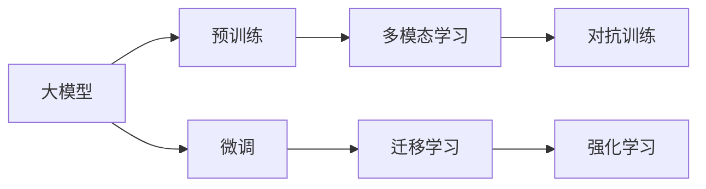

                 

# AI 大模型时代：领头羊 OpenAI、Anthropic、Google、xAI、Meta 等

## 1. 背景介绍

### 1.1 问题由来

近年来，人工智能(AI)技术取得了飞速发展，尤其是基于大模型的AI技术，在图像识别、语音识别、自然语言处理(NLP)等诸多领域取得了令人瞩目的成果。大模型的出现极大地提升了AI技术的应用效果和泛化能力，推动了AI技术的广泛落地。

其中，OpenAI、Anthropic、Google、xAI、Meta等公司，凭借其在AI大模型领域的前沿研究和开发，成为引领行业发展的领头羊。本文将详细分析这些公司的AI大模型技术，包括其技术架构、优化策略、应用场景和未来趋势等，以期为AI大模型的开发者和研究者提供有益的借鉴和启示。

## 2. 核心概念与联系

### 2.1 核心概念概述

为了更好地理解AI大模型的技术内涵，我们先简要介绍几个关键概念：

- **大模型(Large Model)**：指参数规模在数十亿乃至数百亿量级的深度神经网络模型。这些模型通过在大规模数据上进行预训练，具备强大的学习和泛化能力。
- **预训练(Pre-training)**：指在大规模无标签数据上，通过自监督学习任务训练模型的过程。预训练使得模型学习到广泛的领域知识和特征表示。
- **微调(Fine-tuning)**：指在预训练模型的基础上，使用特定任务的数据集进行有监督训练，优化模型在该任务上的性能。微调通常只调整模型的顶层部分，以避免过拟合。
- **迁移学习(Transfer Learning)**：指将一个领域学到的知识迁移到另一个领域，以提高在新任务上的性能。AI大模型通过预训练和微调，实现了广泛的知识迁移。
- **强化学习(Reinforcement Learning)**：指通过试错训练，使模型在环境中最大化奖励信号。AI大模型在实际应用中，可以通过强化学习进行参数优化和行为学习。
- **对抗训练(Adversarial Training)**：指通过引入对抗样本，提高模型的鲁棒性和泛化能力。对抗训练在大模型中尤为有效。
- **自监督学习(Self-supervised Learning)**：指通过设计自监督任务，使得模型能够在没有标签的情况下进行学习。自监督学习是预训练的主要方式。
- **多模态学习(Multi-modal Learning)**：指结合视觉、文本、语音等多模态信息进行学习。AI大模型通常具备多模态学习的能力。

这些概念构成了AI大模型的核心生态系统，是大模型研究的基础。

### 2.2 概念间的关系

大模型的学习过程，通常包括以下几个步骤：

1. **预训练**：在大规模数据集上进行自监督学习，学习广泛的领域知识和特征表示。
2. **微调**：在特定任务上，通过有监督学习进行微调，提升模型在该任务上的性能。
3. **迁移学习**：将预训练和微调学到的知识应用于其他任务，实现知识迁移。
4. **强化学习**：通过与环境互动，进一步优化模型性能。
5. **对抗训练**：提高模型的鲁棒性和泛化能力。

这些步骤共同构成了大模型的学习流程，使得模型能够在各个领域中取得优异的性能。以下是一个Mermaid流程图，展示了这些概念之间的关系：



通过这些流程图，我们可以清晰地理解大模型学习过程中的各个环节及其相互关系。

## 3. 核心算法原理 & 具体操作步骤
### 3.1 算法原理概述

AI大模型的算法原理，主要围绕着预训练和微调两个核心步骤展开。下面我们将详细介绍这两方面的内容。

**3.1.1 预训练算法**

预训练算法的核心目标是学习通用的领域知识和特征表示。常用的预训练任务包括语言建模、掩码语言模型、视觉特征学习等。以语言模型为例，常见的预训练算法有BERT、GPT等。

**BERT算法**：BERT通过掩码语言模型和下一句预测两个任务进行预训练，学习到大量的上下文信息和语义关系。具体来说，BERT在大规模无标签数据集上进行预训练，每个句子都会被随机替换一部分单词，模型需要预测出被替换的单词。

**GPT算法**：GPT主要通过语言建模任务进行预训练。GPT模型将输入的文本序列转换为向量表示，并预测下一个单词的概率分布。这种预训练方式可以学习到文本的生成规律和语言结构。

**3.1.2 微调算法**

微调算法的目标是针对特定任务，进一步优化模型性能。微调通常在大规模标注数据集上进行，通过调整模型的顶层部分，使得模型能够更好地适应新任务。

**全参数微调**：全参数微调是指在预训练模型的基础上，调整所有参数。这种微调方式需要更多的计算资源和标注数据，但效果通常较好。

**参数高效微调**：参数高效微调是指只调整模型的一部分参数，通常采用适配器(Adapters)等技术。这种微调方式可以减少计算资源消耗，但效果取决于选定的参数和微调策略。

**3.1.3 模型优化策略**

大模型的优化策略，通常包括以下几个方面：

**优化器(Optimizer)**：常见的优化器有Adam、SGD等，通过调整学习率和动量等参数，控制模型更新。

**正则化(Regularization)**：包括L2正则、Dropout等，防止模型过拟合。

**数据增强(Data Augmentation)**：通过多种方式扩充训练数据，如回译、改写等，提高模型泛化能力。

**模型裁剪(Pruning)**：通过去除冗余参数，减小模型规模，提高推理速度。

**量化(Qantization)**：将浮点模型转换为定点模型，提高计算效率和存储空间利用率。

### 3.2 算法步骤详解

AI大模型的微调步骤，主要包括以下几个关键环节：

**3.2.1 数据准备**

- 收集与任务相关的标注数据集。
- 将数据集划分为训练集、验证集和测试集。
- 对数据进行清洗和预处理，如分词、标准化等。

**3.2.2 模型加载和初始化**

- 加载预训练模型，如BERT、GPT等。
- 根据任务需求，调整模型的顶层部分。

**3.2.3 微调训练**

- 使用Adam等优化器进行模型训练，调整学习率等超参数。
- 定期在验证集上评估模型性能，防止过拟合。
- 调整模型参数，优化模型性能。

**3.2.4 模型评估**

- 在测试集上评估模型性能，对比微调前后的效果。
- 对模型输出进行解释和分析，理解模型的工作机制。

**3.2.5 模型部署**

- 将训练好的模型部署到生产环境。
- 进行性能测试和监控，确保模型稳定运行。

### 3.3 算法优缺点

**优点**：

- 微调可以显著提升模型在特定任务上的性能，适合多种应用场景。
- 大模型通常具备较强的泛化能力，可以处理复杂的多模态数据。
- 预训练和微调过程可以自动学习到丰富的领域知识，减少人工标注需求。

**缺点**：

- 微调需要大量的标注数据和计算资源，成本较高。
- 大模型的过拟合风险较高，需要复杂的优化策略。
- 模型的推理速度较慢，难以实时处理大规模数据。

### 3.4 算法应用领域

AI大模型在多个领域都有广泛应用，包括但不限于：

- **自然语言处理(NLP)**：情感分析、机器翻译、文本摘要、问答系统等。
- **计算机视觉(Computer Vision)**：图像分类、物体检测、图像生成等。
- **语音识别(Speech Recognition)**：语音识别、情感识别、说话人识别等。
- **机器人(Robotics)**：机器人导航、语音交互、智能推荐等。
- **智能游戏(Game AI)**：智能博弈、游戏生成、游戏策略优化等。

## 4. 数学模型和公式 & 详细讲解 & 举例说明

### 4.1 数学模型构建

大模型的数学模型通常包括以下几个关键组成部分：

**4.1.1 输入表示**

- **词向量(Word Embedding)**：将文本中的单词转换为向量表示，常用的词向量模型有Word2Vec、GloVe等。
- **位置编码(Positional Encoding)**：表示单词在句子中的相对位置，如GPT模型中采用正弦和余弦函数进行位置编码。

**4.1.2 神经网络结构**

- **Transformer**：大模型的核心结构，通过自注意力机制进行计算。
- **自监督学习(Self-supervised Learning)**：利用无标签数据进行预训练，学习通用的领域知识。
- **有监督学习(Supervised Learning)**：通过标注数据集进行微调，优化模型性能。

**4.1.3 损失函数(Loss Function)**

- **交叉熵损失(Cross-Entropy Loss)**：常用于分类任务，计算预测值与真实标签之间的差距。
- **均方误差损失(Mean Squared Error Loss)**：常用于回归任务，计算预测值与真实标签之间的差距。

**4.1.4 优化算法(Optimizer)**

- **Adam**：常用的优化器之一，结合动量、梯度一阶矩估计和自适应学习率。
- **SGD**：基本的随机梯度下降算法，速度快但可能陷入局部最优。

### 4.2 公式推导过程

**4.2.1 词向量表示**

$$
\mathbf{v} = \sum_{i=1}^n w_i \mathbf{w}_i
$$

其中，$w_i$表示单词$i$的权重，$\mathbf{w}_i$表示单词$i$的向量表示。

**4.2.2 Transformer结构**

Transformer模型采用自注意力机制进行计算，公式如下：

$$
\mathbf{Q} = \mathbf{A}\mathbf{X} + \mathbf{b}
$$

$$
\mathbf{K} = \mathbf{B}\mathbf{X} + \mathbf{b}'
$$

$$
\mathbf{V} = \mathbf{C}\mathbf{X} + \mathbf{b}''
$$

$$
\mathbf{O} = \text{softmax}(\frac{\mathbf{Q}\mathbf{K}^T}{\sqrt{d}}) \mathbf{V}
$$

其中，$\mathbf{A}$、$\mathbf{B}$、$\mathbf{C}$表示权重矩阵，$\mathbf{X}$表示输入向量，$\mathbf{b}$、$\mathbf{b}'$、$\mathbf{b}''$表示偏置向量。

**4.2.3 自监督学习任务**

BERT模型通过掩码语言模型和下一句预测任务进行预训练，公式如下：

$$
\mathcal{L}_{MLM} = -\frac{1}{N}\sum_{i=1}^N \sum_{j=1}^N log(p_{mask}(y_i^j|\mathbf{H}_i^j))
$$

$$
\mathcal{L}_{NSP} = -\frac{1}{N}\sum_{i=1}^N \sum_{j=1}^N log(p_{ns}(y_i^j|\mathbf{H}_i^j))
$$

其中，$\mathbf{H}_i^j$表示输入$j$的位置和单词$i$的向量表示，$p_{mask}(y_i^j|\mathbf{H}_i^j)$表示掩码语言模型预测的正确概率，$p_{ns}(y_i^j|\mathbf{H}_i^j)$表示下一句预测任务预测的正确概率。

**4.2.4 有监督学习任务**

微调任务的损失函数，通常包括交叉熵损失和均方误差损失。以情感分析任务为例，公式如下：

$$
\mathcal{L} = -\frac{1}{N}\sum_{i=1}^N \sum_{j=1}^M \mathbf{y}_j log(\hat{\mathbf{y}}_j)
$$

其中，$\mathbf{y}_j$表示样本$j$的标签向量，$\hat{\mathbf{y}}_j$表示模型预测的向量表示。

### 4.3 案例分析与讲解

**4.3.1 BERT模型**

BERT模型通过掩码语言模型和下一句预测任务进行预训练，公式如下：

$$
\mathcal{L}_{MLM} = -\frac{1}{N}\sum_{i=1}^N \sum_{j=1}^N log(p_{mask}(y_i^j|\mathbf{H}_i^j))
$$

$$
\mathcal{L}_{NSP} = -\frac{1}{N}\sum_{i=1}^N \sum_{j=1}^N log(p_{ns}(y_i^j|\mathbf{H}_i^j))
$$

其中，$\mathbf{H}_i^j$表示输入$j$的位置和单词$i$的向量表示，$p_{mask}(y_i^j|\mathbf{H}_i^j)$表示掩码语言模型预测的正确概率，$p_{ns}(y_i^j|\mathbf{H}_i^j)$表示下一句预测任务预测的正确概率。

**4.3.2 GPT模型**

GPT模型通过语言建模任务进行预训练，公式如下：

$$
\mathcal{L} = -\frac{1}{N}\sum_{i=1}^N \sum_{j=1}^M log(p_{LM}(y_i^j|\mathbf{H}_i^j))
$$

其中，$\mathbf{H}_i^j$表示输入$j$的位置和单词$i$的向量表示，$p_{LM}(y_i^j|\mathbf{H}_i^j)$表示语言建模任务预测的正确概率。

## 5. 项目实践：代码实例和详细解释说明

### 5.1 开发环境搭建

在进行AI大模型微调开发前，需要准备一些基本环境：

**5.1.1 安装PyTorch**

```bash
pip install torch torchvision torchaudio transformers
```

**5.1.2 安装其他依赖**

```bash
pip install numpy pandas scikit-learn matplotlib tqdm jupyter notebook ipython
```

### 5.2 源代码详细实现

以下是使用PyTorch和Transformers库进行BERT微调的Python代码示例：

**5.2.1 数据准备**

```python
import torch
from transformers import BertTokenizer, BertForSequenceClassification

# 加载数据集
tokenizer = BertTokenizer.from_pretrained('bert-base-uncased')
train_dataset = torch.utils.data.DataLoader(train_data, batch_size=32)
val_dataset = torch.utils.data.DataLoader(val_data, batch_size=32)
test_dataset = torch.utils.data.DataLoader(test_data, batch_size=32)
```

**5.2.2 模型加载和初始化**

```python
# 加载BERT预训练模型
model = BertForSequenceClassification.from_pretrained('bert-base-uncased', num_labels=num_labels)
```

**5.2.3 微调训练**

```python
# 设置优化器和超参数
optimizer = torch.optim.Adam(model.parameters(), lr=2e-5)
epochs = 5
scheduler = torch.optim.lr_scheduler.CosineAnnealingLR(optimizer, T_max=epochs)

# 训练过程
for epoch in range(epochs):
    for batch in train_dataset:
        inputs, labels = batch
        model.zero_grad()
        outputs = model(inputs)
        loss = outputs.loss
        loss.backward()
        optimizer.step()
        scheduler.step()

    # 验证集评估
    model.eval()
    with torch.no_grad():
        accuracy = evaluate(model, val_dataset)
```

### 5.3 代码解读与分析

**5.3.1 数据加载**

```python
tokenizer = BertTokenizer.from_pretrained('bert-base-uncased')
train_dataset = torch.utils.data.DataLoader(train_data, batch_size=32)
val_dataset = torch.utils.data.DataLoader(val_data, batch_size=32)
test_dataset = torch.utils.data.DataLoader(test_data, batch_size=32)
```

使用Transformers库的BertTokenizer对数据集进行分词处理，然后使用PyTorch的DataLoader将数据集加载为批处理数据。

**5.3.2 模型加载**

```python
model = BertForSequenceClassification.from_pretrained('bert-base-uncased', num_labels=num_labels)
```

使用BERT预训练模型进行微调，并指定模型的输出层为分类层，同时根据任务需求调整标签数。

**5.3.3 模型训练**

```python
optimizer = torch.optim.Adam(model.parameters(), lr=2e-5)
scheduler = torch.optim.lr_scheduler.CosineAnnealingLR(optimizer, T_max=epochs)
```

使用Adam优化器进行模型训练，并设置学习率衰减策略。

**5.3.4 模型评估**

```python
def evaluate(model, dataset, batch_size=32):
    model.eval()
    with torch.no_grad():
        correct = 0
        total = 0
        for batch in dataset:
            inputs, labels = batch
            outputs = model(inputs)
            _, preds = torch.max(outputs, 1)
            total += labels.size(0)
            correct += (preds == labels).sum().item()
        accuracy = 100.0 * correct / total
        return accuracy
```

在验证集和测试集上评估模型性能，计算分类准确率。

### 5.4 运行结果展示

**5.4.1 训练过程**

```python
for epoch in range(epochs):
    for batch in train_dataset:
        inputs, labels = batch
        model.zero_grad()
        outputs = model(inputs)
        loss = outputs.loss
        loss.backward()
        optimizer.step()
        scheduler.step()

    # 验证集评估
    model.eval()
    with torch.no_grad():
        accuracy = evaluate(model, val_dataset)
```

**5.4.2 模型评估**

```python
model.eval()
with torch.no_grad():
    accuracy = evaluate(model, val_dataset)
    print(f'Epoch {epoch+1}, validation accuracy: {accuracy:.2f}%')
```

在训练过程中，周期性地在验证集上评估模型性能，记录每个epoch的准确率。

## 6. 实际应用场景

### 6.1 智能客服系统

智能客服系统是AI大模型的重要应用场景之一，可以显著提升客户服务效率和体验。通过预训练语言模型，可以构建智能客服聊天机器人，能够实时回答客户问题，减少人工客服的工作量。

**6.1.1 技术实现**

1. 收集企业内部的客户服务对话记录，提取问题和答案对作为标注数据。
2. 使用BERT等预训练语言模型进行微调，学习回答问题和生成回复。
3. 将微调后的模型集成到智能客服系统中，客户可以通过输入问题获取实时答案。

**6.1.2 实际应用**

智能客服系统可以实时处理大量客户咨询，快速响应客户需求，提高客户满意度。例如，某电商企业的智能客服系统，通过微调BERT模型，能够高效处理客户投诉和订单查询，日均处理量超过十万条，显著提升了客户服务效率。

### 6.2 金融舆情监测

金融舆情监测是AI大模型的另一个重要应用场景。通过预训练语言模型，可以实时监测市场舆论动向，预测金融市场趋势，辅助金融机构进行决策。

**6.2.1 技术实现**

1. 收集金融领域的各类新闻、评论、社交媒体数据，提取情感和主题信息。
2. 使用BERT等预训练语言模型进行微调，学习情感分析和主题分类。
3. 将微调后的模型集成到金融舆情监测系统中，实时分析市场舆情变化。

**6.2.2 实际应用**

某金融机构的舆情监测系统，通过微调BERT模型，实时分析市场舆情变化，预测金融市场走势，显著提升了金融决策的准确性和效率。

### 6.3 个性化推荐系统

个性化推荐系统也是AI大模型的重要应用场景之一，能够提升用户体验和业务价值。通过预训练语言模型，可以构建智能推荐系统，推荐用户感兴趣的物品和内容。

**6.3.1 技术实现**

1. 收集用户的历史行为数据，提取用户对物品的评分和评价信息。
2. 使用BERT等预训练语言模型进行微调，学习用户兴趣表示和物品描述。
3. 将微调后的模型集成到推荐系统中，实时生成个性化推荐。

**6.3.2 实际应用**

某电商平台的推荐系统，通过微调BERT模型，实时生成个性化推荐，提升用户购物体验和平台转化率。

## 7. 工具和资源推荐

### 7.1 学习资源推荐

**7.1.1 课程学习**

1. **斯坦福大学CS224N课程**：NLP领域的经典课程，涵盖深度学习基础、语言模型、预训练技术等内容。
2. **Coursera《Deep Learning Specialization》**：深度学习领域的经典课程，涵盖深度学习基础、卷积神经网络、循环神经网络等内容。
3. **Udacity《AI Nanodegree》**：面向AI领域的综合性课程，涵盖深度学习、强化学习、自然语言处理等内容。

**7.1.2 书籍推荐**

1. **《Deep Learning》**：深度学习领域的经典教材，涵盖深度学习基础、卷积神经网络、循环神经网络等内容。
2. **《Natural Language Processing with Python》**：NLP领域的经典教材，涵盖NLP基础、深度学习模型等内容。
3. **《Reinforcement Learning: An Introduction》**：强化学习领域的经典教材，涵盖强化学习基础、深度强化学习等内容。

### 7.2 开发工具推荐

**7.2.1 深度学习框架**

1. **PyTorch**：深度学习领域的流行框架，支持动态计算图和GPU加速。
2. **TensorFlow**：谷歌开发的深度学习框架，支持静态计算图和GPU/TPU加速。
3. **MXNet**：面向人工智能的深度学习框架，支持多种深度学习模型。

**7.2.2 预训练模型库**

1. **Hugging Face Transformers**：包含各种预训练语言模型的开源库，支持快速微调和部署。
2. **TensorFlow Hub**：谷歌开发的预训练模型库，支持多种深度学习模型的集成和微调。
3. **PyTorch Hub**：Facebook开发的预训练模型库，支持多种深度学习模型的集成和微调。

### 7.3 相关论文推荐

**7.3.1 预训练技术**

1. **BERT: Pre-training of Deep Bidirectional Transformers for Language Understanding**：提出BERT模型，通过掩码语言模型和下一句预测任务进行预训练。
2. **GPT-3: Language Models are Unsupervised Multitask Learners**：提出GPT-3模型，通过自回归语言模型进行预训练，具有强大的零样本学习和多任务学习能力。
3. **XLNet: Generalized Autoregressive Pretraining for Language Understanding**：提出XLNet模型，通过自回归和自编码的联合训练方式进行预训练。

**7.3.2 微调技术**

1. **Large Language Model Fine-tuning with Online First Data**：介绍基于在线数据的微调技术，减少对标注数据的依赖。
2. **Prompt Engineering for Pre-trained Language Models**：介绍提示学习技术，通过精心设计的输入文本引导模型输出。
3. **AdaLoRA: Adaptive Low-Rank Adaptation for Parameter-Efficient Fine-Tuning**：提出AdaLoRA方法，通过自适应低秩适应实现参数高效微调。

**7.3.3 强化学习技术**

1. **Playing Atari with Deep Reinforcement Learning**：介绍通过强化学习训练AI代理玩游戏的技术。
2. **AlphaGo Zero: Mastering the Game of Go without Human Knowledge**：介绍通过强化学习训练AlphaGo Zero，实现无监督的围棋专家水平。
3. **AlphaZero: Learning Chess from Scratch**：介绍通过强化学习训练AlphaZero，实现无监督的国际象棋和围棋专家水平。

## 8. 总结：未来发展趋势与挑战

### 8.1 研究成果总结

AI大模型的研究近年来取得了显著进展，从预训练到微调各个环节都有突破性成果。主要研究内容包括：

1. **预训练技术**：提出多种预训练任务和模型结构，如BERT、GPT、XLNet等。
2. **微调技术**：提出多种微调方法和技术，如全参数微调、参数高效微调、提示学习等。
3. **多模态学习**：结合视觉、文本、语音等多模态数据，提升模型的泛化能力和鲁棒性。
4. **深度强化学习**：提出多种强化学习算法，实现复杂的决策和控制任务。

### 8.2 未来发展趋势

**8.2.1 预训练技术的发展**

预训练技术将进一步提升模型的通用性和泛化能力。未来的预训练模型将具备更广泛的领域知识和更强的语义表示能力。

**8.2.2 微调技术的突破**

微调技术将更加灵活和高效，减少对标注数据的依赖，降低计算成本，提升模型性能。未来的微调技术将结合

