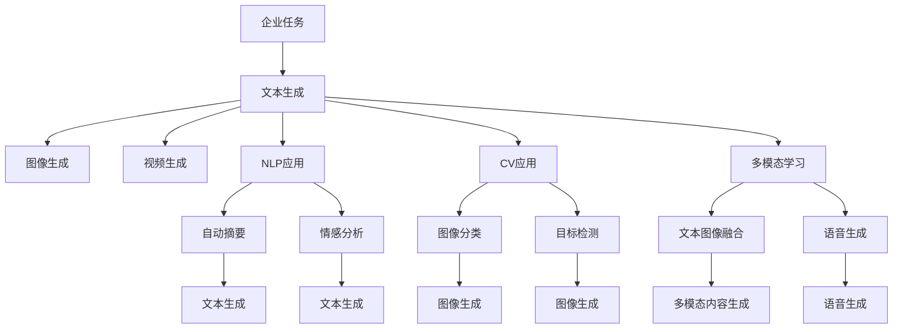

                 

# AIGC与企业任务的演变

### 1. 背景介绍

人工智能生成内容（AIGC，Artificial Intelligence Generated Content），即人工智能生成的文本、图片、视频等内容，正在深刻改变各行各业的生产、运营和管理方式。AIGC技术从内容生成、自动化设计、语音合成到数据分析，涵盖多领域的应用，成为企业智能化转型的重要推动力。本文章将探讨AIGC在企业任务中的应用，分析其在商业实践中的演变过程，展望未来发展趋势。

### 2. 核心概念与联系

#### 2.1 核心概念概述

- **AIGC**：人工智能生成内容，包括文本生成、图像生成、视频生成等。通过深度学习等技术，AIGC能够在各种场景下自动生成高质量内容。
- **深度学习**：一种基于神经网络的机器学习方法，通过多层非线性变换实现对复杂数据的建模与预测。
- **生成对抗网络（GAN）**：由生成器和判别器组成的网络结构，生成器负责生成样本，判别器负责区分真伪，通过不断对抗训练，生成器能够生成逼真的样本。
- **Transformer**：一种基于注意力机制的神经网络结构，广泛应用于自然语言处理、图像处理等领域。
- **自然语言处理（NLP）**：涉及计算机处理人类语言的任务，如文本生成、文本分类、机器翻译等。
- **计算机视觉（CV）**：涉及计算机处理图像和视频的任务，如图像生成、图像分类、目标检测等。
- **多模态学习**：结合文本、图像、视频等多种数据类型，进行协同学习，提升内容的丰富性和准确性。

#### 2.2 概念间的关系

AIGC技术的应用主要涉及以下几个核心概念：

1. **深度学习**：AIGC技术的核心。通过多层神经网络对数据进行建模，实现复杂内容的自动生成。
2. **生成对抗网络（GAN）**：AIGC中的图像生成技术。生成器生成假样本，判别器区分真伪，不断对抗训练提升生成质量。
3. **Transformer**：AIGC中的文本生成技术。通过注意力机制实现高效的信息处理，生成连贯自然的文本。
4. **自然语言处理（NLP）**：AIGC中重要的应用领域。通过模型训练，生成符合人类语言习惯的文本。
5. **计算机视觉（CV）**：AIGC中重要的应用领域。通过模型训练，生成逼真的图像和视频。
6. **多模态学习**：AIGC中的重要技术。结合不同数据类型，提升内容的综合表现。

这些概念通过不断的技术创新和应用拓展，形成了AIGC技术在企业任务中的广泛应用。

#### 2.3 核心概念的整体架构

以下是一个综合的流程图，展示了AIGC技术在企业任务中的应用场景：



这个流程图展示了AIGC技术在企业任务中的多种应用场景。通过深度学习、GAN、Transformer等技术，企业可以生成文本、图像、视频、语音等多模态内容，并结合NLP和CV等应用，实现高效的信息处理和任务自动化。

### 3. 核心算法原理 & 具体操作步骤

#### 3.1 算法原理概述

AIGC技术的核心算法包括深度学习、GAN、Transformer等，其中深度学习用于内容生成，GAN用于图像生成，Transformer用于文本生成。这些算法通过优化模型参数，最大化生成内容的真实性和多样性。

以文本生成为例，深度学习算法通过优化模型参数，使得生成的文本能够符合语言习惯，具有连贯性和可理解性。Transformer算法通过自注意力机制，实现高效的信息处理，生成连贯自然的文本。GAN算法通过对抗训练，生成高质量的图像和视频。

#### 3.2 算法步骤详解

AIGC技术的主要步骤如下：

1. **数据准备**：收集并预处理生成任务所需的数据，包括文本、图像、语音等。
2. **模型训练**：选择合适的深度学习模型，并使用训练数据对模型进行训练，调整模型参数。
3. **内容生成**：使用训练好的模型生成新的内容，如文本、图像、视频等。
4. **后处理**：对生成的内容进行后处理，如格式化、降噪、增强等，提升内容的实用性和表现力。

#### 3.3 算法优缺点

AIGC技术的优点包括：

1. **高效性**：通过自动化生成内容，减少了人工处理的时间和工作量。
2. **多样性**：能够生成多种类型的的内容，适应不同的应用场景。
3. **灵活性**：可以根据需求调整模型参数，生成高质量的内容。

缺点包括：

1. **数据依赖**：生成内容的质量依赖于训练数据的数量和质量。
2. **模型复杂性**：深度学习模型和GAN模型结构复杂，需要大量的计算资源。
3. **可解释性不足**：AIGC技术生成的内容缺乏人类可理解的解释和逻辑。

#### 3.4 算法应用领域

AIGC技术在多个领域中得到了广泛应用：

1. **内容生成**：用于文本生成、图像生成、视频生成等，如自动写作、自动绘图、自动配音等。
2. **自动化设计**：用于设计自动化、工程自动化等，如CAD设计、电路板设计、机器人路径规划等。
3. **数据分析**：用于数据可视化、情感分析、市场分析等，如数据报告生成、市场趋势预测、用户情感分析等。
4. **个性化推荐**：用于个性化推荐、智能客服等，如个性化广告推荐、智能客服问答等。
5. **智能制造**：用于智能制造、智能物流等，如设备维护预测、供应链管理等。

### 4. 数学模型和公式 & 详细讲解 & 举例说明

#### 4.1 数学模型构建

AIGC技术的数学模型主要涉及深度学习、GAN、Transformer等算法。以文本生成为例，数学模型构建如下：

1. **深度学习模型**：
   - 输入：文本序列 $x=\{x_1, x_2, ..., x_n\}$，其中 $x_i$ 为第 $i$ 个词。
   - 输出：生成的文本序列 $y=\{y_1, y_2, ..., y_m\}$，其中 $y_i$ 为第 $i$ 个词。
   - 目标：最大化生成的文本序列与目标文本序列 $y$ 的相似度。

2. **Transformer模型**：
   - 输入：文本序列 $x$，其中 $x_i$ 为第 $i$ 个词。
   - 输出：生成的文本序列 $y$，其中 $y_i$ 为第 $i$ 个词。
   - 目标：最大化生成的文本序列与目标文本序列 $y$ 的相似度。

#### 4.2 公式推导过程

以Transformer模型为例，其数学公式推导如下：

1. **自注意力机制**：
   - 输入：文本序列 $x$，其中 $x_i$ 为第 $i$ 个词。
   - 输出：生成的文本序列 $y$，其中 $y_i$ 为第 $i$ 个词。
   - 目标：最大化生成的文本序列与目标文本序列 $y$ 的相似度。

   自注意力机制的公式如下：
   $$
   A = \frac{QK^T}{\sqrt{d_k}}
   $$
   其中 $Q$、$K$、$V$ 分别为查询矩阵、键矩阵、值矩阵，$d_k$ 为键的维度。

2. **多头注意力**：
   - 输入：文本序列 $x$，其中 $x_i$ 为第 $i$ 个词。
   - 输出：生成的文本序列 $y$，其中 $y_i$ 为第 $i$ 个词。
   - 目标：最大化生成的文本序列与目标文本序列 $y$ 的相似度。

   多头注意力的公式如下：
   $$
   A = \frac{QK^T}{\sqrt{d_k}}
   $$
   其中 $Q$、$K$、$V$ 分别为查询矩阵、键矩阵、值矩阵，$d_k$ 为键的维度。

#### 4.3 案例分析与讲解

以文本生成为例，通过优化Transformer模型参数，生成高质量的文本内容。具体步骤如下：

1. **数据准备**：收集并预处理生成任务所需的数据，包括文本、图像、语音等。
2. **模型训练**：选择合适的Transformer模型，并使用训练数据对模型进行训练，调整模型参数。
3. **内容生成**：使用训练好的模型生成新的文本内容。
4. **后处理**：对生成的文本内容进行后处理，如格式化、降噪、增强等，提升内容的实用性和表现力。

### 5. 项目实践：代码实例和详细解释说明

#### 5.1 开发环境搭建

在开发AIGC项目时，需要搭建好相应的开发环境。以下是Python开发环境配置的流程：

1. **安装Python**：从官网下载并安装Python，建议选择最新稳定版本。
2. **安装pip**：Windows系统在Python安装目录中找到pip.exe，Linux系统在终端中执行 `sudo apt-get install python-pip`。
3. **安装相关库**：使用pip安装深度学习、GAN、Transformer等库，如TensorFlow、PyTorch、Keras等。

```bash
pip install tensorflow==2.6.0
pip install torch==1.13.0
pip install keras==2.9.0
```

#### 5.2 源代码详细实现

以下是使用TensorFlow和Keras进行文本生成的Python代码实现：

```python
import tensorflow as tf
from tensorflow.keras import layers, models

# 定义模型结构
model = models.Sequential([
    layers.Embedding(input_dim=vocab_size, output_dim=embedding_dim, input_length=max_length),
    layers.Bidirectional(layers.LSTM(units=hidden_units, return_sequences=True)),
    layers.Bidirectional(layers.LSTM(units=hidden_units)),
    layers.Dense(units=vocab_size, activation='softmax')
])

# 编译模型
model.compile(optimizer='adam', loss='sparse_categorical_crossentropy', metrics=['accuracy'])

# 训练模型
model.fit(x_train, y_train, epochs=num_epochs, batch_size=batch_size, validation_data=(x_val, y_val))

# 生成文本
generated_text = []
for _ in range(num_words):
    x0 = tf.keras.preprocessing.text.text_to_word_sequence(x)
    x = tf.keras.preprocessing.text.text_to_word_sequence(x + "<eos>")
    for i in range(max_length):
        predictions = model.predict(tf.expand_dims(x, 0))
        predicted_index = np.argmax(predictions)
        x.append(word_index[predicted_index])
        generated_text.append(word_to_index[predicted_index])
```

#### 5.3 代码解读与分析

在代码实现中，我们使用了TensorFlow和Keras库来构建和训练文本生成模型。具体步骤如下：

1. **模型定义**：定义Transformer模型结构，包括嵌入层、双向LSTM层和全连接层。
2. **模型编译**：使用Adam优化器，交叉熵损失函数，准确率作为评估指标。
3. **模型训练**：使用训练数据集进行模型训练，调整模型参数。
4. **文本生成**：使用训练好的模型生成文本内容。

### 6. 实际应用场景

#### 6.1 内容生成

AIGC技术在内容生成领域有着广泛应用。例如，自动生成新闻报道、文章摘要、用户评论等。通过深度学习模型，AIGC可以自动生成符合语法规范、主题相关的文本内容。

#### 6.2 自动化设计

在自动化设计领域，AIGC技术可以用于生成CAD设计图、电路板设计图等。通过GAN模型，AIGC可以生成高质量、逼真的图像内容，辅助设计师进行设计。

#### 6.3 数据分析

在数据分析领域，AIGC技术可以用于生成数据报告、市场趋势预测等。通过自然语言处理技术，AIGC可以自动生成文本内容，提升数据分析的效率和准确性。

#### 6.4 个性化推荐

在个性化推荐领域，AIGC技术可以用于生成个性化广告、推荐内容等。通过深度学习模型，AIGC可以自动生成符合用户兴趣的文本内容，提升推荐效果。

#### 6.5 智能制造

在智能制造领域，AIGC技术可以用于生成设备维护预测、供应链管理等。通过计算机视觉技术，AIGC可以自动生成设备状态分析报告，辅助生产管理。

### 7. 工具和资源推荐

#### 7.1 学习资源推荐

以下是推荐的AIGC技术学习资源：

1. **《深度学习》**：Ian Goodfellow等著，介绍了深度学习的基本概念和应用。
2. **《Generative Adversarial Networks》**：Ian Goodfellow等著，介绍了GAN的基本概念和应用。
3. **《Transformer模型》**：Andrej Karpathy等著，介绍了Transformer模型的基本概念和应用。
4. **Coursera《深度学习专项课程》**：由斯坦福大学提供的深度学习课程，涵盖深度学习、卷积神经网络、循环神经网络等内容。
5. **Udacity《深度学习与计算机视觉》**：由Udacity提供的深度学习课程，涵盖计算机视觉、图像生成等内容。

#### 7.2 开发工具推荐

以下是推荐的AIGC技术开发工具：

1. **TensorFlow**：由Google提供的深度学习框架，支持多种模型和算法。
2. **PyTorch**：由Facebook提供的深度学习框架，支持动态图和静态图。
3. **Keras**：基于TensorFlow和Theano的深度学习框架，易于使用。
4. **Jupyter Notebook**：开源的交互式计算环境，支持Python、R等语言。
5. **Google Colab**：由Google提供的免费Jupyter Notebook环境，支持GPU计算。

#### 7.3 相关论文推荐

以下是推荐的AIGC技术相关论文：

1. **《Attention is All You Need》**：Andrej Karpathy等著，介绍了Transformer模型的基本概念和应用。
2. **《Generative Adversarial Networks》**：Ian Goodfellow等著，介绍了GAN的基本概念和应用。
3. **《A Review of Generative Adversarial Networks: Applications and Challenges》**：Ian Goodfellow等著，介绍了GAN的应用和挑战。
4. **《Neural Machine Translation by Jointly Learning to Align and Translate》**：Ilya Sutskever等著，介绍了基于Transformer的机器翻译模型。

### 8. 总结：未来发展趋势与挑战

#### 8.1 研究成果总结

AIGC技术在内容生成、自动化设计、数据分析、个性化推荐、智能制造等领域得到了广泛应用，提升了企业的生产效率和创新能力。通过深度学习、GAN、Transformer等算法，AIGC技术能够生成高质量的内容，辅助企业决策。

#### 8.2 未来发展趋势

1. **技术融合**：AIGC技术将与其他AI技术进行融合，如知识图谱、语音识别等，提升内容生成的质量和多样性。
2. **多模态学习**：AIGC技术将结合文本、图像、视频等多种数据类型，提升内容的综合表现。
3. **可解释性**：AIGC技术将提高生成内容的可解释性，便于企业进行决策和分析。
4. **智能化**：AIGC技术将进一步智能化，支持动态生成内容，满足企业实时需求。
5. **普及应用**：AIGC技术将普及到更多行业，提升企业的生产效率和创新能力。

#### 8.3 面临的挑战

AIGC技术在发展过程中面临以下挑战：

1. **数据质量**：生成内容的质量依赖于训练数据的质量，数据噪声和错误会影响生成内容的准确性。
2. **模型复杂性**：深度学习模型和GAN模型结构复杂，需要大量的计算资源。
3. **可解释性不足**：AIGC技术生成的内容缺乏人类可理解的解释和逻辑，难以进行决策和分析。
4. **伦理和法律问题**：AIGC技术生成的内容可能涉及隐私、版权等伦理和法律问题，需要严格规范。

#### 8.4 研究展望

未来，AIGC技术需要从以下几个方面进行研究：

1. **数据增强**：通过数据增强技术，提升训练数据的数量和质量，提高生成内容的准确性。
2. **模型优化**：优化深度学习模型和GAN模型，降低计算资源消耗，提升生成内容的质量。
3. **可解释性提升**：提高生成内容的可解释性，便于企业进行决策和分析。
4. **伦理和法律规范**：制定AIGC技术的伦理和法律规范，保护用户隐私和版权。

通过不断的研究和优化，AIGC技术将更好地服务于企业，提升企业的生产效率和创新能力。

### 9. 附录：常见问题与解答

#### Q1: AIGC技术对企业任务的影响是什么？

A: AIGC技术通过自动化生成内容，提升了企业的生产效率和创新能力。在内容生成、自动化设计、数据分析、个性化推荐、智能制造等领域，AIGC技术都能够提供高质量的内容支持，辅助企业决策。

#### Q2: AIGC技术在实际应用中需要注意哪些问题？

A: 在实际应用中，AIGC技术需要注意数据质量、模型复杂性、可解释性、伦理和法律问题等。数据质量影响生成内容的准确性，模型复杂性需要大量的计算资源，可解释性不足难以进行决策和分析，伦理和法律问题需要严格规范。

#### Q3: AIGC技术在未来发展中可能面临哪些挑战？

A: AIGC技术在未来发展中可能面临数据质量、模型复杂性、可解释性、伦理和法律问题等挑战。数据质量影响生成内容的准确性，模型复杂性需要大量的计算资源，可解释性不足难以进行决策和分析，伦理和法律问题需要严格规范。

#### Q4: AIGC技术在企业任务中的应用前景如何？

A: AIGC技术在企业任务中的应用前景广阔，能够提升企业的生产效率和创新能力。通过深度学习、GAN、Transformer等算法，AIGC技术可以生成高质量的内容，辅助企业决策。未来，AIGC技术将与其他AI技术进行融合，提升内容的综合表现，满足企业实时需求。

---

作者：禅与计算机程序设计艺术 / Zen and the Art of Computer Programming

