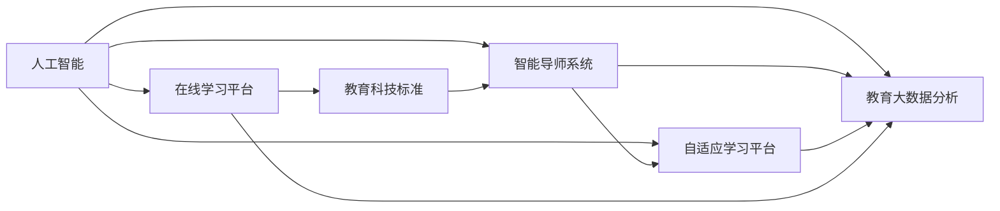

                 

# AI与人类计算：打造可持续的教育系统

> 关键词：AI教育,智能导师,自适应学习,数据驱动,个性化教学,教育大数据,在线学习平台,教育科技

## 1. 背景介绍

### 1.1 问题由来
进入21世纪以来，信息技术的迅猛发展对全球教育体系产生了深远的影响。一方面，互联网和移动互联网的应用使得教育资源的获取更加便捷，为更多人提供了学习的机会。另一方面，传统教育模式中教师与学生之间的互动减少，缺乏个性化辅导和及时反馈的问题日益凸显。教育资源的分配不均、教师工作负担过重、学生学习效果不理想等困扰不断涌现，亟需新的解决方案。

人工智能（AI）技术的兴起为解决上述问题提供了新的思路。通过AI与人类计算的结合，可以构建一个更加智能、高效、可持续的教育系统，为学生提供个性化、动态适应的学习体验，使教师从繁琐的日常教学工作中解放出来，进而提升整体教育质量。

### 1.2 问题核心关键点
构建可持续的教育系统，核心在于如何让AI与人类计算有机结合。这不仅需要解决教育资源不足、教育质量参差不齐、教育机会不均等难题，还需在技术层面确保系统的可扩展性、鲁棒性和安全可控性。为此，需要以下关键技术支持：

1. **智能导师系统**：利用AI技术模拟人类导师的行为，自动分析学生的学习状态和进度，为学生提供个性化的学习建议。
2. **自适应学习平台**：通过AI算法动态调整学习内容，使学习路径和难度与学生的实际学习状况相匹配。
3. **教育大数据分析**：利用AI进行教育数据挖掘与分析，帮助教育管理部门制定政策，优化资源配置。
4. **在线学习平台**：集成AI功能，为学生提供丰富多样的学习资源和互动机会，提升学习效果。
5. **教育科技标准**：制定AI教育系统的规范和标准，确保技术的可互操作性、数据的安全性及隐私保护。

### 1.3 问题研究意义
AI与人类计算的结合，对于推动教育公平、提升教育质量、优化资源配置具有重要意义：

1. **打破教育资源分配不均**：AI教育系统可突破地理、经济限制，让优质教育资源惠及更多人。
2. **提供个性化学习体验**：根据学生特点定制学习路径和难度，提升学习效率。
3. **减轻教师负担**：自动处理重复性教学任务，使教师专注于高阶教育活动。
4. **优化教育管理**：通过数据驱动决策，提高教育资源配置效率。
5. **激发教育创新**：AI技术的应用可不断拓展教育新场景，带动教育模式变革。

## 2. 核心概念与联系

### 2.1 核心概念概述

为更好地理解AI与人类计算在教育系统中的应用，我们介绍以下几个关键概念：

- **人工智能(AI)**：通过算法、模型和数据处理技术，让机器具备执行类似于人类的智能任务的能力。
- **智能导师系统**：利用AI模拟教师的指导与反馈，提供个性化学习支持，辅助学生自主学习。
- **自适应学习平台**：通过动态调整学习内容，适应学生的知识水平和兴趣，提升学习效果。
- **教育大数据分析**：应用AI对海量教育数据进行挖掘与分析，揭示教育规律，指导教育决策。
- **在线学习平台**：整合AI技术与教育资源，提供多维度、多模态的学习体验。
- **教育科技标准**：定义AI教育系统的技术标准与规范，确保系统互通、数据安全。

这些概念间的关系通过以下Mermaid流程图展示：



该流程图表明：

1. **人工智能**是基础，为教育系统的智能化提供技术支持。
2. **智能导师系统**和**自适应学习平台**通过**人工智能**技术，实现个性化教育。
3. **教育大数据分析**利用**人工智能**对教育数据进行深度挖掘，提供数据驱动的教育决策支持。
4. **在线学习平台**整合**人工智能**技术，为学生提供多元化的学习环境。
5. **教育科技标准**为AI教育系统的开发与应用提供规范与保障。

### 2.2 概念间的关系

通过以上概念的介绍，我们可以进一步探讨它们之间的联系：

#### 2.2.1 AI教育系统的构建

首先，我们需要设计AI教育系统的整体架构：

1. **输入层**：收集学生信息、学习历史和教师反馈等数据。
2. **处理层**：利用AI模型对数据进行处理，生成个性化学习建议和内容推荐。
3. **输出层**：将处理结果反馈给学生、教师和管理人员，进行实时调整。

#### 2.2.2 智能导师系统的实现

智能导师系统主要包含以下组件：

1. **学习行为分析**：通过AI算法分析学生的学习行为，如浏览时长、答题准确率等。
2. **学习进度跟踪**：使用机器学习算法预测学生的学习进度和成绩，帮助教师了解学生的学习状态。
3. **个性化学习建议**：根据学生特点和进度，提供个性化的学习材料和任务。
4. **智能反馈与激励**：利用自然语言处理技术，自动生成个性化反馈和激励信息，提升学习动力。

#### 2.2.3 自适应学习平台的构建

自适应学习平台需要支持以下几个功能：

1. **学习内容生成**：通过AI算法根据学生的知识水平和兴趣生成个性化学习路径。
2. **学习进度调整**：动态调整学习难度和进度，确保学生始终处于最佳学习状态。
3. **学习效果评估**：利用AI分析学习成果，提供学习报告和改进建议。
4. **学习资源推荐**：根据学生需求，推荐适合的在线课程、练习和实验项目。

#### 2.2.4 教育大数据分析的应用

教育大数据分析涉及以下几个步骤：

1. **数据收集**：从在线学习平台、课堂监控系统、作业系统等渠道收集教育数据。
2. **数据清洗与处理**：清洗数据，去除噪音和异常值，确保数据质量。
3. **数据分析**：利用机器学习和深度学习技术，分析数据中的模式和规律。
4. **结果应用**：根据分析结果优化教学策略、评估教育质量、指导教育决策。

## 3. 核心算法原理 & 具体操作步骤

### 3.1 算法原理概述

AI与人类计算在教育系统中的应用，主要基于以下几个算法原理：

1. **机器学习**：通过算法自动分析数据，提取规律并生成预测模型，用于个性化学习路径的生成和智能导师的推荐。
2. **深度学习**：通过多层次的神经网络结构，处理大规模、高维度的数据，用于学习内容的生成和智能反馈。
3. **自然语言处理(NLP)**：利用NLP技术，实现智能反馈、学习行为分析等。
4. **强化学习**：通过与环境的交互，优化智能导师和自适应平台的策略，提升学习效果。
5. **数据挖掘**：通过数据挖掘技术，从大量教育数据中提取有价值的信息，用于教育决策支持。

### 3.2 算法步骤详解

#### 3.2.1 智能导师系统

1. **数据收集**：收集学生的学习行为、成绩、兴趣等数据。
2. **行为分析**：使用机器学习算法分析学生的学习行为，识别学习模式和难点。
3. **进度预测**：利用深度学习模型预测学生的学习进度和成绩。
4. **建议生成**：根据学习进度和行为分析结果，生成个性化学习建议。
5. **反馈生成**：利用NLP技术生成自然语言反馈信息，激励学生学习。

#### 3.2.2 自适应学习平台

1. **内容生成**：根据学生学习进度和兴趣，生成个性化学习路径。
2. **进度调整**：实时调整学习难度和进度，确保学生保持最佳学习状态。
3. **效果评估**：利用AI分析学习成果，生成学习报告和改进建议。
4. **资源推荐**：推荐适合的在线课程和资源，支持学生深入学习。

#### 3.2.3 教育大数据分析

1. **数据收集**：收集教育系统中的各种数据，如学习记录、课堂监控数据等。
2. **数据清洗**：去除噪音和异常值，保证数据质量。
3. **数据挖掘**：利用机器学习和深度学习算法挖掘数据中的模式和规律。
4. **结果应用**：根据分析结果，优化教学策略、评估教育质量、指导教育决策。

### 3.3 算法优缺点

AI与人类计算在教育系统中的应用具有以下优点：

1. **个性化**：通过个性化学习建议和内容推荐，提升学习效率。
2. **动态适应**：自适应学习平台可以根据学生的实际情况，动态调整学习路径和难度。
3. **数据驱动**：利用大数据分析，提供科学的教育决策支持。
4. **减轻负担**：智能导师和自适应平台可以自动化处理重复性任务，减轻教师负担。

同时，也存在以下缺点：

1. **技术复杂**：需要集成多种AI技术，技术实现复杂。
2. **数据隐私**：处理大量教育数据，数据隐私和安全问题需引起重视。
3. **依赖数据质量**：算法的性能高度依赖于数据的质量和完整性。
4. **师生依赖**：过度依赖AI技术可能削弱师生间的互动和情感交流。

### 3.4 算法应用领域

AI与人类计算在教育系统中的应用，涵盖了以下多个领域：

1. **中小学教育**：为学生提供个性化学习建议和资源，提升学习效果。
2. **高等教育**：支持研究性学习，提供科研指导和资源推荐。
3. **职业培训**：根据学员的学习进度和兴趣，提供技能提升建议。
4. **终身学习**：为成年人提供个性化学习路径和资源推荐。
5. **特殊教育**：针对有特殊需求的学生，提供个性化的学习支持。

## 4. 数学模型和公式 & 详细讲解 & 举例说明

### 4.1 数学模型构建

我们以智能导师系统的行为分析模型为例，介绍其数学模型构建过程。

设学生的学习行为数据为 $X$，行为分析的目标是找到最优的模型 $f(X)$，用于预测学生的学习进度和成绩。一般采用监督学习算法，如线性回归、决策树、神经网络等。

设预测结果为 $Y$，则模型的训练目标为最小化预测误差 $E$：

$$
E = \frac{1}{N} \sum_{i=1}^N (Y_i - f(X_i))^2
$$

其中 $N$ 为样本数量。

### 4.2 公式推导过程

我们以线性回归模型为例，推导其预测过程：

设 $X$ 为学生行为数据，$Y$ 为预测结果，则线性回归模型为：

$$
Y = \beta_0 + \beta_1 X_1 + \beta_2 X_2 + \ldots + \beta_k X_k + \epsilon
$$

其中 $\beta_0$ 为截距，$\beta_1, \beta_2, \ldots, \beta_k$ 为各特征的系数，$\epsilon$ 为误差项。

利用最小二乘法求解模型参数 $\beta$：

$$
\beta = (X^T X)^{-1} X^T Y
$$

### 4.3 案例分析与讲解

假设我们要分析学生在某一时间段内的学习行为，预测其考试成绩。我们收集了学生的作业完成情况、课堂参与度、测试成绩等数据。

数据预处理：去除缺失值和异常值，将分类数据转换为数值型数据。

构建模型：采用线性回归模型，将学习行为数据 $X$ 作为输入，预测结果 $Y$ 作为输出。

模型训练：利用训练集数据，最小化预测误差，求解模型参数。

模型评估：在测试集数据上评估模型性能，计算均方误差等指标。

通过不断迭代和优化，我们得到最优的线性回归模型，用于预测学生的学习进度和成绩，并生成个性化的学习建议。

## 5. 项目实践：代码实例和详细解释说明

### 5.1 开发环境搭建

为了开发AI教育系统，我们需要搭建以下开发环境：

1. **操作系统**：推荐使用Linux系统，如Ubuntu或CentOS。
2. **编程语言**：Python和R是常用的数据处理和机器学习语言。
3. **开发工具**：Jupyter Notebook、PyCharm等开发工具。
4. **AI框架**：TensorFlow、PyTorch、Scikit-learn等AI框架。
5. **数据处理工具**：Pandas、NumPy等数据处理工具。

完成以上步骤后，即可开始项目开发。

### 5.2 源代码详细实现

以智能导师系统的行为分析模型为例，展示其代码实现：

```python
import pandas as pd
from sklearn.linear_model import LinearRegression

# 加载学生行为数据
data = pd.read_csv('student_behavior.csv')

# 预处理数据
data = data.dropna()
data = data.drop(['姓名', '学号'], axis=1)

# 划分训练集和测试集
train_data = data.sample(frac=0.8, random_state=0)
test_data = data.drop(train_data.index)

# 训练模型
X_train = train_data.drop('成绩', axis=1)
y_train = train_data['成绩']
X_test = test_data.drop('成绩', axis=1)
y_test = test_data['成绩']

model = LinearRegression()
model.fit(X_train, y_train)

# 预测测试集结果
y_pred = model.predict(X_test)

# 评估模型性能
from sklearn.metrics import mean_squared_error
mse = mean_squared_error(y_test, y_pred)
print('均方误差:', mse)
```

通过以上代码，我们可以构建一个简单的线性回归模型，用于预测学生的学习进度和成绩。

### 5.3 代码解读与分析

代码实现中，我们使用了Pandas进行数据处理，利用Scikit-learn的LinearRegression模型进行线性回归训练和预测。具体步骤如下：

1. **数据预处理**：使用dropna函数去除缺失值，drop函数去除不必要的特征，保证数据质量。
2. **数据划分**：将数据集分为训练集和测试集，使用sample函数随机抽取样本。
3. **模型训练**：使用LinearRegression模型进行训练，fit函数用于拟合数据。
4. **预测与评估**：使用predict函数进行预测，mean_squared_error函数计算均方误差，评估模型性能。

## 6. 实际应用场景

### 6.1 智能导师系统

智能导师系统在教育中的应用非常广泛。以下是几个典型场景：

1. **个性化学习建议**：根据学生的学习行为和成绩，生成个性化的学习路径和资源推荐。
2. **学习进度跟踪**：实时监测学生的学习进度，及时调整学习策略。
3. **智能反馈与激励**：利用NLP技术生成自然语言反馈，激励学生学习。

### 6.2 自适应学习平台

自适应学习平台通过动态调整学习内容，提升学习效果。以下是几个具体应用：

1. **个性化内容推荐**：根据学生的学习进度和兴趣，推荐适合的练习题和学习材料。
2. **实时进度调整**：根据学习效果动态调整学习难度和进度，确保学生始终处于最佳状态。
3. **学习效果评估**：通过AI分析学习成果，生成学习报告和改进建议。

### 6.3 教育大数据分析

教育大数据分析在教育管理中的应用非常广泛。以下是几个典型场景：

1. **学生表现分析**：利用机器学习算法分析学生的表现，发现学习难点和兴趣点。
2. **教师教学评估**：利用AI分析课堂监控数据，评估教师的教学效果。
3. **教育资源优化**：根据分析结果，优化资源配置，提高教育质量。

### 6.4 未来应用展望

AI与人类计算在教育系统中的应用将不断深化，未来发展趋势如下：

1. **更广泛的应用场景**：AI技术将应用于更多教育环节，如招生、评估、招生等。
2. **更精准的个性化学习**：通过更复杂的模型和算法，实现更精准的个性化学习体验。
3. **更高效的数据分析**：利用更先进的数据挖掘技术，实现更高效的教育决策支持。
4. **更智能的教育管理**：通过AI技术，优化教育管理流程，提高管理效率。
5. **更全面的评估体系**：利用AI技术，构建更全面、多维度的评估体系。

## 7. 工具和资源推荐

### 7.1 学习资源推荐

为帮助开发者掌握AI与人类计算在教育系统中的应用，我们推荐以下学习资源：

1. **《深度学习》（Ian Goodfellow）**：详细介绍了深度学习的基础知识和应用场景。
2. **《机器学习》（周志华）**：系统介绍了机器学习算法和应用实例。
3. **Coursera《机器学习》课程**：由斯坦福大学Andrew Ng教授主讲，介绍了机器学习的基本概念和算法。
4. **edX《人工智能基础》课程**：由哈佛大学开设，介绍了AI的基础理论和应用实例。
5. **GitHub AI教育项目**：汇集了大量AI教育系统的开源项目，可供学习和参考。

### 7.2 开发工具推荐

为提升AI教育系统的开发效率，我们推荐以下开发工具：

1. **Jupyter Notebook**：提供交互式编程环境，支持代码编写、数据处理、模型训练等。
2. **PyCharm**：智能编程环境，提供代码调试、版本控制等功能。
3. **TensorBoard**：可视化工具，用于监控模型训练和评估。
4. **Weights & Biases**：实验跟踪工具，记录和可视化模型训练过程。
5. **Docker**：容器化技术，方便模型部署和管理。

### 7.3 相关论文推荐

为深入了解AI与人类计算在教育系统中的应用，我们推荐以下相关论文：

1. **《基于深度学习的个性化推荐系统》**：探讨了深度学习在个性化推荐中的应用。
2. **《智能导师系统的设计与实现》**：介绍了智能导师系统的设计思路和实现方法。
3. **《自适应学习平台的构建与评估》**：研究了自适应学习平台的构建和评估方法。
4. **《教育大数据分析的技术与应用》**：讨论了教育大数据分析的技术和方法。
5. **《在线学习平台的设计与实施》**：介绍了在线学习平台的设计思路和实施方法。

## 8. 总结：未来发展趋势与挑战

### 8.1 总结

本文对AI与人类计算在教育系统中的应用进行了系统介绍。通过智能导师系统、自适应学习平台和教育大数据分析等关键技术，构建了一个可持续的教育系统，为学生提供个性化、动态适应的学习体验，同时减轻教师负担，优化教育资源配置。AI教育系统已在许多实际应用中取得了显著效果，展示了其在推动教育公平、提升教育质量方面的巨大潜力。

### 8.2 未来发展趋势

展望未来，AI与人类计算在教育系统中的应用将呈现以下趋势：

1. **技术创新**：不断涌现的新算法和技术将提升AI教育系统的性能和效率。
2. **多模态融合**：利用多模态数据提升学习体验，如语音、视频、图像等。
3. **深度学习融合**：深度学习与传统机器学习技术的融合，提升学习效果。
4. **跨领域应用**：AI教育系统将在更多领域应用，如职业培训、特殊教育等。
5. **数据驱动决策**：利用教育大数据分析，优化教育决策。

### 8.3 面临的挑战

尽管AI与人类计算在教育系统中的应用前景广阔，但也面临以下挑战：

1. **数据隐私**：处理大量教育数据，数据隐私和安全问题需引起重视。
2. **技术复杂**：开发和维护AI教育系统，需要高水平的技术和资源。
3. **教育公平**：AI技术的应用可能加剧教育资源的不均衡分配。
4. **教师接受度**：教师对AI技术的接受和适应是一个挑战。
5. **伦理问题**：AI教育系统的公平性和透明性需得到保障。

### 8.4 研究展望

未来的研究需要在以下几个方面进一步突破：

1. **数据隐私保护**：开发更加安全的数据处理和存储技术，保护学生隐私。
2. **公平性提升**：确保AI教育系统的公平性，避免偏见和歧视。
3. **技术普及**：降低AI技术的应用门槛，使更多教育机构能够受益。
4. **教师培训**：加强教师对AI技术的培训和应用指导。
5. **伦理标准**：制定AI教育系统的伦理标准，确保其应用符合社会价值观。

通过不断优化AI教育系统，我们有望实现更加公平、高效、个性化的教育，为人类社会带来更多福祉。

## 9. 附录：常见问题与解答

**Q1: 如何确保AI教育系统的数据隐私？**

A: 确保数据隐私的关键在于数据加密、匿名化和严格的访问控制。具体措施包括：

1. **数据加密**：对敏感数据进行加密处理，防止数据泄露。
2. **匿名化处理**：去除或模糊化个人信息，确保数据无法追溯。
3. **访问控制**：对数据进行严格的访问控制，确保只有授权人员可以访问敏感数据。
4. **安全存储**：采用安全的数据存储方案，防止数据被非法获取或篡改。

**Q2: 如何评估AI教育系统的性能？**

A: 评估AI教育系统的性能可以从多个维度进行：

1. **学习效果**：通过学习成果、考试成绩等指标，评估学习效果。
2. **用户满意度**：通过问卷调查、用户反馈等方式，评估用户满意度。
3. **技术指标**：通过准确率、召回率、F1分数等技术指标，评估模型性能。
4. **资源利用率**：评估系统对教育资源的利用效率。

**Q3: AI教育系统如何适应不同地域、不同层次的教育需求？**

A: AI教育系统可以通过以下措施适应不同地域、不同层次的教育需求：

1. **多语言支持**：支持多种语言，适应不同地域的教育需求。
2. **自适应学习**：根据学生特点和学习需求，动态调整学习路径和难度。
3. **内容本地化**：根据地域特色和教育水平，本地化调整学习内容和策略。
4. **个性化推荐**：根据学生兴趣和需求，推荐适合的资源和学习路径。

**Q4: AI教育系统的开发难点有哪些？**

A: AI教育系统的开发难点包括：

1. **数据质量**：数据质量直接影响AI系统的性能，需要投入大量精力进行数据清洗和预处理。
2. **技术复杂**：开发和维护AI教育系统，需要高水平的技术和资源。
3. **伦理问题**：确保系统的公平性、透明性和可解释性，是一个重要挑战。
4. **用户接受度**：用户对AI教育系统的接受和适应是一个关键因素。
5. **教育资源**：系统开发和运行需要大量教育资源，资源获取和配置是一个重要问题。

---

作者：禅与计算机程序设计艺术 / Zen and the Art of Computer Programming

