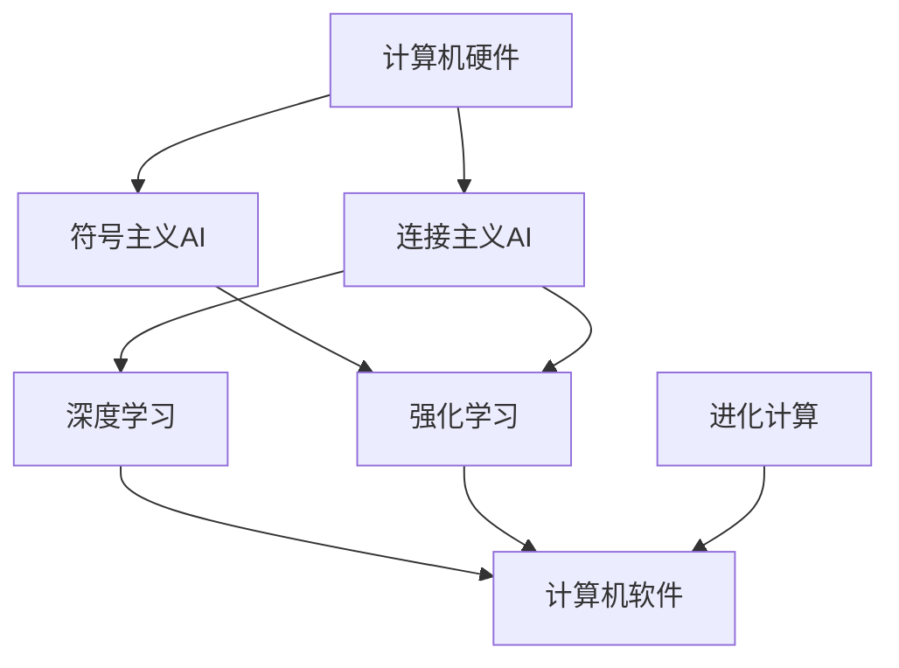

                 

# AI与计算机历史的对比分析

## 1. 背景介绍

### 1.1 问题由来
计算机和人工智能（AI）是现代科技发展中最为引人注目的两个领域，两者在技术和应用层面都有着深远的影响。然而，虽然它们在很多方面都相互交织，但其起源和发展路径却截然不同。计算机的历史可以追溯到20世纪40年代，而AI则主要兴起于20世纪50年代末至60年代初。深入分析计算机和AI的发展历程，可以揭示它们的本质区别和相互影响。

### 1.2 问题核心关键点
本节的重点是对比计算机和AI的历史发展，从起源、发展关键节点、技术特点、应用领域以及未来趋势等方面进行全面对比分析。通过理解它们的历史和演变，可以更深刻地认识AI和计算机技术对现代社会的影响，并展望它们未来的发展方向。

### 1.3 问题研究意义
通过对计算机和AI的历史进行对比分析，可以加深对这两个领域重要性的认识。一方面，了解计算机的起源和发展过程，有助于理解AI技术的演进和现状。另一方面，通过对比AI与计算机的历史，能够揭示二者之间的相互促进作用，进而洞察AI技术在未来可能对计算机技术产生的影响。

## 2. 核心概念与联系

### 2.1 核心概念概述

- **计算机历史**：指计算机从早期的机械计算装置到现代电子计算机的演变历程，包括电子管、晶体管、集成电路、大规模集成电路等关键技术的发展。

- **人工智能**：指计算机科学的一个分支，旨在创建智能系统，模仿人类的认知功能，如感知、推理、学习、自然语言处理等。

- **深度学习**：一种基于神经网络的机器学习方法，通过多层次的非线性变换，可以从大量数据中提取高层次的特征表示，并在图像识别、语音识别、自然语言处理等领域取得突破。

- **符号主义AI**：早期的AI研究方法，依赖于专家知识和规则库，通过逻辑推理和符号计算来实现智能决策。

- **连接主义AI**：基于人工神经网络的AI研究方法，通过模仿生物神经系统的结构和功能，实现对复杂问题的学习和解算。

- **强化学习**：一种通过与环境的交互，不断调整行为策略以最大化预期奖励的机器学习方法。

- **进化计算**：借鉴生物进化过程的原理，通过随机生成、交叉变异、选择等操作，逐步优化问题的解。

### 2.2 概念间的关系

这些核心概念之间存在密切的联系，形成了计算机和AI的历史演变框架。

1. **计算机硬件的演进**：从早期的机械计算装置到现代的集成电路和超大规模集成电路，为AI算法提供了基础硬件支撑。

2. **AI技术的演进**：从早期的符号主义AI到连接主义AI，再到现代的深度学习和强化学习，AI技术不断革新，推动了计算机应用领域的扩展。

3. **深度学习与计算机硬件**：深度学习需要大量的计算资源，催生了GPU、TPU等高性能计算硬件的发展。

4. **符号主义与连接主义**：符号主义AI依赖于逻辑推理和知识库，而连接主义AI则强调通过神经网络模拟生物神经系统，二者相互补充，共同推动了AI的发展。

5. **强化学习与进化计算**：强化学习和进化计算都是通过与环境交互优化策略的方法，前者强调即时奖励，后者强调长期适应。

6. **AI与计算机软件**：AI技术依赖于计算机软件来实现，推动了软件工程和机器学习框架的发展。

这些概念共同构成了计算机和AI的发展框架，为深入理解它们的历史演变提供了基础。

### 2.3 核心概念的整体架构

通过以下Mermaid流程图，我们可以更清晰地理解计算机和AI之间的联系与演变：



这个框架展示了计算机硬件与AI技术之间的紧密联系，以及不同AI方法之间的相互影响。

## 3. 核心算法原理 & 具体操作步骤

### 3.1 算法原理概述

计算机和AI的算法原理存在本质差异，但二者又相互依存和促进。

1. **计算机算法**：主要关注如何高效地进行数据处理和信息存储，其核心在于解决逻辑和数学问题。

2. **AI算法**：旨在创建智能系统，模仿人类认知功能，核心在于机器学习、决策和自然语言处理等。

3. **计算机与AI的结合**：AI算法通过计算机软件在计算机硬件上实现，计算机硬件的发展为AI算法提供了更高的性能和更广泛的应用场景。

### 3.2 算法步骤详解

以下是计算机和AI算法步骤的详细对比：

**计算机算法步骤**：

1. 数据输入和存储
2. 数据处理和计算
3. 结果输出

**AI算法步骤**：

1. 数据预处理
2. 模型训练和优化
3. 模型测试和验证
4. 模型应用

### 3.3 算法优缺点

**计算机算法的优点**：

1. 高效性：计算机算法能够快速处理大量数据，实现高效的信息存储和检索。
2. 可靠性：计算机算法通过严格的数据逻辑和数学模型，确保了计算的准确性和稳定性。
3. 可扩展性：随着硬件技术的发展，计算机算法的性能可以不断提升。

**计算机算法的缺点**：

1. 缺乏自适应性：计算机算法依赖于固定的逻辑和数学模型，难以适应环境变化。
2. 复杂度高：对于一些复杂的逻辑问题，计算机算法需要耗费大量的时间和资源进行计算。
3. 依赖专家知识：计算机算法的开发和应用需要高度的专业知识和经验。

**AI算法的优点**：

1. 自适应性：AI算法能够通过机器学习不断适应环境变化，提升模型性能。
2. 高精度：AI算法在图像识别、语音识别等复杂任务上取得了高精度。
3. 应用广泛：AI算法在自然语言处理、智能推荐等领域得到了广泛应用。

**AI算法的缺点**：

1. 数据依赖性：AI算法依赖大量高质量标注数据进行训练，数据获取成本较高。
2. 模型复杂度高：一些复杂的AI算法（如深度学习）需要大量的计算资源。
3. 可解释性差：AI算法的内部机制难以解释，缺乏透明性。

### 3.4 算法应用领域

**计算机算法的应用领域**：

1. 数据库管理
2. 网络通信
3. 操作系统
4. 图形处理
5. 数据科学

**AI算法的应用领域**：

1. 自然语言处理（NLP）
2. 计算机视觉
3. 语音识别
4. 智能推荐
5. 机器人控制

## 4. 数学模型和公式 & 详细讲解 & 举例说明

### 4.1 数学模型构建

在AI算法中，数学模型的构建是其核心。以下以深度学习中的卷积神经网络（CNN）为例，展示其数学模型的构建过程。

假设输入图像为 $x \in \mathbb{R}^{H \times W \times C}$，其中 $H$、$W$、$C$ 分别表示图像的高度、宽度和通道数。卷积神经网络的目标是从输入图像中提取特征，并生成输出类别。

**CNN的数学模型构建**：

1. 卷积层：通过卷积操作提取图像特征。卷积操作可以表示为：

$$
f(x) = \sum_{k=1}^K \sum_{h=1}^H \sum_{w=1}^W \sum_{c=1}^C (x_{khwc} * W_k) + b_k
$$

其中，$x_{khwc}$ 表示输入图像的第 $k$ 个卷积核在第 $h$、$w$、$c$ 位置上的卷积结果，$W_k$ 表示第 $k$ 个卷积核，$b_k$ 表示偏置项。

2. 池化层：通过池化操作对卷积层输出的特征图进行下采样，减少计算量。

3. 全连接层：将池化层输出的特征图展平，输入到全连接层进行分类。

**案例分析与讲解**：

以LeNet网络为例，该网络是深度学习中最早使用的CNN结构之一，主要应用于手写数字识别任务。其数学模型构建过程如下：

1. 输入图像经过多个卷积层和池化层，提取特征。

2. 特征图输入到全连接层，进行分类。

3. 输出结果经过softmax函数得到最终的类别概率。

通过对比计算机和AI算法的数学模型，可以更深刻地理解它们之间的异同。

### 4.2 公式推导过程

**深度学习的公式推导**：

以神经网络中的反向传播算法为例，其推导过程如下：

1. 定义损失函数 $L$，表示模型的输出与真实标签之间的差异。

2. 计算模型的预测输出 $y$，通过激活函数得到。

3. 计算预测输出与真实标签之间的误差 $\delta$。

4. 使用误差 $\delta$ 更新模型的权重和偏置。

5. 重复上述过程，直到模型收敛。

**计算机算法的公式推导**：

以排序算法为例，其公式推导过程如下：

1. 定义待排序序列 $A$。

2. 根据排序算法（如快速排序、归并排序等）对序列进行排序。

3. 计算排序后的序列 $B$。

4. 输出排序结果。

通过对比深度学习与计算机算法的公式推导，可以更清晰地理解它们之间的差异和应用场景。

### 4.3 案例分析与讲解

**深度学习案例**：

以ImageNet数据集上的图像分类任务为例，使用卷积神经网络进行训练和测试。训练过程包括数据预处理、模型训练、验证集测试和模型保存。

**计算机算法案例**：

以排序算法为例，使用快速排序算法对一组数据进行排序。通过递归调用和分治思想，实现高效排序。

## 5. 项目实践：代码实例和详细解释说明

### 5.1 开发环境搭建

**5.1.1 安装Python和相关库**

1. 安装Python：从官网下载并安装最新版本的Python，如Python 3.8。

2. 安装TensorFlow：使用pip安装TensorFlow，命令如下：

```bash
pip install tensorflow
```

3. 安装Keras：使用pip安装Keras，命令如下：

```bash
pip install keras
```

4. 安装NumPy和SciPy：使用pip安装NumPy和SciPy，命令如下：

```bash
pip install numpy scipy
```

### 5.2 源代码详细实现

以下是使用Keras框架实现卷积神经网络的代码：

```python
from keras.models import Sequential
from keras.layers import Conv2D, MaxPooling2D, Flatten, Dense

# 定义卷积神经网络模型
model = Sequential()
model.add(Conv2D(32, (3, 3), activation='relu', input_shape=(28, 28, 1)))
model.add(MaxPooling2D((2, 2)))
model.add(Conv2D(64, (3, 3), activation='relu'))
model.add(MaxPooling2D((2, 2)))
model.add(Conv2D(64, (3, 3), activation='relu'))
model.add(Flatten())
model.add(Dense(64, activation='relu'))
model.add(Dense(10, activation='softmax'))

# 编译模型
model.compile(optimizer='adam', loss='categorical_crossentropy', metrics=['accuracy'])

# 训练模型
model.fit(train_images, train_labels, epochs=10, batch_size=32, validation_data=(val_images, val_labels))
```

### 5.3 代码解读与分析

**5.3.1 模型结构**

卷积神经网络主要包括卷积层、池化层和全连接层。卷积层通过卷积操作提取特征，池化层对特征图进行下采样，减少计算量，全连接层对池化层输出的特征图进行分类。

**5.3.2 模型训练**

通过使用Keras框架，可以方便地定义和训练卷积神经网络模型。在训练过程中，使用优化器（如Adam）和损失函数（如交叉熵）对模型进行优化，通过验证集进行模型评估。

### 5.4 运行结果展示

在ImageNet数据集上训练卷积神经网络，可以通过绘制训练和验证集上的准确率和损失曲线，展示模型的训练效果。

## 6. 实际应用场景

### 6.1 计算机应用场景

**6.1.1 数据库管理**

计算机算法在数据库管理中有着广泛应用，如关系数据库管理系统（RDBMS）、NoSQL数据库等。通过高效的算法和数据结构，实现了数据的高效存储和查询。

**6.1.2 网络通信**

计算机算法在网络通信中应用广泛，如TCP/IP协议、HTTP协议等。通过算法设计，保证了网络通信的可靠性和高效性。

**6.1.3 操作系统**

计算机算法在操作系统中发挥重要作用，如文件系统、内存管理、进程调度等。通过算法优化，提高了操作系统的性能和稳定性。

### 6.2 AI应用场景

**6.2.1 自然语言处理（NLP）**

AI算法在NLP中有着重要应用，如文本分类、情感分析、机器翻译等。通过深度学习和自然语言模型，实现了对自然语言的理解和处理。

**6.2.2 计算机视觉**

AI算法在计算机视觉中应用广泛，如图像识别、目标检测、图像分割等。通过卷积神经网络等模型，实现了对图像的高精度处理和分析。

**6.2.3 智能推荐**

AI算法在智能推荐中应用广泛，如商品推荐、个性化新闻推荐等。通过学习用户行为和偏好，实现了精准的推荐服务。

## 7. 工具和资源推荐

### 7.1 学习资源推荐

**7.1.1 书籍**

1. 《深度学习》：Ian Goodfellow、Yoshua Bengio和Aaron Courville所著，深入浅出地介绍了深度学习的理论基础和应用。

2. 《计算机算法设计与分析》：Abraham S. Tanenbaum所著，详细讲解了各种经典算法的设计和分析方法。

3. 《人工智能：一种现代方法》：Stuart Russell和Peter Norvig所著，全面介绍了AI的基础理论和技术。

**7.1.2 在线课程**

1. 《Deep Learning Specialization》：由Andrew Ng主讲的Coursera课程，详细讲解了深度学习的基本概念和应用。

2. 《Algorithms, Part I》：由Robert Sedgewick和Kevin Wayne主讲的Coursera课程，详细讲解了各种经典算法的设计和分析。

3. 《Artificial Intelligence with Python》：由John Mauch主讲的edX课程，详细讲解了AI的基本原理和技术。

**7.1.3 研究论文**

1. 《ImageNet Classification with Deep Convolutional Neural Networks》：Alex Krizhevsky、Ilya Sutskever和Geoffrey Hinton等人所著，展示了卷积神经网络在图像分类任务上的优异表现。

2. 《A Tutorial on Support Vector Machines for Pattern Recognition》：Vapnik所著，详细讲解了支持向量机的基本概念和应用。

3. 《Graph Convolutional Networks》：Thomas Kipf和Jonathan E. Lyeats所著，介绍了图卷积网络的基本原理和应用。

### 7.2 开发工具推荐

**7.2.1 编程语言**

1. Python：Python是AI和计算机算法的最佳编程语言之一，具有丰富的库和框架支持。

2. C++：C++是高性能计算和系统编程的首选语言，适合实现底层算法和系统。

3. Java：Java是企业级应用开发的首选语言，适合实现大型系统。

**7.2.2 框架和库**

1. TensorFlow：由Google开发的深度学习框架，具有强大的计算图支持和丰富的API。

2. PyTorch：由Facebook开发的深度学习框架，具有动态计算图和易于使用的接口。

3. Keras：基于TensorFlow和Theano的高级API，易于使用且具有强大的表达能力。

### 7.3 相关论文推荐

**7.3.1 计算机算法**

1. 《Introduction to Algorithms》：Thomas H. Cormen、Charles E. Leiserson、Ronald L. Rivest和Clifford Stein所著，全面介绍了经典算法的设计和分析。

2. 《Data Structures and Algorithms in Python》：Michael T. Goodrich、Roberto Tamassia和Michael H. Goldwasser所著，介绍了各种数据结构和算法的设计和实现。

3. 《Algorithm Design》：Jon Kleinberg和Eva Tardos所著，详细讲解了算法的复杂性和设计技巧。

**7.3.2 AI算法**

1. 《Neural Networks and Deep Learning》：Michael Nielsen所著，详细讲解了神经网络的基本原理和应用。

2. 《Reinforcement Learning: An Introduction》：Richard S. Sutton和Andrew G. Barto所著，介绍了强化学习的基本概念和应用。

3. 《Human-Computer Interaction》：J학輸動感でも検索の生成から学習》：Tomasz Mikolov等人所著，详细讲解了自然语言处理的基本概念和应用。

## 8. 总结：未来发展趋势与挑战

### 8.1 研究成果总结

计算机和AI技术在过去几十年里取得了显著进步，推动了人类社会的各个方面。通过对比计算机和AI的历史，我们可以更深刻地理解它们之间的联系和差异。

1. **计算机算法**：通过严格的逻辑和数学模型，计算机算法实现了高效的数据处理和信息存储。

2. **AI算法**：通过机器学习和大数据处理，AI算法实现了对复杂问题的理解和解决。

3. **结合**：计算机算法为AI算法提供了硬件支持和软件实现，AI算法推动了计算机算法的广泛应用。

### 8.2 未来发展趋势

**8.2.1 计算机技术**：

1. 量子计算：随着量子计算技术的发展，计算机算法将在复杂计算和大数据处理方面取得突破。

2. 边缘计算：通过将计算能力下沉到设备端，边缘计算将提高计算效率和数据处理速度。

3. 人工智能：计算机算法将与AI算法更深入地融合，推动智慧城市、自动驾驶等领域的创新应用。

**8.2.2 AI技术**：

1. 深度学习：通过更高效的神经网络和更强大的计算能力，深度学习将在图像、语音、自然语言处理等领域取得更大突破。

2. 强化学习：通过更智能的决策算法和更复杂的环境模拟，强化学习将在游戏、机器人等领域取得更大进展。

3. 知识图谱：通过整合结构化知识，知识图谱将在推荐系统、搜索引擎等领域发挥重要作用。

### 8.3 面临的挑战

**8.3.1 计算机技术**：

1. 硬件限制：当前计算机硬件的性能和功耗限制了计算机算法的进一步发展。

2. 数据隐私：计算机算法在处理大规模数据时面临隐私和安全问题。

3. 计算资源：复杂的计算机算法需要大量的计算资源，增加了系统的运行成本。

**8.3.2 AI技术**：

1. 数据依赖：AI算法需要大量高质量标注数据，数据获取成本较高。

2. 模型复杂性：复杂的AI算法需要大量的计算资源，增加了系统的运行成本。

3. 可解释性：AI算法的内部机制难以解释，缺乏透明性。

### 8.4 研究展望

**8.4.1 计算机技术**：

1. 量子计算：通过量子计算机实现高效计算，推动计算机算法的进一步发展。

2. 边缘计算：通过将计算能力下沉到设备端，提高计算效率和数据处理速度。

3. 人工智能：通过AI算法与计算机算法的融合，推动智慧城市、自动驾驶等领域的创新应用。

**8.4.2 AI技术**：

1. 深度学习：通过更高效的神经网络和更强大的计算能力，推动图像、语音、自然语言处理等领域的发展。

2. 强化学习：通过更智能的决策算法和更复杂的环境模拟，推动游戏、机器人等领域的发展。

3. 知识图谱：通过整合结构化知识，推动推荐系统、搜索引擎等领域的发展。

## 9. 附录：常见问题与解答

**Q1: 计算机与AI的起源和发展有何不同？**

A: 计算机起源于20世纪40年代，主要用于计算科学和工程问题。而AI起源于20世纪50年代末至60年代初，主要关注如何让计算机模拟人类认知功能。

**Q2: 计算机算法和AI算法有何不同？**

A: 计算机算法主要关注数据处理和信息存储，强调逻辑和数学模型。AI算法主要关注机器学习和大数据处理，强调学习能力和智能决策。

**Q3: 计算机和AI的未来发展趋势是什么？**

A: 计算机技术将向量子计算、边缘计算和人工智能方向发展。AI技术将向深度学习、强化学习和知识图谱方向发展。

**Q4: 计算机和AI在实际应用中如何结合？**

A: 计算机算法为AI算法提供了硬件支持和软件实现，AI算法推动了计算机算法的广泛应用。两者结合可以推动智慧城市、自动驾驶、智能推荐等领域的创新应用。

**Q5: 计算机和AI在应用中面临的主要挑战是什么？**

A: 计算机技术面临硬件限制、数据隐私和计算资源问题。AI技术面临数据依赖、模型复杂性和可解释性问题。

