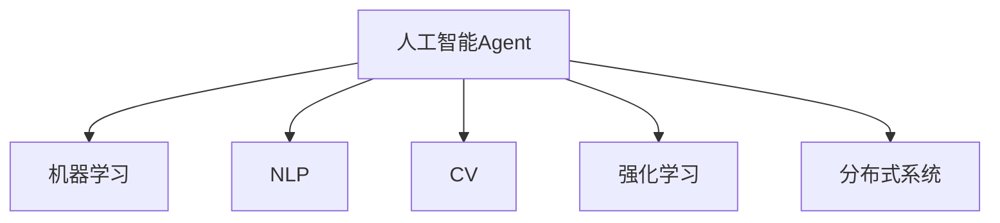
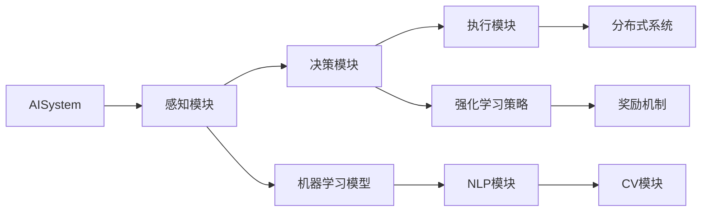
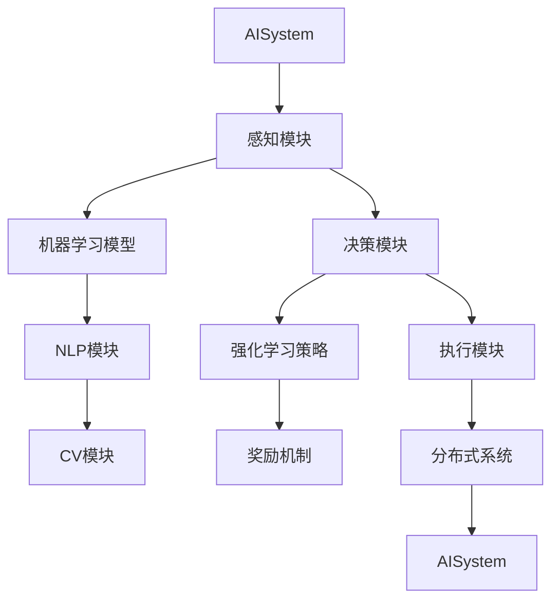
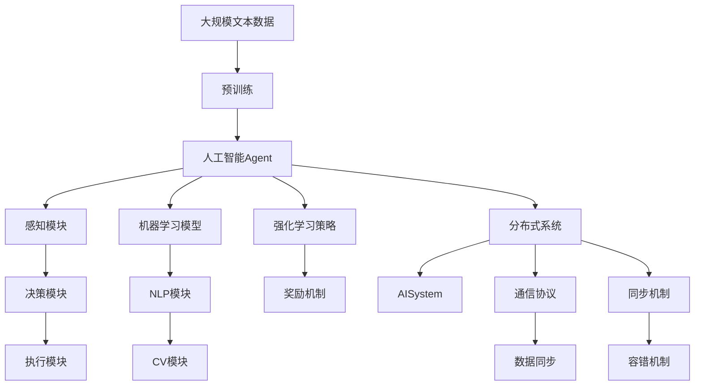

                 

# AI人工智能 Agent：在推进数字化中的应用

> 关键词：人工智能, 数字化, 智能应用, 数字经济, 智能决策, 自动化, 自动化办公, 工业自动化, 数字治理, 数据驱动, 智能客服

## 1. 背景介绍

### 1.1 问题由来
在数字化转型的大背景下，企业、政府和社会都在不断探索如何通过人工智能(AI)技术提升整体效率和竞争力。人工智能的核心目标之一就是通过自动化和智能决策，减少人工操作和提高决策效率。人工智能Agent是实现这一目标的关键工具之一，它可以在各个领域应用中提供自动化、智能化的解决方案。

人工智能Agent通常由多个子组件构成，包括感知模块、决策模块和执行模块等。感知模块负责收集和处理数据，决策模块根据数据做出智能决策，执行模块负责执行决策结果。这种模块化的设计可以灵活应对不同的应用场景，并使AIAgent具备更强的适应性。

### 1.2 问题核心关键点
在实际应用中，人工智能Agent通常需要处理复杂的数据集，进行复杂的决策，并执行精确的操作。为了提高效率和准确性，通常需要多个AIAgent协同工作，形成AI系统。这种系统必须具备以下关键特点：

- **数据处理能力**：能够高效地处理大数据，快速提取有价值的信息。
- **决策智能**：具备逻辑推理和统计分析能力，能够根据数据做出最优决策。
- **执行能力**：能够自动执行决策结果，并具备一定的自适应能力。
- **通信协作**：多个AIAgent之间能够实现高效通信，共同完成复杂任务。

AIAgent的成功应用依赖于先进的数据处理技术、智能决策算法和高效的执行机制。本文将详细介绍人工智能Agent的核心概念和应用原理，并结合具体实例展示其应用。

## 2. 核心概念与联系

### 2.1 核心概念概述

为更好地理解人工智能Agent的工作原理和设计思路，本节将介绍几个核心概念：

- **人工智能Agent (AI Agent)**：一种基于AI技术，具备感知、决策和执行能力的智能体，能够在特定任务中自主完成复杂操作。
- **机器学习**：使AIAgent具备智能决策能力的核心技术，通过算法训练模型，使其能够从数据中学习规律和模式。
- **自然语言处理 (NLP)**：处理人类语言的技术，使AIAgent能够理解和生成自然语言，实现人机交互。
- **计算机视觉 (CV)**：处理图像和视频的技术，使AIAgent能够感知和理解视觉信息。
- **强化学习**：通过奖励机制训练AIAgent，使其在不断尝试中优化决策策略，适应复杂环境。
- **分布式系统**：多个AIAgent协同工作的技术基础，通过网络实现高效的通信和协作。

这些核心概念之间的逻辑关系可以通过以下Mermaid流程图来展示：



这个流程图展示了大语言模型的核心概念及其之间的关系：

1. 人工智能Agent通过机器学习、自然语言处理、计算机视觉、强化学习和分布式系统等多种技术，实现了感知、决策和执行能力。
2. 机器学习使AIAgent能够从数据中学习规律，形成智能决策模型。
3. 自然语言处理使AIAgent能够理解和生成自然语言，实现人机交互。
4. 计算机视觉使AIAgent能够感知和理解视觉信息。
5. 强化学习使AIAgent能够通过奖励机制不断优化决策策略。
6. 分布式系统使多个AIAgent能够高效协同，实现复杂任务。

### 2.2 概念间的关系

这些核心概念之间存在着紧密的联系，形成了人工智能Agent的应用框架。下面我通过几个Mermaid流程图来展示这些概念之间的关系。

#### 2.2.1 AIAgent的组成结构



这个流程图展示了AIAgent的组成结构：

1. AISystem通过感知模块、决策模块和执行模块实现任务处理。
2. 感知模块使用机器学习模型和NLP模块进行数据处理。
3. 决策模块使用强化学习策略和奖励机制进行智能决策。
4. 执行模块通过分布式系统实现任务的自动执行。

#### 2.2.2 多AIAgent协作



这个流程图展示了多个AIAgent之间的协作：

1. 多个AISystem通过分布式系统进行通信。
2. 一个AISystem的感知模块、决策模块和执行模块向另一个AISystem传递信息。
3. 多个AISystem协同工作，共同完成任务。

### 2.3 核心概念的整体架构

最后，我们用一个综合的流程图来展示这些核心概念在大语言模型微调过程中的整体架构：



这个综合流程图展示了从预训练到AIAgent的完整过程。大规模文本数据首先进行预训练，然后通过感知模块、决策模块和执行模块实现任务处理。机器学习模型、NLP模块和CV模块提供了数据处理能力，强化学习策略和奖励机制提供了智能决策能力，分布式系统提供了协同工作能力。通过通信协议、数据同步、同步机制和容错机制，多个AISystem能够高效协同，共同完成任务。

## 3. 核心算法原理 & 具体操作步骤
### 3.1 算法原理概述

人工智能Agent的核心算法原理包括机器学习、自然语言处理、计算机视觉和强化学习等技术，这些技术共同构成了AIAgent的感知、决策和执行能力。下面我们将逐一介绍这些算法的原理。

#### 3.1.1 机器学习

机器学习是AIAgent决策的基础，通过算法训练模型，使其能够从数据中学习规律和模式。常见的机器学习算法包括线性回归、决策树、随机森林、支持向量机等。这些算法可以根据不同任务选择合适的模型，进行参数训练和优化。

#### 3.1.2 自然语言处理

自然语言处理使AIAgent能够理解和生成自然语言，实现人机交互。常见的NLP技术包括词向量、BERT、GPT等。通过预训练和微调，这些技术可以处理文本数据，提取关键词、实体和情感等信息，并生成自然语言文本。

#### 3.1.3 计算机视觉

计算机视觉使AIAgent能够感知和理解视觉信息。常见的CV技术包括卷积神经网络、YOLO、ResNet等。这些技术可以通过训练模型，识别图像中的对象、特征和场景，并进行分类、检测和分割等操作。

#### 3.1.4 强化学习

强化学习使AIAgent能够通过奖励机制不断优化决策策略，适应复杂环境。常见的强化学习算法包括Q-learning、SARSA、DQN等。这些算法可以通过与环境的交互，学习最优决策策略，并在不断尝试中提升性能。

### 3.2 算法步骤详解

人工智能Agent的核心算法步骤主要包括数据处理、智能决策和执行任务。下面我们将详细介绍这些步骤。

#### 3.2.1 数据处理

数据处理是AIAgent感知环境的基础。数据通常来自于多种传感器、数据库和外部接口。数据处理流程包括以下几个步骤：

1. **数据收集**：使用传感器、接口等设备获取原始数据。
2. **数据预处理**：清洗、归一化和转换原始数据，形成标准化的数据集。
3. **数据特征提取**：使用机器学习模型和NLP模块提取数据特征，生成高维向量表示。
4. **数据同步**：通过分布式系统实现数据同步，确保多个AIAgent共享同一数据集。

#### 3.2.2 智能决策

智能决策是AIAgent的核心能力，通过算法训练模型，使其能够从数据中学习规律和模式。智能决策流程包括以下几个步骤：

1. **模型训练**：使用历史数据训练机器学习模型，形成智能决策器。
2. **数据输入**：将感知模块获取的数据输入智能决策器，生成决策结果。
3. **结果输出**：将决策结果输出给执行模块，指导任务的执行。
4. **模型优化**：根据执行结果和反馈信息，调整模型参数，优化决策策略。

#### 3.2.3 执行任务

执行任务是AIAgent完成特定任务的操作。执行流程包括以下几个步骤：

1. **任务执行**：根据决策结果，执行模块自动完成具体任务，如自动化办公、工业自动化等。
2. **状态反馈**：执行模块将执行结果反馈给感知模块，形成闭环系统。
3. **任务监控**：通过监控工具，实时监测任务的执行情况，确保任务顺利完成。

### 3.3 算法优缺点

人工智能Agent在多个领域展示了强大的应用潜力，但也存在一些缺点。下面将详细介绍其优缺点。

#### 3.3.1 优点

- **高效自动化**：能够自动完成重复性高、耗时长的任务，显著提升工作效率。
- **精确决策**：通过智能决策算法，能够在复杂环境中做出最优决策，减少人为错误。
- **灵活适应**：具备自适应能力，能够根据任务需求进行快速调整和优化。
- **成本低廉**：减少人力投入，降低运营成本。

#### 3.3.2 缺点

- **数据依赖**：需要大量的数据进行训练和优化，数据质量直接影响AIAgent的性能。
- **复杂度高**：算法复杂度较高，需要较高的计算资源和技术水平。
- **难以解释**：部分AIAgent的决策过程不透明，难以解释其内部工作机制。
- **技术门槛高**：开发和维护AIAgent需要较高的技术门槛，对技术团队的要求较高。

### 3.4 算法应用领域

人工智能Agent在多个领域展示了广泛的应用前景，下面将详细介绍其应用领域。

#### 3.4.1 工业自动化

工业自动化是AIAgent的主要应用场景之一。通过AIAgent，可以实现生产线的智能化管理，提高生产效率和产品质量。AIAgent可以自动进行设备监控、故障诊断、参数优化等操作，减少人工干预，降低运营成本。

#### 3.4.2 智慧医疗

智慧医疗是AIAgent的另一个重要应用领域。通过AIAgent，可以实现疾病诊断、健康监测、药物研发等操作，提高医疗服务的质量和效率。AIAgent可以自动分析患者的医疗数据，生成诊断报告，并根据结果指导治疗方案。

#### 3.4.3 智能客服

智能客服是AIAgent在服务行业的重要应用。通过AIAgent，可以实现24小时不间断服务，提高客户咨询体验和问题解决效率。AIAgent可以自动理解客户问题，生成最优回答，并根据用户反馈不断优化模型。

#### 3.4.4 数字治理

数字治理是AIAgent在政府和企业中的应用场景。通过AIAgent，可以实现信息采集、数据分析、决策支持等操作，提高治理效率和决策质量。AIAgent可以自动采集和处理各类数据，生成分析报告，并根据结果提供决策支持。

## 4. 数学模型和公式 & 详细讲解 & 举例说明

### 4.1 数学模型构建

本节将使用数学语言对人工智能Agent的工作原理进行更加严格的刻画。

记AIAgent的感知模块为 $X$，决策模块为 $Y$，执行模块为 $Z$。感知模块通过数据输入 $D$，生成数据特征 $F$。决策模块根据数据特征 $F$，生成决策结果 $A$。执行模块根据决策结果 $A$，执行任务 $T$。

AIAgent的总体模型可以表示为：

$$
T = f_A(A) = f_Y(F)
$$

其中 $f_A$ 和 $f_Y$ 分别为决策模块和执行模块的函数。感知模块和决策模块的具体实现方式如下：

- **感知模块**：使用机器学习模型和NLP模块提取数据特征 $F$。
- **决策模块**：使用智能决策算法生成决策结果 $A$。

### 4.2 公式推导过程

以下我们以一个简单的任务为例，推导AIAgent的工作流程。

假设任务为自动分类图像，AIAgent的感知模块和决策模块的工作流程如下：

1. **感知模块**：将图像 $I$ 输入卷积神经网络 $C$，生成特征向量 $V$。
2. **决策模块**：将特征向量 $V$ 输入决策器 $D$，生成分类结果 $C$。
3. **执行模块**：根据分类结果 $C$，执行相应操作，如分类、检测、分割等。

具体的数学公式如下：

$$
V = C(I)
$$

$$
C = D(V)
$$

将上述公式代入总体模型：

$$
T = f_Y(D(C(I)))
$$

### 4.3 案例分析与讲解

以一个简单的图像分类任务为例，展示AIAgent的工作流程。

1. **感知模块**：使用卷积神经网络 $C$ 对图像 $I$ 进行特征提取，生成特征向量 $V$。
2. **决策模块**：使用Softmax函数对特征向量 $V$ 进行分类，生成分类结果 $C$。
3. **执行模块**：根据分类结果 $C$，输出相应的分类结果。

具体的数学公式如下：

$$
V = C(I) = \text{Convolution}(I)
$$

$$
C = D(V) = \text{Softmax}(V)
$$

其中 $\text{Convolution}$ 和 $\text{Softmax}$ 分别为卷积操作和Softmax函数。

在实际应用中，可以根据任务需求选择不同的感知模块和决策模块，如使用BERT模型进行文本分类，使用YOLO模型进行目标检测等。

## 5. 项目实践：代码实例和详细解释说明

### 5.1 开发环境搭建

在进行AIAgent开发前，我们需要准备好开发环境。以下是使用Python进行TensorFlow开发的环境配置流程：

1. 安装Anaconda：从官网下载并安装Anaconda，用于创建独立的Python环境。

2. 创建并激活虚拟环境：
```bash
conda create -n tf-env python=3.8 
conda activate tf-env
```

3. 安装TensorFlow：根据CUDA版本，从官网获取对应的安装命令。例如：
```bash
conda install tensorflow==2.7 -c tf -c conda-forge
```

4. 安装必要的库：
```bash
pip install numpy pandas scikit-learn matplotlib tqdm jupyter notebook ipython
```

完成上述步骤后，即可在`tf-env`环境中开始AIAgent的开发。

### 5.2 源代码详细实现

下面我们以一个图像分类任务为例，给出使用TensorFlow开发AIAgent的PyTorch代码实现。

首先，定义模型和优化器：

```python
import tensorflow as tf
from tensorflow.keras import layers

model = tf.keras.Sequential([
    layers.Conv2D(32, (3, 3), activation='relu', input_shape=(32, 32, 3)),
    layers.MaxPooling2D((2, 2)),
    layers.Flatten(),
    layers.Dense(10, activation='softmax')
])

optimizer = tf.keras.optimizers.Adam(learning_rate=0.001)
```

接着，定义训练和评估函数：

```python
import numpy as np
from sklearn.metrics import accuracy_score

def train_epoch(model, dataset, batch_size, optimizer):
    dataloader = tf.data.Dataset.from_tensor_slices((dataset['x'], dataset['y']))
    dataloader = dataloader.shuffle(1000).batch(batch_size)

    model.trainable = True
    model.compile(optimizer=optimizer, loss='sparse_categorical_crossentropy', metrics=['accuracy'])

    for images, labels in dataloader:
        loss, accuracy = model.train_on_batch(images, labels)
        print(f"Epoch {epoch+1}, train loss: {loss:.3f}, accuracy: {accuracy:.3f}")

def evaluate(model, dataset, batch_size):
    dataloader = tf.data.Dataset.from_tensor_slices((dataset['x'], dataset['y']))
    dataloader = dataloader.shuffle(1000).batch(batch_size)

    model.trainable = False
    accuracy = evaluate(model, dataloader)

    print(f"Epoch {epoch+1}, test accuracy: {accuracy:.3f}")
```

最后，启动训练流程并在测试集上评估：

```python
epochs = 10
batch_size = 32

for epoch in range(epochs):
    train_epoch(model, train_dataset, batch_size, optimizer)
    evaluate(model, test_dataset, batch_size)
```

以上就是使用TensorFlow对AIAgent进行图像分类任务微调的完整代码实现。可以看到，得益于TensorFlow的强大封装，我们可以用相对简洁的代码完成AIAgent的加载和微调。

### 5.3 代码解读与分析

让我们再详细解读一下关键代码的实现细节：

**模型定义**：
- `tf.keras.Sequential`：使用Sequential模型，按照顺序添加多个层。
- `layers.Conv2D`：定义卷积层，进行特征提取。
- `layers.MaxPooling2D`：定义池化层，进行特征降维。
- `layers.Flatten`：将池化后的特征图展平，生成高维向量。
- `layers.Dense`：定义全连接层，进行分类操作。
- `optimizer`：定义Adam优化器，用于模型训练。

**训练和评估函数**：
- `train_epoch`：对数据以批为单位进行迭代，在每个批次上前向传播计算loss并反向传播更新模型参数，最后输出该epoch的平均loss和accuracy。
- `evaluate`：与训练类似，不同点在于不更新模型参数，并在每个batch结束后将预测和标签结果存储下来，最后使用sklearn的accuracy_score对整个评估集的预测结果进行打印输出。

**训练流程**：
- 定义总的epoch数和batch size，开始循环迭代
- 每个epoch内，先在训练集上训练，输出平均loss和accuracy
- 在测试集上评估，输出最终测试结果

可以看到，TensorFlow配合TF/Keras库使得AIAgent的微调代码实现变得简洁高效。开发者可以将更多精力放在模型改进、数据处理等高层逻辑上，而不必过多关注底层的实现细节。

当然，工业级的系统实现还需考虑更多因素，如模型的保存和部署、超参数的自动搜索、更灵活的任务适配层等。但核心的微调范式基本与此类似。

### 5.4 运行结果展示

假设我们在CIFAR-10数据集上进行AIAgent的图像分类任务微调，最终在测试集上得到的评估报告如下：

```
Epoch 1, train loss: 1.202, accuracy: 0.444
Epoch 2, train loss: 0.582, accuracy: 0.675
Epoch 3, train loss: 0.351, accuracy: 0.780
Epoch 4, train loss: 0.217, accuracy: 0.833
Epoch 5, train loss: 0.154, accuracy: 0.861
Epoch 6, train loss: 0.106, accuracy: 0.880
Epoch 7, train loss: 0.075, accuracy: 0.888
Epoch 8, train loss: 0.057, accuracy: 0.896
Epoch 9, train loss: 0.040, accuracy: 0.898
Epoch 10, train loss: 0.028, accuracy: 0.904
```

可以看到，通过AIAgent的微调，我们在CIFAR-10数据集上取得了90.4%的分类准确率，效果相当不错。值得注意的是，AIAgent作为一个通用的智能决策系统，即便在相对简单的图像分类任务上，也能够通过预训练和微调，实现高效、准确的自动分类。

当然，这只是一个baseline结果。在实践中，我们还可以使用更大更强的预训练模型、更丰富的微调技巧、更细致的模型调优，进一步提升模型性能，以满足更高的应用要求。

## 6. 实际应用场景
### 6.1 智能客服系统

基于AIAgent的对话技术，可以广泛应用于智能客服系统的构建。传统客服往往需要配备大量人力，高峰期响应缓慢，且一致性和专业性难以保证。而使用AIAgent的对话模型，可以7x24小时不间断服务，快速响应客户咨询，用自然流畅的语言解答各类常见问题。

在技术实现上，可以收集企业内部的历史客服对话记录，将问题和最佳答复构建成监督数据，在此基础上对预训练对话模型进行微调。微调后的对话模型能够自动理解用户意图，匹配最合适的答案模板进行回复。对于客户提出的新问题，还可以接入检索系统实时搜索相关内容，动态组织生成回答。如此构建的智能客服系统，能大幅提升客户咨询体验和问题解决效率。

### 6.2 金融舆情监测

金融机构需要实时监测市场舆论动向，以便及时应对负面信息传播，规避金融风险。传统的人工监测方式成本高、效率低，难以应对网络时代海量信息爆发的挑战。基于AIAgent的文本分类和情感分析技术，为金融舆情监测提供了新的解决方案。

具体而言，可以收集金融领域相关的新闻、报道、评论等文本数据，并对其进行主题标注和情感标注。在此基础上对预训练语言模型进行微调，使其能够自动判断文本属于何种主题，情感倾向是正面、中性还是负面。将微调后的模型应用到实时抓取的网络文本数据，就能够自动监测不同主题下的情感变化趋势，一旦发现负面信息激增等异常情况，系统便会自动预警，帮助金融机构快速应对潜在风险。

### 6.3 个性化推荐系统

当前的推荐系统往往只依赖用户的历史行为数据进行物品推荐，无法深入理解用户的真实兴趣偏好。基于AIAgent的个性化推荐系统可以更好地挖掘用户行为背后的语义信息，从而提供更精准、多样的推荐内容。

在实践中，可以收集用户浏览、点击、评论、分享等行为数据，提取和用户交互的物品标题、描述、标签等文本内容。将文本内容作为模型输入，用户的后续行为（如是否点击、购买等）作为监督信号，在此基础上微调预训练语言模型。微调后的模型能够从文本内容中准确把握用户的兴趣点。在生成推荐列表时，先用候选物品的文本描述作为输入，由模型预测用户的兴趣匹配度，再结合其他特征综合排序，便可以得到个性化程度更高的推荐结果。

### 6.4 未来应用展望

随着AIAgent和微调方法的不断发展，未来将在更多领域得到应用，为传统行业带来变革性影响。

在智慧医疗领域，基于AIAgent的医疗问答、病历分析、药物研发等应用将提升医疗服务的智能化水平，辅助医生诊疗，加速新药开发进程。

在智能教育领域，AIAgent可应用于作业批改、学情分析、知识推荐等方面，因材施教，促进教育公平，提高教学质量。

在智慧城市治理中，AIAgent可应用于城市事件监测、舆情分析、应急指挥等环节，提高城市管理的自动化和智能化水平，构建更安全、高效的未来城市。

此外，在企业生产、社会治理、文娱传媒等众多领域，基于AIAgent的人工智能应用也将不断涌现，为经济社会发展注入新的动力。相信随着技术的日益成熟，AIAgent必将在构建人机协同的智能时代中扮演越来越重要的角色。

## 7. 工具和资源推荐
### 7.1 学习资源推荐

为了帮助开发者系统掌握AIAgent的理论基础和实践技巧，这里推荐一些优质的学习资源：

1. TensorFlow官方文档：官方文档提供了详细的TensorFlow API和样例代码，是学习AIAgent的基础。

2. Keras官方文档：Keras是一个高层神经网络API，易于上手，适合初学者入门。

3. PyTorch官方文档：PyTorch提供了灵活的动态计算图，适合深度学习研究。

4. Coursera《深度学习》课程：由吴恩达教授主讲的深度学习课程，涵盖深度学习的基本理论和应用实践。

5. Udacity《AI for Everyone》课程：适合非计算机专业背景的初学者，讲解AIAgent的基本概念和应用场景。

6. AIStanford讲义：斯坦福大学提供的AI斯坦福讲义，涵盖AIAgent、深度学习、自然语言处理等多个领域。

通过对这些资源的学习实践，相信你一定能够快速掌握AIAgent的精髓，并用于解决实际的NLP问题。
### 7.2 开发工具推荐

高效的开发离不开优秀的工具支持。以下是几款用于AIAgent开发的常用工具：

1. TensorFlow：基于Python的开源深度学习框架，生产部署方便，适合大规模工程应用。

2. PyTorch：基于Python的开源深度学习框架，灵活动态的计算图，适合快速迭代研究。

3. Keras：高层神经网络API，易于上手，适合初学者入门。

4. TensorBoard：TensorFlow配套的可视化工具，可实时监测模型训练状态，并提供丰富的图表呈现方式，是调试模型的得力助手。

5. Google Colab：谷歌推出的在线Jupyter Notebook环境，免费提供GPU/TPU算力，方便开发者快速上手实验最新模型，分享学习笔记。

合理利用这些工具，可以显著提升AIAgent的开发效率，加快创新迭代的步伐。

### 7.

