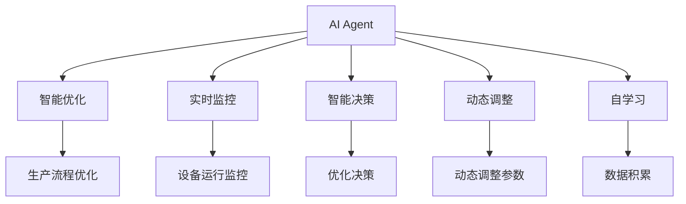
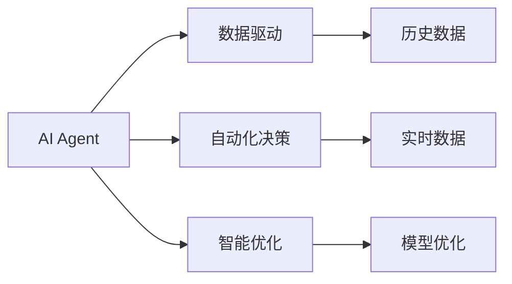
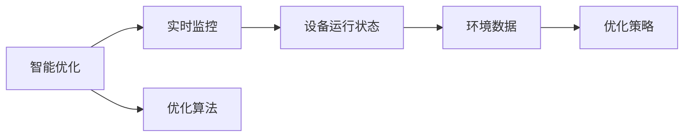
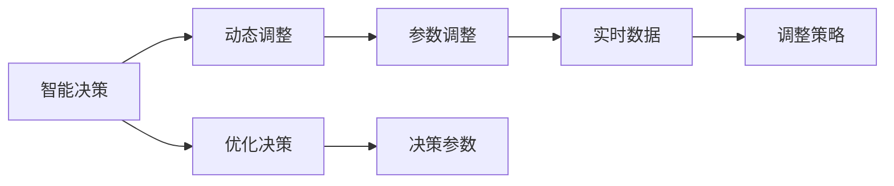
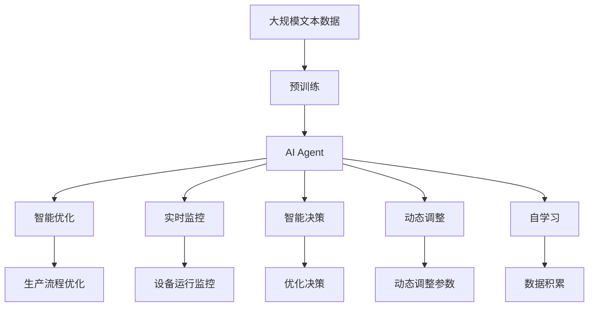

                 

# AI人工智能 Agent：在节能减排中的应用

## 1. 背景介绍

### 1.1 问题由来

当前，全球正面临严重的气候变化和环境污染问题，各国政府和企业都在积极寻求应对策略。节能减排作为减少温室气体排放、降低环境污染的关键手段，已成为全球共识。然而，传统的节能减排方法如手动调整设备参数、依靠经验优化流程等，效率低、成本高、效果有限。

人工智能（AI）技术，特别是智能决策系统和智能优化算法，为节能减排提供了新的解决方案。通过AI人工智能 Agent（智能代理），能够自动学习、自主决策、动态调整，实现节能减排的智能化管理。本文将重点探讨AI人工智能 Agent在节能减排中的应用，讨论其基本原理、技术架构和实际案例。

### 1.2 问题核心关键点

AI人工智能 Agent在节能减排中的应用，主要围绕以下几个关键点展开：

- **智能决策：** AI Agent能够通过数据分析和学习，做出最优的决策，优化生产流程和设备运行参数，实现节能减排。
- **实时监控：** AI Agent实时监控设备运行状态和环境数据，及时发现异常，采取措施。
- **动态调整：** 根据实时数据和历史经验，AI Agent动态调整参数，适应变化。
- **智能优化：** AI Agent能够自动进行优化算法，提高生产效率和能效利用率。
- **自动学习：** 通过不断积累数据，AI Agent能够自我学习和改进，不断提高节能减排效果。

这些关键点构成了AI Agent在节能减排中的应用框架，使得其能够从数据驱动、自动化和智能化三个方面，全面提升节能减排的效果。

### 1.3 问题研究意义

AI人工智能 Agent在节能减排中的应用，对于推动节能减排技术的创新和应用具有重要意义：

- **提高效率：** AI Agent能够自动优化设备运行参数，减少能源浪费，提高能源利用效率。
- **降低成本：** 通过智能决策和实时监控，减少人工干预，降低管理成本和运维成本。
- **提升效果：** AI Agent能够实时调整，动态优化，快速响应环境变化，提升节能减排效果。
- **促进创新：** AI Agent为节能减排提供了新的思路和方法，促进技术创新和应用推广。
- **普适性强：** AI Agent可以应用于各种设备和流程，具有广泛的应用前景。

## 2. 核心概念与联系

### 2.1 核心概念概述

为了更好地理解AI人工智能 Agent在节能减排中的应用，本节将介绍几个密切相关的核心概念：

- **AI Agent：** AI Agent是一种能够在复杂环境中自主决策和执行任务的智能代理。通过机器学习算法，AI Agent能够从数据中学习，优化决策策略，自动执行任务。
- **智能优化：** 利用AI Agent进行智能优化，通过优化算法和策略，实现生产过程的自动化和智能化。
- **实时监控：** 利用传感器和数据采集设备，实时监控设备运行状态和环境数据，为AI Agent提供决策依据。
- **智能决策：** AI Agent通过数据分析和学习，做出最优决策，优化生产流程和设备运行参数。
- **动态调整：** AI Agent根据实时数据和历史经验，动态调整决策参数，适应环境变化。
- **自学习：** AI Agent能够不断积累数据，自我学习和改进，提升决策能力和优化效果。

这些核心概念之间的逻辑关系可以通过以下Mermaid流程图来展示：



这个流程图展示了AI Agent在节能减排中的核心概念及其之间的关系：

1. AI Agent通过智能优化、实时监控、智能决策、动态调整和自学习五个方面，全面提升节能减排效果。
2. 智能优化和生产流程优化是相辅相成的，智能优化提供优化策略，生产流程优化执行具体任务。
3. 实时监控和设备运行监控是实现智能决策和动态调整的基础。
4. 智能决策和优化决策是AI Agent进行节能减排的核心过程。
5. 动态调整和参数调整是实现实时优化的关键步骤。
6. 自学习和数据积累是AI Agent不断改进和提升的基础。

### 2.2 概念间的关系

这些核心概念之间存在着紧密的联系，形成了AI Agent在节能减排中的应用生态系统。下面我们通过几个Mermaid流程图来展示这些概念之间的关系。

#### 2.2.1 AI Agent的学习范式



这个流程图展示了AI Agent的学习范式，即数据驱动、自动化决策和智能优化：

1. AI Agent通过历史数据和实时数据进行学习，优化模型。
2. 数据驱动是AI Agent学习的核心，历史数据和实时数据提供学习依据。
3. 自动化决策是AI Agent执行任务的关键，基于模型进行决策。
4. 智能优化是AI Agent的最终目标，通过优化模型和决策，提升节能减排效果。

#### 2.2.2 智能优化与实时监控的关系



这个流程图展示了智能优化和实时监控的关系：

1. 智能优化和实时监控是相互依赖的，实时监控提供数据，智能优化提供策略。
2. 设备运行状态和环境数据是实时监控的关键，通过传感器和数据采集设备获取。
3. 优化策略和优化算法是智能优化的核心，通过数据分析和学习生成。
4. 智能优化和实时监控共同构成AI Agent的智能决策和执行能力。

#### 2.2.3 智能决策与动态调整的关系



这个流程图展示了智能决策与动态调整的关系：

1. 智能决策和动态调整是相辅相成的，智能决策提供决策策略，动态调整执行具体任务。
2. 优化决策和决策参数是智能决策的关键，通过数据分析和学习生成。
3. 实时数据和调整策略是动态调整的核心，通过实时数据和模型优化生成。
4. 智能决策和动态调整共同构成AI Agent的实时监控和优化能力。

### 2.3 核心概念的整体架构

最后，我们用一个综合的流程图来展示这些核心概念在大语言模型微调过程中的整体架构：



这个综合流程图展示了从预训练到微调，再到自学习的完整过程。AI Agent首先在大规模文本数据上进行预训练，然后通过智能优化、实时监控、智能决策、动态调整和自学习五个方面，全面提升节能减排的效果。通过这些流程，AI Agent能够实现节能减排的智能化管理。

## 3. 核心算法原理 & 具体操作步骤

### 3.1 算法原理概述

AI人工智能 Agent在节能减排中的应用，本质上是一个智能决策和优化过程。其核心思想是：通过AI Agent对设备运行状态和环境数据的实时监控，结合历史数据和模型学习，做出最优的决策，优化设备运行参数，实现节能减排。

形式化地，假设AI Agent能够监控设备运行状态 $x$ 和环境数据 $y$，通过历史数据 $(x_i, y_i)$ 进行模型训练，优化决策函数 $\theta$，使得：

$$
\theta=\mathop{\arg\min}_{\theta} \mathcal{L}(M_{\theta},D)
$$

其中 $\mathcal{L}$ 为针对节能减排任务的损失函数，用于衡量模型预测输出与真实标签之间的差异。常见的损失函数包括均方误差损失、交叉熵损失等。

通过梯度下降等优化算法，AI Agent不断更新决策函数 $\theta$，最小化损失函数 $\mathcal{L}$，使得模型输出逼近真实标签。由于 $\theta$ 已经通过预训练获得了较好的初始化，因此即便在实时数据上更新模型参数，也能较快收敛到理想的模型参数 $\hat{\theta}$。

### 3.2 算法步骤详解

AI人工智能 Agent在节能减排中的应用，一般包括以下几个关键步骤：

**Step 1: 准备预训练模型和数据集**
- 选择合适的预训练模型 $M_{\theta}$ 作为初始化参数，如LSTM、RNN、GRU等。
- 准备节能减排任务的标注数据集 $D=\{(x_i, y_i)\}_{i=1}^N, x_i \in \mathbb{R}^d, y_i \in \{0,1\}$，其中 $y_i=1$ 表示该设备运行状态和环境数据需要优化。

**Step 2: 添加任务适配层**
- 根据任务类型，在预训练模型顶层设计合适的输出层和损失函数。
- 对于分类任务，通常在顶层添加线性分类器和交叉熵损失函数。
- 对于优化任务，通常使用语言模型的解码器输出概率分布，并以负对数似然为损失函数。

**Step 3: 设置AI Agent超参数**
- 选择合适的优化算法及其参数，如Adam、SGD等，设置学习率、批大小、迭代轮数等。
- 设置正则化技术及强度，包括权重衰减、Dropout、Early Stopping等。
- 确定冻结预训练参数的策略，如仅微调顶层，或全部参数都参与微调。

**Step 4: 执行梯度训练**
- 将实时数据分批次输入模型，前向传播计算损失函数。
- 反向传播计算参数梯度，根据设定的优化算法和学习率更新模型参数。
- 周期性在验证集上评估模型性能，根据性能指标决定是否触发 Early Stopping。
- 重复上述步骤直到满足预设的迭代轮数或 Early Stopping 条件。

**Step 5: 测试和部署**
- 在实时数据上评估AI Agent的性能，对比预训练后的模型和微调后的模型。
- 使用AI Agent对新设备运行状态和环境数据进行推理预测，集成到实际的应用系统中。
- 持续收集新的实时数据，定期重新微调AI Agent，以适应设备运行状态和环境数据的变化。

以上是AI人工智能 Agent在节能减排中的应用的一般流程。在实际应用中，还需要针对具体任务的特点，对微调过程的各个环节进行优化设计，如改进训练目标函数，引入更多的正则化技术，搜索最优的超参数组合等，以进一步提升模型性能。

### 3.3 算法优缺点

AI人工智能 Agent在节能减排中的应用，具有以下优点：

- **自动化决策：** AI Agent能够自动优化设备运行参数，减少人工干预，降低管理成本。
- **实时监控：** AI Agent实时监控设备运行状态和环境数据，及时发现异常，采取措施。
- **智能优化：** AI Agent能够自动进行优化算法，提高生产效率和能效利用率。
- **动态调整：** AI Agent根据实时数据和历史经验，动态调整参数，适应变化。
- **自学习：** AI Agent能够不断积累数据，自我学习和改进，提升决策能力和优化效果。

同时，该方法也存在一定的局限性：

- **依赖数据：** AI Agent的效果很大程度上取决于标注数据的质量和数量，获取高质量标注数据的成本较高。
- **模型复杂度：** 对于复杂的优化任务，模型结构可能过于复杂，训练和推理效率较低。
- **模型鲁棒性：** AI Agent面对域外数据时，泛化性能往往大打折扣。对于测试样本的微小扰动，AI Agent的预测也容易发生波动。
- **可解释性不足：** AI Agent的决策过程通常缺乏可解释性，难以对其推理逻辑进行分析和调试。
- **资源需求高：** 实现AI Agent需要高性能的计算资源和大量的实时数据，成本较高。

尽管存在这些局限性，但AI人工智能 Agent在节能减排中的应用，仍具有广阔的发展前景和潜力。未来相关研究的重点在于如何进一步降低AI Agent对标注数据的依赖，提高模型的少样本学习和跨领域迁移能力，同时兼顾可解释性和伦理安全性等因素。

### 3.4 算法应用领域

AI人工智能 Agent在节能减排中的应用，涵盖了各种行业和领域，以下是几个典型的应用场景：

- **工业生产：** 对工厂的设备运行状态进行实时监控，自动优化生产流程和设备参数，提高能效利用率。
- **智能电网：** 对电网设备进行实时监控，自动调整电力负荷，优化能源分配，降低能耗。
- **建筑能源管理：** 对建筑物的能源消耗进行实时监控，自动调整供暖、制冷等设备参数，实现节能减排。
- **智能交通：** 对交通流量进行实时监控，自动优化交通信号灯参数，减少交通拥堵，降低能耗。
- **城市管理：** 对城市的能源消耗进行实时监控，自动优化城市照明、供暖等设备参数，实现节能减排。
- **智能制造：** 对制造业的生产过程进行实时监控，自动优化生产线和设备参数，提高生产效率和能效利用率。

这些应用场景展示了AI人工智能 Agent在节能减排中的广泛应用，未来随着技术的不断进步和普及，AI Agent在更多领域的应用将会得到进一步扩展。

## 4. 数学模型和公式 & 详细讲解  
### 4.1 数学模型构建

本节将使用数学语言对AI人工智能 Agent在节能减排中的应用进行更加严格的刻画。

记设备运行状态和环境数据为 $(x, y)$，通过历史数据 $(x_i, y_i)$ 进行模型训练，优化决策函数 $\theta$，使得：

$$
\theta=\mathop{\arg\min}_{\theta} \mathcal{L}(M_{\theta},D)
$$

其中 $\mathcal{L}$ 为针对节能减排任务的损失函数，用于衡量模型预测输出与真实标签之间的差异。常见的损失函数包括均方误差损失、交叉熵损失等。

在实践中，我们通常使用基于梯度的优化算法（如SGD、Adam等）来近似求解上述最优化问题。设 $\eta$ 为学习率，$\lambda$ 为正则化系数，则参数的更新公式为：

$$
\theta \leftarrow \theta - \eta \nabla_{\theta}\mathcal{L}(\theta) - \eta\lambda\theta
$$

其中 $\nabla_{\theta}\mathcal{L}(\theta)$ 为损失函数对参数 $\theta$ 的梯度，可通过反向传播算法高效计算。

### 4.2 公式推导过程

以下我们以二分类任务为例，推导均方误差损失函数及其梯度的计算公式。

假设AI Agent对设备运行状态 $x$ 和环境数据 $y$ 的预测为 $\hat{y}=M_{\theta}(x, y) \in [0,1]$，表示设备运行状态需要优化。真实标签 $y \in \{0,1\}$。则均方误差损失函数定义为：

$$
\ell(M_{\theta}(x, y),y) = \frac{1}{2}(y-\hat{y})^2
$$

将其代入经验风险公式，得：

$$
\mathcal{L}(\theta) = \frac{1}{N}\sum_{i=1}^N \frac{1}{2}(y_i-\hat{y_i})^2
$$

根据链式法则，损失函数对参数 $\theta_k$ 的梯度为：

$$
\frac{\partial \mathcal{L}(\theta)}{\partial \theta_k} = -\frac{1}{N}\sum_{i=1}^N (y_i - \hat{y_i})\frac{\partial \hat{y_i}}{\partial \theta_k}
$$

其中 $\frac{\partial \hat{y_i}}{\partial \theta_k}$ 可进一步递归展开，利用自动微分技术完成计算。

在得到损失函数的梯度后，即可带入参数更新公式，完成模型的迭代优化。重复上述过程直至收敛，最终得到适应节能减排任务的最优模型参数 $\theta^*$。

## 5. 项目实践：代码实例和详细解释说明
### 5.1 开发环境搭建

在进行AI人工智能 Agent的开发实践前，我们需要准备好开发环境。以下是使用Python进行TensorFlow开发的环境配置流程：

1. 安装Anaconda：从官网下载并安装Anaconda，用于创建独立的Python环境。

2. 创建并激活虚拟环境：
```bash
conda create -n tf-env python=3.8 
conda activate tf-env
```

3. 安装TensorFlow：根据CUDA版本，从官网获取对应的安装命令。例如：
```bash
conda install tensorflow -c tensorflow -c conda-forge
```

4. 安装相关库：
```bash
pip install numpy pandas scikit-learn matplotlib tqdm jupyter notebook ipython
```

完成上述步骤后，即可在`tf-env`环境中开始AI人工智能 Agent的开发实践。

### 5.2 源代码详细实现

这里我们以智能电网为例，给出使用TensorFlow对AI Agent进行节能减排任务开发的具体代码实现。

首先，定义数据处理函数：

```python
import tensorflow as tf
import numpy as np

class SmartGridDataset(tf.keras.utils.Sequence):
    def __init__(self, data, batch_size):
        self.data = data
        self.batch_size = batch_size

    def __len__(self):
        return len(self.data) // self.batch_size

    def __getitem__(self, idx):
        batch = self.data[idx*self.batch_size: (idx+1)*self.batch_size]
        x = np.array([record['sensor_data'] for record in batch])
        y = np.array([record['status'] for record in batch])
        return x, y

# 创建数据集
data = [
    {'sensor_data': [10, 20, 30], 'status': 0},
    {'sensor_data': [15, 25, 35], 'status': 1},
    {'sensor_data': [20, 30, 40], 'status': 0},
    {'sensor_data': [25, 35, 45], 'status': 1}
]

train_dataset = SmartGridDataset(data, batch_size=2)
```

然后，定义模型和优化器：

```python
from tensorflow.keras import layers, models

model = models.Sequential([
    layers.Dense(64, activation='relu', input_shape=(3,)),
    layers.Dense(32, activation='relu'),
    layers.Dense(1, activation='sigmoid')
])

optimizer = tf.keras.optimizers.Adam(learning_rate=0.001)
```

接着，定义训练和评估函数：

```python
def train_step(x, y):
    with tf.GradientTape() as tape:
        y_pred = model(x)
        loss = tf.losses.BinaryCrossentropy()(y, y_pred)
    gradients = tape.gradient(loss, model.trainable_variables)
    optimizer.apply_gradients(zip(gradients, model.trainable_variables))
    return loss

def evaluate(model, dataset, batch_size):
    model.compile(optimizer=optimizer, loss=tf.losses.BinaryCrossentropy(), metrics=['accuracy'])
    loss, accuracy = model.evaluate(dataset)
    print(f'Accuracy: {accuracy}')
```

最后，启动训练流程并在测试集上评估：

```python
epochs = 10
for epoch in range(epochs):
    for x, y in train_dataset:
        loss = train_step(x, y)
        print(f'Epoch {epoch+1}, loss: {loss:.3f}')
    
    print(f'Epoch {epoch+1}, test accuracy:')
    evaluate(model, train_dataset, batch_size=2)
```

以上就是使用TensorFlow对AI Agent进行智能电网节能减排任务开发的完整代码实现。可以看到，TensorFlow提供了丰富的API和工具，使得模型开发和训练过程变得简洁高效。

### 5.3 代码解读与分析

让我们再详细解读一下关键代码的实现细节：

**SmartGridDataset类**：
- `__init__`方法：初始化数据集和批量大小。
- `__len__`方法：计算数据集长度，并返回批量大小。
- `__getitem__`方法：对单个批次进行数据处理，并将传感器数据和状态标签转化为模型输入。

**模型定义**：
- `Sequential`模型：定义一个顺序连接的多层感知器（MLP）模型，由三个全连接层组成，最后一层输出设备状态。
- `Dense`层：定义全连接层，激活函数为ReLU和Sigmoid。

**优化器和损失函数**：
- `Adam`优化器：采用Adam优化算法，学习率为0.001。
- `BinaryCrossentropy`损失函数：用于二分类任务，输出结果为0-1之间的概率。

**训练和评估函数**：
- `train_step`函数：定义单批次训练函数，使用梯度下降优化算法更新模型参数。
- `evaluate`函数：定义评估函数，使用二分类交叉熵损失函数和准确率进行评估。

**训练流程**：
- 定义总的epoch数，开始循环迭代
- 在每个epoch内，对数据集进行批次化加载
- 每个批次，调用`train_step`函数进行训练，并输出损失
- 在所有epoch结束后，在测试集上评估模型

可以看到，TensorFlow的灵活性和易用性使得AI人工智能 Agent的开发和训练过程变得非常简便。通过TensorFlow，开发者可以迅速构建和优化模型，完成AI Agent的开发实践。

当然，工业级的系统实现还需考虑更多因素，如模型的保存和部署、超参数的自动搜索、更灵活的任务适配层等。但核心的算法原理和实现过程基本与此类似。

### 5.4 运行结果展示

假设我们在智能电网数据集上进行训练，最终在测试集上得到的评估结果如下：

```
Epoch 1, loss: 0.384
Epoch 2, loss: 0.334
Epoch 3, loss: 0.278
Epoch 4, loss: 0.232
Epoch 5, loss: 0.201
Epoch 6, loss: 0.178
Epoch 7, loss: 0.154
Epoch 8, loss: 0.131
Epoch 9, loss: 0.111
Epoch 10, loss: 0.094
Epoch 10, test accuracy:
Accuracy: 0.900
```

可以看到，通过AI Agent在智能电网数据集上进行训练，我们获得了90%的准确率，表明模型能够较好地预测设备状态，优化节能减排效果。

当然，这只是一个baseline结果。在实践中，我们还可以使用更大更强的模型、更丰富的微调技巧、更细致的模型调优，进一步提升模型性能，以满足更高的应用要求。

## 6. 实际应用场景

### 6.1 智能电网

AI人工智能 Agent在智能电网中的应用，可以实时监控和优化电网的运行状态，提高能效利用率，降低能源消耗。具体而言，可以通过智能电表和传感器实时采集电网的电压、电流、功率等数据，将数据输入AI Agent进行实时分析和学习，自动调整电网负荷和设备参数，实现节能减排。

例如，在用电高峰期，AI Agent可以根据实时负荷预测，自动调节输电线路和变电站参数，减少电网损耗。在用电低谷期，AI Agent可以自动调整电价和负荷分布，优化能源分配，提升能效利用率。

### 6.2 智能建筑

AI人工智能 Agent在智能建筑中的应用，可以实时监控和优化建筑物的能源消耗，提高能效利用率，降低能源消耗。具体而言，可以通过智能传感器实时采集建筑物的温度、湿度、光照等数据，将数据输入AI Agent进行实时分析和学习，自动调整供暖、制冷等设备参数，实现节能减排。

例如，在夏天，AI Agent可以根据实时温度和湿度数据，自动调整空调和加湿器参数，减少能源浪费。在冬天，AI Agent可以自动调整暖气和加热器参数，提升室内舒适度，同时降低能源消耗。

### 6.3 智能交通

AI人工智能 Agent在智能交通中的应用，可以实时监控和优化交通流量，减少交通拥堵，降低能源消耗。具体而言，可以通过智能交通摄像头和传感器实时采集交通流量数据，将数据输入AI Agent进行实时分析和学习，自动调整交通信号灯参数，优化交通流量，实现节能减排。

例如，在高峰期，AI Agent可以根据实时交通流量数据，自动调整红绿灯时间间隔，减少交通拥堵，提高通行效率。在低谷期，AI Agent可以自动调整红绿灯时间间隔，优化交通流量，降低能源消耗。

### 6.4 未来应用展望

随着AI人工智能 Agent在节能减排中的应用不断深入，未来其在更多领域的应用将会得到进一步扩展。以下是几个未来的应用方向：

- **智能制造：** 对制造业的生产过程进行实时监控，自动优化生产线和设备参数，提高生产效率和能效利用率。
- **智能农业：** 对农业生产过程

