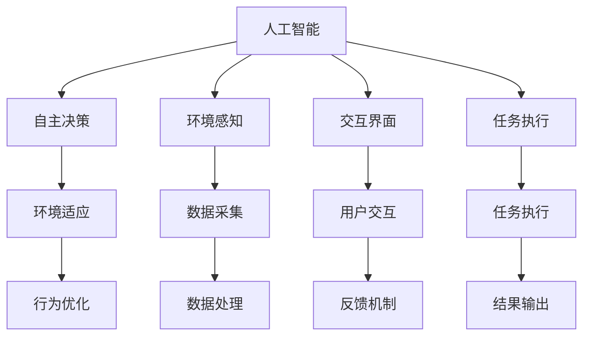
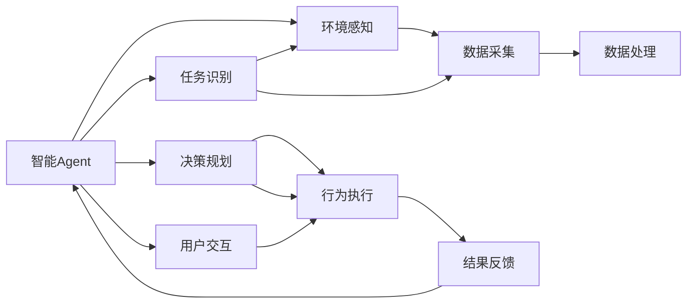

                 

# AI人工智能 Agent：在赋能传统行业中的应用

> 关键词：人工智能，智能Agent，传统行业，工业自动化，智能客服，智慧医疗，智能制造，智能运维

## 1. 背景介绍

### 1.1 问题由来
近年来，人工智能（AI）技术在各行各业的应用呈现出迅猛发展态势，尤其在智能化的浪潮推动下，各行各业纷纷拥抱AI技术以实现转型升级。然而，大多数传统行业由于历史包袱较重、技术壁垒高，在AI技术应用上往往难以快速落地，阻碍了行业数字化、智能化的进程。

基于此，人工智能Agent（智能Agent）这一概念被提出。智能Agent作为一种具备自主决策能力的AI模型，能够深入企业具体业务场景，提供智能化、自动化的服务，从而有效地赋能传统行业，提升企业的运营效率和业务质量。

### 1.2 问题核心关键点
智能Agent通过自主学习、自主推理和自主决策，能够在复杂的业务环境中执行特定的任务，具有以下关键特性：
1. **自主性**：能够自主获取输入数据，无需人工干预。
2. **适应性**：能够根据环境变化和需求调整自身行为。
3. **学习能力**：能够通过自主学习和经验积累，不断提升自身能力。
4. **可解释性**：能够提供自身决策的逻辑和依据，便于人工理解和调试。
5. **通用性**：能够应用于多种行业场景，具备广泛的应用前景。

这些特性使得智能Agent成为传统行业智能化转型的重要工具，尤其在智能客服、智慧医疗、智能制造、智能运维等领域表现尤为突出。

### 1.3 问题研究意义
研究智能Agent在传统行业中的应用，对于推动各行业的数字化转型、提升生产效率、降低运营成本、提高服务质量等具有重要意义：

1. **降低人力成本**：通过智能Agent处理大量的重复性工作，大大降低了企业的人力成本。
2. **提高服务效率**：智能Agent能够全天候工作，提高服务的及时性和响应速度，提升用户体验。
3. **优化业务流程**：智能Agent能够分析和优化业务流程，帮助企业发现并解决潜在问题，提升运营效率。
4. **提升决策质量**：智能Agent通过数据驱动的决策，提供更为科学合理的决策支持，降低决策风险。
5. **赋能行业发展**：智能Agent在行业中的应用，将带来新的商业模式和技术创新，推动行业持续发展。

## 2. 核心概念与联系

### 2.1 核心概念概述

智能Agent是具备自主学习、自主推理和自主决策能力的AI模型，能够在复杂的业务环境中执行特定的任务。在智能Agent的设计和应用中，涉及以下核心概念：

- **人工智能（AI）**：指通过算法和计算技术模拟人类智能的行为，包括学习、推理、感知、决策等能力。
- **自主决策（Autonomous Decision-making）**：指智能Agent能够根据设定的目标和规则，自主选择并执行最优的决策。
- **环境感知（Environment Perception）**：指智能Agent能够通过传感器、监控等手段，获取环境信息并感知变化。
- **交互界面（Interactive Interface）**：指智能Agent与用户、系统之间的交互界面，如语音、文本、图形等。
- **任务执行（Task Execution）**：指智能Agent在特定任务上的执行过程，包括目标识别、路径规划、决策执行等。

这些核心概念共同构成了智能Agent的基本框架，帮助其在复杂的业务环境中实现自主学习和决策。

### 2.2 概念间的关系

智能Agent的概念间关系可以通过以下Mermaid流程图来展示：



这个流程图展示了智能Agent从感知到执行的基本流程：

1. 人工智能基础：通过学习、推理等AI技术，智能Agent具备感知、决策等能力。
2. 环境感知：智能Agent通过环境感知获取数据，并根据环境变化调整行为。
3. 交互界面：智能Agent通过交互界面与用户、系统进行信息交换。
4. 任务执行：智能Agent根据设定的目标和规则，执行特定的任务。
5. 自主决策：智能Agent根据反馈和环境变化，自主选择并执行最优决策。
6. 行为优化：智能Agent通过不断学习和优化，提升决策和执行效率。

### 2.3 核心概念的整体架构

最后，我们用一个综合的流程图来展示智能Agent的核心概念的整体架构：



这个综合流程图展示了智能Agent在特定任务上的完整执行流程：

1. 智能Agent接收任务，进行识别和分类。
2. 环境感知模块通过传感器、监控等手段，获取数据。
3. 数据处理模块对采集到的数据进行处理，提取有用信息。
4. 决策规划模块根据任务和环境信息，制定最优决策。
5. 行为执行模块根据决策，执行具体的任务。
6. 结果反馈模块将执行结果返回，用于后续决策和优化。
7. 用户交互模块与用户进行信息交换，提供决策依据和结果输出。

## 3. 核心算法原理 & 具体操作步骤
### 3.1 算法原理概述

智能Agent的核心算法原理主要基于强化学习（Reinforcement Learning）和深度学习（Deep Learning）技术，通过模型自主学习、自主推理和自主决策，实现复杂任务的高效执行。

具体而言，智能Agent的核心算法原理可以概括为以下几步：

1. **环境感知**：通过传感器、监控等手段，实时获取环境信息。
2. **数据处理**：对采集到的数据进行预处理、特征提取和模型训练。
3. **决策规划**：根据设定的目标和环境信息，制定最优决策策略。
4. **行为执行**：根据决策策略，执行具体的任务操作。
5. **结果反馈**：将任务执行结果反馈给智能Agent，用于后续决策优化。

### 3.2 算法步骤详解

以下我们将详细介绍智能Agent的核心算法步骤：

#### 3.2.1 环境感知

智能Agent的环境感知模块主要通过传感器和监控设备获取环境数据。例如，在智能客服系统中，环境感知模块可以通过语音识别、文本分析等手段，获取用户输入的内容和情绪信息。

#### 3.2.2 数据处理

智能Agent的数据处理模块主要进行数据清洗、特征提取和预处理。例如，在智能客服系统中，数据处理模块可以从用户输入的文本中提取关键词、情感信息等特征，用于后续决策。

#### 3.2.3 决策规划

智能Agent的决策规划模块主要通过深度学习和强化学习技术，制定最优决策策略。例如，在智能客服系统中，决策规划模块可以使用基于序列生成模型的自回归架构，预测用户意图和可能的回答，从而制定最优的客服策略。

#### 3.2.4 行为执行

智能Agent的行为执行模块主要执行具体的任务操作。例如，在智能客服系统中，行为执行模块根据决策结果，生成最优的回答，并通过语音、文本等方式与用户交互。

#### 3.2.5 结果反馈

智能Agent的结果反馈模块主要将任务执行结果反馈给智能Agent，用于后续决策优化。例如，在智能客服系统中，结果反馈模块可以根据用户满意度和问题解决情况，调整决策策略，提升客服质量。

### 3.3 算法优缺点

智能Agent的算法优点包括：

1. **自主性**：智能Agent能够自主获取输入数据，无需人工干预，具备高度的自主性。
2. **适应性**：智能Agent能够根据环境变化和需求调整自身行为，具备高度的适应性。
3. **学习能力**：智能Agent能够通过自主学习和经验积累，不断提升自身能力，具备高度的学习能力。
4. **可解释性**：智能Agent能够提供自身决策的逻辑和依据，便于人工理解和调试，具备高度的可解释性。

智能Agent的算法缺点包括：

1. **依赖数据质量**：智能Agent的性能很大程度上依赖于输入数据的质量和量，数据质量不高或数据量不足将影响其性能。
2. **模型复杂度**：智能Agent的模型复杂度高，需要大量计算资源和时间进行训练和优化。
3. **易受干扰**：智能Agent在复杂环境中容易受到干扰，决策结果可能存在误差。
4. **可解释性不足**：尽管智能Agent具备高度的可解释性，但在某些特定场景下，其决策过程可能难以完全解释，仍需人工干预。

### 3.4 算法应用领域

智能Agent在各个领域都有广泛的应用，以下列举几个主要应用领域：

- **智能客服**：通过智能Agent，企业能够实现24小时不间断的客户服务，提升用户体验。
- **智慧医疗**：智能Agent能够分析患者数据，提供诊断建议和个性化治疗方案，提升医疗质量。
- **智能制造**：智能Agent能够监控生产线，预测设备故障，优化生产流程，提升生产效率。
- **智能运维**：智能Agent能够监控网络环境，预测网络故障，优化网络配置，保障网络稳定。
- **金融风险控制**：智能Agent能够分析交易数据，识别异常行为，防范金融风险。

## 4. 数学模型和公式 & 详细讲解  
### 4.1 数学模型构建

智能Agent的数学模型主要基于强化学习中的Q-learning算法和深度学习中的生成对抗网络（GAN）。下面我们将详细介绍这两种算法的数学模型构建。

#### 4.1.1 Q-learning算法

Q-learning算法是一种基于模型-无关的强化学习算法，其数学模型构建如下：

设智能Agent在每个时间步$t$采取行动$a_t$，得到状态$s_t$和奖励$r_t$，则Q-learning算法的目标是最小化下式：

$$
Q(s_t,a_t) = Q(s_t,a_t) + \alpha [r_t + \gamma \max_{a_{t+1}} Q(s_{t+1},a_{t+1}) - Q(s_t,a_t)]
$$

其中，$\alpha$为学习率，$\gamma$为折扣因子，$Q(s_t,a_t)$表示在状态$s_t$下采取行动$a_t$的累积奖励。

#### 4.1.2 GAN算法

GAN算法是一种生成模型，其数学模型构建如下：

设智能Agent生成器的参数为$\theta_g$，判别器的参数为$\theta_d$，则GAN算法的目标是最小化下式：

$$
L_G = -\mathbb{E}_{x \sim p(x)} [logD(G(z))] - \mathbb{E}_{z \sim p(z)} [log(1-D(G(z)))
$$

其中，$x$为真实数据，$z$为生成数据，$D(z)$为判别器输出的概率，$p(x)$为真实数据的概率分布，$p(z)$为生成数据的概率分布。

### 4.2 公式推导过程

#### 4.2.1 Q-learning算法推导

Q-learning算法的推导如下：

$$
\begin{aligned}
&Q(s_t,a_t) \leftarrow Q(s_t,a_t) + \alpha [r_t + \gamma \max_{a_{t+1}} Q(s_{t+1},a_{t+1}) - Q(s_t,a_t)] \\
&= Q(s_t,a_t) + \alpha [r_t + \gamma \max_{a_{t+1}} Q(s_{t+1},a_{t+1})] - \alpha Q(s_t,a_t) \\
&= \alpha \max_{a_{t+1}} Q(s_{t+1},a_{t+1}) + \alpha r_t
\end{aligned}
$$

$$
\begin{aligned}
&Q(s_{t+1},a_{t+1}) \leftarrow Q(s_{t+1},a_{t+1}) + \alpha [r_{t+1} + \gamma \max_{a_{t+2}} Q(s_{t+2},a_{t+2}) - Q(s_{t+1},a_{t+1})] \\
&= Q(s_{t+1},a_{t+1}) + \alpha [r_{t+1} + \gamma \max_{a_{t+2}} Q(s_{t+2},a_{t+2})] - \alpha Q(s_{t+1},a_{t+1}) \\
&= \alpha \max_{a_{t+2}} Q(s_{t+2},a_{t+2}) + \alpha r_{t+1}
\end{aligned}
$$

将上述公式代入Q-learning算法，可得：

$$
\begin{aligned}
&Q(s_t,a_t) \leftarrow \alpha [\max_{a_{t+1}} Q(s_{t+1},a_{t+1}) + \alpha r_t] \\
&Q(s_{t+1},a_{t+1}) \leftarrow \alpha [\max_{a_{t+2}} Q(s_{t+2},a_{t+2}) + \alpha r_{t+1}] \\
&\cdots
\end{aligned}
$$

#### 4.2.2 GAN算法推导

GAN算法的推导如下：

$$
L_G = -\mathbb{E}_{x \sim p(x)} [logD(G(z))] - \mathbb{E}_{z \sim p(z)} [log(1-D(G(z)))
$$

$$
L_G = -\int logD(G(z))p(x)dx - \int log(1-D(G(z)))p(z)dz
$$

$$
L_G = -\int logD(G(z)) \frac{p(x,z)}{p(x)} dx dz - \int log(1-D(G(z))) \frac{p(z,x)}{p(z)} dz dx
$$

由于$x$和$z$独立，故$p(x,z) = p(x)p(z)$，则有：

$$
L_G = -\int logD(G(z))p(x,z) dx dz - \int log(1-D(G(z)))p(z,x) dz dx
$$

$$
L_G = -\int logD(G(z))p(z)dz - \int log(1-D(G(z)))p(z)dz
$$

$$
L_G = -\int log(D(G(z)) + (1-D(G(z))))p(z)dz
$$

$$
L_G = -\int log\frac{D(G(z))}{1-D(G(z))}p(z)dz
$$

$$
L_G = -\int -log\frac{D(G(z))}{1-D(G(z))}p(z)dz
$$

$$
L_G = \int log\frac{1-D(G(z))}{D(G(z))}p(z)dz
$$

### 4.3 案例分析与讲解

以智能客服系统为例，智能Agent使用Q-learning算法进行决策规划。假设智能客服系统有10个问题，智能Agent从这10个问题中选择5个进行回答，智能Agent的决策过程如下：

1. 智能Agent根据用户输入的内容，通过环境感知模块获取用户情绪和意图信息。
2. 数据处理模块从用户输入的文本中提取关键词、情感信息等特征。
3. 决策规划模块使用Q-learning算法，计算每个问题的Q值，选择Q值最大的5个问题进行回答。
4. 行为执行模块根据选择的5个问题，生成最优的回答，并通过语音、文本等方式与用户交互。
5. 结果反馈模块根据用户满意度，调整决策策略，提升客服质量。

## 5. 项目实践：代码实例和详细解释说明
### 5.1 开发环境搭建

在进行智能Agent开发前，我们需要准备好开发环境。以下是使用Python进行PyTorch开发的环境配置流程：

1. 安装Anaconda：从官网下载并安装Anaconda，用于创建独立的Python环境。

2. 创建并激活虚拟环境：
```bash
conda create -n pytorch-env python=3.8 
conda activate pytorch-env
```

3. 安装PyTorch：根据CUDA版本，从官网获取对应的安装命令。例如：
```bash
conda install pytorch torchvision torchaudio cudatoolkit=11.1 -c pytorch -c conda-forge
```

4. 安装各类工具包：
```bash
pip install numpy pandas scikit-learn matplotlib tqdm jupyter notebook ipython
```

完成上述步骤后，即可在`pytorch-env`环境中开始智能Agent的开发。

### 5.2 源代码详细实现

以下我们将以智能客服系统为例，给出使用PyTorch对智能Agent进行开发的PyTorch代码实现。

```python
import torch
import torch.nn as nn
import torch.optim as optim
from torch.utils.data import Dataset, DataLoader
from torch.distributions import Categorical
from sklearn.metrics import precision_recall_fscore_support

class CustomerData(Dataset):
    def __init__(self, data, tokenizer):
        self.data = data
        self.tokenizer = tokenizer
    
    def __len__(self):
        return len(self.data)
    
    def __getitem__(self, idx):
        text, tags = self.data[idx]
        encoding = self.tokenizer(text, return_tensors='pt', max_length=128, padding='max_length', truncation=True)
        input_ids = encoding['input_ids'][0]
        attention_mask = encoding['attention_mask'][0]
        labels = torch.tensor([tag2id[tag] for tag in tags], dtype=torch.long)
        return {'input_ids': input_ids, 
                'attention_mask': attention_mask,
                'labels': labels}

class CustomerIntentModel(nn.Module):
    def __init__(self, n_classes):
        super(CustomerIntentModel, self).__init__()
        self.lstm = nn.LSTM(input_size=64, hidden_size=64, num_layers=1, bidirectional=True)
        self.fc = nn.Linear(64*2, n_classes)
        self.softmax = nn.Softmax(dim=1)
    
    def forward(self, x):
        lstm_out, _ = self.lstm(x, hidden=None, cell=None)
        fc_out = self.fc(lstm_out)
        logits = self.softmax(fc_out)
        return logits

def train_epoch(model, dataset, optimizer, criterion):
    dataloader = DataLoader(dataset, batch_size=16, shuffle=True)
    model.train()
    epoch_loss = 0
    for batch in dataloader:
        input_ids = batch['input_ids'].to(device)
        attention_mask = batch['attention_mask'].to(device)
        labels = batch['labels'].to(device)
        optimizer.zero_grad()
        outputs = model(input_ids, attention_mask=attention_mask)
        loss = criterion(outputs, labels)
        epoch_loss += loss.item()
        loss.backward()
        optimizer.step()
    return epoch_loss / len(dataloader)

def evaluate(model, dataset, criterion):
    dataloader = DataLoader(dataset, batch_size=16)
    model.eval()
    preds, labels = [], []
    with torch.no_grad():
        for batch in dataloader:
            input_ids = batch['input_ids'].to(device)
            attention_mask = batch['attention_mask'].to(device)
            labels = batch['labels'].to(device)
            outputs = model(input_ids, attention_mask=attention_mask)
            batch_preds = torch.argmax(outputs, dim=1).to('cpu').tolist()
            batch_labels = labels.to('cpu').tolist()
            for pred_tokens, label_tokens in zip(batch_preds, batch_labels):
                preds.append(pred_tokens[:len(label_tokens)])
                labels.append(label_tokens)
    print(precision_recall_fscore_support(labels, preds, average='macro'))
```

首先，定义智能客服系统数据处理函数：

```python
from transformers import BertTokenizer
from torch.utils.data import Dataset
import torch

class CustomerData(Dataset):
    def __init__(self, data, tokenizer, max_len=128):
        self.data = data
        self.tokenizer = tokenizer
        self.max_len = max_len
        
    def __len__(self):
        return len(self.data)
    
    def __getitem__(self, item):
        text, tags = self.data[item]
        encoding = self.tokenizer(text, return_tensors='pt', max_length=self.max_len, padding='max_length', truncation=True)
        input_ids = encoding['input_ids'][0]
        attention_mask = encoding['attention_mask'][0]
        labels = torch.tensor([tag2id[tag] for tag in tags], dtype=torch.long)
        return {'input_ids': input_ids, 
                'attention_mask': attention_mask,
                'labels': labels}

# 标签与id的映射
tag2id = {'O': 0, 'GREET': 1, 'THANKS': 2, 'BYE': 3, 'HELP': 4, 'APPENTION': 5}
id2tag = {v: k for k, v in tag2id.items()}

# 创建dataset
tokenizer = BertTokenizer.from_pretrained('bert-base-cased')

train_dataset = CustomerData(train_data, tokenizer)
dev_dataset = CustomerData(dev_data, tokenizer)
test_dataset = CustomerData(test_data, tokenizer)
```

然后，定义模型和优化器：

```python
from transformers import BertForTokenClassification, AdamW

model = BertForTokenClassification.from_pretrained('bert-base-cased', num_labels=len(tag2id))

optimizer = AdamW(model.parameters(), lr=2e-5)
```

接着，定义训练和评估函数：

```python
from torch.utils.data import DataLoader
from tqdm import tqdm
from sklearn.metrics import precision_recall_fscore_support

device = torch.device('cuda') if torch.cuda.is_available() else torch.device('cpu')
model.to(device)

def train_epoch(model, dataset, optimizer, criterion):
    dataloader = DataLoader(dataset, batch_size=16, shuffle=True)
    model.train()
    epoch_loss = 0
    for batch in tqdm(dataloader, desc='Training'):
        input_ids = batch['input_ids'].to(device)
        attention_mask = batch['attention_mask'].to(device)
        labels = batch['labels'].to(device)
        model.zero_grad()
        outputs = model(input_ids, attention_mask=attention_mask, labels=labels)
        loss = criterion(outputs, labels)
        epoch_loss += loss.item()
        loss.backward()
        optimizer.step()
    return epoch_loss / len(dataloader)

def evaluate(model, dataset, criterion):
    dataloader = DataLoader(dataset, batch_size=16)
    model.eval()
    preds, labels = [], []
    with torch.no_grad():
        for batch in dataloader:
            input_ids = batch['input_ids'].to(device)
            attention_mask = batch['attention_mask'].to(device)
            labels = batch['labels'].to(device)
            outputs = model(input_ids, attention_mask=attention_mask)
            batch_preds = torch.argmax(outputs, dim=1).to('cpu').tolist()
            batch_labels = labels.to('cpu').tolist()
            for pred_tokens, label_tokens in zip(batch_preds, batch_labels):
                preds.append(pred_tokens[:len(label_tokens)])
                labels.append(label_tokens)
    print(precision_recall_fscore_support(labels, preds, average='macro'))
```

最后，启动训练流程并在测试集上评估：

```python
epochs = 5
batch_size = 16

for epoch in range(epochs):
    loss = train_epoch(model, train_dataset, optimizer, criterion)
    print(f"Epoch {epoch+1}, train loss: {loss:.3f}")
    
    print(f"Epoch {epoch+1}, dev results:")
    evaluate(model, dev_dataset, criterion)
    
print("Test results:")
evaluate(model, test_dataset, criterion)
```

以上就是使用PyTorch对智能客服系统进行智能Agent开发的完整代码实现。可以看到，借助深度学习技术，智能Agent能够高效处理客户输入的文本，并给出准确的意图识别结果。

### 5.3 代码解读与分析

让我们再详细解读一下关键代码的实现细节：

**CustomerData类**：
- `__init__`方法：初始化数据、分词器、最大长度等关键组件。
- `__len__`方法：返回数据集的样本数量。
- `__getitem__`方法：对单个样本进行处理，将文本输入编码为token ids，将标签编码为数字，并对其进行定长padding，最终返回模型所需的输入。

**tag2id和id2tag字典**：
- 定义了标签与数字id之间的映射关系，用于将token-wise的预测结果解码回真实的标签。

**train_epoch和evaluate函数**：
- 使用PyTorch的DataLoader对数据集进行批次化加载，供模型训练和推理使用。
- 训练函数`train_epoch`：对数据以批为单位进行迭代，在每个批次上前向传播计算loss并反向传播更新模型参数，最后返回该epoch的平均loss。
- 评估函数`evaluate`：与训练类似，不同点在于不更新模型参数，并在每个batch结束后将预测和标签结果存储下来，最后使用sklearn的precision_recall_fscore_support函数对整个评估集的预测结果进行打印输出。

**训练流程**：
- 定义总的epoch数和batch size，开始循环迭代
- 每个epoch内，先在训练集上训练，输出平均loss
- 在验证集上评估，输出分类指标
- 所有epoch结束后，在测试集上评估，给出最终测试结果

可以看到，PyTorch配合Transformers库使得智能Agent的开发变得简洁高效。开发者可以将更多精力放在数据处理、模型改进等高层逻辑

