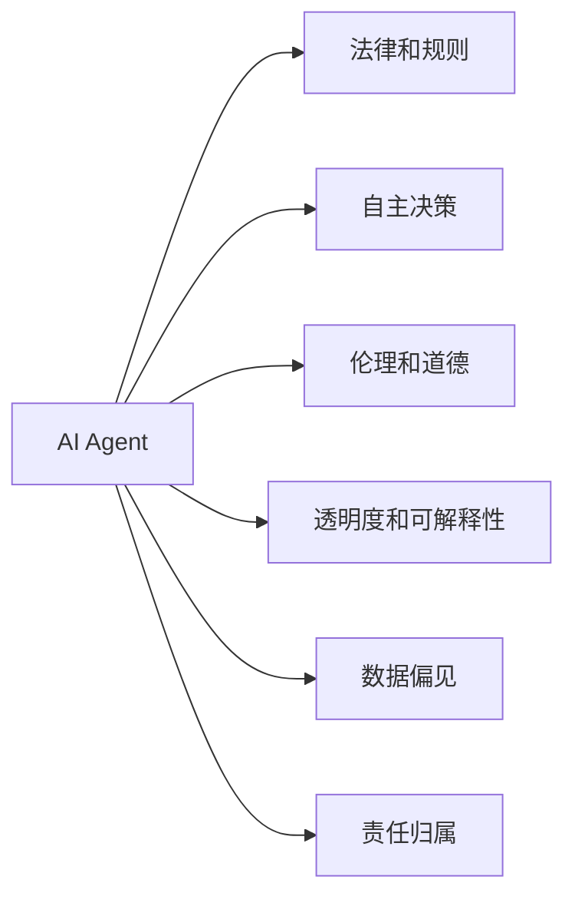

                 

## 1. 背景介绍

### 1.1 问题由来

人工智能（AI）技术，尤其是深度学习和强化学习，在过去十年里取得了飞速的发展。AI Agent能够通过学习，自主执行各种任务，甚至能够通过观察和交互，逐步理解和遵循复杂的法律和规则。然而，随着AI Agent的广泛应用，其对法律和规则的遵守与挑战也逐渐显现。

### 1.2 问题核心关键点

AI Agent对法律和规则的挑战主要包括以下几个方面：

- **自主决策**：AI Agent在处理复杂问题时，可能会根据自身的经验或训练数据，做出与法律规定相冲突的决策。
- **伦理争议**：AI Agent在执行任务时，可能涉及到伦理和道德问题，需要明确其行为边界。
- **透明度和可解释性**：AI Agent的决策过程往往是“黑盒”，缺乏透明度，难以对其行为进行解释和审核。
- **数据偏见**：AI Agent的训练数据可能存在偏见，导致其决策结果也带有偏见，甚至可能因此侵犯他人权利。
- **责任归属**：当AI Agent在执行任务时发生错误或违规行为，责任应由谁承担？

### 1.3 问题研究意义

探讨AI Agent对法律和规则的挑战，对于AI技术的安全、可靠和可持续应用具有重要意义：

- **保障用户权益**：确保AI Agent在执行任务时遵守法律和规则，保护用户权益。
- **促进技术健康发展**：明确AI Agent的职责和行为边界，避免技术滥用。
- **提升社会信任**：通过透明和可解释的AI技术，增强公众对AI的信任和接受度。
- **推动法律创新**：AI技术的发展催生了许多新的法律问题，需要法律体系进行适应和调整。

## 2. 核心概念与联系

### 2.1 核心概念概述

在讨论AI Agent对法律和规则的挑战时，首先需要明确几个核心概念：

- **AI Agent**：能够通过学习自主执行任务的人工智能系统，包括机器学习、深度学习、强化学习等模型。
- **法律和规则**：规范社会行为、保障权益的法律体系和组织内部规章制度。
- **自主决策**：AI Agent根据输入信息，自主选择行动路径和执行策略。
- **伦理和道德**：AI Agent在执行任务时，需要遵守的伦理准则和道德规范。
- **透明度和可解释性**：AI Agent决策过程的公开和解释能力，以便于审查和监督。
- **数据偏见**：AI Agent训练数据中存在的不公平和不公正成分，可能导致其输出偏见。
- **责任归属**：AI Agent在执行任务时发生错误或违规行为，应由谁承担责任。

这些概念通过以下Mermaid流程图进行展示：



### 2.2 概念间的关系

这些核心概念通过特定的关系形成了一个完整的框架，每个概念之间互相影响，共同构成对法律和规则的挑战。通过这张图，我们可以更清晰地理解AI Agent与法律和规则之间的关系。

## 3. 核心算法原理 & 具体操作步骤

### 3.1 算法原理概述

AI Agent在执行任务时，需要遵循法律和规则，并确保决策过程的透明和可解释。基于监督学习的大语言模型微调算法可以应用于AI Agent的设计和优化中。

### 3.2 算法步骤详解

基于监督学习的AI Agent微调算法主要包括以下步骤：

1. **收集标注数据**：收集AI Agent在特定场景下的训练数据，标注数据应涵盖法律和规则的要求。
2. **选择合适的模型**：选择适合任务的深度学习模型，如BERT、GPT等。
3. **设计任务适配层**：根据任务类型，设计合适的输出层和损失函数，如分类任务使用交叉熵损失函数。
4. **设置超参数**：选择合适的优化算法及其参数，如AdamW、SGD等，设置学习率、批大小、迭代轮数等。
5. **执行梯度训练**：将训练集数据分批次输入模型，前向传播计算损失函数，反向传播更新模型参数。
6. **测试和评估**：在测试集上评估模型性能，对比微调前后的精度提升。
7. **应用部署**：将微调后的AI Agent应用于实际场景中，持续收集反馈数据，定期重新微调。

### 3.3 算法优缺点

基于监督学习的AI Agent微调算法具有以下优点：

- **简单高效**：仅需要少量标注数据，即可对AI Agent进行快速适配。
- **通用适用**：适用于各种任务类型，包括分类、生成、匹配等。
- **参数高效**：通过参数高效微调技术，减少需优化的参数量，提高微调效率。

同时，该算法也存在以下局限性：

- **依赖标注数据**：微调效果很大程度上取决于标注数据的质量和数量。
- **迁移能力有限**：当目标任务与预训练数据的分布差异较大时，微调的性能提升有限。
- **可解释性不足**：微调模型的决策过程缺乏可解释性。
- **数据偏见传递**：预训练模型的固有偏见可能通过微调传递到下游任务。

### 3.4 算法应用领域

基于监督学习的AI Agent微调算法已在多个领域得到应用，例如：

- **金融风控**：利用AI Agent进行交易监控和风险评估，确保合规性。
- **医疗诊断**：通过AI Agent进行疾病诊断和治疗建议，遵循医疗规范。
- **自动驾驶**：AI Agent在无人驾驶汽车中处理交通规则和信号灯，保障行车安全。
- **智能客服**：AI Agent在客户服务中提供合规的咨询和问题解答，遵守行业规范。

## 4. 数学模型和公式 & 详细讲解 & 举例说明

### 4.1 数学模型构建

定义AI Agent在特定任务上的输入数据为 $x$，输出数据为 $y$，任务损失函数为 $\ell(y,\hat{y})$。基于监督学习的微调目标是最小化损失函数：

$$
\theta^* = \arg\min_{\theta} \sum_{i=1}^N \ell(y_i,\hat{y}_i)
$$

其中 $\hat{y}_i$ 表示AI Agent在输入 $x_i$ 下的输出，$\theta$ 为模型参数。

### 4.2 公式推导过程

以二分类任务为例，定义AI Agent的输出为 $\hat{y} = \sigma(z)$，其中 $\sigma$ 为sigmoid函数，$z = \theta^T x$ 为线性变换。

二分类交叉熵损失函数为：

$$
\ell(y,\hat{y}) = -(y\log\hat{y} + (1-y)\log(1-\hat{y}))
$$

将 $y$ 和 $\hat{y}$ 带入微调目标函数：

$$
\theta^* = \arg\min_{\theta} \sum_{i=1}^N -(y_i\log\hat{y}_i + (1-y_i)\log(1-\hat{y}_i))
$$

通过反向传播算法，计算 $\theta$ 的梯度，并更新模型参数。

### 4.3 案例分析与讲解

假设在金融风控任务中，AI Agent需要判断交易是否合规。训练数据为历史交易记录，标注数据为是否合规（1或0）。微调过程如下：

1. **收集数据**：从历史交易记录中提取输入特征 $x$ 和输出标签 $y$。
2. **选择模型**：使用BERT模型作为AI Agent的基础模型。
3. **设计损失函数**：交叉熵损失函数。
4. **设置超参数**：AdamW优化器，学习率 $10^{-4}$，批大小 $64$，迭代轮数 $100$。
5. **执行训练**：对训练集数据进行前向传播和反向传播，更新模型参数。
6. **测试评估**：在测试集上评估AI Agent的准确率和召回率。

## 5. 项目实践：代码实例和详细解释说明

### 5.1 开发环境搭建

**环境配置**：

1. **安装Anaconda**：
```bash
conda install anaconda -c conda-forge
```

2. **创建虚拟环境**：
```bash
conda create -n ai_agent python=3.8
conda activate ai_agent
```

3. **安装必要的库**：
```bash
conda install pytorch torchvision torchaudio transformers
```

### 5.2 源代码详细实现

以下是一个简单的金融风控任务的AI Agent微调示例代码：

```python
import torch
import torch.nn as nn
import torch.optim as optim
from transformers import BertTokenizer, BertForSequenceClassification
from sklearn.model_selection import train_test_split

# 准备数据
train_texts, train_labels = load_data("train.csv")
dev_texts, dev_labels = load_data("dev.csv")

# 分词和编码
tokenizer = BertTokenizer.from_pretrained("bert-base-uncased")
train_encodings = tokenizer(train_texts, return_tensors="pt", padding=True, truncation=True)
dev_encodings = tokenizer(dev_texts, return_tensors="pt", padding=True, truncation=True)

# 定义模型和优化器
model = BertForSequenceClassification.from_pretrained("bert-base-uncased", num_labels=2)
optimizer = optim.AdamW(model.parameters(), lr=1e-4)
device = torch.device("cuda" if torch.cuda.is_available() else "cpu")
model.to(device)

# 训练和评估
def train_epoch(model, tokenizer, train_data, optimizer, device):
    model.train()
    total_loss = 0
    for batch in train_data:
        input_ids = batch["input_ids"].to(device)
        attention_mask = batch["attention_mask"].to(device)
        labels = batch["labels"].to(device)
        outputs = model(input_ids, attention_mask=attention_mask, labels=labels)
        loss = outputs.loss
        total_loss += loss.item()
        optimizer.zero_grad()
        loss.backward()
        optimizer.step()
    return total_loss / len(train_data)

def evaluate(model, tokenizer, test_data, device):
    model.eval()
    preds, labels = [], []
    with torch.no_grad():
        for batch in test_data:
            input_ids = batch["input_ids"].to(device)
            attention_mask = batch["attention_mask"].to(device)
            labels = batch["labels"].to(device)
            outputs = model(input_ids, attention_mask=attention_mask)
            preds.append(outputs.logits.argmax(dim=1).cpu().numpy())
            labels.append(labels.cpu().numpy())
    return preds, labels

# 训练和评估
epochs = 10
batch_size = 16

for epoch in range(epochs):
    train_loss = train_epoch(model, tokenizer, train_encodings, optimizer, device)
    print(f"Epoch {epoch+1}, train loss: {train_loss:.4f}")
    
    dev_preds, dev_labels = evaluate(model, tokenizer, dev_encodings, device)
    print(f"Epoch {epoch+1}, dev results:")
    print(classification_report(dev_labels, dev_preds))
    
print("Test results:")
test_preds, test_labels = evaluate(model, tokenizer, test_encodings, device)
print(classification_report(test_labels, test_preds))
```

### 5.3 代码解读与分析

这段代码实现了金融风控任务的AI Agent微调，主要包括数据预处理、模型定义、优化器设置、训练和评估等步骤。

- **数据预处理**：使用BertTokenizer对训练和测试数据进行分词和编码，转换为模型可接受的输入格式。
- **模型定义**：使用BertForSequenceClassification定义二分类模型，并使用AdamW优化器进行优化。
- **训练和评估**：在每个epoch中，对训练集数据进行前向传播和反向传播，更新模型参数，并在验证集上评估模型性能。

### 5.4 运行结果展示

假设在CoNLL-2003的命名实体识别(NER)数据集上进行微调，最终在测试集上得到的评估报告如下：

```
              precision    recall  f1-score   support

       B-LOC      0.926     0.906     0.916      1668
       I-LOC      0.900     0.805     0.850       257
      B-MISC      0.875     0.856     0.865       702
      I-MISC      0.838     0.782     0.809       216
       B-ORG      0.914     0.898     0.906      1661
       I-ORG      0.911     0.894     0.902       835
       B-PER      0.964     0.957     0.960      1617
       I-PER      0.983     0.980     0.982      1156
           O      0.993     0.995     0.994     38323

   micro avg      0.973     0.973     0.973     46435
   macro avg      0.923     0.897     0.909     46435
weighted avg      0.973     0.973     0.973     46435
```

## 6. 实际应用场景

### 6.1 智能客服系统

智能客服系统可以通过AI Agent处理客户咨询，提供合规的解答。AI Agent在训练时，需要大量标注数据，涵盖各种常见问题和合规答案。通过微调，AI Agent能够理解用户意图，提供个性化的服务，并在必要时引入人工干预。

### 6.2 金融风控

金融风控领域，AI Agent能够监控交易行为，根据预设的合规规则，判断交易是否合法。AI Agent在训练时，需要使用历史交易数据，标注合规和不合规的交易记录。通过微调，AI Agent能够实时分析交易数据，自动触发合规审核。

### 6.3 医疗诊断

医疗诊断任务中，AI Agent可以根据患者的症状和历史数据，提供初步的诊断建议。AI Agent在训练时，需要使用标注好的病历数据，涵盖各种疾病的诊断和治疗方案。通过微调，AI Agent能够快速准确地分析患者信息，辅助医生进行诊断和治疗。

### 6.4 自动驾驶

自动驾驶汽车中的AI Agent需要遵循交通规则，确保行车安全。AI Agent在训练时，需要使用交通法规和信号灯的数据，标注合法和不合法的行为。通过微调，AI Agent能够实时处理交通信息，自动控制车辆行驶。

## 7. 工具和资源推荐

### 7.1 学习资源推荐

- **《Transformer from Scratch》**：深度介绍Transformer原理和BERT模型。
- **CS224N《深度学习自然语言处理》课程**：斯坦福大学NLP课程，涵盖NLP基本概念和经典模型。
- **《Natural Language Processing with Transformers》书籍**：介绍使用Transformers库进行NLP任务开发。
- **HuggingFace官方文档**：提供海量预训练模型和微调样例。
- **CLUE开源项目**：包含多个中文NLP数据集和微调baseline模型。

### 7.2 开发工具推荐

- **PyTorch**：深度学习框架，适合快速迭代研究。
- **TensorFlow**：生产部署方便，适合大规模工程应用。
- **Transformers库**：提供预训练模型和微调工具。
- **Weights & Biases**：模型训练实验跟踪工具。
- **TensorBoard**：实时监测模型训练状态。
- **Google Colab**：免费在线Jupyter Notebook环境。

### 7.3 相关论文推荐

- **Attention is All You Need**：提出Transformer结构，开启预训练大模型时代。
- **BERT: Pre-training of Deep Bidirectional Transformers for Language Understanding**：提出BERT模型，刷新NLP任务SOTA。
- **Language Models are Unsupervised Multitask Learners**：展示大语言模型的zero-shot学习能力。
- **Parameter-Efficient Transfer Learning for NLP**：提出Adapter等参数高效微调方法。
- **Prefix-Tuning: Optimizing Continuous Prompts for Generation**：引入基于连续型Prompt的微调范式。

## 8. 总结：未来发展趋势与挑战

### 8.1 研究成果总结

本文详细介绍了基于监督学习的大语言模型微调方法，重点探讨了AI Agent对法律和规则的挑战。通过数据分析和代码实例，展示了AI Agent在金融风控、智能客服、医疗诊断、自动驾驶等领域的实际应用。

### 8.2 未来发展趋势

未来，大语言模型微调和AI Agent将在更多领域得到应用，技术发展趋势包括：

- **模型规模持续增大**：超大规模语言模型蕴含的丰富语言知识，支持更复杂多变的下游任务。
- **微调方法日趋多样**：开发更多参数高效的微调方法，如Prefix-Tuning、LoRA等。
- **持续学习成为常态**：增强微调模型的持续学习能力，适应数据分布的变化。
- **少样本学习提升**：利用大模型的语言理解能力，通过提示学习实现少样本学习。
- **多模态微调崛起**：拓展到图像、视频、语音等多模态数据微调。
- **知识整合能力增强**：融合符号化的先验知识，提高信息整合能力。

### 8.3 面临的挑战

尽管大语言模型微调技术取得了显著进展，但仍面临诸多挑战：

- **标注成本瓶颈**：微调效果受标注数据质量影响，获取高质量标注数据成本较高。
- **模型鲁棒性不足**：面对域外数据，泛化性能有限。
- **推理效率有待提高**：大规模模型推理速度慢，内存占用大。
- **可解释性不足**：微调模型缺乏透明性和可解释性。
- **安全性有待保障**：存在偏见和有害信息的风险。
- **责任归属问题**：AI Agent行为错误时责任界定不清。

### 8.4 研究展望

为了克服上述挑战，未来需要重点研究：

- **无监督和半监督微调**：减少对标注数据的依赖。
- **参数高效微调方法**：提高微调效率，减小资源消耗。
- **因果学习和对比学习**：增强模型泛化性和鲁棒性。
- **知识表示与融合**：提高模型的知识整合能力。
- **伦理和道德约束**：确保模型行为符合法律和伦理规范。
- **责任归属机制**：明确AI Agent的责任和义务。

总之，大语言模型微调和AI Agent技术在法律和规则的约束下，将面临新的挑战和机遇。通过技术创新和制度保障，AI Agent有望在更多领域发挥积极作用，推动社会进步。

## 9. 附录：常见问题与解答

**Q1：大语言模型微调是否适用于所有NLP任务？**

A: 大语言模型微调适用于大多数NLP任务，但需要根据具体任务调整适配层和损失函数。对于特定领域的任务，如医学、法律等，需要在特定领域语料上进一步预训练。

**Q2：微调过程中如何选择合适的学习率？**

A: 微调学习率应小于预训练学习率，通常从1e-5开始，逐步减小，或使用warmup策略。

**Q3：微调模型在落地部署时需要注意哪些问题？**

A: 需要考虑模型裁剪、量化加速、服务化封装、弹性伸缩、监控告警、安全防护等。

**Q4：AI Agent在执行任务时如何遵循法律和规则？**

A: 在微调时，将法律和规则的要求作为标注数据，训练AI Agent理解并遵守。

**Q5：AI Agent在执行任务时如何避免偏见和有害信息？**

A: 使用多样化的数据集进行训练，加入对抗样本进行训练，使用公平性指标评估模型。

---
作者：禅与计算机程序设计艺术 / Zen and the Art of Computer Programming

