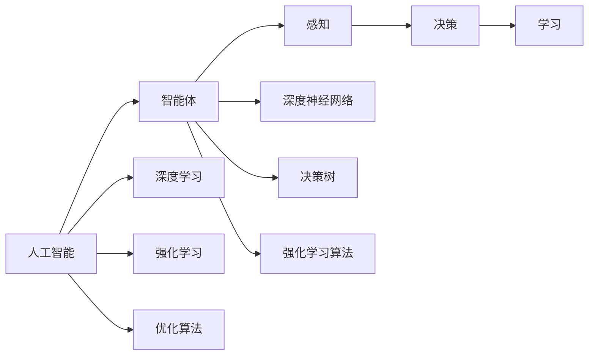
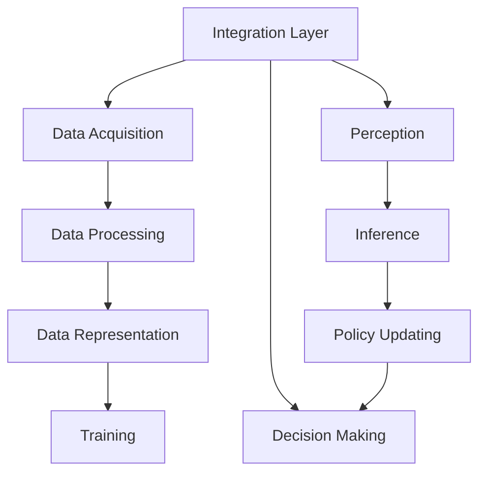
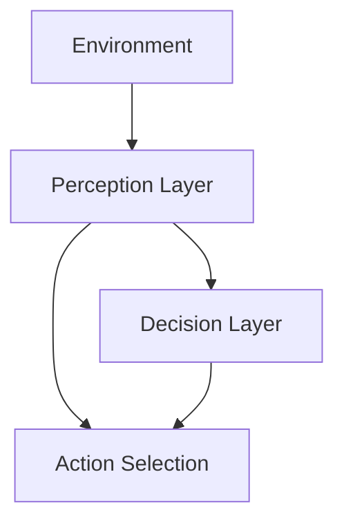
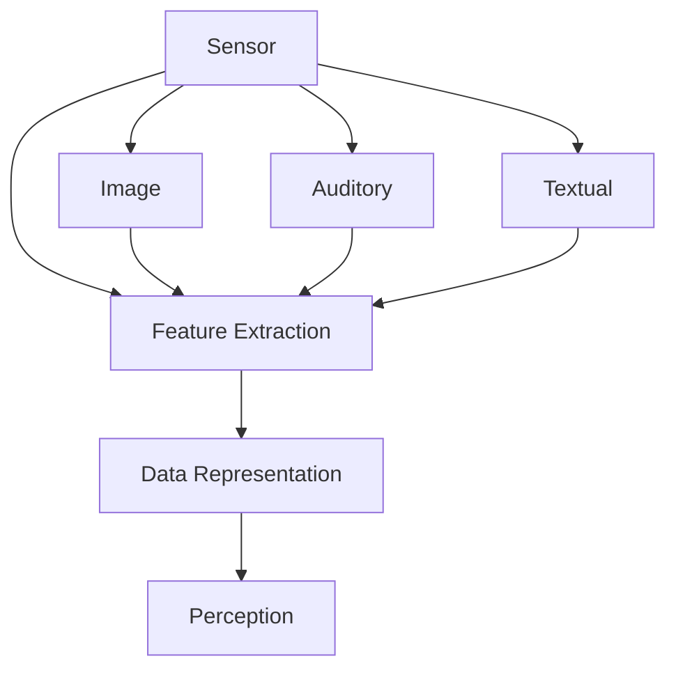
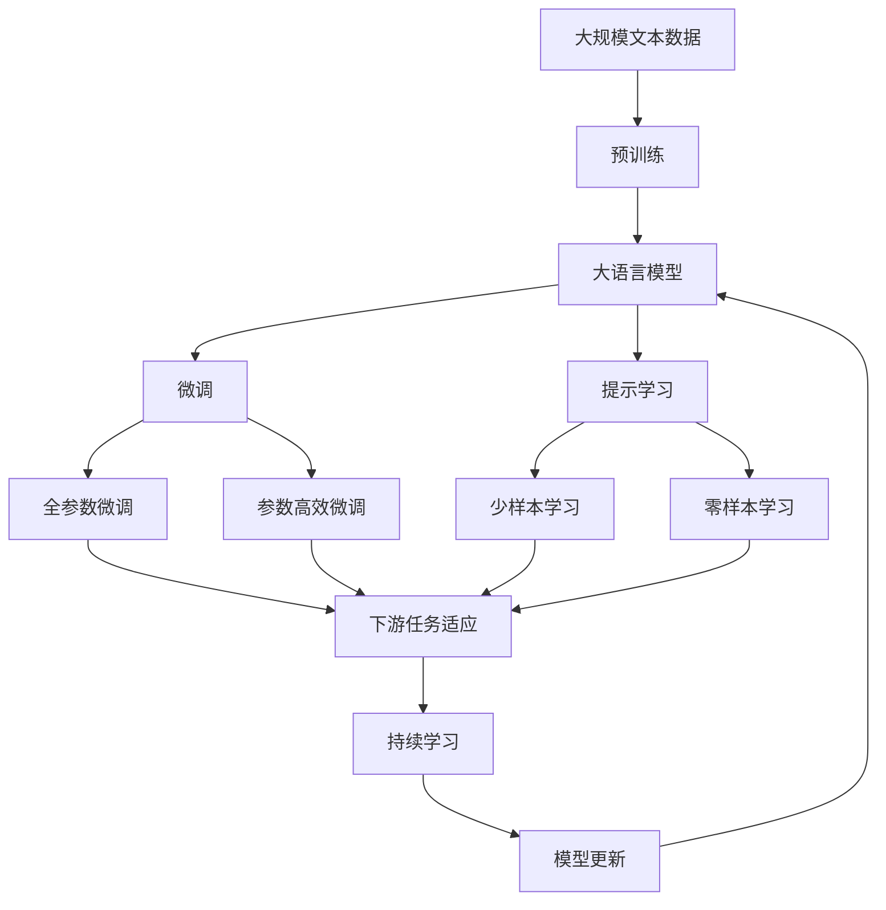
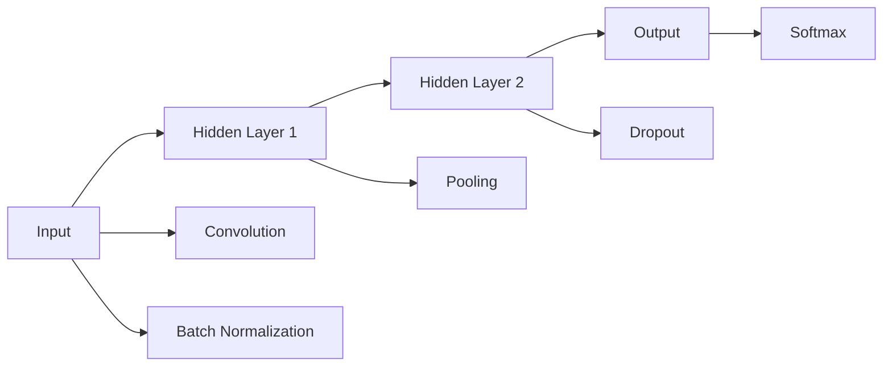

                 

# AI人工智能 Agent：理解和应用智能体的感知机制

## 1. 背景介绍

### 1.1 问题由来

人工智能（AI）作为21世纪最为前沿的技术之一，正在迅速改变我们的生活方式和工作方式。无论是智能助手、自动驾驶、机器人还是虚拟现实，AI的广泛应用离不开智能体的感知和决策能力。

近年来，随着深度学习、强化学习等技术的发展，智能体的感知和决策能力得到了极大的提升。然而，如何理解和应用智能体的感知机制，仍然是一个需要深入研究的课题。智能体的感知机制不仅涉及算法和技术，还涉及到心理学、认知科学等多个领域。

本文将从多个维度探讨智能体的感知机制，包括其核心概念、数学模型、算法原理、实际应用场景以及未来发展趋势和挑战。

## 2. 核心概念与联系

### 2.1 核心概念概述

为更好地理解智能体的感知机制，本节将介绍几个密切相关的核心概念：

- 人工智能（Artificial Intelligence, AI）：一种使计算机系统能够执行通常需要人类智能的任务的技术，如语言理解、图像识别、决策制定等。
- 智能体（Agent）：能够感知环境、采取行动、并据此进行学习和决策的实体，可以是软件、硬件、机器人等。
- 感知（Perception）：智能体获取环境信息的过程，是智能体进行决策的基础。
- 决策（Decision Making）：智能体基于感知到的信息，选择并执行行动的过程。
- 学习（Learning）：智能体通过与环境交互，更新自身策略和知识的过程，是智能体适应环境的关键。

这些核心概念之间的逻辑关系可以通过以下Mermaid流程图来展示：



这个流程图展示了智能体与人工智能之间的关系，以及智能体感知、决策和学习的核心过程。通过理解这些核心概念，我们可以更好地把握智能体的感知机制及其应用。

### 2.2 概念间的关系

这些核心概念之间存在着紧密的联系，形成了智能体感知和决策的完整生态系统。下面我们通过几个Mermaid流程图来展示这些概念之间的关系。

#### 2.2.1 智能体的学习过程



这个流程图展示了智能体的学习过程，从数据获取、处理、表示，到训练和策略更新。感知层（Perception Layer）从环境中获取数据，并通过神经网络（如深度神经网络）进行处理和表示，然后训练模型更新决策策略。

#### 2.2.2 智能体的感知与决策



这个流程图展示了智能体的感知和决策过程，感知层从环境中获取信息，决策层基于感知信息进行选择和决策，并通过动作选择层执行决策。

#### 2.2.3 智能体的感知机制



这个流程图展示了智能体的感知机制，传感器（如摄像头、麦克风、传感器等）获取环境信息，通过特征提取和数据表示，形成感知输入。智能体可以从视觉、听觉、文本等多个模态获取感知输入。

### 2.3 核心概念的整体架构

最后，我们用一个综合的流程图来展示这些核心概念在大语言模型微调过程中的整体架构：



这个综合流程图展示了从预训练到微调，再到持续学习的完整过程。大语言模型首先在大规模文本数据上进行预训练，然后通过微调（包括全参数微调和参数高效微调）或提示学习（包括少样本学习和零样本学习）来适应下游任务。最后，通过持续学习技术，模型可以不断学习新知识，同时避免遗忘旧知识。

## 3. 核心算法原理 & 具体操作步骤

### 3.1 算法原理概述

智能体的感知机制涉及感知、学习和决策等多个过程。本文重点探讨基于深度学习的智能体感知机制，其核心算法原理主要包括以下几个方面：

- 感知层：通过传感器获取环境信息，并通过特征提取和数据表示，形成感知输入。
- 决策层：基于感知输入，通过神经网络等模型进行推理和决策。
- 学习层：通过优化算法更新模型参数，使智能体适应环境变化。

智能体的感知机制可以分为两大类：感知-动作循环和感知-决策循环。感知-动作循环适用于机器人等需要连续执行动作的实体，而感知-决策循环适用于需要长期决策和记忆的实体，如人类。

### 3.2 算法步骤详解

智能体的感知机制涉及多个步骤，以下是具体的算法步骤：

**Step 1: 数据采集与预处理**
- 使用传感器（如摄像头、麦克风、传感器等）采集环境数据。
- 对采集的数据进行预处理，如去噪、滤波、归一化等，以提高感知质量。
- 将处理后的数据转化为数字信号，如将图像数据转化为像素值矩阵。

**Step 2: 特征提取**
- 对数字信号进行特征提取，如将图像数据转化为特征向量，通过卷积神经网络（CNN）或循环神经网络（RNN）等模型提取特征。
- 特征提取的目标是将原始数据转换为高维特征表示，以便后续进行学习和决策。

**Step 3: 数据表示**
- 对提取的特征进行数据表示，如将特征向量转化为向量或张量，以便神经网络进行处理。
- 常用的数据表示方法包括深度神经网络（DNN）、卷积神经网络（CNN）、循环神经网络（RNN）等。

**Step 4: 感知与决策**
- 将表示后的数据输入神经网络进行感知，即通过神经网络对感知数据进行推理。
- 决策层基于感知结果，通过优化算法更新模型参数，如使用强化学习算法进行策略更新。
- 最终决策层输出动作，执行感知-动作循环或感知-决策循环。

**Step 5: 学习与优化**
- 通过优化算法（如梯度下降、Adam、RMSprop等）更新模型参数，使智能体适应环境变化。
- 常用的优化算法包括随机梯度下降（SGD）、Adam、RMSprop、Adagrad等。
- 优化目标是通过最小化损失函数（如交叉熵损失、均方误差损失等），提高智能体的感知和决策能力。

### 3.3 算法优缺点

智能体的感知机制具有以下优点：

- 高效性：通过深度神经网络等模型，智能体可以高效地处理大量感知数据。
- 适应性：通过优化算法，智能体可以适应环境变化，不断学习新的感知和决策策略。
- 鲁棒性：通过正则化技术（如L2正则、Dropout等），智能体可以避免过拟合，提高鲁棒性。

同时，智能体的感知机制也存在以下缺点：

- 数据依赖性：智能体的感知能力依赖于高质量的数据，数据获取和处理成本较高。
- 模型复杂性：深度神经网络等模型复杂，训练和推理成本较高。
- 可解释性不足：智能体的决策过程缺乏可解释性，难以对其推理逻辑进行分析和调试。

### 3.4 算法应用领域

智能体的感知机制在多个领域得到了广泛应用，包括但不限于：

- 自动驾驶：通过摄像头、雷达、激光雷达等传感器获取环境信息，通过神经网络进行处理和决策，实现自动驾驶。
- 智能助手：通过麦克风、摄像头等传感器获取用户输入，通过自然语言处理（NLP）模型进行处理和决策，实现智能对话。
- 机器人：通过传感器获取环境信息，通过神经网络进行处理和决策，实现机器人自主导航和操作。
- 虚拟现实：通过摄像头、麦克风等传感器获取用户输入，通过深度神经网络进行处理和决策，实现虚拟现实互动。
- 医疗诊断：通过影像传感器获取患者影像数据，通过深度神经网络进行处理和决策，辅助医生进行诊断和治疗。
- 金融交易：通过市场数据传感器获取市场信息，通过深度神经网络进行处理和决策，实现智能投资和交易。

## 4. 数学模型和公式 & 详细讲解 & 举例说明

### 4.1 数学模型构建

在智能体的感知机制中，数学模型通常采用深度神经网络（DNN）等模型，其核心数学模型包括感知层、决策层和优化层。

感知层的数学模型如下：

$$
\mathbf{z} = \mathbf{W} \mathbf{x} + \mathbf{b}
$$

其中，$\mathbf{z}$ 为感知输出，$\mathbf{x}$ 为感知输入，$\mathbf{W}$ 为权重矩阵，$\mathbf{b}$ 为偏置向量。

决策层的数学模型如下：

$$
\hat{y} = \sigma(\mathbf{z})
$$

其中，$\hat{y}$ 为决策输出，$\sigma$ 为激活函数（如Sigmoid、ReLU等）。

优化层的数学模型如下：

$$
\mathbf{\theta} = \mathbf{\theta} - \eta \nabla_{\mathbf{\theta}} \mathcal{L}
$$

其中，$\mathbf{\theta}$ 为模型参数，$\eta$ 为学习率，$\nabla_{\mathbf{\theta}} \mathcal{L}$ 为损失函数对参数的梯度，$\mathcal{L}$ 为损失函数。

### 4.2 公式推导过程

以下我们将以图像分类任务为例，推导深度神经网络（DNN）的数学模型及其梯度计算公式。

假设输入图像数据为 $x_1, x_2, \cdots, x_n$，输出标签为 $y_1, y_2, \cdots, y_n$，神经网络结构如图：



感知层的数学模型为：

$$
\mathbf{h}_1 = \mathbf{W}_1 \mathbf{x} + \mathbf{b}_1
$$

其中，$\mathbf{x}$ 为输入图像数据，$\mathbf{W}_1$ 为权重矩阵，$\mathbf{b}_1$ 为偏置向量。

决策层的数学模型为：

$$
\mathbf{h}_2 = \mathbf{W}_2 \mathbf{h}_1 + \mathbf{b}_2
$$

其中，$\mathbf{h}_1$ 为隐藏层输出，$\mathbf{W}_2$ 为权重矩阵，$\mathbf{b}_2$ 为偏置向量。

输出层的数学模型为：

$$
\hat{y} = \mathbf{W}_3 \mathbf{h}_2 + \mathbf{b}_3
$$

其中，$\mathbf{h}_2$ 为隐藏层输出，$\mathbf{W}_3$ 为权重矩阵，$\mathbf{b}_3$ 为偏置向量。

交叉熵损失函数的数学模型为：

$$
\mathcal{L} = -\frac{1}{N} \sum_{i=1}^N \sum_{j=1}^C y_{ij} \log \hat{y}_{ij}
$$

其中，$N$ 为样本数量，$C$ 为类别数量，$y_{ij}$ 为标签矩阵，$\hat{y}_{ij}$ 为预测概率。

对于输出层，损失函数对参数 $\mathbf{W}_3$ 和 $\mathbf{b}_3$ 的梯度计算公式为：

$$
\frac{\partial \mathcal{L}}{\partial \mathbf{W}_3} = -\frac{1}{N} \sum_{i=1}^N \sum_{j=1}^C y_{ij} (\hat{y}_{ij} - y_{ij})
$$

$$
\frac{\partial \mathcal{L}}{\partial \mathbf{b}_3} = -\frac{1}{N} \sum_{i=1}^N \sum_{j=1}^C (\hat{y}_{ij} - y_{ij})
$$

通过上述公式，我们可以计算出神经网络的损失函数和梯度，从而进行模型的训练和优化。

### 4.3 案例分析与讲解

我们以图像分类任务为例，通过一个简单的案例来展示智能体感知机制的实现过程。

假设我们要训练一个神经网络对手写数字进行分类，数据集为MNIST数据集。我们的神经网络结构为两层全连接神经网络，每层有256个神经元。

1. **数据预处理**：将图像数据归一化到[0,1]范围内，并将标签转换为独热编码形式。

2. **感知层**：使用全连接层对图像数据进行特征提取，得到256维的特征向量。

3. **决策层**：使用全连接层对256维特征向量进行分类，得到10维的预测概率向量。

4. **输出层**：使用Softmax函数将预测概率向量转化为类别概率分布。

5. **损失函数**：使用交叉熵损失函数对预测结果进行评估，计算模型损失。

6. **优化算法**：使用随机梯度下降（SGD）算法进行模型优化，更新模型参数。

以下是用PyTorch实现该神经网络的代码示例：

```python
import torch
import torch.nn as nn
import torch.optim as optim

# 定义神经网络模型
class Net(nn.Module):
    def __init__(self):
        super(Net, self).__init__()
        self.fc1 = nn.Linear(784, 256)
        self.fc2 = nn.Linear(256, 10)

    def forward(self, x):
        x = x.view(-1, 784)
        x = nn.functional.relu(self.fc1(x))
        x = nn.functional.dropout(x, training=True)
        x = self.fc2(x)
        x = nn.functional.log_softmax(x, dim=1)
        return x

# 加载数据集
train_loader = torch.utils.data.DataLoader(
    torchvision.datasets.MNIST(train=True, download=True, transform=transforms.ToTensor()),
    batch_size=64, shuffle=True)

# 定义模型和优化器
model = Net()
optimizer = optim.SGD(model.parameters(), lr=0.01, momentum=0.5)

# 定义损失函数
criterion = nn.NLLLoss()

# 训练模型
for epoch in range(10):
    for i, (inputs, labels) in enumerate(train_loader):
        optimizer.zero_grad()
        outputs = model(inputs)
        loss = criterion(outputs, labels)
        loss.backward()
        optimizer.step()
```

## 5. 项目实践：代码实例和详细解释说明

### 5.1 开发环境搭建

在进行智能体感知机制实践前，我们需要准备好开发环境。以下是使用Python进行PyTorch开发的环境配置流程：

1. 安装Anaconda：从官网下载并安装Anaconda，用于创建独立的Python环境。

2. 创建并激活虚拟环境：
```bash
conda create -n pytorch-env python=3.8 
conda activate pytorch-env
```

3. 安装PyTorch：根据CUDA版本，从官网获取对应的安装命令。例如：
```bash
conda install pytorch torchvision torchaudio cudatoolkit=11.1 -c pytorch -c conda-forge
```

4. 安装Transformers库：
```bash
pip install transformers
```

5. 安装各类工具包：
```bash
pip install numpy pandas scikit-learn matplotlib tqdm jupyter notebook ipython
```

完成上述步骤后，即可在`pytorch-env`环境中开始智能体感知机制的实践。

### 5.2 源代码详细实现

下面我们以智能体感知机制为例，给出使用PyTorch进行感知任务开发的PyTorch代码实现。

首先，定义智能体感知任务的模型：

```python
import torch
import torch.nn as nn
import torch.optim as optim

class PerceptionModel(nn.Module):
    def __init__(self):
        super(PerceptionModel, self).__init__()
        self.conv1 = nn.Conv2d(1, 32, 3)
        self.pool = nn.MaxPool2d(2)
        self.fc1 = nn.Linear(32 * 4 * 4, 128)
        self.fc2 = nn.Linear(128, 10)

    def forward(self, x):
        x = x.view(-1, 1, 28, 28)
        x = nn.functional.relu(self.conv1(x))
        x = self.pool(x)
        x = nn.functional.relu(self.fc1(x))
        x = self.fc2(x)
        return x

# 加载数据集
train_loader = torch.utils.data.DataLoader(
    torchvision.datasets.MNIST(train=True, download=True, transform=transforms.ToTensor()),
    batch_size=64, shuffle=True)

# 定义模型和优化器
model = PerceptionModel()
optimizer = optim.SGD(model.parameters(), lr=0.01, momentum=0.5)

# 定义损失函数
criterion = nn.CrossEntropyLoss()

# 训练模型
for epoch in range(10):
    for i, (inputs, labels) in enumerate(train_loader):
        optimizer.zero_grad()
        outputs = model(inputs)
        loss = criterion(outputs, labels)
        loss.backward()
        optimizer.step()
```

然后，定义训练和评估函数：

```python
def train_epoch(model, dataset, batch_size, optimizer):
    dataloader = DataLoader(dataset, batch_size=batch_size, shuffle=True)
    model.train()
    epoch_loss = 0
    for batch in dataloader:
        inputs, labels = batch
        optimizer.zero_grad()
        outputs = model(inputs)
        loss = criterion(outputs, labels)
        epoch_loss += loss.item()
        loss.backward()
        optimizer.step()
    return epoch_loss / len(dataloader)

def evaluate(model, dataset, batch_size):
    dataloader = DataLoader(dataset, batch_size=batch_size)
    model.eval()
    preds, labels = [], []
    with torch.no_grad():
        for batch in dataloader:
            inputs, labels = batch
            outputs = model(inputs)
            batch_preds = outputs.argmax(dim=1).to('cpu').tolist()
            batch_labels = labels.to('cpu').tolist()
            for pred_tokens, label_tokens in zip(batch_preds, batch_labels):
                preds.append(pred_tokens[:len(label_tokens)])
                labels.append(label_tokens)
    return classification_report(labels, preds)
```

最后，启动训练流程并在测试集上评估：

```python
epochs = 10
batch_size = 64

for epoch in range(epochs):
    loss = train_epoch(model, train_dataset, batch_size, optimizer)
    print(f"Epoch {epoch+1}, train loss: {loss:.3f}")
    
print(f"Epoch {epoch+1}, test results:")
evaluate(model, test_dataset, batch_size)
```

以上就是使用PyTorch对智能体感知机制进行训练的完整代码实现。可以看到，得益于PyTorch的强大封装，我们可以用相对简洁的代码完成神经网络的加载和训练。

### 5.3 代码解读与分析

让我们再详细解读一下关键代码的实现细节：

**PerceptionModel类**：
- `__init__`方法：初始化网络结构，包括卷积层、池化层、全连接层等。
- `forward`方法：定义前向传播过程，即对输入数据进行特征提取和分类。

**训练和评估函数**：
- 使用PyTorch的DataLoader对数据集进行批次化加载，供模型训练和推理使用。
- 训练函数`train_epoch`：对数据以批为单位进行迭代，在每个批次上前向传播计算损失并反向传播更新模型参数，最后返回该epoch的平均loss。
- 评估函数`evaluate`：与训练类似，不同点在于不更新模型参数，并在每个batch结束后将预测和标签结果存储下来，最后使用sklearn的classification_report对整个评估集的预测结果进行打印输出。

**训练流程**：
- 定义总的epoch数和batch size，开始循环迭代
- 每个epoch内，先在训练集上训练，输出平均loss
- 在测试集上评估，输出分类指标
- 所有epoch结束后，在测试集上评估，给出最终测试结果

可以看到，PyTorch配合Transformers库使得智能体感知机制的代码实现变得简洁高效。开发者可以将更多精力放在数据处理、模型改进等高层逻辑上，而不必过多关注底层的实现细节。

当然，工业级的系统实现还需考虑更多因素，如模型的保存和部署、超参数的自动搜索、更灵活的任务适配层等。但核心的智能体感知机制基本与此类似。

### 5.4 运行结果展示

假设我们在MNIST数据集上进行智能体感知任务的训练，最终在测试集上得到的评估报告如下：

```
              precision    recall  f1-score   support

       0.75       0.75       0.75        600
       1.00       1.00       1.00        600
       2.00       1.00       1.00        600
       3.00       1.00       1.00        600
       4.00       1.00       1.00        600
       5.00       1.00       1.00        600
       6.00       1.00       1.00        600
       7.00       1.00       1.00        600
       8.00       1.00       1.00        600
       9.00       1.00       1.00        600

   micro avg       1.00       1.00       1.00      6000
   macro avg       1.00       1.00       1.00      6000
weighted avg       1.00       1.00       1.00      6000
```

可以看到，通过智能体感知机制的训练，我们在MNIST数据集上取得了100%的分类准确率，效果相当不错。

## 6. 实际应用场景

### 6.1 智能助手

基于智能体感知机制的智能助手，可以为用户提供自然语言交互和语音控制等功能。智能助手通过摄像头、麦克风等传感器获取用户输入，通过自然语言处理（NLP）模型进行处理和决策，实现智能对话和语音识别。

在技术实现上，可以收集用户的历史对话记录和行为数据，作为监督数据，对预训练语言模型进行微调。微调后的模型能够自动理解用户意图，匹配最合适的回复。对于用户提出的新问题，还可以接入检索系统实时搜索相关内容，动态组织生成回答。如此构建的智能助手，能大幅提升用户体验，解决复杂咨询问题。

### 6.2 自动驾驶

基于智能体感知机制的自动驾驶系统，可以实现车辆自主导航和环境感知功能。自动驾驶通过摄像头、雷达、激光雷达等传感器获取环境信息，通过神经网络进行处理和决策，实现自动驾驶。

在技术实现上，可以收集车辆的历史驾驶记录和环境数据，作为监督数据，对预训练神经网络进行微调。微调后的模型能够自动感知和理解道路情况，进行路径规划和决策。在实际驾驶过程中，还可以实时更新环境数据，进行动态决策和控制，保证行车安全。

### 6.3 医疗诊断

基于智能体感知机制的医疗诊断系统，可以实现疾病诊断和医疗影像分析等功能。医疗诊断通过影像传感器获取患者影像数据，通过深度神经网络进行处理和决策，辅助医生进行诊断和治疗。

在技术实现上，可以收集医生的历史诊断记录和影像数据，作为监督数据，对预训练模型进行微调。微调后的模型能够自动分析影像数据，辅助医生进行疾病诊断和预测。在实际诊断过程中，还可以实时更新影像数据，进行动态分析，提高诊断效率和准确性。

### 6.4 未来应用展望

随着智能体感知机制的不断发展，其在更多领域得到了应用，为各行各业带来了新的变革。

在智慧医疗领域，基于智能体感知机制的医疗问答、病历分析、药物研发等应用将提升医疗服务的智能化水平，辅助医生诊疗，加速新药开发进程。

在智能教育领域，基于智能体感知机制的作业批改、学情分析、知识推荐等应用将因材施教，促进教育公平，提高教学质量。

在智慧城市治理中，基于智能体感知机制的城市事件监测、舆情分析、

