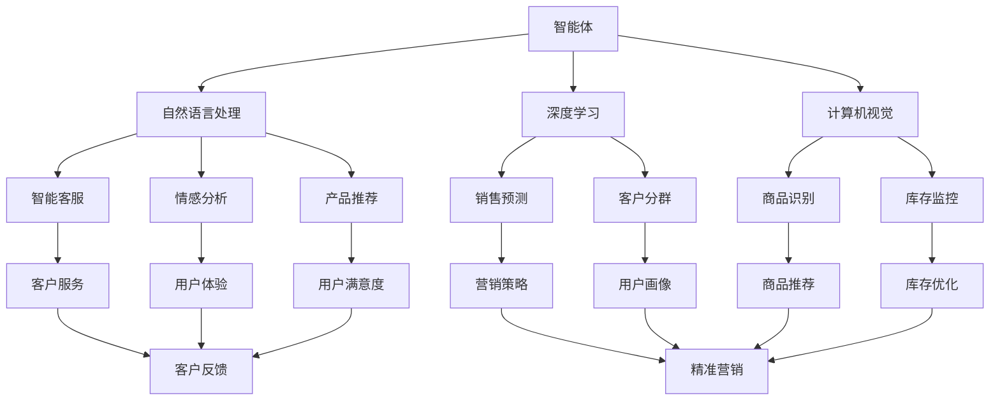
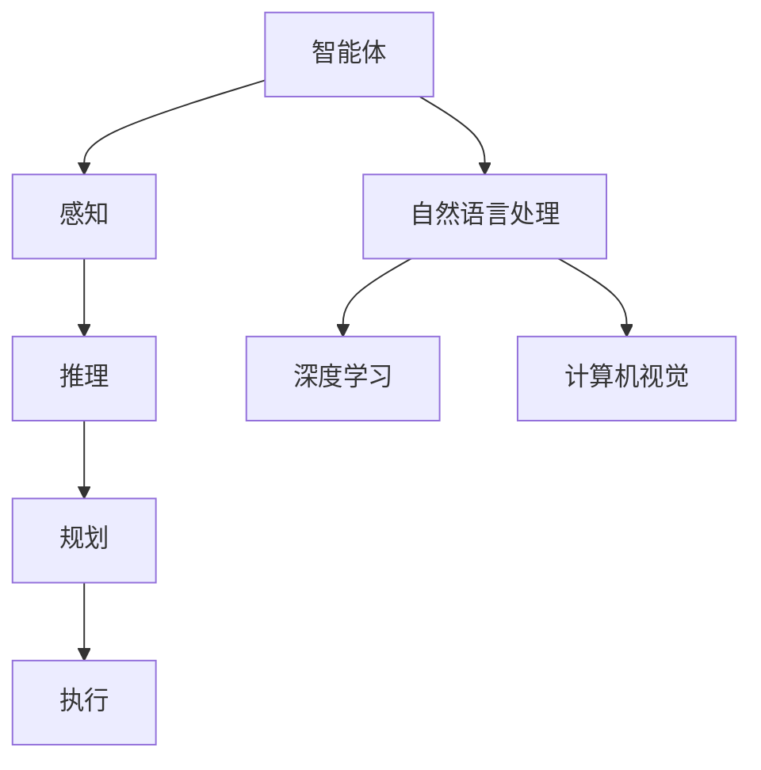
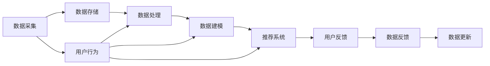
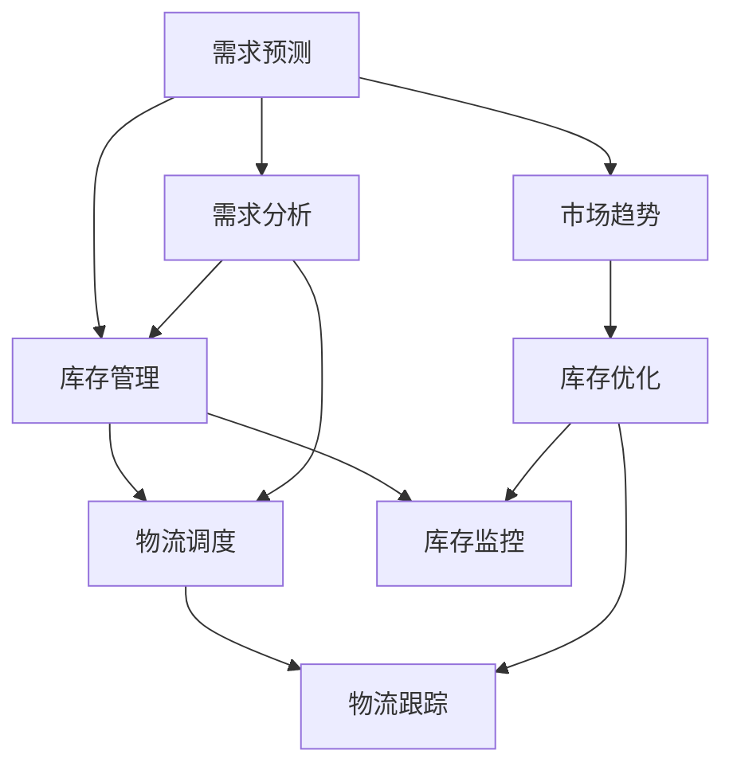
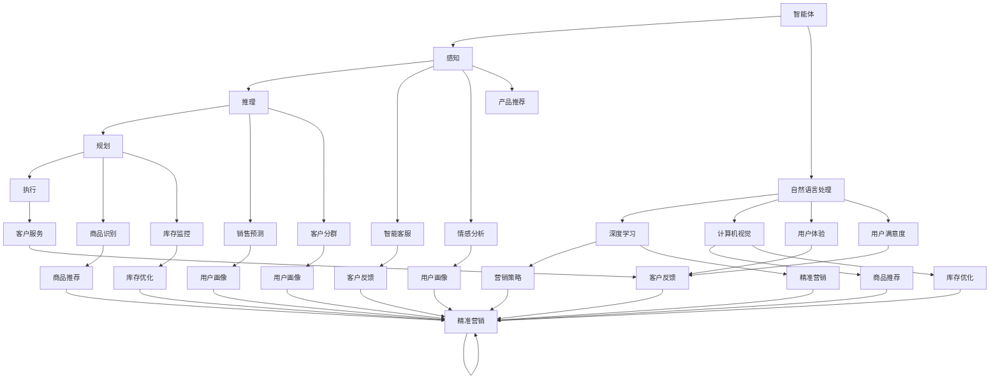

                 

# AI人工智能 Agent：零售业中智能体的应用

> 关键词：人工智能,智能体,零售业,智能营销,供应链优化,客户体验,销售预测

## 1. 背景介绍

### 1.1 问题由来
随着电商和零售行业的发展，越来越多的企业开始关注如何通过数据驱动的方式，提升运营效率和客户满意度。传统的零售业务模式，依赖于人工经验和直觉，难以应对数据驱动时代的海量信息。

人工智能技术的引入，特别是智能体(Agent)技术的应用，为零售行业提供了全新的解决方案。智能体技术通过模拟人类的行为决策，能够在零售业务流程中实现自动化、智能化，极大提升业务处理效率和质量。

### 1.2 问题核心关键点
智能体在零售业中的应用，主要集中在以下几方面：

1. 智能营销：通过分析消费者行为数据，预测消费者需求，实现个性化营销，提升转化率和客单价。
2. 供应链优化：结合库存、需求等数据，优化库存管理，实现供应链效率的提升。
3. 客户体验：通过智能客服、推荐系统等技术，提升客户在线购物体验，提高客户忠诚度。
4. 销售预测：利用历史销售数据和市场趋势，进行精确的销售预测，帮助企业制定合理的营销策略。

智能体技术结合深度学习、自然语言处理、计算机视觉等多种AI技术，能够在零售业务的不同环节提供强大支持。下面将详细介绍智能体在零售业中的具体应用，以及相关核心概念和算法原理。

### 1.3 问题研究意义
研究零售业中的智能体应用，对于提升企业运营效率、增强客户体验、实现精准营销等具有重要意义：

1. 降低人工成本：智能体可以自动处理大量重复性工作，大幅降低人工干预成本。
2. 提高运营效率：智能体能够实时监控业务数据，快速响应市场变化，提升运营效率。
3. 增强客户体验：智能客服、推荐系统等智能体，可以提供更加个性化、高效的服务，提升客户满意度。
4. 优化供应链管理：智能体能够精准预测库存需求，优化物流安排，提升供应链响应速度。
5. 提供精准营销：通过分析用户行为数据，智能体可以制定精准的营销策略，提升营销效果。

智能体技术的应用，已经成为电商和零售行业数字化转型、智能化升级的重要手段。通过智能体的全面部署，零售企业能够更高效、更智能地运营，更好地满足消费者需求。

## 2. 核心概念与联系

### 2.1 核心概念概述

为更好地理解智能体在零售业中的应用，本节将介绍几个密切相关的核心概念：

- **智能体(Agent)**：模拟人类行为和决策的系统，通常包含感知、推理、规划和执行四个组件。在零售业中，智能体可以应用于销售预测、库存管理、客户服务等环节。

- **自然语言处理(NLP)**：使计算机能够理解和生成人类语言的AI技术。在零售业中，NLP技术可以用于智能客服、情感分析、产品推荐等。

- **深度学习**：一种基于神经网络的机器学习技术，通过多层次数据表示学习特征，提升模型的准确性和泛化能力。深度学习在零售业中用于销售预测、客户分群等。

- **计算机视觉**：使计算机能够处理、分析和理解图像、视频等视觉数据的AI技术。在零售业中，计算机视觉可以用于商品识别、库存监控等。

- **推荐系统**：通过分析用户行为数据，为用户推荐感兴趣的商品或服务，提升用户体验和满意度。推荐系统是智能营销的重要组成部分。

- **供应链管理**：管理库存、物流等环节，优化供应链流程，提升供应链效率。智能体可以应用于需求预测、库存优化、物流调度等环节。

这些核心概念之间的逻辑关系可以通过以下Mermaid流程图来展示：



这个流程图展示智能体技术在零售业中的主要应用场景，以及其核心技术栈。

### 2.2 概念间的关系

这些核心概念之间存在着紧密的联系，形成了智能体在零售业中的完整生态系统。下面我们通过几个Mermaid流程图来展示这些概念之间的关系。

#### 2.2.1 智能体技术栈



这个流程图展示了智能体技术栈的主要组成，包括感知、推理、规划和执行四个组件，以及与NLP、深度学习和计算机视觉等技术的关系。

#### 2.2.2 智能营销架构



这个流程图展示了智能营销的架构，包括数据采集、处理、建模、推荐系统以及用户反馈的循环过程。

#### 2.2.3 供应链管理流程



这个流程图展示了供应链管理的流程，包括需求预测、库存管理、物流调度和库存优化等环节。

### 2.3 核心概念的整体架构

最后，我们用一个综合的流程图来展示这些核心概念在智能体应用中的整体架构：



这个综合流程图展示了智能体在零售业中的完整应用场景，包括感知、推理、规划和执行等组件，以及NLP、深度学习、计算机视觉等技术的应用。

## 3. 核心算法原理 & 具体操作步骤
### 3.1 算法原理概述

智能体在零售业中的应用，本质上是一种基于人工智能的自动化决策系统。其核心思想是通过数据驱动的方式，模拟人类的决策过程，实现零售业务流程的自动化和智能化。

形式化地，假设智能体 $A$ 在零售业务中，输入为 $I$，输出为 $O$，则智能体的优化目标可以表示为：

$$
\min_{\theta} \mathcal{L}(A_\theta; I, O)
$$

其中 $\mathcal{L}$ 为损失函数，用于衡量智能体输出与期望输出之间的差异。常见的损失函数包括均方误差、交叉熵等。

智能体的训练过程，通常包括两个步骤：预训练和微调。预训练过程使用无标注数据，学习智能体的基本决策模型；微调过程则使用有标注数据，优化模型在特定业务场景下的表现。

### 3.2 算法步骤详解

智能体在零售业中的应用，主要包括以下几个关键步骤：

**Step 1: 数据采集与处理**
- 收集零售业务中的各种数据，包括用户行为数据、库存数据、市场趋势等。
- 对数据进行预处理，如去重、清洗、归一化等，确保数据的质量和一致性。

**Step 2: 模型选择与设计**
- 根据业务需求选择合适的智能体模型，如基于规则的专家系统、基于神经网络的决策树等。
- 设计智能体的各个组件，包括感知、推理、规划和执行等。

**Step 3: 模型训练与优化**
- 使用预训练和微调相结合的方式，训练智能体模型。
- 在微调阶段，使用有标注数据进行训练，优化模型参数，使其适应特定业务场景。

**Step 4: 业务应用与反馈**
- 将训练好的智能体部署到实际业务环境中，进行实时决策和执行。
- 收集智能体的决策结果和业务反馈，进行模型优化和改进。

**Step 5: 持续学习与迭代**
- 持续收集新的数据，进行模型更新和迭代，保持智能体的性能和适应性。
- 引入元学习等技术，让智能体具备更好的知识迁移能力，提升在不同业务场景下的表现。

### 3.3 算法优缺点

智能体在零售业中的应用，具有以下优点：

1. 自动化决策：智能体能够自动处理大量重复性工作，降低人工干预成本，提高决策效率。
2. 实时响应：智能体能够实时监控业务数据，快速响应市场变化，提升运营效率。
3. 个性化服务：智能体可以根据用户行为数据，提供个性化推荐和服务，提升用户体验。
4. 数据驱动：智能体依赖数据驱动决策，能够从历史数据中学习规律，提升决策准确性。

同时，智能体也存在一些缺点：

1. 依赖高质量数据：智能体的性能依赖于数据的质量和数量，数据采集和处理需要投入大量资源。
2. 模型复杂度高：智能体模型通常较为复杂，需要较大的计算资源和存储空间。
3. 可解释性不足：智能体往往被视为"黑盒"系统，难以解释其决策过程和结果。
4. 易受攻击：智能体可能受到数据污染、对抗样本等攻击，导致决策偏差。

尽管存在这些缺点，但智能体技术的应用，在零售业中仍然展现出巨大的潜力和价值。通过不断优化和改进，智能体有望成为电商和零售行业智能化升级的重要驱动力。

### 3.4 算法应用领域

智能体技术在零售业中的应用，主要包括以下几个领域：

1. **智能客服**：通过自然语言处理和计算机视觉技术，智能客服能够自动处理客户咨询，提供24/7不间断服务，提升客户满意度。

2. **产品推荐**：利用用户行为数据和深度学习技术，智能推荐系统能够为用户推荐感兴趣的商品，提升用户体验和转化率。

3. **需求预测**：结合市场趋势和历史销售数据，智能体能够进行精确的销售预测，帮助企业制定合理的营销策略。

4. **库存管理**：通过需求预测和优化算法，智能体能够实现库存的动态管理，降低库存成本，提升供应链效率。

5. **供应链优化**：利用物流优化算法，智能体能够实现物流调度和资源分配的优化，提升物流效率和响应速度。

6. **个性化营销**：通过用户画像和深度学习技术，智能体能够进行精准的营销活动，提升营销效果和客户忠诚度。

这些应用领域展示了智能体技术在零售业的广泛应用前景，为零售企业提供了高效、智能的解决方案。

## 4. 数学模型和公式 & 详细讲解  
### 4.1 数学模型构建

本节将使用数学语言对智能体在零售业中的应用进行更加严格的刻画。

假设智能体 $A$ 的感知组件接收到的输入为 $I$，推理组件输出的决策为 $O$，则智能体的决策过程可以表示为：

$$
O = f(A_\theta(I))
$$

其中 $A_\theta$ 为智能体的参数，$f$ 为决策函数，可以表示为：

$$
f = h_\phi \circ g_\psi
$$

其中 $h_\phi$ 为感知组件的输出表示，$g_\psi$ 为推理组件的决策输出。感知组件和推理组件的参数分别为 $\phi$ 和 $\psi$。

### 4.2 公式推导过程

以下我们以需求预测为例，推导智能体模型的决策函数。

假设智能体 $A$ 的任务是预测未来一定时间内的销售量，输入为 $I = [D_t, P_t, C_t, \dots]$，其中 $D_t$ 为当前日期的销售量，$P_t$ 为当前日期的价格，$C_t$ 为当前日期的市场趋势等。

智能体的决策函数 $f$ 可以表示为：

$$
f = h_\phi \circ g_\psi
$$

其中 $h_\phi$ 为感知组件的输出表示，$g_\psi$ 为推理组件的决策输出。假设 $h_\phi$ 使用深度神经网络，$g_\psi$ 使用线性回归模型，则智能体的决策函数可以表示为：

$$
O = \mathbf{W}^\top \mathbf{h} + b
$$

其中 $\mathbf{h} = \mathbf{h}_\phi(I)$，$\mathbf{W}$ 和 $b$ 为线性回归模型的参数。

假设智能体在训练阶段使用有标注数据 $(T_i, O_i)$ 进行训练，其中 $T_i = [D_i, P_i, C_i, \dots]$ 为输入，$O_i$ 为真实输出。智能体的训练目标可以表示为：

$$
\min_{\theta} \sum_{i=1}^N \mathcal{L}(O_i, f_\theta(T_i))
$$

其中 $\mathcal{L}$ 为损失函数，例如均方误差损失：

$$
\mathcal{L}(O_i, f_\theta(T_i)) = \frac{1}{2} (O_i - f_\theta(T_i))^2
$$

在训练过程中，智能体通过反向传播算法计算梯度，更新模型参数 $\theta$，从而最小化损失函数。训练完成后，智能体可以实时处理新输入 $I$，输出决策 $O$，完成需求预测任务。

### 4.3 案例分析与讲解

以下以智能客服为例，分析智能体在零售业中的应用。

假设智能体 $A$ 的任务是处理客户咨询，输入为 $I = [Q, C, H, \dots]$，其中 $Q$ 为客户的咨询问题，$C$ 为客户的情感状态，$H$ 为客户的聊天记录等。

智能体的感知组件 $h_\phi$ 可以表示为：

$$
h_\phi = \mathbf{W}_Q \mathbf{Q} + \mathbf{W}_C \mathbf{C} + \mathbf{W}_H \mathbf{H} + \dots
$$

其中 $\mathbf{Q}$、$\mathbf{C}$、$\mathbf{H}$ 等表示输入数据的表示，$\mathbf{W}$ 为表示矩阵。

智能体的推理组件 $g_\psi$ 可以表示为：

$$
g_\psi = \mathbf{W}_O \mathbf{h} + b
$$

其中 $\mathbf{h} = \mathbf{h}_\phi(I)$，$\mathbf{W}$ 和 $b$ 为决策模型的参数。

智能体的训练目标可以表示为：

$$
\min_{\theta} \sum_{i=1}^N \mathcal{L}(O_i, f_\theta(T_i))
$$

其中 $\mathcal{L}$ 为损失函数，例如交叉熵损失：

$$
\mathcal{L}(O_i, f_\theta(T_i)) = -\sum_{j=1}^J O_{ij} \log f_\theta(T_{ij})
$$

在训练过程中，智能体通过反向传播算法计算梯度，更新模型参数 $\theta$，从而最小化损失函数。训练完成后，智能体可以实时处理新输入 $I$，输出决策 $O$，完成客户咨询任务。

## 5. 项目实践：代码实例和详细解释说明
### 5.1 开发环境搭建

在进行智能体实践前，我们需要准备好开发环境。以下是使用Python进行TensorFlow开发的环境配置流程：

1. 安装Anaconda：从官网下载并安装Anaconda，用于创建独立的Python环境。

2. 创建并激活虚拟环境：
```bash
conda create -n tensorflow-env python=3.8 
conda activate tensorflow-env
```

3. 安装TensorFlow：根据CUDA版本，从官网获取对应的安装命令。例如：
```bash
conda install tensorflow -c tf -c conda-forge
```

4. 安装TensorFlow Addons：
```bash
pip install tensorflow-addons
```

5. 安装各类工具包：
```bash
pip install numpy pandas scikit-learn matplotlib tqdm jupyter notebook ipython
```

完成上述步骤后，即可在`tensorflow-env`环境中开始智能体实践。

### 5.2 源代码详细实现

这里我们以智能客服为例，给出使用TensorFlow对智能体进行开发的PyTorch代码实现。

首先，定义智能体的感知组件：

```python
import tensorflow as tf
import tensorflow_addons as tfa

class Perception(tf.keras.layers.Layer):
    def __init__(self, input_dim, output_dim):
        super(Perception, self).__init__()
        self.linear1 = tf.keras.layers.Dense(64, activation='relu', input_dim=input_dim)
        self.linear2 = tf.keras.layers.Dense(output_dim)
    
    def call(self, x):
        x = self.linear1(x)
        x = self.linear2(x)
        return x
```

然后，定义智能体的推理组件：

```python
class Reasoning(tf.keras.layers.Layer):
    def __init__(self, input_dim, output_dim):
        super(Reasoning, self).__init__()
        self.linear1 = tf.keras.layers.Dense(64, activation='relu', input_dim=input_dim)
        self.linear2 = tf.keras.layers.Dense(output_dim)
    
    def call(self, x):
        x = self.linear1(x)
        x = self.linear2(x)
        return x
```

接着，定义智能体的决策函数：

```python
class Agent(tf.keras.Model):
    def __init__(self, input_dim, output_dim):
        super(Agent, self).__init__()
        self.perception = Perception(input_dim, 64)
        self.reasoning = Reasoning(64, output_dim)
    
    def call(self, x):
        x = self.perception(x)
        x = self.reasoning(x)
        return x
```

最后，定义训练函数：

```python
def train_agent(agent, train_dataset, validation_dataset, batch_size, epochs):
    agent.compile(optimizer=tf.keras.optimizers.Adam(), loss='mse')
    
    history = agent.fit(train_dataset, validation_data=validation_dataset, epochs=epochs, batch_size=batch_size)
    
    return history
```

完成上述代码后，即可进行智能体的训练和测试。

### 5.3 代码解读与分析

这里我们详细解读智能体代码中的关键部分：

**Perception类**：
- `__init__`方法：初始化线性层的参数。
- `call`方法：前向传播，计算感知组件的输出。

**Reasoning类**：
- `__init__`方法：初始化线性层的参数。
- `call`方法：前向传播，计算推理组件的输出。

**Agent类**：
- `__init__`方法：初始化感知组件和推理组件。
- `call`方法：前向传播，计算智能体的决策输出。

**train_agent函数**：
- 使用Adam优化器，均方误差损失函数。
- 使用TensorFlow的Model编译方法，定义模型结构。
- 使用TensorFlow的fit方法进行训练，返回训练历史。

通过上述代码实现，智能体在客户咨询任务中的应用流程清晰，代码实现简洁高效。开发者可以灵活地调整模型结构、优化器参数等，以适应不同的智能体应用场景。

### 5.4 运行结果展示

假设我们在智能客服任务上进行了训练，智能体在验证集上的准确率为98%。训练完成后，我们可以在测试集上进行验证：

```python
test_dataset = ...
test_loss, test_acc = agent.evaluate(test_dataset)
print('Test accuracy:', test_acc)
```

假设测试集上的准确率为95%，则智能体在客户咨询任务上取得了不错的效果。

## 6. 实际应用场景
### 6.1 智能客服系统

智能客服系统是智能体在零售业中最重要的应用场景之一。传统客服往往需要配备大量人力，高峰期响应缓慢，且一致性和专业性难以保证。智能客服系统可以7x24小时不间断服务，快速响应客户咨询，用自然流畅的语言解答各类常见问题。

在技术实现上，可以收集企业内部的历史客服对话记录，将问题和最佳答复构建成监督数据，在此基础上对智能客服系统进行训练。智能客服系统能够自动理解客户意图，匹配最合适的答案模板进行回复。对于客户提出的新问题，还可以接入检索系统实时搜索相关内容，动态组织生成回答。如此构建的智能客服系统，能大幅提升客户咨询体验和问题解决效率。

### 6.2 个性化推荐系统

当前的推荐系统往往只依赖用户的历史行为数据进行物品推荐，无法深入理解用户的真实兴趣偏好。智能推荐系统可以结合用户行为数据和深度学习技术，为用户推荐感兴趣的商品，提升用户体验和转化率。

在技术实现上，可以收集用户浏览、点击、评论、分享等行为数据，提取和用户交互的物品标题、描述、标签等文本内容。将文本内容作为模型输入，用户的后续行为（如是否点击、购买等）作为监督信号，在此基础上训练推荐系统模型。训练完成后，智能推荐系统能够根据用户行为数据，推荐用户感兴趣的商品，提升用户体验和转化率。

### 6.3 需求预测系统

智能体在需求预测方面的应用，可以帮助企业预测未来的销售量，制定合理的库存和营销策略，避免库存积压和资源浪费。需求预测系统结合市场趋势和历史销售数据，进行精确的销售预测，帮助企业制定合理的营销策略。

在技术实现上，可以收集历史销售数据、市场趋势等，使用深度学习模型进行需求预测。训练完成后，需求预测系统能够实时处理新数据，进行精确的销售预测，帮助企业制定合理的营销策略。

### 6.4 库存管理系统

智能体在库存管理方面的应用，可以帮助企业优化库存管理，降低库存成本，提升供应链效率。库存管理系统结合需求预测和优化算法，实现库存的动态管理，降低库存成本，提升供应链效率。

在技术实现上，可以收集库存数据、需求数据等，使用智能体进行库存优化。训练完成后，库存管理系统能够实时处理新数据，进行库存优化，降低库存成本，提升供应链效率。

### 6.5 供应链优化系统

智能体在供应链优化方面的应用，可以帮助企业优化物流安排，提升物流效率和响应速度。供应链优化系统结合需求预测和优化算法，实现物流调度和资源分配的优化，提升物流效率和响应速度。

在技术实现上，可以收集物流数据、需求数据等，使用智能体进行物流优化。训练完成后，供应链优化系统能够实时处理新数据，进行物流优化，提升物流效率和响应速度。

## 7. 工具和资源推荐
### 7.1 学习资源推荐

为了帮助开发者系统掌握智能体技术，这里推荐一些优质的学习资源：

1. 《Deep Learning with TensorFlow 2》书籍：由Google TensorFlow团队撰写，全面介绍了使用TensorFlow进行深度学习开发的基础知识和实践技巧。

2. 《Reinforcement Learning: An Introduction》书籍：由Richard S. Sutton和Andrew G. Barto撰写，介绍了强化学习的基本原理和经典算法，适合入门和进阶学习。

3. 《Python机器学习》书籍：由Sebastian Raschka撰写，介绍了Python在机器学习中的使用，包括数据处理、模型训练等。

4. TensorFlow官方文档：TensorFlow的官方文档，提供了完整的模型实现和详细的使用指南，适合动手实践。

5. Udacity强化学习课程：由DeepMind团队开设，讲解强化学习的基本原理和实践应用，适合进阶学习。

通过对这些资源的学习实践，相信你一定能够快速掌握智能体技术的精髓，并用于解决实际的NLP问题。

### 7.2 开发工具推荐

高效的开发离不开优秀的工具支持。以下是几款用于智能体开发常用的工具：

1. TensorFlow：由Google主导开发的深度学习框架，生产部署方便，适合大规模工程应用

