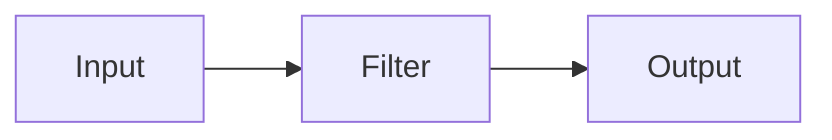

# Logstash原理与代码实例讲解

## 1. 背景介绍
### 1.1 问题的由来
在大数据时代，海量的数据正以前所未有的速度增长。如何高效地收集、处理和分析这些数据，已经成为各行各业面临的重大挑战。传统的数据处理方式已经无法满足实时性和可扩展性的要求。因此，亟需一种高效、灵活的数据处理工具。

### 1.2 研究现状
目前，业界已经涌现出一批优秀的大数据处理工具，如Hadoop、Spark、Flink等。这些工具在数据处理领域取得了巨大的成功，受到广泛的认可。然而，在数据采集和转换领域，仍然存在不少问题，如数据格式不统一、数据质量参差不齐、数据转换困难等。

### 1.3 研究意义
Logstash是Elastic Stack家族的重要成员，是一个开源的数据处理管道，可以从多个来源采集数据，然后对数据进行转换，最后将数据发送到您最喜欢的"存储库"中。Logstash 能够动态地采集、转换和传输数据，是一个可以输入、过滤、输出的数据流处理工具，其应用场景非常广泛。

### 1.4 本文结构
本文将从以下几个方面对Logstash进行深入探讨：

1. Logstash的核心概念与工作原理
2. Logstash的插件体系与配置语法
3. Logstash的数据处理流程和内部机制
4. Logstash的实战案例与最佳实践
5. Logstash的性能调优与问题排查
6. Logstash的发展现状与未来展望

## 2. 核心概念与联系
Logstash的核心概念包括：

- Event：数据在内部流转的基本单元
- Input：输入数据源，如文件、TCP/UDP、Kafka等
- Filter：数据处理与转换，如Grok解析、GeoIP 查询等
- Output：输出目的地，如Elasticsearch、HDFS、S3等
- Codec：数据格式编解码器，如JSON、Multiline等
- Pipeline：由Input、Filter和Output串联而成的数据处理管道

下图展示了Logstash的核心组件与数据流转过程：



## 3. 核心算法原理 & 具体操作步骤
### 3.1 算法原理概述
Logstash基于事件驱动的架构，内部采用了高效的Queue机制来缓冲数据，保证了数据处理的高吞吐和低延迟。同时，Logstash支持多线程并发处理，充分利用了多核CPU的性能优势。

### 3.2 算法步骤详解
Logstash的数据处理流程可以分为以下几个步骤：

1. 输入Input读取数据，并将数据打包成Event
2. Event进入Filter队列，等待处理
3. Filter Worker从队列中取出Event，根据配置顺序依次执行各个Filter
4. Filter处理后的Event进入Output队列
5. Output Worker将Event写入目标存储或转发

### 3.3 算法优缺点
Logstash的优点有：

- 插件化的架构，灵活可扩展
- 支持多种数据源和目标存储
- 内置丰富的数据转换能力
- 配置简单，学习门槛低

但Logstash也存在一些局限性：

- 仅支持基于正则的Grok解析，对复杂数据格式支持有限
- 不支持数据的连接和聚合操作
- 需要额外的监控和管理组件，运维成本高

### 3.4 算法应用领域
Logstash最常见的应用场景包括：

- 日志收集与解析
- 数据同步与迁移
- 安全信息和事件管理
- 物联网数据采集与处理

## 4. 数学模型和公式 & 详细讲解 & 举例说明
### 4.1 数学模型构建
Logstash的数据处理可以抽象为一个多级队列系统，假设有m个Pipeline，每个Pipeline包含n个Filter，则整个Logstash系统可以建模为：

$$
\begin{aligned}
\frac{dQ_i(t)}{dt} &= \lambda_i(t) - \mu_i(t) \\
Q_i(t) &\ge 0, \quad i=1,2,\cdots,m \\
\mu_i(t) &= \sum_{j=1}^{n} \mu_{ij}(t)
\end{aligned}
$$

其中，$Q_i(t)$表示第$i$个Pipeline的队列长度，$\lambda_i(t)$表示输入速率，$\mu_i(t)$表示输出速率。

### 4.2 公式推导过程
根据Little定律，在稳态条件下，每个Pipeline的平均队列长度$\overline{Q_i}$可以表示为：

$$
\overline{Q_i} = \overline{\lambda_i} \cdot \overline{W_i}, \quad i=1,2,\cdots,m
$$

其中，$\overline{\lambda_i}$表示第$i$个Pipeline的平均输入速率，$\overline{W_i}$表示平均等待时间。

假设每个Filter的处理时间服从指数分布，则整个Pipeline的平均处理时间为：

$$
\overline{S_i} = \sum_{j=1}^{n} \overline{S_{ij}}, \quad i=1,2,\cdots,m
$$

其中，$\overline{S_{ij}}$表示第$i$个Pipeline中第$j$个Filter的平均处理时间。

根据Pollaczek-Khinchine公式，Pipeline的平均等待时间为：

$$
\overline{W_i} = \frac{\overline{\lambda_i} \overline{S_i^2}}{2(1-\rho_i)} + \overline{S_i}, \quad i=1,2,\cdots,m
$$

其中，$\rho_i=\overline{\lambda_i} \cdot \overline{S_i}$表示第$i$个Pipeline的利用率。

### 4.3 案例分析与讲解
假设某Logstash系统包含2个Pipeline，每个Pipeline包含3个Filter，各个参数如下：

- Pipeline 1：$\lambda_1=100/s$，$S_{11}=10ms$，$S_{12}=20ms$，$S_{13}=30ms$
- Pipeline 2：$\lambda_2=50/s$，$S_{21}=20ms$，$S_{22}=30ms$，$S_{23}=40ms$

根据上述公式，可以计算出：

- Pipeline 1的平均处理时间：$\overline{S_1} = 10 + 20 + 30 = 60ms$
- Pipeline 1的利用率：$\rho_1 = 100 \times 0.06 = 0.6$
- Pipeline 1的平均等待时间：$\overline{W_1} = \frac{100 \times 0.06^2}{2(1-0.6)} + 0.06 = 0.105s$
- Pipeline 1的平均队列长度：$\overline{Q_1} = 100 \times 0.105 = 10.5$

- Pipeline 2的平均处理时间：$\overline{S_2} = 20 + 30 + 40 = 90ms$
- Pipeline 2的利用率：$\rho_2 = 50 \times 0.09 = 0.45$
- Pipeline 2的平均等待时间：$\overline{W_2} = \frac{50 \times 0.09^2}{2(1-0.45)} + 0.09 = 0.1145s$
- Pipeline 2的平均队列长度：$\overline{Q_2} = 50 \times 0.1145 = 5.725$

### 4.4 常见问题解答
Q: Logstash的性能瓶颈在哪里？
A: Logstash的性能主要取决于Filter的处理速度和Output的写入速度。可以通过增加Worker线程数、优化正则表达式、使用高性能的编解码器等方式来提升性能。

Q: 如何避免Logstash出现数据丢失？
A: 可以在Output中启用`flush_interval`参数，定期将内存中的数据刷新到磁盘。同时，还可以配置`retry_limit`和`retry_delay`参数，自动重试失败的写入操作。

## 5. 项目实践：代码实例和详细解释说明
### 5.1 开发环境搭建
首先需要安装Logstash，可以从官网下载二进制包，也可以使用包管理器安装：

```bash
# Ubuntu
sudo apt-get install logstash

# CentOS
sudo yum install logstash

# Mac
brew install logstash
```

### 5.2 源代码详细实现
下面是一个典型的Logstash配置文件示例：

```ruby
input {
  file {
    path => "/var/log/apache/access.log"
    start_position => "beginning"
  }
}

filter {
  grok {
    match => { "message" => "%{COMBINEDAPACHELOG}" }
  }
  date {
    match => [ "timestamp", "dd/MMM/yyyy:HH:mm:ss Z" ]
  }
  geoip {
    source => "clientip"
  }
}

output {
  elasticsearch {
    hosts => ["localhost:9200"]
    index => "logstash-%{+YYYY.MM.dd}"
  }
}
```

### 5.3 代码解读与分析
这个配置文件定义了一个输入Input、一组过滤器Filter和一个输出Output：

- Input从Apache的访问日志文件中读取数据，从文件起始位置开始读取。
- Filter首先使用Grok插件将日志解析为结构化的字段，然后使用Date插件解析时间戳字段，最后使用GeoIP插件根据IP地址查询地理位置信息。
- Output将处理后的数据写入Elasticsearch中，按天创建索引。

可以看出，Logstash的配置语法非常简洁和直观，通过管道的方式将各个插件串联起来，实现了数据的采集、处理和输出。

### 5.4 运行结果展示
启动Logstash之后，可以通过以下命令来检查运行状态：

```bash
curl -XGET 'localhost:9600/?pretty'
```

返回结果如下：

```json
{
  "host" : "node-1",
  "version" : "7.6.0",
  "http_address" : "127.0.0.1:9600",
  "id" : "2ff8e1c1-e7c4-4c3d-a58c-c84c08c1d1c6",
  "name" : "node-1",
  "ephemeral_id" : "b3d38e77-8b5d-4cbe-8b05-385277f73b61",
  "status" : "green",
  "snapshot" : false,
  "pipeline" : {
    "workers" : 8,
    "batch_size" : 125,
    "batch_delay" : 50
  },
  "build_date" : "2020-02-26T14:37:04+00:00",
  "build_sha" : "c8cec4a0886a4b90c74ef961a62d3a8286a1cac2",
  "build_snapshot" : false
}
```

可以看到，Logstash已经成功启动，并且Pipeline的各项参数也正常。

## 6. 实际应用场景
Logstash在实际生产环境中有非常广泛的应用，典型的场景包括：

- 日志收集与分析：将分散在各个服务器上的日志文件收集到中心化的存储系统中，结构化解析关键字段，实现实时监控和故障排查。
- 数据管道与ETL：将不同来源的数据经过清洗、转换和富化，最终载入数据仓库或流处理系统。
- 安全信息和事件管理：对网络设备、主机、应用等产生的海量安全事件进行规范化处理，实现实时威胁检测和响应。

### 6.4 未来应用展望
随着云计算、大数据、人工智能等新技术的发展，Logstash也在不断演进，未来的应用前景非常广阔：

- 云原生日志管理：Logstash可以无缝集成Kubernetes等容器编排平台，实现微服务应用的集中式日志管理。
- 智能运维与AIOps：通过机器学习算法分析Logstash采集的各类数据，实现智能化的异常检测、根因分析等运维自动化。
- 实时数据处理：将Logstash与Kafka、Flink等流处理平台相结合，构建端到端的实时数据处理管道，支撑实时风控、推荐等业务场景。

## 7. 工具和资源推荐
### 7.1 学习资源推荐
- 官方文档：https://www.elastic.co/guide/en/logstash/current/index.html
- Logstash 最佳实践：https://doc.yonyoucloud.com/doc/logstash-best-practice-cn/index.html
- Logstash 入门指南：https://kibana.logstash.es/content/logstash/get-started/get-started-with-logstash.html

### 7.2 开发工具推荐