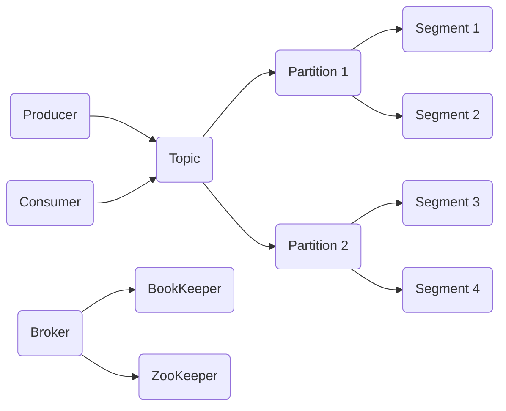

# Pulsar原理与代码实例讲解

## 1. 背景介绍
### 1.1 问题的由来
在大数据时代,海量数据的实时处理和分析已成为各行各业的迫切需求。传统的批处理模式难以满足实时性要求,而基于事件驱动的流式处理则成为主流解决方案。Apache Pulsar作为新一代的分布式消息流平台,凭借其优异的性能、灵活的架构设计和丰富的功能特性,正在被越来越多的企业所采用。

### 1.2 研究现状 
当前,国内外已有不少团队开始研究和使用Pulsar。阿里巴巴、腾讯、Yahoo!、Splunk等知名公司都将Pulsar应用到了生产环境。学术界对Pulsar的研究也在不断深入,诸如性能优化、多租户隔离、SQL支持等方向都取得了一定进展。但总的来说,Pulsar作为后起之秀,在社区活跃度和成熟度上还有待进一步提升。

### 1.3 研究意义
深入研究Pulsar的技术原理和应用实践,对于掌握流式数据处理的前沿技术、优化系统架构设计、提升业务系统性能都具有重要意义。同时Pulsar社区也在快速发展,通过源码分析、功能扩展等方式参与其中,可以让我们紧跟技术潮流,与业界优秀工程师切磋交流。

### 1.4 本文结构
本文将分为9个章节,深入剖析Pulsar的技术架构、核心概念和关键实现。内容涵盖Pulsar的设计理念、存储机制、消息模型、多租户机制、IO模型等核心主题。同时,我们还将通过实际代码案例,演示如何使用Java客户端进行消息的发布与消费。最后,展望Pulsar技术的发展趋势和应用前景。

## 2. 核心概念与联系
要理解Pulsar的工作原理,首先需要了解其几个核心概念:
- Producer:消息生产者,负责将消息发布到指定的Topic。
- Consumer:消息消费者,负责从Topic订阅和消费消息。  
- Topic:消息的逻辑传输通道,生产者和消费者之间的桥梁。
- Partition:Topic的物理分区,一个Topic可以划分为多个Partition,实现负载均衡和水平扩展。
- Segment:Partition物理上的存储单元,默认大小为512MB,顺序读写以优化性能。
- Broker:Pulsar集群的核心节点,负责接收、缓存、投递消息,并持久化到BookKeeper。
- BookKeeper:Pulsar的默认存储后端,负责消息的持久化与元数据管理。
- ZooKeeper:分布式协调服务,用于Pulsar集群的元数据存储与协调。

下图展示了Pulsar的核心组件与关联关系:



可以看出,Producer和Consumer通过Topic进行解耦,Broker作为中间人将消息路由到不同的Partition,并持久化到BookKeeper中。ZooKeeper则提供了可靠的元数据存储。这种架构使得Pulsar能够灵活地扩展和管理海量的消息数据。

## 3. 核心算法原理 & 具体操作步骤
### 3.1 算法原理概述
Pulsar采用了Dapper开源的Segment分段存储算法,将消息数据和索引分别持久化,再通过内存缓存和延迟索引等优化手段,实现了高效的消息存储与消费。

### 3.2 算法步骤详解
1. 生产者将消息发送到Broker。
2. Broker将消息追加到当前Ledger,并更新内存索引。
3. 当Ledger达到512MB时,Broker关闭当前Ledger,创建新的Ledger。 
4. 消费者拉取消息时,Broker检查内存缓存,缓存未命中则通过索引从Ledger中读取。
5. Broker定期将内存索引异步刷新到ZooKeeper,避免重启后重新构建索引。
6. 每个Ledger达到一定大小后,Broker异步创建Ledger索引文件,加速消息检索。

### 3.3 算法优缺点
- 优点:
  - 顺序写入,随机读取,充分利用磁盘特性
  - 多副本存储,保证数据可靠性
  - 内存缓存+延迟索引,兼顾时效性与持久性
- 缺点:  
  - Segment分段粒度较大,可能浪费存储空间
  - 延迟索引的构建会占用额外资源

### 3.4 算法应用领域
Pulsar的Segment存储算法特别适用于以下场景:
- 数据量极大,难以全内存缓存
- 消息生产快,消费相对慢
- 对消息时序有严格要求
- 需要多副本容错,保证消息不丢失

如在金融、物联网、车联网等行业,Pulsar可以很好地支撑核心应用。

## 4. 数学模型和公式 & 详细讲解 & 举例说明
### 4.1 数学模型构建
我们可以用队列模型来描述Pulsar的消息传输过程:
- 定义生产者到Broker的到达率为$\lambda$
- 定义Broker到消费者的服务率为$\mu$
- 定义Broker的缓存大小为$k$

则整个系统可以看作一个M/M/1/k队列。

### 4.2 公式推导过程
根据队列理论,我们可以得出系统的几个关键指标:

1. 系统的稳态分布概率:

$$
P_i = \begin{cases}
\frac{1-\rho}{1-\rho^{k+1}} \rho^i, & \text{if } i=0,1,2,...,k \
0, & \text{if } i>k
\end{cases}
$$

其中,$\rho=\frac{\lambda}{\mu}$,代表服务强度。

2. 系统的平均消息数:

$$
L = \sum_{i=1}^{k} i P_i= \frac{\rho}{1-\rho} - \frac{(k+1)\rho^{k+1}}{1-\rho^{k+1}}
$$

3. 消息的平均等待时间:

$$
W = \frac{L}{\lambda(1-P_k)}
$$

### 4.3 案例分析与讲解
假设Pulsar系统的生产速率为1000条/s,消费速率为800条/s,Broker缓存大小为10000条。求系统的稳态分布概率、平均消息数和等待时间。

代入公式可得:
- $\rho = \frac{1000}{800}=1.25$
- $P_0 = \frac{1-1.25}{1-1.25^{10001}} \approx 0.00072$ 
- $L \approx 8889$条
- $W \approx 8.89$秒

可见,在生产大于消费的情况下,系统中会堆积大量消息,消息的平均等待时间也会变长。这启示我们要合理设置生产和消费速率,必要时可增加消费者数量,或调大Broker缓存,以缓解消息堆积问题。

### 4.4 常见问题解答
- Q: Pulsar如何动态调整Broker缓存?
- A: 可以通过设置`maxPendingMessages`等参数,根据消费者的消费能力自适应调整缓存大小,防止OOM。

- Q: 消费者如何避免重复消费?
- A: 可以使用Exclusive模式,将每个消费者绑定到固定分区,利用Cumulative Ack机制保证Exactly Once语义。

- Q: 延迟消息如何实现?
- A: 可以利用消息key的Hash值映射到固定分区,再通过定时任务或时间轮算法实现延迟投递。

## 5. 项目实践：代码实例和详细解释说明
接下来,我们用Java代码演示如何使用Pulsar进行消息的发布与消费。

### 5.1 开发环境搭建
- JDK 8+
- Maven 3.x
- Pulsar 2.5+

添加Maven依赖:
```xml
<dependency>
    <groupId>org.apache.pulsar</groupId>
    <artifactId>pulsar-client</artifactId>
    <version>2.5.0</version>
</dependency>
```

### 5.2 源代码详细实现

#### 5.2.1 生产者示例
```java
PulsarClient client = PulsarClient.builder()
        .serviceUrl("pulsar://localhost:6650")
        .build();
Producer<byte[]> producer = client.newProducer()
        .topic("my-topic")
        .create();
for (int i = 0; i < 10; i++) {
    String content = "my-message-" + i;
    producer.send(content.getBytes());
}
producer.close();
client.close();
```

#### 5.2.2 消费者示例
```java
PulsarClient client = PulsarClient.builder()
        .serviceUrl("pulsar://localhost:6650")
        .build();
Consumer<byte[]> consumer = client.newConsumer()
        .topic("my-topic")
        .subscriptionName("my-subscription")
        .subscribe();
while (true) {
    Message<byte[]> msg = consumer.receive();
    String content = new String(msg.getData());
    System.out.println("Received: " + content);
    consumer.acknowledge(msg);
}
```

### 5.3 代码解读与分析
- 首先通过`PulsarClient`连接到Pulsar服务端。
- 生产者通过`newProducer()`创建一个生产者实例,并指定要发送的Topic。
- 调用`send()`方法发送消息,消息内容为byte数组。
- 消费者通过`newConsumer()`创建消费者实例,订阅指定的Topic。
- 调用`receive()`同步接收消息,也可改用异步Listener模式。
- 消息处理完成后要调用`acknowledge()`确认消息,告知Broker可以删除。

### 5.4 运行结果展示
启动Pulsar standalone后,运行上述生产者和消费者代码,可以看到控制台输出:
```
Received: my-message-0
Received: my-message-1
Received: my-message-2
...
Received: my-message-9
```

消费者成功接收并消费了生产者发送的10条消息。

## 6. 实际应用场景
Pulsar具有强大的消息处理能力,可以支撑多种实际应用场景,例如:
- 日志收集:将分布式系统的日志统一收集到Pulsar,再进行集中处理与分析。
- 流式计算:将实时数据通过Pulsar接入Flink等计算引擎,进行实时统计和数据挖掘。
- 消息通知:利用Pulsar的Pub/Sub机制,实现分布式系统间的异步通信与解耦。
- 事件溯源:将系统产生的各类事件以消息形式持久化,方便后续的审计和回溯。

### 6.4 未来应用展望
随着云原生和Serverless架构的兴起,Pulsar在其中也能发挥重要作用:
- 作为FaaS平台的事件源,触发函数执行
- 在Service Mesh中提供可靠的异步通信
- 与云存储深度集成,提供统一的数据处理入口
- 在边缘计算场景中,充当数据收集与分发的中心

相信Pulsar会在更多领域崭露头角,为企业级应用架构带来新的活力。

## 7. 工具和资源推荐
### 7.1 学习资源推荐
- [Pulsar官方文档](http://pulsar.apache.org/docs/en/standalone/)
- [Pulsar in Action](https://livebook.manning.com/book/pulsar-in-action/about-this-book/)
- [Pulsar Training](https://www.youtube.com/playlist?list=PLqRma1oIkcWgHLRjxJ2aDXtzg0oaOfILa)

### 7.2 开发工具推荐
- [Pulsar Manager](https://github.com/apache/pulsar-manager):Pulsar的Web管理界面
- [Pulsar Perf](https://github.com/apache/pulsar/tree/master/pulsar-perf):Pulsar性能测试工具
- [Pulsar Admin](https://github.com/apache/pulsar-admin):Pulsar的命令行管理工具

### 7.3 相关论文推荐
- [Pulsar: A Distributed Pub-sub Platform for Enterprise Environments](https://arxiv.org/abs/2005.02138)
- [Pulsar: Geo-replicated Pub/Sub at Scale](https://www.splunk.com/pdfs/technical-briefs/pulsar-geo-replication.pdf)

### 7