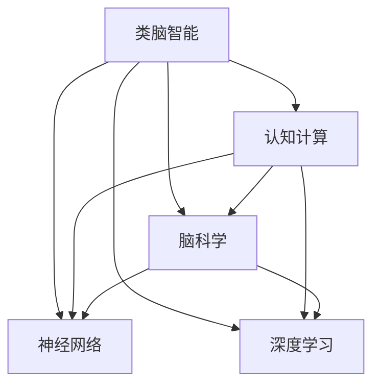

# 类脑智能与认知计算原理与代码实战案例讲解

关键词：类脑智能, 认知计算, 神经网络, 深度学习, 脑科学, 智能系统

## 1. 背景介绍

### 1.1  问题的由来

随着人工智能技术的飞速发展,传统的基于规则和统计的智能系统已经难以满足日益增长的智能应用需求。人们希望构建更加智能化、人性化的系统,使其能像人脑一样感知、思考和行动。由此,类脑智能和认知计算应运而生,成为了当前人工智能领域的研究热点。

### 1.2  研究现状

近年来,国内外学者在类脑智能和认知计算领域开展了大量研究工作。一方面,神经科学和认知科学的最新发现为构建类脑智能系统提供了理论基础和生物学启发;另一方面,深度学习等人工智能技术的突破也为类脑智能的实现提供了新的途径。目前,类脑芯片、脉冲神经网络、认知架构等研究已取得了一定进展。

### 1.3  研究意义

类脑智能和认知计算的研究对于推动人工智能的发展具有重要意义。通过模拟人脑的认知机理,可以构建更加智能、鲁棒、高效的智能系统,在智能机器人、自然语言理解、认知推理等领域具有广阔的应用前景。同时,类脑智能的研究也有助于加深对人脑工作原理的理解,促进脑科学和认知科学的发展。

### 1.4  本文结构

本文将围绕类脑智能和认知计算展开深入探讨。第2部分介绍相关的核心概念;第3部分阐述类脑智能的核心算法原理;第4部分建立数学模型并给出详细推导;第5部分通过代码实例讲解如何实现类脑智能系统;第6部分分析其实际应用场景;第7部分推荐相关工具和资源;第8部分总结全文并展望未来;第9部分列举常见问题解答。

## 2. 核心概念与联系

要理解类脑智能和认知计算,首先需要了解以下几个核心概念:

- 类脑智能(Brain-inspired Intelligence):通过模拟人脑的认知机理,构建仿生的智能系统,使其具备类似人脑的感知、学习、记忆、推理等智能行为的能力。

- 认知计算(Cognitive Computing):通过融合人工智能、神经科学、认知心理学等多学科知识,研究智能系统的计算模型、架构和算法,实现感知、学习、推理、决策等认知功能。

- 神经网络(Neural Network):一种模拟生物神经系统结构和功能的数学模型,由大量的人工神经元相互连接构成,通过调整神经元之间的连接权重,可以学习和存储知识,实现模式识别、预测等功能。

- 深度学习(Deep Learning):一类基于深度神经网络的机器学习方法,通过构建包含多个隐藏层的人工神经网络,可以自动学习数据的层次化特征表示,在图像识别、语音识别等领域取得了重大突破。

- 脑科学(Brain Science):研究神经系统结构、功能及其认知行为的科学,涵盖神经生物学、认知神经科学等多个分支学科,为类脑智能提供重要的生物学基础和启发。

类脑智能和认知计算高度关联,其核心思想是通过借鉴人脑的认知机理,利用人工神经网络等计算模型,构建具备感知、学习、推理等认知能力的智能系统。深度学习为类脑智能的实现提供了有效的技术手段,而脑科学研究则从生物学角度为类脑智能提供理论指导和启发。

下图展示了类脑智能与其他相关概念之间的联系:

## 3. 核心算法原理 & 具体操作步骤

### 3.1  算法原理概述

类脑智能的核心算法主要包括人工神经网络和深度学习算法。人工神经网络通过模拟生物神经元的连接结构,构建包含输入层、隐藏层和输出层的网络模型,利用反向传播算法调整神经元连接权重,实现对输入数据的特征学习和模式识别。深度学习则在此基础上引入了更深的网络结构和更复杂的学习机制,可以学习数据的层次化特征表示,大幅提升了模型的学习能力和泛化性能。

### 3.2  算法步骤详解

以经典的前馈神经网络(Feedforward Neural Network)为例,其主要算法步骤如下:

1. 网络结构设计:根据任务需求,设计包含输入层、隐藏层和输出层的网络结构,确定各层神经元的数量和连接方式。

2. 权重初始化:随机初始化神经元之间的连接权重和偏置项。

3. 前向传播:将输入数据传递给输入层神经元,通过激活函数计算各层神经元的输出,最终得到输出层结果。

4. 损失函数计算:将输出结果与期望输出进行比较,通过损失函数(如均方误差)计算预测误差。

5. 反向传播:根据损失函数,利用梯度下降算法,从输出层开始,逐层计算各连接权重的梯度,并更新权重值。

6. 迭代优化:重复步骤3-5,不断迭代直到达到预设的训练轮数或收敛条件。

7. 模型评估:利用测试集数据评估训练好的模型性能,进行超参数调优。

8. 模型应用:使用训练好的模型对新数据进行预测和决策。

深度学习算法在此基础上引入了新的网络结构(如卷积神经网络)、正则化技术(如Dropout)、优化算法(如Adam)等,可以更好地学习复杂数据的特征表示。

### 3.3  算法优缺点

人工神经网络和深度学习算法的主要优点包括:

- 强大的非线性拟合能力,可以学习复杂的数据模式
- 端到端的学习方式,无需人工设计特征
- 多层次的特征提取能力,可以学习数据的层次化表示

但同时也存在一些局限性,如:

- 需要大量标注数据进行训练,获取成本较高
- 模型可解释性差,难以理解内部工作机制
- 计算复杂度高,训练时间较长,部署成本高

### 3.4  算法应用领域

类脑智能算法已在多个领域得到广泛应用,如:

- 计算机视觉:图像分类、目标检测、语义分割等
- 自然语言处理:机器翻译、情感分析、问答系统等
- 语音识别:语音转文本、说话人识别等
- 认知推理:知识图谱、逻辑推理、因果分析等
- 智能控制:自动驾驶、机器人控制等

## 4. 数学模型和公式 & 详细讲解 & 举例说明

### 4.1  数学模型构建

以单个神经元为例,其数学模型可表示为:

$$
y = f(\sum_{i=1}^{n} w_i x_i + b)
$$

其中,$x_i$为第$i$个输入信号,$w_i$为对应的权重系数,$b$为偏置项,$f$为激活函数,常见的激活函数包括Sigmoid、tanh、ReLU等,如Sigmoid函数:

$$
f(x) = \frac{1}{1+e^{-x}}
$$

对于包含多个神经元的网络,可以通过矩阵运算实现前向传播:

$$
\mathbf{y} = f(\mathbf{W}\mathbf{x} + \mathbf{b})
$$

其中,$\mathbf{W}$为权重矩阵,$\mathbf{b}$为偏置向量。

### 4.2  公式推导过程

以均方误差损失函数为例,对单个样本$(x,y)$,其损失函数为:

$$
J(w,b) = \frac{1}{2}(\hat{y} - y)^2
$$

其中,$\hat{y}$为网络预测输出,$y$为真实标签。

利用梯度下降法更新权重,需要计算损失函数对各权重的偏导数:

$$
\frac{\partial J}{\partial w_i} = (\hat{y} - y) \cdot \hat{y}(1-\hat{y}) \cdot x_i
$$

$$
\frac{\partial J}{\partial b} = (\hat{y} - y) \cdot \hat{y}(1-\hat{y})
$$

然后根据学习率$\eta$更新权重:

$$
w_i := w_i - \eta \frac{\partial J}{\partial w_i}
$$

$$
b := b - \eta \frac{\partial J}{\partial b}
$$

对于多层网络,可以利用反向传播算法,逐层计算各权重的梯度并更新。

### 4.3  案例分析与讲解

考虑一个二分类问题,给定样本特征$x$和对应的类别标签$y \in {0,1}$,希望训练一个两层的神经网络进行预测。

网络结构如下:

前向传播过程为:

$$
\mathbf{h} = ReLU(\mathbf{W}_1\mathbf{x} + \mathbf{b}_1) \\
\hat{y} = Sigmoid(\mathbf{W}_2\mathbf{h} + \mathbf{b}_2)
$$

其中,$\mathbf{W}_1,\mathbf{b}_1$为输入层到隐藏层的权重和偏置,$\mathbf{W}_2,\mathbf{b}_2$为隐藏层到输出层的权重和偏置。

反向传播过程需要计算输出层和隐藏层的梯度:

$$
\delta_o = \hat{y} - y \\
\delta_h = (\mathbf{W}_2^T \delta_o) \cdot ReLU'(\mathbf{h})
$$

然后更新各层权重:

$$
\mathbf{W}_2 := \mathbf{W}_2 - \eta\delta_o\mathbf{h}^T \\
\mathbf{b}_2 := \mathbf{b}_2 - \eta\delta_o \\
\mathbf{W}_1 := \mathbf{W}_1 - \eta\delta_h\mathbf{x}^T \\
\mathbf{b}_1 := \mathbf{b}_1 - \eta\delta_h
$$

通过多轮迭代优化,网络可以学习到合适的权重参数,对新样本做出正确预测。

### 4.4  常见问题解答

- 问:为什么需要非线性激活函数?

答:非线性激活函数(如Sigmoid、ReLU)可以增加网络的非线性表达能力,使其能够拟合复杂的非线性决策边界。如果没有非线性激活函数,多层网络退化为单层线性模型,学习能力大大降低。

- 问:如何选择网络的层数和神经元数量?

答:这需要根据具体任务和数据规模而定。一般来说,层数越多、神经元越多,网络的拟合能力越强,但同时也更容易过拟合,训练时间也越长。可以通过交叉验证等方法对不同的网络结构进行评估,选择表现最优的结构。

- 问:如何避免过拟合?

答:过拟合是指模型在训练集上表现很好,但在测试集上泛化性能较差。可以采取以下策略避免过拟合:增大训练集、减小网络规模、加入正则化项(如L1/L2正则化)、使用Dropout等。

- 问:反向传播算法的原理是什么?

答:反向传播算法是一种高效计算梯度的方法。通过递归地应用链式法则,从输出层开始,逐层计算各权重参数的梯度,再根据梯度更新权重。反向传播让我们能够高效训练多层神经网络。

## 5. 项目实践：代码实例和详细解释说明

### 5.1  开发环境搭建

本项目使用Python语言和PyTorch深度学习框架。需要安装以下依赖库:

- Python 3.x
- PyTorch
- NumPy
- Matplotlib

可以使用pip命令安