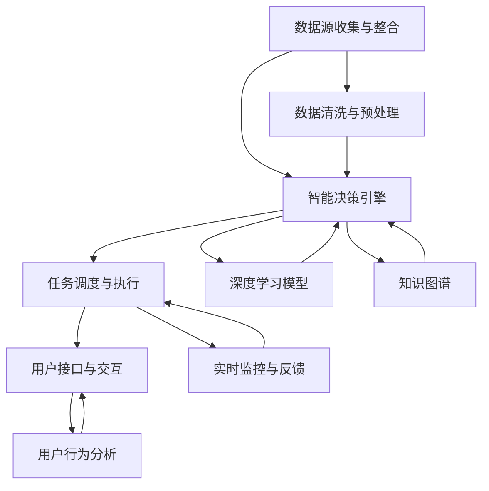
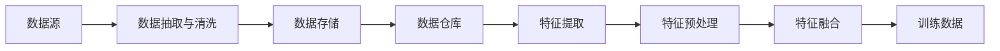
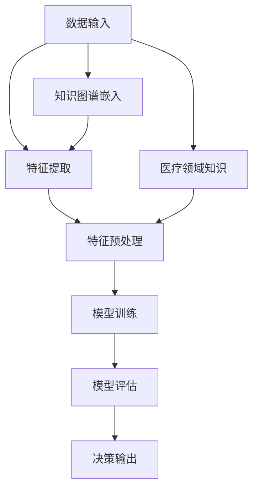
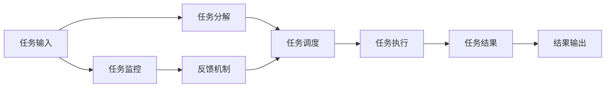
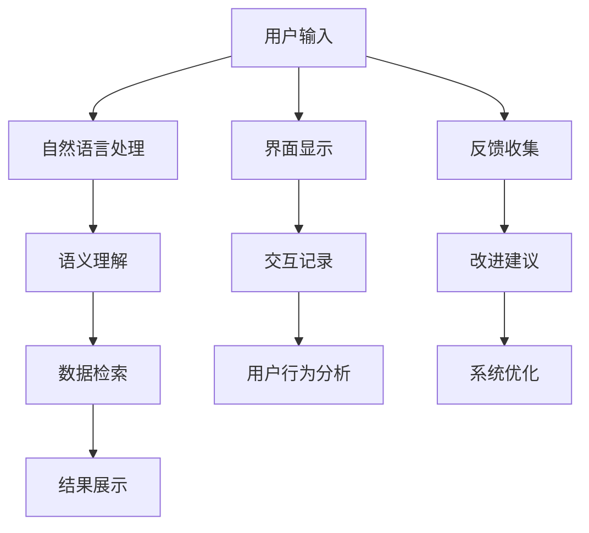
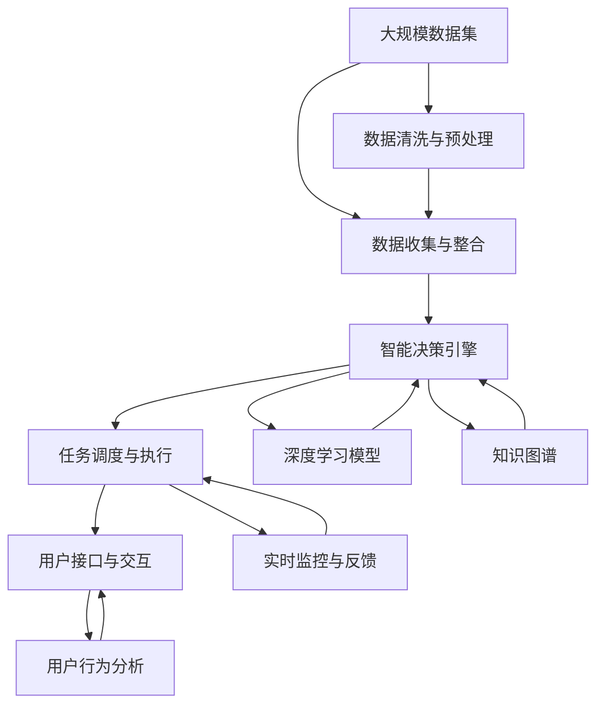

                 

# AI人工智能代理工作流 AI Agent WorkFlow：在医疗保健中的应用

## 1. 背景介绍

### 1.1 问题由来
在医疗保健领域，传统的业务流程常常面临效率低下、成本高昂、错误率高、信息孤岛等问题。近年来，人工智能技术逐渐成为解决这些问题的有效手段，其中AI代理工作流(AI Agent Workflow)技术尤为引人注目。通过构建智能化的工作流系统，AI代理能够自主完成从数据采集到结果分析的各个环节，从而大幅提升医疗机构的运营效率和服务质量。

医疗保健行业具有数据量大、业务复杂、安全性要求高等特点，AI代理工作流在此场景中有着独特的优势。例如，AI代理可以实时分析患者的生理数据，并结合历史病历进行诊断，提出治疗建议；在药物研发中，AI代理能够模拟多种药物的分子结构，预测其药理作用和副作用，加速新药的上市进程；在医疗管理中，AI代理可以通过分析医院运营数据，优化资源配置，降低运营成本。

### 1.2 问题核心关键点
AI代理工作流的基本思路是通过构建智能化的工作流系统，将人工操作转变为自动化的智能决策过程。核心要素包括：
- 数据源收集与整合：自动化地从电子病历、基因测序、影像诊断等系统收集数据，并将其整合到统一的数据仓库中。
- 智能决策引擎：构建一个基于深度学习、知识图谱等技术的智能决策引擎，能够自主分析数据并作出医疗决策。
- 任务调度与执行：设计自动化的任务调度机制，将各种智能决策分配到合适的执行单元中，并进行实时监控和反馈。
- 用户接口与交互：构建友好的用户接口，供医生、患者等人员进行操作，并支持自然语言交互和可视化展示。

AI代理工作流的成功实现，需要综合考虑数据整合、模型训练、任务调度、用户交互等多个环节的协同工作，涉及多种技术的集成和优化。

### 1.3 问题研究意义
AI代理工作流在医疗保健中的应用，具有以下几方面的重要意义：

1. **提高效率与准确性**：通过自动化处理大量重复性、耗时长的任务，AI代理能够显著提升工作效率，减少人为错误，提高医疗决策的准确性。

2. **降低成本与风险**：自动化操作减少了人工干预的需要，降低了医疗机构的运营成本。智能决策引擎能够快速识别风险，及时预警潜在的医疗事故，保障患者安全。

3. **促进数据共享与协同**：AI代理可以无缝集成各类数据源，实现数据共享，促进跨科室、跨机构的协同工作。同时，数据的安全共享也能提升医疗服务的可及性和公平性。

4. **增强医疗资源利用**：AI代理能够智能地分配医疗资源，避免资源浪费，提高设备使用效率，优化医疗服务质量。

5. **推动个性化医疗**：AI代理能够综合分析患者的多维数据，提供个性化的诊疗方案，提高治疗效果。

## 2. 核心概念与联系

### 2.1 核心概念概述

为了更好地理解AI代理工作流技术，本节将介绍几个核心概念：

- **数据源收集与整合**：涉及从各种医疗系统中提取结构化或非结构化数据，并将其整合到统一的数据仓库中。
- **智能决策引擎**：基于深度学习、知识图谱等技术，构建能够自主分析数据并作出医疗决策的引擎。
- **任务调度与执行**：设计自动化的任务调度机制，将智能决策分配到合适的执行单元中，并进行实时监控和反馈。
- **用户接口与交互**：构建友好的用户接口，供医生、患者等人员进行操作，并支持自然语言交互和可视化展示。

这些核心概念之间存在着紧密的联系，构成了AI代理工作流的完整生态系统。下面通过几个Mermaid流程图来展示这些概念之间的关系：



这个流程图展示了从数据收集到用户交互的全过程：

1. 从各个数据源收集数据，并进行清洗和预处理，得到用于训练的特征数据。
2. 构建深度学习模型和知识图谱，作为智能决策引擎的核心组件。
3. 设计任务调度机制，将决策分配给合适的执行单元，并进行实时监控和反馈。
4. 构建友好的用户接口，支持自然语言交互和可视化展示。

### 2.2 概念间的关系

这些核心概念之间存在着紧密的联系，形成了AI代理工作流的完整生态系统。下面通过几个Mermaid流程图来展示这些概念之间的关系：

#### 2.2.1 数据收集与整合的架构



这个流程图展示了数据收集与整合的基本架构：

1. 从各种数据源中抽取数据，并进行清洗，去除噪声和异常值。
2. 将清洗后的数据存储到数据仓库中。
3. 从数据仓库中提取特征，并进行预处理。
4. 对特征进行融合，得到更丰富的表示。
5. 使用融合后的特征作为训练数据。

#### 2.2.2 智能决策引擎的架构



这个流程图展示了智能决策引擎的架构：

1. 将输入数据进行特征提取和预处理。
2. 使用深度学习模型进行训练，得到模型参数。
3. 评估模型性能，调整参数以提升准确性。
4. 输出决策结果。
5. 结合医疗领域知识，增强决策的合理性。

#### 2.2.3 任务调度与执行的架构



这个流程图展示了任务调度与执行的基本架构：

1. 将任务分解为多个子任务。
2. 根据任务优先级和资源可用性，进行任务调度。
3. 执行调度后的任务，得到任务结果。
4. 监控任务执行过程，及时发现和解决异常。
5. 将结果输出到数据仓库或用户接口。

#### 2.2.4 用户接口与交互的架构



这个流程图展示了用户接口与交互的架构：

1. 用户输入查询或指令，通过自然语言处理得到语义理解结果。
2. 根据语义理解结果，进行数据检索和分析。
3. 将分析结果展示给用户。
4. 用户通过界面进行操作，记录交互记录。
5. 收集用户反馈，进行改进建议。
6. 通过用户行为分析，优化系统设计。

### 2.3 核心概念的整体架构

最后，我们用一个综合的流程图来展示这些核心概念在大语言模型微调过程中的整体架构：



这个综合流程图展示了从数据收集到用户交互的全过程。数据通过收集与整合环节得到清洗和预处理，进入智能决策引擎进行处理，并由任务调度与执行模块进行任务分配和执行。最终，用户接口与交互模块提供友好的界面，供用户操作，并支持自然语言交互和可视化展示。通过这些环节的协同工作，AI代理工作流能够高效地完成医疗保健任务。

## 3. 核心算法原理 & 具体操作步骤
### 3.1 算法原理概述

AI代理工作流的核心算法原理是基于深度学习、知识图谱等技术，构建一个智能化的决策引擎，并设计自动化的任务调度机制，实现从数据收集到用户交互的全流程自动化处理。

#### 3.1.1 数据源收集与整合
数据源收集与整合是AI代理工作流的第一步。在这一环节，需要从各种医疗系统中抽取结构化或非结构化数据，并进行清洗和预处理。常用的数据源包括电子病历、基因测序数据、影像诊断数据等。

具体实现流程如下：
1. 使用API或爬虫从各个数据源中抽取数据。
2. 对抽取到的数据进行清洗，去除噪声、异常值和重复数据。
3. 对清洗后的数据进行标准化处理，如归一化、缺失值填充等。
4. 将处理后的数据存储到数据仓库中，并实现数据的统一管理和存储。

#### 3.1.2 智能决策引擎
智能决策引擎是AI代理工作流的核心组件，负责从数据中提取特征并进行分析，最终作出医疗决策。其核心算法包括深度学习和知识图谱等技术。

具体实现流程如下：
1. 从数据仓库中提取特征，并进行预处理。
2. 使用深度学习模型（如卷积神经网络、循环神经网络等）进行训练，得到模型参数。
3. 使用知识图谱（如BIOIEA图谱）增强模型理解能力，提取更深层次的语义信息。
4. 对训练好的模型进行评估，调整参数以提升准确性。

#### 3.1.3 任务调度与执行
任务调度与执行模块负责将智能决策引擎的输出分配到合适的执行单元中，并进行实时监控和反馈。具体实现流程如下：
1. 根据任务优先级和资源可用性，设计任务调度算法。
2. 将任务分解为多个子任务，分配到合适的执行单元（如CPU、GPU、云服务）中。
3. 监控任务执行过程，及时发现和解决异常。
4. 将任务结果输出到数据仓库或用户接口，供后续分析和展示。

#### 3.1.4 用户接口与交互
用户接口与交互模块负责提供友好的用户界面，支持自然语言交互和可视化展示。具体实现流程如下：
1. 设计用户界面，提供用户交互功能。
2. 使用自然语言处理技术（如BERT、GPT等）进行语义理解。
3. 根据用户输入，从数据仓库中检索和分析数据。
4. 将分析结果展示给用户，并支持自然语言交互。

### 3.2 算法步骤详解

AI代理工作流的实现涉及多个环节的协同工作，具体步骤包括：

#### 3.2.1 数据收集与整合
1. 使用API或爬虫从各个数据源中抽取数据，并进行清洗和预处理。
2. 对清洗后的数据进行标准化处理，如归一化、缺失值填充等。
3. 将处理后的数据存储到数据仓库中，并实现数据的统一管理和存储。

#### 3.2.2 智能决策引擎
1. 从数据仓库中提取特征，并进行预处理。
2. 使用深度学习模型（如卷积神经网络、循环神经网络等）进行训练，得到模型参数。
3. 使用知识图谱（如BIOIEA图谱）增强模型理解能力，提取更深层次的语义信息。
4. 对训练好的模型进行评估，调整参数以提升准确性。

#### 3.2.3 任务调度与执行
1. 根据任务优先级和资源可用性，设计任务调度算法。
2. 将任务分解为多个子任务，分配到合适的执行单元（如CPU、GPU、云服务）中。
3. 监控任务执行过程，及时发现和解决异常。
4. 将任务结果输出到数据仓库或用户接口，供后续分析和展示。

#### 3.2.4 用户接口与交互
1. 设计用户界面，提供用户交互功能。
2. 使用自然语言处理技术（如BERT、GPT等）进行语义理解。
3. 根据用户输入，从数据仓库中检索和分析数据。
4. 将分析结果展示给用户，并支持自然语言交互。

### 3.3 算法优缺点
#### 3.3.1 优点
1. **自动化操作**：通过自动化的数据收集与整合、智能决策引擎、任务调度与执行、用户接口与交互，能够显著提升工作效率，减少人为错误。
2. **智能化决策**：结合深度学习和知识图谱技术，能够自主分析数据并作出医疗决策，提升决策的准确性和效率。
3. **实时监控与反馈**：通过实时监控任务执行过程，能够及时发现和解决异常，保障系统稳定运行。
4. **用户友好**：友好的用户界面和自然语言交互，能够提升用户操作体验，降低学习成本。

#### 3.3.2 缺点
1. **数据依赖**：依赖高质量的数据源，数据质量和多样性对系统性能有较大影响。
2. **模型复杂性**：深度学习模型和知识图谱的构建和维护需要较高的技术门槛和计算资源。
3. **资源消耗**：高并发的任务执行和数据分析，对计算资源和网络带宽有较高要求。
4. **系统风险**：自动化操作可能会引入新的风险，如数据泄露、系统故障等，需要设计完善的容错和保障机制。

### 3.4 算法应用领域

AI代理工作流技术已经在多个医疗保健领域得到了广泛应用，具体如下：

#### 3.4.1 临床决策支持
在临床决策支持系统中，AI代理能够结合患者的症状、病史、影像等数据，快速诊断疾病，并提出治疗方案。例如，通过深度学习模型和知识图谱，AI代理能够分析患者的电子病历和影像资料，辅助医生进行疾病诊断和治疗决策。

#### 3.4.2 药物研发
在药物研发领域，AI代理能够模拟多种药物的分子结构，预测其药理作用和副作用，加速新药的上市进程。通过结合深度学习模型和知识图谱，AI代理能够进行分子结构分析和药效预测，优化药物设计和筛选流程。

#### 3.4.3 医疗管理
在医疗管理领域，AI代理能够优化资源配置，降低运营成本。通过实时监控医院运营数据，AI代理能够分析患者流量、设备使用情况等，优化资源配置，提高设备使用效率，降低运营成本。

#### 3.4.4 健康监测与预警
在健康监测与预警系统中，AI代理能够实时分析患者的生理数据，并结合历史病历进行预警。例如，通过深度学习模型和知识图谱，AI代理能够分析患者的心电图、血压等生理数据，预测可能出现的健康问题，及时发出预警。

#### 3.4.5 个性化医疗
在个性化医疗领域，AI代理能够综合分析患者的多维数据，提供个性化的诊疗方案。通过深度学习模型和知识图谱，AI代理能够分析患者的基因数据、生活方式等，制定个性化的治疗方案，提高治疗效果。

## 4. 数学模型和公式 & 详细讲解  
### 4.1 数学模型构建

本节将使用数学语言对AI代理工作流技术的各个环节进行更加严格的刻画。

#### 4.1.1 数据收集与整合
假设数据源有 $N$ 个，每个数据源抽取的数据量为 $D_i$，数据清洗后的量为 $D_i'$。数据整合后的数据量为 $D$，则数据收集与整合的流程可以表示为：

$$
D = \sum_{i=1}^N D_i' = \sum_{i=1}^N (D_i - \Delta_i)
$$

其中，$\Delta_i$ 为数据清洗后的数据量与原始数据量的差值。

#### 4.1.2 智能决策引擎
假设智能决策引擎使用深度学习模型 $f$ 进行训练，模型输入为 $X$，输出为 $Y$。则训练过程可以表示为：

$$
Y = f(X)
$$

其中，$X$ 为特征向量，$Y$ 为决策结果。

#### 4.1.3 任务调度与执行
假设任务调度算法为 $S$，任务执行时间为 $T_i$，任务结果为 $R_i$。则任务调度与执行的流程可以表示为：

$$
R = S(\{T_i\}) = \{R_i\}
$$

#### 4.1.4 用户接口与交互
假设用户接口为 $I$，用户输入为 $U$，输出为 $O$。则用户接口与交互的流程可以表示为：

$$
O = I(U)
$$

### 4.2 公式推导过程

#### 4.2.1 数据收集与整合的公式推导
假设数据源有 $N$ 个，每个数据源的数据量为 $D_i$，数据清洗后的量为 $D_i'$。数据整合后的数据量为 $D$。则数据收集与整合的公式推导如下：

$$
D = \sum_{i=1}^N D_i' = \sum_{i=1}^N (D_i - \Delta_i)
$$

其中，$\Delta_i$ 为数据清洗后的数据量与原始数据量的差值。

#### 4.2.2 智能决策引擎的公式推导
假设智能决策引擎使用深度学习模型 $f$ 进行训练，模型输入为 $X$，输出为 $Y$。则训练过程的公式推导如下：

$$
Y = f(X)
$$

其中，$X$ 为特征向量，$Y$ 为决策结果。

#### 4.2.3 任务调度与执行的公式推导
假设任务调度算法为 $S$，任务执行时间为 $T_i$，任务结果为 $R_i$。则任务调度与执行的公式推导如下：

$$
R = S(\{T_i\}) = \{R_i\}
$$

#### 4.2.4 用户接口与交互的公式推导
假设用户接口为 $I$，用户输入为 $U$，输出为 $O$。则用户接口与交互的公式推导如下：

$$
O = I(U)
$$

### 4.3 案例分析与讲解

#### 4.3.1 案例1：电子病历分析
在电子病历分析系统中，AI代理能够综合分析患者的症状、病史、影像等数据，辅助医生进行疾病诊断和治疗决策。例如，通过深度学习模型和知识图谱，AI代理能够分析患者的电子病历和影像资料，辅助医生进行疾病诊断和治疗决策。具体实现步骤如下：
1. 使用API或爬虫从医院系统中抽取电子病历数据，并进行清洗和预处理。
2. 对清洗后的数据进行标准化处理，如归一化、缺失值填充等。
3. 构建深度学习模型和知识图谱，作为智能决策引擎的核心组件。
4. 使用深度学习模型进行训练，得到模型参数。
5. 使用知识图谱增强模型理解能力，提取更深层次的语义信息。
6. 对训练好的模型进行评估，调整参数以提升准确性。
7. 根据医生的输入，从数据仓库中检索和分析数据。
8. 将分析结果展示给医生，并支持自然语言交互。

#### 4.3.2 案例2：药物研发
在药物研发领域，AI代理能够模拟多种药物的分子结构，预测其药理作用和副作用，加速新药的上市进程。具体实现步骤如下：
1. 使用API或爬虫从数据库中抽取分子结构数据，并进行清洗和预处理。
2. 对清洗后的数据进行标准化处理，如归一化、缺失值填充等。
3. 构建深度学习模型和知识图谱，作为智能决策引擎的核心组件。
4. 使用深度学习模型进行训练，得到模型参数。
5. 使用知识图谱增强模型理解能力，提取更深层次的语义信息。
6. 对训练好的模型进行评估，调整参数以提升准确性。
7. 根据药物设计人员的需求，从数据仓库中检索和分析数据。
8. 将分析结果展示给药物设计人员，并支持自然语言交互。

## 5. 项目实践：代码实例和详细解释说明
### 5.1 开发环境搭建

在进行AI代理工作流实践前，我们需要准备好开发环境。以下是使用Python进行PyTorch开发的环境配置流程：

1. 安装Anaconda：从官网下载并安装Anaconda，用于创建独立的Python环境。

2. 创建并激活虚拟环境：
```bash
conda create -n pytorch-env python=3.8 
conda activate pytorch-env
```

3. 安装PyTorch：根据CUDA版本，从官网获取对应的安装命令。例如：
```bash
conda install pytorch torchvision torchaudio cudatoolkit=11.1 -c pytorch -c conda-forge
```

4. 安装Transformers库：
```bash
pip install transformers
```

5. 安装各类工具包：
```bash
pip install numpy pandas scikit-learn matplotlib tqdm jupyter notebook ipython
```

完成上述步骤后，即可在`pytorch-env`环境中开始AI代理工作流实践。

### 5.2 源代码详细实现

这里我们以电子病历分析为例，给出使用Transformers库构建AI代理工作流的PyTorch代码实现。

首先，定义电子病历数据处理函数：

```python
from transformers import BertTokenizer
from torch.utils.data import Dataset
import torch

class EHRDataset(Dataset):
    def __init__(self, texts, tags, tokenizer, max_len=128):
        self.texts = texts
        self.tags = tags
        self.tokenizer = tokenizer
        self.max_len = max_len
        
    def __len__(self):
        return len(self.texts)
    
    def __getitem__(self, item):
        text = self.texts[item]
        tags = self.tags[item]
        
        encoding = self.tokenizer(text, return_tensors='pt', max_length=self.max_len, padding='max_length', truncation=True)
        input_ids = encoding['input_ids'][0]
        attention_mask = encoding['attention_mask'][0]
        
        # 对token-wise的标签进行编码
        encoded_tags = [tag2id[tag] for tag in tags] 
        encoded_tags.extend([tag2id['O']] * (self.max_len - len(encoded_tags)))
        labels = torch.tensor(encoded_tags, dtype=torch.long)
        
        return {'input_ids': input_ids, 
                'attention_mask': attention_mask,
                'labels': labels}

# 标签与id的映射
tag2id = {'O': 0, 'B-DISEASE': 1, 'I-DISEASE': 2}
id2tag = {v: k for k, v in tag2id.items()}

# 创建dataset
tokenizer = BertTokenizer.from_pretrained('bert-base-cased')

train_dataset = EHRDataset(train_texts, train_tags, tokenizer)
dev_dataset = EHRDataset(dev_texts, dev_tags, tokenizer)
test_dataset = EHRDataset(test_texts, test_tags, tokenizer)
```

然后，定义模型和优化器：

```python
from transformers import BertForTokenClassification, AdamW

model = BertForTokenClassification.from_pretrained('bert-base-cased', num_labels=len(tag2id))

optimizer = AdamW(model.parameters(), lr=2e-5)
```

接着，定义训练和评估函数：

```python
from torch.utils.data import DataLoader
from tqdm import tqdm
from sklearn.metrics import classification_report

device = torch.device('cuda') if torch.cuda.is_available() else torch.device('cpu')
model.to(device)

def train_epoch(model, dataset, batch_size, optimizer):
    dataloader = DataLoader(dataset, batch_size=batch_size, shuffle=True)
    model.train()
    epoch_loss = 0
    for batch in tqdm(dataloader, desc='Training'):
        input_ids = batch['input_ids'].to(device)
        attention_mask = batch['attention_mask'].to(device)
        labels = batch['labels'].to(device)
        model.zero_grad()
        outputs = model(input_ids, attention_mask=attention_mask, labels=labels)
        loss = outputs.loss
        epoch_loss += loss.item()
        loss.backward()
        optimizer.step()
    return epoch_loss / len(dataloader)

def evaluate(model, dataset, batch_size):
    dataloader = DataLoader

