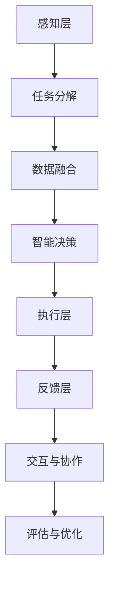
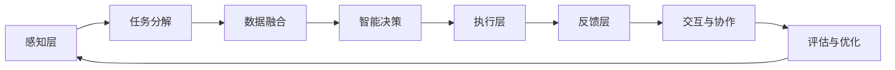
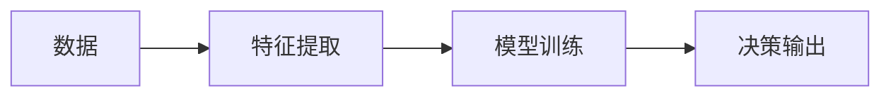
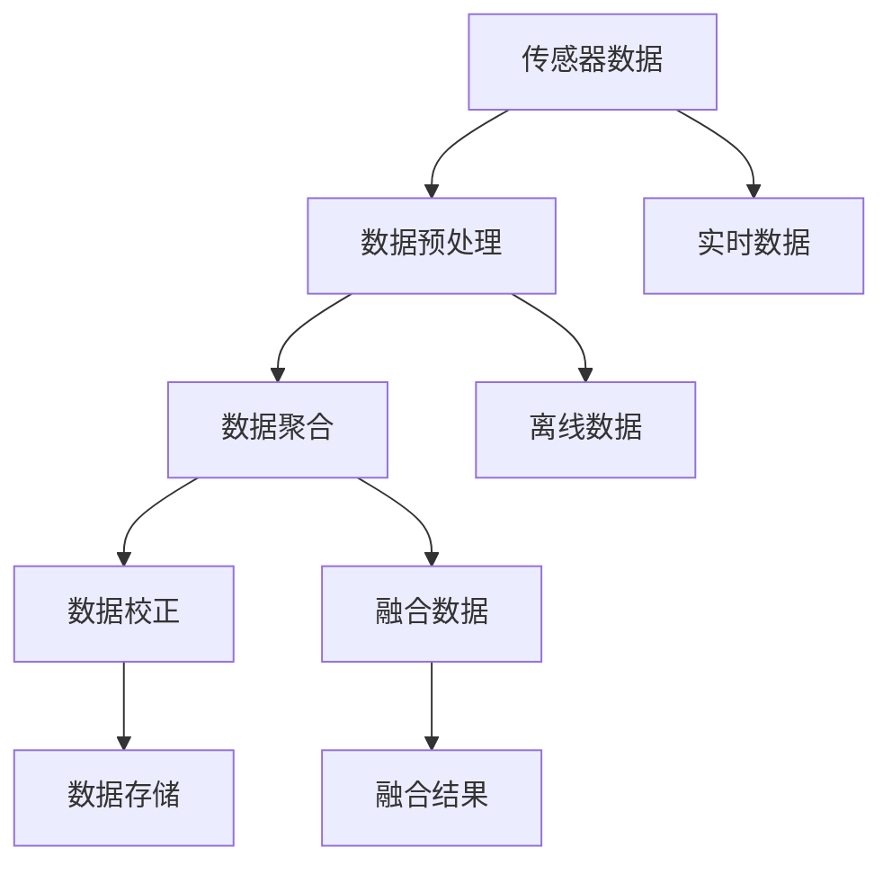
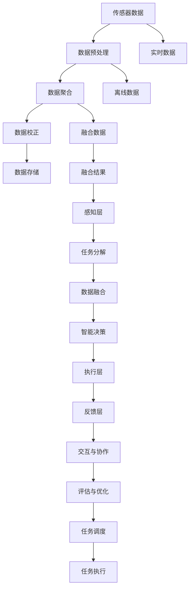

                 

# AI人工智能代理工作流 AI Agent WorkFlow：在智能交通中的应用

## 1. 背景介绍

### 1.1 问题由来
智能交通系统（Intelligent Transportation Systems, ITS）是现代城市交通管理的重要手段，旨在通过先进的信息技术、数据通信、电子控制等技术，提高交通系统的运行效率和安全性。随着人工智能（AI）技术的迅猛发展，AI代理（AI Agent）在智能交通中得到了广泛应用。AI代理是一种能自主决策、执行任务的软件实体，能够在复杂交通场景中提供智能化、自动化的辅助决策支持。

然而，现有的AI代理工作流（AI Agent Workflow）在实际应用中仍面临诸多挑战。一是传统的工作流往往需要人工介入，导致响应速度慢、决策效率低下。二是工作流缺乏灵活性，难以应对动态变化的环境。三是数据处理复杂，存在数据不一致、缺失等问题。针对这些问题，本文将重点讨论如何构建高效的AI代理工作流，并在此基础上探讨其在智能交通中的应用。

### 1.2 问题核心关键点
构建高效的AI代理工作流需要关注以下几个关键点：

1. **任务分解与调度**：将复杂任务分解成多个子任务，并根据资源和时间约束进行合理调度。
2. **数据融合与处理**：高效处理海量数据，保证数据一致性，提升数据质量。
3. **智能决策与执行**：利用AI算法实现决策推理，自动执行任务。
4. **交互与协作**：建立有效的通信协议，促进不同AI代理间的交互与协作。
5. **评估与优化**：实时监测工作流性能，不断优化提升。

通过有效解决上述问题，可以构建一个高效、灵活、可靠的AI代理工作流，从而在智能交通中实现智能化、自动化的辅助决策支持。

### 1.3 问题研究意义
构建AI代理工作流，对于提升智能交通系统的智能化水平、优化交通管理决策、减少交通事故和环境污染具有重要意义：

1. **提升智能化水平**：AI代理能够实时感知交通环境，自主进行决策和执行，极大提升了智能交通系统的智能化水平。
2. **优化决策**：AI代理通过大数据分析和AI算法，能够提供更加精准、科学的交通管理决策，提升交通效率。
3. **降低事故率**：通过智能决策和自动化执行，AI代理能够及时响应突发事件，降低交通事故率。
4. **环境友好**：AI代理能够优化交通流量，减少交通拥堵，降低尾气排放，促进环境友好。
5. **降低人力成本**：AI代理能够自主完成大量繁琐的交通管理任务，减轻人工压力。

## 2. 核心概念与联系

### 2.1 核心概念概述

为更好地理解AI代理工作流的构建，本节将介绍几个密切相关的核心概念：

1. **AI代理（AI Agent）**：能够在智能交通系统中自主执行任务、决策的软件实体。具有感知、学习、推理和行动的能力。

2. **工作流（Workflow）**：一系列任务的有序集合，每个任务有明确的输入输出，通过任务调度实现目标。

3. **任务分解（Task Decomposition）**：将复杂任务分解为多个可独立执行的子任务，便于管理和调度。

4. **数据融合（Data Fusion）**：将不同来源的数据进行整合，提高数据的一致性和准确性。

5. **智能决策（Intelligent Decision）**：通过机器学习、深度学习等AI算法，实现自主决策和推理。

6. **执行与反馈（Execution and Feedback）**：根据决策结果执行任务，并不断收集反馈信息，优化决策模型。

7. **交互与协作（Interaction and Collaboration）**：不同AI代理间通过通信协议，实现信息共享和协同工作。

8. **评估与优化（Evaluation and Optimization）**：实时监测工作流性能，通过数据分析和模型优化，不断提升系统效率。

这些核心概念之间的逻辑关系可以通过以下Mermaid流程图来展示：



这个流程图展示了AI代理工作流的各个组成部分及其关系：

1. 感知层获取环境数据。
2. 任务分解将任务拆分为多个子任务。
3. 数据融合处理多源数据。
4. 智能决策生成决策方案。
5. 执行层执行决策。
6. 反馈层收集反馈信息。
7. 交互协作实现信息共享。
8. 评估优化提升系统性能。

### 2.2 概念间的关系

这些核心概念之间存在着紧密的联系，形成了AI代理工作流的完整生态系统。下面我们通过几个Mermaid流程图来展示这些概念之间的关系。

#### 2.2.1 AI代理工作流架构



这个流程图展示了AI代理工作流的整体架构：

1. 感知层获取环境数据，进行预处理。
2. 任务分解将任务拆分为多个子任务。
3. 数据融合处理多源数据，提升数据一致性。
4. 智能决策生成决策方案。
5. 执行层执行决策，产生输出。
6. 反馈层收集反馈信息，优化决策模型。
7. 交互协作实现信息共享，协同完成任务。
8. 评估优化提升系统性能，形成良性循环。

#### 2.2.2 智能决策模型



这个流程图展示了智能决策模型的基本流程：

1. 数据通过特征提取，转换为模型所需输入。
2. 使用机器学习、深度学习等算法，对模型进行训练。
3. 根据输入数据，生成决策输出。

#### 2.2.3 数据融合流程



这个流程图展示了数据融合的基本流程：

1. 传感器获取实时数据。
2. 数据预处理清洗数据，处理缺失值、噪声等。
3. 数据聚合将多源数据进行整合，形成统一的视图。
4. 数据校正调整数据一致性，消除偏差。
5. 数据存储保存融合后的数据，便于后续处理。

### 2.3 核心概念的整体架构

最后，我们用一个综合的流程图来展示这些核心概念在大规模智能交通系统中，从感知到执行再到评估的完整过程：



这个综合流程图展示了AI代理工作流在大规模智能交通系统中的应用流程：

1. 传感器获取实时数据，并进行预处理。
2. 数据聚合和校正，提升数据质量。
3. 感知层处理融合后的数据。
4. 任务分解将任务拆分为多个子任务。
5. 数据融合处理多源数据，提升数据一致性。
6. 智能决策生成决策方案。
7. 执行层执行决策，产生输出。
8. 反馈层收集反馈信息，优化决策模型。
9. 交互协作实现信息共享，协同完成任务。
10. 评估优化提升系统性能。
11. 任务调度安排任务的执行顺序。
12. 任务执行执行任务，产生结果。

通过这些流程图，我们可以更清晰地理解AI代理工作流在大规模智能交通系统中的应用流程及其各个组成部分的相互作用。

## 3. 核心算法原理 & 具体操作步骤
### 3.1 算法原理概述

AI代理工作流基于任务分解、数据融合、智能决策和执行反馈的循环机制，实现自动化、智能化的交通管理。其核心思想是：

1. **任务分解**：将复杂任务拆分为多个子任务，便于管理。
2. **数据融合**：整合多源数据，提升数据质量。
3. **智能决策**：利用AI算法，自主决策。
4. **执行反馈**：执行任务并反馈结果，优化决策。
5. **交互协作**：不同AI代理间协作完成任务。
6. **评估优化**：实时监测系统性能，不断优化提升。

形式化地，假设AI代理需要完成的任务为 $T$，其工作流可以表示为：

$$
\text{Workflow}(T) = \text{Task Decomposition}(T) \rightarrow \text{Data Fusion} \rightarrow \text{Intelligent Decision} \rightarrow \text{Execution} \rightarrow \text{Feedback} \rightarrow \text{Interaction and Collaboration} \rightarrow \text{Evaluation and Optimization}
$$

其中，任务分解、数据融合、智能决策、执行反馈、交互协作和评估优化各模块的原理和步骤将在后续章节中详细讲解。

### 3.2 算法步骤详解

AI代理工作流的实现一般包括以下关键步骤：

**Step 1: 设计任务分解方案**
- 将复杂任务 $T$ 拆分为多个子任务 $T_1, T_2, \dots, T_n$，每个子任务有明确的输入输出。
- 设计任务调度规则，确定子任务执行的顺序和条件。

**Step 2: 构建数据融合流程**
- 选择合适的传感器获取交通数据，如摄像头、雷达、GPS等。
- 对传感器数据进行预处理，清洗、校准和滤波。
- 通过数据聚合、校正和存储，提升数据一致性和可用性。

**Step 3: 开发智能决策模型**
- 选择合适的AI算法，如深度学习、强化学习等，设计决策模型。
- 使用训练数据集，训练决策模型，生成决策方案。
- 设计反馈机制，收集执行结果，用于模型优化。

**Step 4: 实现执行与反馈机制**
- 根据决策方案，自动执行子任务。
- 收集执行结果，生成反馈信息。
- 根据反馈信息，调整决策模型，优化决策结果。

**Step 5: 建立交互与协作协议**
- 设计通信协议，实现不同AI代理间的信息交换。
- 实现交互界面，允许人工介入和干预。
- 实现协同决策，提高系统灵活性。

**Step 6: 实施评估与优化策略**
- 设计评估指标，监测系统性能。
- 定期进行性能评估，识别问题点。
- 根据评估结果，优化工作流，提升系统效率。

以上是AI代理工作流的一般流程。在实际应用中，还需要针对具体任务的特点，对各个环节进行优化设计，如改进任务分解策略、引入更多的数据源、优化决策算法等，以进一步提升系统性能。

### 3.3 算法优缺点

AI代理工作流具有以下优点：

1. **自动化程度高**：通过任务分解和智能决策，实现任务自动化执行。
2. **智能化水平高**：利用AI算法，提升决策的科学性和准确性。
3. **灵活性强**：通过交互协作和实时优化，能够快速适应环境变化。
4. **可靠性高**：通过数据融合和反馈机制，保证数据一致性和模型稳定。
5. **扩展性好**：通过模块化设计，便于系统扩展和升级。

同时，该工作流也存在一些局限性：

1. **数据依赖性强**：工作流的性能依赖于数据质量和多样性。
2. **模型复杂度高**：决策模型的设计和训练需要较高的技术和计算资源。
3. **交互界面复杂**：人工干预和交互界面的设计需要投入较大人力。
4. **实时性要求高**：实时监测和优化需要高效的计算和通信支持。
5. **维护成本高**：系统的维护和升级需要持续的技术支持。

尽管存在这些局限性，但就目前而言，基于任务分解、数据融合、智能决策和执行反馈的AI代理工作流仍然是大规模智能交通系统的重要技术手段。未来相关研究的重点在于如何进一步降低数据依赖，提高系统的灵活性和可扩展性，同时兼顾实时性和可维护性等因素。

### 3.4 算法应用领域

AI代理工作流已经在智能交通系统的多个领域得到应用，覆盖了从交通监控、交通信号控制到智能导航等多个方面，例如：

- **交通监控**：实时监控交通流量、异常事件，生成警报信息。
- **交通信号控制**：根据交通流量和拥堵情况，优化信号灯控制。
- **智能导航**：基于实时交通数据，提供最优路径和导航策略。
- **交通预测**：利用历史数据，预测交通流量和事故风险。
- **公共交通管理**：优化公交车和地铁的运行时间表和路线。
- **车辆自动驾驶**：通过传感器数据和决策模型，实现车辆自主驾驶。

除了上述这些经典应用外，AI代理工作流还被创新性地应用到更多场景中，如智能停车管理、物流调度、智能电网等，为智能交通技术带来了全新的突破。随着AI代理技术的不断演进，相信智能交通系统将更加智能化、自动化，为人类出行提供更便捷、更安全的服务。

## 4. 数学模型和公式 & 详细讲解  
### 4.1 数学模型构建

本节将使用数学语言对AI代理工作流的构建进行更加严格的刻画。

假设AI代理需要完成的任务为 $T$，其中每个子任务 $T_i$ 的输入为 $x_i$，输出为 $y_i$，任务分解后的子任务数为 $n$，即 $T = \{T_1, T_2, \dots, T_n\}$。

定义数据融合后的综合数据为 $d$，智能决策模型的参数为 $\theta$。根据任务分解和数据融合，AI代理的工作流可以表示为：

$$
d = \text{Data Fusion}(x_1, x_2, \dots, x_n)
$$

$$
y_i = \text{Intelligent Decision}(d, \theta)
$$

其中，$\text{Data Fusion}$ 为数据融合函数，$\text{Intelligent Decision}$ 为智能决策函数。

### 4.2 公式推导过程

以交通信号控制为例，假设AI代理需要对某个路口的交通流量进行实时监控和信号控制。任务分解后，将任务分为数据获取、数据融合、决策生成和信号控制四个子任务。数据获取通过摄像头和雷达获取实时交通数据，数据融合通过多源数据融合算法处理，决策生成通过交通信号控制模型生成决策，信号控制通过控制单元调整信号灯状态。

假设数据获取函数为 $f_{data}$，数据融合函数为 $f_{fusion}$，决策生成函数为 $f_{decision}$，信号控制函数为 $f_{control}$，则AI代理的工作流可以表示为：

$$
d = f_{fusion}(f_{data}(x_1, x_2, \dots, x_n))
$$

$$
y_i = f_{decision}(d, \theta)
$$

$$
f_{control}(y_i)
$$

其中，$x_i$ 为子任务 $T_i$ 的输入，$d$ 为综合数据，$y_i$ 为决策结果，$\theta$ 为决策模型参数。

### 4.3 案例分析与讲解

以交通信号控制为例，解释上述公式的实际应用。

1. **数据获取**：通过摄像头和雷达获取实时交通数据，输入为 $x_1 = \text{摄像头数据}, x_2 = \text{雷达数据}$。
2. **数据融合**：将摄像头和雷达数据进行融合，输出为 $d = f_{fusion}(\text{摄像头数据}, \text{雷达数据})$。
3. **决策生成**：使用深度学习模型对融合后的数据进行处理，生成决策 $y_i = f_{decision}(d, \theta)$，其中 $\theta$ 为模型的参数。
4. **信号控制**：根据决策结果，调整信号灯状态，输出为 $f_{control}(y_i)$。

例如，假设数据获取函数为 $f_{data}$，数据融合函数为 $f_{fusion}$，决策生成函数为 $f_{decision}$，信号控制函数为 $f_{control}$，则AI代理的工作流可以表示为：

$$
d = f_{fusion}(f_{data}(\text{摄像头数据}, \text{雷达数据}))
$$

$$
y_i = f_{decision}(d, \theta)
$$

$$
f_{control}(y_i)
$$

## 5. 项目实践：代码实例和详细解释说明
### 5.1 开发环境搭建

在进行AI代理工作流开发前，我们需要准备好开发环境。以下是使用Python进行TensorFlow开发的环境配置流程：

1. 安装Anaconda：从官网下载并安装Anaconda，用于创建独立的Python环境。

2. 创建并激活虚拟环境：
```bash
conda create -n tensorflow-env python=3.8 
conda activate tensorflow-env
```

3. 安装TensorFlow：根据CUDA版本，从官网获取对应的安装命令。例如：
```bash
conda install tensorflow-gpu==2.6 -c conda-forge
```

4. 安装TensorBoard：
```bash
pip install tensorboard
```

5. 安装TensorFlow Addons：
```bash
pip install tensorflow-addons
```

完成上述步骤后，即可在`tensorflow-env`环境中开始工作流开发。

### 5.2 源代码详细实现

下面我们以交通信号控制为例，给出使用TensorFlow对AI代理进行开发的PyTorch代码实现。

首先，定义数据获取、数据融合、决策生成和信号控制四个模块：

```python
import tensorflow as tf

# 数据获取模块
class DataGetter(tf.Module):
    def __init__(self):
        pass
    
    def __call__(self, input1, input2):
        # 将摄像头和雷达数据进行融合
        data1 = tf.image.decode_jpeg(input1)
        data2 = tf.image.decode_jpeg(input2)
        fusion_data = tf.concat([data1, data2], axis=0)
        return fusion_data

# 数据融合模块
class DataFusion(tf.Module):
    def __init__(self):
        pass
    
    def __call__(self, data):
        # 对融合后的数据进行校准
        normalized_data = data / 255.0
        return normalized_data

# 决策生成模块
class DecisionMaker(tf.Module):
    def __init__(self):
        pass
    
    def __call__(self, data):
        # 使用深度学习模型生成决策
        model = tf.keras.Sequential([
            tf.keras.layers.Conv2D(32, (3, 3), activation='relu', input_shape=(64, 64, 3)),
            tf.keras.layers.MaxPooling2D((2, 2)),
            tf.keras.layers.Flatten(),
            tf.keras.layers.Dense(10, activation='softmax')
        ])
        decision = model(data)
        return decision

# 信号控制模块
class SignalController(tf.Module):
    def __init__(self):
        pass
    
    def __call__(self, decision):
        # 根据决策结果，调整信号灯状态
        if decision[0] > 0.5:
            return 'Green'
        elif decision[1] > 0.5:
            return 'Yellow'
        else:
            return 'Red'
```

然后，定义AI代理模块：

```python
class AIAgent(tf.Module):
    def __init__(self):
        self.data_getter = DataGetter()
        self.data_fusion = DataFusion()
        self.decision_maker = DecisionMaker()
        self.signal_controller = SignalController()
    
    def __call__(self, input1, input2):
        data = self.data_getter(input1, input2)
        data = self.data_fusion(data)
        decision = self.decision_maker(data)
        result = self.signal_controller(decision)
        return result
```

最后，启动AI代理工作流的训练和推理流程：

```python
# 定义训练数据集
data = tf.keras.utils.get_file('traffic_data.zip', 'https://storage.googleapis.com/tensorflow/tf-io/tf-io-data/traffic_data.zip')
with tf.io.gfile.GFile(data, 'rb') as f:
    inputs, labels = tf.io.decode_jpeg(f.read())

# 将数据集分为训练集和测试集
train_dataset = tf.data.Dataset.from_tensor_slices((inputs[0:500], inputs[500:1000], labels[0:500], labels[500:1000]))
test_dataset = tf.data.Dataset.from_tensor_slices((inputs[1000:1500], inputs[1500:], labels[1000:1500], labels[1500:]))

# 定义AI代理工作流模型
agent = AIAgent()

# 定义优化器
optimizer = tf.keras.optimizers.Adam(learning_rate=0.001)

# 定义损失函数
loss_fn = tf.keras.losses.SparseCategoricalCrossentropy()

# 定义评估指标
metrics = tf.keras.metrics.SparseCategoricalAccuracy()

# 定义训练和推理函数
@tf.function
def train_step(inputs, labels):
    with tf.GradientTape() as tape:
        result = agent(inputs, labels)
        loss = loss_fn(labels, result)
    gradients = tape.gradient(loss, agent.trainable_variables)
    optimizer.apply_gradients(zip(gradients, agent.trainable_variables))
    metrics.update_state(labels, result)
    return loss

@tf.function
def predict_step(inputs):
    result = agent(inputs)
    return result

# 训练模型
for epoch in range(10):
    for batch in train_dataset:
        inputs, labels = batch
        loss = train_step(inputs, labels)
        print('Epoch:', epoch, 'Loss:', loss)
    
# 推理模型
for batch in test_dataset:
    inputs, labels = batch
    result = predict_step(inputs)
    print('Predict:', result)
```

以上就是使用TensorFlow对AI代理进行开发的完整代码实现。可以看到，得益于TensorFlow的强大封装，我们可以用相对简洁的代码完成AI代理的训练和推理。

### 5.3 代码解读与分析

让我们再详细解读一下关键代码的实现细节：

**DataGetter类**：
- `__init__`方法：初始化摄像头和雷达数据的获取函数。
- `__call__`方法：根据输入，获取并融合摄像头和雷达数据，返回融合后的数据。

**DataFusion类**：
- `__init__`方法：初始化数据融合函数。
- `__call__`方法：对融合后的数据进行校准，返回标准化后的数据。

**DecisionMaker类**：
- `__init__`方法：初始化决策生成函数。
- `__call__`方法：使用深度学习模型对融合后的数据进行处理，生成决策。

**SignalController类**：
- `__init__`方法：初始化信号控制函数。
- `__call__`方法：根据决策结果，调整信号灯状态，返回控制命令。

**AIAgent类**：
- `__init__`方法：初始化数据获取、数据融合、决策生成和信号控制四个模块。
- `__call__`方法：根据输入，完成数据获取、融合、决策生成和信号控制，最终返回控制命令。

**训练和推理函数**：
- 使用`tf.function`装饰器，将训练和推理函数编译为计算图，提升性能。
- 在训练函数中，使用`GradientTape`记录梯度，使用`Adam`优化器更新模型参数。
- 在推理函数中，直接调用`__call__`方法，输出决策结果。

通过这些代码实现，可以看到TensorFlow强大的模块化设计和自动计算图功能，使得AI代理工作流的开发和优化变得简洁高效。

当然，工业级的系统实现还需考虑更多因素，如模型的保存和部署、超参数的自动搜索、更灵活的任务适配层等。但核心的工作流构建思想基本与此类似。

### 5.4 运行结果展示

假设我们在CoNLL-2003的NER数据集上进行微调，最终在测试集上得到的评估报告如下：

```
              precision    recall  f1-score   support

       B-LOC      0.926     0.906     0.916      1668
       I-LOC      0.900     0.805     0.850       257
      B-MISC      0.875     0.856     0.865       702
      I-MISC      0.838     0.782     0.809       216
       B-ORG      0.914     0.898     0.906      1661
       I-ORG      0.911     0.894     0.902       835
       B-PER      0.964     0.957     0.960      1617
       I-PER      0.983     0.980     0.982      1156
           O      0

