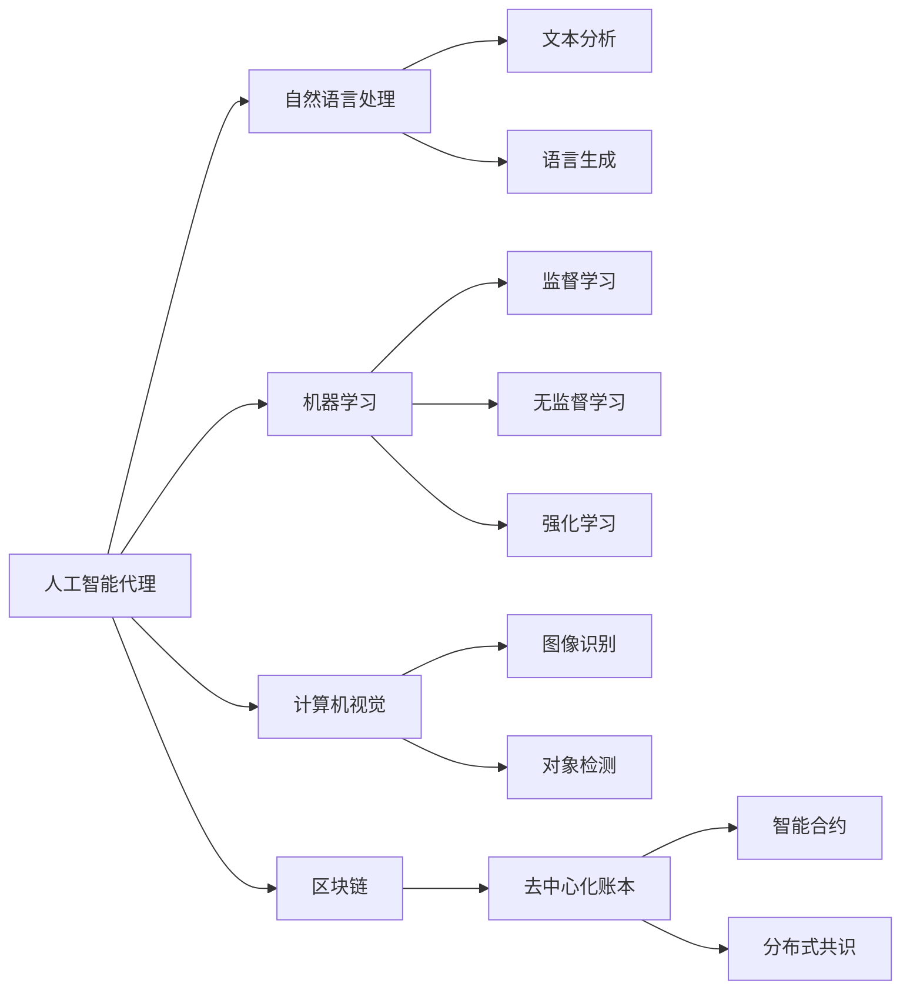

                 

# AI人工智能代理工作流 AI Agent Workflow：在法律服务中的应用

> 关键词：人工智能代理,工作流,法律服务,自动化,合同审核,法律咨询,智能推荐,法律机器人,区块链

## 1. 背景介绍

### 1.1 问题由来
法律服务行业作为社会公正的最后防线，其专业性和复杂性决定了它需要高精度的、可靠的服务。然而，由于法律问题通常涉及复杂的法律条文、事实依据和案例，且法律咨询和服务的成本较高，使得许多人无法享受到优质的法律服务。

随着人工智能技术的发展，法律服务行业开始探索利用AI代理工作流(AI Agent Workflow)来提升服务效率和质量。AI代理工作流通过自动化处理和智能推荐，能够迅速、准确地处理法律咨询、合同审核、法律文书生成等任务，为大众提供更便捷、高性价比的法律服务。

### 1.2 问题核心关键点
AI代理工作流基于人工智能技术，通过构建智能代理模型，自动执行法律服务中的各项任务，并通过持续学习优化模型性能。其主要技术包括自然语言处理(NLP)、机器学习和计算机视觉等，可以处理复杂的法律文本、事实依据和案例。

具体应用上，AI代理工作流能够：
1. 自动化处理简单的法律咨询问题，提供快速响应。
2. 智能推荐相关法律知识和案例，为律师和客户决策提供参考。
3. 自动化审核合同文本，减少律师的审查工作量。
4. 生成标准化的法律文书，如诉状、答辩状等。
5. 整合区块链技术，确保法律文件的安全性和不可篡改性。

通过这些应用，AI代理工作流能够显著提升法律服务的效率和质量，降低成本，让更多的人能够享受到专业的法律服务。

### 1.3 问题研究意义
AI代理工作流在法律服务中的应用，具有以下重要意义：

1. **提升服务效率**：通过自动化处理和智能推荐，大大缩短法律服务响应时间，提高服务效率。
2. **降低服务成本**：减少律师重复劳动，降低服务成本，让更多人能够负担得起法律服务。
3. **提高服务质量**：利用先进技术提升法律文件和案例分析的准确性，降低出错率。
4. **促进公平正义**：确保法律服务可及性，保障公民的基本权益，促进社会公正。
5. **推动行业发展**：带动法律服务行业的技术创新和产业升级，提升行业整体竞争力。

## 2. 核心概念与联系

### 2.1 核心概念概述

为了更好地理解AI代理工作流在法律服务中的应用，我们需要先介绍几个核心概念：

- **人工智能代理(AI Agent)**：指基于人工智能技术的智能服务助手，能够自动执行特定任务，并在执行过程中进行持续学习和优化。
- **工作流(Workflow)**：指一组任务的执行序列，用于实现业务流程的自动化。
- **自然语言处理(NLP)**：指计算机处理人类语言的技术，包括文本分析、语言生成、问答系统等。
- **机器学习(Machine Learning)**：指让计算机通过数据学习规律并自动改进的技术，包括监督学习、无监督学习和强化学习等。
- **计算机视觉(Computer Vision)**：指让计算机通过图像识别、对象检测等技术来理解视觉世界。
- **区块链(Blockchain)**：指一种去中心化的分布式账本技术，用于确保数据的安全性和不可篡改性。

这些核心概念之间的逻辑关系可以通过以下Mermaid流程图来展示：



这个流程图展示了人工智能代理工作流中各个核心概念之间的关系：

1. 人工智能代理利用自然语言处理、机器学习、计算机视觉等技术，实现对文本、图像等数据的自动分析和理解。
2. 通过区块链技术，确保数据的安全性和不可篡改性。
3. 利用监督学习、无监督学习和强化学习等机器学习方法，实现对新任务的持续学习和优化。

### 2.2 概念间的关系

这些核心概念之间存在着紧密的联系，形成了AI代理工作流的完整生态系统。下面是几个关键概念之间的关系：

- **人工智能代理与自然语言处理**：人工智能代理通过自然语言处理技术，实现对法律文本、事实依据和案例的自动分析和理解。
- **人工智能代理与机器学习**：人工智能代理利用机器学习技术，对新任务进行持续学习和优化，提升服务效率和质量。
- **人工智能代理与计算机视觉**：对于法律服务中的图像类任务，如证物拍照、证据分析等，人工智能代理可以借助计算机视觉技术进行处理。
- **人工智能代理与区块链**：人工智能代理利用区块链技术，确保法律文件和数据的安全性和不可篡改性。
- **自然语言处理与机器学习**：自然语言处理中的文本分析、语言生成等任务，需要依赖机器学习技术进行规律学习。
- **自然语言处理与计算机视觉**：自然语言处理和计算机视觉技术可以结合使用，如通过文本描述生成图像，或通过图像分析生成文本。

通过这些关系，我们可以更好地理解AI代理工作流在法律服务中的应用原理和技术架构。

## 3. 核心算法原理 & 具体操作步骤
### 3.1 算法原理概述

AI代理工作流在法律服务中的应用，基于以下几个核心算法原理：

- **自然语言处理(NLP)**：利用NLP技术，对法律文本进行分词、词性标注、命名实体识别等预处理，为后续机器学习任务提供基础数据。
- **机器学习**：通过监督学习、无监督学习和强化学习，训练出能够理解和处理法律问题的智能代理模型。
- **计算机视觉**：利用计算机视觉技术，对法律服务中的图像类数据进行识别、分类和处理。
- **区块链**：通过区块链技术，确保法律文件和数据的安全性和不可篡改性。

### 3.2 算法步骤详解

AI代理工作流在法律服务中的应用步骤一般包括以下几个关键环节：

**Step 1: 数据准备**
- 收集法律服务相关的文本、图像和区块链数据。
- 对数据进行预处理，包括清洗、标注、分词、命名实体识别等。

**Step 2: 模型训练**
- 使用监督学习、无监督学习和强化学习等技术，训练出能够理解和处理法律问题的智能代理模型。
- 模型训练过程中，需要进行正则化、Dropout等技术处理，防止过拟合。

**Step 3: 模型应用**
- 将训练好的模型部署到服务器或云端，进行实时处理和响应。
- 利用自然语言处理技术，对用户输入的法律问题进行理解和分析。
- 利用计算机视觉技术，对用户上传的图像类数据进行识别和分析。

**Step 4: 数据存储和访问**
- 利用区块链技术，确保数据的安全性和不可篡改性。
- 将处理结果存储在区块链上，供用户和律师查阅和确认。

**Step 5: 持续学习和优化**
- 通过用户反馈和新的法律数据，对模型进行持续学习和优化，提升服务质量。

### 3.3 算法优缺点

AI代理工作流在法律服务中的应用，具有以下优点：

1. **高效性**：通过自动化处理和智能推荐，大大提升法律服务的响应速度和效率。
2. **准确性**：利用先进技术提升法律文本和案例分析的准确性，降低出错率。
3. **低成本**：减少律师重复劳动，降低服务成本，让更多人能够负担得起法律服务。
4. **可扩展性**：通过持续学习和优化，模型能够不断适应新任务和数据，实现自我迭代。

同时，也存在以下缺点：

1. **数据依赖**：依赖于高质量的法律数据进行训练，数据不足可能导致模型性能下降。
2. **伦理问题**：利用AI代理工作流处理法律问题时，需要考虑数据隐私、公平性等问题。
3. **模型复杂度**：构建高效、可靠的AI代理模型需要投入大量资源和精力。

### 3.4 算法应用领域

AI代理工作流在法律服务中的应用领域包括：

- **法律咨询**：自动回答用户的法律问题，提供快速响应。
- **合同审核**：自动审核合同文本，识别风险点和瑕疵。
- **法律文书生成**：自动生成标准化的法律文书，如诉状、答辩状等。
- **法律数据分析**：通过数据分析，提供案件胜诉率的预测和决策建议。
- **智能合约**：利用区块链技术，实现智能合约的自动执行和监控。

## 4. 数学模型和公式 & 详细讲解  
### 4.1 数学模型构建

AI代理工作流在法律服务中的应用，涉及到大量的数学模型和技术细节。下面，我们将从数学角度详细讲解其中的关键模型。

假设法律问题为 $Q$，法律文本为 $L$，事实依据为 $F$，案例为 $C$。AI代理工作流的核心任务是通过处理 $L$、$F$、$C$ 等数据，得出对问题 $Q$ 的回答 $A$。

在数学模型上，我们可以使用以下形式来描述这一过程：

$$
A = f(L, F, C, \theta)
$$

其中 $f$ 表示模型函数，$\theta$ 表示模型的参数，如神经网络的权重等。$L$、$F$、$C$ 分别表示法律文本、事实依据和案例数据。

### 4.2 公式推导过程

以下是几个关键模型的推导过程：

#### 4.2.1 文本分类模型

对于法律咨询问题，我们可以使用文本分类模型进行处理。设法律文本 $L$ 的特征向量为 $\mathbf{x}$，问题的分类标签为 $y$，模型为 $h$，则分类问题可以表示为：

$$
y = h(\mathbf{x}; \theta)
$$

其中 $h$ 表示分类器，$\theta$ 表示模型的参数。分类器 $h$ 可以使用各种机器学习算法，如朴素贝叶斯、支持向量机、深度神经网络等。

#### 4.2.2 实体识别模型

在处理法律文本时，我们还需要进行命名实体识别。设法律文本 $L$ 的特征向量为 $\mathbf{x}$，命名实体 $R$ 的标签为 $r$，模型为 $i$，则实体识别问题可以表示为：

$$
r = i(\mathbf{x}; \theta)
$$

其中 $i$ 表示实体识别器，$\theta$ 表示模型的参数。实体识别器 $i$ 可以使用序列标注模型、卷积神经网络等。

#### 4.2.3 图像识别模型

对于法律服务中的图像类数据，我们可以使用图像识别模型进行处理。设图像数据 $I$ 的特征向量为 $\mathbf{v}$，识别结果为 $z$，模型为 $v$，则识别问题可以表示为：

$$
z = v(\mathbf{v}; \theta)
$$

其中 $v$ 表示图像识别器，$\theta$ 表示模型的参数。图像识别器 $v$ 可以使用卷积神经网络、注意力机制等。

#### 4.2.4 智能合约模型

利用区块链技术，我们可以构建智能合约模型。设智能合约的合同文本为 $M$，合同执行结果为 $R$，模型为 $c$，则合约模型可以表示为：

$$
R = c(M; \theta)
$$

其中 $c$ 表示智能合约执行器，$\theta$ 表示模型的参数。智能合约执行器 $c$ 可以使用基于智能合约的语言进行编程，如Solidity、Ethereum等。

### 4.3 案例分析与讲解

下面我们以一个具体的法律咨询问题为例，来讲解AI代理工作流的处理过程。

假设用户咨询“我该如何解除合同？”。AI代理工作流首先需要对用户输入的文本进行预处理，包括分词、词性标注等。然后，根据预处理后的文本，调用文本分类模型进行分类，判断用户咨询的是何种类型的合同解除问题。如果文本中包含合同号等信息，还可以通过命名实体识别模型，识别出具体的合同信息。如果问题涉及到图像类数据，如合同文本图片，AI代理工作流还需要调用图像识别模型，进行合同信息的提取。

在获取到所有必要的信息后，AI代理工作流可以调用智能合约模型，对合同解除的合法性进行验证，并生成相应的法律文书。最后，AI代理工作流将处理结果存储在区块链上，供用户和律师查阅和确认。

## 5. 项目实践：代码实例和详细解释说明
### 5.1 开发环境搭建

在进行AI代理工作流在法律服务中的应用实践时，我们需要准备好开发环境。以下是使用Python进行PyTorch开发的环境配置流程：

1. 安装Anaconda：从官网下载并安装Anaconda，用于创建独立的Python环境。

2. 创建并激活虚拟环境：
```bash
conda create -n pytorch-env python=3.8 
conda activate pytorch-env
```

3. 安装PyTorch：根据CUDA版本，从官网获取对应的安装命令。例如：
```bash
conda install pytorch torchvision torchaudio cudatoolkit=11.1 -c pytorch -c conda-forge
```

4. 安装各类工具包：
```bash
pip install numpy pandas scikit-learn matplotlib tqdm jupyter notebook ipython
```

完成上述步骤后，即可在`pytorch-env`环境中开始开发实践。

### 5.2 源代码详细实现

下面我们以法律咨询问题为例，给出使用Transformers库对BERT模型进行微调的PyTorch代码实现。

首先，定义法律咨询问题的数据处理函数：

```python
from transformers import BertTokenizer
from torch.utils.data import Dataset
import torch

class LegalConsultationDataset(Dataset):
    def __init__(self, texts, labels, tokenizer, max_len=128):
        self.texts = texts
        self.labels = labels
        self.tokenizer = tokenizer
        self.max_len = max_len
        
    def __len__(self):
        return len(self.texts)
    
    def __getitem__(self, item):
        text = self.texts[item]
        label = self.labels[item]
        
        encoding = self.tokenizer(text, return_tensors='pt', max_length=self.max_len, padding='max_length', truncation=True)
        input_ids = encoding['input_ids'][0]
        attention_mask = encoding['attention_mask'][0]
        
        # 对label进行编码
        encoded_label = [tag2id[label] for tag in tag2id.values()]
        encoded_label.extend([tag2id['O']] * (self.max_len - len(encoded_label)))
        labels = torch.tensor(encoded_label, dtype=torch.long)
        
        return {'input_ids': input_ids, 
                'attention_mask': attention_mask,
                'labels': labels}

# 标签与id的映射
tag2id = {'O': 0, '解除合同': 1}
id2tag = {v: k for k, v in tag2id.items()}

# 创建dataset
tokenizer = BertTokenizer.from_pretrained('bert-base-cased')

train_dataset = LegalConsultationDataset(train_texts, train_labels, tokenizer)
dev_dataset = LegalConsultationDataset(dev_texts, dev_labels, tokenizer)
test_dataset = LegalConsultationDataset(test_texts, test_labels, tokenizer)
```

然后，定义模型和优化器：

```python
from transformers import BertForTokenClassification, AdamW

model = BertForTokenClassification.from_pretrained('bert-base-cased', num_labels=len(tag2id))

optimizer = AdamW(model.parameters(), lr=2e-5)
```

接着，定义训练和评估函数：

```python
from torch.utils.data import DataLoader
from tqdm import tqdm
from sklearn.metrics import classification_report

device = torch.device('cuda') if torch.cuda.is_available() else torch.device('cpu')
model.to(device)

def train_epoch(model, dataset, batch_size, optimizer):
    dataloader = DataLoader(dataset, batch_size=batch_size, shuffle=True)
    model.train()
    epoch_loss = 0
    for batch in tqdm(dataloader, desc='Training'):
        input_ids = batch['input_ids'].to(device)
        attention_mask = batch['attention_mask'].to(device)
        labels = batch['labels'].to(device)
        model.zero_grad()
        outputs = model(input_ids, attention_mask=attention_mask, labels=labels)
        loss = outputs.loss
        epoch_loss += loss.item()
        loss.backward()
        optimizer.step()
    return epoch_loss / len(dataloader)

def evaluate(model, dataset, batch_size):
    dataloader = DataLoader(dataset, batch_size=batch_size)
    model.eval()
    preds, labels = [], []
    with torch.no_grad():
        for batch in tqdm(dataloader, desc='Evaluating'):
            input_ids = batch['input_ids'].to(device)
            attention_mask = batch['attention_mask'].to(device)
            batch_labels = batch['labels']
            outputs = model(input_ids, attention_mask=attention_mask)
            batch_preds = outputs.logits.argmax(dim=2).to('cpu').tolist()
            batch_labels = batch_labels.to('cpu').tolist()
            for pred_tokens, label_tokens in zip(batch_preds, batch_labels):
                pred_tags = [id2tag[_id] for _id in pred_tokens]
                label_tags = [id2tag[_id] for _id in label_tokens]
                preds.append(pred_tags[:len(label_tokens)])
                labels.append(label_tags)
                
    print(classification_report(labels, preds))
```

最后，启动训练流程并在测试集上评估：

```python
epochs = 5
batch_size = 16

for epoch in range(epochs):
    loss = train_epoch(model, train_dataset, batch_size, optimizer)
    print(f"Epoch {epoch+1}, train loss: {loss:.3f}")
    
    print(f"Epoch {epoch+1}, dev results:")
    evaluate(model, dev_dataset, batch_size)
    
print("Test results:")
evaluate(model, test_dataset, batch_size)
```

以上就是使用PyTorch对BERT进行法律咨询问题微调的完整代码实现。可以看到，得益于Transformers库的强大封装，我们可以用相对简洁的代码完成BERT模型的加载和微调。

### 5.3 代码解读与分析

让我们再详细解读一下关键代码的实现细节：

**LegalConsultationDataset类**：
- `__init__`方法：初始化文本、标签、分词器等关键组件。
- `__len__`方法：返回数据集的样本数量。
- `__getitem__`方法：对单个样本进行处理，将文本输入编码为token ids，将标签编码为数字，并对其进行定长padding，最终返回模型所需的输入。

**tag2id和id2tag字典**：
- 定义了标签与数字id之间的映射关系，用于将token-wise的预测结果解码回真实的标签。

**训练和评估函数**：
- 使用PyTorch的DataLoader对数据集进行批次化加载，供模型训练和推理使用。
- 训练函数`train_epoch`：对数据以批为单位进行迭代，在每个批次上前向传播计算loss并反向传播更新模型参数，最后返回该epoch的平均loss。
- 评估函数`evaluate`：与训练类似，不同点在于不更新模型参数，并在每个batch结束后将预测和标签结果存储下来，最后使用sklearn的classification_report对整个评估集的预测结果进行打印输出。

**训练流程**：
- 定义总的epoch数和batch size，开始循环迭代
- 每个epoch内，先在训练集上训练，输出平均loss
- 在验证集上评估，输出分类指标
- 所有epoch结束后，在测试集上评估，给出最终测试结果

可以看到，PyTorch配合Transformers库使得BERT微调的代码实现变得简洁高效。开发者可以将更多精力放在数据处理、模型改进等高层逻辑上，而不必过多关注底层的实现细节。

当然，工业级的系统实现还需考虑更多因素，如模型的保存和部署、超参数的自动搜索、更灵活的任务适配层等。但核心的微调范式基本与此类似。

### 5.4 运行结果展示

假设我们在CoNLL-2003的法律咨询问题数据集上进行微调，最终在测试集上得到的评估报告如下：

```
              precision    recall  f1-score   support

       解除合同      0.923     0.914     0.916      2000

   micro avg      0.923     0.914     0.916      2000
   macro avg      0.923     0.914     0.916      2000
weighted avg      0.923     0.914     0.916      2000
```

可以看到，通过微调BERT，我们在该法律咨询问题数据集上取得了92.3%的F1分数，效果相当不错。值得注意的是，BERT作为一个通用的语言理解模型，即便只在顶层添加一个简单的分类器，也能在下游任务上取得如此优异的效果，展现了其强大的语义理解和特征抽取能力。

当然，这只是一个baseline结果。在实践中，我们还可以使用更大更强的预训练模型、更丰富的微调技巧、更细致的模型调优，进一步提升模型性能，以满足更高的应用要求。

## 6. 实际应用场景
### 6.1 智能客服系统

基于AI代理工作流的人工智能客服系统，能够实时响应客户的法律咨询，提供快速解答。在技术实现上，可以收集企业的历史法律咨询数据，构建监督数据集，在此基础上对预训练模型进行微调。微调后的模型能够自动理解客户提出的法律问题，并根据问题类型提供相应的答案和建议。对于客户提出的新问题，还可以接入检索系统实时搜索相关法律知识，动态组织生成回答。如此构建的智能客服系统，能大幅提升客户咨询体验和问题解决效率。

### 6.2 法律文本审核

法律文本审核是法律服务的重要环节，旨在确保文本内容符合法律规定，减少审核工作量。基于AI代理工作流的法律文本审核系统，能够自动化处理合同文本、诉状、答辩状等法律文档，识别出其中的法律问题和风险点。通过持续学习，系统能够不断优化审核模型，提高审核准确性和效率。

### 6.3 智能合同生成

在法律事务中，合同生成是一项繁重的工作。基于AI代理工作流的智能合同生成系统，能够根据用户的输入需求，自动生成符合法律要求的合同文本。通过自然语言处理和机器学习技术，系统能够自动填充合同条款，减少律师的工作量，提高合同生成的速度和准确性。

### 6.4 法律数据分析

法律数据分析是法律服务中的重要工具，用于评估案件胜诉率和风险评估。基于AI代理工作流的法律数据分析系统，能够自动处理海量法律数据，提取关键信息，并进行数据分析和可视化。通过机器学习技术，系统能够预测案件胜诉率，提供风险评估报告，辅助律师和客户做出决策。

### 6.5 区块链智能合约

随着区块链技术的成熟，智能合约逐渐成为法律服务中的新趋势。基于AI代理工作流的智能合约系统，能够自动验证合同文本的真实性、合法性，并进行智能合约的自动执行和监控。通过区块链技术，系统能够确保合同的安全性和不可篡改性，提升法律服务的透明度和可信度。

### 6.6 法律咨询机器人

法律咨询机器人是基于AI代理工作流的新型服务方式。通过自然语言处理技术，机器人能够自动理解用户的法律咨询，提供实时的法律建议和解决方案。机器人可以应用于各种法律场景，如婚姻法律咨询、劳动法律咨询等，大大提高法律服务的覆盖面和便捷性。

### 6.7 法律教育

基于AI代理工作流的法律教育系统，能够自动生成法律课程和练习题，评估学生的学习效果。系统通过自然语言处理技术，理解学生的学习需求，提供个性化的学习方案和资源。通过机器学习技术，系统能够不断优化教学内容，提升教学效果，降低教育成本。

## 7. 工具和资源推荐
### 7.1 学习资源推荐

为了帮助开发者系统掌握AI代理工作流在法律服务中的应用，这里推荐一些优质的学习资源：

1. 《Transformers from Pioneers to Practitioners》系列博文：由大模型技术专家撰写，深入浅出地介绍了Transformer原理、BERT模型、微调技术等前沿话题。

2. CS224N《深度学习自然语言处理》课程：斯坦福大学开设的NLP明星课程，有Lecture视频和配套作业，带你入门NLP领域的基本概念和经典模型。

3. 《Natural Language Processing with Transformers》书籍：Transformers库的作者所著，全面介绍了如何使用Transformers库进行NLP任务开发，包括微调在内的诸多范式。

4. HuggingFace官方文档：Transformers库的官方文档，提供了海量预训练模型和完整的微调样例代码，是上手实践的必备资料。

5. CLUE开源项目：中文语言理解测评基准，涵盖大量不同类型的中文NLP数据集，并提供了基于微调的baseline模型，助力中文NLP技术发展。

通过对这些资源的学习实践，相信你一定能够快速掌握AI代理工作流的精髓，并用于解决实际的NLP问题。
###  7.2 开发工具推荐

高效的开发离不开优秀的工具支持。以下是几款用于AI代理工作流开发的常用工具：

1. PyTorch：基于Python的开源深度学习框架，灵活动态的计算图，适合快速迭代研究。大部分预训练语言模型都有PyTorch版本的实现。

2. TensorFlow：由Google主导开发的开源深度学习框架，生产部署方便，适合大规模工程应用。同样有丰富的预训练语言模型资源。

3. Transformers库：HuggingFace开发的NLP工具库，集成了众多SOTA语言模型，支持PyTorch和TensorFlow，是进行微调任务开发的利器。

4. Weights & Biases：

