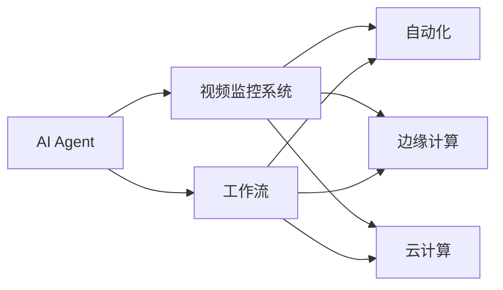
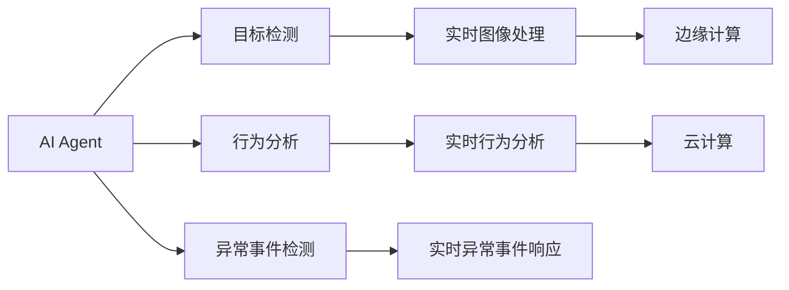

                 

# AI人工智能代理工作流 AI Agent WorkFlow：在视频监控中的应用

> 关键词：人工智能代理(AI Agent)，视频监控，工作流，自动化，图像处理，深度学习，计算机视觉，实时分析，边缘计算，云计算

## 1. 背景介绍

随着人工智能(AI)技术的飞速发展，其在视频监控领域的应用日益广泛。视频监控系统不仅能实时捕捉和记录监控场景，还能通过图像识别、行为分析等手段，实现智能预警、异常检测、事件跟踪等功能。然而，传统的视频监控系统往往依赖于中心化的服务器进行图像处理和分析，存在计算负担重、响应时间长、处理能力有限等问题。

AI人工智能代理工作流(AI Agent Workflow)的引入，则有望解决这些问题，进一步提升视频监控系统的智能化水平。AI Agent作为智能监控的核心单元，能够执行复杂的监控任务，如目标检测、行为分析、异常事件检测等，同时还能将任务结果实时反馈到监控中心，供人工审核或自动化处理。通过构建基于AI Agent的监控工作流，可以实现更加灵活、高效、智能的监控应用。

## 2. 核心概念与联系

### 2.1 核心概念概述

为更好地理解AI Agent在视频监控中的应用，本节将介绍几个关键的概念：

- **AI Agent**：AI Agent是具有智能推理和决策能力的软件实体，能够执行特定的任务，如目标检测、行为分析、事件跟踪等。在视频监控中，AI Agent可以通过深度学习模型识别监控图像中的对象、事件和行为，实时做出响应。

- **视频监控系统**：由摄像头、视频存储、图像处理、事件分析等模块组成的系统，用于实时捕捉、存储和分析监控场景中的视频数据。

- **工作流**：工作流是将多个任务和步骤按照一定的顺序组织起来，实现任务自动化和协同处理的过程。在视频监控中，工作流可以描述AI Agent的任务执行顺序，协调各个环节的协同工作。

- **自动化**：通过自动化技术，减少人工干预，提高任务执行的效率和准确性。在视频监控中，自动化技术可以帮助监控系统自动识别异常事件，快速响应，减少人工审核负担。

- **边缘计算**：边缘计算是指将数据处理和分析任务从中心服务器迁移到靠近数据源的计算节点，减少网络延迟，提升处理效率。在视频监控中，边缘计算可以帮助监控系统在本地完成图像处理和分析任务，降低对中心服务器的依赖。

- **云计算**：云计算提供强大的计算资源和存储能力，支持大规模数据处理和分析任务。在视频监控中，云计算可以支持大量AI Agent的协同工作，实现实时视频流的存储和分析。

这些概念通过如图示所描述的联系，构成了AI Agent在视频监控中的应用基础。



这个图示展示了AI Agent与视频监控系统的关系，以及它们如何通过工作流、自动化、边缘计算和云计算等技术相互关联。通过这些技术，AI Agent能够高效地执行监控任务，并将结果实时反馈到监控中心。

### 2.2 概念间的关系

这些核心概念之间的关系可以通过以下示意图进行进一步展示：



这个示意图展示了AI Agent在视频监控中的主要任务及其处理方式。AI Agent通过目标检测、行为分析和异常事件检测等任务，对监控视频进行实时处理。处理结果通过边缘计算和云计算进行协同工作，最终实现实时图像处理、行为分析和异常事件响应等功能。

## 3. 核心算法原理 & 具体操作步骤
### 3.1 算法原理概述

AI Agent在视频监控中的应用，主要依赖于深度学习模型和算法。以下是几种常用的深度学习模型及其原理：

- **卷积神经网络(CNN)**：CNN通过卷积操作提取图像的特征，用于目标检测和图像分类等任务。在视频监控中，CNN模型可以对监控视频帧进行特征提取，实现对监控场景中物体和事件的高效识别。

- **循环神经网络(RNN)**：RNN通过时间序列的循环操作，处理序列数据，用于行为分析和异常事件检测等任务。在视频监控中，RNN模型可以对连续的视频帧进行分析，检测异常行为和事件。

- **自编码器(AE)**：AE通过编码器-解码器结构，实现数据的压缩和重构，用于图像去噪和异常检测等任务。在视频监控中，AE模型可以对监控视频进行去噪处理，提高图像质量，同时检测异常事件。

AI Agent的工作流通常包括以下步骤：

1. **数据采集**：通过摄像头捕捉视频数据，并将其输入AI Agent进行后续处理。

2. **目标检测**：利用CNN模型对视频帧中的对象进行检测和识别，标记出感兴趣的目标。

3. **行为分析**：通过RNN模型对连续视频帧进行分析，检测目标的行为模式和异常行为。

4. **异常事件检测**：根据行为分析结果和异常行为库，判断是否存在异常事件，并发出预警信号。

5. **实时响应**：根据预警信号，执行相应的实时响应操作，如录像回放、报警通知等。

6. **数据存储**：将监控数据和处理结果存储到本地或云端，供后续分析使用。

### 3.2 算法步骤详解

以下以目标检测为例，详细介绍AI Agent在视频监控中的应用步骤：

1. **数据准备**：将监控视频数据输入AI Agent，并进行预处理，如裁剪、缩放、归一化等。

2. **特征提取**：利用CNN模型对视频帧进行特征提取，生成特征向量。

3. **目标检测**：通过目标检测算法，在特征向量中识别出感兴趣的目标，并标记其位置和类别。

4. **行为分析**：利用RNN模型对连续视频帧进行分析，检测目标的行为模式和异常行为。

5. **异常事件检测**：根据行为分析结果和异常行为库，判断是否存在异常事件，并发出预警信号。

6. **实时响应**：根据预警信号，执行相应的实时响应操作，如录像回放、报警通知等。

7. **数据存储**：将监控数据和处理结果存储到本地或云端，供后续分析使用。

### 3.3 算法优缺点

AI Agent在视频监控中的应用具有以下优点：

- **实时响应**：AI Agent能够实时检测和响应异常事件，提高监控系统的响应速度。

- **智能推理**：通过深度学习模型和算法，AI Agent能够自动进行图像处理和行为分析，减少人工干预。

- **协同工作**：AI Agent能够协同工作，实现更复杂、更高效的监控任务。

- **可扩展性**：AI Agent的架构具有高度的可扩展性，能够根据监控需求增加或调整任务。

然而，AI Agent在视频监控中的应用也存在一些缺点：

- **计算资源需求高**：深度学习模型的训练和推理需要大量的计算资源，对硬件设备要求较高。

- **数据依赖性强**：AI Agent的性能依赖于高质量的标注数据，数据收集和标注成本较高。

- **模型更新难度大**：一旦模型训练完毕，更新和维护难度较大，需要持续的模型调优和优化。

- **安全性问题**：AI Agent的推理过程和决策逻辑可能存在漏洞，容易被攻击和滥用。

### 3.4 算法应用领域

AI Agent在视频监控中的应用不仅限于目标检测、行为分析和异常事件检测，还广泛应用于以下几个领域：

- **人员管理**：通过对监控视频中的人员行为进行分析，实现人员进出管理、异常人员检测等功能。

- **车辆管理**：通过对监控视频中的车辆行为进行分析，实现车辆进出管理、异常车辆检测等功能。

- **环境监测**：通过对监控视频中的环境变化进行分析，实现环境异常检测、设备状态监测等功能。

- **公共安全**：通过对监控视频中的异常行为和事件进行分析，实现公共安全预警、事件跟踪等功能。

## 4. 数学模型和公式 & 详细讲解 & 举例说明

### 4.1 数学模型构建

在视频监控中，AI Agent通常使用深度学习模型进行图像处理和行为分析。以下是几个常用的数学模型及其构建方法：

- **目标检测模型**：假设目标检测模型为 $f(x)$，其中 $x$ 为输入的视频帧特征向量。模型的输出为 $y$，表示目标的位置和类别。模型的损失函数为：

$$
\mathcal{L}(f(x),y) = \mathcal{L}_{loc}(f(x),y_{loc}) + \mathcal{L}_{cls}(f(x),y_{cls})
$$

其中，$\mathcal{L}_{loc}$ 和 $\mathcal{L}_{cls}$ 分别表示位置和类别的损失函数。

- **行为分析模型**：假设行为分析模型为 $g(x)$，其中 $x$ 为连续视频帧的特征向量序列。模型的输出为 $y$，表示目标的行为模式。模型的损失函数为：

$$
\mathcal{L}(g(x),y) = \sum_{t=1}^{T} \mathcal{L}_{t}(g(x_t),y_t)
$$

其中，$T$ 表示视频帧数，$\mathcal{L}_{t}$ 表示第 $t$ 帧的行为分析损失函数。

- **异常事件检测模型**：假设异常事件检测模型为 $h(x)$，其中 $x$ 为行为分析模型的输出序列。模型的输出为 $y$，表示是否存在异常事件。模型的损失函数为：

$$
\mathcal{L}(h(x),y) = \mathcal{L}_{out}(h(x),y_{out})
$$

其中，$y_{out}$ 表示异常事件的输出标签。

### 4.2 公式推导过程

以目标检测为例，目标检测模型的公式推导如下：

假设目标检测模型 $f(x)$ 的输出为 $y$，其中 $y_{loc}$ 表示目标的位置，$y_{cls}$ 表示目标的类别。模型的损失函数为：

$$
\mathcal{L}(f(x),y) = \mathcal{L}_{loc}(f(x),y_{loc}) + \mathcal{L}_{cls}(f(x),y_{cls})
$$

其中，$\mathcal{L}_{loc}$ 和 $\mathcal{L}_{cls}$ 分别表示位置和类别的损失函数。常用的损失函数包括交叉熵损失、均方误差损失等。

### 4.3 案例分析与讲解

假设我们构建了一个基于CNN的目标检测模型，其输出为 $y_{loc}=(4, 5, 6, 7)$，$y_{cls}=(0, 1, 0, 1)$，其中 $(4, 5, 6, 7)$ 表示目标的左上角和右下角坐标，$(0, 1)$ 表示目标的类别标签。模型的预测输出为 $y_{pred}=(3, 4, 5, 6)$，$y_{pred_{cls}}=(1, 0, 0, 1)$。此时，目标检测模型的损失函数为：

$$
\mathcal{L}(f(x),y) = \mathcal{L}_{loc}(f(x),y_{loc}) + \mathcal{L}_{cls}(f(x),y_{cls})
$$

假设我们使用的是均方误差损失函数，则损失函数计算如下：

$$
\mathcal{L}_{loc}(f(x),y_{loc}) = \frac{1}{4} \sum_{i=1}^{4} (y_{loc_i} - y_{pred_i})^2
$$

$$
\mathcal{L}_{cls}(f(x),y_{cls}) = -\sum_{i=1}^{4} y_{pred_{cls_i}} \log y_{pred_{cls_i}}
$$

将 $y_{loc}$ 和 $y_{cls}$ 的值代入上述公式，即可计算出模型的损失值。

## 5. 项目实践：代码实例和详细解释说明

### 5.1 开发环境搭建

在进行AI Agent在视频监控中的应用开发前，需要先搭建好开发环境。以下是Python环境搭建的步骤：

1. 安装Anaconda：从官网下载并安装Anaconda，用于创建独立的Python环境。

2. 创建并激活虚拟环境：
```bash
conda create -n pytorch-env python=3.8 
conda activate pytorch-env
```

3. 安装PyTorch：根据CUDA版本，从官网获取对应的安装命令。例如：
```bash
conda install pytorch torchvision torchaudio cudatoolkit=11.1 -c pytorch -c conda-forge
```

4. 安装TensorFlow：
```bash
pip install tensorflow==2.8
```

5. 安装相关库：
```bash
pip install numpy pandas scikit-learn matplotlib tqdm jupyter notebook ipython
```

完成上述步骤后，即可在`pytorch-env`环境中开始开发。

### 5.2 源代码详细实现

以下是一个基于CNN的目标检测模型的代码实现，包括模型构建、训练和测试等步骤。

```python
import torch
import torch.nn as nn
import torch.optim as optim

# 定义CNN模型
class CNNModel(nn.Module):
    def __init__(self):
        super(CNNModel, self).__init__()
        self.conv1 = nn.Conv2d(3, 32, 3, 1, 1)
        self.conv2 = nn.Conv2d(32, 64, 3, 1, 1)
        self.fc1 = nn.Linear(64 * 28 * 28, 128)
        self.fc2 = nn.Linear(128, 2)

    def forward(self, x):
        x = self.conv1(x)
        x = nn.functional.relu(x)
        x = self.conv2(x)
        x = nn.functional.relu(x)
        x = nn.functional.max_pool2d(x, 2)
        x = x.view(-1, 64 * 28 * 28)
        x = self.fc1(x)
        x = nn.functional.relu(x)
        x = self.fc2(x)
        return x

# 定义损失函数
criterion = nn.CrossEntropyLoss()

# 定义优化器
optimizer = optim.Adam(model.parameters(), lr=0.001)

# 训练模型
for epoch in range(10):
    running_loss = 0.0
    for i, data in enumerate(train_loader, 0):
        inputs, labels = data
        optimizer.zero_grad()
        outputs = model(inputs)
        loss = criterion(outputs, labels)
        loss.backward()
        optimizer.step()
        running_loss += loss.item()
    print('Epoch %d, loss: %.3f' % (epoch + 1, running_loss / len(train_loader)))

# 测试模型
correct = 0
total = 0
with torch.no_grad():
    for data in test_loader:
        inputs, labels = data
        outputs = model(inputs)
        _, predicted = torch.max(outputs.data, 1)
        total += labels.size(0)
        correct += (predicted == labels).sum().item()

print('Accuracy: %.2f %%' % (100 * correct / total))
```

### 5.3 代码解读与分析

以上代码实现了基于CNN的目标检测模型，并使用训练数据进行模型训练。代码的主要部分如下：

1. **模型定义**：定义了包含卷积层和全连接层的CNN模型，用于提取视频帧特征。

2. **损失函数定义**：使用了交叉熵损失函数，用于计算模型的预测输出与真实标签之间的差异。

3. **优化器定义**：使用了Adam优化器，用于更新模型的权重参数。

4. **训练过程**：通过循环迭代，对模型进行前向传播和反向传播，更新模型参数，并计算损失值。

5. **测试过程**：通过测试集对模型进行测试，计算准确率。

## 6. 实际应用场景

### 6.1 智能监控系统

AI Agent在视频监控系统中的应用，可以构建智能监控系统，实现自动化的目标检测、行为分析和异常事件检测等功能。以下是一些实际应用场景：

- **人员管理**：通过检测监控视频中的人员行为，实现人员进出管理、异常人员检测等功能。

- **车辆管理**：通过对监控视频中的车辆行为进行分析，实现车辆进出管理、异常车辆检测等功能。

- **环境监测**：通过对监控视频中的环境变化进行分析，实现环境异常检测、设备状态监测等功能。

- **公共安全**：通过对监控视频中的异常行为和事件进行分析，实现公共安全预警、事件跟踪等功能。

### 6.2 安防监控系统

AI Agent在视频监控系统中的应用，可以构建智能安防监控系统，实现自动化的异常事件检测和预警功能。以下是一些实际应用场景：

- **入侵检测**：通过对监控视频中的异常行为进行分析，实现入侵检测和预警。

- **异常行为检测**：通过对监控视频中的异常行为进行分析，实现行为异常检测和预警。

- **事件追踪**：通过对监控视频中的事件进行实时分析，实现事件追踪和回放。

- **异常事件响应**：根据异常事件的类型和严重程度，执行相应的响应操作，如录像回放、报警通知等。

## 7. 工具和资源推荐

### 7.1 学习资源推荐

为了帮助开发者系统掌握AI Agent在视频监控中的应用，这里推荐一些优质的学习资源：

1. **《深度学习基础》**：一本深度学习入门的经典教材，涵盖了深度学习的基本概念和算法，适合初学者入门。

2. **《目标检测算法》**：详细介绍了目标检测算法的原理和实现，涵盖常用的CNN模型和行为分析模型。

3. **《计算机视觉基础》**：介绍计算机视觉的基本概念和算法，包括图像处理、特征提取、行为分析等内容。

4. **《AI Agent在视频监控中的应用》**：详细介绍AI Agent在视频监控中的应用，包括目标检测、行为分析、异常事件检测等任务。

5. **《视频监控系统设计与实现》**：介绍视频监控系统的设计原理和实现方法，涵盖摄像头选择、视频存储、图像处理等内容。

通过对这些资源的学习实践，相信你一定能够快速掌握AI Agent在视频监控中的应用，并用于解决实际的NLP问题。

### 7.2 开发工具推荐

高效的开发离不开优秀的工具支持。以下是几款用于AI Agent在视频监控中的应用开发的常用工具：

1. **PyTorch**：基于Python的开源深度学习框架，灵活动态的计算图，适合快速迭代研究。大部分深度学习模型都有PyTorch版本的实现。

2. **TensorFlow**：由Google主导开发的开源深度学习框架，生产部署方便，适合大规模工程应用。

3. **Keras**：基于Python的高层次深度学习框架，简单易用，适合快速原型开发和模型训练。

4. **OpenCV**：开源计算机视觉库，提供了丰富的图像处理和分析工具。

5. **ffmpeg**：开源多媒体框架，支持视频流的编码和解码，适合视频流的处理和分析。

6. **Hadoop**：开源分布式计算框架，支持大规模数据处理和分析任务。

合理利用这些工具，可以显著提升AI Agent在视频监控中的应用开发效率，加快创新迭代的步伐。

### 7.3 相关论文推荐

AI Agent在视频监控中的应用源于学界的持续研究。以下是几篇奠基性的相关论文，推荐阅读：

1. **《目标检测与跟踪》**：提出YOLO、SSD等目标检测算法，详细介绍了目标检测和跟踪的基本概念和算法。

2. **《行为分析与异常检测》**：提出LSTM、GRU等行为分析模型，详细介绍了行为分析和异常检测的基本概念和算法。

3. **《视频监控系统设计与实现》**：介绍视频监控系统的设计原理和实现方法，涵盖摄像头选择、视频存储、图像处理等内容。

4. **《智能监控系统设计与实现》**：介绍智能监控系统的设计原理和实现方法，涵盖目标检测、行为分析、异常事件检测等内容。

5. **《实时视频流的处理与分析》**：介绍实时视频流的处理和分析方法，涵盖编解码、图像处理、行为分析等内容。

这些论文代表了大语言模型微调技术的发展脉络。通过学习这些前沿成果，可以帮助研究者把握学科前进方向，激发更多的创新灵感。

除上述资源外，还有一些值得关注的前沿资源，帮助开发者紧跟AI Agent在视频监控中的应用技术的最新进展，例如：

1. **arXiv论文预印本**：人工智能领域最新研究成果的发布平台，包括大量尚未发表的前沿工作，学习前沿技术的必读资源。

2. **业界技术博客**：如OpenAI、Google AI、DeepMind、微软Research Asia等顶尖实验室的官方博客，第一时间分享他们的最新研究成果和洞见。

3. **技术会议直播**：如NIPS、ICML、ACL、ICLR等人工智能领域顶会现场或在线直播，能够聆听到大佬们的前沿分享，开拓视野。

4. **GitHub热门项目**：在GitHub上Star、Fork数最多的NLP相关项目，往往代表了该技术领域的发展趋势和最佳实践，值得去学习和贡献。

5. **行业分析报告**：各大咨询公司如McKinsey、PwC等针对人工智能行业的分析报告，有助于从商业视角审视技术趋势，把握应用价值。

总之，对于AI Agent在视频监控中的应用的学习和实践，需要开发者保持开放的心态和持续学习的意愿。多关注前沿资讯，多动手实践，多思考总结，必将收获满满的成长收益。

## 8. 总结：未来发展趋势与挑战

### 8.1 总结

本文对AI Agent在视频监控中的应用进行了全面系统的介绍。首先阐述了AI Agent的基本概念和核心算法，明确了其在视频监控领域的应用价值和挑战。其次，从原理到实践，详细讲解了AI Agent在视频监控中的应用步骤，给出了基于CNN的目标检测模型的代码实现。同时，本文还广泛探讨了AI Agent在智能监控、安防监控等多个行业领域的应用前景，展示了其在视频监控中的应用潜力。此外，本文精选了AI Agent在视频监控中的应用的相关资源，力求为读者提供全方位的技术指引。

通过本文的系统梳理，可以看到，AI Agent在视频监控中的应用不仅能够提高监控系统的智能化水平，还能有效降低人工成本，提升监控效率。未来，伴随AI技术的不懈探索和突破，基于AI Agent的智能监控系统必将在更多行业得到应用，为各行各业带来深远的影响。

### 8.2 未来发展趋势

展望未来，AI Agent在视频监控中的应用将呈现以下几个发展趋势：

1. **智能化水平持续提升**：随着深度学习模型的不断演进，AI Agent的智能化水平将进一步提升，能够处理更加复杂、多样化的监控任务。

2. **自动化程度不断增强**：通过AI Agent的自动化推理和决策，能够减少人工干预，提高监控系统的自动化水平。

3. **边缘计算的广泛应用**：随着边缘计算技术的普及，AI Agent将能够在本地完成大部分图像处理和行为分析任务，降低对中心服务器的依赖。

4. **云计算的深度融合**：云计算将为AI Agent提供更强大的计算资源和存储能力，支持更大规模的监控数据处理和分析任务。

5. **多模态融合的应用**：AI Agent将融合视觉、声音、传感器等多种数据源，实现更加全面、准确的视频监控和分析。

6. **安全性和隐私保护**：随着AI技术的广泛应用，AI Agent的安全性和隐私保护将受到越来越多的重视，需要加强算法和系统设计，保障数据和模型的安全。

### 8.3 面临的挑战

尽管AI Agent在视频监控中的应用取得了不少进展，但在迈向更加智能化、普适化应用的过程中，它仍面临着诸多挑战：

1. **数据依赖性强**：AI Agent的性能依赖于高质量的标注数据，数据收集和标注成本较高。

2. **计算资源需求高**：深度学习模型的训练和推理需要大量的计算资源，对硬件设备要求较高。

3. **模型更新难度大**：一旦模型训练完毕，更新和维护难度较大，需要持续的模型调优和优化。

4. **安全性问题**：AI Agent的推理过程和决策逻辑可能存在漏洞，容易被攻击和滥用。

5. **隐私保护问题**：AI Agent在视频监控中的应用需要保护监控视频中的人物隐私，避免侵犯个人隐私。

### 8.4 研究展望

面对AI Agent在视频监控中面临的种种挑战，未来的研究需要在以下几个方面寻求新的突破：

1. **无监督和半监督学习**：探索无监督和半监督学习技术，减少对标注数据的依赖，利用自监督学习、主动学习等技术，提高AI Agent的学习效率。

2. **边缘计算与云计算结合**：结合边缘计算和云计算的优势，实现本地计算和云计算的协同工作，提升监控系统的响应速度和处理能力。

3. **多模态融合技术**：引入多模态融合技术，融合视觉、声音、传感器等多种数据源，实现更全面、准确的视频监控和分析。

4. **安全性保护技术**：引入安全性保护技术，加强AI Agent的推理过程和决策逻辑的安全性，避免被攻击和滥用。

5. **隐私保护技术**：引入隐私保护技术，保护监控视频中的人物隐私，确保数据和模型的安全。

6. **实时数据处理技术**：引入实时数据处理技术，实现实时视频流的处理和分析，提升监控系统的实时性。

通过这些研究方向的探索，必将引领AI Agent在视频监控中的应用迈向更高的台阶，为视频监控系统带来更强大的智能化能力，提升监控系统的效率和效果。

## 9. 附录：常见问题与解答

**Q1：AI Agent在视频监控中是否需要大量标注数据

