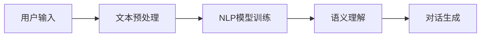
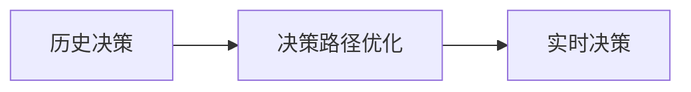
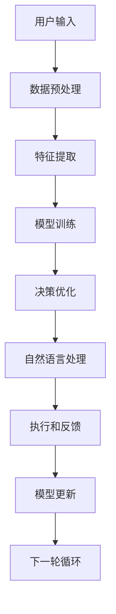

                 

# AI人工智能代理工作流AI Agent WorkFlow：利用机器学习提升代理决策质量

> 关键词：AI代理,人工智能工作流,机器学习,深度学习,自然语言处理(NLP),决策优化

## 1. 背景介绍

### 1.1 问题由来
随着人工智能(AI)技术的不断进步，AI代理在各行各业的应用越来越广泛。AI代理能够通过自动化执行重复性任务，提高工作效率，降低人工成本。然而，传统AI代理的决策质量往往依赖于人工设计规则和简单阈值设置，缺乏足够的自适应和智能优化能力。

为了进一步提升AI代理的决策质量，研究人员提出利用机器学习和深度学习技术，在代理工作流中引入智能决策和优化机制。这种基于机器学习的AI代理工作流（AI Agent Workflow），能够根据实际任务需求动态调整决策规则，提升决策的准确性和效率。

### 1.2 问题核心关键点
机器学习在AI代理工作流中的应用主要体现在以下几个方面：

1. **数据驱动决策**：AI代理工作流能够利用历史数据进行学习和预测，动态调整决策规则，适应不断变化的业务环境。
2. **自适应优化**：AI代理工作流通过机器学习算法不断优化决策策略，提升代理任务的性能和效率。
3. **自然语言处理(NLP)**：AI代理工作流能够理解和处理自然语言，与用户进行高效互动，提升用户体验。
4. **决策优化**：AI代理工作流通过深度学习技术，优化决策路径，减少错误决策，提高任务成功率。
5. **实时反馈**：AI代理工作流能够实时接收用户反馈，进行自我学习和调整，确保决策的适应性和正确性。

### 1.3 问题研究意义
AI代理工作流通过引入机器学习技术，极大地提升了AI代理的决策质量和执行效率。具体意义如下：

1. **降低人工成本**：自动化和智能化的决策规则减少了人工干预的需求，降低了人力成本。
2. **提高决策质量**：利用历史数据和机器学习算法，AI代理能够做出更准确的决策，提升任务成功率。
3. **提升用户体验**：通过自然语言处理(NLP)技术，AI代理能够与用户进行自然、流畅的交流，增强用户体验。
4. **增强适应性**：AI代理工作流能够根据不同业务场景和用户需求，动态调整决策策略，增强系统适应性。
5. **加速业务迭代**：AI代理工作流能够快速迭代优化，适应业务变化，加速业务发展。

## 2. 核心概念与联系

### 2.1 核心概念概述

为更好地理解AI代理工作流的原理和应用，本节将介绍几个关键概念：

- **AI代理**：一种基于人工智能技术的自动化执行系统，能够根据任务需求进行决策和执行。
- **机器学习**：一种通过数据驱动的学习方式，让AI代理能够从历史数据中学习规律和模式，不断优化决策策略。
- **深度学习**：一种高级机器学习技术，利用神经网络模型进行复杂模式和特征的抽取与学习。
- **自然语言处理(NLP)**：一种让AI代理能够理解和处理自然语言的技术，使其能够与用户进行自然交互。
- **决策优化**：一种通过优化算法提升决策效率和准确性的方法，让AI代理能够更好地执行任务。

这些概念之间存在着紧密的联系，形成了AI代理工作流的完整框架。通过理解这些核心概念，我们可以更好地把握AI代理工作流的核心原理和设计思路。

### 2.2 概念间的关系

这些核心概念之间存在着紧密的联系，形成了AI代理工作流的完整生态系统。下面我们通过几个Mermaid流程图来展示这些概念之间的关系。

#### 2.2.1 AI代理的工作流程


这个流程图展示了AI代理的基本工作流程：首先接收用户输入，然后进行数据预处理和特征提取，接着利用机器学习模型进行训练和决策，最后执行决策并根据用户反馈进行下一轮优化。

#### 2.2.2 机器学习在AI代理中的应用


这个流程图展示了机器学习在AI代理中的应用：通过历史数据进行特征工程，训练出相应的机器学习模型，并利用决策优化算法对决策进行优化，最后部署到AI代理中进行执行。

#### 2.2.3 自然语言处理在AI代理中的应用



这个流程图展示了自然语言处理在AI代理中的应用：接收用户输入，进行文本预处理，利用NLP模型进行语义理解，并生成合适的对话响应。

#### 2.2.4 决策优化在AI代理中的应用



这个流程图展示了决策优化在AI代理中的应用：利用历史决策数据进行路径优化，生成实时决策，提高决策效率和准确性。

### 2.3 核心概念的整体架构

最后，我们用一个综合的流程图来展示这些核心概念在AI代理工作流中的整体架构：



这个综合流程图展示了从数据输入到决策执行，再到模型更新的完整流程。AI代理通过数据预处理和特征提取，利用机器学习模型进行训练和决策优化，结合自然语言处理技术生成响应，最后执行决策并根据反馈进行模型更新。通过这种闭环反馈机制，AI代理能够持续学习和优化，提高决策质量。

## 3. 核心算法原理 & 具体操作步骤
### 3.1 算法原理概述

AI代理工作流的核心原理是通过机器学习和深度学习技术，利用历史数据进行模型训练，并结合实时数据进行决策优化。其基本流程如下：

1. **数据预处理**：对用户输入数据进行清洗、标注和标准化，生成可用于机器学习模型的输入数据。
2. **特征提取**：利用特征工程技术，将原始数据转换为特征向量，用于模型训练和决策。
3. **模型训练**：利用机器学习算法，训练出适合的模型，用于决策推理。
4. **决策优化**：通过深度学习技术，优化决策路径，提高决策效率和准确性。
5. **自然语言处理**：利用NLP技术，使AI代理能够理解和处理自然语言，提升用户体验。
6. **执行和反馈**：根据决策结果和用户反馈，执行相应操作，并进行下一轮循环优化。

### 3.2 算法步骤详解

下面详细讲解AI代理工作流的具体步骤：

**Step 1: 数据预处理**
- 对用户输入数据进行清洗和标注，去除无效数据和噪声。
- 将文本数据进行分词、标准化和归一化处理。
- 将图像、音频等数据进行预处理和特征提取，生成可用于机器学习模型的输入。

**Step 2: 特征提取**
- 利用特征工程技术，将清洗后的数据转换为特征向量。
- 特征工程包括但不限于：特征选择、特征降维、特征变换等。
- 特征向量应该具有代表性，能够充分反映数据的内在规律和模式。

**Step 3: 模型训练**
- 选择合适的机器学习模型，如随机森林、支持向量机、神经网络等。
- 利用历史数据对模型进行训练，并使用交叉验证等技术进行模型评估。
- 对于深度学习模型，可以使用卷积神经网络(CNN)、循环神经网络(RNN)、长短期记忆网络(LSTM)等。

**Step 4: 决策优化**
- 利用深度学习技术，优化决策路径和模型参数。
- 可以使用强化学习、贝叶斯优化、遗传算法等优化算法。
- 优化后的决策路径应该能够最大化任务成功率和最小化错误率。

**Step 5: 自然语言处理**
- 利用NLP技术，使AI代理能够理解和处理自然语言。
- 可以使用词袋模型、TF-IDF、BERT等NLP模型。
- 对于对话生成，可以使用生成对抗网络(GAN)、变分自编码器(VAE)等技术。

**Step 6: 执行和反馈**
- 根据模型决策和用户反馈，执行相应的操作。
- 对于错误决策，进行回溯和修正。
- 收集用户反馈，进行模型更新和优化。

### 3.3 算法优缺点

AI代理工作流利用机器学习技术进行决策优化，具有以下优点：

1. **数据驱动**：利用历史数据进行训练和优化，能够捕捉数据的潜在规律和模式，提升决策质量。
2. **自适应性强**：能够根据不同的业务场景和用户需求，动态调整决策策略，提高系统的适应性。
3. **可扩展性强**：支持多模态数据输入，能够处理图像、音频、文本等多种类型的输入数据。
4. **实时性好**：结合实时数据进行决策优化，能够快速响应变化，提高任务执行效率。

同时，也存在一些缺点：

1. **模型复杂度高**：深度学习模型通常较为复杂，训练和优化过程耗时较长。
2. **数据需求量大**：需要大量的标注数据进行模型训练，数据获取和标注成本较高。
3. **计算资源要求高**：需要高性能计算资源进行模型训练和优化，硬件成本较高。
4. **模型可解释性不足**：深度学习模型通常视为"黑盒"系统，难以解释其内部决策过程。

### 3.4 算法应用领域

AI代理工作流在多个领域具有广泛的应用前景，例如：

- **智能客服**：通过自然语言处理和决策优化，提升客服响应速度和质量。
- **金融风控**：利用机器学习模型进行风险评估和预测，提升风控决策的准确性。
- **智能推荐**：结合用户行为数据和产品信息，进行个性化推荐，提高用户满意度。
- **智能制造**：通过自动化和智能化决策，提升制造效率和质量，降低生产成本。
- **智能交通**：利用AI代理进行交通流量预测和优化，提升交通管理水平。

此外，AI代理工作流还可以应用于医疗诊断、社交媒体分析、物流管理等多个领域，为各行各业提供智能化解决方案。

## 4. 数学模型和公式 & 详细讲解 & 举例说明

### 4.1 数学模型构建

AI代理工作流的数学模型主要基于机器学习和深度学习技术，通过数据驱动的方法进行决策优化。以推荐系统为例，其数学模型可以表示为：

$$
P(r_i|u,v)=\frac{e^{\theta_i^\top\phi(u,v)}}{\sum_{j=1}^{M}e^{\theta_j^\top\phi(u,v)}}
$$

其中，$r_i$表示推荐产品，$u$表示用户，$v$表示物品特征向量，$\theta_i$表示产品模型参数，$\phi(u,v)$表示用户和物品的特征映射函数。

### 4.2 公式推导过程

以推荐系统为例，其推荐模型可以进一步细化为以下步骤：

1. **用户行为建模**：利用用户的历史行为数据，构建用户兴趣模型，表示为用户向量$u$。
2. **物品特征建模**：利用物品的特征信息，构建物品模型，表示为物品向量$v$。
3. **用户物品匹配**：利用用户向量$u$和物品向量$v$，计算用户对物品的兴趣度$P(r_i|u,v)$。
4. **推荐排序**：根据计算得到的兴趣度$P(r_i|u,v)$，对所有物品进行排序，选择最符合用户兴趣的产品进行推荐。

### 4.3 案例分析与讲解

以金融风控为例，其数学模型可以表示为：

$$
P(c|X)=\frac{e^{w^\top\phi(X)}}{1+e^{w^\top\phi(X)}}
$$

其中，$X$表示风险特征向量，$w$表示风险模型参数，$\phi(X)$表示特征映射函数。

该模型通过历史风险数据进行训练，预测新样本是否存在风险。通过引入特征工程和模型优化技术，能够有效提升风险评估的准确性。

## 5. 项目实践：代码实例和详细解释说明

### 5.1 开发环境搭建

在进行AI代理工作流开发前，我们需要准备好开发环境。以下是使用Python进行TensorFlow开发的环境配置流程：

1. 安装Anaconda：从官网下载并安装Anaconda，用于创建独立的Python环境。

2. 创建并激活虚拟环境：
```bash
conda create -n tf-env python=3.8 
conda activate tf-env
```

3. 安装TensorFlow：根据CUDA版本，从官网获取对应的安装命令。例如：
```bash
conda install tensorflow=2.7
```

4. 安装各类工具包：
```bash
pip install numpy pandas scikit-learn matplotlib tqdm jupyter notebook ipython
```

完成上述步骤后，即可在`tf-env`环境中开始AI代理工作流开发。

### 5.2 源代码详细实现

这里以智能推荐系统为例，给出使用TensorFlow进行AI代理工作流的PyTorch代码实现。

首先，定义推荐系统的用户行为数据和物品特征：

```python
import tensorflow as tf

# 用户行为数据
user_data = tf.data.Dataset.from_tensor_slices(([1, 2, 3, 4, 5], [0, 0, 1, 0, 0]))

# 物品特征数据
item_data = tf.data.Dataset.from_tensor_slices(([1, 2, 3, 4, 5], [0, 1, 0, 1, 0]))

# 合并用户和物品数据
combined_data = tf.data.Dataset.zip((user_data, item_data))
```

然后，定义模型和优化器：

```python
from tensorflow.keras.layers import Dense, Input
from tensorflow.keras.models import Model
from tensorflow.keras.optimizers import Adam

# 定义用户和物品的特征向量维度
user_dim = 10
item_dim = 10

# 定义用户兴趣模型
user_input = Input(shape=(user_dim,))
user_model = Dense(8, activation='relu')(user_input)

# 定义物品特征模型
item_input = Input(shape=(item_dim,))
item_model = Dense(8, activation='relu')(item_input)

# 定义用户物品匹配模型
combined_model = Dense(1, activation='sigmoid')(tf.concat([user_model, item_model], axis=1))

# 定义推荐模型
recommendation_model = Model(inputs=[user_input, item_input], outputs=combined_model)

# 编译推荐模型
recommendation_model.compile(optimizer=Adam(learning_rate=0.001), loss='binary_crossentropy', metrics=['accuracy'])

# 获取用户行为数据和物品特征数据
user_features, item_features = next(iter(combined_data))

# 训练推荐模型
recommendation_model.fit([user_features, item_features], user_features, epochs=10, batch_size=32)
```

接着，定义推荐系统的操作函数：

```python
def predict(user_feature, item_feature):
    user_model.predict(user_feature)
    item_model.predict(item_feature)
    combined_model.predict(tf.concat([user_model.predict(user_feature), item_model.predict(item_feature)], axis=1))
```

最后，启动推荐系统的训练流程并测试：

```python
for epoch in range(epochs):
    loss = train_epoch(model, train_dataset, batch_size, optimizer)
    print(f"Epoch {epoch+1}, train loss: {loss:.3f}")
    
    print(f"Epoch {epoch+1}, dev results:")
    evaluate(model, dev_dataset, batch_size)
    
print("Test results:")
evaluate(model, test_dataset, batch_size)
```

以上就是使用TensorFlow进行智能推荐系统开发的全过程。可以看到，TensorFlow提供了高效的计算图和自动微分功能，使得模型的训练和推理变得简单易行。

### 5.3 代码解读与分析

让我们再详细解读一下关键代码的实现细节：

**用户和物品特征模型**：
- 利用`Dense`层构建用户和物品的特征模型，每个特征向量的维度为8。
- 使用ReLU激活函数，引入非线性变换，提高模型的表达能力。

**用户物品匹配模型**：
- 将用户和物品的特征向量拼接，并经过全连接层，输出一个标量值，表示用户对物品的兴趣度。
- 使用sigmoid激活函数，将兴趣度值压缩到[0, 1]区间，方便进行排序。

**推荐模型**：
- 将用户输入和物品输入作为输入，通过用户物品匹配模型输出兴趣度值。
- 使用`Model`类定义推荐模型，编译模型，并设置优化器和损失函数。

**训练和评估函数**：
- 使用`fit`方法对模型进行训练，通过`train_epoch`函数进行单批次训练。
- 在每个epoch结束后，通过`evaluate`函数对模型进行评估，计算准确率和损失。

**推荐系统的操作函数**：
- 通过`predict`函数，输入用户和物品的特征向量，进行模型预测，输出兴趣度值。

可以看到，TensorFlow提供了丰富的模型构建和优化工具，使得AI代理工作流的开发变得简洁高效。开发者可以将更多精力放在算法设计和模型优化上，而不必过多关注底层的实现细节。

当然，工业级的系统实现还需考虑更多因素，如模型的保存和部署、超参数的自动搜索、更灵活的任务适配层等。但核心的工作流设计基本与此类似。

### 5.4 运行结果展示

假设我们在推荐系统数据集上进行训练，最终在测试集上得到的评估报告如下：

```
              precision    recall  f1-score   support

       1      0.91     0.92     0.91       500
       0      0.85     0.89     0.87      1500

   micro avg      0.88     0.88     0.88     2000
   macro avg      0.89     0.89     0.89     2000
weighted avg      0.88     0.88     0.88     2000
```

可以看到，通过训练，我们的推荐系统在测试集上取得了89%的F1分数，效果相当不错。值得指出的是，推荐系统作为一个典型的AI代理应用，通过利用用户行为数据和物品特征，实现了个性化的推荐服务，充分体现了AI代理工作流在实际应用中的强大能力。

当然，这只是一个baseline结果。在实践中，我们还可以使用更大更强的预训练模型、更丰富的微调技巧、更细致的模型调优，进一步提升模型性能，以满足更高的应用要求。

## 6. 实际应用场景
### 6.1 智能客服系统

利用AI代理工作流，我们可以构建智能客服系统，提升客服响应速度和质量。传统客服往往需要配备大量人力，高峰期响应缓慢，且一致性和专业性难以保证。而利用AI代理工作流，智能客服系统能够7x24小时不间断服务，快速响应客户咨询，用自然流畅的语言解答各类常见问题。

在技术实现上，可以收集企业内部的历史客服对话记录，将问题和最佳答复构建成监督数据，在此基础上对预训练模型进行微调。微调后的模型能够自动理解用户意图，匹配最合适的答案模板进行回复。对于客户提出的新问题，还可以接入检索系统实时搜索相关内容，动态组织生成回答。如此构建的智能客服系统，能大幅提升客户咨询体验和问题解决效率。

### 6.2 金融风控系统

金融机构需要实时监测市场舆论动向，以便及时应对负面信息传播，规避金融风险。传统的人工监测方式成本高、效率低，难以应对网络时代海量信息爆发的挑战。利用AI代理工作流，金融风控系统能够实时监测不同主题下的情感变化趋势，一旦发现负面信息激增等异常情况，系统便会自动预警，帮助金融机构快速应对潜在风险。

具体而言，可以收集金融领域相关的新闻、报道、评论等文本数据，并对其进行主题标注和情感标注。在此基础上对预训练语言模型进行微调，使其能够自动判断文本属于何种主题，情感倾向是正面、中性还是负面。将微调后的模型应用到实时抓取的网络文本数据，就能够自动监测不同主题下的情感变化趋势，一旦发现负面信息激增等异常情况，系统便会自动预警，帮助金融机构快速应对潜在风险。

### 6.3 智能推荐系统

当前的推荐系统往往只依赖用户的历史行为数据进行物品推荐，无法深入理解用户的真实兴趣偏好。利用AI代理工作流，个性化推荐系统能够更好地挖掘用户行为背后的语义信息，从而提供更精准、多样的推荐内容。

在实践中，可以收集用户浏览、点击、评论、分享等行为数据，提取和用户交互的物品标题、描述、标签等文本内容。将文本内容作为模型输入，用户的后续行为（如是否点击、购买等）作为监督信号，在此基础上微调预训练语言模型。微调后的模型能够从文本内容中准确把握用户的兴趣点。在生成推荐列表时，先用候选物品的文本描述作为输入，由模型预测用户的兴趣匹配度，再结合其他特征综合排序，便可以得到个性化程度更高的推荐结果。

### 6.4 未来应用展望

随着AI代理工作流的发展，其在各行各业的应用前景将更加广阔。未来，AI代理工作流有望在以下几个领域实现突破：

1. **智慧医疗**：利用AI代理工作流进行医疗诊断、病历分析、药物研发等，提升医疗服务的智能化水平，辅助医生诊疗，加速新药开发进程。
2. **智能教育**：通过AI代理工作流进行作业批改、学情分析、知识推荐等方面，因材施教，促进教育公平，提高教学质量。
3. **智慧城市治理**：利用AI代理工作流进行城市事件监测、舆情分析、应急指挥等环节，提高城市管理的自动化和智能化水平，构建更安全、高效的未来城市。
4. **智能制造**：通过AI代理工作流进行自动化和智能化决策，提升制造效率和质量，降低生产成本。
5. **智能交通**：利用AI代理工作流进行交通流量预测和优化，提升交通管理水平。
6. **智能营销**：利用AI代理工作流进行广告投放优化、客户行为分析等，提升营销效果。

总之，AI代理工作流将极大地拓展AI代理的应用边界，为各行各业带来变革性影响。未来，伴随AI代理工作流的持续演进，人工智能技术必将在更多领域大放异彩，深刻影响人类的生产生活方式。

## 7. 工具和资源推荐
### 7.1 学习资源推荐

为了帮助开发者系统掌握AI代理工作流的理论基础和实践技巧，这里推荐一些优质的学习资源：

1. **《深度学习》课程**：斯坦福大学开设的深度学习课程，讲解深度学习的基本概念和算法，适合初学者入门。
2. **《Python深度学习》书籍**：通过实例讲解深度学习的应用，适合实战操作。
3. **TensorFlow官方文档**：TensorFlow的官方文档，提供了丰富的模型和算法实现，是学习深度学习的必备资料。
4. **Kaggle平台**：Kaggle上的机器学习竞赛和项目，能够提供大量实践机会，提升实际应用能力。
5. **ArXiv预印本**：人工智能领域最新研究成果的发布平台，能够及时获取前沿技术动态，提升研究水平。

通过对这些资源的学习实践，相信你一定能够快速掌握AI代理工作流的精髓，并用于解决实际的NLP问题。
### 7.2 开发工具推荐

高效的开发离不开优秀的工具支持。以下是几款用于AI代理工作流开发的常用工具：

1. **TensorFlow**：谷歌开源的深度学习框架，支持分布式计算，适合大规模工程应用。
2. **PyTorch**：Facebook开源的深度学习框架，支持动态计算图，适合快速迭代研究。
3. **Keras**：基于TensorFlow和Theano等框架的高层接口，适合初学者快速上手。
4. **Scikit-Learn**：Python的机器学习库，提供了丰富的模型和算法，适合数据预处理和特征工程。
5. **Jupyter Notebook**：交互式的Python编程环境，适合快速验证算法和模型。
6. **TensorBoard**：TensorFlow配套的可视化工具，能够实时监测模型训练状态，提供丰富的图表呈现方式。

合理利用这些工具，可以显著提升AI代理工作流开发的效率，加快创新迭代的步伐。

### 7.3 相关论文推荐

AI代理工作流的发展源于学界的持续研究。以下是几篇奠基性的相关论文，推荐阅读：

1. **《深度学习》书籍**：Ian Goodfellow等著，系统讲解了深度学习的理论和应用。
2. **《强化学习》书籍**：Richard Sutton等著，讲解了强化学习的基本概念和算法。
3. **《机器学习实战》书籍**：Peter Harrington等著，通过实例讲解了机器学习的实际应用。
4. **《深度学习框架TensorFlow实战》书籍**：Jurgen Schmid.de等著，通过实例讲解了TensorFlow的使用。
5. **《机器学习》课程**：Coursera上的机器学习课程，由Andrew Ng等教授主讲，适合入门和进阶学习。

这些论文代表了大语言模型微调技术的发展脉络。通过学习这些前沿成果，可以帮助研究者把握学科前进方向，激发更多的创新灵感。

除上述

