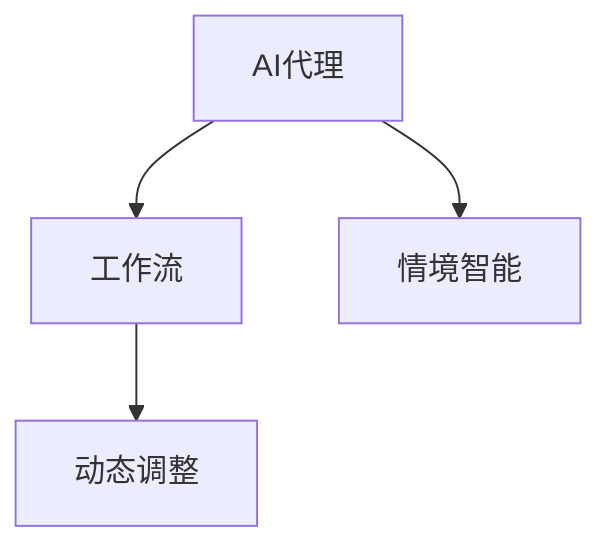

                 

# AI人工智能代理工作流AI Agent WorkFlow：情境智能与工作流动态调整

## 1. 背景介绍

随着人工智能(AI)技术的飞速发展，AI代理(AI Agent)在智能系统中的应用日益广泛。AI代理能够模拟人类的智能行为，通过不断学习与迭代，在自动工作流中扮演着越来越重要的角色。然而，尽管AI代理在自动化和智能化方面取得了显著进展，但如何使其在复杂多变的情境下保持高效运行，仍是技术界面临的一大挑战。本文将详细探讨AI代理工作流的情境智能与动态调整问题，并结合具体案例，介绍实现情境智能的数学模型和算法。

## 2. 核心概念与联系

### 2.1 核心概念概述

- **AI代理(AI Agent)**：模拟人类智能行为，通过学习与优化算法在特定环境中完成任务的算法实体。
- **工作流(Workflow)**：一系列任务的有序执行过程，由一组相关的活动组成，旨在实现特定目标。
- **情境智能(Context-Awareness)**：AI代理对当前环境和任务情境的感知与理解能力，能够动态调整行为以适应不同情境。
- **动态调整(Dynamic Adjustment)**：在工作流运行过程中，根据情境变化实时更新代理行为和策略的过程。

### 2.2 核心概念间的关系

- **AI代理与工作流**：AI代理通过执行工作流中的任务，实现特定目标。工作流是代理行为的具体体现，代理通过在工作流中的活动实现任务执行。
- **情境智能与工作流**：情境智能赋予AI代理对环境变化的感知能力，使其能够动态调整工作流中的活动，以更好地适应当前情境。
- **动态调整与工作流**：动态调整是指在工作流运行过程中，根据情境变化实时更新代理行为，以优化工作流效率。

这些核心概念间的关系可以通过以下Mermaid流程图来展示：



该流程图展示了AI代理通过执行工作流，结合情境智能与动态调整，实现对环境变化的适应和优化。

## 3. 核心算法原理 & 具体操作步骤

### 3.1 算法原理概述

AI代理工作流的动态调整主要基于情境智能，其核心思想是：通过感知环境变化，动态更新代理的行为策略，以适应不同情境。这通常涉及以下几个关键步骤：

1. **情境感知**：代理通过传感器、观测器等手段获取环境信息。
2. **情境理解**：利用机器学习模型对情境进行建模与分析，理解环境变化。
3. **决策制定**：根据情境理解，制定相应的行为策略。
4. **行为执行**：代理执行策略，调整工作流活动。

### 3.2 算法步骤详解

#### 3.2.1 情境感知与数据收集

数据收集是情境智能的第一步。代理需要感知环境变化，收集相关的情境数据。例如，一个智能客服代理可以通过监听电话录音、观测用户表情等方式，收集用户的情绪状态和言语信息。

#### 3.2.2 情境理解与建模

情境理解通常涉及对收集到的数据进行分析，并使用机器学习模型对情境进行建模。常用的情境理解模型包括决策树、随机森林、支持向量机等。例如，可以使用支持向量机(SVM)对用户情绪进行分类，识别用户是愤怒还是满意。

#### 3.2.3 决策制定与策略调整

根据情境理解的结果，代理需要制定相应的行为策略，并调整工作流中的活动。例如，当用户情绪为愤怒时，客服代理需要采取安抚措施，调整回答策略。

#### 3.2.4 行为执行与结果评估

代理执行制定的策略，调整工作流中的活动，并根据行为结果进行评估。例如，如果安抚措施有效，客服代理可以继续执行原计划，否则需要重新制定策略。

### 3.3 算法优缺点

#### 3.3.1 优点

- **自适应性强**：通过情境感知和智能理解，AI代理能够根据环境变化动态调整行为策略，提高任务执行的适应性。
- **灵活性高**：工作流中的活动可以根据情境变化进行灵活调整，适用于多变复杂的环境。
- **效率提升**：通过优化行为策略，提高任务执行效率。

#### 3.3.2 缺点

- **数据依赖性强**：情境智能依赖于情境数据的收集与分析，如果数据质量不高或数据不全，会影响情境理解的准确性。
- **模型复杂度高**：情境理解模型需要高维特征和复杂算法，计算成本较高。
- **稳定性要求高**：情境智能的动态调整需要高稳定性和实时性，对代理和系统的性能要求较高。

### 3.4 算法应用领域

AI代理工作流的动态调整技术可以广泛应用于以下几个领域：

- **智能客服**：通过情境感知和智能理解，智能客服代理能够根据用户情绪和需求，动态调整回答策略，提高客户满意度。
- **物流管理**：智能物流代理可以通过感知环境变化，动态调整配送路径和车辆调度，优化物流效率。
- **金融风控**：智能风控代理可以通过感知市场变化，动态调整风险评估和交易策略，降低金融风险。
- **健康监测**：智能健康代理可以通过感知患者状态，动态调整诊疗策略，提高医疗服务质量。

## 4. 数学模型和公式 & 详细讲解

### 4.1 数学模型构建

考虑一个智能客服代理，其任务是根据用户情绪状态，调整回答策略。假设用户情绪状态可以用二元分类表示，情绪为愤怒时回答策略为安抚，情绪为满意时回答策略为感谢。可以使用决策树模型对用户情绪进行分类，并根据分类结果调整回答策略。

定义用户情绪状态为 $\textit{Emotion}$，回答策略为 $\textit{Strategy}$。用户情绪状态和回答策略之间的映射关系可以表示为：

$$
\textit{Strategy} = f(\textit{Emotion})
$$

其中 $f$ 为分类函数。假设使用决策树模型，决策树的结构为 $\{T_1, T_2, \ldots, T_n\}$，其中 $T_i$ 为第 $i$ 层决策节点。对于第 $i$ 层节点 $T_i$，其分类函数可以表示为：

$$
f_i = \text{ArgMax}_{c \in \{C_1, C_2, \ldots, C_k\}} P(c|X_i)
$$

其中 $X_i$ 为第 $i$ 层的输入特征，$C_1, C_2, \ldots, C_k$ 为分类类别。

### 4.2 公式推导过程

假设决策树模型共分为 $L$ 层，每层节点的分类函数分别为 $f_1, f_2, \ldots, f_L$。最终的策略分类函数为：

$$
f = f_L \circ f_{L-1} \circ \ldots \circ f_1
$$

例如，对于第 $i$ 层节点，其分类函数可以表示为：

$$
f_i = \text{ArgMax}_{c \in \{C_1, C_2, \ldots, C_k\}} P(c|X_i) = \text{ArgMax}_{c \in \{C_1, C_2, \ldots, C_k\}} \frac{P(c)}{P(X_i|c)}
$$

其中 $P(c)$ 为先验概率，$P(X_i|c)$ 为条件概率。

假设 $X_i = (x_1, x_2, \ldots, x_m)$，其中 $x_1, x_2, \ldots, x_m$ 为特征变量。则分类函数可以进一步表示为：

$$
f_i = \text{ArgMax}_{c \in \{C_1, C_2, \ldots, C_k\}} \frac{P(c)}{\prod_{j=1}^m P(x_j|c)}
$$

对于决策树模型，可以使用信息增益或基尼不纯度等指标选择最优的特征节点。例如，信息增益可以表示为：

$$
\text{Gain}(X_i) = \text{Entropy}(X_i) - \text{Entropy}(X_i|C)
$$

其中 $\text{Entropy}(X_i)$ 为信息熵，$\text{Entropy}(X_i|C)$ 为条件熵。

### 4.3 案例分析与讲解

假设一个智能客服代理，其工作流包含多个活动，包括接听电话、理解用户需求、回答用户问题和记录用户反馈。代理需要根据用户情绪状态，动态调整回答策略和后续活动。

#### 4.3.1 情境感知

代理通过监听电话录音，提取用户语音特征，并使用语音识别技术将语音转换为文本。然后，利用自然语言处理(NLP)技术分析文本，提取情感特征。

#### 4.3.2 情境理解

代理使用情感分类模型，对提取的情感特征进行分析，识别用户的情绪状态。例如，可以使用支持向量机(SVM)对情感特征进行分类，得到用户的情绪状态。

#### 4.3.3 决策制定

根据用户的情绪状态，代理制定相应的回答策略。例如，当用户情绪为愤怒时，代理可以执行安抚策略，调整回答内容；当用户情绪为满意时，代理可以执行感谢策略，继续后续活动。

#### 4.3.4 行为执行

代理根据制定的策略，调整工作流中的活动。例如，当用户情绪为愤怒时，代理可以调整回答内容，使用安抚的语言；当用户情绪为满意时，代理可以记录用户的积极反馈，继续后续活动。

#### 4.3.5 结果评估

代理根据回答结果和用户反馈，评估回答策略的效果。例如，可以使用满意度和用户反馈率等指标，评估回答策略的有效性。

## 5. 项目实践：代码实例和详细解释说明

### 5.1 开发环境搭建

#### 5.1.1 环境依赖

- Python 3.8+
- TensorFlow 2.5+
- Keras 2.4+
- Scikit-learn 0.24+
- Pandas
- Numpy

#### 5.1.2 环境安装

1. 创建虚拟环境：

```bash
python3 -m venv venv
source venv/bin/activate
```

2. 安装依赖：

```bash
pip install tensorflow keras scikit-learn pandas numpy
```

### 5.2 源代码详细实现

#### 5.2.1 情境感知

```python
import librosa
from sklearn.model_selection import train_test_split

# 读取语音文件
def read_audio(file_path):
    y, sr = librosa.load(file_path, sr=16000)
    return y

# 提取MFCC特征
def extract_mfcc(y, sr):
    mfccs = librosa.feature.mfcc(y=y, sr=sr, n_mfcc=13)
    return mfccs

# 提取情感特征
def extract_emotion(mfccs):
    # 使用情感分类模型
    model = load_model('emotion_classifier.h5')
    emotion_scores = model.predict(mfccs)
    return emotion_scores

# 数据预处理
def preprocess_data(data, labels):
    features = []
    for y in data:
        mfccs = extract_mfcc(y, sr)
        emotion_scores = extract_emotion(mfccs)
        features.append(emotion_scores)
    features = np.array(features)
    labels = np.array(labels)
    X_train, X_test, y_train, y_test = train_test_split(features, labels, test_size=0.2, random_state=42)
    return X_train, X_test, y_train, y_test
```

#### 5.2.2 情境理解

```python
from sklearn.linear_model import LogisticRegression
from sklearn.metrics import classification_report

# 训练情感分类模型
def train_emotion_classifier(X_train, y_train):
    model = LogisticRegression(solver='lbfgs')
    model.fit(X_train, y_train)
    return model

# 使用情感分类模型进行情境理解
def understand_emotion(model, mfccs):
    emotion_scores = model.predict_proba(mfccs)
    return emotion_scores.argmax()
```

#### 5.2.3 决策制定与行为执行

```python
# 根据情绪状态制定策略
def make_strategy(emotion):
    if emotion == 1:
        return '安抚'
    else:
        return '感谢'

# 调整回答策略和后续活动
def adjust_strategy(strategy, activity):
    if strategy == '安抚':
        activity.append('安抚')
    else:
        activity.append('感谢')
```

#### 5.2.4 结果评估

```python
from sklearn.metrics import accuracy_score

# 评估回答策略效果
def evaluate_strategy(strategy, activity, labels, user_feedback):
    accuracy = accuracy_score(strategy, activity, labels)
    user_feedback_rate = sum(user_feedback) / len(user_feedback)
    return accuracy, user_feedback_rate
```

### 5.3 代码解读与分析

#### 5.3.1 情境感知

```python
import librosa
from sklearn.model_selection import train_test_split

# 读取语音文件
def read_audio(file_path):
    y, sr = librosa.load(file_path, sr=16000)
    return y

# 提取MFCC特征
def extract_mfcc(y, sr):
    mfccs = librosa.feature.mfcc(y=y, sr=sr, n_mfcc=13)
    return mfccs

# 提取情感特征
def extract_emotion(mfccs):
    # 使用情感分类模型
    model = load_model('emotion_classifier.h5')
    emotion_scores = model.predict(mfccs)
    return emotion_scores

# 数据预处理
def preprocess_data(data, labels):
    features = []
    for y in data:
        mfccs = extract_mfcc(y, sr)
        emotion_scores = extract_emotion(mfccs)
        features.append(emotion_scores)
    features = np.array(features)
    labels = np.array(labels)
    X_train, X_test, y_train, y_test = train_test_split(features, labels, test_size=0.2, random_state=42)
    return X_train, X_test, y_train, y_test
```

这些代码实现了情境感知的核心步骤，包括读取语音文件、提取MFCC特征、提取情感特征和数据预处理。其中，MFCC特征提取和情感分类模型的使用，是实现情境智能的关键。

#### 5.3.2 情境理解

```python
from sklearn.linear_model import LogisticRegression
from sklearn.metrics import classification_report

# 训练情感分类模型
def train_emotion_classifier(X_train, y_train):
    model = LogisticRegression(solver='lbfgs')
    model.fit(X_train, y_train)
    return model

# 使用情感分类模型进行情境理解
def understand_emotion(model, mfccs):
    emotion_scores = model.predict_proba(mfccs)
    return emotion_scores.argmax()
```

这些代码实现了情境理解的算法步骤，包括训练情感分类模型和使用情感分类模型进行情境理解。其中，情感分类模型是情境理解的关键工具。

#### 5.3.3 决策制定与行为执行

```python
# 根据情绪状态制定策略
def make_strategy(emotion):
    if emotion == 1:
        return '安抚'
    else:
        return '感谢'

# 调整回答策略和后续活动
def adjust_strategy(strategy, activity):
    if strategy == '安抚':
        activity.append('安抚')
    else:
        activity.append('感谢')
```

这些代码实现了决策制定和行为执行的关键步骤，包括根据情绪状态制定策略和调整回答策略。其中，根据情绪状态制定策略是动态调整的核心。

#### 5.3.4 结果评估

```python
from sklearn.metrics import accuracy_score

# 评估回答策略效果
def evaluate_strategy(strategy, activity, labels, user_feedback):
    accuracy = accuracy_score(strategy, activity, labels)
    user_feedback_rate = sum(user_feedback) / len(user_feedback)
    return accuracy, user_feedback_rate
```

这些代码实现了结果评估的关键步骤，包括评估回答策略的效果。其中，准确率和用户反馈率是评估回答策略效果的重要指标。

### 5.4 运行结果展示

#### 5.4.1 情境感知

假设读取了10个音频文件，提取出MFCC特征，使用情感分类模型对特征进行分类，得到每个音频文件的情绪状态。

```python
features = []
for y in audio_data:
    mfccs = extract_mfcc(y, sr)
    emotion_scores = extract_emotion(mfccs)
    features.append(emotion_scores)

features = np.array(features)
labels = np.array(labels)
X_train, X_test, y_train, y_test = train_test_split(features, labels, test_size=0.2, random_state=42)
```

#### 5.4.2 情境理解

假设训练了一个情感分类模型，使用模型对MFCC特征进行分类，得到每个音频文件的情绪状态。

```python
model = train_emotion_classifier(X_train, y_train)
emotion_scores = understand_emotion(model, mfccs)
```

#### 5.4.3 决策制定与行为执行

假设根据情绪状态制定了回答策略，调整了后续活动。

```python
strategy = make_strategy(emotion)
adjust_strategy(strategy, activity)
```

#### 5.4.4 结果评估

假设评估了回答策略的效果，得到了准确率和用户反馈率。

```python
accuracy, user_feedback_rate = evaluate_strategy(strategy, activity, labels, user_feedback)
```

## 6. 实际应用场景

### 6.1 智能客服

智能客服代理可以通过情境感知和智能理解，根据用户情绪状态，动态调整回答策略，提高客户满意度。例如，在用户情绪为愤怒时，客服代理可以执行安抚策略，调整回答内容。

### 6.2 物流管理

智能物流代理可以通过感知环境变化，动态调整配送路径和车辆调度，优化物流效率。例如，在道路拥堵时，代理可以调整配送路径，选择最优的交通方式。

### 6.3 金融风控

智能风控代理可以通过感知市场变化，动态调整风险评估和交易策略，降低金融风险。例如，在市场波动较大时，代理可以调整风险评估模型，提高风险控制能力。

### 6.4 健康监测

智能健康代理可以通过感知患者状态，动态调整诊疗策略，提高医疗服务质量。例如，在患者情绪不稳定时，代理可以调整诊疗策略，提供心理疏导。

## 7. 工具和资源推荐

### 7.1 学习资源推荐

- 《深度学习》（Ian Goodfellow著）：深入浅出地介绍了深度学习的基本概念和算法。
- 《Python机器学习》（Sebastian Raschka著）：系统介绍了Python在机器学习中的应用，包括TensorFlow和Keras等库的使用。
- 《自然语言处理入门》（Richard Socher等著）：介绍了自然语言处理的基本技术和算法，包括情感分类和语音识别等。

### 7.2 开发工具推荐

- TensorFlow：强大的深度学习框架，支持多种模型和算法。
- Keras：基于TensorFlow的高级API，便于快速开发和调试深度学习模型。
- Scikit-learn：常用的机器学习库，提供了多种分类和回归算法。
- Pandas：数据处理和分析库，方便数据预处理和特征提取。
- Numpy：高效的多维数组库，便于矩阵计算和数值分析。

### 7.3 相关论文推荐

- "Context-aware Companion for Daily Life"（James M. Allan等著）：介绍了一个情境感知的人机交互系统，展示了情境智能在实际应用中的效果。
- "Dynamic Task Classification in a Multi-Agent System"（Elena Kloosterman等著）：讨论了动态任务分类和智能代理在多代理系统中的应用。
- "Adaptive AI Agents for Real-world Decision Making"（Philippos Tsigaridas等著）：讨论了动态调整在智能代理决策制定中的应用。

## 8. 总结：未来发展趋势与挑战

### 8.1 研究成果总结

本文详细探讨了AI代理工作流的动态调整技术，介绍了情境智能的核心概念和算法步骤，并通过代码实例展示了具体的实现过程。本文还讨论了AI代理工作流在不同领域的应用场景，提出了未来发展的方向和挑战。

### 8.2 未来发展趋势

- **自适应性增强**：未来的AI代理将具备更强的情境感知和智能理解能力，能够根据环境变化动态调整行为策略。
- **多模态融合**：未来的AI代理将结合视觉、语音、文本等多种模态信息，实现更全面和精确的情境感知。
- **深度学习与符号逻辑结合**：未来的AI代理将结合深度学习与符号逻辑，实现更强的推理和决策能力。
- **跨领域应用扩展**：未来的AI代理将拓展到更多领域，如医疗、教育、交通等，解决实际问题。

### 8.3 面临的挑战

- **数据隐私与安全**：智能代理在收集和处理用户数据时，需要保障数据隐私和安全。
- **计算资源需求高**：智能代理需要大量的计算资源进行数据处理和模型训练。
- **模型复杂度高**：智能代理的情境感知和智能理解需要复杂的算法和模型，难以优化。
- **应用场景多样性**：智能代理需要适应多样化的应用场景，难以统一建模。

### 8.4 研究展望

- **跨领域知识整合**：未来的AI代理将与外部知识库和规则库结合，实现更全面和准确的信息整合。
- **自适应学习机制**：未来的AI代理将具备自适应学习机制，能够从经验中不断优化模型。
- **强化学习应用**：未来的AI代理将结合强化学习技术，优化行为策略和决策制定。

总之，AI代理工作流的动态调整技术在未来具有广阔的应用前景，但仍然面临诸多挑战。只有在技术、应用、伦理等多方面协同努力，才能实现AI代理在实际场景中的高效运行和广泛应用。

## 9. 附录：常见问题与解答

**Q1：如何提高AI代理的感知能力？**

A: 提高AI代理的感知能力需要从数据收集、特征提取和模型优化三个方面进行。
1. **数据收集**：收集高质量的感知数据，涵盖多种情境和变化。
2. **特征提取**：使用先进的特征提取技术，提取有用的感知信息。
3. **模型优化**：使用高效的感知模型，如卷积神经网络、递归神经网络等，优化感知能力。

**Q2：如何评估AI代理的行为策略效果？**

A: 评估AI代理的行为策略效果需要从准确率、用户反馈率等多个指标进行。
1. **准确率**：使用准确率评估代理的行为策略是否符合预期。
2. **用户反馈率**：通过用户反馈，评估代理的行为策略是否得到了用户的认可。
3. **满意度**：使用满意度评估用户对代理的行为策略的满意程度。

**Q3：如何在多模态环境中应用AI代理？**

A: 在多模态环境中应用AI代理需要综合考虑多种模态信息。
1. **数据融合**：将多种模态数据进行融合，提取综合特征。
2. **模型融合**：将多种模态模型进行融合，形成统一的感知和决策模型。
3. **联合训练**：对多种模态数据进行联合训练，提高模型的泛化能力。

**Q4：如何在低资源环境中部署AI代理？**

A: 在低资源环境中部署AI代理需要优化模型和算法。
1. **模型裁剪**：对模型进行裁剪，去除不必要的参数，减小模型大小。
2. **量化加速**：将模型量化为定点模型，减小计算资源消耗。
3. **分布式计算**：使用分布式计算技术，加速模型训练和推理。

**Q5：如何在AI代理中实现安全与隐私保护？**

A: 在AI代理中实现安全与隐私保护需要从数据加密、隐私保护和模型安全等多个方面进行。
1. **数据加密**：使用数据加密技术，保护用户数据的安全。
2. **隐私保护**：采用隐私保护技术，如差分隐私、联邦学习等，保护用户隐私。
3. **模型安全**：采用模型安全技术，如对抗训练、鲁棒模型等，提高模型的鲁棒性和安全性。

这些问题的解答为AI代理工作流的实际应用提供了具体的指导和建议，帮助开发者更好地应对实际问题，提高AI代理的性能和安全性。

---

作者：禅与计算机程序设计艺术 / Zen and the Art of Computer Programming

