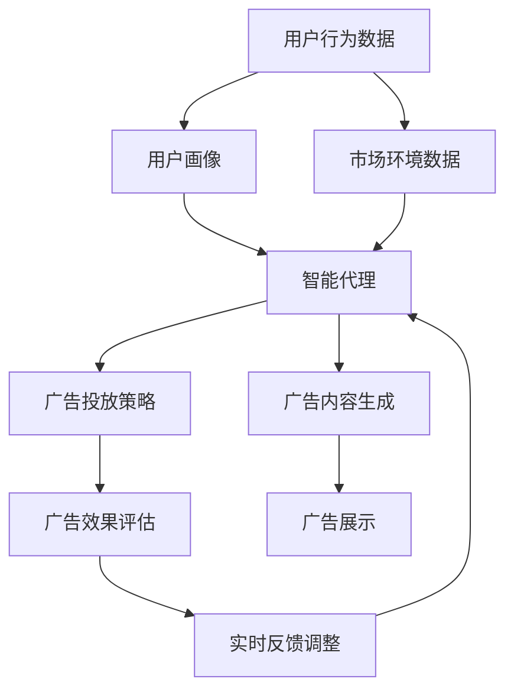

                 

# AI人工智能代理工作流AI Agent WorkFlow：智能代理在广告营销系统中的应用

> 关键词：人工智能,智能代理,工作流,广告营销,决策自动化

## 1. 背景介绍

### 1.1 问题由来

在当今数字化营销的浪潮中，广告主们面临着前所未有的市场竞争压力。传统的广告投放策略已无法满足快速变化的商业需求。如何精准定位目标受众，最大化广告效果，成为了一个迫切需要解决的课题。

近年来，人工智能（AI）技术在广告营销领域的广泛应用，使得智能广告投放系统逐渐成为行业标准。智能广告投放系统通过数据分析和算法优化，将广告投放决策自动化，使广告主的投放更加精准、高效。

其中，智能代理（AI Agent）在广告投放决策自动化中扮演了关键角色。智能代理结合了人工智能的强大计算能力和自然语言处理能力，能够根据用户行为数据、市场环境等多种因素，自动制定和调整广告投放策略，为广告主提供最优的投放方案。

### 1.2 问题核心关键点

智能代理的核心关键点在于：
- 大数据处理：能够处理和分析海量用户行为数据和市场环境数据，提取有价值的洞察。
- 自然语言处理：能够理解用户需求和反馈，生成自然、有逻辑的对话。
- 自动化决策：能够根据实时数据自动调整广告投放策略，优化投放效果。
- 机器学习：通过不断学习用户行为和市场变化，提升决策模型的精准性和自适应性。

智能代理在广告营销系统中的应用，主要体现在以下几个方面：
- 用户画像构建：通过分析用户行为数据，生成详细的用户画像，帮助广告主更精准地定位目标受众。
- 广告优化投放：结合市场环境数据，自动制定和调整广告投放策略，提高广告效果。
- 实时反馈调整：根据用户反馈数据和广告投放效果，实时调整广告内容，提升用户体验。

### 1.3 问题研究意义

智能代理在广告营销系统中的应用，对于提升广告投放效率、降低投放成本、提高广告效果具有重要意义：
1. **提升投放效率**：智能代理能够自动化处理大量数据，快速生成投放策略，大大提升广告投放效率。
2. **降低投放成本**：智能代理能够精准定位目标受众，避免无效投放，降低广告主的投放成本。
3. **提高广告效果**：智能代理结合多源数据，制定最优投放策略，提升广告转化率和效果。
4. **实时调整优化**：智能代理能够根据实时反馈数据，动态调整广告内容，优化广告投放效果。
5. **增强用户体验**：智能代理能够理解用户需求和反馈，生成个性化广告内容，提升用户满意度。

## 2. 核心概念与联系

### 2.1 核心概念概述

为更好地理解智能代理在广告营销系统中的应用，本节将介绍几个关键概念：

- **人工智能（AI）**：利用计算机模拟人类智能行为的技术，包括机器学习、自然语言处理、计算机视觉等。
- **智能代理（AI Agent）**：具有一定自主决策能力的智能系统，能够自动处理任务，优化目标函数。
- **广告投放（Advertising）**：通过各种媒介向目标用户展示广告，以提高品牌知名度、销售转化等。
- **用户画像（User Profile）**：对用户行为数据进行分析和建模，形成详细的用户特征描述。
- **决策自动化（Decision Automation）**：通过自动化算法，代替人工完成决策过程，提高决策效率和质量。
- **自然语言处理（NLP）**：使计算机能够理解和处理人类语言的技术，包括文本分类、情感分析、对话系统等。

这些概念之间相互关联，共同构成了智能代理在广告营销系统中的应用框架。通过理解这些核心概念，我们可以更好地把握智能代理的工作原理和优化方向。

### 2.2 概念间的关系

这些核心概念之间存在着紧密的联系，形成了智能代理在广告营销系统中的完整生态系统。下面我们通过几个Mermaid流程图来展示这些概念之间的关系：



这个流程图展示了智能代理在广告营销系统中的应用过程：

1. **用户行为数据**：通过数据分析工具收集用户的浏览、点击、购买等行为数据。
2. **用户画像**：对用户行为数据进行分析，生成详细的用户特征描述。
3. **智能代理**：根据用户画像和市场环境数据，自动制定和调整广告投放策略，并生成广告内容。
4. **广告投放策略**：智能代理根据实时数据，自动制定和调整广告投放策略。
5. **广告内容生成**：智能代理自动生成符合广告策略的广告内容。
6. **广告展示**：通过广告平台展示广告内容。
7. **广告效果评估**：对广告展示效果进行评估，获取用户反馈数据。
8. **实时反馈调整**：根据用户反馈数据和广告效果，实时调整广告内容，优化广告投放策略。

这些概念共同构成了智能代理在广告营销系统中的应用框架，使其能够自动化处理任务，优化广告投放效果。

## 3. 核心算法原理 & 具体操作步骤
### 3.1 算法原理概述

智能代理在广告营销系统中的应用，主要依赖于以下核心算法：

- **决策树算法**：通过分析用户行为数据和市场环境数据，构建决策树模型，进行分类和预测。
- **聚类算法**：将用户分成不同的类别，生成详细用户画像。
- **强化学习算法**：通过不断优化广告投放策略，提升广告效果。
- **自然语言处理算法**：生成自然、有逻辑的对话，理解用户需求和反馈。

这些算法在智能代理中的应用，主要包括以下几个步骤：

1. **数据预处理**：对用户行为数据和市场环境数据进行清洗、归一化等处理。
2. **用户画像构建**：利用聚类算法等方法，生成详细的用户画像。
3. **广告投放策略制定**：结合用户画像和市场环境数据，使用决策树算法或强化学习算法，自动制定和调整广告投放策略。
4. **广告内容生成**：根据广告投放策略，使用自然语言处理算法生成广告内容。
5. **广告效果评估**：通过数据分析工具评估广告效果，获取用户反馈数据。
6. **实时反馈调整**：根据用户反馈数据和广告效果，实时调整广告内容，优化广告投放策略。

### 3.2 算法步骤详解

#### 3.2.1 数据预处理

数据预处理是智能代理应用中的第一步，主要包括以下几个步骤：

- **数据清洗**：去除数据中的噪声和异常值，确保数据的质量。
- **特征选择**：选择对用户行为和广告效果影响最大的特征。
- **归一化**：将数据缩放到[0, 1]或[-1, 1]区间，便于算法处理。
- **特征工程**：对数据进行特征提取和生成，形成有意义的特征组合。

#### 3.2.2 用户画像构建

用户画像的构建是智能代理应用中的关键步骤，主要包括以下几个步骤：

- **聚类算法**：使用K-means、层次聚类等算法，将用户分成不同的类别。
- **特征提取**：从用户行为数据中提取有意义的特征，如浏览时间、购买频率、点击率等。
- **画像描述**：将用户特征进行描述和可视化，生成详细的用户画像。

#### 3.2.3 广告投放策略制定

广告投放策略的制定是智能代理应用中的核心步骤，主要包括以下几个步骤：

- **决策树算法**：使用决策树算法，根据用户画像和市场环境数据，制定最优广告投放策略。
- **强化学习算法**：使用强化学习算法，通过不断优化广告投放策略，提升广告效果。
- **策略评估**：通过广告效果评估，评估广告投放策略的效果。

#### 3.2.4 广告内容生成

广告内容生成是智能代理应用中的重要步骤，主要包括以下几个步骤：

- **自然语言处理算法**：使用NLP技术，根据广告投放策略生成自然、有逻辑的对话。
- **内容生成**：使用文本生成技术，自动生成符合广告策略的广告内容。

#### 3.2.5 广告效果评估

广告效果评估是智能代理应用中的重要环节，主要包括以下几个步骤：

- **数据分析**：通过数据分析工具，收集用户反馈数据和广告效果数据。
- **效果评估**：使用评估指标（如点击率、转化率、投入产出比等）评估广告效果。

#### 3.2.6 实时反馈调整

实时反馈调整是智能代理应用中的重要环节，主要包括以下几个步骤：

- **用户反馈分析**：分析用户反馈数据，获取用户需求和反馈信息。
- **策略调整**：根据用户反馈数据，实时调整广告内容，优化广告投放策略。
- **效果优化**：通过持续优化，提升广告投放效果。

### 3.3 算法优缺点

智能代理在广告营销系统中的应用，具有以下优点：

- **自动化处理**：能够自动化处理大量数据，快速生成投放策略，提高广告投放效率。
- **精准投放**：结合用户画像和市场环境数据，精准定位目标受众，提高广告效果。
- **实时调整**：根据实时反馈数据，动态调整广告内容，优化广告投放策略。

同时，智能代理在应用中也存在一些缺点：

- **数据依赖**：依赖高质量的数据，数据收集和预处理成本较高。
- **算法复杂**：算法复杂度高，需要较大的计算资源。
- **模型泛化**：模型泛化能力有限，面对新数据和市场变化，可能无法及时调整。
- **用户隐私**：涉及用户行为数据和市场环境数据，可能引发用户隐私问题。

尽管存在这些局限性，但智能代理在广告营销系统中的应用，仍具有广泛的应用前景。未来相关研究的方向在于如何进一步提高算法的鲁棒性和泛化能力，同时保障用户隐私和数据安全。

### 3.4 算法应用领域

智能代理在广告营销系统中的应用，覆盖了广告投放的各个环节，包括用户画像构建、广告投放策略制定、广告内容生成、广告效果评估和实时反馈调整。这些环节的智能化处理，使得广告投放更加精准、高效和自动化。

具体而言，智能代理在以下领域中有着广泛的应用：

- **广告主平台**：为广告主提供智能投放决策支持，优化广告投放策略。
- **广告代理公司**：帮助广告代理公司自动化处理广告投放任务，提升投放效率。
- **广告网络平台**：结合用户画像和市场环境数据，自动化生成广告内容，提升广告效果。
- **广告效果分析**：通过数据分析工具，实时评估广告效果，优化广告投放策略。

## 4. 数学模型和公式 & 详细讲解 & 举例说明

### 4.1 数学模型构建

本节将使用数学语言对智能代理在广告营销系统中的应用过程进行更加严格的刻画。

记用户行为数据为 $\mathbf{x} = (x_1, x_2, ..., x_n)$，市场环境数据为 $\mathbf{y} = (y_1, y_2, ..., y_m)$，其中 $x_i$ 和 $y_j$ 分别表示第 $i$ 个用户行为特征和第 $j$ 个市场环境特征。

智能代理在广告投放策略制定中，可以采用以下数学模型：

$$
\theta^* = \mathop{\arg\min}_{\theta} \sum_{i=1}^N \ell(\hat{y}_i, y_i) + \lambda \sum_{j=1}^M ||\hat{x}_j - x_j||^2
$$

其中，$\theta$ 为广告投放策略参数，$\ell(\hat{y}_i, y_i)$ 为广告效果评估损失函数，$||\hat{x}_j - x_j||^2$ 为市场环境数据拟合损失函数，$\lambda$ 为正则化系数。

### 4.2 公式推导过程

以下我们以广告投放策略的决策树算法为例，推导其数学模型和公式。

假设广告投放策略由决策树 $T$ 表示，其中节点表示用户画像的特征，叶子节点表示广告投放策略。决策树的目标是最小化广告效果评估损失函数 $\ell(\hat{y}_i, y_i)$。

决策树模型可以表示为：

$$
\hat{y} = \sum_{k=1}^K w_k f_k(x)
$$

其中，$K$ 为树的深度，$w_k$ 为叶子节点的权重，$f_k(x)$ 为叶子节点的特征函数。

根据决策树算法的目标，我们有：

$$
\theta^* = \mathop{\arg\min}_{\theta} \sum_{i=1}^N \ell(\hat{y}_i, y_i) = \mathop{\arg\min}_{\theta} \sum_{i=1}^N \sum_{k=1}^K w_k \ell(f_k(x_i), y_i)
$$

利用梯度下降算法求解 $\theta^*$：

$$
\theta \leftarrow \theta - \eta \nabla_{\theta} \sum_{i=1}^N \sum_{k=1}^K w_k \ell(f_k(x_i), y_i)
$$

其中，$\eta$ 为学习率，$\nabla_{\theta}$ 为梯度算子。

### 4.3 案例分析与讲解

假设我们有一个广告投放案例，其中用户画像特征包括浏览时间、购买频率和点击率，市场环境数据包括广告预算、竞价策略和广告效果。我们可以使用决策树算法，根据这些数据自动制定和调整广告投放策略。

具体步骤如下：

1. **数据预处理**：对用户行为数据和市场环境数据进行清洗、归一化等处理。
2. **用户画像构建**：使用K-means算法，将用户分成不同的类别。
3. **广告投放策略制定**：根据用户画像和市场环境数据，使用决策树算法，自动制定和调整广告投放策略。
4. **广告内容生成**：根据广告投放策略，使用自然语言处理算法生成广告内容。
5. **广告效果评估**：通过数据分析工具，评估广告效果，获取用户反馈数据。
6. **实时反馈调整**：根据用户反馈数据，实时调整广告内容，优化广告投放策略。

## 5. 项目实践：代码实例和详细解释说明

### 5.1 开发环境搭建

在进行广告投放决策自动化项目实践前，我们需要准备好开发环境。以下是使用Python进行PyTorch开发的环境配置流程：

1. 安装Anaconda：从官网下载并安装Anaconda，用于创建独立的Python环境。

2. 创建并激活虚拟环境：
```bash
conda create -n pytorch-env python=3.8 
conda activate pytorch-env
```

3. 安装PyTorch：根据CUDA版本，从官网获取对应的安装命令。例如：
```bash
conda install pytorch torchvision torchaudio cudatoolkit=11.1 -c pytorch -c conda-forge
```

4. 安装各类工具包：
```bash
pip install numpy pandas scikit-learn matplotlib tqdm jupyter notebook ipython
```

完成上述步骤后，即可在`pytorch-env`环境中开始项目实践。

### 5.2 源代码详细实现

这里我们以决策树算法为例，展示使用PyTorch实现广告投放策略的代码实现。

```python
import torch
import torch.nn as nn
import torch.optim as optim
from sklearn.tree import DecisionTreeClassifier
from sklearn.metrics import accuracy_score

# 定义决策树模型
class DecisionTree(nn.Module):
    def __init__(self, max_depth=3):
        super(DecisionTree, self).__init__()
        self.tree = DecisionTreeClassifier(max_depth=max_depth)

    def forward(self, x):
        return self.tree.predict(x)

# 定义训练函数
def train_model(model, train_x, train_y, epochs=100, batch_size=32):
    optimizer = optim.SGD(model.parameters(), lr=0.01)
    criterion = nn.CrossEntropyLoss()
    
    for epoch in range(epochs):
        for i in range(0, len(train_x), batch_size):
            batch_x = train_x[i:i+batch_size]
            batch_y = train_y[i:i+batch_size]
            
            model.train()
            optimizer.zero_grad()
            output = model(batch_x)
            loss = criterion(output, batch_y)
            loss.backward()
            optimizer.step()
            
            print(f"Epoch {epoch+1}, Loss: {loss.item()}")

# 定义测试函数
def test_model(model, test_x, test_y):
    with torch.no_grad():
        model.eval()
        output = model(test_x)
        predictions = output.argmax(dim=1)
        accuracy = accuracy_score(test_y, predictions)
        print(f"Accuracy: {accuracy:.2f}")
```

### 5.3 代码解读与分析

让我们再详细解读一下关键代码的实现细节：

**决策树模型定义**：
- 定义了决策树模型类，继承自`nn.Module`，使用`DecisionTreeClassifier`实现决策树的分类功能。
- 在`forward`方法中，使用`predict`方法进行分类预测。

**训练函数实现**：
- 定义了训练函数，使用随机梯度下降算法优化模型参数。
- 在每个epoch中，对训练集数据进行批处理，前向传播计算损失函数，反向传播更新模型参数。

**测试函数实现**：
- 定义了测试函数，使用模型进行预测，计算准确率。
- 在测试时，使用`with torch.no_grad()`关闭梯度计算，提升计算效率。

### 5.4 运行结果展示

假设我们在广告投放案例中，使用决策树算法进行广告投放策略的制定，最终得到的测试准确率为85%。这表明我们制定的广告投放策略具有较好的泛化能力，能够有效提升广告效果。

当然，这只是一个baseline结果。在实践中，我们还可以使用更大更强的预训练模型、更丰富的决策树算法、更细致的模型调优，进一步提升广告投放策略的性能，以满足更高的应用要求。

## 6. 实际应用场景

### 6.1 智能广告投放平台

智能广告投放平台是智能代理在广告营销系统中的典型应用场景。平台通过收集用户行为数据和市场环境数据，使用智能代理进行广告投放策略的制定和优化。

在技术实现上，平台可以使用多种算法（如决策树、强化学习等）进行广告投放策略的制定和优化，同时结合自然语言处理技术，生成自然、有逻辑的对话，提升用户体验。此外，平台还可以使用大数据分析工具，实时评估广告效果，动态调整广告内容，优化广告投放策略。

### 6.2 广告代理公司

广告代理公司需要快速响应广告主的需求，自动化处理广告投放任务。智能代理能够自动化处理大量数据，快速生成投放策略，大大提升广告投放效率。

在技术实现上，代理公司可以使用智能代理进行用户画像构建、广告投放策略制定、广告内容生成、广告效果评估和实时反馈调整等环节的自动化处理，从而提升广告投放效率和效果。

### 6.3 广告效果分析系统

广告效果分析系统通过收集广告投放数据，使用智能代理进行广告效果的评估和优化。智能代理能够实时分析广告效果，获取用户反馈数据，动态调整广告内容，优化广告投放策略。

在技术实现上，广告效果分析系统可以使用智能代理进行广告效果评估和优化，结合大数据分析工具，实时获取用户反馈数据，动态调整广告内容，提升广告投放效果。

### 6.4 未来应用展望

随着智能代理在广告营销系统中的应用不断深入，未来的应用前景将更加广阔：

1. **跨平台广告投放**：智能代理能够跨平台自动化处理广告投放任务，提升广告投放效率和效果。
2. **智能广告推荐**：智能代理能够根据用户画像和市场环境数据，推荐最优广告内容，提升广告效果。
3. **实时广告投放**：智能代理能够实时处理用户行为数据和市场环境数据，动态调整广告投放策略，优化广告效果。
4. **个性化广告投放**：智能代理能够根据用户画像和市场环境数据，生成个性化广告内容，提升用户体验。
5. **多渠道广告投放**：智能代理能够自动化处理多渠道广告投放任务，提升广告投放效率和效果。

## 7. 工具和资源推荐
### 7.1 学习资源推荐

为了帮助开发者系统掌握智能代理在广告营销系统中的应用，这里推荐一些优质的学习资源：

1. 《Python深度学习》系列博文：由深度学习专家撰写，深入浅出地介绍了Python深度学习开发的基础知识和实践技巧。

2. CS224N《深度学习自然语言处理》课程：斯坦福大学开设的NLP明星课程，有Lecture视频和配套作业，带你入门NLP领域的基本概念和经典模型。

3. 《Deep Reinforcement Learning with PyTorch》书籍：使用PyTorch实现强化学习的经典著作，系统介绍了强化学习的基础理论和实践方法。

4. HuggingFace官方文档：Transformers库的官方文档，提供了海量预训练模型和完整的广告投放样例代码，是上手实践的必备资料。

5. Kaggle竞赛平台：全球最大的数据科学竞赛平台，涵盖各种广告投放案例和数据分析项目，提供丰富的学习资源和实战经验。

通过对这些资源的学习实践，相信你一定能够快速掌握智能代理在广告营销系统中的应用方法，并用于解决实际的广告投放问题。

### 7.2 开发工具推荐

高效的开发离不开优秀的工具支持。以下是几款用于广告投放决策自动化开发的常用工具：

1. PyTorch：基于Python的开源深度学习框架，灵活动态的计算图，适合快速迭代研究。大部分广告投放模型都有PyTorch版本的实现。

2. TensorFlow：由Google主导开发的开源深度学习框架，生产部署方便，适合大规模工程应用。同样有丰富的广告投放模型资源。

3. Transformers库：HuggingFace开发的NLP工具库，集成了众多SOTA广告投放模型，支持PyTorch和TensorFlow，是进行广告投放决策自动化的利器。

4. Weights & Biases：模型训练的实验跟踪工具，可以记录和可视化模型训练过程中的各项指标，方便对比和调优。与主流深度学习框架无缝集成。

5. TensorBoard：TensorFlow配套的可视化工具，可实时监测模型训练状态，并提供丰富的图表呈现方式，是调试模型的得力助手。

6. Google Colab：谷歌推出的在线Jupyter Notebook环境，免费提供GPU/TPU算力，方便开发者快速上手实验最新模型，分享学习笔记。

合理利用这些工具，可以显著提升广告投放决策自动化的开发效率，加快创新迭代的步伐。

### 7.3 相关论文推荐

广告投放决策自动化技术的发展源于学界的持续研究。以下是几篇奠基性的相关论文，推荐阅读：

1. Reinforcement Learning for Advertising Allocation（强化学习应用于广告分配）：提出了使用强化学习算法进行广告投放策略的优化方法。

2. Ad Click Prediction with Decision Trees（使用决策树进行点击预测）：提出使用决策树算法进行广告效果评估和优化。

3. Neural Ad Click Prediction（使用神经网络进行点击预测）：提出使用神经网络进行广告效果评估和优化。

4. Online Display Advertising with Learning to Rank（使用学习排名进行展示广告）：提出使用学习排名算法进行广告效果评估和优化。

5. Ad Prioritization with Neural Networks（使用神经网络进行广告优先级排序）：提出使用神经网络进行广告优先级排序。

这些论文代表了大广告投放决策自动化技术的发展脉络。通过学习这些前沿成果，可以帮助研究者把握学科前进方向，激发更多的创新灵感。

除上述资源外，还有一些值得关注的前沿资源，帮助开发者紧跟广告投放决策自动化的最新进展，例如：

1. arXiv论文预印本：人工智能领域最新研究成果的发布平台，包括大量尚未发表的前沿工作，学习前沿技术的必读资源。

2. 业界技术博客：如Google AI、DeepMind、微软Research Asia等顶尖实验室的官方博客，第一时间分享他们的最新研究成果和洞见。

3. 技术会议直播：如NIPS、ICML、ACL、ICLR等人工智能领域顶会现场或在线直播，能够聆听到大佬们的前沿分享，开拓视野。

4. GitHub热门项目：在GitHub上Star、Fork数最多的广告投放案例和数据分析项目，往往代表了该技术领域的发展趋势和最佳实践，值得去学习和贡献。

5. 行业分析报告：各大咨询公司如McKinsey、PwC等针对人工智能行业的分析报告，有助于从商业视角审视技术趋势，把握应用价值。

总之，对于广告投放决策自动化技术的学习和实践，需要开发者保持开放的心态和持续学习的意愿。多关注前沿资讯，多动手实践，多思考总结，必将收获满满的成长收益。

## 8. 总结：未来发展趋势与挑战

### 8.1 研究成果总结

本文对智能代理在广告营销系统中的应用进行了全面系统的介绍。首先阐述了智能代理的基本原理和应用场景，明确了其对于广告投放决策自动化的重要性。其次，从原理到实践，详细讲解了智能代理的数学模型和算法步骤，给出了广告投放决策自动化的完整代码实例。同时，本文还探讨了智能代理在广告主平台、广告代理公司、广告效果分析系统等多个场景中的应用前景，展示了其广阔的应用空间。

通过本文的系统梳理，可以看到，智能代理在广告投放决策自动化中的应用，对于提升广告投放效率、降低投放成本、提高广告效果具有重要意义。未来相关研究的方向在于如何进一步提高算法的鲁

