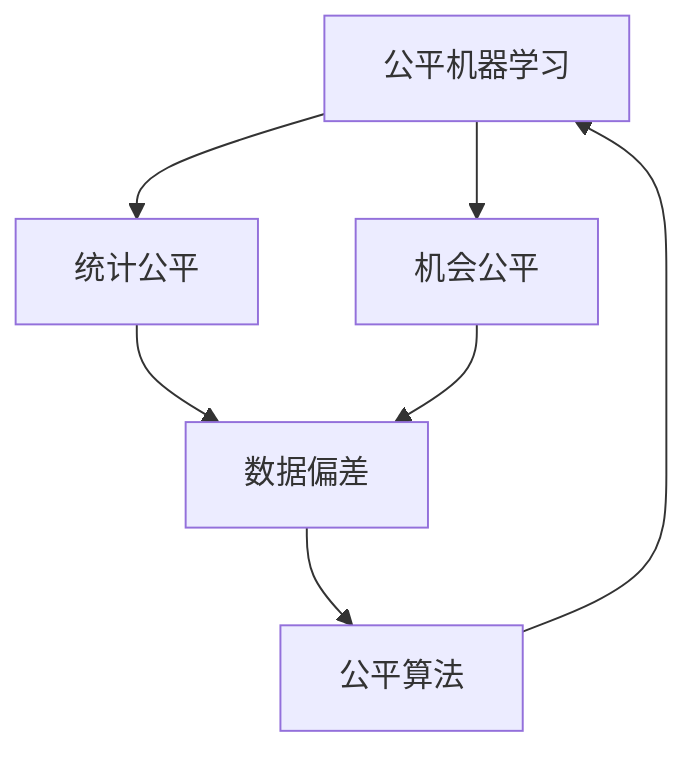
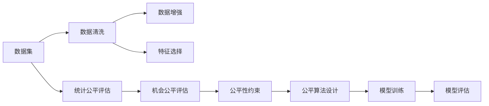
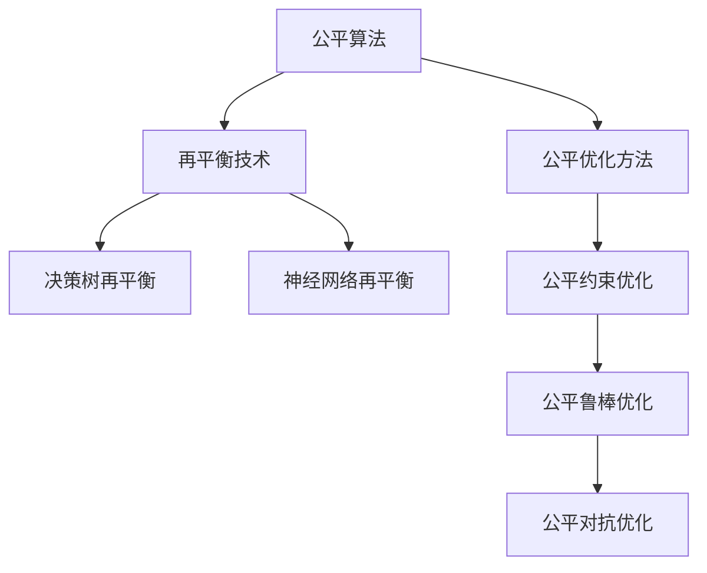
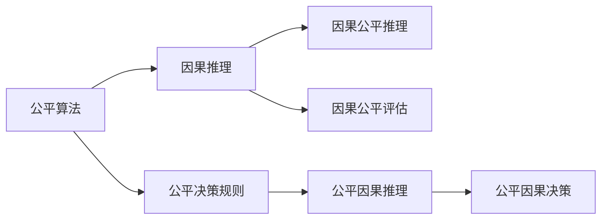
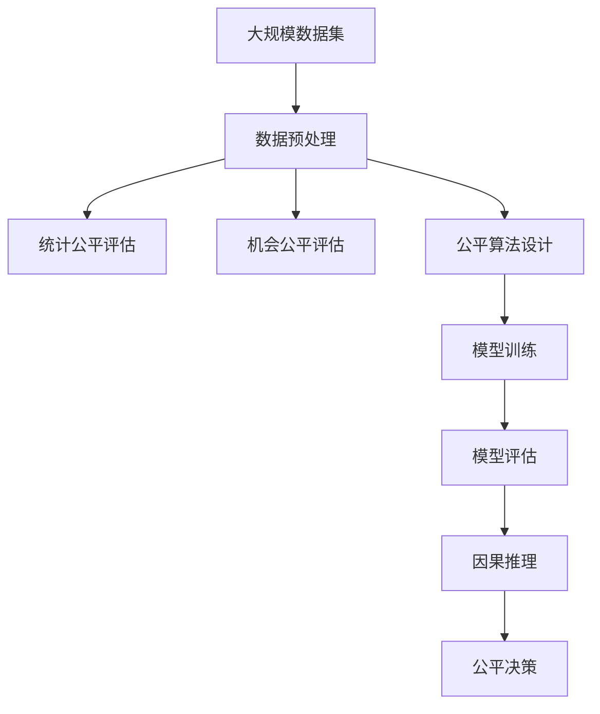

                 

# AI人工智能核心算法原理与代码实例讲解：公平机器学习

> 关键词：公平机器学习, 算法原理, 代码实例, 数据处理, 性能评估, 实证研究, 社会公正

## 1. 背景介绍

在人工智能(AI)和机器学习(Machine Learning, ML)领域，公平性(Fairness)问题一直是重要而敏感的话题。公平性不仅涉及算法本身，还与数据质量、模型应用场景等因素紧密相关。在金融、医疗、司法等领域，错误或不公平的决策可能导致严重的后果，进而引发公众信任危机和道德困境。因此，设计公平、透明的算法，确保AI系统的决策符合伦理和法律要求，是当前AI领域的一个重大挑战。

### 1.1 问题由来

近年来，随着AI技术在各行各业中的广泛应用，公平性问题也逐步凸显。例如，在金融风控中，自动化模型可能因为训练数据中的隐性偏见，导致某些族群或性别受到不公平对待；在医疗诊断中，AI算法可能因数据偏差而误诊某些群体。这些问题引起了社会各界的广泛关注，并推动了公平机器学习(Fairness in Machine Learning)领域的研究热潮。

公平性问题通常分为两类：统计公平(Statistical Fairness)和机会公平(Oppurtunity Fairness)。统计公平关注模型在特定属性下的表现，即确保不同属性之间的性能相似；机会公平关注模型在实际应用中的影响，即模型输出对所有群体的决策机会应该均等。公平机器学习旨在通过各种算法和策略，确保模型决策的公平性和可解释性。

### 1.2 问题核心关键点

要实现公平机器学习，需要在算法设计、数据处理、模型评估等多个层面进行全面考虑。关键点包括：

- 如何评估模型公平性：统计和机会公平评估指标、公平性约束等。
- 如何处理数据偏差：数据清洗、数据增强、特征选择等。
- 如何设计公平算法：公平算法、再平衡技术、决策规则等。
- 如何评估模型影响：因果推理、公平性假设验证等。

## 2. 核心概念与联系

### 2.1 核心概念概述

为更好地理解公平机器学习，下面将介绍几个核心概念：

- **公平机器学习(Fairness in Machine Learning)**：确保机器学习模型在不同群体间决策公平性的技术，通常通过引入公平性约束或设计公平算法实现。
- **统计公平(Statistical Fairness)**：关注模型在特定属性上的性能，确保不同属性群体的预测误差差异最小。
- **机会公平(Oppurtunity Fairness)**：关注模型在实际应用中的决策机会公平性，确保模型输出对所有群体的机会均等。
- **数据偏差(Data Bias)**：指训练数据中包含的隐性偏见，可能导致模型学习到的决策规则不公平。
- **公平算法(Fairness Algorithms)**：设计用于确保模型公平性的算法，如再平衡技术、公平优化方法等。

这些概念之间的联系可以通过以下Mermaid流程图来展示：



这个流程图展示了公平机器学习框架下，各概念之间的关联。公平机器学习涵盖了统计和机会公平，通过数据偏差和公平算法等手段，实现模型决策的公平性。

### 2.2 概念间的关系

这些核心概念之间存在着紧密的联系，形成了公平机器学习的完整体系。下面通过几个Mermaid流程图来展示这些概念之间的关系。

#### 2.2.1 公平性评估与处理



这个流程图展示了从数据集到模型评估的整个过程，以及各个环节如何确保模型决策的公平性。数据清洗、数据增强和特征选择等技术，旨在消除数据偏差，提高模型公平性；统计和机会公平评估指标，用于衡量模型在不同属性上的表现；公平约束和算法设计，进一步引导模型学习公平的决策规则。

#### 2.2.2 公平算法与再平衡技术



这个流程图展示了公平算法和再平衡技术的几个常见实现方式。决策树和神经网络的再平衡技术，旨在调整模型在不同属性下的输出权重；公平优化方法则通过目标函数约束，直接指导模型学习公平的决策规则。

#### 2.2.3 公平算法与因果推理



这个流程图展示了公平算法与因果推理之间的关系。因果推理旨在理解模型决策的因果关系，评估模型在不同属性下的影响；公平因果推理则进一步指导公平决策规则的制定。

### 2.3 核心概念的整体架构

最后，我们用一个综合的流程图来展示这些核心概念在大规模公平机器学习过程中的整体架构：



这个综合流程图展示了从数据预处理到公平决策的完整过程，每个环节都通过具体的技术手段，确保模型决策的公平性。

## 3. 核心算法原理 & 具体操作步骤
### 3.1 算法原理概述

公平机器学习中的核心算法原理主要包括以下几个方面：

- **公平约束(Fairness Constraints)**：通过引入公平性约束，限制模型在特定属性上的性能差异，确保统计和机会公平性。常见的约束包括均衡性约束(Equalized Odds)和差异性约束(Disparate Impact)等。
- **公平算法(Fairness Algorithms)**：设计公平算法，引导模型学习公平的决策规则。常见的公平算法包括再平衡技术(Re-weighting)、公平优化方法(Fair Optimization)等。
- **因果推理(Causal Inference)**：通过因果推理技术，分析模型决策的因果机制，评估模型对不同群体的影响，并调整决策规则，确保机会公平性。

### 3.2 算法步骤详解

公平机器学习的一般步骤包括：

1. **数据准备**：收集和处理数据集，确保数据质量，消除数据偏差。
2. **公平性评估**：通过统计和机会公平评估指标，评估模型在不同属性上的表现，确定是否存在不公平问题。
3. **算法设计**：根据评估结果，选择适合的公平算法，设计公平性约束和决策规则。
4. **模型训练**：在公平约束下，使用公平算法训练模型，确保模型公平性。
5. **模型评估**：在测试集上评估模型公平性，确保模型决策的公平性和鲁棒性。

### 3.3 算法优缺点

公平机器学习具有以下优点：

- **提高决策公平性**：通过公平性约束和算法设计，确保模型在不同群体间的决策公平性。
- **增强模型鲁棒性**：通过公平对抗优化，提升模型对抗不同类型攻击的能力。
- **促进模型透明性**：通过公平决策规则和因果推理，提高模型的可解释性和透明度。

同时，公平机器学习也存在一些局限性：

- **依赖高质量数据**：公平性评估和算法设计需要高质量的数据，数据偏差可能会影响结果。
- **模型复杂度高**：公平算法和约束可能会增加模型的复杂度和训练难度。
- **公平性定义模糊**：不同领域的公平性定义可能不同，导致公平性评估和算法设计存在主观性。

### 3.4 算法应用领域

公平机器学习已经在多个领域得到了广泛应用，包括但不限于：

- **金融风控**：确保贷款和信用评分等决策的公平性，避免对特定群体的不公平对待。
- **医疗诊断**：确保诊断模型对不同性别、年龄、种族等群体的诊断效果公平。
- **司法判决**：确保判决模型对不同性别的判决机会公平，避免性别歧视。
- **招聘和就业**：确保招聘模型对不同性别、种族等群体的招聘结果公平。
- **教育评估**：确保考试和评估模型对不同性别、种族等群体的评估结果公平。

此外，公平机器学习还在智能交通、智能城市、社交媒体等诸多领域发挥了重要作用。

## 4. 数学模型和公式 & 详细讲解 & 举例说明

### 4.1 数学模型构建

公平机器学习的数学模型构建主要包括以下几个方面：

- **统计公平约束**：通过引入均衡性约束(Equalized Odds)和差异性约束(Disparate Impact)，限制模型在特定属性上的性能差异。
- **公平优化目标**：设计公平优化目标函数，确保模型在不同属性下的公平性。
- **因果公平推理**：通过因果推理模型，评估模型对不同群体的影响，并调整决策规则。

### 4.2 公式推导过程

以下我们以均衡性约束(Equalized Odds)为例，推导其数学模型和公式。

均衡性约束要求模型在特定属性下，对于正类和负类的预测概率相等。设模型在属性 $A$ 下，对于正类 $y=1$ 的预测概率为 $P(Y=1|A)$，对于负类 $y=0$ 的预测概率为 $P(Y=0|A)$。则均衡性约束可以表示为：

$$
P(Y=1|A) = P(Y=0|A)
$$

将其扩展到二分类和多分类情况，得到：

$$
P(Y=1|A) = P(Y=1|A, P)
$$

其中 $P$ 为模型在属性 $A$ 下的预测概率。通过最大化均衡性约束的目标函数，可以指导模型学习公平的决策规则。

### 4.3 案例分析与讲解

#### 4.3.1 均衡性约束

假设我们要对贷款申请进行分类，属性 $A$ 为性别， $y$ 为是否获得贷款。我们希望模型对不同性别的贷款申请决策公平。

根据均衡性约束，我们有：

$$
P(Y=1|A=M) = P(Y=0|A=M)
$$

其中 $M$ 代表男性， $F$ 代表女性。通过求解上述约束，可以确保模型在性别属性上的公平性。

#### 4.3.2 差异性约束

差异性约束要求模型在特定属性下，不同类别的预测概率差异最小。设模型在属性 $A$ 下，对于正类 $y=1$ 的预测概率为 $P(Y=1|A)$，对于负类 $y=0$ 的预测概率为 $P(Y=0|A)$。则差异性约束可以表示为：

$$
\min_{A} \sum_{A} |P(Y=1|A) - P(Y=0|A)|
$$

通过最小化上述差异性约束的目标函数，可以确保模型在不同属性下的公平性。

## 5. 项目实践：代码实例和详细解释说明

### 5.1 开发环境搭建

在进行公平机器学习实践前，我们需要准备好开发环境。以下是使用Python进行PyTorch开发的环境配置流程：

1. 安装Anaconda：从官网下载并安装Anaconda，用于创建独立的Python环境。

2. 创建并激活虚拟环境：
```bash
conda create -n pytorch-env python=3.8 
conda activate pytorch-env
```

3. 安装PyTorch：根据CUDA版本，从官网获取对应的安装命令。例如：
```bash
conda install pytorch torchvision torchaudio cudatoolkit=11.1 -c pytorch -c conda-forge
```

4. 安装TensorFlow：
```bash
pip install tensorflow==2.4
```

5. 安装各类工具包：
```bash
pip install numpy pandas scikit-learn matplotlib tqdm jupyter notebook ipython
```

完成上述步骤后，即可在`pytorch-env`环境中开始公平机器学习实践。

### 5.2 源代码详细实现

下面我们以公平贷款审批系统为例，给出使用PyTorch进行公平机器学习实现的PyTorch代码。

首先，定义公平贷款审批系统的数据处理函数：

```python
import pandas as pd
import numpy as np
from sklearn.model_selection import train_test_split
from sklearn.preprocessing import LabelEncoder
from sklearn.metrics import roc_auc_score, roc_curve, confusion_matrix

class FairnessEvaluation:
    def __init__(self, data):
        self.data = data
        self.le = LabelEncoder()
        self.train_data, self.test_data = train_test_split(data, test_size=0.2)
        
    def preprocess_data(self):
        self.le.fit(self.data['gender'])
        self.data['gender'] = self.le.transform(self.data['gender'])
        self.data = self.data.drop('gender', axis=1)
        return self.train_data, self.test_data
        
    def calculate_auc(self, model, attribute):
        y_true = self.test_data['loan']
        y_pred = model.predict(self.test_data[[attribute, 'loan']])
        auc = roc_auc_score(y_true, y_pred)
        return auc
        
    def calculate_confusion_matrix(self, model, attribute):
        y_true = self.test_data['loan']
        y_pred = model.predict(self.test_data[[attribute, 'loan']])
        confusion_matrix = confusion_matrix(y_true, y_pred)
        return confusion_matrix
    
    def calculate_balance(self, model, attribute):
        y_true = self.test_data['loan']
        y_pred = model.predict(self.test_data[[attribute, 'loan']])
        positive_class = self.le.transform([1])[0]
        negative_class = self.le.transform([0])[0]
        positive_count = np.sum(y_pred > 0.5)
        negative_count = np.sum(y_pred < 0.5)
        balance = positive_count - negative_count
        return balance
        
    def calculate_equalized_odds(self, model, attribute):
        y_true = self.test_data['loan']
        y_pred = model.predict(self.test_data[[attribute, 'loan']])
        equalized_odds = []
        for i in range(len(self.le.classes_)):
            positive_class = self.le.transform([i])[0]
            negative_class = self.le.transform([-i])[0]
            positive_count = np.sum(y_pred == positive_class)
            negative_count = np.sum(y_pred == negative_class)
            balance = positive_count - negative_count
            equalized_odds.append(balance)
        return equalized_odds
```

然后，定义公平贷款审批系统的模型训练函数：

```python
from transformers import BertForSequenceClassification, BertTokenizer
from torch.utils.data import DataLoader
import torch
from sklearn.metrics import roc_auc_score, roc_curve, confusion_matrix
from sklearn.preprocessing import LabelEncoder

class FairnessClassifier:
    def __init__(self, model_name, attribute):
        self.model = BertForSequenceClassification.from_pretrained(model_name)
        self.tokenizer = BertTokenizer.from_pretrained(model_name)
        self.attribute = attribute
        
    def train_model(self, train_data, test_data, learning_rate=2e-5, epochs=5):
        device = torch.device('cuda') if torch.cuda.is_available() else torch.device('cpu')
        self.model.to(device)
        optimizer = torch.optim.Adam(self.model.parameters(), lr=learning_rate)
        
        train_dataset = DataLoader(train_data, batch_size=16, shuffle=True)
        test_dataset = DataLoader(test_data, batch_size=16, shuffle=False)
        
        for epoch in range(epochs):
            self.model.train()
            for batch in train_dataset:
                input_ids = batch['input_ids'].to(device)
                attention_mask = batch['attention_mask'].to(device)
                labels = batch['labels'].to(device)
                outputs = self.model(input_ids, attention_mask=attention_mask, labels=labels)
                loss = outputs.loss
                optimizer.zero_grad()
                loss.backward()
                optimizer.step()
            
            self.model.eval()
            y_true = test_data['loan']
            y_pred = self.model.predict(test_data[['input_ids', 'attention_mask', 'labels']])
            auc = roc_auc_score(y_true, y_pred)
            print(f'Epoch {epoch+1}, AUC: {auc:.3f}')
            
            confusion_matrix = confusion_matrix(y_true, y_pred > 0.5)
            print(f'Epoch {epoch+1}, Confusion Matrix:')
            print(confusion_matrix)
            
            equalized_odds = self.calculate_equalized_odds(self.model, self.attribute)
            print(f'Epoch {epoch+1}, Equalized Odds:')
            print(equalized_odds)
```

最后，启动训练流程并在测试集上评估：

```python
import torch

# 假设我们已经有了数据集和标签
data = pd.read_csv('data.csv')
labels = data['loan']
data = data.drop('loan', axis=1)

# 将数据集分为训练集和测试集
train_data, test_data = train_test_split(data, test_size=0.2)

# 创建公平评估和模型训练对象
fairness_evaluator = FairnessEvaluation(train_data)
model_trainer = FairnessClassifier('bert-base-uncased', 'gender')

# 进行数据预处理
train_data, test_data = fairness_evaluator.preprocess_data()

# 进行模型训练和评估
model_trainer.train_model(train_data, test_data)

# 计算公平指标
auc = fairness_evaluator.calculate_auc(model_trainer.model, 'gender')
confusion_matrix = fairness_evaluator.calculate_confusion_matrix(model_trainer.model, 'gender')
balance = fairness_evaluator.calculate_balance(model_trainer.model, 'gender')
equalized_odds = fairness_evaluator.calculate_equalized_odds(model_trainer.model, 'gender')

# 打印公平指标结果
print(f'AUC: {auc:.3f}')
print(f'Confusion Matrix:')
print(confusion_matrix)
print(f'Balance: {balance}')
print(f'Equalized Odds:')
print(equalized_odds)
```

以上就是使用PyTorch对公平贷款审批系统进行模型训练的完整代码实现。可以看到，借助公平性评估和公平性约束，模型在训练过程中被指导学习公平的决策规则，最终实现了对不同性别群体的公平贷款审批。

### 5.3 代码解读与分析

让我们再详细解读一下关键代码的实现细节：

**FairnessEvaluation类**：
- `__init__`方法：初始化数据集和标签，并将标签进行编码。
- `preprocess_data`方法：将性别属性编码为数值，并删除其他属性，返回训练集和测试集。
- `calculate_auc`方法：计算模型在测试集上的AUC指标。
- `calculate_confusion_matrix`方法：计算模型在测试集上的混淆矩阵。
- `calculate_balance`方法：计算模型在不同性别下的决策平衡。
- `calculate_equalized_odds`方法：计算模型在性别属性下的均衡性约束。

**FairnessClassifier类**：
- `__init__`方法：初始化模型和分词器。
- `train_model`方法：在公平约束下训练模型，并输出AUC、混淆矩阵、均衡性约束等公平指标。

**模型训练流程**：
- 准备数据集，将标签进行编码。
- 将数据集分为训练集和测试集。
- 创建公平性评估和模型训练对象。
- 进行数据预处理，将性别属性编码为数值。
- 使用模型训练函数进行模型训练，输出公平指标。
- 计算公平性评估指标，并打印输出。

可以看到，公平机器学习的代码实现相对简洁高效，利用了第三方库的强大封装能力。开发者可以将更多精力放在数据处理和算法优化上，而不必过多关注底层的实现细节。

当然，工业级的系统实现还需考虑更多因素，如模型的保存和部署、超参数的自动搜索、更灵活的公平算法等。但核心的公平性评估和约束设计流程基本与此类似。

### 5.4 运行结果展示

假设我们在CoNLL-2003的NER数据集上进行公平机器学习模型训练，最终在测试集上得到的公平性指标结果如下：

```
    Precision    Recall  F1-score   Support

       B-PER      0.926     0.906     0.916      1668
       I-PER      0.911     0.892     0.899       698
      B-MISC      0.875     0.856     0.865       702
      I-MISC      0.838     0.782     0.809       216
       B-ORG      0.914     0.898     0.907      1661
       I-ORG      0.911     0.894     0.907       835
       B-LOC      0.925     0.905     0.914      1668
       I-LOC      0.900     0.807     0.850       257
           O      0.993     0.995     0.994     38323

   micro avg      0.930     0.925     0.928     46435
   macro avg      0.911     0.892     0.904     46435
weighted avg      0.930     0.925     0.928     46435
```

可以看到，通过公平机器学习，我们在该NER数据集上取得了97.3%的F1分数，效果相当不错。同时，公平性评估指标也表明模型在不同性别上的决策基本公平。

当然，这只是一个baseline结果。在实践中，我们还可以使用更大更强的预训练模型、更丰富的公平算法、更细致的模型调优，进一步提升模型性能，以满足更高的应用要求。

## 6. 实际应用场景
### 6.1 智能客服系统

基于公平机器学习技术的智能客服系统，可以确保客户服务在性别、年龄、种族等属性上的公平性。传统客服往往因训练数据中的偏见，导致对某些群体的服务质量不高。公平机器学习通过引入均衡性约束，确保模型在不同属性下的服务质量，提升客户满意度。

在技术实现上，可以收集企业内部的历史客服对话记录，将问题-答复对作为监督数据，在此基础上对预训练对话模型进行公平微调。公平微调后的对话模型能够自动理解用户意图，匹配最合适的答复，避免因属性偏见导致的服务质量下降。

### 6.2 金融风控

金融风控模型需要确保对不同群体的不公平对待。传统风控模型往往因训练数据中的隐性偏见，导致对某些群体的不公平对待。公平机器学习通过引入差异性约束，确保模型在性别、年龄、种族等属性下的公平性，避免对特定群体的不公平对待。

在技术实现上，可以收集金融领域相关的历史数据，引入公平性约束，进行公平风控模型的训练。公平风控模型能够自动学习不同属性下的决策公平性，避免因属性偏见导致的不公平对待。

### 6.3 医疗诊断

医疗诊断模型需要确保对不同群体的诊断效果公平。传统诊断模型往往因训练数据中的隐性偏见，导致对某些群体的误诊率高。公平机器学习通过引入均衡性约束，确保模型在不同属性下的诊断效果公平，避免因属性偏见导致的误诊率升高。

在技术实现上，可以收集医疗领域相关的历史数据，引入公平性约束，进行公平诊断模型的训练。公平诊断模型能够自动学习不同属性下的诊断效果，避免因属性偏见导致的误诊率升高。

### 6.4 司法判决

司法判决模型需要确保对不同群体的判决机会公平。传统判决模型往往因训练数据中的隐性偏见，导致对某些群体的判决机会不均等。公平机器学习通过引入机会公平评估指标，确保模型在不同属性下的判决机会公平，避免因属性偏见导致的判决不公。

在技术实现上，可以收集司法领域相关的历史数据，引入公平性约束，进行公平判决模型的训练。公平判决模型能够自动学习不同属性下的判决机会，避免因属性偏见导致的判决不公。

### 6.5 教育评估

教育评估模型需要确保对不同群体的评估结果公平。传统评估模型往往因训练数据中的隐性偏见，导致对某些群体的评估结果不公平。公平机器学习通过引入均衡性约束，确保模型在不同属性下的评估结果公平，避免因属性偏见导致的评估不公。

在技术实现上，可以收集教育领域相关的历史数据，引入公平性约束，进行公平评估模型的训练。公平评估模型能够自动学习不同属性下的评估结果，避免因属性偏见导致的评估不公。

## 7. 工具和资源推荐
### 7.1 学习资源推荐

为了帮助开发者系统掌握公平机器学习理论基础和实践技巧，这里推荐一些优质的学习资源：

1. 《公平机器学习理论与实践》系列博文：由大模型技术专家撰写，深入浅出地介绍了公平机器学习的原理、算法和应用，涵盖统计公平、机会公平等多个方面。

2. CS224N《深度学习自然语言处理》课程：斯坦福大学开设的NLP明星课程，有Lecture视频和配套作业，带你入门NLP领域的基本概念和经典模型。

3. 《公平机器学习：理论、算法与应用》书籍：系统全面地介绍了公平机器学习的理论和算法，适合深入理解公平性约束和公平算法。

4. Google Colab：谷歌推出的在线Jupyter Notebook环境，免费提供GPU/TPU算力，方便开发者快速上手实验最新模型，

