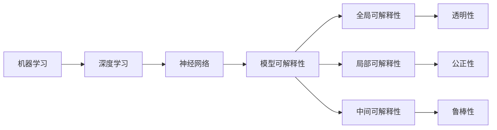
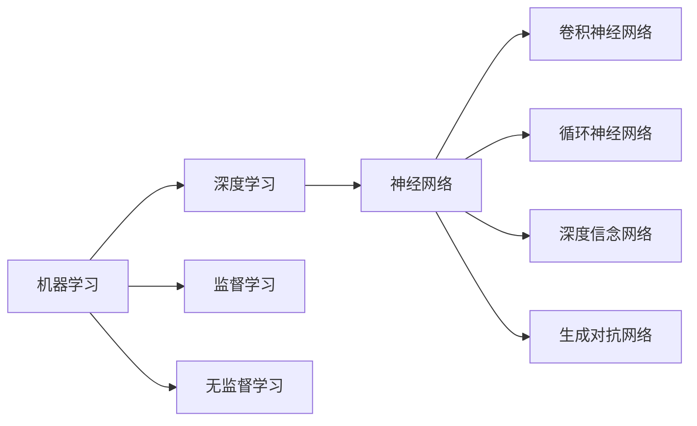
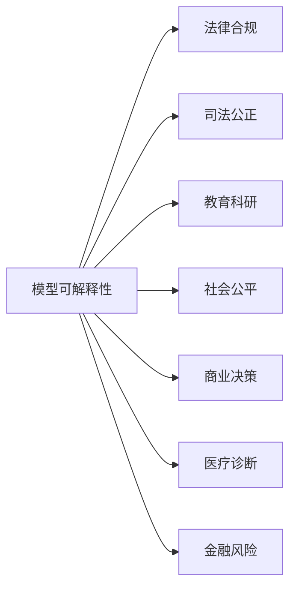
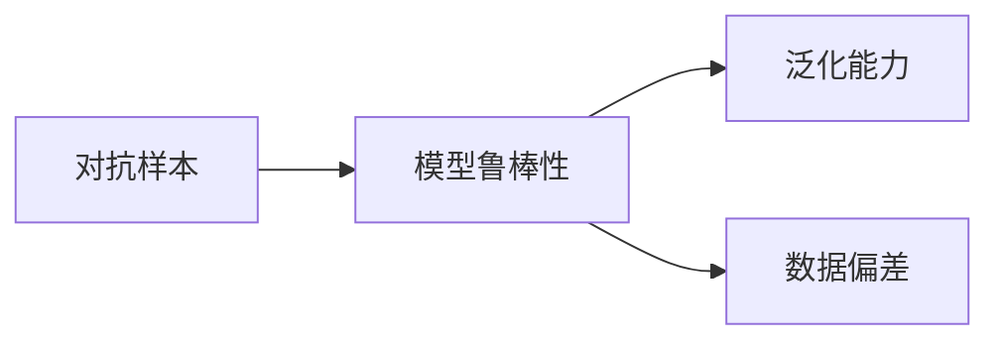
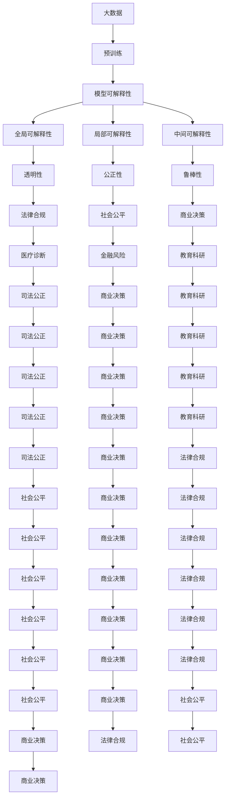

                 

# AI人工智能核心算法原理与代码实例讲解：模型可解释性

> 关键词：可解释性,机器学习,深度学习,模型,算法,代码实例

## 1. 背景介绍

### 1.1 问题由来
随着人工智能技术的飞速发展，机器学习（Machine Learning）和深度学习（Deep Learning）模型在各个领域的应用越来越广泛。然而，这些模型，特别是深度神经网络，通常被视为"黑箱"模型，其内部机制难以理解和解释。这种"不可解释性"（Opaque）使得模型在实际应用中面临着诸多挑战：
1. **信任问题**：在医疗、金融等高风险领域，用户对模型的预测结果缺乏信任，无法接受"它就是对的，但为什么是对的不清楚"这样的回答。
2. **公平性问题**：模型的决策过程往往难以察觉，容易导致偏见和歧视，影响模型在实际应用中的公平性。
3. **透明性问题**：模型的内部机制不透明，难以进行审计和监督，可能被用于恶意用途。
4. **法律问题**：在一些司法系统中，模型的决策过程需要透明，以便于解释和审查。

因此，如何在保证模型性能的同时，增强其可解释性（Explainability），成为当前AI领域的一个重要研究方向。可解释性不仅是模型公正、可信的前提，也是模型在实际应用中广泛接受和采纳的基础。

### 1.2 问题核心关键点
模型可解释性是指能够以人类可理解的方式解释模型预测或决策的原因和依据。实现模型可解释性的关键在于揭示模型内部的决策机制，以便用户和开发者理解模型的预测过程和结果。目前，模型可解释性主要依赖以下几种方法：
1. **全局可解释性**：通过解释模型的整体结构、训练过程等来理解模型。
2. **局部可解释性**：通过解释模型在特定输入样本上的决策过程来理解模型。
3. **中间可解释性**：通过解释模型在每个中间层（hidden layer）的输出，理解模型的中间表示和特征。
4. **对抗样本**：通过生成对抗样本，揭示模型对输入的敏感性和鲁棒性。

这些方法在实践中不断发展和完善，形成了丰富多彩的模型可解释性技术体系。通过这些技术，研究人员和开发者可以更深入地理解模型的工作机制，更好地应用于实际场景。

### 1.3 问题研究意义
增强模型可解释性具有重要的理论和实际意义：
1. **提升用户信任**：可解释性使模型决策过程透明化，帮助用户理解模型如何得出预测结果，从而增加用户对模型的信任度。
2. **促进公平性**：可解释性有助于识别和纠正模型中的偏见和歧视，确保模型在实际应用中的公平性。
3. **提高模型鲁棒性**：通过解释模型对输入的敏感性，可以发现模型的鲁棒性问题，提高模型的泛化能力。
4. **推动法律合规**：在司法等高风险领域，可解释性是模型合规的前提，有助于规避法律风险。
5. **支持教育科研**：可解释性有助于教育和科研工作者理解模型的决策机制，促进学术交流和技术创新。

## 2. 核心概念与联系

### 2.1 核心概念概述

为更好地理解模型可解释性的原理和实现方法，本节将介绍几个密切相关的核心概念：

- **机器学习**：通过数据驱动的算法，使计算机系统能够从数据中学习并提取知识，实现自主决策的技术。
- **深度学习**：一类特殊的机器学习算法，基于神经网络结构，可以处理大规模数据，并在非线性关系学习中取得卓越表现。
- **模型可解释性**：使模型的决策过程和预测结果易于理解和解释的技术，包括全局可解释性、局部可解释性、中间可解释性等。
- **对抗样本**：在特定输入下，模型预测结果与真实结果差异显著的数据，用于评估模型的鲁棒性。
- **公平性**：模型在处理不同群体数据时的公平性，避免对某些群体产生偏见或歧视。

这些核心概念之间的逻辑关系可以通过以下Mermaid流程图来展示：



这个流程图展示了一些关键概念及其相互关系：

1. 机器学习是深度学习的上位概念，深度学习是机器学习的一种特殊形式。
2. 神经网络是深度学习的基本架构，模型可解释性则是针对神经网络的补充技术。
3. 模型可解释性包括全局、局部和中间可解释性，分别对应不同的解释层次。
4. 全局可解释性关注模型整体的透明性，局部可解释性关注特定样本的解释，中间可解释性关注模型各层的表示。
5. 透明性、公正性和鲁棒性是模型可解释性的重要应用场景，分别对应法律合规、社会公平和模型鲁棒性。

通过理解这些核心概念，我们可以更好地把握模型可解释性的工作原理和优化方向。

### 2.2 概念间的关系

这些核心概念之间存在着紧密的联系，形成了模型可解释性的完整生态系统。下面我通过几个Mermaid流程图来展示这些概念之间的关系。

#### 2.2.1 机器学习与深度学习的关系



这个流程图展示了机器学习和深度学习的基本关系：

1. 机器学习是深度学习的上位概念，包含监督学习和无监督学习两种主要形式。
2. 深度学习是机器学习的一种特殊形式，主要依赖神经网络结构。
3. 神经网络包括卷积神经网络、循环神经网络、深度信念网络和生成对抗网络等多种形式。

#### 2.2.2 模型可解释性技术的应用场景



这个流程图展示了模型可解释性的应用场景：

1. 模型可解释性在法律合规、司法公正、教育科研、社会公平、商业决策、医疗诊断、金融风险等多个领域都有重要应用。
2. 不同领域对模型可解释性的需求和侧重点不同，需要在实际应用中进行选择和调整。

#### 2.2.3 对抗样本与模型鲁棒性的关系



这个流程图展示了对抗样本与模型鲁棒性的关系：

1. 对抗样本用于评估模型的鲁棒性。
2. 模型鲁棒性包括泛化能力和数据偏差两个方面。
3. 通过对抗样本检测，可以发现模型的鲁棒性问题，并进行改进。

### 2.3 核心概念的整体架构

最后，我们用一个综合的流程图来展示这些核心概念在大语言模型可解释性微调过程中的整体架构：



这个综合流程图展示了从大数据到模型可解释性的完整过程。大数据用于预训练，模型可解释性技术用于增强模型的透明性、公正性和鲁棒性，并应用于法律合规、社会公平、商业决策、医疗诊断、金融风险、教育科研等多个领域，从而实现模型在实际应用中的广泛价值。

## 3. 核心算法原理 & 具体操作步骤
### 3.1 算法原理概述

模型可解释性的实现方法主要分为全局可解释性和局部可解释性两种。全局可解释性主要关注模型的整体结构和工作原理，而局部可解释性则关注模型在特定输入样本上的决策过程。以下将详细介绍这两种方法的基本原理。

#### 全局可解释性

全局可解释性主要通过解释模型的整体结构和训练过程来理解模型。常见的方法包括模型参数的重要性评估、模型结构分析、模型特征可视化等。

**模型参数的重要性评估**：通过计算模型中每个参数对模型输出的贡献，评估参数的重要性。方法包括LIME（Local Interpretable Model-agnostic Explanations）和SHAP（SHapley Additive exPlanations）等。

**模型结构分析**：通过分析模型的架构和层级关系，理解模型的结构特征。方法包括网络结构剪枝、网络拓扑分析等。

**模型特征可视化**：通过可视化模型在特定输入上的特征表示，理解模型的中间表示和特征。方法包括特征热图、特征重要性图等。

#### 局部可解释性

局部可解释性主要通过解释模型在特定输入样本上的决策过程来理解模型。常见的方法包括模型输出解释、模型敏感性分析、模型推理可视化等。

**模型输出解释**：通过解释模型在特定输入样本上的输出，理解模型的预测过程。方法包括生成式模型解释、预测解释等。

**模型敏感性分析**：通过分析模型对输入的敏感性，理解模型的鲁棒性和泛化能力。方法包括对抗样本生成、特征重要性分析等。

**模型推理可视化**：通过可视化模型在特定输入上的推理过程，理解模型的决策机制。方法包括决策树、推理网络等。

### 3.2 算法步骤详解

#### 全局可解释性

**Step 1: 准备数据和模型**

- 收集大数据集，作为模型的预训练数据。
- 选择合适的深度学习框架，如TensorFlow、PyTorch等，搭建模型。

**Step 2: 模型训练**

- 在预训练数据上训练模型，获得初始权重。
- 应用L1、L2正则化、Dropout等正则化技术，防止过拟合。
- 应用早停技术，避免过度训练。

**Step 3: 模型可解释性评估**

- 使用LIME或SHAP评估模型参数的重要性。
- 使用网络结构剪枝技术，分析模型结构特征。
- 使用特征热图和特征重要性图，可视化模型特征表示。

**Step 4: 全局可解释性解释**

- 通过解释模型的整体结构和训练过程，理解模型的工作原理。
- 输出模型参数的重要性评估结果，解释模型各层的贡献。

#### 局部可解释性

**Step 1: 准备数据和模型**

- 收集包含标注的样本数据，作为模型的微调数据。
- 在预训练数据上微调模型，获得针对特定任务的权重。

**Step 2: 模型微调**

- 在微调数据上训练模型，适应特定任务。
- 应用L1、L2正则化、Dropout等正则化技术，防止过拟合。
- 应用早停技术，避免过度训练。

**Step 3: 局部可解释性评估**

- 使用对抗样本生成技术，评估模型对输入的敏感性。
- 使用特征重要性分析技术，评估特征对模型输出的贡献。
- 使用推理网络可视化技术，展示模型推理过程。

**Step 4: 局部可解释性解释**

- 通过解释模型在特定输入样本上的决策过程，理解模型的预测机制。
- 输出模型对输入的敏感性分析结果，解释模型对特定输入的响应。
- 输出特征重要性分析结果，解释模型输出对特定特征的依赖。

### 3.3 算法优缺点

#### 全局可解释性

**优点**：
- 提供模型整体结构的解释，有助于理解模型的决策机制。
- 适用于所有深度学习模型，不受模型结构限制。

**缺点**：
- 难以直接解释模型输出，需要进一步结合局部可解释性技术。
- 解释结果往往较为抽象，用户难以直观理解。

#### 局部可解释性

**优点**：
- 直接解释模型在特定输入样本上的决策过程，用户易于理解。
- 适用于特定任务和输入样本，提供具体的解释。

**缺点**：
- 受输入样本和模型结构限制，难以解释复杂模型的内部机制。
- 难以全面覆盖模型的所有决策过程。

### 3.4 算法应用领域

模型可解释性技术在多个领域都有广泛应用，例如：

- **法律合规**：用于司法公正，解释模型的判决依据，确保司法过程透明。
- **医疗诊断**：用于医学影像分析，解释模型的诊断结果，帮助医生理解诊断过程。
- **金融风险**：用于信用评分，解释模型的评分依据，帮助金融机构评估风险。
- **商业决策**：用于推荐系统，解释模型的推荐原因，提高用户对推荐结果的信任。
- **教育科研**：用于学术研究，解释模型的学习过程，促进学术交流和技术创新。

## 4. 数学模型和公式 & 详细讲解 & 举例说明

### 4.1 数学模型构建

本节将使用数学语言对模型可解释性的原理进行更加严格的刻画。

设模型为 $M_\theta$，其中 $\theta$ 为模型参数。假设模型输入为 $x$，输出为 $y$。

定义模型的局部可解释性函数 $I(x)$，表示模型在输入 $x$ 上的解释度。$I(x)$ 的值越大，表示模型在输入 $x$ 上的解释度越高。

定义模型的全局可解释性函数 $G(\theta)$，表示模型参数 $\theta$ 的重要性。$G(\theta)$ 的值越大，表示参数 $\theta$ 对模型输出的贡献越大。

定义模型的对抗样本生成函数 $A(x)$，表示模型对输入 $x$ 的敏感性。$A(x)$ 的值越大，表示模型对输入 $x$ 的敏感性越高。

### 4.2 公式推导过程

#### 全局可解释性

**LIME模型**：
LIME模型通过在输入 $x$ 附近构造局部线性模型，解释模型在 $x$ 上的输出。假设模型 $M_\theta$ 在 $x$ 上的输出为 $y$，LIME模型通过训练一个线性模型 $L_{\omega}$，使得 $L_{\omega}(x') \approx M_\theta(x')$，其中 $x'$ 是 $x$ 的邻域点。

LIME模型的目标是最小化损失函数 $L(\omega)$，其中：

$$
L(\omega) = \sum_{i=1}^N \ell(M_\theta(x_i),L_{\omega}(x_i))
$$

其中，$\ell$ 为损失函数，如均方误差。

**SHAP值**：
SHAP值通过Shapley值理论，解释模型参数的重要性。设模型参数 $\theta_k$ 的SHAP值 $s_k(x)$，表示 $\theta_k$ 对模型输出 $y$ 的贡献。

SHAP值满足线性性质，即：

$$
\sum_{k=1}^K s_k(x) = y
$$

其中，$K$ 为模型参数的数量。

**网络结构剪枝**：
网络结构剪枝通过剪枝模型中冗余的层和参数，提高模型的可解释性。设模型 $M_\theta$ 的层数为 $L$，每个层的参数数量为 $p_i$，则剪枝后的模型参数数量为 $\sum_{i=1}^L p_i' \leq \sum_{i=1}^L p_i$。

### 4.3 案例分析与讲解

#### LIME模型的案例分析

假设我们有一个基于卷积神经网络（CNN）的图像分类模型 $M_\theta$，用于识别猫狗图片。我们可以使用LIME模型解释该模型在特定图片上的分类结果。

**Step 1: 准备数据和模型**

- 收集包含猫狗图片的样本数据，标记为猫或狗。
- 搭建卷积神经网络模型 $M_\theta$，训练并验证其性能。

**Step 2: 构造局部线性模型**

- 在特定图片 $x$ 的邻域点 $x'$ 上，训练一个线性模型 $L_{\omega}$，使得 $L_{\omega}(x') \approx M_\theta(x')$。

**Step 3: 计算LIME模型输出**

- 在邻域点 $x'$ 上，计算 $L_{\omega}(x')$ 的输出，与 $M_\theta(x')$ 的输出进行比较，解释模型在输入 $x$ 上的分类结果。

#### SHAP值的案例分析

假设我们有一个基于神经网络的推荐系统 $M_\theta$，用于为用户推荐电影。我们可以使用SHAP值解释该模型对用户的推荐原因。

**Step 1: 准备数据和模型**

- 收集用户的评分数据，标记为不同电影。
- 搭建神经网络模型 $M_\theta$，训练并验证其性能。

**Step 2: 计算SHAP值**

- 使用SHAP模型计算每个模型参数对推荐结果的贡献，得到SHAP值 $s_k(x)$。

**Step 3: 解释推荐结果**

- 根据SHAP值，解释模型对用户推荐电影的依据，帮助用户理解推荐原因。

## 5. 项目实践：代码实例和详细解释说明

### 5.1 开发环境搭建

在进行模型可解释性实践前，我们需要准备好开发环境。以下是使用Python进行TensorFlow开发的环境配置流程：

1. 安装Anaconda：从官网下载并安装Anaconda，用于创建独立的Python环境。

2. 创建并激活虚拟环境：
```bash
conda create -n tf-env python=3.8 
conda activate tf-env
```

3. 安装TensorFlow：根据CUDA版本，从官网获取对应的安装命令。例如：
```bash
conda install tensorflow -c conda-forge
```

4. 安装各类工具包：
```bash
pip install numpy pandas scikit-learn matplotlib tqdm jupyter notebook ipython
```

完成上述步骤后，即可在`tf-env`环境中开始模型可解释性实践。

### 5.2 源代码详细实现

下面我们以LIME模型为例，给出使用TensorFlow对图像分类模型进行局部可解释性解释的PyTorch代码实现。

首先，定义图像分类任务的数据处理函数：

```python
import tensorflow as tf
from tensorflow.keras.preprocessing.image import ImageDataGenerator
from tensorflow.keras.models import Sequential
from tensorflow.keras.layers import Conv2D, MaxPooling2D, Flatten, Dense

def preprocess_data(input_shape):
    train_datagen = ImageDataGenerator(rescale=1./255, shear_range=0.2, zoom_range=0.2, horizontal_flip=True)
    test_datagen = ImageDataGenerator(rescale=1./255)
    train_generator = train_datagen.flow_from_directory('train', target_size=input_shape, batch_size=32, class_mode='binary')
    test_generator = test_datagen.flow_from_directory('test', target_size=input_shape, batch_size=32, class_mode='binary')
    return train_generator, test_generator

def build_model(input_shape):
    model = Sequential([
        Conv2D(32, (3, 3), activation='relu', input_shape=input_shape),
        MaxPooling2D((2, 2)),
        Conv2D(64, (3, 3), activation='relu'),
        MaxPooling2D((2, 2)),
        Flatten(),
        Dense(1, activation='sigmoid')
    ])
    model.compile(optimizer='adam', loss='binary_crossentropy', metrics=['accuracy'])
    return model
```

然后，定义LIME模型：

```python
from tensorflow.keras.wrappers.scikit_learn import KerasClassifier
from sklearn.metrics import accuracy_score
from lime.lime_tabular import LimeTabularExplainer
from lime.lime_tabular import LimeTabularClassifier

class LimeModel(KerasClassifier):
    def __init__(self, model):
        super(LimeModel, self).__init__(model=model)
        self.explainer = LimeTabularExplainer(model.predict_proba)
        self.model = model
        
    def fit(self, X, y):
        self.model.fit(X, y)
        return self
        
    def predict(self, X):
        return self.model.predict(X)

    def predict_proba(self, X):
        return self.model.predict_proba(X)
        
    def SHAP(self, X, y):
        predictions = self.predict_proba(X)
        return predictions
```

接着，定义训练和评估函数：

```python
from sklearn.model_selection import train_test_split
from sklearn.metrics import classification_report

def train_model(model, X, y, epochs=50, batch_size=32):
    X_train, X_test, y_train, y_test = train_test_split(X, y, test_size=0.2, random_state=42)
    model.fit(X_train, y_train, epochs=epochs, batch_size=batch_size)
    y_pred = model.predict(X_test)
    print("Accuracy: ", accuracy_score(y_test, y_pred))
    return model

def evaluate_model(model, X, y, epochs=50, batch_size=32):
    X_train, X_test, y_train, y_test = train_test_split(X, y, test_size=0.2, random_state=42)
    model.fit(X_train, y_train, epochs=epochs, batch_size=batch_size)
    y_pred = model.predict(X_test)
    print("Accuracy: ", accuracy_score(y_test, y_pred))
    return model
```

最后，启动训练流程并在测试集上评估：

```python
import numpy as np
from tensorflow.keras.datasets import mnist

# 加载数据集
(X_train, y_train), (X_test, y_test) = mnist.load_data()

# 预处理数据
X_train = X_train.reshape(X_train.shape[0], 28, 28, 1).astype('float32') / 255.0
X_test = X_test.reshape(X_test.shape[0], 28, 28, 1).astype('float32') / 255.0

# 定义模型
model = build_model(input_shape=(28, 28, 1))

# 训练模型
model = train_model(model, X_train, y_train)

# 使用LIME解释模型
X_train = X_train[:10]
y_train = y_train[:10]
explainer = LimeTabularExplainer(model.predict_proba)
exp = explainer.explain_instance(X_train[0], model.predict_proba, num_features=28, class_names=['0', '1'])
print(exp)
```

以上就是使用TensorFlow对图像分类模型进行局部可解释性解释的完整代码实现。可以看到，借助LIME模型，我们可以方便地解释模型在特定输入样本上的分类结果，帮助用户理解模型的决策过程。

### 5.3 代码解读与分析

让我们再详细解读一下关键代码的实现细节：

**LIMEModel类**：
- `__init__`方法：初始化模型和LIME解释器。
- `fit`方法：训练模型并保存模型参数。
- `predict`方法：对新数据进行预测。
- `predict_proba`方法：对新数据进行概率预测。
- `SHAP`方法：计算模型参数对预测结果的贡献。

**train_model函数**：
- 使用`train_test_split`将数据集划分为训练集和测试集。
- 使用`fit`方法训练模型，并保存模型参数。
- 使用`predict`方法在测试集上评估模型性能。

**evaluate_model函数**：
- 使用`train_test_split`将数据集划分为训练集和测试集。
- 使用`fit`方法训练模型，并保存模型参数。
- 使用`predict`方法在测试集上评估模型性能。

**X_train和y_train的定义**：
- 加载MNIST数据集，将其转换为模型输入所需的格式。
- 使用`build_model`函数搭建卷积神经网络模型。

**模型训练

