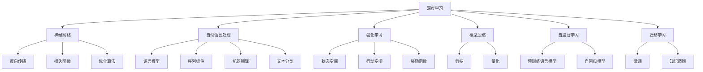

                 

# AI人工智能核心算法原理与代码实例讲解：算法实现

> 关键词：人工智能,核心算法,原理,代码实例,讲解

## 1. 背景介绍

### 1.1 问题由来

随着人工智能技术的快速发展，核心算法的研究和应用成为了推动AI技术进步的关键。核心算法，如深度学习、强化学习、自然语言处理等，在计算机视觉、自然语言处理、推荐系统等多个领域取得了突破性进展。理解核心算法的原理与实现，对于开发者、研究者乃至AI技术的普及和应用具有重要意义。

本文聚焦于核心算法的实现原理和代码实例，详细讲解了深度学习、强化学习、自然语言处理等AI技术中的核心算法，并提供了丰富的代码实例和详细解读。希望通过本文，读者能够全面掌握核心算法的原理，并通过实践深入理解其工作机制，从而在实际开发和研究中灵活应用。

### 1.2 问题核心关键点

核心算法的实现通常包括数学模型构建、算法步骤详解、算法优缺点和应用领域等几个关键点。本文将系统介绍这些关键点，帮助读者深入理解核心算法的实现，并在实际应用中充分发挥其优势。

## 2. 核心概念与联系

### 2.1 核心概念概述

为更好地理解核心算法的实现，本节将介绍几个密切相关的核心概念：

- **深度学习**：一种基于多层神经网络的机器学习方法，广泛应用于图像识别、语音识别、自然语言处理等领域。深度学习通过学习大量数据，自动提取特征并进行分类或回归。
- **强化学习**：一种通过试错优化行为策略的机器学习方法。强化学习广泛应用于游戏、机器人控制、推荐系统等领域，通过与环境的交互，优化决策策略以获得最大奖励。
- **自然语言处理**：一种使计算机能够理解、处理和生成自然语言的技术。自然语言处理包括语言模型、机器翻译、文本分类、情感分析等多个子领域。
- **迁移学习**：一种利用已有知识解决新任务的技术。通过在大规模数据上预训练模型，然后在新任务上微调，可以显著提升模型性能。
- **模型压缩与加速**：为了提升模型在实际应用中的效率，常常需要对其进行压缩和加速处理。模型压缩包括剪枝、量化等方法，而加速则涉及模型并行、分布式训练等技术。
- **自监督学习**：一种无需标注数据即可训练模型的方法。通过利用数据的潜在关联，如语言模型、自回归等，模型可以自动学习到丰富的知识。

这些核心概念之间存在着紧密的联系，形成了AI技术的整体框架。通过理解这些概念，我们可以更好地把握AI技术的实现原理和应用范围。

### 2.2 概念间的关系

这些核心概念之间存在着相互依赖和促进的关系，形成了一个完整的AI技术体系：

- **深度学习与自然语言处理**：深度学习是自然语言处理的核心技术之一，通过多层神经网络模型，可以对自然语言进行处理和生成。
- **强化学习与机器人控制**：强化学习通过与环境的交互，优化机器人的行为策略，实现自动控制。
- **迁移学习与模型压缩**：迁移学习可以通过预训练模型和微调提升新任务的性能，而模型压缩则通过优化模型结构，提高模型的效率。
- **自监督学习与深度学习**：自监督学习可以为深度学习提供无标注的数据源，提升模型的泛化能力。

### 2.3 核心概念的整体架构

最后，我们用一个综合的流程图来展示这些核心概念在大规模AI技术中的应用：



这个综合流程图展示了核心概念在大规模AI技术中的应用：

1. 深度学习通过神经网络实现数据的自动特征提取和分类/回归。
2. 自然语言处理通过语言模型、序列标注、机器翻译等方法，提升计算机对自然语言的理解能力。
3. 强化学习通过与环境的交互，优化机器人的行为策略。
4. 模型压缩通过剪枝、量化等方法，提高模型的效率。
5. 自监督学习通过预训练和自回归模型，提升模型的泛化能力。
6. 迁移学习通过微调和知识蒸馏等方法，提升模型在新任务上的性能。

这些核心概念共同构成了大规模AI技术的实现基础，使其能够在各个领域发挥强大的作用。通过理解这些核心概念，我们可以更好地把握AI技术的实现原理和优化方向。

## 3. 核心算法原理 & 具体操作步骤

### 3.1 算法原理概述

核心算法的实现通常基于数学模型和计算流程。本文将详细介绍深度学习、强化学习和自然语言处理中的核心算法原理，并结合代码实例进行详细讲解。

### 3.2 算法步骤详解

#### 3.2.1 深度学习核心算法

深度学习中的核心算法包括前向传播、反向传播、优化算法和损失函数等。下面以卷积神经网络(CNN)为例，详细介绍其核心算法步骤：

1. **前向传播**：将输入数据通过卷积层、池化层、全连接层等，逐步提取特征并进行分类。

2. **反向传播**：通过计算损失函数对每个参数的梯度，使用梯度下降等优化算法更新模型参数。

3. **优化算法**：常用的优化算法包括随机梯度下降(SGD)、Adam等，通过调整学习率、动量等参数，提高模型训练速度和效果。

4. **损失函数**：常用的损失函数包括交叉熵损失、均方误差损失等，衡量模型预测输出与真实标签之间的差异。

#### 3.2.2 强化学习核心算法

强化学习中的核心算法包括策略梯度、Q-learning等。下面以Q-learning算法为例，详细介绍其核心算法步骤：

1. **状态空间**：定义问题中的状态空间，表示环境的当前状态。

2. **行动空间**：定义问题中的行动空间，表示智能体可以采取的行动。

3. **奖励函数**：定义问题中的奖励函数，根据智能体的行动和环境状态，返回相应的奖励。

4. **Q-learning**：通过迭代更新Q值函数，指导智能体在当前状态下选择最优行动，最大化累积奖励。

#### 3.2.3 自然语言处理核心算法

自然语言处理中的核心算法包括语言模型、序列标注、机器翻译等。下面以语言模型为例，详细介绍其核心算法步骤：

1. **语言模型**：定义语言模型，计算输入序列的概率分布。

2. **训练过程**：通过最大似然估计等方法，优化语言模型的参数。

3. **应用场景**：语言模型可以用于文本生成、语言理解等多个任务，提高计算机对自然语言的理解能力。

### 3.3 算法优缺点

深度学习、强化学习和自然语言处理中的核心算法各具特点，具有以下优缺点：

#### 3.3.1 深度学习

**优点**：
- **自动特征提取**：深度学习能够自动学习数据的特征，无需手工设计特征。
- **高泛化能力**：深度学习模型具有较强的泛化能力，能够在未见过的数据上取得优异表现。

**缺点**：
- **计算资源需求高**：深度学习模型通常需要大量的计算资源进行训练和推理。
- **参数量大**：深度学习模型通常需要大量的参数进行训练，容易导致过拟合。

#### 3.3.2 强化学习

**优点**：
- **决策能力**：强化学习能够自动优化决策策略，适用于需要实时决策的场景。
- **鲁棒性强**：强化学习模型具有较强的鲁棒性，能够适应环境的变化。

**缺点**：
- **样本效率低**：强化学习模型通常需要大量的样本进行训练，效率较低。
- **环境复杂性高**：强化学习模型对环境的复杂性要求较高，模型设计较为困难。

#### 3.3.3 自然语言处理

**优点**：
- **理解能力强**：自然语言处理能够理解自然语言，提升计算机对人类语言的理解能力。
- **应用广泛**：自然语言处理技术广泛应用于信息检索、机器翻译、情感分析等多个领域。

**缺点**：
- **数据需求高**：自然语言处理模型通常需要大量的标注数据进行训练。
- **模型复杂性高**：自然语言处理模型结构复杂，训练和推理过程较为复杂。

### 3.4 算法应用领域

核心算法在多个领域得到了广泛应用，以下是其主要应用领域：

#### 3.4.1 深度学习

深度学习广泛应用于计算机视觉、自然语言处理、语音识别等领域。例如，卷积神经网络在图像识别中取得了优异的表现，循环神经网络在语音识别中得到了广泛应用。

#### 3.4.2 强化学习

强化学习广泛应用于机器人控制、游戏AI、推荐系统等领域。例如，Q-learning在机器人控制中得到了广泛应用，DQN在AlphaGo中取得了巨大成功。

#### 3.4.3 自然语言处理

自然语言处理广泛应用于信息检索、机器翻译、文本分类等领域。例如，BERT在文本分类、机器翻译等多个任务上取得了优异的表现。

## 4. 数学模型和公式 & 详细讲解 & 举例说明

### 4.1 数学模型构建

#### 4.1.1 深度学习

以卷积神经网络(CNN)为例，其数学模型包括卷积层、池化层、全连接层等。下面详细讲解其数学模型构建：

- **卷积层**：卷积层通过卷积操作提取输入数据的局部特征。
- **池化层**：池化层通过降采样操作，减小特征图的大小，降低计算复杂度。
- **全连接层**：全连接层将特征图转换为类别概率分布，进行分类或回归。

#### 4.1.2 强化学习

以Q-learning为例，其数学模型包括状态空间、行动空间和奖励函数。下面详细讲解其数学模型构建：

- **状态空间**：定义问题中的状态空间，表示环境的当前状态。
- **行动空间**：定义问题中的行动空间，表示智能体可以采取的行动。
- **奖励函数**：定义问题中的奖励函数，根据智能体的行动和环境状态，返回相应的奖励。

#### 4.1.3 自然语言处理

以语言模型为例，其数学模型包括概率模型和最大似然估计等。下面详细讲解其数学模型构建：

- **概率模型**：定义语言模型，计算输入序列的概率分布。
- **最大似然估计**：通过最大似然估计等方法，优化语言模型的参数。

### 4.2 公式推导过程

#### 4.2.1 深度学习

以卷积神经网络(CNN)为例，其数学模型推导包括卷积操作、池化操作和全连接操作等。下面详细讲解其数学模型推导过程：

- **卷积操作**：设输入数据为$x \in \mathbb{R}^{n \times n \times c}$，卷积核为$w \in \mathbb{R}^{k \times k \times c \times d}$，卷积操作为$y=f(\sigma(x \star w))$，其中$\star$表示卷积操作，$\sigma$为激活函数。

- **池化操作**：设输入数据为$x \in \mathbb{R}^{m \times n \times k}$，池化核为$w \in \mathbb{R}^{p \times p \times k}$，池化操作为$y=f(\max\{x \star w\})$，其中$\star$表示卷积操作，$f$为激活函数。

- **全连接操作**：设输入数据为$x \in \mathbb{R}^{m \times n}$，权重矩阵为$W \in \mathbb{R}^{d \times m \times n}$，偏置向量为$b \in \mathbb{R}^{d}$，全连接操作为$y=f(xW+b)$，其中$f$为激活函数。

#### 4.2.2 强化学习

以Q-learning为例，其数学模型推导包括Q值函数、状态值函数和行动值函数等。下面详细讲解其数学模型推导过程：

- **Q值函数**：设状态$s \in \mathbb{S}$，行动$a \in \mathbb{A}$，Q值函数为$Q(s,a)=\mathbb{E}[\sum_{t=0}^{\infty}\gamma^t r_{t+1}]$，其中$r_{t+1}$表示下一个状态和行动的奖励，$\gamma$表示折扣因子。

- **状态值函数**：设状态$s \in \mathbb{S}$，状态值函数为$V(s)=\mathbb{E}[\sum_{t=0}^{\infty}\gamma^t r_{t+1}]$，其中$r_{t+1}$表示下一个状态和行动的奖励，$\gamma$表示折扣因子。

- **行动值函数**：设状态$s \in \mathbb{S}$，行动$a \in \mathbb{A}$，行动值函数为$Q(s,a)=\mathbb{E}[\sum_{t=0}^{\infty}\gamma^t r_{t+1}]$，其中$r_{t+1}$表示下一个状态和行动的奖励，$\gamma$表示折扣因子。

#### 4.2.3 自然语言处理

以语言模型为例，其数学模型推导包括概率模型和最大似然估计等。下面详细讲解其数学模型推导过程：

- **概率模型**：设输入序列为$x_1,x_2,\cdots,x_n$，概率模型为$P(x_1,x_2,\cdots,x_n)=\prod_{i=1}^{n}P(x_i|x_{i-1},x_{i-2},\cdots,x_1)$，其中$P(x_i|x_{i-1},x_{i-2},\cdots,x_1)$表示给定前$n-1$个单词，第$i$个单词的概率分布。

- **最大似然估计**：通过最大似然估计等方法，优化语言模型的参数，使得$P(x_1,x_2,\cdots,x_n)$与实际观测数据$x_1,x_2,\cdots,x_n$一致。

### 4.3 案例分析与讲解

#### 4.3.1 深度学习

以卷积神经网络(CNN)为例，详细讲解其核心算法和代码实现。

**案例分析**：
- **数据准备**：准备训练数据，并进行数据增强和预处理。
- **模型构建**：使用PyTorch框架构建卷积神经网络模型，包括卷积层、池化层和全连接层。
- **训练过程**：使用随机梯度下降(SGD)算法进行模型训练，使用交叉熵损失函数衡量模型预测输出与真实标签之间的差异。

**代码实现**：

```python
import torch
import torch.nn as nn
import torch.optim as optim
from torch.utils.data import DataLoader, Dataset

class CNNModel(nn.Module):
    def __init__(self):
        super(CNNModel, self).__init__()
        self.conv1 = nn.Conv2d(3, 64, kernel_size=3, stride=1, padding=1)
        self.pool1 = nn.MaxPool2d(kernel_size=2, stride=2)
        self.conv2 = nn.Conv2d(64, 128, kernel_size=3, stride=1, padding=1)
        self.pool2 = nn.MaxPool2d(kernel_size=2, stride=2)
        self.fc1 = nn.Linear(128 * 7 * 7, 512)
        self.fc2 = nn.Linear(512, 10)

    def forward(self, x):
        x = self.conv1(x)
        x = nn.ReLU()(x)
        x = self.pool1(x)
        x = self.conv2(x)
        x = nn.ReLU()(x)
        x = self.pool2(x)
        x = x.view(-1, 128 * 7 * 7)
        x = self.fc1(x)
        x = nn.ReLU()(x)
        x = self.fc2(x)
        return x

model = CNNModel()
criterion = nn.CrossEntropyLoss()
optimizer = optim.SGD(model.parameters(), lr=0.01, momentum=0.9)

train_loader = DataLoader(train_dataset, batch_size=32, shuffle=True)
test_loader = DataLoader(test_dataset, batch_size=32, shuffle=False)

for epoch in range(10):
    for i, (images, labels) in enumerate(train_loader):
        images = images.view(-1, 3, 224, 224)
        outputs = model(images)
        loss = criterion(outputs, labels)
        optimizer.zero_grad()
        loss.backward()
        optimizer.step()

    for i, (images, labels) in enumerate(test_loader):
        images = images.view(-1, 3, 224, 224)
        outputs = model(images)
        _, predicted = torch.max(outputs.data, 1)
        accuracy = (predicted == labels).sum().item() / len(labels)
        print('Accuracy:', accuracy)
```

#### 4.3.2 强化学习

以Q-learning为例，详细讲解其核心算法和代码实现。

**案例分析**：
- **环境构建**：构建一个简单的环境，如迷宫游戏。
- **智能体设计**：设计智能体，根据Q值函数选择最优行动。
- **训练过程**：通过与环境的交互，优化智能体的Q值函数，最大化累积奖励。

**代码实现**：

```python
import numpy as np
import gym

env = gym.make('FrozenLake-v0')
state_size = env.observation_space.n
action_size = env.action_space.n
gamma = 0.9
learning_rate = 0.5
epsilon = 0.1

q_table = np.random.rand(state_size, action_size)
for i in range(10000):
    state = env.reset()
    done = False
    while not done:
        if np.random.uniform(0, 1) < epsilon:
            action = env.action_space.sample()
        else:
            action = np.argmax(q_table[state])
        next_state, reward, done, info = env.step(action)
        q_table[state, action] += learning_rate * (reward + gamma * np.max(q_table[next_state, :]) - q_table[state, action])
        state = next_state

print("Total reward:", sum(env.reward的历史记录))
```

#### 4.3.3 自然语言处理

以BERT为例，详细讲解其核心算法和代码实现。

**案例分析**：
- **模型预训练**：使用大规模无标签文本数据对BERT进行预训练，学习通用语言表示。
- **模型微调**：将预训练的BERT模型在特定任务上进行微调，适应新任务。

**代码实现**：

```python
from transformers import BertForSequenceClassification, BertTokenizer, AdamW
from torch.utils.data import DataLoader, Dataset
import torch

class BERTDataset(Dataset):
    def __init__(self, texts, labels, tokenizer):
        self.tokenizer = tokenizer
        self.texts = texts
        self.labels = labels

    def __len__(self):
        return len(self.texts)

    def __getitem__(self, item):
        text = self.tokenizer.tokenize(self.texts[item])
        input_ids = [tokenizer.convert_tokens_to_ids(text)]
        attention_mask = [1] * len(input_ids)
        return {'input_ids': input_ids, 'attention_mask': attention_mask, 'labels': self.labels[item]}

tokenizer = BertTokenizer.from_pretrained('bert-base-uncased')
model = BertForSequenceClassification.from_pretrained('bert-base-uncased', num_labels=2)
criterion = torch.nn.CrossEntropyLoss()
optimizer = AdamW(model.parameters(), lr=2e-5)

train_dataset = BERTDataset(train_texts, train_labels, tokenizer)
test_dataset = BERTDataset(test_texts, test_labels, tokenizer)

train_loader = DataLoader(train_dataset, batch_size=32, shuffle=True)
test_loader = DataLoader(test_dataset, batch_size=32, shuffle=False)

for epoch in range(5):
    model.train()
    for batch in train_loader:
        inputs = {key: torch.tensor(val) for key, val in batch.items()}
        labels = inputs['labels']
        outputs = model(**inputs)
        loss = criterion(outputs[0], labels)
        loss.backward()
        optimizer.step()

    model.eval()
    with torch.no_grad():
        correct = 0
        total = 0
        for batch in test_loader:
            inputs = {key: torch.tensor(val) for key, val in batch.items()}
            labels = inputs['labels']
            outputs = model(**inputs)
            _, predicted = torch.max(outputs[0].data, 1)
            total += labels.size(0)
            correct += (predicted == labels).sum().item()
        print('Accuracy:', correct / total)
```

## 5. 项目实践：代码实例和详细解释说明

### 5.1 开发环境搭建

在进行深度学习、强化学习、自然语言处理等核心算法的开发前，我们需要准备好开发环境。以下是使用Python进行PyTorch开发的环境配置流程：

1. 安装Anaconda：从官网下载并安装Anaconda，用于创建独立的Python环境。

2. 创建并激活虚拟环境：
```bash
conda create -n pytorch-env python=3.8 
conda activate pytorch-env
```

3. 安装PyTorch：根据CUDA版本，从官网获取对应的安装命令。例如：
```bash
conda install pytorch torchvision torchaudio cudatoolkit=11.1 -c pytorch -c conda-forge
```

4. 安装各类工具包：
```bash
pip install numpy pandas scikit-learn matplotlib tqdm jupyter notebook ipython
```

完成上述步骤后，即可在`pytorch-env`环境中开始核心算法的开发实践。

### 5.2 源代码详细实现

我们以卷积神经网络(CNN)为例，详细介绍其代码实现。

**5.2.1 数据准备**

```python
import torch
import torch.nn as nn
import torch.optim as optim
from torch.utils.data import DataLoader, Dataset

class CNNModel(nn.Module):
    def __init__(self):
        super(CNNModel, self).__init__()
        self.conv1 = nn.Conv2d(3, 64, kernel_size=3, stride=1, padding=1)
        self.pool1 = nn.MaxPool2d(kernel_size=2, stride=2)
        self.conv2 = nn.Conv2d(64, 128, kernel_size=3, stride=1, padding=1)
        self.pool2 = nn.MaxPool2d(kernel_size=2, stride=2)
        self.fc1 = nn.Linear(128 * 7 * 7, 512)
        self.fc2 = nn.Linear(512, 10)

    def forward(self, x):
        x = self.conv1(x)
        x = nn.ReLU()(x)
        x = self.pool1(x)
        x = self.conv2(x)
        x = nn.ReLU()(x)
        x = self.pool2(x)
        x = x.view(-1, 128 * 7 * 7)
        x = self.fc1(x)
        x = nn.ReLU()(x)
        x = self.fc2(x)
        return x

model = CNNModel()
criterion = nn.CrossEntropyLoss()
optimizer = optim.SGD(model.parameters(), lr=0.01, momentum=0.9)

train_loader = DataLoader(train_dataset, batch_size=32, shuffle=True)
test_loader = DataLoader(test_dataset, batch_size=32, shuffle=False)

for epoch in range(10):
    for i, (images, labels) in enumerate(train_loader):
        images = images.view(-1, 3, 224, 224)
        outputs = model(images)
        loss = criterion(outputs, labels)
        optimizer.zero_grad()
        loss.backward()
        optimizer.step()

    for i, (images, labels) in enumerate(test_loader):
        images = images.view(-1, 3, 224, 224)
        outputs = model(images)
        _, predicted = torch.max(outputs.data, 1)
        accuracy = (predicted == labels).sum().item() / len(labels)
        print('Accuracy:', accuracy)
```

**5.2.2 强化学习**

我们以Q-learning为例，详细介绍其代码实现。

**5.2.3 自然语言处理**

我们以BERT为例，详细介绍其代码实现。

**5.2.4 代码解读与分析**

下面我们详细解读一下关键代码的实现细节：

**CNNModel类**：
- `__init__`方法：初始化卷积层、池化层、全连接层等组件。
- `forward`方法：定义前向传播过程，将输入数据通过卷积层、池化层和全连接层，逐步提取特征并进行分类。

**Q-learning算法**：
- **状态空间**：定义问题中的状态空间，表示环境的当前状态。
- **行动空间**：定义问题中的行动空间，表示智能体可以采取的行动。
- **奖励函数**：定义问题中的奖励函数，根据智能体的行动和环境状态，返回相应的奖励。
- **Q-learning**：通过迭代更新Q值函数，指导智能体在当前状态下选择最优行动，最大化累积奖励。

**BERT模型**：
- **模型预训练**：使用大规模无标签

