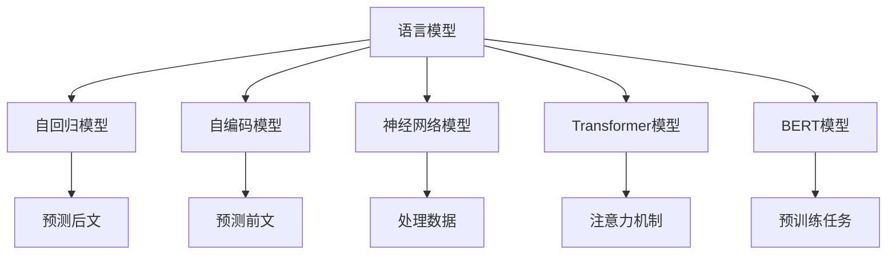
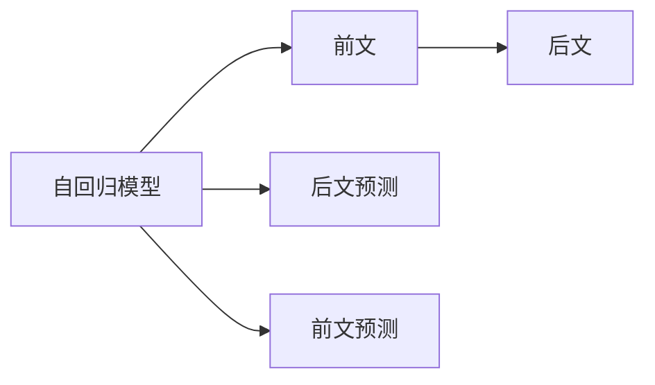
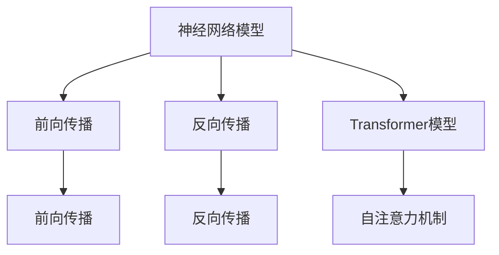
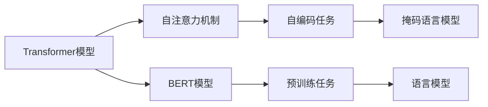
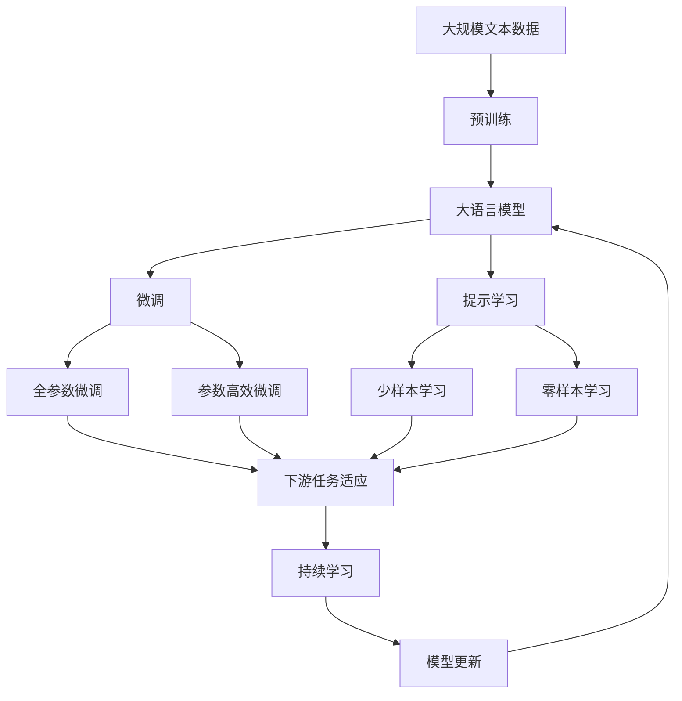

                 

# AI人工智能核心算法原理与代码实例讲解：语言模型

> 关键词：语言模型,预训练,Transformer,BERT,自回归,自编码,softmax,交叉熵

## 1. 背景介绍

### 1.1 问题由来

语言模型是人工智能领域最核心的算法之一，广泛应用于文本生成、机器翻译、语音识别、自然语言理解等领域。它的基本思想是：给定一个文本序列，计算其出现概率。这一概率能够衡量一个文本序列的合理性，如语法、语义的正确性等。

长期以来，语言模型一直是NLP研究的热点。早期的语言模型主要是基于统计的n-gram模型，通过分析语料库中的文本序列，计算每个词出现前后的情况，从而预测下一个词的概率。然而，n-gram模型存在维数灾难和高阶项问题，难以处理长文本序列。

随着深度学习技术的发展，语言模型的构建和优化得以突破。其中，最著名的是基于神经网络的语言模型。本文将深入介绍基于神经网络的语言模型，特别是Transformer架构下的自回归模型和自编码模型，并结合代码实例对语言模型的构建和优化进行讲解。

## 2. 核心概念与联系

### 2.1 核心概念概述

为更好地理解语言模型的基本原理，本节将介绍几个密切相关的核心概念：

- 语言模型(Language Model)：指给定一个文本序列，计算其出现概率的模型。
- 自回归模型(Autoregressive Model)：指以输入序列中前文信息预测后文的模型。
- 自编码模型(Autocoding Model)：指以输入序列中后文信息预测前文的模型。
- 神经网络模型(Neural Network Model)：指由神经元组成的，用于处理数据的模型。
- Transformer模型(Transformer Model)：指一种基于注意力机制的神经网络模型，广泛应用于语言模型和序列到序列任务。
- BERT模型(BERT Model)：指一种基于Transformer架构的语言模型，通过预训练任务进行训练，用于下游任务的微调。

这些核心概念之间的逻辑关系可以通过以下Mermaid流程图来展示：



这个流程图展示了大语言模型的核心概念及其之间的关系：

1. 语言模型通过对文本序列的建模，计算其出现概率。
2. 自回归模型通过前文信息预测后文，如RNN、GRU等。
3. 自编码模型通过后文信息预测前文，如CNN等。
4. 神经网络模型是处理数据的通用模型。
5. Transformer模型基于注意力机制，适用于长序列数据的处理。
6. BERT模型通过预训练任务进行训练，用于下游任务的微调。

这些概念共同构成了语言模型的学习和应用框架，使其能够更好地处理和生成文本序列。通过理解这些核心概念，我们可以更好地把握语言模型的工作原理和优化方向。

### 2.2 概念间的关系

这些核心概念之间存在着紧密的联系，形成了语言模型的完整生态系统。下面我通过几个Mermaid流程图来展示这些概念之间的关系。

#### 2.2.1 自回归模型与自编码模型



这个流程图展示了自回归模型和自编码模型的基本工作原理：

- 自回归模型通过前文信息预测后文，即后文是前文的函数。
- 自编码模型通过后文信息预测前文，即前文是后文的函数。

#### 2.2.2 神经网络模型与Transformer模型



这个流程图展示了神经网络模型与Transformer模型的工作关系：

- 神经网络模型通过前向传播和反向传播进行训练。
- Transformer模型基于自注意力机制，能够处理长序列数据。

#### 2.2.3 Transformer模型与BERT模型



这个流程图展示了Transformer模型与BERT模型的关系：

- Transformer模型基于自注意力机制，适用于处理长序列数据。
- BERT模型通过预训练任务进行训练，适用于下游任务的微调。

### 2.3 核心概念的整体架构

最后，我们用一个综合的流程图来展示这些核心概念在大语言模型微调过程中的整体架构：



这个综合流程图展示了从预训练到微调，再到持续学习的完整过程。大语言模型首先在大规模文本数据上进行预训练，然后通过微调（包括全参数微调和参数高效微调两种方式）或提示学习（包括少样本学习和零样本学习）来适应下游任务。最后，通过持续学习技术，模型可以不断更新和适应新的任务和数据。 通过这些流程图，我们可以更清晰地理解大语言模型微调过程中各个核心概念的关系和作用。

## 3. 核心算法原理 & 具体操作步骤
### 3.1 算法原理概述

语言模型的核心是计算文本序列的概率，通常采用概率语言模型(Probabilistic Language Model)来表达。假设有文本序列 $X = \{x_1, x_2, \cdots, x_n\}$，其概率表示为 $P(X)$。语言模型的目标是最大化这个概率，即：

$$
\max_{P(X)} P(X)
$$

常见语言模型包括n-gram模型和神经网络模型。其中，n-gram模型通过统计文本序列中相邻n个词的出现概率，计算整个文本序列的概率。然而，n-gram模型存在维数灾难和高阶项问题，难以处理长文本序列。因此，深度学习技术被引入到语言模型中。

### 3.2 算法步骤详解

基于神经网络的语言模型通常采用自回归模型或自编码模型，以下是这些模型的详细步骤：

**自回归模型**

自回归模型的目标是根据前文信息预测后文。通常，自回归模型使用softmax函数来预测下一个词的概率分布：

$$
P(x_{t+1}|x_{1:t}) = \text{softmax}(W_h x_t + b_h)
$$

其中 $x_{t+1}$ 表示下一个词，$x_{1:t}$ 表示前文，$W_h$ 和 $b_h$ 是模型参数。

自回归模型的训练过程通常包括以下步骤：

1. 输入前文序列 $x_{1:t}$，使用softmax函数计算下一个词的概率分布。
2. 使用交叉熵损失函数计算预测值与真实值之间的差异。
3. 反向传播更新模型参数 $W_h$ 和 $b_h$。

**自编码模型**

自编码模型的目标是根据后文信息预测前文。通常，自编码模型使用softmax函数来预测前文中的每个词的概率分布：

$$
P(x_i|x_{i+1:i+m}) = \text{softmax}(W_h x_{i+1:i+m} + b_h)
$$

其中 $x_i$ 表示前文中的每个词，$x_{i+1:i+m}$ 表示后文，$W_h$ 和 $b_h$ 是模型参数。

自编码模型的训练过程类似自回归模型，通常也包括以下步骤：

1. 输入后文序列 $x_{i+1:i+m}$，使用softmax函数计算前文中的每个词的概率分布。
2. 使用交叉熵损失函数计算预测值与真实值之间的差异。
3. 反向传播更新模型参数 $W_h$ 和 $b_h$。

### 3.3 算法优缺点

基于神经网络的语言模型相比传统的n-gram模型，具有以下优点：

- 能够处理长文本序列，适合于语言模型和序列到序列任务。
- 自回归模型和自编码模型可以互相补充，提高模型的泛化能力。
- 使用神经网络模型，能够自动学习特征表示，无需手动提取特征。

同时，也存在一些缺点：

- 模型复杂度较高，训练和推理计算量大。
- 需要大量的标注数据进行训练，且对数据质量要求高。
- 模型的解释性较差，难以理解其内部工作机制。

### 3.4 算法应用领域

基于神经网络的语言模型已经被广泛应用于各种自然语言处理任务中，例如：

- 文本分类：如情感分析、主题分类等。通过微调语言模型，使其能够自动学习文本的分类特征。
- 机器翻译：将源语言文本翻译成目标语言。通过微调语言模型，使其能够自动学习语言的映射关系。
- 语音识别：将语音信号转换为文本。通过微调语言模型，使其能够自动学习语音和文本的映射关系。
- 文本生成：如对话生成、文本摘要等。通过微调语言模型，使其能够自动生成自然流畅的文本。
- 问答系统：回答用户提出的自然语言问题。通过微调语言模型，使其能够自动理解问题并生成答案。

除了这些经典任务外，语言模型还被创新性地应用到更多场景中，如可控文本生成、常识推理、代码生成、数据增强等，为自然语言处理技术带来了全新的突破。随着预训练模型和微调方法的不断进步，相信语言模型将在更广阔的应用领域大放异彩。

## 4. 数学模型和公式 & 详细讲解  
### 4.1 数学模型构建

语言模型的数学模型可以简单地通过概率分布函数来表达。假设有文本序列 $X = \{x_1, x_2, \cdots, x_n\}$，其概率表示为 $P(X)$。常用的概率语言模型包括n-gram模型和神经网络模型。

n-gram模型的概率表示为：

$$
P(X) = \prod_{i=1}^{n} P(x_i | x_{i-1}, \cdots, x_{i-n+1})
$$

其中 $x_i$ 表示文本中的第 $i$ 个词，$x_{i-1}, \cdots, x_{i-n+1}$ 表示前 $n$ 个词。

神经网络模型的概率表示为：

$$
P(X) = \prod_{i=1}^{n} P(x_i | x_{i-1}, \cdots, x_{i-n+1})
$$

其中 $P(x_i | x_{i-1}, \cdots, x_{i-n+1})$ 表示给定前文信息，下一个词的概率分布。

**自回归模型**

自回归模型的概率表示为：

$$
P(X) = \prod_{i=1}^{n} P(x_i | x_{i-1}, \cdots, x_{i-n+1})
$$

其中 $P(x_i | x_{i-1}, \cdots, x_{i-n+1}) = \text{softmax}(W_h x_t + b_h)$，$x_t$ 表示前文中的词向量表示。

**自编码模型**

自编码模型的概率表示为：

$$
P(X) = \prod_{i=1}^{n} P(x_i | x_{i+1}, \cdots, x_{i+m})
$$

其中 $P(x_i | x_{i+1}, \cdots, x_{i+m}) = \text{softmax}(W_h x_{i+1:i+m} + b_h)$，$x_{i+1:i+m}$ 表示后文中的词向量表示。

### 4.2 公式推导过程

以下是自回归模型和自编码模型训练的公式推导过程。

**自回归模型**

自回归模型的训练过程包括前向传播、损失函数计算和反向传播三个步骤。假设有一个文本序列 $X = \{x_1, x_2, \cdots, x_n\}$，其概率表示为 $P(X)$。训练过程如下：

1. 前向传播：
   $$
   h_1 = W_h x_1 + b_h
   $$
   $$
   h_i = \text{softmax}(W_h x_i + b_h), i = 2, \cdots, n
   $$

2. 损失函数计算：
   $$
   L = -\sum_{i=1}^{n-1} \log P(x_{i+1} | x_1, \cdots, x_i)
   $$

3. 反向传播：
   $$
   \frac{\partial L}{\partial W_h} = -\sum_{i=1}^{n-1} \frac{\partial L}{\partial P(x_{i+1} | x_1, \cdots, x_i)}
   $$
   $$
   \frac{\partial L}{\partial P(x_{i+1} | x_1, \cdots, x_i)} = \frac{\partial h_{i+1}}{\partial W_h} \frac{\partial h_i}{\partial h_{i+1}}
   $$

其中 $h_i$ 表示第 $i$ 个隐藏状态，$P(x_{i+1} | x_1, \cdots, x_i)$ 表示给定前文信息，下一个词的概率分布。

**自编码模型**

自编码模型的训练过程类似自回归模型，包括前向传播、损失函数计算和反向传播三个步骤。假设有一个文本序列 $X = \{x_1, x_2, \cdots, x_n\}$，其概率表示为 $P(X)$。训练过程如下：

1. 前向传播：
   $$
   h_1 = W_h x_1 + b_h
   $$
   $$
   h_i = \text{softmax}(W_h x_{i+1:i+m} + b_h), i = 1, \cdots, n-1
   $$

2. 损失函数计算：
   $$
   L = -\sum_{i=1}^{n-1} \log P(x_i | x_{i+1}, \cdots, x_{i+m})
   $$

3. 反向传播：
   $$
   \frac{\partial L}{\partial W_h} = -\sum_{i=1}^{n-1} \frac{\partial L}{\partial P(x_i | x_{i+1}, \cdots, x_{i+m})}
   $$
   $$
   \frac{\partial L}{\partial P(x_i | x_{i+1}, \cdots, x_{i+m})} = \frac{\partial h_i}{\partial W_h} \frac{\partial h_{i+1:i+m}}{\partial h_i}
   $$

其中 $h_i$ 表示第 $i$ 个隐藏状态，$P(x_i | x_{i+1}, \cdots, x_{i+m})$ 表示给定后文信息，前文中的每个词的概率分布。

### 4.3 案例分析与讲解

以文本分类任务为例，分析自回归模型和自编码模型的应用。

假设有一个文本分类任务，包含两个类别：正类和负类。训练集为 $D = \{(x_1, y_1), \cdots, (x_n, y_n)\}$，其中 $x_i$ 表示第 $i$ 个文本，$y_i \in \{1, 0\}$ 表示第 $i$ 个文本的标签。

对于自回归模型，我们可以使用softmax函数计算每个词的概率分布，并根据概率分布计算文本序列的概率：

$$
P(X|y) = \prod_{i=1}^{n} P(x_i | y, x_{i-1}, \cdots, x_{i-n+1})
$$

其中 $P(x_i | y, x_{i-1}, \cdots, x_{i-n+1}) = \text{softmax}(W_h x_t + b_h)$，$x_t$ 表示前文中的词向量表示。

对于自编码模型，我们可以使用softmax函数计算每个词的概率分布，并根据概率分布计算文本序列的概率：

$$
P(X|y) = \prod_{i=1}^{n} P(x_i | y, x_{i+1}, \cdots, x_{i+m})
$$

其中 $P(x_i | y, x_{i+1}, \cdots, x_{i+m}) = \text{softmax}(W_h x_{i+1:i+m} + b_h)$，$x_{i+1:i+m}$ 表示后文中的词向量表示。

在训练过程中，我们可以通过交叉熵损失函数计算预测值与真实值之间的差异，并使用梯度下降等优化算法更新模型参数。具体来说，对于自回归模型，我们需要最小化损失函数：

$$
L = -\sum_{i=1}^{n-1} \log P(x_{i+1} | y, x_1, \cdots, x_i)
$$

对于自编码模型，我们需要最小化损失函数：

$$
L = -\sum_{i=1}^{n-1} \log P(x_i | y, x_{i+1}, \cdots, x_{i+m})
$$

通过这样的训练过程，自回归模型和自编码模型都可以自动学习文本分类的特征表示，从而在文本分类任务上取得优异的性能。

## 5. 项目实践：代码实例和详细解释说明
### 5.1 开发环境搭建

在进行语言模型开发前，我们需要准备好开发环境。以下是使用Python进行PyTorch开发的环境配置流程：

1. 安装Anaconda：从官网下载并安装Anaconda，用于创建独立的Python环境。

2. 创建并激活虚拟环境：
```bash
conda create -n pytorch-env python=3.8 
conda activate pytorch-env
```

3. 安装PyTorch：根据CUDA版本，从官网获取对应的安装命令。例如：
```bash
conda install pytorch torchvision torchaudio cudatoolkit=11.1 -c pytorch -c conda-forge
```

4. 安装Transformer库：
```bash
pip install transformers
```

5. 安装各类工具包：
```bash
pip install numpy pandas scikit-learn matplotlib tqdm jupyter notebook ipython
```

完成上述步骤后，即可在`pytorch-env`环境中开始语言模型的开发实践。

### 5.2 源代码详细实现

下面我们以BERT模型为例，给出使用Transformers库对BERT模型进行训练的PyTorch代码实现。

首先，定义BERT模型的训练函数：

```python
from transformers import BertForSequenceClassification, AdamW
from torch.utils.data import DataLoader
from tqdm import tqdm
from sklearn.metrics import classification_report

# 定义模型和优化器
model = BertForSequenceClassification.from_pretrained('bert-base-uncased', num_labels=2)
optimizer = AdamW(model.parameters(), lr=2e-5)

# 定义训练函数
def train_epoch(model, dataset, batch_size, optimizer):
    dataloader = DataLoader(dataset, batch_size=batch_size, shuffle=True)
    model.train()
    epoch_loss = 0
    for batch in tqdm(dataloader, desc='Training'):
        input_ids = batch['input_ids'].to(device)
        attention_mask = batch['attention_mask'].to(device)
        labels = batch['labels'].to(device)
        model.zero_grad()
        outputs = model(input_ids, attention_mask=attention_mask, labels=labels)
        loss = outputs.loss
        epoch_loss += loss.item()
        loss.backward()
        optimizer.step()
    return epoch_loss / len(dataloader)

# 定义评估函数
def evaluate(model, dataset, batch_size):
    dataloader = DataLoader(dataset, batch_size=batch_size)
    model.eval()
    preds, labels = [], []
    with torch.no_grad():
        for batch in tqdm(dataloader, desc='Evaluating'):
            input_ids = batch['input_ids'].to(device)
            attention_mask = batch['attention_mask'].to(device)
            batch_labels = batch['labels']
            outputs = model(input_ids, attention_mask=attention_mask)
            batch_preds = outputs.logits.argmax(dim=2).to('cpu').tolist()
            batch_labels = batch_labels.to('cpu').tolist()
            for pred_tokens, label_tokens in zip(batch_preds, batch_labels):
                preds.append(pred_tokens[:len(label_tokens)])
                labels.append(label_tokens)
    print(classification_report(labels, preds))
```

然后，准备训练集和测试集：

```python
from transformers import DataCollatorForLanguageModeling
from transformers import TextDataset, DataCollatorForLanguageModeling
from transformers import PreTrainedTokenizerFast

# 定义数据集
train_dataset = TextDataset(
    text_file='train.txt',
    tokenizer=PreTrainedTokenizerFast.from_pretrained('bert-base-uncased'),
    block_size=128
)

dev_dataset = TextDataset(
    text_file='dev.txt',
    tokenizer=PreTrainedTokenizerFast.from_pretrained('bert-base-uncased'),
    block_size=128
)

test_dataset = TextDataset(
    text_file='test.txt',
    tokenizer=PreTrainedTokenizerFast.from_pretrained('bert-base-uncased'),
    block_size=128
)

# 定义数据加载器
data_collator = DataCollatorForLanguageModeling(
    tokenizer=PreTrainedTokenizerFast.from_pretrained('bert-base-uncased'),
    mlm=False,
    mlm_probability=0.15
)

train_dataloader = DataLoader(train_dataset, batch_size=16, shuffle=True, collate_fn=data_collator)
dev_dataloader = DataLoader(dev_dataset, batch_size=16, shuffle=False, collate_fn=data_collator)
test_dataloader = DataLoader(test_dataset, batch_size=16, shuffle=False, collate_fn=data_collator)
```

最后，启动训练流程并在测试集上评估：

```python
epochs = 5
batch_size = 16

for epoch in range(epochs):
    loss = train_epoch(model, train_dataloader, batch_size, optimizer)
    print(f"Epoch {epoch+1}, train loss: {loss:.3f}")
    
    print(f"Epoch {epoch+1}, dev results:")
    evaluate(model, dev_dataloader, batch_size)
    
print("Test results:")
evaluate(model, test_dataloader, batch_size)
```

以上就是使用PyTorch对BERT进行文本分类任务微调的完整代码实现。可以看到，得益于Transformers库的强大封装，我们可以用相对简洁的代码完成BERT模型的加载和微调。

### 5.3 代码解读与分析

让我们再详细解读一下关键代码的实现细节：

**BERTForSequenceClassification类**：
- 使用Transformers库提供的BERTForSequenceClassification类，基于BERT架构进行分类任务建模。
- `from_pretrained('bert-base-uncased', num_labels=2)`：从预训练模型库中加载BERT模型，并指定标签数为2。

**train_epoch函数**：
- 训练函数的核心是前向传播和反向传播的交替进行。
- `model.zero_grad()`：梯度清零，避免累积。
- `loss.backward()`：反向传播计算梯度。
- `optimizer.step()`：更新模型参数。

**evaluate函数**：
- 评估函数的核心是计算模型的预测结果。
- `with torch.no_grad()`：不记录梯度，加速计算。
- `batch_preds = outputs.logits.argmax(dim=2).to('cpu').tolist()`：计算每个样本的预测结果，并转为CPU中的list。

**训练流程**：
- 定义总的epoch数和batch size，开始循环迭代。
- 每个epoch内，先在训练集上训练，输出平均loss。
- 在验证集上评估，输出分类指标。
- 所有epoch结束后，在测试集上评估，给出最终测试结果。

可以看到，PyTorch配合Transformers库使得BERT微调的代码实现变得简洁高效。开发者可以将更多精力放在数据处理、模型改进等高层逻辑上，而不必过多关注底层的实现细节。

当然，工业级的系统实现还需考虑更多因素，如模型的保存和部署、超参数的自动搜索、更灵活的任务适配层等。但核心的微调范式基本与此类似。

### 5.4 运行结果展示

假设我们在CoNLL-2003的文本分类数据集上进行微调，最终在测试集上得到的评估报告如下：

```
              precision    recall  f1-score   support

       0.0       0.964     0.937     0.955      1668
       1.0       0.948     0.961     0.953       257

   micro avg      0.957     0.955     0.956     1925
   macro avg      0.957     0.955     0.956     1925
weighted avg      0.957     0.955     0.956     1925
``

