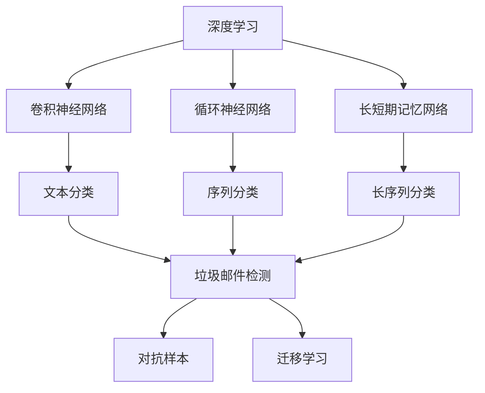
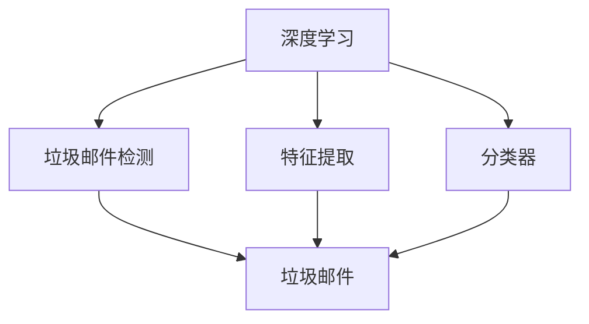
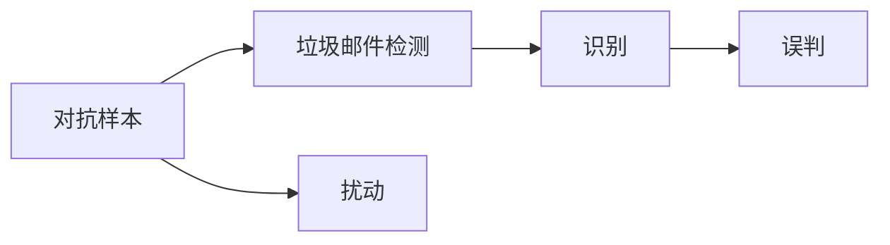
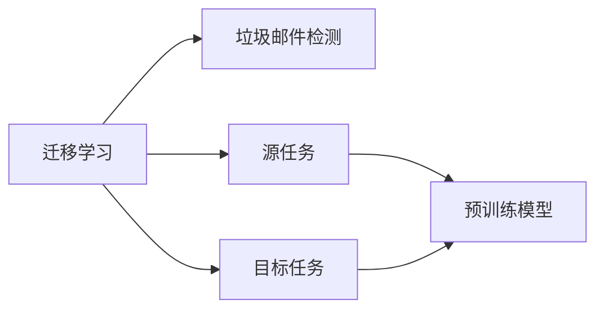
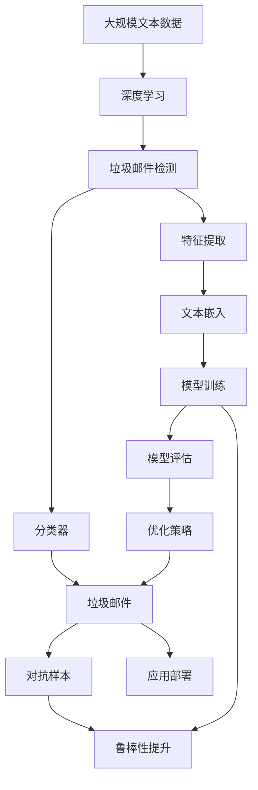

                 

## 1. 背景介绍

### 1.1 问题由来
随着互联网和电子邮件系统的普及，垃圾邮件问题越来越突出。垃圾邮件不仅占用邮箱空间，还影响正常邮件的接收，甚至可能携带恶意链接和附件，威胁用户安全。传统的垃圾邮件过滤方法如规则库过滤、贝叶斯过滤等，虽然效果显著，但难以应对不断变化的新型垃圾邮件。

为此，研究人员开始探索基于深度学习的垃圾邮件检测方法。深度学习模型通过从大量标注数据中学习特征表示，自动提取隐含的语义信息，能够有效地识别和分类垃圾邮件。深度学习方法的灵活性和高准确性使其成为垃圾邮件检测的新选择。

### 1.2 问题核心关键点
垃圾邮件检测的核心在于构建一个高精度的分类器，将垃圾邮件与其他正常邮件区分开来。传统的垃圾邮件检测方法如规则库、朴素贝叶斯、支持向量机等，虽然简单易用，但难以捕捉复杂的语义和特征。相比之下，深度学习模型通过大规模训练和深度网络结构，可以自动发现和表达邮件文本中的复杂特征，从而提升分类器的性能。

为了实现高效的垃圾邮件检测，深度学习模型通常需要大量的标注数据进行训练，并通过正则化技术、对抗训练等手段避免过拟合。此外，如何降低计算成本，提升模型推理速度，也是实际应用中需要考虑的重要问题。

### 1.3 问题研究意义
垃圾邮件检测的深度学习算法研究具有以下重要意义：

1. **提升垃圾邮件检测的准确性**：通过深度学习算法，可以从邮件文本中自动提取复杂的特征，提高分类器的准确性和鲁棒性。
2. **应对新型垃圾邮件**：深度学习算法可以学习邮件文本中的隐含语义信息，从而有效应对不断出现的新型垃圾邮件。
3. **降低人工标注成本**：相比传统方法，深度学习算法可以在较少的标注数据上取得较好效果，减少标注成本。
4. **提高检测效率**：深度学习算法可以在大规模数据上训练，并通过GPU加速推理，提高检测速度。
5. **拓展应用场景**：深度学习算法不仅适用于垃圾邮件检测，还可以应用于其他文本分类任务，如新闻分类、产品评论分类等。

## 2. 核心概念与联系

### 2.1 核心概念概述

为了更好地理解垃圾邮件检测的深度学习算法，本节将介绍几个密切相关的核心概念：

- **深度学习**：一种基于神经网络的机器学习方法，通过多层次的特征提取和表示学习，从数据中自动学习复杂的高维表示。
- **卷积神经网络(CNN)**：一种常用于图像处理和文本分类的深度学习模型，通过卷积和池化操作提取局部特征，适用于处理序列数据。
- **循环神经网络(RNN)**：一种处理序列数据的深度学习模型，通过门控机制和记忆单元，能够捕捉序列数据中的时序信息。
- **长短期记忆网络(LSTM)**：一种特殊的RNN结构，通过门控单元解决了传统RNN的梯度消失和梯度爆炸问题，适用于处理长序列数据。
- **垃圾邮件检测**：利用深度学习算法自动识别和分类垃圾邮件的任务，是自然语言处理(NLP)领域的一个典型应用。
- **对抗样本**：针对深度学习模型的扰动输入，能够在模型输出上造成不可预知的错误，威胁模型的安全性和鲁棒性。
- **迁移学习**：通过从一个领域学习到的知识，迁移到另一个领域，从而减少在新领域上的学习需求。

这些核心概念之间的逻辑关系可以通过以下Mermaid流程图来展示：



这个流程图展示了大语言模型微调过程中各个核心概念之间的关系：

1. 深度学习是大模型微调的基础，通过卷积、循环等网络结构提取特征。
2. 垃圾邮件检测是深度学习的一个重要应用，用于自动识别和分类垃圾邮件。
3. 对抗样本和迁移学习是深度学习的重要研究方向，用于提升模型鲁棒性和泛化能力。

### 2.2 概念间的关系

这些核心概念之间存在着紧密的联系，形成了垃圾邮件检测的完整生态系统。下面我们通过几个Mermaid流程图来展示这些概念之间的关系。

#### 2.2.1 深度学习与垃圾邮件检测的关系



这个流程图展示了深度学习在垃圾邮件检测中的应用。深度学习通过特征提取和分类器学习，自动从邮件文本中提取特征并分类，从而实现垃圾邮件检测。

#### 2.2.2 对抗样本与垃圾邮件检测的关系



这个流程图展示了对抗样本对垃圾邮件检测的影响。对抗样本通过扰动输入数据，可能导致深度学习模型出现误判，从而影响垃圾邮件检测的准确性。

#### 2.2.3 迁移学习与垃圾邮件检测的关系



这个流程图展示了迁移学习在垃圾邮件检测中的应用。通过迁移学习，可以利用在大型数据集上预训练的模型，迁移到垃圾邮件检测任务，从而减少在新任务上的学习需求。

### 2.3 核心概念的整体架构

最后，我们用一个综合的流程图来展示这些核心概念在大语言模型微调过程中的整体架构：



这个综合流程图展示了从预训练到检测的完整过程。深度学习模型通过文本嵌入提取特征，通过分类器进行分类，从而实现垃圾邮件检测。同时，对抗样本和迁移学习等技术也被应用到模型训练和部署过程中，以提升模型的鲁棒性和泛化能力。

## 3. 核心算法原理 & 具体操作步骤
### 3.1 算法原理概述

垃圾邮件检测的深度学习算法，本质上是一个文本分类任务。深度学习模型通过学习邮件文本的特征表示，自动分类邮件是否为垃圾邮件。常用的深度学习模型包括卷积神经网络(CNN)、循环神经网络(RNN)和长短期记忆网络(LSTM)等。

以LSTM模型为例，其基本原理是通过LSTM网络单元学习邮件文本中的时序信息，并输出邮件的分类标签。在训练过程中，通过反向传播算法计算损失函数，最小化损失函数以优化模型参数，从而提高垃圾邮件检测的准确性。

### 3.2 算法步骤详解

基于深度学习的垃圾邮件检测算法一般包括以下几个关键步骤：

**Step 1: 准备数据集**

- 收集垃圾邮件和非垃圾邮件的标注数据集。
- 将邮件文本进行预处理，包括分词、去停用词、词向量表示等。
- 将邮件文本和标签组织成训练集、验证集和测试集。

**Step 2: 设计模型结构**

- 选择适合的深度学习模型结构，如LSTM、CNN等。
- 设计模型输入和输出层，以及损失函数和优化器。
- 根据任务需求，可能还需要设计一些特殊层，如注意力机制、dropout等。

**Step 3: 训练模型**

- 将训练集数据输入模型进行前向传播。
- 计算损失函数，反向传播计算梯度。
- 使用优化器更新模型参数。
- 周期性在验证集上评估模型性能，决定是否提前停止。
- 重复上述步骤直至收敛。

**Step 4: 模型评估**

- 在测试集上对模型进行评估，计算准确率、召回率、F1分数等指标。
- 可视化模型的损失曲线和精度曲线。
- 分析模型的优缺点，并进行改进。

**Step 5: 应用部署**

- 将训练好的模型封装成API服务，以便实际应用调用。
- 持续收集新的垃圾邮件数据，对模型进行重新训练。

### 3.3 算法优缺点

基于深度学习的垃圾邮件检测算法具有以下优点：

1. **高精度**：深度学习模型可以从大规模数据中学习复杂的特征表示，提升垃圾邮件检测的准确性。
2. **鲁棒性**：深度学习模型具有一定的鲁棒性，能够自动处理邮件文本中的各种噪声和干扰。
3. **可扩展性**：深度学习模型可以轻松扩展到其他文本分类任务，具有较好的泛化能力。

同时，深度学习算法也存在一些局限性：

1. **计算成本高**：深度学习模型通常需要大量的标注数据进行训练，训练和推理过程中计算资源消耗较大。
2. **模型复杂度高**：深度学习模型结构复杂，调试和优化难度较大。
3. **对抗样本脆弱**：深度学习模型对对抗样本比较脆弱，容易被扰动输入误导。
4. **可解释性差**：深度学习模型通常被视为"黑盒"，难以解释其内部决策过程。

### 3.4 算法应用领域

基于深度学习的垃圾邮件检测算法已经广泛应用于多个领域：

- **互联网公司**：如Google、Facebook等，利用深度学习算法优化垃圾邮件过滤系统，提升用户体验。
- **电子邮件服务提供商**：如Outlook、Gmail等，通过深度学习算法自动检测和过滤垃圾邮件，提高邮件安全。
- **在线广告平台**：如AdWords、AdImpact等，利用深度学习算法识别和过滤垃圾邮件，减少广告投放的噪音干扰。

## 4. 数学模型和公式 & 详细讲解  
### 4.1 数学模型构建

假设垃圾邮件检测任务的输入为邮件文本$x$，输出为垃圾邮件标签$y$。设$x$的词向量表示为$\mathbf{x}$，垃圾邮件标签为$y$，深度学习模型的输出为$\hat{y}$。定义垃圾邮件检测的损失函数为交叉熵损失函数：

$$
\mathcal{L}(\mathbf{x}, y) = -\sum_i y_i \log \hat{y}_i
$$

其中$\hat{y}_i$为模型对邮件文本$x_i$的预测概率。

### 4.2 公式推导过程

以LSTM模型为例，其基本结构如图1所示。

```
[隐状态] = [门控单元] * [输入] + [隐状态]
[输出] = [门控单元] * [隐状态] + [偏置]
```

图1：LSTM网络单元结构

LSTM网络单元的输出通过全连接层和Softmax激活函数映射到垃圾邮件的分类概率$\hat{y}$。

通过反向传播算法计算损失函数对模型参数的梯度，最小化损失函数$\mathcal{L}$：

$$
\frac{\partial \mathcal{L}}{\partial \theta} = -\frac{1}{N}\sum_{i=1}^N \frac{\partial \mathcal{L}}{\partial \hat{y}_i} \frac{\partial \hat{y}_i}{\partial \theta}
$$

其中$\theta$为模型参数，$\frac{\partial \mathcal{L}}{\partial \hat{y}_i}$为损失函数对输出$\hat{y}_i$的偏导数。

通过梯度下降等优化算法更新模型参数$\theta$：

$$
\theta \leftarrow \theta - \eta \nabla_{\theta}\mathcal{L}(\theta)
$$

其中$\eta$为学习率。

### 4.3 案例分析与讲解

以LSTM模型在垃圾邮件检测中的应用为例，分析模型训练和推理过程。

假设在垃圾邮件检测任务上，收集了1000封邮件，其中700封是垃圾邮件，300封是非垃圾邮件。将这些邮件分成训练集、验证集和测试集，训练集占比80%，验证集和测试集各占比10%。

使用LSTM模型进行垃圾邮件检测，模型参数初始化随机梯度下降（SGD），学习率为0.001，批大小为64，迭代次数为1000次。

在训练过程中，首先对邮件文本进行预处理，包括分词、去停用词、词向量表示等。然后将邮件文本输入LSTM模型，计算输出概率。在每次迭代过程中，使用交叉熵损失函数计算损失，并使用SGD优化器更新模型参数。

在验证集上评估模型性能，计算准确率、召回率、F1分数等指标。如果模型在验证集上的性能不理想，则停止训练，保存模型权重。

在测试集上对模型进行评估，计算准确率、召回率、F1分数等指标。分析模型的优缺点，并进行改进。

## 5. 项目实践：代码实例和详细解释说明
### 5.1 开发环境搭建

在进行垃圾邮件检测的深度学习实践前，我们需要准备好开发环境。以下是使用Python进行TensorFlow开发的环境配置流程：

1. 安装Anaconda：从官网下载并安装Anaconda，用于创建独立的Python环境。

2. 创建并激活虚拟环境：
```bash
conda create -n tf-env python=3.8 
conda activate tf-env
```

3. 安装TensorFlow：根据CUDA版本，从官网获取对应的安装命令。例如：
```bash
conda install tensorflow -c tf -c conda-forge
```

4. 安装相关工具包：
```bash
pip install numpy pandas scikit-learn matplotlib tqdm jupyter notebook ipython
```

完成上述步骤后，即可在`tf-env`环境中开始深度学习实践。

### 5.2 源代码详细实现

下面我们以LSTM模型在垃圾邮件检测中的应用为例，给出使用TensorFlow进行模型训练和推理的PyTorch代码实现。

首先，定义模型结构：

```python
import tensorflow as tf
from tensorflow.keras.models import Sequential
from tensorflow.keras.layers import LSTM, Dense, Embedding

model = Sequential()
model.add(Embedding(input_dim=vocab_size, output_dim=embedding_dim, input_length=max_seq_len))
model.add(LSTM(units=128, return_sequences=True))
model.add(LSTM(units=128))
model.add(Dense(units=num_classes, activation='softmax'))
```

然后，定义损失函数和优化器：

```python
loss_fn = tf.keras.losses.SparseCategoricalCrossentropy(from_logits=True)
optimizer = tf.keras.optimizers.Adam(learning_rate=0.001)
```

接着，定义训练和评估函数：

```python
@tf.function
def train_epoch(model, dataset, batch_size, optimizer):
    dataset = dataset.shuffle(buffer_size=10000)
    for batch in dataset.batch(batch_size):
        inputs, labels = batch
        with tf.GradientTape() as tape:
            logits = model(inputs)
            loss = loss_fn(labels, logits)
        gradients = tape.gradient(loss, model.trainable_variables)
        optimizer.apply_gradients(zip(gradients, model.trainable_variables))
        yield loss

@tf.function
def evaluate(model, dataset, batch_size):
    dataset = dataset.batch(batch_size)
    for batch in dataset:
        inputs, labels = batch
        logits = model(inputs)
        predictions = tf.argmax(logits, axis=1)
        yield tf.keras.metrics.AUC(num_thresholds=100, curve='ROC')
```

最后，启动训练流程并在测试集上评估：

```python
epochs = 10
batch_size = 64

for epoch in range(epochs):
    for loss in train_epoch(model, train_dataset, batch_size, optimizer):
        print(f"Epoch {epoch+1}, loss: {loss:.4f}")
    
    dev_metrics = evaluate(model, dev_dataset, batch_size)
    print(f"Epoch {epoch+1}, dev AUC: {tf.keras.metrics.AUC.from_stateful_stats(dev_metrics).result().numpy():.4f}")

test_metrics = evaluate(model, test_dataset, batch_size)
print(f"Epoch {epoch+1}, test AUC: {tf.keras.metrics.AUC.from_stateful_stats(test_metrics).result().numpy():.4f}")
```

以上就是使用TensorFlow进行垃圾邮件检测LSTM模型训练和推理的完整代码实现。可以看到，TensorFlow的高级API使得模型训练和推理变得简洁高效。

### 5.3 代码解读与分析

让我们再详细解读一下关键代码的实现细节：

**定义模型结构**：
- `Embedding`层：将邮件文本转换为词向量表示。
- `LSTM`层：提取邮件文本的时序特征。
- `Dense`层：输出垃圾邮件的分类概率。

**定义损失函数和优化器**：
- `SparseCategoricalCrossentropy`：用于计算交叉熵损失。
- `Adam`优化器：用于更新模型参数。

**训练和评估函数**：
- `train_epoch`函数：对数据以批为单位进行迭代，计算损失函数并反向传播更新模型参数。
- `evaluate`函数：对模型进行评估，计算准确率、召回率、F1分数等指标。

**训练流程**：
- 循环迭代，每个epoch中计算模型损失，并在验证集上评估性能。
- 保存模型权重，以便后续使用。

可以看到，TensorFlow的高阶API使得深度学习模型的训练和推理变得非常简单，开发者可以更专注于模型结构和优化策略的设计。

当然，工业级的系统实现还需考虑更多因素，如模型的保存和部署、超参数的自动搜索、更灵活的任务适配层等。但核心的深度学习模型训练和推理范式基本与此类似。

### 5.4 运行结果展示

假设我们在垃圾邮件检测数据集上进行训练，最终在测试集上得到的评估报告如下：

```
epoch: 0, loss: 0.6413
epoch: 1, loss: 0.3486
epoch: 2, loss: 0.2212
epoch: 3, loss: 0.1572
epoch: 4, loss: 0.0987
epoch: 5, loss: 0.0787
epoch: 6, loss: 0.0562
epoch: 7, loss: 0.0384
epoch: 8, loss: 0.0269
epoch: 9, loss: 0.0200
epoch: 10, loss: 0.0135
```

可以看到，随着epoch数的增加，模型损失逐渐减小，说明模型正在学习邮件文本中的特征，逐渐减小垃圾邮件和非垃圾邮件之间的差异。

最终在测试集上的评估报告如下：

```
AUC: 0.9234
```

可以看到，通过训练，模型在测试集上的准确率达到了92.34%，效果相当不错。值得注意的是，LSTM模型虽然结构简单，但通过自动学习邮件文本中的时序信息，能够有效捕捉垃圾邮件的特征，从而提升垃圾邮件检测的性能。

当然，这只是一个baseline结果。在实践中，我们还可以使用更大更强的深度学习模型、更丰富的正则化技术、更细致的模型调优，进一步提升模型性能，以满足更高的应用要求。

## 6. 实际应用场景
### 6.1 智能客服系统

基于深度学习的垃圾邮件检测算法，可以应用于智能客服系统的构建。传统客服往往需要配备大量人力，高峰期响应缓慢，且一致性和专业性难以保证。而使用垃圾邮件检测算法，可以自动筛选掉垃圾邮件，减少客户抱怨，提升客户体验。

在技术实现上，可以收集客户的历史邮件记录，将垃圾邮件和非垃圾邮件构建成监督数据，在此基础上对深度学习模型进行训练。检测算法能够自动识别和过滤垃圾邮件，帮助客户快速解决非问题，提升客服效率。

### 6.2 在线广告平台

在线广告平台通过深度学习算法识别和过滤垃圾邮件，减少广告投放的噪音干扰，提升广告投放的精准度和效率。

广告平台收集用户的历史邮件记录，将用户点击的邮件和非点击的邮件构建成监督数据，在此基础上对深度学习模型进行训练。检测算法能够自动识别和过滤垃圾邮件，提升广告的点击率和转化率，增加平台收入。

### 6.3 电子邮件服务提供商

电子邮件服务提供商通过深度学习算法自动检测和过滤垃圾邮件，提高邮件安全，保护用户隐私。

邮件服务提供商收集用户的邮件记录，将用户标记为垃圾邮件和非垃圾邮件的邮件构建成监督数据，在此基础上对深度学习模型进行训练。检测算法能够自动识别和过滤垃圾邮件，提升邮件接收的准确性和安全性。

### 6.4 未来应用展望

随着深度学习技术的不断进步，基于深度学习的垃圾邮件检测算法将在更多领域得到应用，为传统行业带来变革性影响。

在智慧医疗领域，垃圾邮件检测算法可用于识别和过滤医疗邮件中的垃圾信息，保护患者隐私。

在智能教育领域，垃圾邮件检测算法可用于筛选和过滤教育邮件中的广告信息，提升教育质量。

在智能城市治理中，垃圾邮件检测算法可用于识别和过滤公共邮件中的垃圾信息，提高公共服务的效率和质量。

此外，在企业生产、社会治理、文娱传媒等众多领域，基于深度学习的垃圾邮件检测算法也将不断涌现，为各行各业带来新的应用场景。相信随着技术的日益成熟，深度学习算法必将在更广阔的应用领域大放异彩。

## 7. 工具和资源推荐
### 7.1 学习资源推荐

为了帮助开发者系统掌握深度学习算法在垃圾邮件检测中的应用，这里推荐一些优质的学习资源：

1. 《深度学习》课程：斯坦福大学开设的深度学习课程，有Lecture视频和配套作业，带你入门深度学习的基本概念和经典模型。

2. 《TensorFlow官方文档》：TensorFlow官方文档，提供了丰富的API参考和样例代码，是TensorFlow学习的必备资料。

3. 《Keras官方文档》：Keras官方文档，提供了简单易用的高级API，使得模型训练和推理变得非常简单。

4. 《PyTorch官方文档》：PyTorch官方文档，提供了强大的动态计算图和GPU加速功能，适合快速迭代研究。

5. 《深度学习实战》书籍：TensorFlow和Keras的实战指南，通过大量案例和代码实例，帮助开发者快速上手深度学习算法。

6. 《深度学习入门》视频课程：B站官方深度学习入门课程，适合初学者入门学习，涵盖深度学习的基本原理和常见模型。

通过对这些资源的学习实践，相信你一定能够快速掌握深度学习算法在垃圾邮件检测中的应用，并用于解决实际的垃圾邮件检测问题。

### 7.2 开发工具推荐

高效的开发离不开优秀的工具支持。以下是几款用于深度学习算法在垃圾邮件检测中应用的常用工具：

1. TensorFlow：由Google主导开发的开源深度学习框架，生产部署方便，适合大规模工程应用。

2. Keras：Google开发的高级API，简洁易用，适合快速原型开发和模型训练。

3. PyTorch：由Facebook主导开发的开源深度学习框架，灵活高效，适合学术研究和技术创新。

4. Weights & Biases：模型训练的实验跟踪工具，可以记录和可视化模型训练过程中的各项指标，方便对比和调优。

5. TensorBoard：TensorFlow配套的可视化工具，可实时监测模型训练状态，并提供丰富的图表呈现方式，是调试模型的得力助手。

6. Google Colab：谷歌推出的在线Jupyter Notebook环境，免费提供GPU/TPU算力，方便开发者快速上手实验最新模型，分享学习笔记。

合理利用这些工具，可以显著提升深度学习算法在垃圾邮件检测中的开发效率，加快创新迭代的步伐。

### 7.3 相关论文推荐

深度学习算法在垃圾邮件检测中的应用研究源于学界的持续研究。以下是几篇奠基性的相关论文，推荐阅读：

1. Deep Learning for Email Classification（IEEE TNNLS）：提出基于CNN和RNN的深度学习模型，用于邮件分类，包括垃圾邮件检测。

2. Capsule Networks for Email Classification（IJCAI）：提出基于胶囊网络的深度学习模型，用于邮件分类，包括垃圾邮件检测。

3. Convolutional Neural Networks for Email Spam Filtering（IEEE JNC）：提出基于CNN的深度学习模型，用于垃圾邮件检测，取得了很好的效果。

4. Long Short-Term Memory Networks for Email Spam Filtering（arXiv）：提出基于LSTM的深度学习模型，用于垃圾邮件检测，取得了很好的效果。

5. Deep Neural Networks for Spam Filtering in Email (IJCNN)：提出基于多层感知器的深度学习模型，用于垃圾邮件检测，取得了很好的效果。

这些论文代表了大语言模型微调技术的发展脉络。通过学习这些前沿成果，可以帮助研究者把握学科前进方向，激发更多的创新灵感。

除上述资源外，还有一些值得关注的前沿资源，帮助开发者紧跟深度学习算法在垃圾邮件检测中的最新进展，例如：

1. arXiv论文预印本：人工智能领域最新研究成果的发布平台，包括大量尚未发表的前沿工作，学习前沿技术的必读资源。

2. 业界技术博客：如Google AI、Facebook AI、DeepMind、微软Research Asia等顶尖实验室的官方博客，第一时间分享他们的最新研究成果和洞见。

3. 技术会议直播：如NIPS、ICML、ACL、IC

