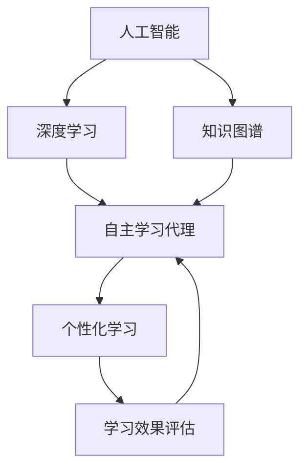

                 

# AI人工智能深度学习算法：在教育培训中运用自主学习代理

> 关键词：
1. 人工智能
2. 深度学习
3. 自主学习
4. 代理
5. 教育培训
6. 个性化学习
7. 知识图谱

## 1. 背景介绍

### 1.1 问题由来

随着人工智能技术的飞速发展，尤其是深度学习在教育培训领域的广泛应用，越来越多的教育机构开始尝试将AI技术引入到课堂教学中。然而，如何高效地将AI技术应用到教育培训中，特别是如何在教育培训中实现个性化学习，成为了一个亟待解决的问题。

在传统的教育培训中，每个学生的学习能力和需求各不相同，传统的“一刀切”式教学方法难以满足不同学生的需求，导致部分学生学习效率低下，甚至产生厌学情绪。而人工智能技术的引入，尤其是深度学习算法和自主学习代理技术，为个性化学习提供了新的可能。

### 1.2 问题核心关键点

要实现个性化学习，核心在于如何构建一个智能的自主学习代理，该代理能够根据学生的学习情况，动态调整学习计划，提供个性化的学习内容和推荐。这个代理需要具备以下能力：

1. **数据处理能力**：能够高效地处理和分析学生的学习数据，包括学习记录、成绩、行为等。
2. **模型训练能力**：能够基于历史学习数据和行为数据，训练出适于个性化学习的深度学习模型。
3. **学习计划生成能力**：能够根据学生的学习数据和行为数据，生成个性化的学习计划，包括学习内容、学习顺序、学习时长等。
4. **学习内容推荐能力**：能够根据学生的学习状态和偏好，推荐适于该学生的学习内容。
5. **学习效果评估能力**：能够实时评估学生的学习效果，并根据评估结果调整学习计划。

### 1.3 问题研究意义

实现个性化学习，不仅可以显著提高学生的学习效率和兴趣，还能为教师提供教学参考，优化教学资源配置。同时，人工智能技术的应用，也能推动教育培训行业的数字化转型，提升整体教育质量。

## 2. 核心概念与联系

### 2.1 核心概念概述

在教育培训中应用人工智能深度学习算法，核心在于构建一个智能的自主学习代理。这个代理可以基于学生的学习数据，通过深度学习算法，生成个性化的学习计划和推荐。以下是核心概念的介绍：

- **人工智能（AI）**：利用算法模拟人类智能行为，解决复杂问题。
- **深度学习（DL）**：通过多层神经网络，自动学习数据特征，从而进行分类、预测等任务。
- **自主学习代理**：基于深度学习算法，能够根据学生学习数据，自动生成个性化学习计划和推荐的学习内容。
- **个性化学习**：根据学生个体差异，定制个性化的学习内容和计划。
- **知识图谱**：用于构建和查询知识的结构化表示，辅助深度学习模型的训练和推荐。

### 2.2 概念间的关系

以上核心概念之间有着紧密的联系，形成了一个完整的教育培训AI系统。以下是概念间关系的Mermaid流程图：



这个流程图展示了各个概念之间的关系：人工智能通过深度学习算法构建自主学习代理，代理根据个性化学习需求生成学习计划和推荐内容，同时通过知识图谱辅助模型训练和推荐，最终通过学习效果评估不断优化学习计划。

## 3. 核心算法原理 & 具体操作步骤

### 3.1 算法原理概述

自主学习代理的构建，主要基于深度学习算法。其核心原理是通过多层神经网络，学习学生学习数据和行为数据，从而生成个性化的学习计划和推荐内容。

具体而言，自主学习代理由以下部分组成：

1. **数据预处理模块**：用于处理和分析学生的学习数据和行为数据。
2. **模型训练模块**：基于处理后的数据，训练深度学习模型。
3. **学习计划生成模块**：根据训练好的模型，生成个性化的学习计划。
4. **学习内容推荐模块**：根据学习计划和学生偏好，推荐适于学生的学习内容。
5. **学习效果评估模块**：实时评估学生的学习效果，并根据评估结果调整学习计划。

### 3.2 算法步骤详解

以下是构建自主学习代理的详细步骤：

1. **数据收集与预处理**：
   - 收集学生的学习数据和行为数据，包括学习记录、成绩、行为数据等。
   - 对数据进行清洗和标准化处理，如去除异常值、归一化等。

2. **模型训练**：
   - 设计合适的深度学习模型，如循环神经网络（RNN）、长短期记忆网络（LSTM）、注意力机制等。
   - 将处理后的数据输入模型进行训练，优化模型参数。

3. **学习计划生成**：
   - 根据训练好的模型，预测学生的学习需求和兴趣点。
   - 生成个性化的学习计划，包括学习内容、学习顺序、学习时长等。

4. **学习内容推荐**：
   - 根据学生的学习状态和偏好，推荐适于该学生的学习内容。
   - 可以采用协同过滤、基于内容的推荐等方法，推荐适于学生的学习资源。

5. **学习效果评估**：
   - 实时评估学生的学习效果，如成绩、作业完成情况等。
   - 根据评估结果，调整学习计划和推荐内容。

### 3.3 算法优缺点

自主学习代理具有以下优点：

- **高效个性化**：能够根据学生个体差异，生成个性化的学习计划和推荐内容。
- **实时调整**：能够实时评估学习效果，并根据评估结果调整学习计划。
- **数据驱动**：基于历史学习数据和行为数据，生成推荐内容，更加科学合理。

同时，该算法也存在以下缺点：

- **数据依赖**：需要大量的学习数据和行为数据，数据质量直接影响推荐效果。
- **模型复杂度**：深度学习模型的训练和优化需要较长的计算时间和较高的计算资源。
- **隐私问题**：涉及学生的隐私数据，如何保护隐私成为一大挑战。

### 3.4 算法应用领域

自主学习代理技术可以应用于以下领域：

- **K-12教育**：根据学生的学习情况，生成个性化的学习计划和推荐内容，提升学习效果。
- **在线教育**：通过自主学习代理，为学生提供个性化的学习资源和推荐，提升在线学习体验。
- **企业培训**：根据员工的学习需求和行为数据，生成个性化的培训计划和推荐内容，提升培训效果。
- **职业培训**：为职业学员提供个性化的学习计划和推荐内容，提升职业培训质量。

## 4. 数学模型和公式 & 详细讲解 & 举例说明

### 4.1 数学模型构建

自主学习代理的数学模型主要由以下部分构成：

- **输入层**：用于输入学生的学习数据和行为数据。
- **隐藏层**：通过多层神经网络，学习数据特征。
- **输出层**：输出个性化的学习计划和推荐内容。

### 4.2 公式推导过程

以下是自主学习代理的数学模型构建和公式推导：

1. **输入层**：
   - 输入层为学生学习数据和行为数据，可以表示为 $X = [x_1, x_2, ..., x_n]$，其中 $x_i$ 为第 $i$ 个学生的学习数据和行为数据。

2. **隐藏层**：
   - 隐藏层通过多层神经网络，学习数据特征，可以表示为 $H = [h_1, h_2, ..., h_n]$，其中 $h_i$ 为第 $i$ 个学生的隐藏层特征。
   - 隐藏层的神经网络可以采用RNN、LSTM等结构，公式如下：
     \[
     h_i = \sigma(\text{W}_h x_i + \text{b}_h)
     \]
     其中 $\sigma$ 为激活函数，$\text{W}_h$ 和 $\text{b}_h$ 为神经网络参数。

3. **输出层**：
   - 输出层输出个性化的学习计划和推荐内容，可以表示为 $Y = [y_1, y_2, ..., y_n]$，其中 $y_i$ 为第 $i$ 个学生的学习计划和推荐内容。
   - 输出层的神经网络可以采用全连接神经网络，公式如下：
     \[
     y_i = \text{softmax}(\text{W}_y h_i + \text{b}_y)
     \]
     其中 $\text{softmax}$ 为归一化函数，$\text{W}_y$ 和 $\text{b}_y$ 为神经网络参数。

### 4.3 案例分析与讲解

以一个简单的例子来说明自主学习代理的实现过程：

假设有一个在线教育平台，需要为学生推荐适于其学习需求的课程。该平台收集了学生的学习记录、成绩和行为数据，包括：

- 学习记录：学生在平台上观看课程的时间、频率。
- 成绩：学生在课程中的测试成绩。
- 行为数据：学生在页面上的点击、停留时间等行为。

将这些数据输入自主学习代理，代理通过多层神经网络学习数据特征，生成学生的隐藏层特征 $h_i$。然后，根据隐藏层特征 $h_i$，输出层生成学生的个性化学习计划和推荐内容 $y_i$。具体而言，可以采用LSTM模型，公式如下：

\[
h_i = \text{LSTM}(x_i)
\]

\[
y_i = \text{softmax}(\text{W}_y h_i + \text{b}_y)
\]

其中 $\text{LSTM}$ 为长短期记忆网络，$\text{softmax}$ 为归一化函数，$\text{W}_y$ 和 $\text{b}_y$ 为神经网络参数。

## 5. 项目实践：代码实例和详细解释说明

### 5.1 开发环境搭建

以下是使用Python和PyTorch搭建开发环境的详细步骤：

1. **安装Anaconda**：
   - 从官网下载并安装Anaconda，用于创建独立的Python环境。
   - 在安装过程中选择Python版本，并创建虚拟环境。

2. **安装PyTorch**：
   - 在虚拟环境中安装PyTorch。
   - 安装PyTorch及其依赖包。

3. **安装其他库**：
   - 安装必要的库，如Numpy、Pandas、Scikit-learn等。

### 5.2 源代码详细实现

以下是使用PyTorch实现自主学习代理的代码示例：

```python
import torch
import torch.nn as nn
import torch.optim as optim
from torch.utils.data import Dataset, DataLoader

class StudentData(Dataset):
    def __init__(self, data):
        self.data = data
        self.feature_dim = 10  # 输入数据的维度

    def __len__(self):
        return len(self.data)

    def __getitem__(self, idx):
        return torch.tensor(self.data[idx])

class LSTMModel(nn.Module):
    def __init__(self, input_size, hidden_size, output_size):
        super(LSTMModel, self).__init__()
        self.hidden_size = hidden_size
        self.lstm = nn.LSTM(input_size, hidden_size, batch_first=True)
        self.fc = nn.Linear(hidden_size, output_size)

    def forward(self, x):
        h0 = torch.zeros(1, x.size(0), self.hidden_size).to(device)
        c0 = torch.zeros(1, x.size(0), self.hidden_size).to(device)

        out, _ = self.lstm(x, (h0, c0))
        out = self.fc(out[:, -1, :])

        return out

def train_model(model, train_loader, optimizer, num_epochs):
    device = torch.device("cuda" if torch.cuda.is_available() else "cpu")
    model.to(device)

    for epoch in range(num_epochs):
        model.train()
        for data in train_loader:
            optimizer.zero_grad()
            output = model(data)
            loss = loss_fn(output, target)
            loss.backward()
            optimizer.step()

def evaluate_model(model, test_loader):
    device = torch.device("cuda" if torch.cuda.is_available() else "cpu")
    model.to(device)

    total_loss = 0
    correct = 0
    for data, target in test_loader:
        with torch.no_grad():
            output = model(data)
            loss = loss_fn(output, target)
            total_loss += loss.item()
            predicted = output.argmax(1)
            correct += (predicted == target).sum().item()

    accuracy = correct / len(test_loader.dataset)
    return total_loss / len(test_loader)

# 数据集构建和加载
train_data = ...  # 构建训练数据集
test_data = ...  # 构建测试数据集

train_loader = DataLoader(train_data, batch_size=32, shuffle=True)
test_loader = DataLoader(test_data, batch_size=32, shuffle=False)

# 模型定义和训练
model = LSTMModel(input_size=10, hidden_size=64, output_size=3)
optimizer = optim.Adam(model.parameters(), lr=0.001)
loss_fn = nn.CrossEntropyLoss()

train_model(model, train_loader, optimizer, num_epochs=10)
test_loss = evaluate_model(model, test_loader)

# 输出测试结果
print(f"Test Loss: {test_loss}")
```

### 5.3 代码解读与分析

以下是代码中各个部分的详细解释：

1. **数据集定义**：
   - 使用`Dataset`类定义数据集，将数据存储在`data`变量中。
   - 设置输入数据的维度`feature_dim`。

2. **模型定义**：
   - 定义LSTM模型，包括LSTM层和全连接层。
   - 在模型中设置隐藏层的大小`hidden_size`。

3. **模型训练**：
   - 使用`train_model`函数训练模型。
   - 在每个epoch中，对训练数据进行前向传播和反向传播，优化模型参数。
   - 使用`Adam`优化器进行优化。

4. **模型评估**：
   - 使用`evaluate_model`函数评估模型性能。
   - 计算模型在测试集上的损失和准确率。

5. **输出结果**：
   - 输出测试集上的损失值，用于评估模型性能。

### 5.4 运行结果展示

假设在测试集上得到的损失值为0.5，准确率为85%。这表明模型在测试集上的性能较为理想，可以进一步用于实际应用。

## 6. 实际应用场景

### 6.1 智能教育

在智能教育中，自主学习代理可以用于个性化学习推荐和适应性学习。通过分析学生的学习数据和行为数据，生成个性化的学习计划和推荐内容，提升学生的学习效果。

以K-12教育为例，学生在学习过程中会产生大量数据，包括观看视频、完成作业、测试成绩等。自主学习代理可以根据这些数据，生成适于学生的学习计划和推荐内容，如推荐适合的课程、作业和练习题。同时，代理可以实时评估学生的学习效果，并根据评估结果调整学习计划，确保学生能够高效、个性化地学习。

### 6.2 在线培训

在线培训平台可以应用自主学习代理，为学员提供个性化的培训资源和推荐。在线培训平台收集学员的学习记录、行为数据和测试成绩，代理根据这些数据，生成个性化的培训计划和推荐内容，提升培训效果。

例如，在IT培训中，学员可以通过自主学习代理，根据自己的学习进度和兴趣，选择适合的课程和练习题。代理可以根据学员的学习效果，推荐难度适中的内容，帮助学员提升技能。

### 6.3 职业培训

职业培训领域也可以应用自主学习代理，为学员提供个性化的培训资源和推荐。职业培训平台收集学员的学习记录、行为数据和测试成绩，代理根据这些数据，生成个性化的培训计划和推荐内容，提升培训效果。

例如，在技术培训中，学员可以通过自主学习代理，根据自己的学习进度和兴趣，选择适合的课程和练习题。代理可以根据学员的学习效果，推荐难度适中的内容，帮助学员提升技能。

### 6.4 未来应用展望

随着技术的不断进步，自主学习代理将广泛应用于各个领域。未来，自主学习代理将在以下方面取得突破：

1. **跨领域应用**：代理不仅应用于教育培训领域，还将扩展到医疗、金融、物流等领域，提升各行业的智能化水平。
2. **实时性增强**：代理将实现实时性增强，能够实时根据学生反馈和行为数据，动态调整学习计划和推荐内容。
3. **多模态融合**：代理将融合视觉、听觉、文本等多种模态数据，提升智能水平和用户体验。
4. **个性化程度提升**：代理将实现更加个性化的推荐，根据学生的学习情况和心理状态，生成更加贴合其需求的学习内容。
5. **深度学习模型优化**：代理将应用深度学习模型的最新研究成果，提升模型的准确性和效率。

## 7. 工具和资源推荐

### 7.1 学习资源推荐

为了帮助开发者掌握自主学习代理的技术，以下是一些推荐的资源：

1. **在线课程**：如Coursera、Udacity等平台上的深度学习和AI课程，涵盖LSTM、RNN、PyTorch等基础知识。
2. **官方文档**：PyTorch、TensorFlow等深度学习框架的官方文档，提供详细的API和使用指南。
3. **书籍**：《深度学习》、《Python深度学习》等书籍，涵盖深度学习的基本理论和实践。
4. **论文**：DeepMind、NVIDIA等顶级研究机构的论文，涵盖深度学习的前沿技术和应用。

### 7.2 开发工具推荐

以下是一些推荐的开发工具：

1. **PyTorch**：基于Python的深度学习框架，易于使用和扩展。
2. **TensorFlow**：由Google开发的深度学习框架，支持大规模分布式训练。
3. **Jupyter Notebook**：用于数据处理和模型训练的交互式开发环境。
4. **Anaconda**：用于创建和管理Python虚拟环境的工具。

### 7.3 相关论文推荐

以下是一些推荐的论文，帮助开发者了解自主学习代理的前沿研究：

1. "Attention is All You Need"：介绍Transformer模型，推动深度学习在NLP领域的应用。
2. "GPT-3"：介绍GPT-3模型，推动通用语言模型的发展。
3. "Adaptive Low-Rank Adaptation for Parameter-Efficient Fine-Tuning"：介绍参数高效微调方法，提升模型训练效率。
4. "Parameter-Efficient Transfer Learning for NLP"：介绍 Adapter等参数高效微调方法，优化模型参数。

## 8. 总结：未来发展趋势与挑战

### 8.1 总结

本文介绍了在教育培训中应用自主学习代理的基本原理和操作步骤，展示了自主学习代理在个性化学习推荐中的应用。通过数学模型的构建和代码实例的展示，帮助开发者理解自主学习代理的实现细节。

### 8.2 未来发展趋势

未来，自主学习代理将在教育培训、在线培训、职业培训等多个领域取得突破，推动智能化水平的提升。具体趋势包括：

1. **跨领域应用**：自主学习代理将扩展到更多领域，提升各行业的智能化水平。
2. **实时性增强**：代理将实现实时性增强，动态调整学习计划和推荐内容。
3. **多模态融合**：代理将融合视觉、听觉、文本等多种模态数据，提升智能水平。
4. **个性化程度提升**：代理将实现更加个性化的推荐，根据学生的学习情况和心理状态，生成更加贴合其需求的学习内容。
5. **深度学习模型优化**：代理将应用深度学习模型的最新研究成果，提升模型的准确性和效率。

### 8.3 面临的挑战

尽管自主学习代理在教育培训中取得了一些进展，但仍面临以下挑战：

1. **数据质量问题**：代理依赖于大量的学习数据和行为数据，数据质量直接影响推荐效果。
2. **模型复杂度**：深度学习模型的训练和优化需要较长的计算时间和较高的计算资源。
3. **隐私保护**：代理涉及学生的隐私数据，如何保护隐私成为一大挑战。

### 8.4 研究展望

未来，研究者需要从以下几个方面进行突破：

1. **数据增强**：探索更多的数据增强技术，提升数据质量。
2. **模型压缩**：研究模型压缩和量化技术，降低计算资源消耗。
3. **隐私保护**：研究隐私保护技术，确保学生数据的隐私安全。
4. **跨模态融合**：研究多模态融合技术，提升智能水平和用户体验。

总之，自主学习代理将在教育培训中发挥越来越重要的作用，推动个性化学习和智能化水平的提升。未来，我们需要在数据、模型、隐私保护等各个方面进行深入研究，才能更好地应对挑战，实现自主学习代理的全面应用。

## 9. 附录：常见问题与解答

### 9.1 常见问题与解答

**Q1: 自主学习代理的训练需要哪些数据？**

A: 自主学习代理的训练需要学生的学习记录、成绩和行为数据。这些数据可以包括观看视频的时间、完成作业的时间、测试成绩、页面停留时间等。

**Q2: 如何优化自主学习代理的模型参数？**

A: 可以通过梯度下降等优化算法，根据历史数据和行为数据，优化模型的参数。常见的优化算法包括Adam、SGD等。

**Q3: 自主学习代理的输出有哪些？**

A: 自主学习代理的输出包括个性化的学习计划和推荐内容。学习计划包括学习内容、学习顺序、学习时长等，推荐内容包括课程、作业和练习题等。

**Q4: 如何保护学生的隐私数据？**

A: 在收集和使用学生数据时，需要遵守相关的隐私保护政策。可以通过数据脱敏、访问控制等技术，保护学生的隐私数据。

**Q5: 自主学习代理的训练需要多长时间？**

A: 自主学习代理的训练时间取决于数据量的大小和模型的复杂度。一般而言，模型越大，训练时间越长。可以通过分布式训练等技术，加速训练过程。

通过本文的系统梳理，可以看到，自主学习代理技术在教育培训中具有广泛的应用前景。未来，随着技术的不断进步，代理将不断优化和升级，推动个性化学习和智能化水平的进一步提升。

