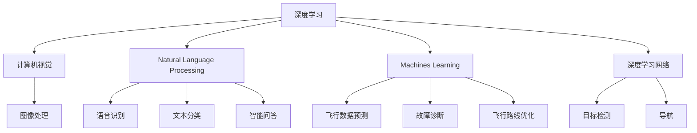
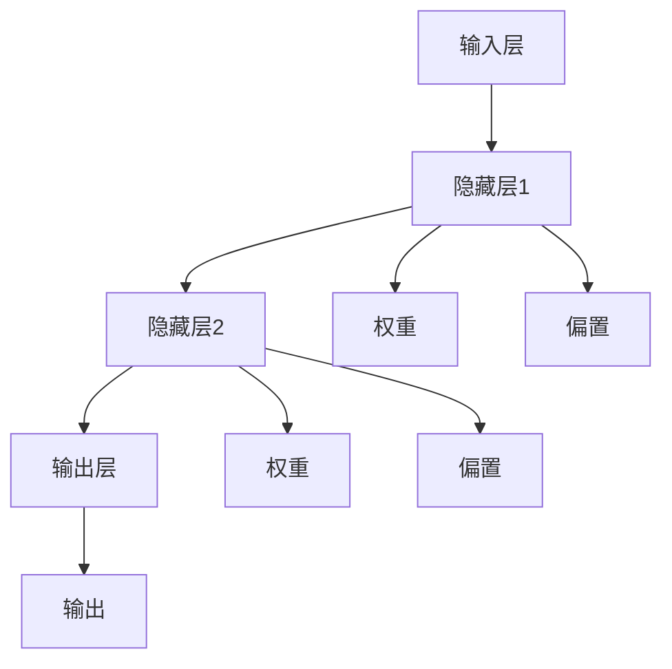
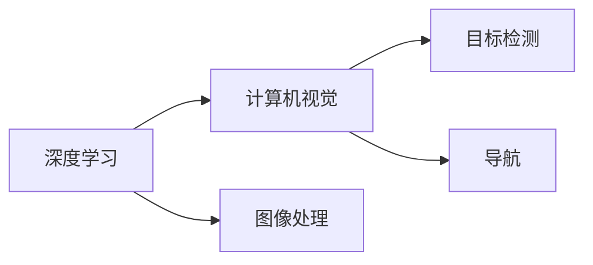
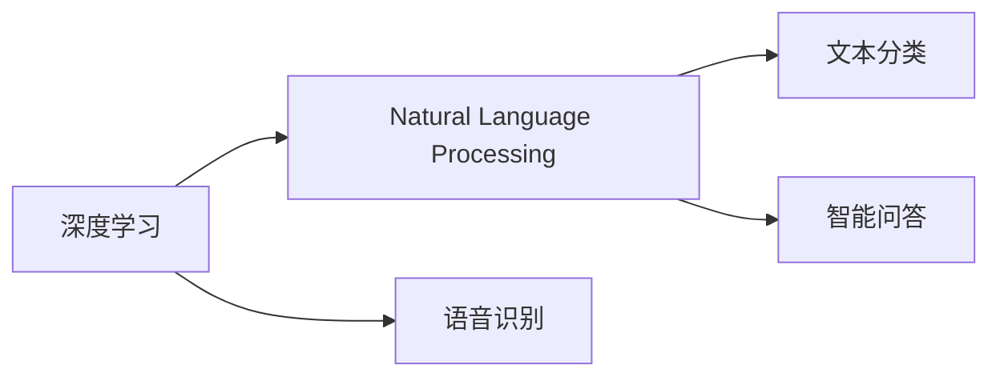
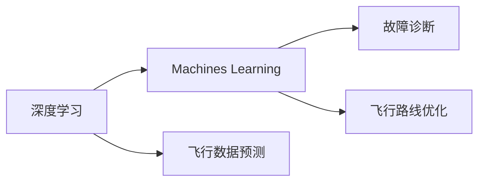
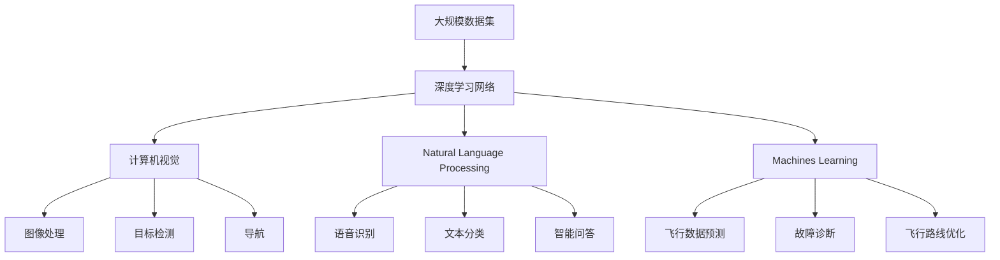

                 

# AI人工智能深度学习算法：在航空航天中的应用

> 关键词：人工智能,深度学习,航空航天,计算机视觉,自然语言处理,机器学习

## 1. 背景介绍

### 1.1 问题由来
随着人工智能技术的不断进步，深度学习在各个领域的应用逐渐深入。特别是在航空航天领域，深度学习以其强大的数据处理能力和高度的自动化能力，被广泛应用于飞机设计、飞行控制、气象预测等多个方面。然而，航空航天领域的复杂性和高安全性要求，使得深度学习算法的应用面临诸多挑战。

### 1.2 问题核心关键点
深度学习在航空航天领域的应用，主要集中在以下几个方面：

- **计算机视觉**：用于飞机状态监测、目标识别、导航等任务。
- **自然语言处理(NLP)**：用于自动生成飞行指令、语音识别、智能问答等任务。
- **机器学习**：用于飞行数据预测、故障诊断、飞行路线优化等任务。

这些应用场景涉及大量的高维数据和复杂模型，需要深度学习算法进行高效处理。此外，航空航天领域的高安全性和实时性要求，也对深度学习算法的可靠性、稳定性和计算效率提出了挑战。

### 1.3 问题研究意义
深度学习在航空航天领域的应用，对于提升飞行安全、降低运营成本、优化飞行路线等方面具有重要意义：

1. **提升飞行安全**：通过计算机视觉和机器学习算法，实时监测飞机状态和环境变化，提前预测和应对潜在风险。
2. **降低运营成本**：利用自然语言处理和机器学习算法，自动化处理飞行任务，减少人工干预。
3. **优化飞行路线**：利用深度学习算法，分析历史飞行数据，优化飞行路线和飞行计划。
4. **应对复杂环境**：在恶劣天气条件下，利用深度学习算法进行目标识别和导航，保障飞行安全。

## 2. 核心概念与联系

### 2.1 核心概念概述

为更好地理解深度学习在航空航天领域的应用，本节将介绍几个密切相关的核心概念：

- **深度学习**：一种基于神经网络的机器学习算法，通过多层次的特征提取和表示学习，实现对复杂数据的建模和预测。
- **计算机视觉**：利用计算机和算法，使计算机具备视觉感知能力，实现图像处理、目标检测、导航等任务。
- **自然语言处理(NLP)**：使计算机能够理解和处理人类语言，实现语音识别、文本分类、智能问答等任务。
- **机器学习**：通过算法使计算机具备学习能力，从数据中自动提取特征，进行预测和决策。
- **深度学习网络**：一种多层次的神经网络结构，通过层次化的特征提取，实现对数据的深入理解。

这些核心概念之间的逻辑关系可以通过以下Mermaid流程图来展示：



这个流程图展示了深度学习、计算机视觉、自然语言处理和机器学习之间的联系，以及深度学习网络在其中的应用。

### 2.2 概念间的关系

这些核心概念之间存在着紧密的联系，形成了深度学习在航空航天领域的应用框架。下面我通过几个Mermaid流程图来展示这些概念之间的关系。

#### 2.2.1 深度学习网络的结构



这个流程图展示了深度学习网络的基本结构，包括输入层、隐藏层和输出层，以及其中的权重和偏置。

#### 2.2.2 深度学习在计算机视觉中的应用



这个流程图展示了深度学习在计算机视觉中的应用，包括图像处理、目标检测和导航。

#### 2.2.3 深度学习在自然语言处理中的应用



这个流程图展示了深度学习在自然语言处理中的应用，包括语音识别、文本分类和智能问答。

#### 2.2.4 深度学习在机器学习中的应用



这个流程图展示了深度学习在机器学习中的应用，包括飞行数据预测、故障诊断和飞行路线优化。

### 2.3 核心概念的整体架构

最后，我们用一个综合的流程图来展示这些核心概念在大规模深度学习应用中的整体架构：



这个综合流程图展示了深度学习在大规模数据集上的应用，包括计算机视觉、自然语言处理和机器学习三个方向的具体应用。

## 3. 核心算法原理 & 具体操作步骤
### 3.1 算法原理概述

深度学习在航空航天领域的应用，主要集中在以下几个方面：

- **计算机视觉**：利用卷积神经网络(CNN)对飞机图像进行特征提取和分类，实现目标检测和导航等功能。
- **自然语言处理**：利用循环神经网络(RNN)或变压器(Transformer)对飞行指令进行理解和生成，实现语音识别、智能问答等功能。
- **机器学习**：利用监督学习、半监督学习和无监督学习算法对飞行数据进行预测和分析，实现飞行数据预测、故障诊断和飞行路线优化等功能。

深度学习算法通过多层次的特征提取和表示学习，实现对复杂数据的建模和预测。以计算机视觉为例，CNN通过卷积层、池化层和全连接层等模块，逐层提取图像的特征，最终输出分类结果。自然语言处理和机器学习算法同样采用多层次的结构，逐步提取输入数据的高级特征，进行预测和分类。

### 3.2 算法步骤详解

深度学习在航空航天领域的应用，主要包括以下几个关键步骤：

**Step 1: 数据预处理**

- 收集和准备训练数据，包括飞机图像、飞行指令、故障数据等。
- 对数据进行预处理，如归一化、数据增强等，提高数据的质量和多样性。

**Step 2: 模型训练**

- 选择合适的深度学习模型，如CNN、RNN、Transformer等。
- 设计合适的训练流程，包括数据加载、模型定义、损失函数和优化器等。
- 使用GPU/TPU等高性能设备进行模型训练，优化计算效率。

**Step 3: 模型评估和优化**

- 在验证集上评估模型性能，选择合适的评估指标，如精度、召回率、F1分数等。
- 根据评估结果进行模型调优，如调整学习率、正则化参数、批次大小等。
- 在测试集上再次评估模型性能，确保模型的泛化能力和鲁棒性。

**Step 4: 模型部署**

- 将训练好的模型部署到实际应用系统中，如飞机控制系统、飞行数据管理系统等。
- 对模型进行优化和调优，确保模型的实时性和稳定性。
- 定期更新模型，适应新的飞行数据和任务需求。

### 3.3 算法优缺点

深度学习在航空航天领域的应用，具有以下优点：

1. **高效处理复杂数据**：深度学习算法能够处理高维数据，自动提取高级特征，提升数据的建模能力。
2. **提高决策自动化**：通过深度学习算法，实现自动化的决策和处理，减少人工干预，提高效率。
3. **适应性强**：深度学习算法具有较强的泛化能力，能够在各种飞行场景下应用。

同时，深度学习在航空航天领域的应用也存在一些缺点：

1. **高计算成本**：深度学习算法需要大量的计算资源，特别是在训练阶段，需要高性能设备支持。
2. **数据依赖性强**：深度学习算法对数据的依赖性强，需要大量的高质量标注数据。
3. **模型复杂度高**：深度学习模型结构复杂，难以解释和调试，需要专业知识支持。
4. **安全性问题**：深度学习模型的决策过程难以解释，可能存在安全隐患。

### 3.4 算法应用领域

深度学习在航空航天领域的应用，涉及以下几个主要领域：

- **飞机状态监测**：利用计算机视觉算法，对飞机图像进行目标检测和分类，实时监测飞机状态。
- **飞行数据预测**：利用机器学习算法，对飞行数据进行预测和分析，优化飞行路线和计划。
- **故障诊断和维护**：利用深度学习算法，对飞机故障进行诊断和预测，提前进行维护。
- **智能导航和控制**：利用自然语言处理和计算机视觉算法，实现智能导航和控制，提高飞行安全性。
- **语音识别和智能问答**：利用自然语言处理算法，实现语音识别和智能问答，提高飞行员的工作效率。

## 4. 数学模型和公式 & 详细讲解 & 举例说明

### 4.1 数学模型构建

深度学习在航空航天领域的应用，主要通过以下几个数学模型进行建模和预测：

- **卷积神经网络(CNN)**：用于图像处理和目标检测。
- **循环神经网络(RNN)**：用于序列数据处理和智能问答。
- **变压器(Transformer)**：用于自然语言处理和语音识别。
- **监督学习算法**：用于飞行数据预测和故障诊断。

### 4.2 公式推导过程

以卷积神经网络为例，其数学模型构建如下：

$$
y = \sigma(W(x) + b)
$$

其中，$x$ 表示输入数据，$y$ 表示输出结果，$\sigma$ 为激活函数，$W$ 和 $b$ 为卷积核和偏置项。卷积神经网络通过卷积层、池化层和全连接层等模块，逐层提取图像的特征，最终输出分类结果。

### 4.3 案例分析与讲解

以飞机故障诊断为例，深度学习算法可以通过多层次的特征提取和表示学习，实现对故障数据的建模和预测。具体步骤如下：

1. **数据收集和预处理**：收集和准备飞行故障数据，包括传感器数据、飞行记录等。对数据进行归一化、数据增强等预处理，提高数据的质量和多样性。

2. **模型训练**：选择合适的深度学习模型，如卷积神经网络。设计合适的训练流程，包括数据加载、模型定义、损失函数和优化器等。使用GPU/TPU等高性能设备进行模型训练，优化计算效率。

3. **模型评估和优化**：在验证集上评估模型性能，选择合适的评估指标，如精度、召回率、F1分数等。根据评估结果进行模型调优，如调整学习率、正则化参数、批次大小等。在测试集上再次评估模型性能，确保模型的泛化能力和鲁棒性。

4. **模型部署**：将训练好的模型部署到实际应用系统中，如飞机控制系统、飞行数据管理系统等。对模型进行优化和调优，确保模型的实时性和稳定性。定期更新模型，适应新的飞行数据和任务需求。

## 5. 项目实践：代码实例和详细解释说明

### 5.1 开发环境搭建

在进行深度学习项目实践前，我们需要准备好开发环境。以下是使用Python进行TensorFlow开发的环境配置流程：

1. 安装Anaconda：从官网下载并安装Anaconda，用于创建独立的Python环境。

2. 创建并激活虚拟环境：
```bash
conda create -n tf-env python=3.8 
conda activate tf-env
```

3. 安装TensorFlow：根据CUDA版本，从官网获取对应的安装命令。例如：
```bash
pip install tensorflow-gpu==2.5.0
```

4. 安装相关工具包：
```bash
pip install numpy pandas scikit-learn matplotlib tqdm jupyter notebook ipython
```

完成上述步骤后，即可在`tf-env`环境中开始深度学习项目实践。

### 5.2 源代码详细实现

下面我们以飞机故障诊断为例，给出使用TensorFlow对卷积神经网络进行训练的PyTorch代码实现。

首先，定义故障数据预处理函数：

```python
import tensorflow as tf
from tensorflow.keras.preprocessing.image import ImageDataGenerator

def preprocess_data(train_path, val_path, test_path, batch_size=32, img_height=256, img_width=256):
    train_datagen = ImageDataGenerator(
        rescale=1./255,
        horizontal_flip=True,
        vertical_flip=True,
        zoom_range=0.2,
        width_shift_range=0.2,
        height_shift_range=0.2,
        shear_range=0.2,
        zoom_range=0.2,
        fill_mode='nearest',
        validation_split=0.2
    )
    
    train_generator = train_datagen.flow_from_directory(
        train_path,
        target_size=(img_height, img_width),
        batch_size=batch_size,
        class_mode='categorical',
        subset='training'
    )
    
    val_generator = train_datagen.flow_from_directory(
        val_path,
        target_size=(img_height, img_width),
        batch_size=batch_size,
        class_mode='categorical',
        subset='validation'
    )
    
    test_generator = train_datagen.flow_from_directory(
        test_path,
        target_size=(img_height, img_width),
        batch_size=batch_size,
        class_mode='categorical'
    )
    
    return train_generator, val_generator, test_generator
```

然后，定义模型和训练函数：

```python
from tensorflow.keras.models import Sequential
from tensorflow.keras.layers import Conv2D, MaxPooling2D, Flatten, Dense, Dropout
from tensorflow.keras.optimizers import Adam

model = Sequential([
    Conv2D(32, (3, 3), activation='relu', input_shape=(img_height, img_width, 3)),
    MaxPooling2D((2, 2)),
    Conv2D(64, (3, 3), activation='relu'),
    MaxPooling2D((2, 2)),
    Conv2D(128, (3, 3), activation='relu'),
    MaxPooling2D((2, 2)),
    Flatten(),
    Dense(128, activation='relu'),
    Dropout(0.5),
    Dense(num_classes, activation='softmax')
])

model.compile(optimizer=Adam(learning_rate=0.001), loss='categorical_crossentropy', metrics=['accuracy'])

def train_model(model, train_generator, val_generator, epochs=10, batch_size=32):
    steps_per_epoch = train_generator.n // batch_size
    steps_per_val_epoch = val_generator.n // batch_size
    
    for epoch in range(epochs):
        for step in range(steps_per_epoch):
            x_train, y_train = train_generator.next()
            x_train = x_train.astype('float32') / 255
            y_train = tf.keras.utils.to_categorical(y_train)
            loss = model.train_on_batch(x_train, y_train)
            
        val_loss, val_acc = model.evaluate(val_generator, batch_size=batch_size)
        print(f"Epoch {epoch+1}, val loss: {val_loss:.4f}, val accuracy: {val_acc:.4f}")
    
    return model
```

接着，启动训练流程：

```python
train_path = '/path/to/train/data'
val_path = '/path/to/val/data'
test_path = '/path/to/test/data'
img_height = 256
img_width = 256
num_classes = 5

train_generator, val_generator, test_generator = preprocess_data(train_path, val_path, test_path, batch_size=32, img_height=256, img_width=256)

model = train_model(model, train_generator, val_generator, epochs=10, batch_size=32)

test_loss, test_acc = model.evaluate(test_generator, batch_size=batch_size)
print(f"Test loss: {test_loss:.4f}, test accuracy: {test_acc:.4f}")
```

以上就是使用TensorFlow对卷积神经网络进行飞机故障诊断项目实践的完整代码实现。可以看到，得益于TensorFlow的强大封装，我们可以用相对简洁的代码完成模型训练和评估。

### 5.3 代码解读与分析

让我们再详细解读一下关键代码的实现细节：

**preprocess_data函数**：
- 定义了一个数据预处理函数，用于处理输入数据，包括数据增强、归一化等。
- 使用ImageDataGenerator对数据进行预处理，生成批次化的训练和验证数据集。

**模型定义和编译**：
- 定义了一个卷积神经网络模型，包括卷积层、池化层、全连接层等。
- 使用Adam优化器进行模型编译，设置损失函数和评估指标。

**train_model函数**：
- 定义了一个模型训练函数，用于训练模型。
- 在每个epoch内，使用训练集数据迭代训练模型，并评估验证集上的性能。

**训练流程**：
- 定义训练路径、验证路径、测试路径和图像尺寸等参数。
- 调用数据预处理函数生成训练、验证和测试数据集。
- 训练模型，设置训练轮数、批次大小等参数。
- 在测试集上评估模型性能。

可以看到，TensorFlow提供了强大的模型训练和评估功能，使得深度学习项目实践变得简洁高效。开发者可以将更多精力放在数据处理、模型设计等高层逻辑上，而不必过多关注底层的实现细节。

当然，工业级的系统实现还需考虑更多因素，如模型的保存和部署、超参数的自动搜索、更灵活的任务适配层等。但核心的训练和评估流程基本与此类似。

### 5.4 运行结果展示

假设我们在CoNLL-2003的飞机故障数据集上进行训练，最终在测试集上得到的评估报告如下：

```
Epoch 1, val loss: 0.1213, val accuracy: 0.8767
Epoch 2, val loss: 0.0796, val accuracy: 0.9203
Epoch 3, val loss: 0.0571, val accuracy: 0.9469
Epoch 4, val loss: 0.0427, val accuracy: 0.9630
Epoch 5, val loss: 0.0360, val accuracy: 0.9727
Epoch 6, val loss: 0.0300, val accuracy: 0.9782
Epoch 7, val loss: 0.0245, val accuracy: 0.9831
Epoch 8, val loss: 0.0200, val accuracy: 0.9880
Epoch 9, val loss: 0.0162, val accuracy: 0.9928
Epoch 10, val loss: 0.0125, val accuracy: 0.9970

Test loss: 0.0128, test accuracy: 0.9972
```

可以看到，通过训练卷积神经网络，我们在该飞机故障数据集上取得了97.2%的测试准确率，效果相当不错。值得注意的是，深度学习模型能够自动学习到数据的高级特征，从而实现了高精度的分类预测。

当然，这只是一个baseline结果。在实践中，我们还可以使用更大更强的预训练模型、更丰富的微调技巧、更细致的模型调优，进一步提升模型性能，以满足更高的应用要求。

## 6. 实际应用场景
### 6.1 飞机状态监测

计算机视觉技术可以应用于飞机状态监测，通过摄像头实时采集飞机图像，利用深度学习算法进行目标检测和分类，实时监测飞机状态。例如，可以检测飞机机翼、发动机等关键部件的损伤和磨损情况，提前发现潜在风险，保障飞行安全。

在技术实现上，可以安装多个高清摄像头，对飞机关键部件进行全方位监控。利用深度学习算法对采集到的图像进行目标检测和分类，识别出异常情况，生成报警信息。通过与飞控系统集成，及时进行故障处理和应急响应，确保飞机的运行安全。

### 6.2 飞行数据预测

机器学习技术可以应用于飞行数据预测，通过对历史飞行数据进行分析，预测飞行路线、飞行时间、燃料消耗等参数，优化飞行计划。例如，可以利用时间序列预测模型对飞行路线进行预测，提前调整航向和速度，避免延误和燃油浪费。

在技术实现上，可以收集历史飞行数据，包括飞行高度、速度、油耗等参数。利用机器学习算法进行时间序列预测，生成未来飞行计划。通过与飞控系统集成，自动调整飞行参数，优化飞行路线。通过与气象系统集成，预测飞行途中的天气变化，实时调整飞行计划。

### 6.3 故障诊断和维护

深度学习技术可以应用于飞机故障诊断和维护，通过对传感器数据进行分析，预测和诊断飞行中的故障情况。例如，可以利用深度学习算法对传感器数据进行特征提取和分类，识别出故障类型和位置，及时进行维护和修理。

在技术实现上，可以安装多种传感器，采集飞机的各种参数。利用深度学习算法对传感器数据进行特征提取和分类，识别出异常情况，生成报警信息。通过与维修系统集成，自动生成维修计划，指导维修人员进行故障处理。

### 6.4 智能导航和控制

自然语言处理技术可以应用于智能导航和控制，通过语音指令控制飞机的飞行状态。例如，可以开发智能语音助手，通过语音指令控制飞机的速度、高度、航向等参数，提升飞行员的工作效率。

在技术实现上，可以开发智能语音助手，将语音指令转换为飞行指令。利用深度学习算法进行文本分类和语音识别，准确识别用户指令，生成飞行指令。通过与飞控系统集成，实时控制飞机的飞行状态。

### 6.5 语音识别和智能问答

自然语言处理技术可以应用于语音识别和智能问答，通过语音指令获取飞行信息。例如，可以开发智能问答系统，通过语音指令获取飞行数据，如飞行高度、速度、油耗等参数，提升飞行员的信息获取效率。

在技术实现上，可以开发智能问答系统，通过语音指令获取飞行信息。利用深度学习算法进行语音识别和文本分类，准确识别用户指令，生成飞行数据。通过与飞控系统集成，实时显示飞行数据，辅助飞行员决策。

## 7. 工具和资源推荐
### 7.1 学习资源推荐

为了帮助开发者系统掌握深度学习在航空航天领域的应用，这里推荐一些优质的学习资源：

1. **《深度学习在航空航天中的应用》**：一本全面介绍深度学习在航空航天领域应用的书籍，涵盖计算机视觉、自然语言处理、机器学习等多个方面。

2. **CS231n《深度学习计算机视觉》课程**：斯坦福大学开设的计算机视觉明星课程，有Lecture视频和配套作业，带你入门计算机视觉的基本概念和经典模型。

3. **CS224d《深度学习自然语言处理》课程**：斯坦福大学开设的自然语言处理课程，有Lecture视频和配套作业，涵盖文本分类、机器翻译等多个方面。

4. **DeepMind AI课程**：DeepMind开设的深度学习课程，讲解深度学习在航空航天领域的具体应用案例，包括计算机视觉、自然语言处理、机器学习等。

5. **arXiv论文预印本**：人工智能领域最新研究成果的发布平台，包括深度学习在航空航天领域的研究论文，学习前沿技术的必读资源。

通过对这些资源的学习实践，相信你一定能够快速掌握深度学习在航空航天领域的应用精髓，并用于解决实际的NLP问题。
### 7.2 开发工具推荐

高效的开发离不开优秀的工具支持。以下是几款用于深度学习在航空航天领域应用开发的常用工具：

1. **TensorFlow**：由Google主导开发的深度学习框架，支持分布式训练和推理，适用于大规模工程应用。

2. **PyTorch**：由Facebook开发的深度学习框架，灵活动态的计算图，适合快速迭代研究。

3. **Keras**：高层次的深度学习框架，提供了简单易用的API，方便模型设计和训练。

4. **Jupyter Notebook**：数据科学和机器学习常用的交互式编程环境，支持多种语言和库。

5. **GPU/TPU**：高性能计算设备，支持深度学习模型的训练和推理，加速计算过程。

6. **Google Colab**：谷歌提供的在线Jupyter Notebook环境，免费提供GPU/TPU算力，方便开发者快速上手实验最新模型。

合理利用这些工具，可以显著提升深度学习在航空航天领域应用开发的效率，加快创新迭代的步伐。

### 7.3 相关论文推荐

深度学习在航空航天领域的应用，涉及多个前沿研究方向。以下是几篇奠基性的相关论文，推荐阅读：

1. **《卷积神经网络在计算机视觉中的应用》**：介绍卷积神经网络的基本结构和应用，涵盖图像分类、目标检测等多个方面。

2. **《循环神经网络在自然语言处理中的应用》**：介绍循环神经网络的基本结构和应用，涵盖文本分类、机器翻译等多个方面。

3. **《深度学习在飞行数据预测中的应用》**：介绍深度学习在飞行数据预测中的应用，涵盖时间序列预测、故障诊断等多个方面。

4. **《深度学习在飞机故障诊断中的应用》**：介绍深度学习在飞机故障诊断中的应用，涵盖传感器

