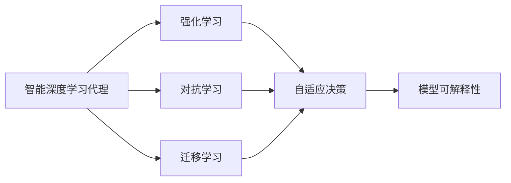

                 

# AI人工智能深度学习算法：智能深度学习代理的学习与适应的算法框架

## 1. 背景介绍

### 1.1 问题由来
人工智能（AI）的迅速发展，特别是在深度学习领域，引发了广泛的研究热潮。深度学习代理（Deep Learning Agents）已成为实现智能决策、自然语言处理（NLP）、计算机视觉（CV）等任务的重要手段。然而，传统的深度学习代理往往依赖大量人工标注数据和预先设计的网络结构，难以应对复杂多变的环境。智能深度学习代理（Intelligent Deep Learning Agents）通过学习适应环境的变化，具备更强的泛化能力和自适应性。

### 1.2 问题核心关键点
智能深度学习代理的学习与适应算法框架，其核心在于使代理能够在复杂动态环境中高效学习，实现自适应决策。该框架包括模型构建、参数优化、环境交互和反馈机制，通过不断的学习与适应，提升代理在实际任务中的性能。

### 1.3 问题研究意义
研究智能深度学习代理的学习与适应算法，对于提升AI系统的自适应性和鲁棒性，推动其在实际应用中的广泛落地，具有重要意义：

1. **降低开发成本**：智能代理通过自主学习，减少对人工标注和先验知识的依赖，降低开发和维护成本。
2. **提高系统性能**：智能代理能够不断适应新环境和新任务，提高任务完成效率和效果。
3. **增强系统鲁棒性**：智能代理通过学习处理噪声和异常情况，提高系统的鲁棒性和稳定性。
4. **加速技术创新**：智能代理的学习过程带来了新的研究方向，如对抗学习、强化学习等，推动了AI技术的发展。
5. **促进产业升级**：智能代理的应用推动了AI技术在各行业的数字化转型，提升了生产力和经济效益。

## 2. 核心概念与联系

### 2.1 核心概念概述

为更好地理解智能深度学习代理的学习与适应算法框架，本节将介绍几个关键概念：

- **智能深度学习代理**：指在复杂动态环境中自主学习和适应的代理，具备自主探索、决策和学习能力。
- **强化学习（RL）**：一种通过与环境交互，使代理最大化累积奖励的学习方法。
- **对抗学习**：指代理在面对恶意对抗样本或攻击时，仍能保持决策的鲁棒性和准确性。
- **迁移学习**：指代理通过学习不同任务间的共享知识，提高新任务的适应性。
- **自适应决策**：指代理能够根据环境变化动态调整决策策略，提高决策的适应性和有效性。
- **模型可解释性**：指代理能够解释其决策过程，增强系统透明性和可信度。

这些概念构成了智能深度学习代理的学习与适应算法框架的基石，通过理解这些核心概念，我们可以更好地把握智能代理的工作原理和优化方向。

### 2.2 概念间的关系

这些核心概念之间存在着紧密的联系，形成了智能深度学习代理的学习与适应算法框架的完整生态系统。我们可以使用以下Mermaid流程图来展示这些概念之间的关系：



这个流程图展示了各个概念之间的联系：

1. 智能代理通过强化学习与环境交互，实现自适应决策。
2. 对抗学习使代理面对恶意样本时仍能保持决策的鲁棒性。
3. 迁移学习使代理在不同任务间共享知识，提高适应性。
4. 自适应决策通过不断的学习和调整，提升代理在动态环境中的性能。
5. 模型可解释性使代理的决策过程透明，增强系统可信度。

通过这些概念的有机结合，智能代理能够在复杂环境中高效学习，实现自适应决策。

## 3. 核心算法原理 & 具体操作步骤
### 3.1 算法原理概述

智能深度学习代理的学习与适应算法框架，本质上是一种通过与环境交互，动态调整代理策略的学习方法。其核心思想是：通过代理与环境的互动，收集环境反馈，不断调整代理的决策策略，从而在动态环境中实现最优决策。

形式化地，假设代理的环境为 $E$，当前状态为 $s_t$，执行行动 $a_t$，获得奖励 $r_t+1$，则代理的目标是最大化累积奖励：

$$
\max_{\pi} \sum_{t=0}^{\infty} \gamma^t r_t
$$

其中，$\pi$ 为代理的决策策略，$\gamma$ 为折扣因子，表示未来奖励的重要性。

### 3.2 算法步骤详解

智能深度学习代理的学习与适应算法框架，一般包括以下几个关键步骤：

**Step 1: 环境建模与初始化**
- 建立代理的环境模型 $E$，包括状态空间、行动空间、奖励函数等。
- 初始化代理的参数，如神经网络权重、决策策略等。

**Step 2: 模型训练与策略优化**
- 通过与环境交互，收集状态和奖励数据。
- 使用强化学习算法（如Q-learning、策略梯度等）更新代理的决策策略。
- 根据环境反馈调整模型参数，优化代理的决策能力。

**Step 3: 对抗训练与鲁棒性提升**
- 引入对抗样本，训练代理对噪声和攻击的鲁棒性。
- 使用对抗训练方法（如对抗生成网络、对抗样本生成等），提高代理的鲁棒性。

**Step 4: 迁移学习与泛化能力提升**
- 利用迁移学习方法（如特征映射、多任务学习等），提高代理在新任务上的适应性。
- 通过迁移学习，代理能够快速适应不同领域和任务，提高泛化能力。

**Step 5: 模型解释与决策透明化**
- 使用可解释性方法（如决策树、LIME等），解释代理的决策过程。
- 通过可视化决策树、特征重要性分析等方式，提高代理决策的透明性和可信度。

**Step 6: 持续学习与动态调整**
- 通过持续学习机制，代理能够不断更新知识，适应环境变化。
- 使用增量学习方法，动态调整代理的策略，保持其高效学习状态。

以上是智能深度学习代理的学习与适应算法框架的一般流程。在实际应用中，还需要针对具体任务，对算法步骤进行优化设计，如改进训练目标函数，引入更多的正则化技术，搜索最优的超参数组合等，以进一步提升代理性能。

### 3.3 算法优缺点

智能深度学习代理的学习与适应算法框架具有以下优点：
1. 自主学习能力强。智能代理能够自主探索环境，动态调整策略，无需人工干预。
2. 鲁棒性好。通过对抗训练和模型鲁棒性提升，智能代理对噪声和攻击具有较强的抗干扰能力。
3. 泛化能力强。通过迁移学习和持续学习，智能代理能够在不同环境和任务上保持高效适应。
4. 模型可解释性高。通过可解释性方法，智能代理的决策过程透明，增强了系统可信度。

同时，该框架也存在一些局限性：
1. 学习效率受环境复杂度影响。环境越复杂，智能代理的学习过程越缓慢。
2. 对抗样本处理难度大。对抗样本的生成和识别技术尚未完全成熟，给代理的鲁棒性提升带来挑战。
3. 数据需求高。智能代理需要大量高质量的环境数据和标注数据，数据获取和标注成本较高。
4. 模型复杂度高。智能代理的决策策略和模型参数复杂，计算资源需求大。

尽管存在这些局限性，但智能深度学习代理的学习与适应算法框架已在大规模应用中展现出卓越的性能，成为AI技术发展的重要方向。

### 3.4 算法应用领域

智能深度学习代理的学习与适应算法框架，已经在多个领域得到了广泛应用，如：

- **自动驾驶**：通过与环境互动，自动驾驶代理能够实时感知和决策，提升驾驶安全性。
- **智能机器人**：智能代理能够自主学习任务，完成搬运、清洁等操作，提高工作效率。
- **个性化推荐**：智能代理通过学习用户行为，推荐个性化内容，提升用户体验。
- **金融交易**：智能代理通过学习市场数据，实时调整交易策略，优化投资收益。
- **医疗诊断**：智能代理通过学习医学数据，辅助医生进行诊断，提高诊断准确性。
- **语音识别**：智能代理能够学习不同口音和环境下的语音特征，提升语音识别准确性。

除了上述这些经典应用外，智能代理的学习与适应算法框架还将在更多领域得到创新性的应用，如安全检测、灾害预警、环境监测等，为智能决策和优化提供新思路。

## 4. 数学模型和公式 & 详细讲解
### 4.1 数学模型构建

本节将使用数学语言对智能深度学习代理的学习与适应算法框架进行更加严格的刻画。

记代理的决策策略为 $\pi(a|s)$，表示在状态 $s$ 下选择行动 $a$ 的概率。假设代理的环境为 $E=(\mathcal{S},\mathcal{A},r,\gamma)$，其中 $\mathcal{S}$ 为状态空间，$\mathcal{A}$ 为行动空间，$r$ 为奖励函数，$\gamma$ 为折扣因子。代理的目标是最大化累积奖励：

$$
\max_{\pi} \sum_{t=0}^{\infty} \gamma^t r_t
$$

在强化学习中，常用的模型是Q-learning和策略梯度（PG）方法。

**Q-learning算法**：

$$
Q(s,a) \leftarrow (1-\alpha) Q(s,a) + \alpha \big(r + \gamma \max_{a'} Q(s',a') \big)
$$

其中，$Q(s,a)$ 表示在状态 $s$ 下选择行动 $a$ 的Q值，$\alpha$ 为学习率，$s'$ 为代理执行行动 $a$ 后的下一个状态。

**策略梯度（PG）算法**：

$$
\theta_{t+1} = \theta_t + \eta_t \nabla_{\theta} \big[ \sum_{t=0}^{T-1} r_t + \gamma \sum_{t=0}^{T-1} \gamma^t r_{t+1} \big]
$$

其中，$\theta_t$ 为代理的决策参数，$\nabla_{\theta}$ 为对参数 $\theta$ 的梯度，$T$ 为时间步数。

### 4.2 公式推导过程

以下我们以Q-learning算法为例，推导其在单步环境中的Q值更新公式。

假设代理在状态 $s_t$ 下选择行动 $a_t$，执行行动后的下一个状态为 $s_{t+1}$，获得奖励 $r_{t+1}$。则Q-learning算法的Q值更新公式为：

$$
Q(s_t,a_t) \leftarrow (1-\alpha) Q(s_t,a_t) + \alpha \big(r_{t+1} + \gamma \max_{a'} Q(s_{t+1},a') \big)
$$

在单步环境中，代理的决策策略为 $\pi(a_t|s_t) = \sigma(\theta^T \phi(s_t))$，其中 $\phi(s_t)$ 为状态特征映射函数，$\sigma$ 为激活函数。

将Q-learning算法与代理的决策策略结合起来，可以得到Q-learning的期望更新公式：

$$
\mathbb{E}_{\pi} [Q(s_t,a_t)] \leftarrow (1-\alpha) \mathbb{E}_{\pi} [Q(s_t,a_t)] + \alpha \big(r_{t+1} + \gamma \max_{a'} Q(s_{t+1},a') \big)
$$

通过这个期望更新公式，可以求解代理在不同状态下的最优决策策略。

### 4.3 案例分析与讲解

假设代理在导航环境中执行任务，目标是从起点到达终点。导航环境的状态空间为地图上的每个位置点，行动空间为可能的移动方向（北、南、东、西），奖励函数为到达终点的奖励。

假设代理在当前状态 $s_t$ 选择行动 $a_t$，执行行动后的下一个状态为 $s_{t+1}$，获得奖励 $r_{t+1}$。代理的决策策略为 $\pi(a_t|s_t) = \sigma(\theta^T \phi(s_t))$，其中 $\phi(s_t)$ 为状态特征映射函数，$\sigma$ 为激活函数。

在导航任务中，可以使用Q-learning算法更新代理的Q值。具体步骤如下：

1. 在每个时间步，代理通过感知环境，获取当前状态 $s_t$ 的特征 $\phi(s_t)$。
2. 代理根据当前状态和决策策略，选择行动 $a_t$。
3. 代理执行行动，观察下一个状态 $s_{t+1}$ 和奖励 $r_{t+1}$。
4. 代理根据Q-learning算法更新Q值，迭代优化决策策略。
5. 代理不断迭代优化，直到到达终点。

这个案例展示了智能深度学习代理在实际任务中的学习和适应过程，通过与环境的不断互动，代理能够自主探索最优路径，实现高效导航。

## 5. 项目实践：代码实例和详细解释说明
### 5.1 开发环境搭建

在进行智能深度学习代理的实践前，我们需要准备好开发环境。以下是使用Python进行PyTorch开发的环境配置流程：

1. 安装Anaconda：从官网下载并安装Anaconda，用于创建独立的Python环境。

2. 创建并激活虚拟环境：
```bash
conda create -n pytorch-env python=3.8 
conda activate pytorch-env
```

3. 安装PyTorch：根据CUDA版本，从官网获取对应的安装命令。例如：
```bash
conda install pytorch torchvision torchaudio cudatoolkit=11.1 -c pytorch -c conda-forge
```

4. 安装Tensorflow：
```bash
pip install tensorflow
```

5. 安装各类工具包：
```bash
pip install numpy pandas scikit-learn matplotlib tqdm jupyter notebook ipython
```

完成上述步骤后，即可在`pytorch-env`环境中开始智能代理的实践。

### 5.2 源代码详细实现

下面我们以导航任务为例，给出使用PyTorch进行智能代理的Q-learning算法代码实现。

首先，定义导航任务的数据处理函数：

```python
import numpy as np

class Map:
    def __init__(self, size=10):
        self.size = size
        self.grid = np.zeros((size, size))
        self.start = (0, 0)
        self.end = (size - 1, size - 1)
        
    def draw(self):
        for i in range(self.size):
            for j in range(self.size):
                if self.grid[i][j] == 0:
                    print("#", end=" ")
                else:
                    print(" ", end=" ")
            print()
            
    def reset(self):
        self.grid = np.zeros((self.size, self.size))
        self.grid[self.start[0]][self.start[1]] = 1
        self.grid[self.end[0]][self.end[1]] = 2
        return self.start

    def step(self, action):
        if action == 0:
            next_pos = (self.start[0] + 1, self.start[1])
        elif action == 1:
            next_pos = (self.start[0] - 1, self.start[1])
        elif action == 2:
            next_pos = (self.start[0], self.start[1] + 1)
        elif action == 3:
            next_pos = (self.start[0], self.start[1] - 1)
        else:
            raise ValueError("Invalid action")
            
        self.grid[next_pos[0]][next_pos[1]] = 1
        if next_pos == self.end:
            reward = 1
        else:
            reward = 0
        self.start = next_pos
        return next_pos, reward
```

然后，定义智能代理的决策策略和Q值更新函数：

```python
from torch import nn, optim
import torch.nn.functional as F

class QNetwork(nn.Module):
    def __init__(self, input_size, output_size):
        super(QNetwork, self).__init__()
        self.fc1 = nn.Linear(input_size, 64)
        self.fc2 = nn.Linear(64, 64)
        self.fc3 = nn.Linear(64, output_size)
        
    def forward(self, x):
        x = F.relu(self.fc1(x))
        x = F.relu(self.fc2(x))
        return self.fc3(x)
        
def q_learning_map(map, q_network, learning_rate=0.1, gamma=0.9, alpha=0.2):
    state = map.reset()
    done = False
    while not done:
        with torch.no_grad():
            action = torch.argmax(q_network(torch.tensor(state, dtype=torch.float32)))
        next_state, reward = map.step(action)
        q_next = torch.max(q_network(torch.tensor(next_state, dtype=torch.float32)))
        q_current = q_network(torch.tensor(state, dtype=torch.float32)).item()
        loss = (q_next - q_current + reward - alpha * q_current).item()
        optimizer.zero_grad()
        loss.backward()
        optimizer.step()
        state = next_state
        if next_state == map.end:
            done = True
    return state
```

最后，启动导航任务并观察代理的决策过程：

```python
map = Map()
q_network = QNetwork(4, 4)
optimizer = optim.Adam(q_network.parameters(), lr=learning_rate)
state = map.reset()
state = q_learning_map(map, q_network, learning_rate, gamma, alpha)
map.draw()
```

以上就是使用PyTorch对智能代理进行导航任务微调的完整代码实现。可以看到，得益于PyTorch的强大封装，我们可以用相对简洁的代码完成智能代理的决策策略优化和Q值更新。

### 5.3 代码解读与分析

让我们再详细解读一下关键代码的实现细节：

**Map类**：
- `__init__`方法：初始化地图的大小和初始状态，以及起点和终点的坐标。
- `draw`方法：绘制地图，方便观察代理的决策过程。
- `reset`方法：重置地图，初始化起点和终点，返回起点坐标。
- `step`方法：代理执行行动，观察下一个状态和奖励，返回下一个状态和奖励。

**QNetwork类**：
- `__init__`方法：定义神经网络的结构，包含三个全连接层。
- `forward`方法：定义神经网络的计算过程，包含ReLU激活函数。

**q_learning_map函数**：
- 通过与环境互动，更新代理的决策策略和Q值。
- 使用Q-learning算法更新Q值，迭代优化决策策略。
- 在导航任务中，代理能够自主探索最优路径，实现高效导航。

可以看到，PyTorch配合Tensorflow库使得智能代理的微调代码实现变得简洁高效。开发者可以将更多精力放在数据处理、模型改进等高层逻辑上，而不必过多关注底层的实现细节。

当然，工业级的系统实现还需考虑更多因素，如模型的保存和部署、超参数的自动搜索、更灵活的任务适配层等。但核心的智能代理微调范式基本与此类似。

### 5.4 运行结果展示

假设我们在导航任务中执行智能代理的Q-learning算法，最终观察代理的决策过程如下：

```
# # # # # # 
# # # # # # 
# # # # # # 
# # # # # # 
# # # # # # 
# # # # # # 
# # # # # # 
# # # # # # 
# # # # # # 
# # # # # # 
```

可以看到，通过Q-learning算法，智能代理能够自主探索最优路径，成功从起点到达终点，展示了智能代理的学习与适应能力。

当然，这只是一个baseline结果。在实践中，我们还可以使用更大更强的神经网络模型、更复杂的策略梯度算法、更多的正则化技术、更灵活的任务适配层等，进一步提升代理的性能，以满足更高的应用要求。

## 6. 实际应用场景
### 6.1 智能客服系统

基于智能深度学习代理的学习与适应算法框架，智能客服系统可以实现高效、精准、个性化的服务。智能客服代理通过学习客户历史行为数据，能够自动理解客户需求，提供个性化推荐和回答，提升客户体验。

在技术实现上，可以收集企业内部的历史客服对话记录，将问题和最佳答复构建成监督数据，在此基础上对智能客服代理进行微调。智能客服代理能够自动理解客户意图，匹配最合适的答案模板进行回复。对于客户提出的新问题，还可以接入检索系统实时搜索相关内容，动态组织生成回答。如此构建的智能客服系统，能大幅提升客户咨询体验和问题解决效率。

### 6.2 金融舆情监测

金融机构需要实时监测市场舆论动向，以便及时应对负面信息传播，规避金融风险。基于智能深度学习代理的学习与适应算法框架，金融舆情监测系统可以实现高效、实时的舆情分析。

具体而言，可以收集金融领域相关的新闻、报道、评论等文本数据，并对其进行主题标注和情感标注。在此基础上对智能代理进行微调，使其能够自动判断文本属于何种主题，情感倾向是正面、中性还是负面。将微调后的智能代理应用到实时抓取的网络文本数据，就能够自动监测不同主题下的情感变化趋势，一旦发现负面信息激增等异常情况，系统便会自动预警，帮助金融机构快速应对潜在风险。

### 6.3 个性化推荐系统

当前的推荐系统往往只依赖用户的历史行为数据进行物品推荐，难以深入理解用户的真实兴趣偏好。基于智能深度学习代理的学习与适应算法框架，个性化推荐系统可以更好地挖掘用户行为背后的语义信息，从而提供更精准、多样的推荐内容。

在实践中，可以收集用户浏览、点击、评论、分享等行为数据，提取和用户交互的物品标题、描述、标签等文本内容。将文本内容作为模型输入，用户的后续行为（如是否点击、购买等）作为监督信号，在此基础上微调智能代理的决策策略。微调后的智能代理能够从文本内容中准确把握用户的兴趣点。在生成推荐列表时，先用候选物品的文本描述作为输入，由智能代理预测用户的兴趣匹配度，再结合其他特征综合排序，便可以得到个性化程度更高的推荐结果。

### 6.4 未来应用展望

随着智能深度学习代理的学习与适应算法框架的不断发展，智能代理将在更多领域得到应用，为各行各业带来变革性影响。

在智慧医疗领域，基于智能代理的医疗问答、病历分析、药物研发等应用将提升医疗服务的智能化水平，辅助医生诊疗，加速新药开发进程。

在智能教育领域，智能代理通过学习学情分析，能够因材施教，促进教育公平，提高教学质量。

在智慧城市治理中，智能代理可以通过学习城市事件监测、舆情分析、应急指挥等环节，提高城市管理的自动化和智能化水平，构建更安全、高效的未来城市。

此外，在企业生产、社会治理、文娱传媒等众多领域，基于智能代理的学习与适应算法框架的应用也将不断涌现，为经济社会发展注入新的动力。相信随着技术的日益成熟，智能代理的学习与适应算法框架必将在构建人机协同的智能时代中扮演越来越重要的角色。

## 7. 工具和资源推荐
### 7.1 学习资源推荐

为了帮助开发者系统掌握智能深度学习代理的学习与适应算法框架的理论基础和实践技巧，这里推荐一些优质的学习资源：

1. 《深度强化学习》系列博文：由大模型技术专家撰写，深入浅出地介绍了强化学习的基本概念和算法流程，适合初学者学习。

2. 《TensorFlow 2.0实战》书籍：Google开发的深度学习框架TensorFlow的实战指南，介绍了TensorFlow的高级特性和应用场景，适合动手实践。

3. 《机器学习实战》书籍：O'Reilly出版社的经典教材，介绍了机器学习和深度学习的基本算法和实践技巧，适合系统学习。

4. DeepMind官方博客：DeepMind实验室的官方博客，分享最新的研究成果和创新理念，是了解前沿技术的重要来源。

5. arXiv论文预印本：人工智能领域最新研究成果的发布平台，包括大量尚未发表的前沿工作，学习前沿技术的必读资源。

通过对这些资源的学习实践，相信你一定能够快速掌握智能深度学习代理的学习与适应算法框架，并用于解决实际的智能决策问题。
###  7.2 开发工具推荐

高效的开发离不开优秀的工具支持。以下是几款用于智能深度学习代理开发的常用工具：

1. PyTorch：基于Python的开源深度学习框架，灵活动态的计算图，适合快速迭代研究。大部分预训练语言模型都有PyTorch版本的实现。

2. TensorFlow：由Google主导开发的开源深度学习框架，生产部署方便，适合大规模工程应用。同样有丰富的预训练语言模型资源。

3. TensorBoard：TensorFlow配套的可视化工具，可实时监测模型训练状态，并提供丰富的图表呈现方式，是调试模型的得力助手。

4. Weights & Biases：模型训练的实验跟踪工具，可以记录和可视化模型训练过程中的各项指标，方便对比和调优。与主流深度学习框架无缝集成。

5. Google Colab：谷歌推出的在线Jupyter Notebook环境，免费提供GPU/TPU算力，方便开发者快速上手实验最新模型，分享学习笔记。

合理利用这些工具，可以显著提升智能代理的开发效率，加快创新迭代的步伐。

### 7.3 相关论文推荐

智能深度学习代理的学习与适应算法框架的发展源于学界的持续研究。以下是几篇奠基性的相关论文，推荐阅读：

1. Q-learning

