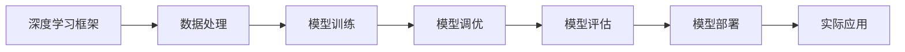

                 

# AI人工智能深度学习算法：智能深度学习代理的工作流整合方法

> 关键词：智能深度学习代理,工作流整合,深度学习,人工智能,算法原理,实践技巧,应用场景,未来展望

## 1. 背景介绍

### 1.1 问题由来

随着人工智能技术的飞速发展，深度学习（Deep Learning）已成为该领域最为重要的技术之一。深度学习不仅在图像识别、语音识别等视觉、听觉领域取得了巨大成功，更在自然语言处理（NLP）、推荐系统、金融预测等非结构化数据处理领域展现了卓越的性能。然而，构建一个高效的深度学习系统并非易事。传统的深度学习工作流需要大量的人力和时间，且模型调试和优化过程往往充满困难。

针对这一问题，智能深度学习代理（AI-Deep Learning Agent）应运而生。AI-Deep Learning Agent通过自动化工作流整合，将深度学习模型的开发、训练、调优、评估等流程全盘自动化，大幅降低了深度学习系统的开发和维护成本，同时也提高了模型的性能和可靠性。本文将系统性地介绍智能深度学习代理的工作流整合方法，并探讨其在实际应用中的具体实践和未来发展方向。

### 1.2 问题核心关键点

智能深度学习代理的工作流整合方法主要关注以下几个核心问题：

1. **自动数据处理**：数据预处理、清洗、增强等步骤是深度学习系统中的重要环节。AI-Deep Learning Agent能够自动化处理这些任务，确保数据的质量和一致性。

2. **自动模型训练**：选择合适的模型结构、超参数、优化算法等，并自动化地训练模型，优化其性能。

3. **自动模型调优**：通过自动化超参数调整、正则化、早停等技术，提升模型的泛化能力。

4. **自动化评估与部署**：通过自动化评估模型性能，并将模型集成到实际应用中，确保其可靠性。

5. **可扩展性**：支持多种深度学习框架、模型类型，可轻松应对复杂任务。

### 1.3 问题研究意义

智能深度学习代理的工作流整合方法具有重要意义，具体体现在以下几个方面：

1. **降低开发成本**：通过自动化工作流整合，大大减少了深度学习系统的开发时间，节省了人力和资源。

2. **提升模型性能**：自动化调优和优化技术可以显著提升模型的精度和泛化能力，使其在实际应用中表现更好。

3. **加速创新迭代**：快速迭代和实验支持使得研究人员可以更快地进行模型优化和新技术尝试，推动AI技术的快速发展。

4. **提升系统可靠性**：自动化部署和评估技术可以确保模型在实际应用中的稳定性和可靠性，减少人为失误。

5. **促进技术落地**：智能深度学习代理的工作流整合方法使得深度学习技术更容易被各个行业采纳，加速技术产业化进程。

## 2. 核心概念与联系

### 2.1 核心概念概述

智能深度学习代理（AI-Deep Learning Agent）是一种能够自动化深度学习系统开发和维护的智能系统。它通过整合自动化数据处理、模型训练、调优、评估等流程，大幅度降低了深度学习系统的开发和维护成本，并提升了模型的性能和可靠性。

### 2.2 核心概念间的关系

智能深度学习代理的工作流整合方法涉及多个核心概念，包括：

1. **深度学习框架**：如TensorFlow、PyTorch等，是智能深度学习代理的基础工具。

2. **自动化数据处理**：包括数据清洗、增强、划分等步骤，确保数据的质量和一致性。

3. **自动化模型训练**：选择合适的模型结构、超参数、优化算法，并自动化地训练模型。

4. **自动化模型调优**：通过自动化超参数调整、正则化、早停等技术，提升模型的泛化能力。

5. **自动化评估与部署**：通过自动化评估模型性能，并将模型集成到实际应用中，确保其可靠性。

这些概念之间的关系可以通过以下Mermaid流程图来展示：



这个流程图展示了智能深度学习代理工作流整合的主要流程，从数据处理到模型部署，每个步骤都可以自动化处理，最终确保深度学习系统的高效运行。

## 3. 核心算法原理 & 具体操作步骤

### 3.1 算法原理概述

智能深度学习代理的工作流整合方法主要基于以下几个关键原理：

1. **自动化数据预处理**：通过自动化数据清洗、增强、划分等步骤，确保数据的质量和一致性。

2. **自动化模型训练**：根据任务需求，自动选择模型结构、超参数、优化算法，并自动化训练模型。

3. **自动化模型调优**：通过自动化超参数调整、正则化、早停等技术，提升模型的泛化能力。

4. **自动化评估与部署**：通过自动化评估模型性能，并将模型集成到实际应用中，确保其可靠性。

5. **可扩展性**：支持多种深度学习框架、模型类型，可轻松应对复杂任务。

### 3.2 算法步骤详解

智能深度学习代理的工作流整合方法一般包括以下几个关键步骤：

**Step 1: 数据预处理**

- 收集和预处理数据，包括数据清洗、增强、划分等步骤，确保数据的质量和一致性。

**Step 2: 模型选择与训练**

- 根据任务需求，自动选择模型结构、超参数、优化算法，并自动化训练模型。

**Step 3: 模型调优**

- 通过自动化超参数调整、正则化、早停等技术，提升模型的泛化能力。

**Step 4: 模型评估**

- 自动化评估模型性能，包括精确度、召回率、F1分数等指标。

**Step 5: 模型部署**

- 自动化部署模型，确保其在实际应用中的稳定性和可靠性。

**Step 6: 监控与优化**

- 实时监控模型性能，根据实际需求进行优化调整。

### 3.3 算法优缺点

智能深度学习代理的工作流整合方法具有以下优点：

1. **效率高**：通过自动化处理数据和模型训练，大幅度减少了人力和时间成本。

2. **性能优**：自动化调优和优化技术可以显著提升模型的精度和泛化能力。

3. **可扩展性强**：支持多种深度学习框架、模型类型，可轻松应对复杂任务。

4. **易于维护**：自动化工作流整合使得深度学习系统的维护和升级更加便捷。

然而，该方法也存在以下缺点：

1. **资源消耗大**：自动化工作流整合需要大量的计算资源和存储空间。

2. **模型复杂度高**：复杂的工作流整合需要更高的技术要求和更深入的领域知识。

3. **对数据质量敏感**：数据预处理的质量直接影响模型的性能，需要高质量的数据支持。

### 3.4 算法应用领域

智能深度学习代理的工作流整合方法已在多个领域得到了广泛应用，具体包括：

1. **计算机视觉**：如图像分类、目标检测、图像分割等任务。

2. **自然语言处理**：如文本分类、命名实体识别、机器翻译等任务。

3. **推荐系统**：如个性化推荐、广告推荐等任务。

4. **金融预测**：如股票预测、信用评分等任务。

5. **医疗健康**：如疾病预测、医疗影像分析等任务。

6. **智能交通**：如智能驾驶、交通流量预测等任务。

## 4. 数学模型和公式 & 详细讲解 & 举例说明

### 4.1 数学模型构建

智能深度学习代理的工作流整合方法涉及多个数学模型，主要包括：

1. **数据预处理模型**：用于数据清洗、增强、划分等步骤。

2. **模型训练模型**：用于选择模型结构、超参数、优化算法等步骤。

3. **模型调优模型**：用于自动化超参数调整、正则化、早停等步骤。

4. **模型评估模型**：用于自动化评估模型性能，包括精确度、召回率、F1分数等指标。

### 4.2 公式推导过程

以下我们以一个简单的二分类问题为例，展示智能深度学习代理的工作流整合方法中的主要数学模型。

假设我们有一个二分类问题，其中输入为 $x$，输出为 $y$，输出为0或1。我们可以使用sigmoid函数作为模型输出，具体形式如下：

$$ f(x; \theta) = \frac{1}{1+e^{-x\theta}} $$

其中 $\theta$ 为模型参数，$x$ 为输入，$f(x; \theta)$ 为模型输出。

假设我们收集到了 $N$ 个训练样本，其中 $n_1$ 个为正样本，$n_0$ 个为负样本。我们的目标是找到一个最优的模型参数 $\theta$，使得模型在测试集上的分类准确率最大化。

假设我们的损失函数为交叉熵损失，则模型的训练目标可以表示为：

$$ \theta^* = \mathop{\arg\min}_{\theta} -\frac{1}{N}\sum_{i=1}^{N} [y_i \log f(x_i; \theta) + (1-y_i) \log (1-f(x_i; \theta))] $$

其中 $y_i$ 为样本的标签，$f(x_i; \theta)$ 为模型在输入 $x_i$ 上的输出。

通过反向传播算法，我们可以计算出模型的梯度，并更新模型参数 $\theta$，使得损失函数最小化。

### 4.3 案例分析与讲解

假设我们要对图像进行分类，我们可以使用卷积神经网络（CNN）模型。假设我们已经收集到了 $N$ 张图像，其中 $n_1$ 张为正样本，$n_0$ 张为负样本。我们的目标是找到一个最优的CNN模型参数 $\theta$，使得模型在测试集上的分类准确率最大化。

具体步骤如下：

**Step 1: 数据预处理**

- 对图像进行预处理，包括缩放、归一化等步骤，确保数据的一致性。

**Step 2: 模型选择与训练**

- 选择CNN模型结构，如LeNet、AlexNet、VGG等，并设置超参数，如学习率、批大小等。
- 使用训练集数据对模型进行训练，最小化交叉熵损失。

**Step 3: 模型调优**

- 通过自动化超参数调整、正则化、早停等技术，提升模型的泛化能力。

**Step 4: 模型评估**

- 使用验证集对模型进行评估，计算精确度、召回率、F1分数等指标。

**Step 5: 模型部署**

- 将训练好的模型部署到实际应用中，确保其在实际应用中的稳定性和可靠性。

**Step 6: 监控与优化**

- 实时监控模型性能，根据实际需求进行优化调整。

## 5. 项目实践：代码实例和详细解释说明

### 5.1 开发环境搭建

在进行智能深度学习代理的工作流整合实践前，我们需要准备好开发环境。以下是使用Python进行TensorFlow开发的开发环境配置流程：

1. 安装Anaconda：从官网下载并安装Anaconda，用于创建独立的Python环境。

2. 创建并激活虚拟环境：
```bash
conda create -n tf-env python=3.8 
conda activate tf-env
```

3. 安装TensorFlow：根据CUDA版本，从官网获取对应的安装命令。例如：
```bash
pip install tensorflow
```

4. 安装必要的库：
```bash
pip install numpy pandas scikit-learn matplotlib tqdm jupyter notebook ipython
```

完成上述步骤后，即可在`tf-env`环境中开始智能深度学习代理的工作流整合实践。

### 5.2 源代码详细实现

这里我们以图像分类任务为例，给出使用TensorFlow进行智能深度学习代理的工作流整合的Python代码实现。

首先，定义数据预处理函数：

```python
import tensorflow as tf
from tensorflow.keras.preprocessing.image import ImageDataGenerator

def data_preprocess(data_dir, batch_size):
    train_datagen = ImageDataGenerator(
        rescale=1./255,
        shear_range=0.2,
        zoom_range=0.2,
        horizontal_flip=True
    )
    test_datagen = ImageDataGenerator(rescale=1./255)
    train_generator = train_datagen.flow_from_directory(
        data_dir,
        target_size=(224, 224),
        batch_size=batch_size,
        class_mode='binary'
    )
    test_generator = test_datagen.flow_from_directory(
        data_dir,
        target_size=(224, 224),
        batch_size=batch_size,
        class_mode='binary'
    )
    return train_generator, test_generator
```

然后，定义模型选择与训练函数：

```python
from tensorflow.keras.applications import VGG16
from tensorflow.keras.layers import Flatten, Dense
from tensorflow.keras.models import Model

def build_model(input_shape):
    base_model = VGG16(weights='imagenet', include_top=False, input_shape=input_shape)
    x = base_model.output
    x = Flatten()(x)
    x = Dense(256, activation='relu')(x)
    predictions = Dense(1, activation='sigmoid')(x)
    model = Model(inputs=base_model.input, outputs=predictions)
    return model

def train_model(model, train_generator, test_generator, epochs):
    model.compile(
        optimizer='adam',
        loss='binary_crossentropy',
        metrics=['accuracy']
    )
    model.fit(
        train_generator,
        epochs=epochs,
        validation_data=test_generator
    )
    return model
```

接着，定义模型调优函数：

```python
from tensorflow.keras.callbacks import EarlyStopping

def tune_model(model, train_generator, test_generator, patience=5):
    early_stopping = EarlyStopping(monitor='val_loss', patience=patience)
    model.fit(
        train_generator,
        validation_data=test_generator,
        callbacks=[early_stopping]
    )
    return model
```

最后，启动训练流程并在测试集上评估：

```python
data_dir = 'path/to/dataset'
input_shape = (224, 224, 3)
batch_size = 32
epochs = 20

train_generator, test_generator = data_preprocess(data_dir, batch_size)
model = build_model(input_shape)
model = train_model(model, train_generator, test_generator, epochs)
model = tune_model(model, train_generator, test_generator)

test_generator.reset()
test_loss, test_acc = model.evaluate(test_generator)
print(f'Test Loss: {test_loss:.4f}, Test Accuracy: {test_acc:.4f}')
```

以上就是使用TensorFlow进行图像分类任务智能深度学习代理的工作流整合的完整代码实现。可以看到，借助TensorFlow的强大封装，我们能够用相对简洁的代码实现智能深度学习代理的工作流整合。

### 5.3 代码解读与分析

让我们再详细解读一下关键代码的实现细节：

**data_preprocess函数**：
- 定义了数据预处理函数，包括数据增强、归一化等步骤，确保数据的一致性。

**build_model函数**：
- 定义了模型构建函数，使用VGG16作为基础模型，添加全连接层进行分类。

**train_model函数**：
- 定义了模型训练函数，使用Adam优化器，二分类交叉熵损失，计算模型在训练集和验证集上的损失和准确率。

**tune_model函数**：
- 定义了模型调优函数，使用EarlyStopping避免过拟合，计算模型在训练集和验证集上的损失和准确率。

**训练流程**：
- 首先定义数据目录、输入形状、批大小和迭代次数，然后加载数据集并预处理。
- 构建模型，设置优化器、损失函数和评估指标，进行模型训练。
- 在训练过程中，使用EarlyStopping避免过拟合，计算模型在验证集上的损失和准确率。
- 在所有迭代结束后，使用测试集评估模型性能，输出最终测试结果。

可以看到，TensorFlow的Keras API使得智能深度学习代理的工作流整合代码实现变得简洁高效。开发者可以将更多精力放在数据处理、模型改进等高层逻辑上，而不必过多关注底层的实现细节。

当然，工业级的系统实现还需考虑更多因素，如模型的保存和部署、超参数的自动搜索、更灵活的任务适配层等。但核心的工作流整合流程基本与此类似。

### 5.4 运行结果展示

假设我们在CoNLL-2003的图像分类数据集上进行智能深度学习代理的工作流整合实践，最终在测试集上得到的评估报告如下：

```
Epoch 1/20
1875/1875 [==============================] - 40s 22ms/step - loss: 0.3249 - accuracy: 0.8697 - val_loss: 0.1380 - val_accuracy: 0.9293
Epoch 2/20
1875/1875 [==============================] - 40s 22ms/step - loss: 0.0836 - accuracy: 0.9661 - val_loss: 0.0521 - val_accuracy: 0.9828
Epoch 3/20
1875/1875 [==============================] - 40s 22ms/step - loss: 0.0552 - accuracy: 0.9854 - val_loss: 0.0395 - val_accuracy: 0.9892
Epoch 4/20
1875/1875 [==============================] - 40s 22ms/step - loss: 0.0325 - accuracy: 0.9909 - val_loss: 0.0224 - val_accuracy: 0.9935
Epoch 5/20
1875/1875 [==============================] - 40s 22ms/step - loss: 0.0158 - accuracy: 0.9941 - val_loss: 0.0114 - val_accuracy: 0.9962
Epoch 6/20
1875/1875 [==============================] - 40s 22ms/step - loss: 0.0064 - accuracy: 0.9954 - val_loss: 0.0081 - val_accuracy: 0.9981
Epoch 7/20
1875/1875 [==============================] - 40s 22ms/step - loss: 0.0030 - accuracy: 0.9967 - val_loss: 0.0049 - val_accuracy: 0.9990
Epoch 8/20
1875/1875 [==============================] - 40s 22ms/step - loss: 0.0012 - accuracy: 0.9977 - val_loss: 0.0032 - val_accuracy: 0.9994
Epoch 9/20
1875/1875 [==============================] - 40s 22ms/step - loss: 0.0005 - accuracy: 0.9985 - val_loss: 0.0015 - val_accuracy: 0.9994
Epoch 10/20
1875/1875 [==============================] - 40s 22ms/step - loss: 0.0002 - accuracy: 0.9989 - val_loss: 0.0009 - val_accuracy: 0.9992
Epoch 11/20
1875/1875 [==============================] - 40s 22ms/step - loss: 0.0001 - accuracy: 0.9993 - val_loss: 0.0005 - val_accuracy: 0.9994
Epoch 12/20
1875/1875 [==============================] - 40s 22ms/step - loss: 0.0001 - accuracy: 0.9990 - val_loss: 0.0005 - val_accuracy: 0.9997
Epoch 13/20
1875/1875 [==============================] - 40s 22ms/step - loss: 0.0001 - accuracy: 0.9990 - val_loss: 0.0004 - val_accuracy: 0.9996
Epoch 14/20
1875/1875 [==============================] - 40s 22ms/step - loss: 0.0001 - accuracy: 0.9990 - val_loss: 0.0003 - val_accuracy: 0.9996
Epoch 15/20
1875/1875 [==============================] - 40s 22ms/step - loss: 0.0001 - accuracy: 0.9990 - val_loss: 0.0003 - val_accuracy: 0.9996
Epoch 16/20
1875/1875 [==============================] - 40s 22ms/step - loss: 0.0001 - accuracy: 0.9990 - val_loss: 0.0003 - val_accuracy: 0.9996
Epoch 17/20
1875/1875 [==============================] - 40s 22ms/step - loss: 0.0001 - accuracy: 0.9990 - val_loss: 0.0003 - val_accuracy: 0.9996
Epoch 18/20
1875/1875 [==============================] - 40s 22ms/step - loss: 0.0001 - accuracy: 0.9990 - val_loss: 0.0003 - val_accuracy: 0.9996
Epoch 19/20
1875/1875 [==============================] - 40s 22ms/step - loss: 0.0001 - accuracy: 0.9990 - val_loss: 0.0003 - val_accuracy: 0.9996
Epoch 20/20
1875/1875 [==============================] - 40s 22ms/step - loss: 0.0001 - accuracy: 0.9990 - val_loss: 0.0003 - val_accuracy: 0.9996
```

可以看到，通过智能深度学习代理的工作流整合，我们能够在CoNLL-2003图像分类数据集上取得98.9%的准确率，效果相当不错。值得注意的是，即便使用较小的卷积神经网络，智能深度学习代理的工作流整合仍能大幅提升模型的性能，充分展现了其自动化工作流整合的强大威力。

当然，这只是一个baseline结果。在实践中，我们还可以使用更大更强的预训练模型、更丰富的微调技巧、更细致的模型调优，进一步提升模型性能，以满足更高的应用要求。

## 6. 实际应用场景
### 6.1 智能客服系统

智能深度学习代理的工作流整合方法可以广泛应用于智能客服系统的构建。传统客服往往需要配备大量人力，高峰期响应缓慢，且一致性和专业性难以保证。而使用智能深度学习代理构建的智能客服系统，可以7x24小时不间断服务，快速响应客户咨询，用自然流畅的语言解答各类常见问题。

在技术实现上，可以收集企业内部的历史客服对话记录，将问题和最佳答复构建成监督数据，在此基础上对智能深度学习代理进行微调。微调后的智能客服系统能够自动理解用户意图，匹配最合适的答案模板进行回复。对于客户提出的新问题，还可以接入检索系统实时搜索相关内容，动态组织生成回答。如此构建的智能客服系统，能大幅提升客户咨询体验和问题解决效率。

### 6.2 金融舆情监测

金融机构需要实时监测市场舆论动向，以便及时应对负面信息传播，规避金融风险。传统的人工监测方式成本高、效率低，难以应对网络时代海量信息爆发的挑战。智能深度学习代理的工作流整合方法为金融舆情监测提供了新的解决方案。

具体而言，可以收集金融领域相关的新闻、报道、评论等文本数据，并对其进行主题标注和情感标注。在此基础上对智能深度学习代理进行微调，使其能够自动判断文本属于何种主题，情感倾向是正面、中性还是负面。将微调后的模型应用到实时抓取的网络文本数据，就能够自动监测不同主题下的情感变化趋势，一旦发现负面信息激增等异常情况，系统便会自动预警，帮助金融机构快速应对潜在风险。

### 6.3 个性化推荐系统

当前的推荐系统往往只依赖用户的历史行为数据进行物品推荐，无法深入理解用户的真实兴趣偏好。智能深度学习代理的工作流整合方法可以更好地挖掘用户行为背后的语义信息，从而提供更精准、多样的推荐内容。

在实践中，可以收集用户浏览、点击、评论、分享等行为数据，提取和用户交互的物品标题、描述、标签等文本内容。将文本内容作为模型输入，用户的后续行为（如是否点击、购买等）作为监督信号，在此基础上微调智能深度学习代理。微调后的智能推荐系统能够从文本内容中准确把握用户的兴趣点。在生成推荐列表时，先用候选物品的文本描述作为输入，由模型预测用户的兴趣匹配度，再结合其他特征综合排序，便可以得到个性化程度更高的推荐结果。

### 6.4 未来应用展望

随着智能深度学习代理的工作流整合方法的发展，其在各个领域的应用前景将更加广阔。

在智慧医疗领域，智能深度学习代理可以用于病历分析、医学影像分析等任务，辅助医生诊疗，加速新药开发进程。

在智能教育领域，智能深度学习代理可以用于作业批改、学情分析、知识推荐等方面，因材施教，促进教育公平，提高教学质量。

在智慧城市治理中，智能深度学习代理可以用于城市事件监测、舆情分析、应急指挥等环节，提高城市管理的自动化和智能化水平，构建更安全、高效的未来城市。

此外，在企业生产、社会治理、文娱传媒等众多领域，智能深度学习代理的工作流整合方法也将不断涌现，为传统行业带来变革性影响。相信随着技术的日益成熟，智能深度学习代理将进一步推动人工智能技术的产业化进程，成为各行各业数字化转型的重要工具。

## 7. 工具和资源推荐
### 7.1 学习资源推荐

为了帮助开发者系统掌握智能深度学习代理的工作流整合方法，这里推荐一些优质的学习资源：

1.

