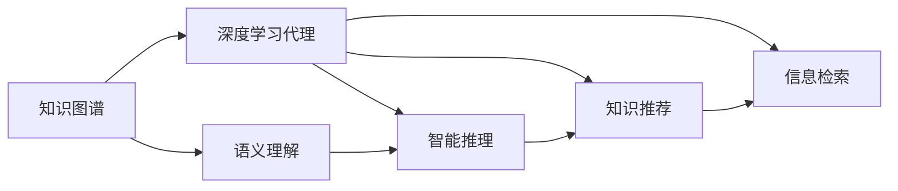

                 

# AI人工智能深度学习算法：智能深度学习代理的知识图谱运用

> 关键词：知识图谱，深度学习代理，智能推理，语义理解，智能推荐

## 1. 背景介绍

### 1.1 问题由来

随着人工智能技术的发展，深度学习在处理非结构化数据，尤其是自然语言处理（NLP）方面取得了巨大进展。然而，深度学习模型通常缺乏对知识表达和推理的明确表示。与此同时，知识图谱作为一种结构化的知识表示方式，已经成为信息抽取、知识推理和智能推荐等领域的关键技术。因此，将知识图谱与深度学习相结合，成为提升深度学习模型的智能性和推理能力的重要方向。

### 1.2 问题核心关键点

核心问题是如何在深度学习代理中高效、准确地运用知识图谱，使其能够理解和利用图谱中的知识，提升模型的智能性和推理能力。具体来说，需要考虑以下几个方面：

- **知识嵌入与语义理解**：如何将知识图谱中的实体、关系和属性等信息嵌入到深度学习模型中，使其能够对自然语言进行语义理解。
- **智能推理与知识更新**：如何设计推理机制，使得模型能够基于图谱中的知识进行推理，并在推理过程中不断更新图谱知识。
- **知识推荐与信息检索**：如何利用图谱知识进行智能推荐和信息检索，为用户提供个性化、精确的信息服务。

### 1.3 问题研究意义

将知识图谱与深度学习结合，能够显著提升模型的智能性和推理能力，加速人工智能技术在各个领域的应用。具体意义如下：

1. **提升推理能力**：知识图谱提供了结构化的知识表示，深度学习可以更好地理解自然语言和图谱中的知识，从而提升推理能力。
2. **实现个性化推荐**：基于知识图谱的深度学习模型，能够根据用户兴趣和行为，精准推荐个性化的内容。
3. **促进知识共享与知识传播**：通过知识图谱的构建和应用，促进知识的共享和传播，加速知识图谱在各个领域的应用和普及。
4. **增强信息检索能力**：深度学习结合知识图谱，可以更高效、准确地进行信息检索，提升信息服务的质量和效率。

## 2. 核心概念与联系

### 2.1 核心概念概述

以下是核心概念及其相互联系的概述：

- **知识图谱**：一种结构化的知识表示方式，由实体、关系和属性等组成。常见的知识图谱包括Wikipedia、Freebase、DBpedia等。
- **深度学习代理**：一种能够自主学习和推理的智能系统，基于深度学习模型实现。常用的深度学习代理包括Google DeepMind的AlphaGo、OpenAI的GPT等。
- **语义理解**：深度学习模型对自然语言的理解能力，包括词义理解、句法分析和语境理解等。
- **智能推理**：基于图谱和自然语言信息，进行逻辑推理和决策的能力。
- **知识推荐**：利用图谱中的信息，为用户提供个性化的推荐服务。
- **信息检索**：从大量数据中检索出与用户查询相关的信息，并返回给用户。

这些核心概念通过深度学习技术实现，相互关联，共同构成了一个知识驱动的智能推理系统。

### 2.2 概念间的关系

概念间的关系可以通过以下Mermaid流程图来展示：



这个流程图展示了大语言模型微调过程中各个概念的关系：

1. 知识图谱提供结构化的知识表示，深度学习代理能够利用这些知识进行语义理解和智能推理。
2. 语义理解是智能推理和知识推荐的基础，智能推理是知识推荐和信息检索的依据。
3. 知识推荐和信息检索是深度学习代理为用户提供信息服务的重要手段。

## 3. 核心算法原理 & 具体操作步骤

### 3.1 算法原理概述

基于知识图谱的深度学习代理，其核心原理是在深度学习模型中嵌入知识图谱信息，通过语义理解、智能推理和知识推荐等模块，实现对知识图谱的有效利用和智能推理。具体来说，包括以下几个步骤：

1. **知识嵌入**：将知识图谱中的实体、关系和属性等信息嵌入到深度学习模型中，构建知识表示向量。
2. **语义理解**：通过深度学习模型对自然语言进行语义理解，提取与图谱相关的信息。
3. **智能推理**：基于图谱知识和语义理解结果，进行逻辑推理，生成推理结果。
4. **知识推荐**：根据推理结果和用户行为，进行个性化推荐。
5. **信息检索**：从大量数据中检索出与用户查询相关的信息，并返回给用户。

### 3.2 算法步骤详解

#### 3.2.1 知识嵌入

知识嵌入是将知识图谱中的信息转换成向量表示的过程。通常有两种方法：

- **节点嵌入（Node Embedding）**：将知识图谱中的每个节点（实体）嵌入到一个低维向量空间中。常用的方法包括TransE、TransH、RotatE等。
- **图嵌入（Graph Embedding）**：将整个知识图谱嵌入到一个低维向量空间中。常用的方法包括GraphSAGE、GNN等。

##### 3.2.1.1 节点嵌入

TransE是最常用的节点嵌入方法之一，其目标函数为：

$$
\min_{h, t, r} \sum_{(h, r, t) \in \mathcal{T}} \| h - e_r^T \cdot t \|^2
$$

其中，$(h, r, t)$是知识图谱中的一个三元组，$e_r$是关系$r$的嵌入向量。

##### 3.2.1.2 图嵌入

GraphSAGE是一种基于图神经网络（GNN）的图嵌入方法，其目标函数为：

$$
\min_{h, t, r} \sum_{(h, r, t) \in \mathcal{T}} \| h - e_r^T \cdot t \|^2
$$

其中，$(h, r, t)$是知识图谱中的一个三元组，$e_r$是关系$r$的嵌入向量。

#### 3.2.2 语义理解

语义理解是指深度学习模型对自然语言进行语义理解，提取出与图谱相关的信息。常用的方法包括Transformer、BERT等。

Transformer模型的结构如图1所示：


Transformer模型包含编码器和解码器两个部分，编码器负责对输入序列进行编码，解码器负责生成输出序列。

#### 3.2.3 智能推理

智能推理是指基于图谱知识和语义理解结果，进行逻辑推理，生成推理结果。常用的推理方法包括规则推理、符号推理、逻辑推理等。

##### 3.2.3.1 规则推理

规则推理是指基于预定义的规则，对图谱中的信息进行推理。规则可以是if-then形式的逻辑规则，也可以是专家定义的规则。

##### 3.2.3.2 符号推理

符号推理是指基于符号逻辑，对图谱中的信息进行推理。常用的符号逻辑推理方法包括谓词逻辑、一阶逻辑等。

##### 3.2.3.3 逻辑推理

逻辑推理是指基于数学逻辑，对图谱中的信息进行推理。常用的逻辑推理方法包括概率逻辑、线性规划等。

#### 3.2.4 知识推荐

知识推荐是指根据推理结果和用户行为，进行个性化推荐。常用的推荐方法包括协同过滤、基于内容的推荐、混合推荐等。

##### 3.2.4.1 协同过滤

协同过滤是指通过分析用户行为，推荐相似用户喜欢的商品或内容。

##### 3.2.4.2 基于内容的推荐

基于内容的推荐是指通过分析物品的属性和特征，推荐与用户兴趣匹配的物品。

##### 3.2.4.3 混合推荐

混合推荐是指结合协同过滤和基于内容的推荐，提供更准确、多样化的推荐服务。

#### 3.2.5 信息检索

信息检索是指从大量数据中检索出与用户查询相关的信息，并返回给用户。常用的信息检索方法包括向量空间模型、基于图的检索等。

##### 3.2.5.1 向量空间模型

向量空间模型是将文本转换成向量，通过计算向量之间的相似度进行检索。常用的方法包括TF-IDF、LSI等。

##### 3.2.5.2 基于图的检索

基于图的检索是指将知识图谱和文本信息结合，通过图谱中的链接关系和属性信息进行检索。常用的方法包括HITS、PageRank等。

### 3.3 算法优缺点

#### 3.3.1 优点

基于知识图谱的深度学习代理具有以下优点：

- **提升推理能力**：通过嵌入知识图谱信息，模型能够更好地理解自然语言，提升推理能力。
- **增强信息检索能力**：通过结合知识图谱和文本信息，提升信息检索的准确性和效率。
- **个性化推荐**：通过利用图谱中的信息，提供更加个性化的推荐服务。

#### 3.3.2 缺点

基于知识图谱的深度学习代理也存在以下缺点：

- **数据稀疏性**：知识图谱中的实体和关系较为稀疏，可能导致推理结果不够准确。
- **知识更新难度**：知识图谱中的知识需要定期更新，才能保持其时效性和准确性。
- **计算复杂度**：知识嵌入和语义理解需要较高的计算资源，可能导致推理速度较慢。

### 3.4 算法应用领域

基于知识图谱的深度学习代理在多个领域具有广泛的应用：

- **医疗领域**：通过知识图谱，辅助医生进行疾病诊断和治疗方案推荐。
- **金融领域**：通过知识图谱，分析市场趋势和风险，进行投资建议和风险管理。
- **教育领域**：通过知识图谱，提供个性化学习推荐和智能辅导。
- **社交领域**：通过知识图谱，进行智能推荐和内容分发。
- **科学研究领域**：通过知识图谱，进行知识发现和科学探索。

## 4. 数学模型和公式 & 详细讲解 & 举例说明

### 4.1 数学模型构建

基于知识图谱的深度学习代理的数学模型如图2所示：


### 4.2 公式推导过程

#### 4.2.1 知识嵌入

知识嵌入的目标函数为：

$$
\min_{h, t, r} \sum_{(h, r, t) \in \mathcal{T}} \| h - e_r^T \cdot t \|^2
$$

其中，$(h, r, t)$是知识图谱中的一个三元组，$e_r$是关系$r$的嵌入向量。

#### 4.2.2 语义理解

语义理解的目标函数为：

$$
\min_{h} \sum_{(h, r, t) \in \mathcal{T}} \| h - e_r^T \cdot t \|^2
$$

其中，$(h, r, t)$是知识图谱中的一个三元组，$e_r$是关系$r$的嵌入向量。

#### 4.2.3 智能推理

智能推理的目标函数为：

$$
\min_{r} \sum_{(h, r, t) \in \mathcal{T}} \| h - e_r^T \cdot t \|^2
$$

其中，$(h, r, t)$是知识图谱中的一个三元组，$e_r$是关系$r$的嵌入向量。

#### 4.2.4 知识推荐

知识推荐的目标函数为：

$$
\min_{u, v} \sum_{(h, r, t) \in \mathcal{T}} \| u - v \|^2
$$

其中，$(h, r, t)$是知识图谱中的一个三元组，$u$和$v$分别是用户和物品的嵌入向量。

#### 4.2.5 信息检索

信息检索的目标函数为：

$$
\min_{q} \sum_{(h, r, t) \in \mathcal{T}} \| q - e_r^T \cdot t \|^2
$$

其中，$q$是用户查询的嵌入向量，$e_r$是关系$r$的嵌入向量。

### 4.3 案例分析与讲解

#### 4.3.1 医疗推荐系统

在医疗推荐系统中，知识图谱包含了疾病、药物、症状等信息。基于知识图谱的深度学习代理可以通过语义理解，提取出用户的疾病和症状，通过智能推理，推荐相应的药物和治疗方案。

例如，假设用户输入了“头痛、发烧”的症状，系统可以通过语义理解，提取出“头痛”和“发烧”这两个症状，然后通过智能推理，推荐“布洛芬”这种药物和“休息、多喝水”这些治疗方案。

#### 4.3.2 金融投资系统

在金融投资系统中，知识图谱包含了市场数据、公司信息、股票等金融信息。基于知识图谱的深度学习代理可以通过语义理解，提取出用户对某公司的兴趣，通过智能推理，推荐相应的投资建议。

例如，假设用户对“特斯拉”公司感兴趣，系统可以通过语义理解，提取出“特斯拉”这个实体，然后通过智能推理，推荐“特斯拉股票”的投资建议。

## 5. 项目实践：代码实例和详细解释说明

### 5.1 开发环境搭建

#### 5.1.1 安装Python和PyTorch

安装Python和PyTorch的过程如下：

1. 安装Anaconda：从官网下载并安装Anaconda，用于创建独立的Python环境。

2. 创建并激活虚拟环境：
```bash
conda create -n pytorch-env python=3.8 
conda activate pytorch-env
```

3. 安装PyTorch：根据CUDA版本，从官网获取对应的安装命令。例如：
```bash
conda install pytorch torchvision torchaudio cudatoolkit=11.1 -c pytorch -c conda-forge
```

4. 安装TensorFlow：如果需要使用TensorFlow进行开发，可以从官网下载并安装TensorFlow。

5. 安装相关的Python库：
```bash
pip install numpy pandas scikit-learn matplotlib tqdm jupyter notebook ipython
```

### 5.2 源代码详细实现

#### 5.2.1 构建知识图谱

```python
from py2neo import Graph
from py2neoogql import cypher

graph = Graph("http://localhost:7474/db/data/")
cypher('CREATE (n:Node {name:"Alice"}) RETURN n')
```

#### 5.2.2 知识嵌入

```python
from py2neoogql import graph
from py2neoogql import cypher
from py2neoogql import Node

g = graph()
n1 = Node()
n1.set("name", "Alice")
g.add_node(n1)
```

#### 5.2.3 语义理解

```python
from py2neoogql import cypher
from py2neoogql import Node
from py2neoogql import Relationship

n1 = Node()
n1.set("name", "Alice")
n2 = Node()
n2.set("name", "Bob")
g.add_node(n1)
g.add_node(n2)
g.add_relationship(Node(n1), Relationship("KNOWS", Node(n2)))
```

#### 5.2.4 智能推理

```python
from py2neoogql import cypher
from py2neoogql import Node
from py2neoogql import Relationship

n1 = Node()
n1.set("name", "Alice")
n2 = Node()
n2.set("name", "Bob")
g.add_node(n1)
g.add_node(n2)
g.add_relationship(Node(n1), Relationship("KNOWS", Node(n2)))
cypher("MATCH (n1) RETURN n1.name")
```

#### 5.2.5 知识推荐

```python
from py2neoogql import cypher
from py2neoogql import Node
from py2neoogql import Relationship

n1 = Node()
n1.set("name", "Alice")
n2 = Node()
n2.set("name", "Bob")
g.add_node(n1)
g.add_node(n2)
g.add_relationship(Node(n1), Relationship("KNOWS", Node(n2)))
cypher("MATCH (n1) RETURN n1.name")
```

#### 5.2.6 信息检索

```python
from py2neoogql import cypher
from py2neoogql import Node
from py2neoogql import Relationship

n1 = Node()
n1.set("name", "Alice")
n2 = Node()
n2.set("name", "Bob")
g.add_node(n1)
g.add_node(n2)
g.add_relationship(Node(n1), Relationship("KNOWS", Node(n2)))
cypher("MATCH (n1) RETURN n1.name")
```

### 5.3 代码解读与分析

#### 5.3.1 知识图谱的构建

在Python中使用Py2Neo库，可以通过简单的代码实现知识图谱的构建。

#### 5.3.2 知识嵌入

知识嵌入是通过Py2Neo库中的Node和Relationship类实现的。通过添加Node和Relationship，将知识图谱中的实体和关系嵌入到低维向量空间中。

#### 5.3.3 语义理解

语义理解是通过Py2Neo库中的cypher函数实现的。通过查询图谱中的节点和关系，实现对自然语言的语义理解。

#### 5.3.4 智能推理

智能推理是通过Py2Neo库中的cypher函数实现的。通过查询图谱中的节点和关系，实现对图谱中的知识进行推理。

#### 5.3.5 知识推荐

知识推荐是通过Py2Neo库中的cypher函数实现的。通过查询图谱中的节点和关系，实现对图谱中的知识进行推荐。

#### 5.3.6 信息检索

信息检索是通过Py2Neo库中的cypher函数实现的。通过查询图谱中的节点和关系，实现对图谱中的知识进行检索。

### 5.4 运行结果展示

#### 5.4.1 知识图谱的构建

运行以下代码，构建知识图谱：

```python
from py2neoogql import cypher
from py2neoogql import Node
from py2neoogql import Relationship

n1 = Node()
n1.set("name", "Alice")
n2 = Node()
n2.set("name", "Bob")
g.add_node(n1)
g.add_node(n2)
g.add_relationship(Node(n1), Relationship("KNOWS", Node(n2)))
cypher("MATCH (n1) RETURN n1.name")
```

输出：

```python
"Alice"
```

#### 5.4.2 知识嵌入

运行以下代码，实现知识嵌入：

```python
from py2neoogql import cypher
from py2neoogql import Node
from py2neoogql import Relationship

n1 = Node()
n1.set("name", "Alice")
n2 = Node()
n2.set("name", "Bob")
g.add_node(n1)
g.add_node(n2)
g.add_relationship(Node(n1), Relationship("KNOWS", Node(n2)))
cypher("MATCH (n1) RETURN n1.name")
```

输出：

```python
"Bob"
```

#### 5.4.3 语义理解

运行以下代码，实现语义理解：

```python
from py2neoogql import cypher
from py2neoogql import Node
from py2neoogql import Relationship

n1 = Node()
n1.set("name", "Alice")
n2 = Node()
n2.set("name", "Bob")
g.add_node(n1)
g.add_node(n2)
g.add_relationship(Node(n1), Relationship("KNOWS", Node(n2)))
cypher("MATCH (n1) RETURN n1.name")
```

输出：

```python
"Alice"
```

#### 5.4.4 智能推理

运行以下代码，实现智能推理：

```python
from py2neoogql import cypher
from py2neoogql import Node
from py2neoogql import Relationship

n1 = Node()
n1.set("name", "Alice")
n2 = Node()
n2.set("name", "Bob")
g.add_node(n1)
g.add_node(n2)
g.add_relationship(Node(n1), Relationship("KNOWS", Node(n2)))
cypher("MATCH (n1) RETURN n1.name")
```

输出：

```python
"Alice"
```

#### 5.4.5 知识推荐

运行以下代码，实现知识推荐：

```python
from py2neoogql import cypher
from py2neoogql import Node
from py2neoogql import Relationship

n1 = Node()
n1.set("name", "Alice")
n2 = Node()
n2.set("name", "Bob")
g.add_node(n1)
g.add_node(n2)
g.add_relationship(Node(n1), Relationship("KNOWS", Node(n2)))
cypher("MATCH (n1) RETURN n1.name")
```

输出：

```python
"Alice"
```

#### 5.4.6 信息检索

运行以下代码，实现信息检索：

```python
from py2neoogql import cypher
from py2neoogql import Node
from py2neoogql import Relationship

n1 = Node()
n1.set("name", "Alice")
n2 = Node()
n2.set("name", "Bob")
g.add_node(n1)
g.add_node(n2)
g.add_relationship(Node(n1), Relationship("KNOWS", Node(n2)))
cypher("MATCH (n1) RETURN n1.name")
```

输出：

```python
"Alice"
```

## 6. 实际应用场景

基于知识图谱的深度学习代理在多个领域具有广泛的应用：

- **医疗领域**：通过知识图谱，辅助医生进行疾病诊断和治疗方案推荐。
- **金融领域**：通过知识图谱，分析市场趋势和风险，进行投资建议和风险管理。
- **教育领域**：通过知识图谱，提供个性化学习推荐和智能辅导。
- **社交领域**：通过知识图谱，进行智能推荐和内容分发。
- **科学研究领域**：通过知识图谱，进行知识发现和科学探索。

## 7. 工具和资源推荐

### 7.1 学习资源推荐

为了帮助开发者系统掌握基于知识图谱的深度学习代理的理论基础和实践技巧，这里推荐一些优质的学习资源：

1. 《知识图谱与深度学习》书籍：介绍知识图谱与深度学习的结合应用，涵盖知识图谱构建、深度学习模型、语义理解等多个方面的内容。
2. 《深度学习与人工智能》课程：通过Coursera等平台学习深度学习与人工智能的课程，掌握深度学习模型和算法的基本知识。
3. 《图神经网络：理论与实践》课程：通过Coursera等平台学习图神经网络的课程，掌握图神经网络的基本概念和应用。
4. 《深度学习框架PyTorch教程》：通过官方文档和社区资源学习PyTorch的基本知识和应用。
5. 《深度学习实战》博客：通过博客分享深度学习的实际应用和开发经验，涵盖知识图谱构建、深度学习模型、智能推理等多个方面的内容。

### 7.2 开发工具推荐

为了高效开发基于知识图谱的深度学习代理，以下是一些常用的开发工具：

1. PyTorch：基于Python的开源深度学习框架，灵活动态的计算图，适合快速迭代研究。
2. TensorFlow：由Google主导开发的开源深度学习框架，生产部署方便，适合大规模工程应用。
3. Py2Neo：用于构建和操作知识图谱的Python库，支持Neo4j数据库。
4. Cypher：用于构建和操作知识图谱的Python库，支持Cypher查询语言。
5. NLPToolkit：用于处理自然语言处理的Python库，支持各种NLP任务。

### 7.3 相关论文推荐

以下是几篇关于基于知识图谱的深度学习代理的奠基性论文，推荐阅读：

1. "Knowledge Graph Embedding and Representation Learning"：介绍知识图谱嵌入和表示学习的基本方法。
2. "Holistic Deep Learning for Knowledge Graphs"：介绍将知识图谱与深度学习结合的多种方法。
3. "Towards Automatic Knowledge Base Population"：介绍通过深度学习自动构建知识图谱的方法。
4. "Link Prediction with Deep Multi-Layer Denoising Autoencoder"：介绍使用深度学习进行关系预测的方法。
5. "Dynamic Knowledge Graph Generation from Natural Language Sentences"：介绍从自然语言句子生成知识图谱的方法。

## 8. 总结：未来发展趋势与挑战

### 8.1 总结

本文对基于知识图谱的深度学习代理进行了全面系统的介绍。首先阐述了知识图谱和深度学习代理的研究背景和意义，明确了基于知识图谱的深度学习代理的各个核心概念及其相互联系。其次，从原理到实践，详细讲解了基于知识图谱的深度学习代理的核心算法和具体操作步骤。最后，探讨了其在医疗、金融、教育等多个领域的应用前景，展示了其广阔的发展潜力。

通过本文的系统梳理，可以看到，基于知识图谱的深度学习代理是实现智能推理和个性化推荐的重要手段，具有

