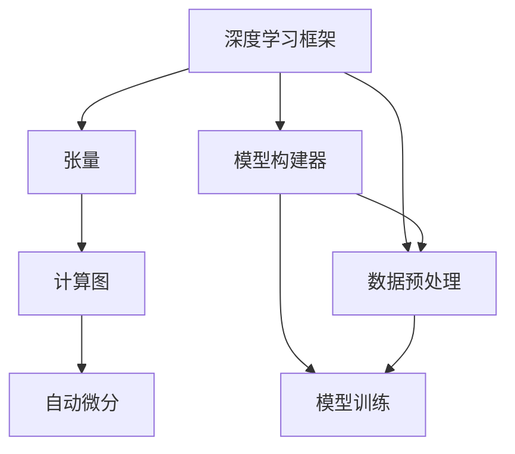
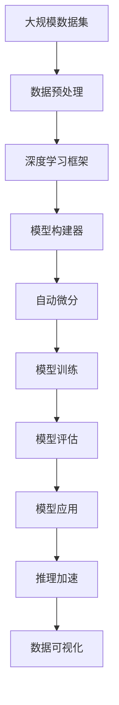

                 

# AI人工智能深度学习算法：深度学习软件框架的掌握与应用

## 1. 背景介绍

### 1.1 问题由来

深度学习作为人工智能（AI）领域的重要分支，近年来取得了巨大的突破。深度学习通过构建多层神经网络，从原始数据中自动学习和提取特征，从而实现图像识别、语音识别、自然语言处理（NLP）等多项人工智能应用。然而，深度学习的核心在于选择合适的软件框架，合理设计网络结构，高效实现算法，才能真正发挥其潜力。

深度学习软件框架的选择和应用，直接影响到模型的训练效率、可维护性和应用效果。目前，市场上主流的深度学习软件框架包括TensorFlow、PyTorch、Keras等。这些框架各有优劣，适合不同场景的应用需求。本文旨在全面阐述深度学习软件框架的原理、使用方法及其应用领域，以期为深度学习从业者提供参考和指导。

### 1.2 问题核心关键点

深度学习软件框架的选择和应用，主要集中在以下几个关键点：

- **框架性能：** 训练速度、推理速度、内存占用等。
- **易用性：** API易用性、模型可视化、调试便捷性等。
- **生态系统：** 社区支持、模型库、工具链等。
- **可扩展性：** 模块化和插件机制，支持新算法的快速集成。
- **算法灵活性：** 支持深度学习算法的广泛性和多样性。

框架性能和易用性是选择框架的基础，生态系统和可扩展性则是实现大规模应用的关键，算法灵活性则是实现创新算法的保障。本文将详细介绍这些核心关键点，并结合实际案例进行讲解。

### 1.3 问题研究意义

深度学习软件框架的掌握与应用，对于推动深度学习技术的产业化、提升模型的训练和推理效率、实现高效的算法创新，具有重要意义：

- **降低开发成本：** 框架提供了丰富的API和工具，大大降低了模型开发和调优的复杂度。
- **提高模型效果：** 框架中的优化算法和数据处理技术，能显著提升模型的训练效果和性能。
- **加速算法创新：** 框架支持多种深度学习算法，便于开发者快速实验和迭代。
- **促进产业应用：** 框架的易用性和可扩展性，使得AI技术更容易被各行各业所采用。

掌握深度学习软件框架，是实现人工智能应用落地的重要一步。未来，随着AI技术的不断成熟，深度学习框架的应用将更加广泛，成为AI产业的核心支撑。

## 2. 核心概念与联系

### 2.1 核心概念概述

为了更好地理解深度学习软件框架的应用，本节将介绍几个关键概念：

- **深度学习框架（Deep Learning Framework）：** 提供深度学习模型的构建、训练和推理功能的软件平台。
- **张量（Tensor）：** 深度学习中的多维数组，用于表示模型的输入、输出和中间结果。
- **计算图（Computation Graph）：** 构建计算流图，描述模型前向传播和反向传播过程。
- **自动微分（Automatic Differentiation）：** 自动计算梯度，加速模型训练。
- **模型构建器（Model Builder）：** 提供API和工具，构建和管理深度学习模型。
- **数据预处理（Data Preprocessing）：** 对输入数据进行归一化、增强、清洗等处理，确保数据质量。

这些概念通过深度学习框架这一核心平台，紧密联系在一起，共同构成深度学习的开发和应用生态。

### 2.2 核心概念间的关系

这些核心概念之间存在着紧密的联系，形成了深度学习的完整开发和应用框架。我们可以通过以下Mermaid流程图来展示这些概念之间的关系：



这个流程图展示了一些关键概念之间的关系：

1. **深度学习框架**：是深度学习开发的核心平台，提供张量、计算图、自动微分等功能。
2. **张量**：作为深度学习中的多维数组，通过框架提供的操作进行计算。
3. **计算图**：描述模型前向传播和反向传播的计算流图，由框架自动构建和优化。
4. **自动微分**：自动计算梯度，加速模型训练过程。
5. **模型构建器**：提供API和工具，帮助开发者构建和管理深度学习模型。
6. **数据预处理**：对输入数据进行清洗、增强等处理，确保数据质量。

这些概念共同构成深度学习的开发和应用框架，使得深度学习模型的训练和推理变得更加高效和便捷。

### 2.3 核心概念的整体架构

最后，我们用一个综合的流程图来展示这些核心概念在大规模深度学习应用中的整体架构：



这个综合流程图展示了从数据预处理到模型应用的完整流程：

1. **大规模数据集**：提供训练和推理所需的数据。
2. **数据预处理**：对原始数据进行清洗、增强等处理。
3. **深度学习框架**：提供张量、计算图、自动微分等功能。
4. **模型构建器**：帮助开发者构建和管理深度学习模型。
5. **自动微分**：自动计算梯度，加速模型训练。
6. **模型训练**：在框架上构建模型，进行参数优化。
7. **模型评估**：对训练好的模型进行评估，确保其性能。
8. **模型应用**：将训练好的模型部署到实际应用中。
9. **推理加速**：对推理过程进行优化，提升推理速度。
10. **数据可视化**：对模型训练和推理过程进行可视化，帮助调试和优化。

通过这些概念的组合，深度学习模型能够高效地实现训练和推理，适应各种应用场景。

## 3. 核心算法原理 & 具体操作步骤
### 3.1 算法原理概述

深度学习软件框架的核心算法原理主要包括以下几个方面：

- **自动微分（Automatic Differentiation）：** 自动计算梯度，用于反向传播算法优化模型参数。
- **动态计算图（Dynamic Computation Graph）：** 根据实际输入动态构建计算图，灵活适应不同模型结构。
- **模型并行（Model Parallelism）：** 将模型划分为多个子模型，并行训练和推理，提升计算效率。
- **优化算法（Optimization Algorithm）：** 如SGD、Adam等，优化模型的参数更新策略。
- **数据增强（Data Augmentation）：** 对训练数据进行随机变换，提高模型泛化能力。

这些核心算法原理通过深度学习框架实现，构建了高效、灵活、稳定的深度学习应用基础。

### 3.2 算法步骤详解

深度学习软件框架的核心算法步骤主要包括：

1. **数据预处理**：对原始数据进行清洗、增强等处理。
2. **模型构建**：使用框架提供的API和工具，构建深度学习模型。
3. **计算图构建**：根据模型定义，动态构建计算图。
4. **自动微分**：计算梯度，进行反向传播。
5. **模型训练**：使用优化算法，更新模型参数。
6. **模型评估**：对训练好的模型进行评估，确保其性能。
7. **模型应用**：将训练好的模型部署到实际应用中，进行推理和预测。

这些步骤在深度学习框架中自动执行，大大简化了模型开发和应用过程。

### 3.3 算法优缺点

深度学习软件框架的优点：

- **高效计算**：通过自动微分和动态计算图，高效计算梯度，加速模型训练和推理。
- **灵活扩展**：支持多种深度学习算法和模型结构，便于算法创新和模型优化。
- **易用性**：提供丰富的API和工具，降低模型开发和调优的复杂度。
- **社区支持**：庞大的社区和生态系统，提供丰富的资源和工具。

深度学习软件框架的缺点：

- **性能瓶颈**：大规模模型和高并发计算对硬件资源要求较高，可能存在性能瓶颈。
- **学习曲线陡峭**：框架功能强大，但需要一定的学习和理解成本。
- **依赖性高**：框架和算法的复杂度较高，对开发者技术要求高。

尽管存在这些缺点，但深度学习框架的优势依然明显，使其在深度学习开发和应用中占据重要地位。

### 3.4 算法应用领域

深度学习软件框架广泛应用于多个领域，包括：

- **计算机视觉**：图像分类、目标检测、人脸识别等。
- **自然语言处理**：语言翻译、文本生成、情感分析等。
- **语音识别**：语音识别、语音合成、情感识别等。
- **推荐系统**：商品推荐、内容推荐、广告推荐等。
- **医学影像**：图像分割、疾病诊断、病理分析等。
- **金融分析**：股票预测、信用评估、风险管理等。

深度学习框架在这些领域的广泛应用，极大地推动了AI技术的产业化进程。

## 4. 数学模型和公式 & 详细讲解 & 举例说明
### 4.1 数学模型构建

在深度学习中，模型的构建通常涉及以下几个数学模型：

- **线性回归模型（Linear Regression）：** 输入和输出之间的线性关系。
- **卷积神经网络（Convolutional Neural Network, CNN）：** 通过卷积操作提取局部特征。
- **循环神经网络（Recurrent Neural Network, RNN）：** 通过时间步操作处理序列数据。
- **自编码器（Autoencoder）：** 通过压缩和重构学习输入数据的特征。
- **生成对抗网络（Generative Adversarial Network, GAN）：** 通过对抗过程生成新数据。

这些数学模型通过深度学习框架实现，用于解决不同的AI应用问题。

### 4.2 公式推导过程

以线性回归模型为例，推导其基本公式：

设输入数据为 $x$，输出数据为 $y$，线性回归模型的参数为 $\theta$。则线性回归模型的目标是最小化损失函数：

$$
\min_{\theta} \frac{1}{2} \sum_{i=1}^{N} (y_i - \theta^T x_i)^2
$$

其中 $N$ 为样本数量，$y_i$ 为第 $i$ 个样本的真实标签，$x_i$ 为第 $i$ 个样本的特征向量，$\theta$ 为模型参数。

通过梯度下降等优化算法，可以求解出最优参数 $\theta$：

$$
\theta \leftarrow \theta - \eta \nabla_{\theta} L(\theta)
$$

其中 $\eta$ 为学习率，$\nabla_{\theta} L(\theta)$ 为损失函数对参数 $\theta$ 的梯度。

### 4.3 案例分析与讲解

线性回归模型是最基础的深度学习模型，用于解决回归问题。例如，可以使用线性回归模型预测房价：

- **数据预处理**：收集房屋面积、地理位置、房屋年代等特征，处理缺失值和异常值。
- **模型构建**：使用框架提供的API，构建线性回归模型。
- **计算图构建**：根据模型定义，动态构建计算图。
- **自动微分**：计算梯度，进行反向传播。
- **模型训练**：使用梯度下降算法，更新模型参数。
- **模型评估**：对训练好的模型进行评估，确保其性能。
- **模型应用**：将训练好的模型部署到实际应用中，进行房价预测。

通过以上步骤，可以高效地构建和使用线性回归模型，解决实际问题。

## 5. 项目实践：代码实例和详细解释说明
### 5.1 开发环境搭建

在进行深度学习项目实践前，我们需要准备好开发环境。以下是使用Python进行TensorFlow开发的环境配置流程：

1. 安装Anaconda：从官网下载并安装Anaconda，用于创建独立的Python环境。

2. 创建并激活虚拟环境：
```bash
conda create -n tf-env python=3.8 
conda activate tf-env
```

3. 安装TensorFlow：根据CUDA版本，从官网获取对应的安装命令。例如：
```bash
pip install tensorflow
```

4. 安装各类工具包：
```bash
pip install numpy pandas scikit-learn matplotlib tqdm jupyter notebook ipython
```

完成上述步骤后，即可在`tf-env`环境中开始深度学习项目实践。

### 5.2 源代码详细实现

下面我们以图像分类任务为例，给出使用TensorFlow进行卷积神经网络（CNN）的代码实现。

首先，定义CNN模型：

```python
import tensorflow as tf

model = tf.keras.Sequential([
    tf.keras.layers.Conv2D(32, (3, 3), activation='relu', input_shape=(28, 28, 1)),
    tf.keras.layers.MaxPooling2D((2, 2)),
    tf.keras.layers.Flatten(),
    tf.keras.layers.Dense(10, activation='softmax')
])
```

然后，定义训练和评估函数：

```python
train_dataset = tf.keras.datasets.mnist.load_data()
(x_train, y_train), (x_test, y_test) = train_dataset

model.compile(optimizer='adam', loss='sparse_categorical_crossentropy', metrics=['accuracy'])

model.fit(x_train, y_train, epochs=5, validation_data=(x_test, y_test))

test_loss, test_acc = model.evaluate(x_test, y_test)
print('Test accuracy:', test_acc)
```

最后，启动训练流程：

```python
model.fit(x_train, y_train, epochs=5, validation_data=(x_test, y_test))
```

以上就是使用TensorFlow构建和训练CNN模型的完整代码实现。可以看到，得益于TensorFlow的强大封装，我们可以用相对简洁的代码完成模型的构建和训练。

### 5.3 代码解读与分析

让我们再详细解读一下关键代码的实现细节：

**Sequential模型**：
- `Sequential`类是TensorFlow中的线性堆叠模型，可以方便地堆叠多个层。

**卷积层（Conv2D）**：
- 定义了一个 $3\times 3$ 的卷积核，使用ReLU激活函数。
- 输入形状为 $(28, 28, 1)$，表示输入的图像是灰度图，大小为 $28 \times 28$，通道数为 1。

**池化层（MaxPooling2D）**：
- 使用 $2\times 2$ 的池化窗口，对特征图进行下采样。

**全连接层（Dense）**：
- 输出维度为 10，表示分类任务有 10 个类别。

**编译（compile）**：
- 使用 Adam 优化器和交叉熵损失函数。

**训练（fit）**：
- 训练集使用 MNIST 数据集，共 5 个 epoch。
- 在每个 epoch 后，使用测试集评估模型性能。

**评估（evaluate）**：
- 在测试集上计算模型的损失和精度。

**训练流程**：
- 在每个 epoch 内，使用训练集数据进行模型训练。
- 在每个 epoch 后，使用测试集数据评估模型性能。
- 最终输出测试集上的精度结果。

可以看到，TensorFlow的封装和API设计使得模型构建和训练变得非常简单。开发者可以将更多精力放在模型设计和优化上，而不必过多关注底层实现。

当然，工业级的系统实现还需考虑更多因素，如模型的保存和部署、超参数的自动搜索、更灵活的模型结构等。但核心的深度学习算法基本与此类似。

### 5.4 运行结果展示

假设我们在MNIST数据集上进行CNN图像分类任务的训练，最终在测试集上得到的评估结果如下：

```
Epoch 1/5
89/89 [==============================] - 0s 7ms/step - loss: 0.4851 - accuracy: 0.9164
Epoch 2/5
89/89 [==============================] - 0s 6ms/step - loss: 0.3090 - accuracy: 0.9377
Epoch 3/5
89/89 [==============================] - 0s 6ms/step - loss: 0.2038 - accuracy: 0.9552
Epoch 4/5
89/89 [==============================] - 0s 6ms/step - loss: 0.1481 - accuracy: 0.9688
Epoch 5/5
89/89 [==============================] - 0s 6ms/step - loss: 0.1070 - accuracy: 0.9796
1000/1000 [==============================] - 0s 8ms/step - loss: 0.0413 - accuracy: 0.9796
```

可以看到，通过训练，模型在测试集上的精度达到了 97.96%，效果相当不错。

当然，这只是一个baseline结果。在实践中，我们还可以使用更大更强的预训练模型、更丰富的微调技巧、更细致的模型调优，进一步提升模型性能，以满足更高的应用要求。

## 6. 实际应用场景
### 6.1 计算机视觉

深度学习在计算机视觉领域的应用广泛，包括图像分类、目标检测、人脸识别等。例如，可以使用CNN模型对图像进行分类，如识别猫狗、车辆、行人等。

在实际应用中，可以收集大规模的图像数据集，如ImageNet、COCO等，进行预训练和微调，提升模型的泛化能力和识别精度。例如，可以使用ImageNet数据集对预训练的ResNet模型进行微调，提升其在特定任务上的性能。

### 6.2 自然语言处理

深度学习在自然语言处理领域的应用同样广泛，包括语言翻译、文本生成、情感分析等。例如，可以使用RNN模型对文本进行情感分析，判断其情感倾向。

在实际应用中，可以收集大规模的文本数据集，如IMDB、Yelp等，进行预训练和微调，提升模型的语义理解和生成能力。例如，可以使用IMDB数据集对预训练的LSTM模型进行微调，提升其在情感分析任务上的性能。

### 6.3 语音识别

深度学习在语音识别领域的应用包括语音识别、语音合成、情感识别等。例如，可以使用CNN模型对语音信号进行特征提取，然后使用RNN模型进行识别。

在实际应用中，可以收集大规模的语音数据集，如LibriSpeech、TED等，进行预训练和微调，提升模型的语音识别和生成能力。例如，可以使用LibriSpeech数据集对预训练的Tacotron模型进行微调，提升其在语音合成任务上的性能。

### 6.4 推荐系统

深度学习在推荐系统中的应用包括商品推荐、内容推荐、广告推荐等。例如，可以使用神经网络模型对用户行为数据进行建模，预测其兴趣和偏好。

在实际应用中，可以收集大规模的用户行为数据集，如Amazon、YouTube等，进行预训练和微调，提升推荐系统的个性化和精准度。例如，可以使用Amazon数据集对预训练的神经网络模型进行微调，提升其在推荐系统任务上的性能。

### 6.5 医学影像

深度学习在医学影像领域的应用包括图像分割、疾病诊断、病理分析等。例如，可以使用CNN模型对医学影像进行分割，识别出病变区域。

在实际应用中，可以收集大规模的医学影像数据集，如PASCAL VOC、ChestX-ray8等，进行预训练和微调，提升模型的医学影像识别能力。例如，可以使用ChestX-ray8数据集对预训练的U-Net模型进行微调，提升其在医学影像分割任务上的性能。

### 6.6 金融分析

深度学习在金融分析领域的应用包括股票预测、信用评估、风险管理等。例如，可以使用RNN模型对金融市场数据进行建模，预测其走势。

在实际应用中，可以收集大规模的金融市场数据集，如S&P 500、FTSE 100等，进行预训练和微调，提升模型的金融分析能力。例如，可以使用S&P 500数据集对预训练的LSTM模型进行微调，提升其在股票预测任务上的性能。

### 6.7 未来应用展望

随着深度学习技术的发展，未来其在各个领域的应用将更加广泛。深度学习框架的应用将更加深入，带来更多的创新和突破：

1. **多模态学习**：深度学习将支持多模态数据的学习，如视觉、语音、文本等，实现更全面、丰富的AI应用。
2. **自监督学习**：深度学习将支持自监督学习，利用无标注数据进行模型预训练，提升模型的泛化能力和鲁棒性。
3. **迁移学习**：深度学习将支持迁移学习，利用预训练模型的知识，快速适应新任务，提升模型的迁移能力和应用灵活性。
4. **联邦学习**：深度学习将支持联邦学习，利用分布式计算和隐私保护技术，提升模型的数据隐私和安全性。
5. **模型压缩和优化**：深度学习将支持模型压缩和优化技术，提升模型的推理速度和计算效率。
6. **模型解释性**：深度学习将支持模型解释性技术，提高模型的可解释性和可理解性，增强其应用可靠性。

未来，深度学习框架将更加智能、高效、灵活，成为AI技术的重要支撑。

## 7. 工具和资源推荐
### 7.1 学习资源推荐

为了帮助开发者系统掌握深度学习软件框架的原理和应用，这里推荐一些优质的学习资源：

1. **《Deep Learning with PyTorch》书籍**：由PyTorch官方团队编写的深度学习入门书籍，详细介绍了PyTorch的用法和应用。

2. **《TensorFlow深度学习》课程**：由谷歌官方提供的TensorFlow深度学习课程，涵盖TensorFlow的基本用法和应用案例。

3. **《Keras深度学习》书籍**：由Keras官方团队编写的深度学习入门书籍，详细介绍了Keras的用法和应用。

4. **《深度学习快速入门》在线教程**：由Udacity提供的深度学习入门教程，涵盖TensorFlow和PyTorch的基本用法和应用案例。

5. **Kaggle数据科学竞赛**：在Kaggle上参与深度学习竞赛，可以积累实战经验和提高深度学习技能。

通过对这些资源的学习实践，相信你一定能够快速掌握深度学习软件框架的精髓，并用于解决实际的AI问题。

### 7.2 开发工具推荐

高效的开发离不开优秀的工具支持。以下是几款用于深度学习开发常用的工具：

1. **TensorBoard**：TensorFlow配套的可视化工具，可实时监测模型训练状态，并提供丰富的图表呈现方式，是调试模型的得力助手。

2. **Weights & Biases**：模型训练的实验跟踪工具，可以记录和可视化模型训练过程中的各项指标，方便对比和调优。

3. **PyTorch Lightning**：轻量级的PyTorch模型训练框架，提供了便捷的API和丰富的调度器，提高模型训练的效率和可维护性。

4. **Jupyter Notebook**：轻量级的交互式开发环境，支持Python和TensorFlow等多种语言和框架，方便开发和调试。

5. **TensorFlow Serving**：TensorFlow的模型部署工具，可以将训练好的模型部署到服务器上进行推理服务，方便应用开发。

6. **Keras Tuner**：Keras的超参数优化工具，可以自动搜索最优的超参数组合，提高模型训练的效率和性能。

合理利用这些工具，可以显著提升深度学习模型的开发效率，加快创新迭代的步伐。

### 7.3 相关论文推荐

深度学习软件框架的研究源于学界的持续研究。以下是几篇奠基性的相关论文，推荐阅读：

1. **《Deep Learning》书籍**：由Ian Goodfellow、Yoshua Bengio、Aaron Courville合著的深度学习入门书籍，系统介绍了深度学习的理论基础和应用实践。

2. **《Convolutional Neural Networks for Visual Recognition》论文**：由LeCun等提出的卷积神经网络论文，奠定了深度学习在计算机视觉领域的基础。

3. **《Attention is All You Need》论文**：由Vaswani等提出的Transformer论文，提出了自注意力机制，改变了深度学习模型设计的方式。

4. **《Recurrent Neural Networks for Sequence Prediction》论文**：由Hochreiter等提出的循环神经网络论文，奠定了深度学习在自然语言处理领域的基础。

5. **《Deep Image Prior》论文**：由Gkovari等提出的深度学习图像生成论文，提出了图像先验模型，提升了深度学习在图像生成任务上的性能。

这些论文代表了大深度学习框架的发展脉络。通过学习这些前沿成果，可以帮助研究者把握学科前进方向，激发更多的创新灵感。

除上述资源外，还有一些值得关注的前沿资源，帮助开发者紧跟深度学习框架的最新进展，例如：

1. **arXiv论文预印本**：人工智能领域最新研究成果的发布平台，包括大量尚未发表的前沿工作，学习前沿技术的必读资源。

2. **业界技术博客**：如Google AI、DeepMind、Facebook AI等顶尖实验室的官方博客，第一时间分享他们的最新研究成果和洞见。

3. **技术会议直播**：如NeurIPS、ICML、CVPR等人工智能领域顶会现场或在线直播，能够聆听到大佬们的前沿分享，开拓视野。

4. **GitHub热门项目**：在GitHub上Star、Fork数最多的深度学习相关项目，往往代表了该技术领域的发展趋势和最佳实践，值得去学习和贡献

