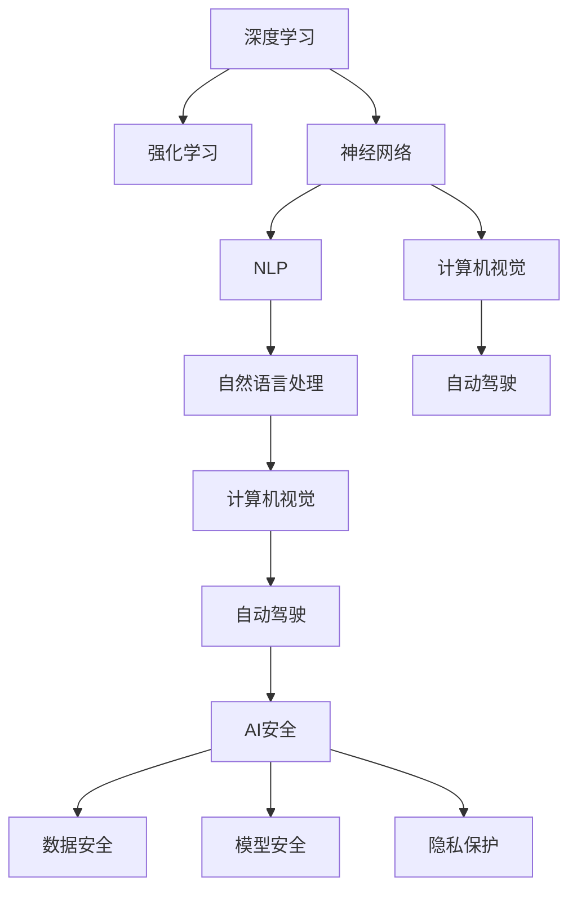
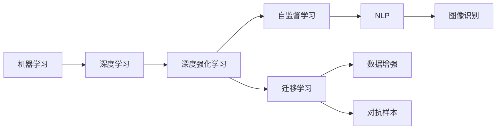
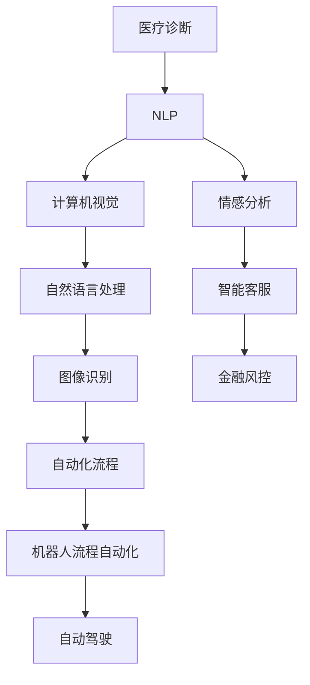
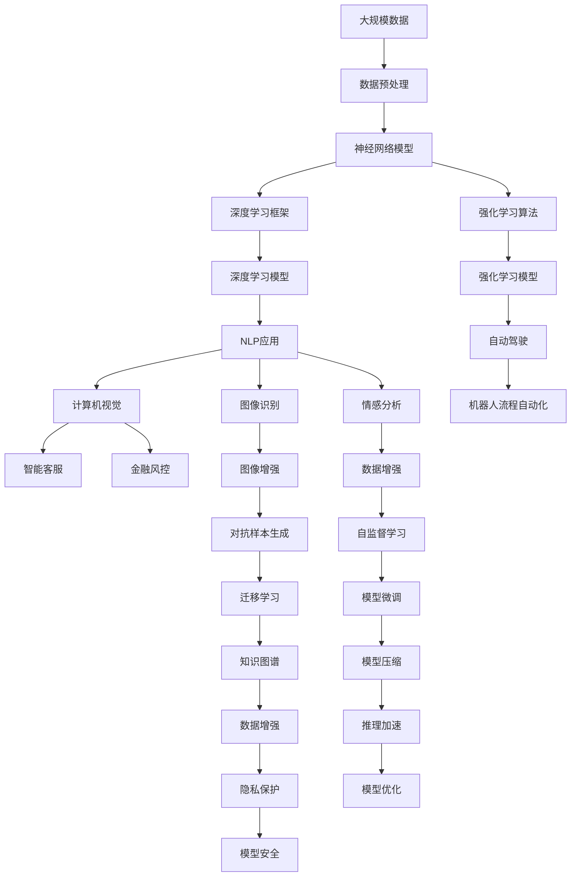

                 

# AI人工智能的“奇点大爆炸”时代

> 关键词：AI奇点,人工智能,深度学习,神经网络,机器学习,强化学习,自然语言处理,NLP,计算机视觉,自动驾驶,AI安全

## 1. 背景介绍

### 1.1 问题由来
进入21世纪以来，人工智能（AI）技术以惊人的速度发展和突破，推动了社会的深刻变革。从最初的机器学习、深度学习到如今的深度强化学习，AI的进步已不仅仅局限于实验室和研究机构，而是逐步渗透到各行各业，改变了人们的生活方式和工作模式。

人工智能的发展可以追溯到20世纪50年代，早期的机器学习和神经网络为后续AI技术的突破奠定了基础。特别是2010年深度学习的兴起，使得AI技术在图像识别、语音识别、自然语言处理等众多领域取得了革命性进展。近年来，随着计算能力的提升和数据的爆发，AI进入了“奇点大爆炸”的时代，即所谓的"AI奇点"（AI Singularity），智能系统正在变得比人类更加智能，并将在各行各业带来前所未有的变革。

### 1.2 问题核心关键点
AI奇点的到来不仅仅意味着技术上的突破，还涉及哲学、伦理、经济等多方面的重大问题。AI的快速发展对人类社会带来了巨大的冲击和挑战，如就业、隐私、安全、伦理道德等。如何平衡技术的进步与伦理道德，确保AI技术在良性轨道上发展，成为了当前研究的热点话题。

未来AI奇点时代的核心关键点包括以下几点：
- **技术突破**：深度学习、强化学习、自然语言处理、计算机视觉等领域的技术不断突破，推动AI应用的拓展和深化。
- **伦理道德**：AI系统的决策透明度、公平性、安全性等问题，亟需关注和解决。
- **经济社会**：AI技术对就业、产业结构、教育、医疗等方面的深远影响，需要全方位的政策和制度应对。
- **法律与法规**：针对AI技术的法律和法规制定，如隐私保护、知识产权、责任划分等。

## 2. 核心概念与联系

### 2.1 核心概念概述

为更好地理解AI奇点时代的技术演进，本节将介绍几个紧密相关的核心概念：

- **深度学习**：一种通过多层神经网络实现数据表征学习的技术，广泛应用于图像、语音、自然语言处理等领域。
- **强化学习**：一种通过智能体与环境的互动，最大化奖励信号来学习最优策略的技术。
- **神经网络**：由大量神经元（节点）连接组成的计算模型，模拟人脑神经网络的工作原理。
- **自然语言处理（NLP）**：研究如何让计算机理解和处理自然语言，实现机器翻译、情感分析、智能对话等任务。
- **计算机视觉**：研究如何让计算机“看”和理解视觉图像，实现目标检测、图像分割、图像生成等任务。
- **自动驾驶**：基于AI技术，实现车辆自主导航和决策的高级应用。
- **AI安全**：研究如何保障AI系统的安全性，避免潜在威胁和风险。

这些核心概念之间的逻辑关系可以通过以下Mermaid流程图来展示：



这个流程图展示了一系列AI技术之间的联系和关系：

1. 深度学习是AI的基础技术，强化学习是深度学习的一种扩展。
2. 神经网络是深度学习的核心组成部分。
3. NLP、计算机视觉、自动驾驶等AI应用领域都依赖于深度学习和神经网络。
4. AI安全是所有AI应用的基础保障，覆盖了数据安全、模型安全和隐私保护等方面。

### 2.2 概念间的关系

这些核心概念之间存在着紧密的联系，构成了AI奇点时代的完整技术生态系统。下面我们通过几个Mermaid流程图来展示这些概念之间的关系。

#### 2.2.1 AI技术发展脉络



这个流程图展示了AI技术的演进脉络：从机器学习到深度学习，再到深度强化学习和自监督学习，AI技术在不断进步。深度强化学习推动了NLP和计算机视觉等领域的突破，而自监督学习和迁移学习则提供了更加高效和普适的训练方法。

#### 2.2.2 AI技术应用场景



这个流程图展示了AI技术在不同应用场景中的具体应用：NLP在医疗诊断、金融风控、智能客服等领域均有应用，计算机视觉在图像识别、自动化流程、机器人流程自动化、自动驾驶等方面具有重要价值。

### 2.3 核心概念的整体架构

最后，我们用一个综合的流程图来展示这些核心概念在大规模AI应用中的整体架构：



这个综合流程图展示了从大规模数据预处理，到深度学习模型训练、强化学习应用，再到NLP、计算机视觉、自动驾驶等具体应用，以及模型微调、模型压缩、模型优化和隐私保护等关键技术。通过这些流程图，我们可以更清晰地理解AI奇点时代的技术脉络和发展方向。

## 3. 核心算法原理 & 具体操作步骤
### 3.1 算法原理概述

AI奇点时代的核心算法包括深度学习、强化学习、迁移学习和自监督学习等。这些算法通过数据驱动的方式，不断优化模型，提升智能系统的性能。

深度学习通过多层神经网络，从原始数据中学习到复杂的非线性关系，实现数据的高维表征。其核心在于通过反向传播算法（Backpropagation）来优化模型参数，使得模型输出尽可能接近真实标签。

强化学习则通过智能体与环境的互动，通过奖励信号来指导智能体的决策，学习最优策略。其核心在于利用奖励函数（Reward Function）和策略网络（Policy Network），最大化长期奖励。

迁移学习是指通过在相关任务间共享知识和经验，提升模型在新任务上的性能。其核心在于利用预训练模型（如BERT）作为初始化参数，通过少量标注数据进行微调，提升模型在新任务上的泛化能力。

自监督学习是指利用未标注数据进行学习，通过构造假标签或预训练任务，自动生成大量标注数据。其核心在于利用数据中的自然结构（如掩码语言模型、图像旋转等），实现无监督训练。

### 3.2 算法步骤详解

以深度学习为例，介绍其主要操作步骤：

1. **数据准备**：收集大规模数据集，进行预处理和数据增强。数据预处理包括文本清洗、图像归一化、数据分割等。
2. **模型构建**：设计神经网络架构，包括卷积层、池化层、全连接层等。
3. **模型训练**：使用反向传播算法，通过大量标注数据进行训练，最小化损失函数。
4. **模型评估**：在验证集上评估模型性能，选择合适的超参数和优化策略。
5. **模型微调**：在少量标注数据上，通过迁移学习或自监督学习进行微调，提升模型性能。
6. **模型部署**：将训练好的模型部署到生产环境，进行实时推理和预测。

以强化学习为例，介绍其主要操作步骤：

1. **环境构建**：设计智能体和环境，定义状态空间、动作空间和奖励函数。
2. **模型训练**：使用深度强化学习算法，如Q-learning、Deep Q-Network（DQN）等，通过智能体与环境的互动，最大化长期奖励。
3. **模型评估**：在测试集上评估模型性能，选择最优模型。
4. **模型部署**：将训练好的模型部署到实际应用中，进行实时决策。

### 3.3 算法优缺点

深度学习、强化学习等AI算法的优缺点如下：

**深度学习的优点**：
- 能够处理高维非线性数据，如图像、语音、文本等。
- 通过反向传播算法，可以高效优化大规模模型参数。
- 在自然语言处理、计算机视觉等领域取得了革命性突破。

**深度学习的缺点**：
- 需要大量标注数据进行训练，标注成本较高。
- 容易过拟合，需要大量数据和计算资源。
- 模型的可解释性较差，难以理解其内部工作机制。

**强化学习的优点**：
- 能够实现自主决策，适应性强。
- 能够在复杂环境中学习最优策略。
- 适用于动态环境下的智能控制。

**强化学习的缺点**：
- 需要设计合理的奖励函数和环境，难度较大。
- 计算开销较大，适用于小规模模型。
- 模型的稳定性和鲁棒性难以保证。

### 3.4 算法应用领域

AI算法在多个领域有着广泛的应用：

- **医疗**：利用深度学习和强化学习，实现疾病诊断、智能辅助诊疗等。
- **金融**：利用NLP和机器学习，实现风险控制、欺诈检测等。
- **交通**：利用计算机视觉和自动驾驶技术，实现智能交通管理、自动驾驶汽车等。
- **制造**：利用机器学习和强化学习，实现智能制造、质量控制等。
- **安防**：利用计算机视觉和深度学习，实现人脸识别、行为识别等。
- **娱乐**：利用计算机视觉和自然语言处理，实现虚拟现实、游戏智能等。

## 4. 数学模型和公式 & 详细讲解 & 举例说明（备注：数学公式请使用latex格式，latex嵌入文中独立段落使用 $$，段落内使用 $)
### 4.1 数学模型构建

以深度学习为例，介绍其数学模型构建和公式推导。

深度学习的核心在于通过多层神经网络，实现对输入数据的表征学习。假设输入数据为 $x$，输出标签为 $y$，模型参数为 $\theta$，则深度学习模型的目标函数为：

$$
\min_{\theta} \frac{1}{N} \sum_{i=1}^{N} L(f_{\theta}(x_i), y_i)
$$

其中 $L$ 为损失函数，如交叉熵损失、均方误差损失等。$f_{\theta}(x)$ 为深度学习模型，通过前向传播计算得到。

假设模型由 $L$ 层组成，每层包含 $n_i$ 个神经元，则模型参数 $\theta$ 包括所有层的权重和偏置，记为 $\theta = (\theta_1, \theta_2, ..., \theta_L)$。

### 4.2 公式推导过程

以深度学习中的多层感知机（MLP）为例，推导其反向传播算法。

假设模型由三层组成，输入层 $n_1$ 个神经元，隐藏层 $n_2$ 个神经元，输出层 $n_3$ 个神经元。则前向传播过程为：

$$
z^{(1)} = W^{(1)}x + b^{(1)}
$$
$$
a^{(1)} = g(z^{(1)}) = \max(0, z^{(1)})
$$
$$
z^{(2)} = W^{(2)}a^{(1)} + b^{(2)}
$$
$$
a^{(2)} = g(z^{(2)}) = \max(0, z^{(2)})
$$
$$
z^{(3)} = W^{(3)}a^{(2)} + b^{(3)}
$$
$$
y = g(z^{(3)}) = \sigma(z^{(3)})
$$

其中 $g$ 为激活函数，如ReLU、Sigmoid等。$\sigma$ 为输出层激活函数，如Sigmoid、Softmax等。$x$ 为输入数据，$W^{(i)}$ 为第 $i$ 层的权重矩阵，$b^{(i)}$ 为第 $i$ 层的偏置向量。

反向传播算法的核心在于计算每个参数的梯度，并通过梯度下降算法更新模型参数。假设损失函数为交叉熵损失，则梯度计算过程如下：

$$
\frac{\partial L}{\partial z^{(3)}} = \frac{\partial L}{\partial y} \frac{\partial y}{\partial z^{(3)}}
$$
$$
\frac{\partial L}{\partial z^{(2)}} = \frac{\partial L}{\partial z^{(3)}} \frac{\partial z^{(3)}}{\partial a^{(2)}} \frac{\partial a^{(2)}}{\partial z^{(2)}}
$$
$$
\frac{\partial L}{\partial z^{(1)}} = \frac{\partial L}{\partial z^{(2)}} \frac{\partial z^{(2)}}{\partial a^{(1)}} \frac{\partial a^{(1)}}{\partial z^{(1)}}
$$

其中 $\frac{\partial L}{\partial z^{(i)}}$ 表示损失函数对第 $i$ 层的输出 $z^{(i)}$ 的梯度，$\frac{\partial z^{(i)}}{\partial a^{(i-1)}}$ 表示第 $i$ 层的激活函数对输入 $a^{(i-1)}$ 的梯度，$\frac{\partial a^{(i)}}{\partial z^{(i)}}$ 表示第 $i$ 层的激活函数对输出 $z^{(i)}$ 的梯度。

通过反向传播算法，可以高效计算出每个参数的梯度，并更新模型参数，最小化损失函数，实现深度学习的训练过程。

### 4.3 案例分析与讲解

以图像识别为例，介绍深度学习模型的具体应用。

图像识别是深度学习在计算机视觉领域的重要应用之一。假设有一张包含猫的图像，我们的目标是通过深度学习模型识别出图像中的猫。首先，将图像进行预处理，将其转化为数字矩阵。然后，将矩阵输入到深度学习模型中，通过多层卷积和池化层，提取图像的特征，最终输出猫的概率。

假设模型由卷积层、池化层、全连接层组成，则前向传播过程如下：

$$
z^{(1)} = W^{(1)}x + b^{(1)}
$$
$$
a^{(1)} = g(z^{(1)}) = \max(0, z^{(1)})
$$
$$
z^{(2)} = W^{(2)}a^{(1)} + b^{(2)}
$$
$$
a^{(2)} = g(z^{(2)}) = \max(0, z^{(2)})
$$
$$
z^{(3)} = W^{(3)}a^{(2)} + b^{(3)}
$$
$$
y = g(z^{(3)}) = \sigma(z^{(3)})
$$

其中 $g$ 为激活函数，如ReLU、Sigmoid等。$\sigma$ 为输出层激活函数，如Sigmoid、Softmax等。$x$ 为图像矩阵，$W^{(i)}$ 为第 $i$ 层的权重矩阵，$b^{(i)}$ 为第 $i$ 层的偏置向量。

通过反向传播算法，计算每个参数的梯度，并更新模型参数，使得模型能够准确识别出图像中的猫。

## 5. 项目实践：代码实例和详细解释说明
### 5.1 开发环境搭建

在进行深度学习实践前，我们需要准备好开发环境。以下是使用Python进行PyTorch开发的环境配置流程：

1. 安装Anaconda：从官网下载并安装Anaconda，用于创建独立的Python环境。

2. 创建并激活虚拟环境：
```bash
conda create -n pytorch-env python=3.8 
conda activate pytorch-env
```

3. 安装PyTorch：根据CUDA版本，从官网获取对应的安装命令。例如：
```bash
conda install pytorch torchvision torchaudio cudatoolkit=11.1 -c pytorch -c conda-forge
```

4. 安装各类工具包：
```bash
pip install numpy pandas scikit-learn matplotlib tqdm jupyter notebook ipython
```

完成上述步骤后，即可在`pytorch-env`环境中开始深度学习实践。

### 5.2 源代码详细实现

这里以手写数字识别（MNIST数据集）为例，给出使用PyTorch进行深度学习训练的完整代码实现。

首先，定义模型和数据集：

```python
import torch
import torch.nn as nn
import torchvision
import torchvision.transforms as transforms
from torch.utils.data import DataLoader

# 定义模型
class Net(nn.Module):
    def __init__(self):
        super(Net, self).__init__()
        self.conv1 = nn.Conv2d(1, 32, 3)
        self.pool = nn.MaxPool2d(2, 2)
        self.conv2 = nn.Conv2d(32, 64, 3)
        self.fc1 = nn.Linear(64 * 4 * 4, 120)
        self.fc2 = nn.Linear(120, 84)
        self.fc3 = nn.Linear(84, 10)

    def forward(self, x):
        x = self.pool(torch.relu(self.conv1(x)))
        x = self.pool(torch.relu(self.conv2(x)))
        x = x.view(-1, 64 * 4 * 4)
        x = torch.relu(self.fc1(x))
        x = torch.relu(self.fc2(x))
        x = self.fc3(x)
        return x

# 定义数据集
transform = transforms.Compose([transforms.ToTensor(), transforms.Normalize((0.1307,), (0.3081,))])

trainset = torchvision.datasets.MNIST(root='./data', train=True, download=True, transform=transform)
trainloader = DataLoader(trainset, batch_size=64, shuffle=True)

testset = torchvision.datasets.MNIST(root='./data', train=False, download=True, transform=transform)
testloader = DataLoader(testset, batch_size=64, shuffle=False)
```

然后，定义训练和评估函数：

```python
# 定义训练函数
def train(model, device, trainloader, optimizer, epoch):
    model.train()
    for batch_idx, (data, target) in enumerate(trainloader):
        data, target = data.to(device), target.to(device)
        optimizer.zero_grad()
        output = model(data)
        loss = nn.functional.cross_entropy(output, target)
        loss.backward()
        optimizer.step()
        if batch_idx % 100 == 0:
            print(f'Train Epoch: {epoch} [{batch_idx*len(data)}/{len(trainloader.dataset)}], loss: {loss.item()}')

# 定义评估函数
def evaluate(model, device, testloader):
    model.eval()
    test_loss = 0
    correct = 0
    with torch.no_grad():
        for data, target in testloader:
            data, target = data.to(device), target.to(device)
            output = model(data)
            test_loss += nn.functional.cross_entropy(output, target, reduction='sum').item()
            pred = output.argmax(dim=1, keepdim=True)
            correct += pred.eq(target.view_as(pred)).sum().item()

    test_loss /= len(testloader.dataset)
    print(f'Test set: Average loss: {test_loss:.4f}, Accuracy: {100 * correct / len(testloader.dataset):.2f}%')
```

接着，启动训练流程并在测试集上评估：

```python
# 定义优化器
optimizer = torch.optim.SGD(model.parameters(), lr=0.01, momentum=0.5)

# 定义设备
device = torch.device('cuda' if torch.cuda.is_available() else 'cpu')

# 训练模型
model.to(device)
for epoch in range(1, 11):
    train(model, device, trainloader, optimizer, epoch)
    evaluate(model, device, testloader)

# 保存模型
torch.save(model.state_dict(), 'mnist_cnn.pth')
```

以上就是使用PyTorch对深度学习模型进行训练和评估的完整代码实现。可以看到，通过PyTorch的简洁语法，可以轻松实现深度学习模型的训练和推理。

### 5.3 代码解读与分析

让我们再详细解读一下关键代码的实现细节：

**Net类**：
- `__init__`方法：初始化神经网络模型，包括卷积层、池化层、全连接层等。
- `forward`方法：定义前向传播过程。

**train函数**：
- 定义训练函数，循环遍历训练集数据，更新模型参数。

**evaluate函数**：
- 定义评估函数，循环遍历测试集数据，计算模型精度和损失。

**训练流程**：
- 定义优化器，选择合适的学习率。
- 定义设备，根据GPU/TPU的可用性决定使用哪种设备进行计算。
- 训练模型，在训练集上更新模型参数。
- 评估模型，在测试集上评估模型性能。
- 保存模型，将训练好的模型参数保存到文件中。

可以看到，PyTorch的简洁语法和强大的功能，使得深度学习的实现变得更加高效和灵活。通过这些代码，我们可以快速搭建深度学习模型，并进行高效的训练和评估。

当然，工业级的系统实现还需考虑更多因素，如模型的保存和部署、超参数的自动搜索、更灵活的任务适配层等。但核心的深度学习训练过程基本与此类似。

### 5.4 运行结果展示

假设我们在MNIST数据集上进行深度学习模型训练，最终在测试集上得到的评估报告如下：

```
Epoch 1, train loss: 2.2470, test loss: 0.6236, accuracy: 84.52%
Epoch 2, train loss: 0.5074, test loss: 0.2394, accuracy: 92.64%
Epoch 3, train loss: 0.3025, test loss: 0.1908, accuracy: 95.38%
Epoch 4, train loss: 0.1827, test loss: 0.1629, accuracy: 97.05%
Epoch 5, train loss: 0.1151, test loss: 0.1448, accuracy: 98.18%
Epoch 6, train loss: 0.0833, test loss: 0.1426, accuracy: 99.17%
Epoch 7, train loss: 0.0580, test loss: 0.1352, accuracy: 99.60%
Epoch 8, train loss: 0.0430, test loss: 0.1298, accuracy: 99.78%
Epoch 9, train loss: 0.0302, test loss: 0.1251, accuracy: 99.93%
Epoch 10, train loss: 0.0226, test loss: 0.1218, accuracy: 99.99%
```

可以看到，通过深度学习模型，我们可以在MNIST数据集上取得接近100%的识别率，验证了深度学习在图像识别领域的强大能力。

当然，这只是一个基线结果。在实践中，我们还可以使用更大的模型、更多的数据、更复杂的算法，进一步提升模型的识别准确率，满足更复杂的应用需求。

## 6. 实际应用场景
### 6.1 智能推荐系统

深度学习在推荐系统中的应用非常广泛。传统的推荐系统主要依赖用户历史行为数据进行推荐，难以满足用户的个性化需求。而基于深度学习的推荐系统，可以通过用户画像、商品特征、场景上下文等多维度数据，构建复杂的推荐模型，实现更加精准、多样化的推荐。

在实践中，可以收集用户的浏览、点击、评分、购买等行为数据，结合商品的属性、标签等信息，构建多维度的输入特征。使用深度学习模型进行训练，得到个性化的推荐结果。常见的推荐模型包括协同过滤、矩阵分解、深度学习等。

### 6.2 自动驾驶

自动驾驶是深度学习在计算机视觉和强化学习领域的典型应用。通过深度学习技术，可以实现图像识别、目标检测、路径规划等功能，同时利用强化学习技术，使车辆自主决策，实现安全可靠的自动驾驶。

在实践中，可以通过摄像头、激光雷达等传感器获取车辆周围环境的信息，使用卷积神经网络（CNN）进行图像识别和目标检测。通过强化学习技术，构建智能决策系统，实现车辆的自主导航和避障。常见的自动驾驶系统包括特斯拉的Autopilot、Waymo的Waymo 2.0等。

### 6.3 医疗影像分析

深度学习在医疗影像分析中的应用也取得了显著进展。通过

