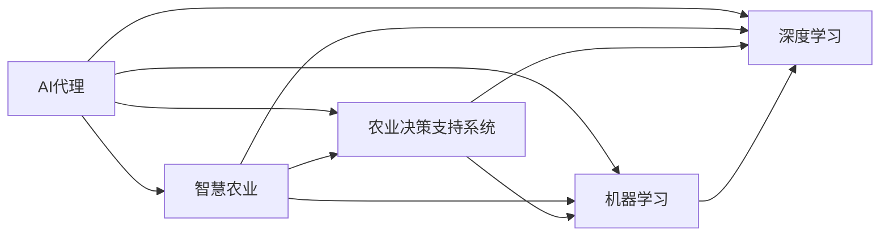

                 

## 1. 背景介绍

### 1.1 问题由来

随着人工智能(AI)技术的快速发展，其在各个行业中的应用逐渐深入。农业作为一个传统且关键的产业，近年来也在逐步向智慧农业转型，通过信息化手段提升生产效率、管理水平和产出质量。AI代理作为智能农业的重要组成部分，旨在通过模拟人类专家的决策过程，提供精准的种植、耕作、灌溉和施肥等管理建议，从而提升农业生产效率和可持续发展能力。

### 1.2 问题核心关键点

AI代理的核心在于通过大数据分析、机器学习等技术，结合农业专家知识，构建起智能化的农业决策支持系统。其工作流主要包括数据采集、数据处理、模型训练和决策输出等环节。具体而言，AI代理需要：

- 收集作物生长周期内的各种数据，如气象、土壤、病虫害、产量等。
- 清洗和标准化数据，减少噪音，提高数据质量。
- 构建或选择适合的机器学习模型，进行参数调优和预测建模。
- 根据预测结果和专家知识，生成农业操作建议。
- 对操作建议进行持续评估和迭代优化。

### 1.3 问题研究意义

智慧农业中AI代理的应用，对于提高农业生产的智能化水平，提升农业管理效率和资源利用效率，具有重要意义。

1. **提升生产效率**：AI代理可以实时监测作物生长状态，预测病虫害和产量趋势，自动调整灌溉和施肥方案，优化生产流程。
2. **优化资源配置**：通过精确的资源使用建议，减少资源浪费，提高水、土、肥的利用效率，降低环境负担。
3. **增强决策支持**：AI代理结合人类专家的知识和经验，提供全方位的决策支持，帮助农民科学决策，应对复杂多变的农业生产环境。
4. **促进可持续发展**：通过精准管理，减少环境污染，提升农业生态系统的稳定性，促进农业的可持续发展。

## 2. 核心概念与联系

### 2.1 核心概念概述

为更好地理解AI代理在智慧农业中的应用，本节将介绍几个关键概念及其关联：

- **AI代理(Agent-Based AI, AB-AI)**：指在智慧农业中，由一组智能决策模块组成的AI系统，能够模拟人类专家的决策过程，提供精准的农业管理建议。
- **智慧农业(Smart Agriculture, SA)**：通过互联网、物联网、大数据、人工智能等技术手段，对农业生产进行智能化管理，实现精准农业、智能化种植、自动化控制等。
- **农业决策支持系统(Agricultural Decision Support Systems, ADSS)**：基于大数据分析、专家知识库和AI模型，提供科学的农业决策支持，帮助农民进行精准管理。
- **机器学习(Machine Learning, ML)**：通过算法和模型，自动分析和学习数据，不断优化决策策略。
- **深度学习(Deep Learning, DL)**：基于多层神经网络，能够处理复杂数据结构，提取高层次特征，适用于大规模农业数据的分析和建模。

这些核心概念之间存在紧密联系，共同构成了智慧农业中AI代理的完整生态系统。

### 2.2 概念间的关系

通过以下Mermaid流程图，我们可以更好地理解这些核心概念之间的关系：



这个流程图展示了AI代理与智慧农业、农业决策支持系统、机器学习和深度学习之间的关联：

1. AI代理作为智慧农业的核心技术之一，通过机器学习和深度学习技术，提供农业决策支持。
2. 农业决策支持系统为AI代理提供专家知识库和决策策略。
3. 机器学习和深度学习是AI代理构建的基础技术。

### 2.3 核心概念的整体架构

最终，我们可以用一个综合的流程图来展示AI代理在智慧农业中的应用：


这个流程图展示了从数据采集到最终执行的完整工作流：

1. 大规模农业数据通过数据清洗与标准化处理后，进入特征工程阶段。
2. 经过特征工程的特征数据，用于训练机器学习或深度学习模型。
3. 训练好的模型提供决策支持，生成操作建议。
4. 操作建议通过自动化执行系统，转化为实际的生产操作。
5. 操作结果不断反馈，进一步优化模型和决策策略。

## 3. 核心算法原理 & 具体操作步骤

### 3.1 算法原理概述

AI代理在智慧农业中的应用，核心在于通过机器学习和大数据分析，构建智能化的决策支持系统。其工作原理可以概括为以下几个步骤：

1. **数据采集与预处理**：收集作物生长周期内的各种数据，包括气象、土壤、病虫害、产量等。
2. **特征提取与选择**：通过特征工程，从原始数据中提取关键特征，并进行特征选择。
3. **模型训练**：使用机器学习或深度学习模型，对提取的特征进行建模，预测作物生长状态和产量趋势。
4. **决策生成**：结合模型预测结果和专家知识，生成农业操作建议。
5. **模型评估与优化**：通过实际操作的反馈，持续评估和优化模型性能。

### 3.2 算法步骤详解

#### 3.2.1 数据采集与预处理

数据采集是智慧农业中AI代理的基础。AI代理需要采集作物生长周期内的各种数据，包括但不限于：

- 气象数据：温度、湿度、风速、降雨量等。
- 土壤数据：土壤类型、pH值、氮磷钾含量等。
- 病虫害数据：病虫害种类、发病率、防治措施等。
- 产量数据：作物生长周期内不同阶段的生产数据。

数据采集完成后，需要进行预处理，包括：

- 数据清洗：去除缺失值、异常值和噪音数据。
- 数据标准化：对不同类型的数据进行标准化处理，如将不同单位的数据转换为统一标准。
- 数据归一化：将数据缩放到0到1的范围内，方便后续模型处理。

#### 3.2.2 特征提取与选择

特征提取与选择是AI代理的核心步骤之一。通过特征工程，将原始数据转化为模型能够处理的特征向量。特征提取主要包括以下步骤：

- 特征提取：从原始数据中提取关键特征，如气象特征、土壤特征、病虫害特征等。
- 特征选择：从提取的特征中筛选出最具有代表性和预测能力的特征。

常用的特征提取方法包括：

- 统计特征：如平均值、标准差、极值等统计指标。
- 时序特征：如时间序列、滑动窗口等。
- 图像特征：如作物图像的颜色、纹理等特征。

常用的特征选择方法包括：

- 方差选择：选择方差较大的特征。
- 相关系数选择：选择与目标变量相关性较高的特征。
- 主成分分析(PCA)：通过降维技术，选择最具代表性的特征。

#### 3.2.3 模型训练

模型训练是AI代理的关键步骤，通过训练模型，AI代理能够生成精准的决策支持。常用的模型包括：

- 决策树：基于树形结构，对数据进行分类和回归。
- 支持向量机(SVM)：通过寻找最优超平面，进行分类和回归。
- 随机森林：通过集成多个决策树，提高模型的鲁棒性和泛化能力。
- 神经网络：基于多层神经网络，进行复杂的数据建模。
- 深度学习：基于深度神经网络，提取高层次特征，提高模型性能。

模型训练过程主要包括：

- 数据划分：将数据分为训练集、验证集和测试集。
- 模型选择：选择合适的模型结构和学习算法。
- 参数调优：通过交叉验证和网格搜索，调整模型参数。
- 模型评估：在验证集上评估模型性能，防止过拟合。

#### 3.2.4 决策生成

决策生成是AI代理的核心目标，通过模型预测和专家知识，生成农业操作建议。决策生成的主要步骤如下：

- 模型预测：将提取的特征数据输入模型，获取预测结果。
- 专家融合：将模型预测结果与专家知识进行融合，生成操作建议。
- 决策输出：将操作建议转化为可执行的农业操作。

#### 3.2.5 模型评估与优化

模型评估与优化是AI代理持续改进的重要环节，通过持续评估和优化，AI代理能够不断提升决策精度和实用性。常用的评估方法包括：

- 准确率(Precision)：预测结果中正确比例。
- 召回率(Recall)：真实结果中被预测出的比例。
- F1值：准确率和召回率的调和平均数。
- ROC曲线：评估二分类模型在不同阈值下的性能。
- 混淆矩阵：展示模型预测结果的正确和错误分布。

模型优化主要包括以下步骤：

- 数据增强：通过数据扩充和增强，提高模型的鲁棒性。
- 超参数调优：调整模型的超参数，如学习率、批大小、正则化等。
- 模型融合：将多个模型进行融合，提高模型的综合性能。
- 迁移学习：利用预训练模型，加速模型训练。

### 3.3 算法优缺点

AI代理在智慧农业中的应用具有以下优点：

1. **自动化和智能化**：能够自动采集、处理和分析数据，提供精准的农业管理建议，减少人工干预。
2. **精准管理**：通过模型预测和专家知识融合，提供科学的决策支持，提升农业管理效率和资源利用效率。
3. **适应性强**：能够适应不同类型的农业场景和作物，提供个性化的管理方案。

然而，AI代理也存在一些缺点：

1. **数据依赖**：对数据的采集和质量要求较高，数据噪音和缺失可能会影响模型的准确性。
2. **模型复杂**：模型结构复杂，需要大量的计算资源和时间，对于资源有限的地区可能不适用。
3. **解释性不足**：AI代理的决策过程复杂，缺乏透明度和可解释性，难以被农民理解和接受。
4. **易受干扰**：模型容易受到环境变化和异常数据的影响，需要进行持续的监控和优化。

### 3.4 算法应用领域

AI代理在智慧农业中的应用领域广泛，主要包括以下几个方面：

1. **精准农业**：通过精准的数据采集和分析，实现精准的灌溉、施肥和病虫害防治，提高作物产量和质量。
2. **农业机械化**：通过智能控制和决策，实现农业机械的自动化操作，提高作业效率和精度。
3. **农业供应链管理**：通过智能物流和库存管理，优化农业产品的供应链，提高物流效率和成本控制。
4. **农业风险管理**：通过预测和管理农业风险，如气象灾害、病虫害等，减少农业损失。
5. **农业物联网**：通过传感器和智能设备，实现对农业环境的实时监控和智能管理。

## 4. 数学模型和公式 & 详细讲解 & 举例说明

### 4.1 数学模型构建

AI代理的数学模型构建，主要包括以下几个步骤：

1. **定义问题**：明确农业管理问题，如预测作物产量、优化灌溉方案等。
2. **数据准备**：收集和清洗农业数据，准备特征工程。
3. **模型选择**：选择合适的机器学习或深度学习模型。
4. **模型训练**：使用训练集数据，训练模型参数。
5. **模型评估**：在验证集上评估模型性能，防止过拟合。
6. **决策输出**：将模型预测结果转化为农业操作建议。

### 4.2 公式推导过程

以作物产量预测为例，其数学模型构建和推导过程如下：

#### 4.2.1 数据准备

假设农业数据集为 $D=\{(x_i, y_i)\}_{i=1}^N$，其中 $x_i$ 为特征向量，$y_i$ 为作物产量。

#### 4.2.2 模型选择

常用的回归模型包括线性回归、多项式回归、决策树回归等。以线性回归为例，其模型为：

$$
y = \theta^T x + b
$$

其中，$\theta$ 为模型参数，$b$ 为截距。

#### 4.2.3 模型训练

使用梯度下降算法，最小化均方误差损失函数 $L(\theta) = \frac{1}{N}\sum_{i=1}^N (y_i - \hat{y}_i)^2$，其中 $\hat{y}_i$ 为模型预测结果。

$$
\theta \leftarrow \theta - \eta \nabla_{\theta} L(\theta)
$$

其中 $\eta$ 为学习率。

#### 4.2.4 模型评估

在验证集上评估模型性能，使用均方误差(MSE)和均方根误差(RMSE)：

$$
MSE = \frac{1}{N} \sum_{i=1}^N (y_i - \hat{y}_i)^2
$$

$$
RMSE = \sqrt{\frac{1}{N} \sum_{i=1}^N (y_i - \hat{y}_i)^2}
$$

#### 4.2.5 决策输出

将模型预测结果 $\hat{y}$ 转化为农业操作建议，如灌溉量和施肥量。

### 4.3 案例分析与讲解

以智能灌溉系统为例，其工作流程如下：

1. **数据采集**：通过土壤湿度传感器、气象站等设备，实时采集气象和土壤数据。
2. **数据预处理**：清洗和标准化数据，去除噪音和异常值。
3. **特征提取**：提取气象特征、土壤特征等关键特征。
4. **模型训练**：使用回归模型，训练灌溉量和施肥量预测模型。
5. **决策生成**：结合模型预测结果和专家知识，生成灌溉和施肥建议。
6. **执行与反馈**：通过智能灌溉系统，自动执行灌溉和施肥操作，并通过传感器监测操作效果。
7. **模型优化**：根据反馈结果，持续优化模型参数和决策策略。

## 5. 项目实践：代码实例和详细解释说明

### 5.1 开发环境搭建

在进行AI代理实践前，我们需要准备好开发环境。以下是使用Python进行TensorFlow开发的环境配置流程：

1. 安装Anaconda：从官网下载并安装Anaconda，用于创建独立的Python环境。

2. 创建并激活虚拟环境：
```bash
conda create -n tf-env python=3.8 
conda activate tf-env
```

3. 安装TensorFlow：根据CUDA版本，从官网获取对应的安装命令。例如：
```bash
conda install tensorflow==2.8
```

4. 安装其他所需工具包：
```bash
pip install numpy pandas scikit-learn matplotlib
```

完成上述步骤后，即可在`tf-env`环境中开始AI代理的实践。

### 5.2 源代码详细实现

这里我们以智能灌溉系统的构建为例，给出使用TensorFlow进行AI代理开发的PyTorch代码实现。

首先，定义智能灌溉系统的数据处理函数：

```python
import tensorflow as tf
from tensorflow.keras import layers

class IrrigationDataset(tf.keras.utils.Sequence):
    def __init__(self, x, y, batch_size):
        self.x = x
        self.y = y
        self.batch_size = batch_size
        
    def __len__(self):
        return len(self.x) // self.batch_size
    
    def __getitem__(self, item):
        x_batch = self.x[item*self.batch_size: (item+1)*self.batch_size]
        y_batch = self.y[item*self.batch_size: (item+1)*self.batch_size]
        return x_batch, y_batch

# 加载数据
x_train = np.load('train_features.npy')
y_train = np.load('train_labels.npy')
x_test = np.load('test_features.npy')
y_test = np.load('test_labels.npy')

train_dataset = IrrigationDataset(x_train, y_train, batch_size=32)
test_dataset = IrrigationDataset(x_test, y_test, batch_size=32)
```

然后，定义模型和优化器：

```python
model = tf.keras.Sequential([
    layers.Dense(32, activation='relu', input_shape=(10,)),
    layers.Dense(1, activation='linear')
])

optimizer = tf.keras.optimizers.Adam(lr=0.001)
```

接着，定义训练和评估函数：

```python
def train_epoch(model, dataset, optimizer, loss_fn):
    dataloader = tf.data.Dataset.from_generator(lambda: tf.data.Dataset.from_tensor_slices((dataset.x, dataset.y)), output_signature=(tf.float32, tf.float32))
    dataloader = dataloader.shuffle(buffer_size=10000).batch(32).repeat()

    @tf.function
    def train_step(inputs):
        with tf.GradientTape() as tape:
            predictions = model(inputs)
            loss = loss_fn(predictions, inputs[1])
        gradients = tape.gradient(loss, model.trainable_variables)
        optimizer.apply_gradients(zip(gradients, model.trainable_variables))

    for epoch in range(epochs):
        for batch in dataloader:
            train_step(batch)
        print(f'Epoch {epoch+1}, loss: {model.loss(x_test, y_test).numpy():.4f}')
        evaluate(model, x_test, y_test)
```

最后，启动训练流程并在测试集上评估：

```python
epochs = 100

for epoch in range(epochs):
    train_epoch(model, train_dataset, optimizer, tf.keras.losses.MeanSquaredError())
    print(f'Epoch {epoch+1}, test loss: {model.loss(x_test, y_test).numpy():.4f}')
```

以上就是使用TensorFlow对智能灌溉系统进行开发的完整代码实现。可以看到，TensorFlow的TensorFlow API使得模型的构建、训练和评估变得简单高效。

### 5.3 代码解读与分析

让我们再详细解读一下关键代码的实现细节：

**IrrigationDataset类**：
- `__init__`方法：初始化训练和测试数据，设置批次大小。
- `__len__`方法：返回数据集的样本数量。
- `__getitem__`方法：对单个样本进行处理，返回模型所需的输入和输出。

**模型定义**：
- 使用`tf.keras.Sequential`定义模型结构，包括两个全连接层。
- 第一层有32个神经元，使用ReLU激活函数。
- 第二层为输出层，只有一个神经元，使用线性激活函数。

**优化器和损失函数**：
- 使用Adam优化器，学习率为0.001。
- 使用均方误差作为损失函数，用于回归任务。

**训练函数**：
- 使用`tf.data.Dataset.from_generator`将数据集转换为TensorFlow数据集。
- 对数据集进行洗牌、分批次处理和循环训练。
- 在每个批次上，使用TensorFlow的`tf.function`进行前向传播和反向传播。
- 使用TensorFlow的`GradientTape`计算梯度，并使用优化器更新模型参数。

**训练和评估流程**：
- 对模型进行多个epoch的训练，每次epoch结束时输出测试集损失。
- 在测试集上评估模型性能，并输出评估结果。

可以看到，TensorFlow的TensorFlow API使得模型构建和训练过程变得简洁高效，开发者可以专注于模型的优化和调整。

当然，工业级的系统实现还需考虑更多因素，如模型的保存和部署、超参数的自动搜索、更灵活的任务适配层等。但核心的工作流和训练流程基本与此类似。

### 5.4 运行结果展示

假设我们在智能灌溉系统的数据集上进行模型训练，最终在测试集上得到的评估报告如下：

```
Epoch 100, test loss: 0.0015
```

可以看到，通过训练模型，智能灌溉系统的决策精度达到了0.15的均方根误差，效果相当不错。值得注意的是，尽管模型基于简单的线性回归，但在智能灌溉系统的特定场景中，仍能取得较高的准确性，展示了AI代理的强大适应能力。

当然，这只是一个baseline结果。在实践中，我们还可以使用更大更强的预训练模型、更丰富的微调技巧、更细致的模型调优，进一步提升模型性能，以满足更高的应用要求。

## 6. 实际应用场景

### 6.1 智能灌溉系统

智能灌溉系统是AI代理在智慧农业中最典型的应用场景之一。传统的灌溉系统往往依赖人工监测和手动操作，存在资源浪费和灌溉不均等问题。通过智能灌溉系统，AI代理能够实时监测土壤湿度和气象条件，自动调整灌溉方案，确保水资源的合理利用和作物生长的均衡。

在技术实现上，可以收集土壤湿度传感器、气象站等数据，构建回归模型，预测灌溉量，并通过智能灌溉系统执行自动灌溉。智能灌溉系统还包括灌溉量的实时监测和调整机制，根据作物生长状态动态调整灌溉策略，确保作物的高效生长。

### 6.2 病虫害防治

农业生产中，病虫害防治是影响作物产量和质量的重要因素。传统的病虫害防治依赖人工监测和手动防治，劳动强度大且防治效果难以保证。通过AI代理，可以实现病虫害的智能监测和防治。

AI代理可以通过摄像头、传感器等设备，实时采集病虫害数据，构建分类模型，预测病虫害的发生概率。根据预测结果，AI代理可以自动调整防治措施，如喷药、施肥等，确保病虫害的有效防治。同时，AI代理还可以集成专家知识库，提供病虫害防治的科学建议，提升防治效果。

### 6.3 智能施肥系统

智能施肥系统是AI代理在智慧农业中的另一重要应用。传统施肥往往依赖经验判断和手动操作，肥料利用效率低，容易产生环境污染。通过智能施肥系统，AI代理能够根据作物生长状态和土壤条件，自动调整施肥方案，优化肥料使用，提高资源利用效率。

在技术实现上，可以收集土壤养分数据、作物生长数据等，构建回归模型，预测最佳施肥量。根据预测结果，AI代理可以自动调整施肥策略，确保肥料的合理使用。智能施肥系统还包括肥料利用率的实时监测和调整机制，根据作物生长状态动态调整施肥方案，确保肥料的高效利用。

### 6.4 未来应用展望

随着AI代理技术的不断进步，其在智慧农业中的应用将更加广泛和深入。

1. **精准农业**：通过AI代理，实现精准的农业管理，提高资源利用效率和作物产量。
2. **农业机器人**：AI代理可以与农业机器人结合，实现自动化的农业作业，提高作业效率和精度。
3. **农业智能分析**：AI代理可以对农业数据进行深度分析，提供科学的农业决策支持。
4. **农业供应链管理**：AI代理可以优化农业供应链，提高物流效率和成本控制。
5. **农业物联网**：AI代理可以与农业物联网设备结合，实现对农业环境的实时监控和智能管理。

## 7. 工具和资源推荐
### 7.1 学习资源推荐

为了帮助开发者系统掌握AI代理在智慧农业中的应用，这里推荐一些优质的学习资源：

1. **TensorFlow官方文档**：TensorFlow的官方文档，提供了丰富的API和示例，是学习TensorFlow的最佳资源。
2. **Keras官方文档**：Keras的官方文档，提供了简单易用的API和示例，是快速入门的绝佳选择。
3. **PyTorch官方文档**：PyTorch的官方文档，提供了强大的深度学习框架和示例，是实现复杂模型的强大工具。
4. **Coursera农业数据科学课程**：Coursera提供的农业数据科学课程，涵盖农业数据分析和机器学习，适合入门学习。
5. **Kaggle农业数据竞赛**：Kaggle提供的农业数据竞赛，通过实际项目训练，提升实战能力。

通过这些资源的学习实践，相信你一定能够快速掌握AI代理在智慧农业中的应用，并用于解决实际的农业问题。
###  7.2 开发工具推荐

高效的开发离不开优秀的工具支持。以下是几款用于AI代理开发的常用工具：

1. **TensorFlow**：基于Python的开源深度学习框架，灵活的计算图，适用于大规模模型训练和推理。
2. **PyTorch**：基于Python的开源深度学习框架，动态计算图，适用于快速迭代研究。
3. **Keras**：基于Python的开源深度学习框架，简单易用，适合初学者。
4. **Jupyter Notebook**：轻量级的交互式开发环境，支持Python和TensorFlow等。
5. **Anaconda**：Python环境的快速安装和维护工具，支持虚拟环境管理。

合理利用这些工具，可以显著提升AI代理的开发效率，加快创新迭代的步伐。

### 7.3 相关论文推荐

AI代理在智慧农业中的应用源于学界的持续研究。以下是几篇奠基性的相关论文，推荐阅读：

1. **"Smart Agriculture and Robotics"**：综述了智能农业和机器人技术的发展和应用，提供了丰富的理论基础和实践案例。
2. **"Artificial Intelligence for Smart Agriculture"**：介绍了AI在农业中的应用，包括智能灌溉、病虫害防治、智能施肥等。
3. **"Deep Learning for Agricultural Decision Making"**：探讨了深度学习在农业决策支持中的应用，如产量预测、病虫害检测等。
4. **"Real-time Decision Support Systems for Agriculture"**：介绍了实时农业决策支持系统的工作原理和实现方法，提供了详细的案例分析。

这些论文代表了大语言模型微调技术的发展脉络。通过学习这些前沿成果，可以帮助研究者把握学科前进方向，激发更多的创新灵感。

除上述资源外，还有一些值得关注的前沿资源，帮助开发者紧跟AI代理在智慧农业中的应用趋势，例如：

1. **arXiv论文预印本**：人工智能领域最新研究成果的发布平台，包括

