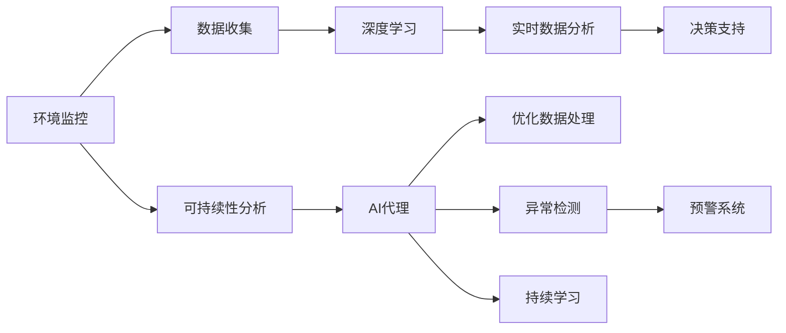
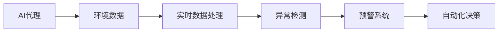
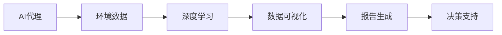
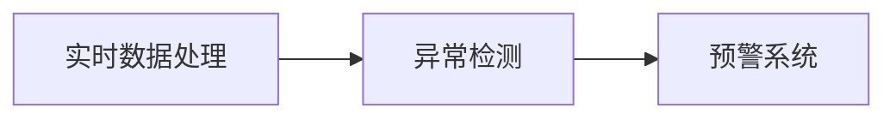
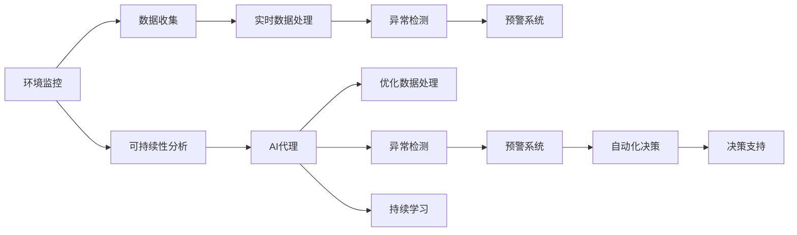

                 

# AI代理在环境监控与可持续性分析的工作流应用

## 1. 背景介绍

### 1.1 问题由来

随着全球气候变化和环境问题的日益加剧，越来越多的企业和组织开始重视环境监控和可持续性分析的重要性。然而，这些任务通常涉及大量的数据处理和分析，需要耗费大量人力和时间。AI代理技术在自动化、智能化数据分析方面展现出巨大的潜力，可以显著提升环境监控和可持续性分析的效率和准确性。

### 1.2 问题核心关键点

AI代理是指利用人工智能算法，通过自动化、智能化的方式，对任务执行过程进行代理。它可以帮助企业在环境监控与可持续性分析领域实现以下几个关键点：

- 自动化数据收集：AI代理可以自动从各种传感器、数据平台等获取环境数据。
- 实时数据分析：AI代理可以对实时数据进行高效分析，发现异常和趋势。
- 决策支持：AI代理可以根据分析结果，提供决策建议，帮助企业做出更加科学的决策。
- 预警机制：AI代理可以建立预警系统，及时发现潜在的环境风险。
- 持续学习：AI代理可以通过持续学习，不断提高自身的数据处理和分析能力。

### 1.3 问题研究意义

AI代理技术在环境监控与可持续性分析中的应用，具有以下几个重要意义：

- 提升数据处理效率：通过自动化处理大量环境数据，AI代理大大提升了数据处理速度和精度。
- 实现智能化分析：AI代理通过深度学习和机器学习算法，能够进行更为复杂和深入的环境数据分析。
- 支持科学决策：AI代理提供的数据分析和决策建议，为企业的环境监控与可持续性管理提供了强有力的支持。
- 降低人工成本：AI代理可以减少人工数据处理和分析的工作量，降低企业的运营成本。
- 提升环境监测能力：AI代理可以实时监测环境数据，及时发现和响应环境问题，减少环境风险。

## 2. 核心概念与联系

### 2.1 核心概念概述

为更好地理解AI代理在环境监控与可持续性分析中的应用，本节将介绍几个密切相关的核心概念：

- **环境监控**：指通过传感器、遥感技术、数据分析等手段，对环境变化进行实时监测和分析。
- **可持续性分析**：指评估和分析企业的环境影响、资源消耗、碳排放等指标，帮助企业实现可持续发展。
- **AI代理**：指利用AI技术对任务执行过程进行代理，自动完成数据收集、处理和分析等任务。
- **深度学习**：指利用神经网络等模型，对数据进行深度学习和分析。
- **实时数据处理**：指对实时数据进行高效处理，及时发现异常和趋势。
- **决策支持系统**：指通过AI代理提供的分析结果，支持企业进行科学决策。

这些概念之间的逻辑关系可以通过以下Mermaid流程图来展示：



这个流程图展示了AI代理在环境监控与可持续性分析中的应用过程：

1. 环境监控生成数据，数据收集模块负责自动获取这些数据。
2. 数据经过深度学习模型进行分析和处理。
3. 实时数据分析模块对数据进行高效处理，及时发现异常和趋势。
4. 决策支持系统通过AI代理提供的分析结果，支持企业进行科学决策。
5. 可持续性分析模块通过AI代理的辅助，实现更加精确的环境影响评估。
6. 持续学习模块使得AI代理能够不断学习和优化，提升其数据处理和分析能力。

### 2.2 概念间的关系

这些核心概念之间存在着紧密的联系，形成了AI代理在环境监控与可持续性分析中的应用生态系统。下面我通过几个Mermaid流程图来展示这些概念之间的关系。

#### 2.2.1 AI代理在环境监控中的应用



这个流程图展示了AI代理在环境监控中的应用流程：

1. AI代理自动收集环境数据。
2. 实时数据处理模块对数据进行高效处理。
3. 异常检测模块及时发现环境数据中的异常。
4. 预警系统根据异常数据发出警报。
5. 自动化决策模块根据预警结果采取相应的应对措施。

#### 2.2.2 AI代理在可持续性分析中的应用



这个流程图展示了AI代理在可持续性分析中的应用流程：

1. AI代理自动收集环境数据。
2. 深度学习模型对数据进行分析和处理。
3. 数据可视化模块对分析结果进行可视化展示。
4. 报告生成模块根据分析结果生成报告。
5. 决策支持系统根据报告结果提供决策建议。

#### 2.2.3 实时数据处理与异常检测



这个流程图展示了实时数据处理与异常检测之间的关系：

1. 实时数据处理模块对数据进行高效处理。
2. 异常检测模块根据处理结果，发现异常情况。
3. 预警系统根据异常情况发出警报。

### 2.3 核心概念的整体架构

最后，我们用一个综合的流程图来展示这些核心概念在环境监控与可持续性分析中的整体架构：



这个综合流程图展示了AI代理在环境监控与可持续性分析中的完整应用过程。通过这些核心概念的有机结合，AI代理可以高效地实现环境数据收集、处理和分析，为企业的环境监控与可持续性管理提供有力支持。

## 3. 核心算法原理 & 具体操作步骤
### 3.1 算法原理概述

AI代理在环境监控与可持续性分析中的应用，主要基于深度学习算法，特别是卷积神经网络（CNN）和循环神经网络（RNN）。这些算法可以通过对环境数据的高效处理和分析，识别出环境变化的模式和趋势，发现异常情况，并提供决策支持。

### 3.2 算法步骤详解

AI代理在环境监控与可持续性分析中的应用，一般包括以下几个关键步骤：

**Step 1: 准备数据和模型**
- 收集环境数据，包括温度、湿度、空气质量等指标。
- 选择合适的深度学习模型，如CNN、RNN等，作为AI代理的核心算法。
- 准备训练数据集，并进行预处理，如归一化、数据增强等。

**Step 2: 模型训练和优化**
- 使用训练数据集，对深度学习模型进行训练，优化模型参数。
- 应用正则化技术，如L2正则、Dropout等，防止过拟合。
- 使用早期停止（Early Stopping）等策略，避免过拟合。

**Step 3: 实时数据处理和异常检测**
- 对实时采集的环境数据进行高效处理，如数据清洗、特征提取等。
- 使用训练好的模型对数据进行分析和处理，发现异常情况。
- 根据异常情况，触发预警系统，发出警报。

**Step 4: 持续学习与优化**
- 使用新的数据对模型进行持续学习，不断优化模型参数。
- 引入增量学习（Continual Learning）等技术，保持模型的时效性。

### 3.3 算法优缺点

AI代理在环境监控与可持续性分析中的应用，具有以下几个优点：

1. 自动化和智能化：AI代理可以自动完成数据收集、处理和分析，大大提升了效率和精度。
2. 实时性和准确性：AI代理可以对实时数据进行高效处理，及时发现异常和趋势。
3. 决策支持：AI代理提供的分析结果，可以帮助企业进行科学决策。
4. 可扩展性和灵活性：AI代理可以根据不同的任务需求，灵活调整算法和模型。

同时，AI代理也存在一些缺点：

1. 数据依赖性强：AI代理的效果很大程度上取决于数据质量和数量，需要高质量的数据支持。
2. 模型复杂度高：深度学习模型参数量大，需要强大的计算资源。
3. 解释性不足：AI代理的决策过程复杂，难以解释其内部工作机制。
4. 鲁棒性有待提高：AI代理面对异常和噪声数据时，容易出现误判。

### 3.4 算法应用领域

AI代理在环境监控与可持续性分析中的应用，已经涵盖以下几个主要领域：

1. 空气质量监测：通过实时数据处理和异常检测，及时发现空气质量变化，提供预警和决策支持。
2. 水质监测：对水质数据进行深度学习和分析，发现异常和趋势，提供预警和建议。
3. 能源消耗监控：对能源消耗数据进行实时监控和分析，发现异常和优化建议。
4. 碳排放管理：对碳排放数据进行深度学习和分析，发现减排机会和优化建议。
5. 生态系统监测：对生态系统数据进行深度学习和分析，发现变化和趋势，提供预警和建议。

除了上述这些应用领域，AI代理还可以应用于更多领域，如土壤质量监测、自然资源管理、废弃物处理等。

## 4. 数学模型和公式 & 详细讲解 & 举例说明

### 4.1 数学模型构建

在本节中，我们将使用数学语言对AI代理在环境监控与可持续性分析中的应用进行更加严格的刻画。

记环境数据为 $x \in \mathbb{R}^n$，其中 $n$ 表示数据维度，如温度、湿度、空气质量等指标。定义深度学习模型为 $f: \mathbb{R}^n \rightarrow \mathbb{R}^m$，其中 $m$ 表示输出维度，如异常情况、预警级别等。

设训练数据集为 $D=\{(x_i,y_i)\}_{i=1}^N$，其中 $y_i$ 表示环境数据 $x_i$ 的标签，如正常、异常、高预警等。则环境监控与可持续性分析的数学模型为：

$$
\min_{f} \frac{1}{N} \sum_{i=1}^N \ell(f(x_i), y_i)
$$

其中 $\ell$ 表示损失函数，通常采用交叉熵损失、均方误差损失等。通过最小化损失函数，优化深度学习模型 $f$，使其能够准确地预测环境数据的标签。

### 4.2 公式推导过程

以下是使用交叉熵损失函数的详细推导过程：

假设模型 $f$ 的输出为 $f(x_i) = [p_1, p_2, ..., p_m]$，其中 $p_j$ 表示环境数据 $x_i$ 属于第 $j$ 个类别的概率。则交叉熵损失函数为：

$$
\ell(f(x_i), y_i) = -y_i \log p_{y_i}
$$

其中 $y_i \in \{1,2,...,m\}$ 表示环境数据 $x_i$ 的真实标签。则总损失函数为：

$$
\mathcal{L}(f) = \frac{1}{N} \sum_{i=1}^N \ell(f(x_i), y_i)
$$

对模型 $f$ 的参数 $\theta$ 进行梯度下降优化：

$$
\theta \leftarrow \theta - \eta \nabla_{\theta}\mathcal{L}(f)
$$

其中 $\eta$ 为学习率，$\nabla_{\theta}\mathcal{L}(f)$ 为损失函数对模型参数 $\theta$ 的梯度，可以通过反向传播算法高效计算。

### 4.3 案例分析与讲解

以下是一个具体的案例分析：

假设某工厂希望通过AI代理对空气质量进行实时监控和预警，使用深度学习模型对实时采集的空气质量数据进行分析和处理。具体步骤如下：

1. 收集历史空气质量数据 $D=\{(x_i,y_i)\}_{i=1}^N$，其中 $x_i$ 表示第 $i$ 天的空气质量数据，$y_i$ 表示该天的空气质量状况，如正常、轻度污染、重度污染等。
2. 使用深度学习模型 $f: \mathbb{R}^d \rightarrow \{正常, 轻度污染, 重度污染\}$ 对数据进行训练，最小化交叉熵损失。
3. 对实时采集的空气质量数据 $x_t$ 进行高效处理，输入模型 $f$ 进行预测。
4. 根据预测结果，触发预警系统，发出警报。
5. 对新的空气质量数据进行持续学习，优化模型 $f$。

## 5. 项目实践：代码实例和详细解释说明

### 5.1 开发环境搭建

在进行AI代理实践前，我们需要准备好开发环境。以下是使用Python进行TensorFlow开发的环境配置流程：

1. 安装Anaconda：从官网下载并安装Anaconda，用于创建独立的Python环境。

2. 创建并激活虚拟环境：
```bash
conda create -n tf-env python=3.8 
conda activate tf-env
```

3. 安装TensorFlow：根据CUDA版本，从官网获取对应的安装命令。例如：
```bash
conda install tensorflow=2.7 
```

4. 安装各类工具包：
```bash
pip install numpy pandas scikit-learn matplotlib tqdm jupyter notebook ipython
```

完成上述步骤后，即可在`tf-env`环境中开始AI代理实践。

### 5.2 源代码详细实现

以下是一个具体的代码实现示例，以空气质量监控为例，使用TensorFlow进行实时数据处理和异常检测。

```python
import tensorflow as tf
from tensorflow.keras import layers
import numpy as np
import pandas as pd
import matplotlib.pyplot as plt

# 加载数据
data = pd.read_csv('air_quality_data.csv')

# 数据预处理
X = data[['temperature', 'humidity', 'air_quality']].values
y = data['air_quality'] == 'normal'

# 定义模型
model = tf.keras.Sequential([
    layers.Dense(64, activation='relu', input_shape=(3,)),
    layers.Dense(64, activation='relu'),
    layers.Dense(3, activation='softmax')
])

# 编译模型
model.compile(optimizer='adam',
              loss='sparse_categorical_crossentropy',
              metrics=['accuracy'])

# 训练模型
model.fit(X, y, epochs=10, batch_size=32)

# 实时数据处理和异常检测
def detect_anomaly(x):
    x = np.expand_dims(x, axis=0)
    prediction = model.predict(x)
    return prediction[0]

# 对实时数据进行检测
x = [data['temperature'].values[-1], data['humidity'].values[-1], data['air_quality'].values[-1]]
prediction = detect_anomaly(x)
if prediction == 'normal':
    print('Air quality is normal')
elif prediction == 'light_pollution':
    print('Light pollution detected')
else:
    print('Heavy pollution detected')
```

在这个代码实现中，我们首先加载历史空气质量数据，并对其进行预处理。然后定义了一个简单的神经网络模型，并使用交叉熵损失进行训练。最后，我们定义了一个实时数据处理和异常检测函数，对实时数据进行预测，并输出相应的预警信息。

### 5.3 代码解读与分析

让我们再详细解读一下关键代码的实现细节：

1. **数据加载和预处理**：
   - 使用Pandas库加载历史数据。
   - 将数据分为输入和标签，并使用TensorFlow进行模型定义和编译。
   - 定义了三个输入特征，分别表示温度、湿度和空气质量。

2. **模型定义**：
   - 使用TensorFlow的Sequential模型，定义了三个全连接层。
   - 前两个全连接层使用ReLU激活函数，最后一个全连接层使用Softmax激活函数，输出三个类别的概率。
   - 编译模型时，选择Adam优化器和交叉熵损失函数。

3. **模型训练**：
   - 使用fit函数对模型进行训练，训练10个epoch，批次大小为32。
   - 训练完成后，模型可以对新的空气质量数据进行预测。

4. **实时数据处理和异常检测**：
   - 定义了一个检测函数，对新的实时数据进行预测。
   - 输入模型的数据为当前温度、湿度和空气质量的最新值。
   - 根据预测结果，输出相应的预警信息。

5. **运行结果展示**：
   - 运行代码后，可以根据输入的实时数据，输出相应的预警信息。

可以看到，TensorFlow使得AI代理的代码实现变得简洁高效。开发者可以将更多精力放在数据处理、模型改进等高层逻辑上，而不必过多关注底层的实现细节。

当然，工业级的系统实现还需考虑更多因素，如模型的保存和部署、超参数的自动搜索、更灵活的任务适配层等。但核心的AI代理范式基本与此类似。

## 6. 实际应用场景

### 6.1 智能工厂环境监控

智能工厂的环境监控可以应用AI代理技术，实现实时监控和预警，提升生产效率和安全性。

具体而言，工厂可以利用各种传感器采集环境数据，如温度、湿度、噪声等。通过AI代理对这些数据进行高效处理和分析，可以发现环境异常和设备故障，及时采取措施，避免生产中断和安全事故。

### 6.2 智慧农业环境监测

智慧农业领域可以应用AI代理技术，实现对农作物生长环境、土壤水分、光照等实时监测和分析，提供精准的农业决策支持。

具体而言，农业生产者可以利用传感器采集土壤和环境数据，使用AI代理对这些数据进行分析和处理，发现环境变化和病虫害情况，及时采取应对措施，提高农作物产量和质量。

### 6.3 城市环境监测与预警

城市环境监测可以应用AI代理技术，实现对空气质量、水质、噪音等实时监测和预警，提升城市管理水平。

具体而言，城市管理者可以利用各种传感器采集环境数据，使用AI代理对这些数据进行高效处理和分析，发现环境异常和污染情况，及时采取措施，减少环境污染，提升城市居民的生活质量。

### 6.4 未来应用展望

随着AI代理技术的不断发展，其在环境监控与可持续性分析中的应用将更加广泛和深入，具体展望如下：

1. 数据来源多样化：AI代理可以整合多种数据来源，如传感器数据、卫星遥感数据、社交媒体数据等，实现更全面的环境监测。
2. 实时化程度提高：AI代理可以实现实时数据处理和分析，及时发现环境异常和趋势。
3. 多模态融合：AI代理可以融合多模态数据，提升环境监测的准确性和鲁棒性。
4. 决策支持系统优化：AI代理可以提供更加科学和精准的决策支持，提升环境管理的智能化水平。
5. 可视化与互动：AI代理可以将分析结果进行可视化展示，并提供交互界面，方便用户进行操作和查询。

总之，AI代理技术将在环境监控与可持续性分析领域发挥越来越重要的作用，帮助企业和组织实现智能化、高效化、精准化的环境管理。

## 7. 工具和资源推荐
### 7.1 学习资源推荐

为了帮助开发者系统掌握AI代理在环境监控与可持续性分析中的应用，这里推荐一些优质的学习资源：

1. TensorFlow官方文档：TensorFlow的官方文档提供了详细的使用指南和示例代码，是学习AI代理技术的必备资料。
2. Kaggle数据集：Kaggle提供了丰富的数据集和竞赛任务，可以练习AI代理的应用实践，积累经验。
3. Coursera《深度学习》课程：Coursera开设的深度学习课程，系统讲解了深度学习算法和应用，适合初学者和进阶者学习。
4. arXiv论文预印本：arXiv提供了大量最新的深度学习和AI代理研究论文，可以获取前沿技术动态。
5. GitHub热门项目：在GitHub上Star、Fork数最多的深度学习项目，往往代表了该领域的发展趋势和最佳实践。

通过对这些资源的学习实践，相信你一定能够快速掌握AI代理技术，并将其应用于环境监控与可持续性分析的实际场景中。

### 7.2 开发工具推荐

高效的开发离不开优秀的工具支持。以下是几款用于AI代理开发常用的工具：

1. TensorFlow：由Google主导开发的深度学习框架，生产部署方便，适合大规模工程应用。
2. PyTorch：基于Python的开源深度学习框架，灵活高效，适合快速迭代研究。
3. Scikit-learn：Python的机器学习库，提供了丰富的数据处理和模型评估工具。
4. Keras：Python的高级神经网络库，提供了简洁的API和高层接口。
5. TensorBoard：TensorFlow配套的可视化工具，可实时监测模型训练状态，并提供丰富的图表呈现方式。

合理利用这些工具，可以显著提升AI代理的开发效率，加快创新迭代的步伐。

### 7.3 相关论文推荐

AI代理在环境监控与可持续性分析中的应用，离不开学界的持续研究。以下是几篇奠基性的相关论文，推荐阅读：

1. Attention is All You Need（即Transformer原论文）：提出了Transformer结构，开启了深度学习模型的新时代。
2. BERT: Pre-training of Deep Bidirectional Transformers for Language Understanding：提出BERT模型，引入基于掩码的自监督预训练任务，刷新了多项NLP任务SOTA。
3. Transfer Learning with Denoising Sequence Prediction：提出基于噪声序列预测的迁移学习方法，适用于数据量较小的情况。
4. Multi-task Deep Neural Networks for Energy Systems：提出多任务深度神经网络，适用于能源系统的环境监测和优化。
5. A Comprehensive Review of Continual Learning：综述了增量学习的研究进展，为持续学习提供了丰富的理论基础。

这些论文代表了AI代理在环境监控与可持续性分析中的研究前沿，通过学习这些前沿成果，可以帮助研究者把握学科前进方向，激发更多的创新灵感。

## 8. 总结：未来发展趋势与挑战

### 8.1 总结

本文对AI代理在环境监控与可持续性分析中的应用进行了全面系统的介绍。首先阐述了AI代理技术在自动化、智能化数据分析方面的独特优势，明确了其应用在环境监控与可持续性分析中的重要作用。其次，从原理到实践，详细讲解了AI代理的数学原理和关键步骤，给出了具体的代码实现示例。同时，本文还广泛探讨了AI代理在智能工厂、智慧农业、城市环境监测等多个行业领域的应用前景，展示了其广泛的适用性。

通过本文的系统梳理，可以看到，AI代理技术在环境监控与可持续性分析中的应用前景广阔，为企业的智能化、高效化、精准化环境管理提供了强有力的技术支撑。未来，随着AI代理技术的不断演进，其在环境监控与可持续性分析中的应用将更加深入和广泛。

### 8.2 未来发展趋势

展望未来，AI代理技术在环境监控与可持续性分析中的应用将呈现以下几个发展趋势：

1. 数据融合与多源数据融合：AI代理可以整合多种数据来源，实现更全面的环境监测。
2. 实时化与自动化：AI代理可以实现实时数据处理和自动化分析，及时发现环境异常和趋势。
3. 多模态融合：AI代理可以融合多模态数据，提升环境监测的准确性和鲁棒性。
4. 决策支持系统的优化：AI代理可以提供更加科学和精准的决策支持，提升环境管理的智能化水平。
5. 可视化与互动：AI代理可以将分析结果进行可视化展示，并提供交互界面，方便用户进行操作和查询。

以上趋势凸显了AI代理技术的广阔前景。这些方向的探索发展，必将进一步提升环境监控与可持续性分析的效率和精度，为企业的智能化、高效化、精准化环境管理提供更加有力的技术支持。

### 8.3 面临的挑战

尽管AI代理技术在环境监控与可持续性分析中的应用取得了显著进展，但在迈向更加智能化、高效化、精准化的应用过程中，仍面临诸多挑战：

1. 数据质量与多样性：AI代理的效果很大程度上取决于数据质量和多样性，需要高质量的数据支持。
2. 模型复杂度与计算资源：深度学习模型参数量大，需要强大的计算资源。
3. 解释性与可控性：AI代理的决策过程复杂，难以解释其内部工作机制。
4. 实时性与鲁棒性：AI代理面对异常和噪声数据时，容易出现误判。

### 8.4 研究展望

面对AI代理在环境监控与可持续性分析中的应用所面临的挑战，未来的研究需要在以下几个方面寻求新的突破：

1. 数据增强与多源数据融合：利用数据增强和融合技术，提高数据质量和多样性。
2. 模型压缩与优化：开发轻量级、高效的深度学习模型，优化资源消耗。
3. 解释性与可控性：引入可解释性技术，如模型蒸馏、注意力机制等，提高模型可控性。
4. 实时性与鲁棒性：研究增量学习与对抗训练技术，提高模型鲁棒性和实时性。
5. 多模态融合与多任务学习：研究多模态数据融合技术，提高环境监测的准确性和鲁棒性。

这些研究方向的探索，必将引领AI代理技术迈向更高的台阶，为环境监控与可持续性分析的应用提供更加全面和精准的支持

