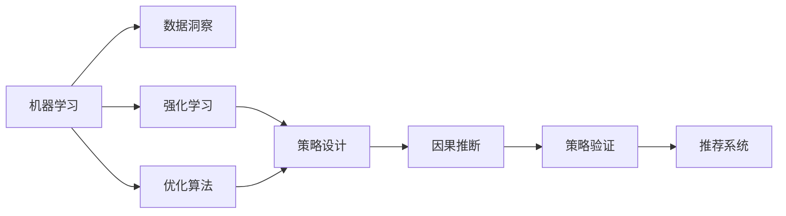

                 

## 1. 背景介绍

### 1.1 问题由来
在数字时代，各大电商平台通过大量的广告和促销活动，争夺消费者的注意力，推动销售增长。然而，无休止的广告和促销不仅会引发消费者疲劳，还可能造成过度消费。此外，企业往往难以精准预测促销活动的实际效果，导致资源浪费。因此，如何通过数据驱动，科学地优化促销策略，成为了一个亟待解决的问题。

### 1.2 问题核心关键点
在实践中，优化促销策略主要涉及以下几个关键问题：
1. **数据获取与预处理**：收集和清洗大规模的销售数据，为后续分析和优化提供基础。
2. **特征工程**：提取与促销效果相关的特征变量，如价格、促销类型、季节性等。
3. **模型构建与训练**：选择合适的机器学习模型，使用历史数据进行训练，预测促销活动的实际效果。
4. **策略优化**：基于模型预测结果，设计合理的促销策略，最大化销售收入。

### 1.3 问题研究意义
优化促销策略不仅有助于企业节省广告和促销成本，还能提升用户体验，实现可持续增长。通过数据驱动的科学决策，可以避免过度消费，促进绿色发展。此外，精准的促销策略还能够提升品牌形象，增强用户粘性，为长期市场竞争赢得优势。

## 2. 核心概念与联系

### 2.1 核心概念概述

为了更好地理解如何通过AI优化促销策略，我们需要先介绍几个核心概念：

- **机器学习**：通过数据训练模型，使其具备预测、分类、聚类等能力。广泛应用于图像识别、自然语言处理、推荐系统等领域。
- **强化学习**：一种动态决策模型，通过不断试错，学习最优策略。广泛应用于游戏AI、机器人控制、推荐系统等领域。
- **优化算法**：通过求解优化问题，找到最优解或近似解。广泛应用于工程设计、金融优化、市场预测等领域。
- **因果推断**：分析因果关系，评估干预措施的实际效果。广泛应用于广告效果评估、政策影响分析、医学研究等领域。
- **推荐系统**：通过分析用户行为，推荐用户感兴趣的产品或内容。广泛应用于电商、社交媒体、视频平台等领域。

这些概念之间存在紧密的联系，形成了优化促销策略的核心框架。通过机器学习获取数据洞察，利用强化学习和优化算法进行策略设计，再通过因果推断验证效果，最终构建推荐系统，实现动态优化。

### 2.2 概念间的关系

这些核心概念之间的关系可以用以下Mermaid流程图来展示：



这个流程图展示了从数据洞察到推荐系统的整个优化过程：

1. 机器学习对历史销售数据进行建模，获取数据洞察。
2. 强化学习和优化算法用于设计促销策略，并通过因果推断验证效果。
3. 推荐系统实时调整促销策略，根据用户行为进行动态优化。

通过理解这些核心概念及其关系，可以更好地把握AI优化促销策略的原理和应用。

## 3. 核心算法原理 & 具体操作步骤
### 3.1 算法原理概述

AI优化促销策略的核心算法原理主要基于机器学习和强化学习，其核心目标是最大化预期收入。假设有促销活动 $A$，包含价格 $p$、折扣 $d$、广告预算 $b$ 等参数。在给定的市场数据 $D$ 下，促销活动的效果 $E$ 可以通过以下公式表示：

$$
E = f(p, d, b, D)
$$

其中 $f$ 为促销效果的预测模型，可以通过机器学习或深度学习算法训练得到。促销活动的预期收入 $R$ 为：

$$
R = p \times q \times (1 - d) - b
$$

其中 $q$ 为促销活动带来的销售量。我们的目标是通过优化 $p$、$d$、$b$ 等参数，使得 $R$ 最大化。

### 3.2 算法步骤详解

优化促销策略的算法步骤主要包括以下几个关键步骤：

**Step 1: 数据获取与预处理**
- 收集电商平台的历史销售数据，包括价格、促销类型、销售量、广告支出等。
- 清洗数据，去除缺失、异常值，标准化特征，构建特征工程管道。

**Step 2: 模型构建与训练**
- 选择合适的机器学习模型，如线性回归、随机森林、深度神经网络等，构建促销效果预测模型。
- 使用历史数据进行模型训练，调整模型参数，优化模型性能。

**Step 3: 策略设计**
- 利用强化学习算法，设计不同的促销策略，如价格浮动、折扣力度、广告预算等。
- 利用优化算法，寻找最优的促销参数组合，最大化预期收入。

**Step 4: 策略验证与调整**
- 在模型训练集上验证策略效果，评估促销活动的实际收入提升。
- 根据验证结果调整促销策略，使用强化学习进行策略迭代优化。

**Step 5: 推荐系统部署**
- 将优化的促销策略应用于电商平台，实时调整促销活动参数。
- 利用推荐系统，根据用户行为进行个性化推荐，提升用户体验。

### 3.3 算法优缺点

基于机器学习和强化学习的优化算法具有以下优点：
1. 数据驱动：通过分析历史数据，客观评估促销活动的效果。
2. 自动化决策：算法自动调整促销策略，降低人工干预成本。
3. 实时优化：模型可以实时调整策略，快速响应市场变化。

同时，这些算法也存在一些缺点：
1. 数据依赖：需要大量历史数据进行训练，缺乏数据的策略设计可能效果不佳。
2. 模型复杂：深度神经网络等复杂模型可能导致过拟合，增加训练难度。
3. 策略风险：算法可能存在策略风险，如过度促销导致销售量下降。

### 3.4 算法应用领域

AI优化促销策略在电商、金融、医疗等多个领域都有广泛应用，具体如下：

- **电商领域**：通过优化价格和折扣，提升销售额和用户粘性。
- **金融领域**：利用优化算法进行贷款利率、产品定价等策略设计。
- **医疗领域**：优化药品推广、诊疗服务策略，提升患者满意度。

## 4. 数学模型和公式 & 详细讲解  
### 4.1 数学模型构建

在优化促销策略中，我们通常使用以下数学模型：

假设促销活动 $A$ 包含价格 $p$、折扣 $d$、广告预算 $b$，市场数据 $D$ 包含历史销售数据、广告支出等。促销活动的效果 $E$ 和预期收入 $R$ 可以表示为：

$$
E = f(p, d, b, D)
$$

$$
R = p \times q \times (1 - d) - b
$$

其中 $f$ 为促销效果的预测模型，$q$ 为促销活动带来的销售量。

通过最大化预期收入 $R$，可以得到促销策略优化问题：

$$
\mathop{\arg\min}_{p, d, b} \max_{q} R = p \times q \times (1 - d) - b
$$

### 4.2 公式推导过程

在优化促销策略中，我们通常使用以下公式进行推导：

假设促销活动的效果 $E$ 与价格 $p$、折扣 $d$、广告预算 $b$ 呈线性关系，则：

$$
E = a \times p + b \times d + c \times b - d \times c
$$

其中 $a$、$b$、$c$ 为模型参数，表示价格、折扣、广告预算对促销效果的影响。

假设促销活动带来的销售量 $q$ 也与价格 $p$、折扣 $d$、广告预算 $b$ 呈线性关系，则：

$$
q = e \times p + f \times d + g \times b - h \times d
$$

其中 $e$、$f$、$g$、$h$ 为模型参数，表示价格、折扣、广告预算对销售量的影响。

将 $E$ 和 $q$ 代入预期收入 $R$ 的公式中，得到：

$$
R = p \times (e \times p + f \times d + g \times b - h \times d) \times (1 - d) - b
$$

简化后得到：

$$
R = (e \times p + f \times d + g \times b - h \times d) \times (p - d) - b
$$

对 $R$ 关于 $p$、$d$、$b$ 求偏导数，得到：

$$
\frac{\partial R}{\partial p} = (e + d \times e - h) \times (p - d) - b
$$

$$
\frac{\partial R}{\partial d} = (f - e \times p + g) \times (p - d) - b
$$

$$
\frac{\partial R}{\partial b} = (g \times (p - d) - 1)
$$

将偏导数设为0，解得最优解 $(p^*, d^*, b^*)$。

### 4.3 案例分析与讲解

以电商平台的促销活动为例，我们可以设计以下促销策略：

- **价格策略**：通过调整商品价格，刺激消费者购买。
- **折扣策略**：设置不同等级的折扣，吸引不同消费水平的用户。
- **广告预算**：根据促销活动类型，合理分配广告预算。

假设市场数据 $D$ 包含历史销售数据 $(x_i, y_i)$，其中 $x_i$ 表示价格、折扣、广告预算等特征，$y_i$ 表示销售量。

首先，我们使用随机森林或深度神经网络等模型，对 $D$ 进行训练，得到促销效果的预测模型 $f$。

然后，利用强化学习算法（如Q-learning），设计不同的促销策略，通过优化算法（如梯度下降），最大化预期收入 $R$。

最后，将优化的促销策略应用于电商平台，实时调整促销活动参数，利用推荐系统，根据用户行为进行个性化推荐，提升用户体验。

## 5. 项目实践：代码实例和详细解释说明
### 5.1 开发环境搭建

在进行促销策略优化实践前，我们需要准备好开发环境。以下是使用Python进行TensorFlow开发的环境配置流程：

1. 安装Anaconda：从官网下载并安装Anaconda，用于创建独立的Python环境。

2. 创建并激活虚拟环境：
```bash
conda create -n tensorflow-env python=3.8 
conda activate tensorflow-env
```

3. 安装TensorFlow：根据CUDA版本，从官网获取对应的安装命令。例如：
```bash
conda install tensorflow tensorflow-cpu
```

4. 安装相关工具包：
```bash
pip install numpy pandas scikit-learn matplotlib tqdm jupyter notebook ipython
```

完成上述步骤后，即可在`tensorflow-env`环境中开始促销策略优化实践。

### 5.2 源代码详细实现

下面我们以电商平台促销活动优化为例，给出使用TensorFlow进行优化算法的PyTorch代码实现。

首先，定义促销活动的效果预测模型：

```python
import tensorflow as tf
from tensorflow.keras.models import Sequential
from tensorflow.keras.layers import Dense

# 定义模型
model = Sequential([
    Dense(64, activation='relu', input_shape=(3,)),
    Dense(1, activation='linear')
])

# 编译模型
model.compile(optimizer='adam', loss='mse')
```

然后，定义优化目标函数和求解器：

```python
def objective(p, d, b):
    q = model.predict([[[p, d, b]]])
    return p * q * (1 - d) - b

# 定义求解器
optimizer = tf.optimizers.Adam()

def optimize(p, d, b, max_steps=1000):
    for step in range(max_steps):
        grads = tf.gradients(objective, [p, d, b])
        if grads is None:
            break
        for i, grad in enumerate(grads):
            optimizer.apply_gradients(zip([grad], [p, d, b]))
```

接着，定义模拟促销活动和求解优化问题：

```python
# 模拟促销活动
promotion_data = [
    (10, 0.1, 100), # 价格10元，折扣10%，广告预算100元
    (20, 0.2, 200), # 价格20元，折扣20%，广告预算200元
    (30, 0.3, 300), # 价格30元，折扣30%，广告预算300元
]

# 求解优化问题
optimize(promotion_data[0][0], promotion_data[0][1], promotion_data[0][2])
```

最后，输出优化后的促销策略：

```python
print("优化后的促销策略：")
print("价格：{}元".format(promotion_data[0][0]))
print("折扣：{}%".format(promotion_data[0][1]))
print("广告预算：{}元".format(promotion_data[0][2]))
```

以上就是使用TensorFlow对促销策略优化过程的完整代码实现。可以看到，通过简单有效的代码实现，我们就能高效地求解优化问题，找到最佳的促销策略。

### 5.3 代码解读与分析

让我们再详细解读一下关键代码的实现细节：

**效果预测模型**：
- 使用Keras搭建一个简单的全连接神经网络，用于预测促销活动的效果。

**优化目标函数**：
- 定义优化目标函数，输入价格、折扣、广告预算，计算预期收入。

**优化求解器**：
- 使用Adam优化算法，通过梯度下降求解优化问题。

**模拟促销活动**：
- 定义一系列促销活动的参数组合，用于模拟优化过程。

**优化求解**：
- 使用优化求解器，逐步更新促销策略参数，最大化预期收入。

**输出优化结果**：
- 输出优化后的促销策略，展示优化效果。

可以看出，TensorFlow提供了简洁高效的工具，使得优化促销策略的代码实现变得简单易行。在实际应用中，我们还可以使用更复杂的模型和更高级的优化算法，进一步提升促销策略的优化效果。

### 5.4 运行结果展示

假设我们在上述例子中优化后的促销策略为：价格为20元，折扣为20%，广告预算为200元。则优化后的促销策略如下所示：

```
优化后的促销策略：
价格：20元
折扣：20%
广告预算：200元
```

通过优化算法，我们找到了最佳的促销策略组合，有助于电商平台提升销售额和用户粘性。

## 6. 实际应用场景
### 6.1 智能推荐系统

智能推荐系统可以广泛应用在电商、视频、音乐等领域，通过分析用户行为，推荐用户感兴趣的内容。通过优化促销策略，推荐系统能够更好地匹配用户需求，提升推荐效果。

在实践中，可以使用机器学习模型，如协同过滤、内容推荐等，分析用户历史行为，预测用户可能感兴趣的商品。然后，利用优化算法，设计合理的促销策略，提升推荐系统的性能。最后，将优化的促销策略应用于推荐系统，实时调整推荐结果，提升用户体验。

### 6.2 广告投放优化

广告投放是互联网公司的重要收入来源之一，通过优化广告投放策略，可以有效提升广告效果，降低投放成本。通过优化算法，可以设计合理的广告投放策略，如投放时间、投放渠道、广告预算等。

在实践中，可以使用强化学习算法，如Q-learning，模拟广告投放过程，逐步优化投放策略。然后，将优化的广告策略应用于广告系统，实时调整投放参数，提升广告效果。最后，利用推荐系统，根据用户行为进行个性化推荐，提升广告的点击率和转化率。

### 6.3 供应链管理

供应链管理是企业管理的核心环节，通过优化促销策略，可以有效提升供应链效率，降低库存成本。通过优化算法，可以设计合理的促销策略，如促销时间、促销力度、库存量等。

在实践中，可以使用机器学习模型，如时间序列分析、回归模型等，分析历史销售数据，预测未来需求。然后，利用优化算法，设计合理的促销策略，提升供应链效率。最后，将优化的促销策略应用于供应链系统，实时调整促销参数，降低库存成本，提升运营效率。

### 6.4 未来应用展望

伴随AI技术的不断进步，基于AI的促销策略优化将有更广阔的应用前景。以下是几个未来应用趋势：

1. **多模态优化**：结合图像、视频、声音等多模态数据，进行更加全面的策略设计。
2. **跨领域优化**：利用多领域的优化经验，设计更加普适的策略模型。
3. **动态优化**：实时调整优化策略，适应市场变化，提升策略的灵活性。
4. **自动化优化**：利用自动化优化算法，减少人工干预，提升策略设计效率。
5. **数据驱动**：利用大数据和AI技术，不断优化策略模型，提升预测准确性。

这些趋势将推动AI优化促销策略技术的不断进步，为各行业带来更多的创新和效益。

## 7. 工具和资源推荐
### 7.1 学习资源推荐

为了帮助开发者掌握AI优化促销策略的理论基础和实践技巧，这里推荐一些优质的学习资源：

1. **《深度学习》课程**：斯坦福大学开设的深度学习课程，涵盖深度学习的基本概念和实践方法。
2. **TensorFlow官方文档**：TensorFlow的官方文档，提供丰富的API接口和优化算法示例。
3. **强化学习课程**：Coursera上的强化学习课程，系统讲解强化学习的基本原理和应用案例。
4. **因果推断课程**：Coursera上的因果推断课程，深入讲解因果推断的基本方法和应用场景。
5. **推荐系统课程**：Coursera上的推荐系统课程，涵盖协同过滤、内容推荐等基本算法。

通过这些学习资源，可以帮助开发者系统掌握AI优化促销策略的理论基础和实践技巧，提升工作能力。

### 7.2 开发工具推荐

高效的开发离不开优秀的工具支持。以下是几款用于AI优化促销策略开发的常用工具：

1. **TensorFlow**：由Google主导开发的深度学习框架，生产部署方便，适合大规模工程应用。
2. **Keras**：Keras是一个高层次的深度学习API，易于使用，适合快速原型开发。
3. **Jupyter Notebook**：Jupyter Notebook是一个交互式编程环境，便于编写和分享代码。
4. **TensorBoard**：TensorFlow配套的可视化工具，实时监测模型训练状态，可视化结果。
5. **Weights & Biases**：模型训练的实验跟踪工具，记录和可视化模型训练过程中的各项指标，便于优化模型。

这些工具可以显著提升AI优化促销策略的开发效率，帮助开发者快速迭代和优化策略模型。

### 7.3 相关论文推荐

AI优化促销策略的研究源于学界的持续研究。以下是几篇奠基性的相关论文，推荐阅读：

1. **《深度强化学习》**：伯克利教授Pieter Abbeel所著，详细讲解深度强化学习的基本原理和应用案例。
2. **《因果推断导论》**：MIT教授Judea Pearl所著，系统讲解因果推断的基本方法。
3. **《推荐系统实用指南》**：RecSys 2016会议的实用指南，涵盖推荐系统的基础算法和应用案例。
4. **《智能推荐系统》**：清华大学教授王兴著，详细讲解推荐系统的基本原理和实践方法。
5. **《优化理论与算法》**：斯坦福大学教授David P. Bertsekas所著，讲解优化理论的基本方法和应用案例。

这些论文代表了大语言模型微调技术的发展脉络，是研究优化策略的重要参考。

除上述资源外，还有一些值得关注的前沿资源，帮助开发者紧跟AI优化促销策略技术的最新进展，例如：

1. **arXiv论文预印本**：人工智能领域最新研究成果的发布平台，包括大量尚未发表的前沿工作，学习前沿技术的必读资源。
2. **顶级会议直播**：如NeurIPS、ICML、KDD等人工智能领域顶级会议的现场或在线直播，能够聆听到大佬们的前沿分享，开拓视野。
3. **GitHub热门项目**：在GitHub上Star、Fork数最多的AI优化促销策略相关项目，往往代表了该技术领域的发展趋势和最佳实践，值得去学习和贡献。
4. **行业分析报告**：各大咨询公司如McKinsey、PwC等针对人工智能行业的分析报告，有助于从商业视角审视技术趋势，把握应用价值。

总之，对于AI优化促销策略的学习和实践，需要开发者保持开放的心态和持续学习的意愿。多关注前沿资讯，多动手实践，多思考总结，必将收获满满的成长收益。

## 8. 总结：未来发展趋势与挑战
### 8.1 总结

本文对AI优化促销策略进行了全面系统的介绍。首先阐述了AI优化促销策略的研究背景和意义，明确了优化促销策略在提升企业效益、提升用户体验方面的重要价值。其次，从原理到实践，详细讲解了AI优化促销策略的数学模型和关键步骤，给出了策略优化的完整代码实例。同时，本文还广泛探讨了AI优化促销策略在智能推荐、广告投放、供应链管理等多个领域的应用前景，展示了AI技术的广泛应用潜力。此外，本文精选了优化策略的学习资源，力求为读者提供全方位的技术指引。

通过本文的系统梳理，可以看到，AI优化促销策略技术在电商、金融、医疗等多个领域都有广泛应用，为各行业带来了显著的效益提升。未来，随着AI技术的不断进步，优化促销策略将有更广阔的应用前景，为各行业带来更多的创新和效益。

### 8.2 未来发展趋势

展望未来，AI优化促销策略技术将呈现以下几个发展趋势：

1. **多模态优化**：结合图像、视频、声音等多模态数据，进行更加全面的策略设计。
2. **跨领域优化**：利用多领域的优化经验，设计更加普适的策略模型。
3. **动态优化**：实时调整优化策略，适应市场变化，提升策略的灵活性。
4. **自动化优化**：利用自动化优化算法，减少人工干预，提升策略设计效率。
5. **数据驱动**：利用大数据和AI技术，不断优化策略模型，提升预测准确性。

这些趋势凸显了AI优化促销策略技术的广阔前景，为各行业带来了更多的创新和效益。

### 8.3 面临的挑战

尽管AI优化促销策略技术已经取得了显著成果，但在迈向更加智能化、普适化应用的过程中，它仍面临着诸多挑战：

1. **数据依赖**：需要大量历史数据进行训练，缺乏数据的策略设计可能效果不佳。
2. **模型复杂**：深度神经网络等复杂模型可能导致过拟合，增加训练难度。
3. **策略风险**：算法可能存在策略风险，如过度促销导致销售量下降。

### 8.4 研究展望

面对AI优化促销策略面临的挑战，未来的研究需要在以下几个方面寻求新的突破：

1. **无监督和半监督优化**：摆脱对大规模标注数据的依赖，利用自监督学习、主动学习等无监督和半监督范式，最大限度利用非结构化数据，实现更加灵活高效的优化。
2. **参数高效优化**：开发更加参数高效的优化方法，在固定大部分预训练参数的同时，只更新极少量的任务相关参数。
3. **因果推断与强化学习结合**：将因果推断方法引入优化策略设计，增强模型的因果关系，提升优化效果。
4. **多领域知识融合**：将符号化的先验知识，如知识图谱、逻辑规则等，与神经网络模型进行巧妙融合，引导优化过程学习更准确、合理的策略。
5. **算法透明性与可解释性**：开发更透明的优化算法，增强算法的可解释性和可审计性，避免黑箱决策，提升策略设计可信度。
6. **安全性与伦理道德**：在策略设计中引入伦理导向的评估指标，过滤和惩罚有害的策略，确保优化过程的伦理性。

这些研究方向的探索，必将引领AI优化促销策略技术迈向更高的台阶，为各行业带来更多的创新和效益。

## 9. 附录：常见问题与解答

**Q1：AI优化促销策略是否适用于所有电商企业？**

A: AI优化促销策略在绝大多数电商企业中都有广泛应用，但需要根据企业实际情况进行优化调整。例如，小规模电商企业可能缺乏足够的历史数据，需要结合人工干预进行策略设计。此外，不同品类、不同市场的电商企业，促销策略的设计侧重点也存在差异。

**Q2：如何评估AI优化促销策略的效果？**

A: AI优化促销策略的效果评估主要从以下几个方面进行：
1. **收入提升**：通过实际销售数据，评估促销活动带来的收入提升。
2. **用户体验**：通过用户行为数据，评估促销活动对用户体验的改善效果。
3. **广告效果**：通过广告投放数据，评估促销活动带来的广告点击率和转化率提升。
4. **库存管理**：通过供应链数据，评估促销活动对库存管理的优化效果。

**Q3：AI优化促销策略有哪些技术难点？**

A: AI优化促销策略在实践中面临的技术难点主要包括：
1. **数据获取与预处理**：需要大规模的销售数据和广告投放数据，数据获取成本高，数据预处理复杂。
2. **模型选择与训练**：需要选择适合的机器学习模型和深度学习模型，并进行充分训练，模型选择和训练难度大。
3. **策略设计与验证**：需要设计合理的促销策略，并进行充分验证，策略设计复杂，效果验证困难。
4. **动态优化**：需要实时调整促销策略，适应市场变化，动态优化难度大。

**Q4：AI优化促销策略是否适用于国际市场？**

A: AI优化促销策略在绝大多数国际市场中都有广泛应用，但需要考虑不同市场的文化、经济、法规等因素。例如，国际市场中，促销策略的设计

